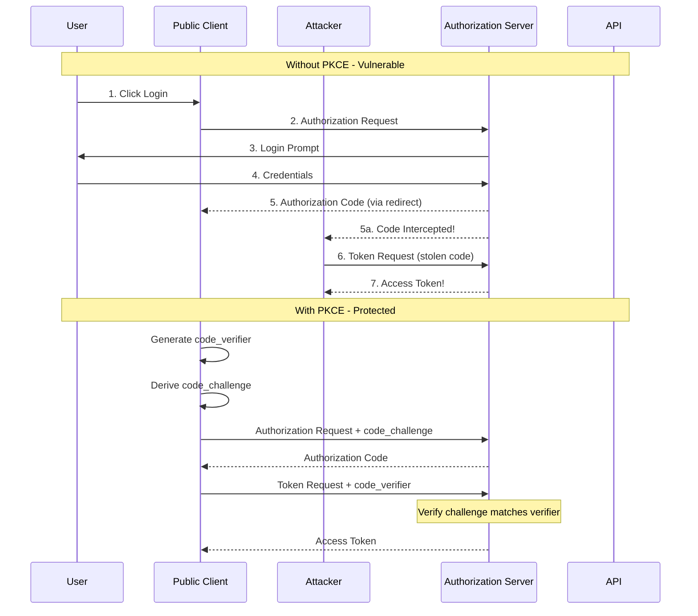
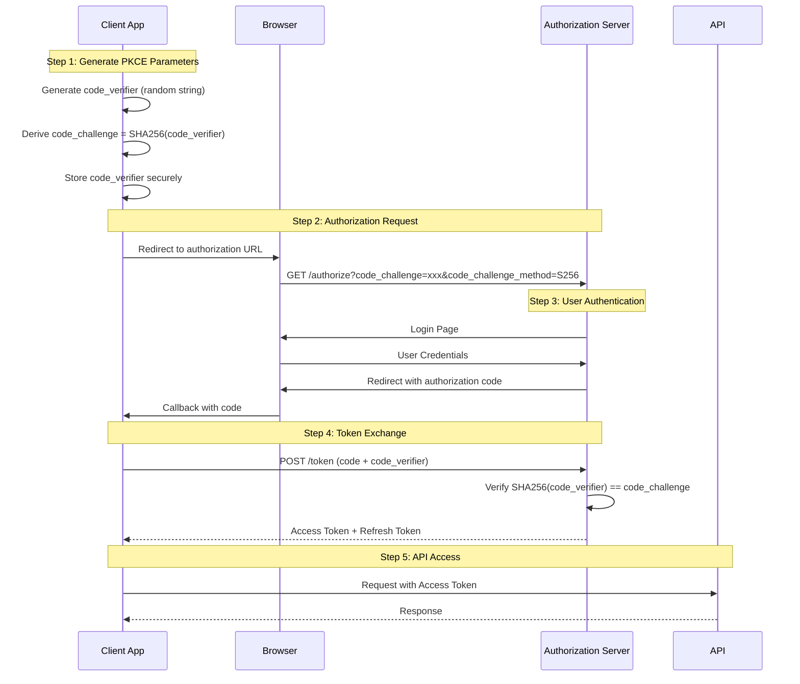
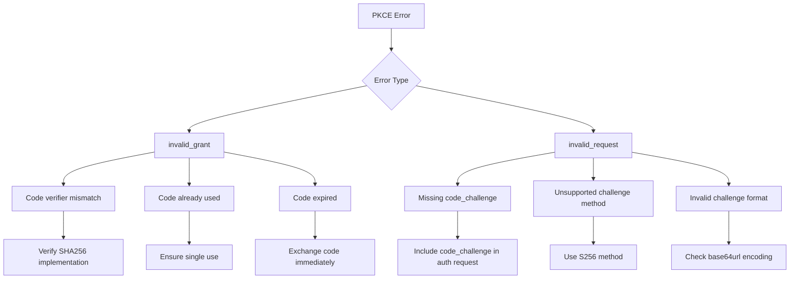

# How to Configure OAuth2 with PKCE Flow

Author: [nawazdhandala](https://www.github.com/nawazdhandala)

Tags: OAuth2, PKCE, Security, Authentication, API

Description: Learn how to implement OAuth2 Authorization Code flow with PKCE for secure authentication in public clients like SPAs and mobile apps.

---

PKCE (Proof Key for Code Exchange, pronounced "pixy") is an extension to the OAuth2 Authorization Code flow that protects against authorization code interception attacks. It is essential for public clients like single-page applications (SPAs) and mobile apps that cannot securely store client secrets.

## Why PKCE is Necessary



## PKCE Flow Overview



## Implementation

### Step 1: Generate PKCE Parameters

```python
import secrets
import hashlib
import base64
from dataclasses import dataclass
from typing import Optional

@dataclass
class PKCEParameters:
    """PKCE code verifier and challenge pair."""
    code_verifier: str
    code_challenge: str
    code_challenge_method: str = "S256"


def generate_pkce_parameters() -> PKCEParameters:
    """
    Generate PKCE code verifier and challenge.

    The code_verifier is a cryptographically random string between 43-128 chars.
    The code_challenge is the Base64-URL-encoded SHA256 hash of the verifier.
    """
    # Generate code_verifier: 32 bytes = 43 base64url characters
    # Using 64 bytes for extra security (86 characters)
    random_bytes = secrets.token_bytes(64)
    code_verifier = base64.urlsafe_b64encode(random_bytes).decode('utf-8').rstrip('=')

    # Generate code_challenge: SHA256 hash of verifier, base64url encoded
    verifier_bytes = code_verifier.encode('utf-8')
    sha256_hash = hashlib.sha256(verifier_bytes).digest()
    code_challenge = base64.urlsafe_b64encode(sha256_hash).decode('utf-8').rstrip('=')

    return PKCEParameters(
        code_verifier=code_verifier,
        code_challenge=code_challenge,
        code_challenge_method="S256"
    )


# Verify the implementation
def verify_pkce_challenge(code_verifier: str, code_challenge: str) -> bool:
    """
    Verify that a code_challenge matches the code_verifier.
    This is what the authorization server does during token exchange.
    """
    verifier_bytes = code_verifier.encode('utf-8')
    sha256_hash = hashlib.sha256(verifier_bytes).digest()
    computed_challenge = base64.urlsafe_b64encode(sha256_hash).decode('utf-8').rstrip('=')

    return computed_challenge == code_challenge


# Example usage
pkce = generate_pkce_parameters()
print(f"Code Verifier: {pkce.code_verifier}")
print(f"Code Challenge: {pkce.code_challenge}")
print(f"Method: {pkce.code_challenge_method}")
print(f"Verification: {verify_pkce_challenge(pkce.code_verifier, pkce.code_challenge)}")
```

### Step 2: Build Authorization URL

```python
import urllib.parse
import secrets
from typing import Optional, List

class OAuth2PKCEClient:
    """
    OAuth2 client with PKCE support for public clients.
    """

    def __init__(
        self,
        client_id: str,
        authorization_url: str,
        token_url: str,
        redirect_uri: str,
        scopes: Optional[List[str]] = None
    ):
        self.client_id = client_id
        self.authorization_url = authorization_url
        self.token_url = token_url
        self.redirect_uri = redirect_uri
        self.scopes = scopes or []

        # Storage for PKCE and state parameters
        self._pkce: Optional[PKCEParameters] = None
        self._state: Optional[str] = None

    def get_authorization_url(
        self,
        additional_scopes: Optional[List[str]] = None,
        extra_params: Optional[dict] = None
    ) -> str:
        """
        Generate the authorization URL with PKCE parameters.
        Returns the URL to redirect the user to.
        """
        # Generate new PKCE parameters
        self._pkce = generate_pkce_parameters()

        # Generate state for CSRF protection
        self._state = secrets.token_urlsafe(32)

        # Build scopes
        all_scopes = self.scopes + (additional_scopes or [])
        scope_string = " ".join(all_scopes)

        # Build query parameters
        params = {
            "response_type": "code",
            "client_id": self.client_id,
            "redirect_uri": self.redirect_uri,
            "state": self._state,
            "code_challenge": self._pkce.code_challenge,
            "code_challenge_method": self._pkce.code_challenge_method
        }

        if scope_string:
            params["scope"] = scope_string

        # Add any extra parameters
        if extra_params:
            params.update(extra_params)

        # Build URL
        query_string = urllib.parse.urlencode(params)
        return f"{self.authorization_url}?{query_string}"

    def get_pkce_verifier(self) -> str:
        """Get the current code verifier (needed for token exchange)."""
        if self._pkce is None:
            raise ValueError("No PKCE parameters generated. Call get_authorization_url first.")
        return self._pkce.code_verifier

    def get_state(self) -> str:
        """Get the current state (needed for validation)."""
        if self._state is None:
            raise ValueError("No state generated. Call get_authorization_url first.")
        return self._state


# Example usage
client = OAuth2PKCEClient(
    client_id="your_client_id",
    authorization_url="https://auth.example.com/authorize",
    token_url="https://auth.example.com/token",
    redirect_uri="https://yourapp.com/callback",
    scopes=["openid", "profile", "email"]
)

# Generate authorization URL
auth_url = client.get_authorization_url(
    additional_scopes=["offline_access"],  # For refresh token
    extra_params={"prompt": "consent"}
)

print(f"Redirect user to: {auth_url}")
print(f"Store code_verifier: {client.get_pkce_verifier()}")
print(f"Store state: {client.get_state()}")
```

### Step 3: Handle Callback and Exchange Code for Tokens

```python
import requests
from typing import Optional

class OAuth2PKCETokenExchange:
    """
    Handle OAuth2 callback and token exchange with PKCE.
    """

    def __init__(
        self,
        client_id: str,
        token_url: str,
        redirect_uri: str
    ):
        self.client_id = client_id
        self.token_url = token_url
        self.redirect_uri = redirect_uri

    def exchange_code(
        self,
        authorization_code: str,
        code_verifier: str,
        expected_state: str,
        received_state: str
    ) -> dict:
        """
        Exchange authorization code for tokens using PKCE.

        Args:
            authorization_code: The code received from the authorization server
            code_verifier: The PKCE code verifier generated earlier
            expected_state: The state we sent in the authorization request
            received_state: The state returned in the callback

        Returns:
            Token response containing access_token, refresh_token, etc.
        """
        # Step 1: Validate state to prevent CSRF
        if not secrets.compare_digest(expected_state, received_state):
            raise SecurityError("State mismatch - possible CSRF attack")

        # Step 2: Exchange code for tokens
        response = requests.post(
            self.token_url,
            data={
                "grant_type": "authorization_code",
                "code": authorization_code,
                "redirect_uri": self.redirect_uri,
                "client_id": self.client_id,
                "code_verifier": code_verifier  # PKCE proof
            },
            headers={
                "Content-Type": "application/x-www-form-urlencoded"
            },
            timeout=30
        )

        if response.status_code != 200:
            error_data = response.json()
            error = error_data.get("error")
            description = error_data.get("error_description", "")

            if error == "invalid_grant":
                if "code_verifier" in description.lower() or "pkce" in description.lower():
                    raise PKCEVerificationError(
                        "PKCE verification failed. Code verifier does not match challenge."
                    )
                raise InvalidGrantError(f"Invalid grant: {description}")

            raise OAuth2Error(f"{error}: {description}")

        return response.json()


class SecurityError(Exception):
    pass


class PKCEVerificationError(Exception):
    pass


class InvalidGrantError(Exception):
    pass


class OAuth2Error(Exception):
    pass
```

### Complete Flask Implementation

```python
from flask import Flask, redirect, request, session, url_for
import secrets
import os

app = Flask(__name__)
app.secret_key = secrets.token_hex(32)

# Configuration
OAUTH_CONFIG = {
    "client_id": os.environ.get("OAUTH_CLIENT_ID"),
    "authorization_url": "https://auth.example.com/authorize",
    "token_url": "https://auth.example.com/token",
    "redirect_uri": "http://localhost:5000/callback",
    "scopes": ["openid", "profile", "email", "offline_access"]
}


@app.route("/login")
def login():
    """
    Initiate OAuth2 login with PKCE.
    """
    # Generate PKCE parameters
    pkce = generate_pkce_parameters()

    # Generate state for CSRF protection
    state = secrets.token_urlsafe(32)

    # Store in session (secure, server-side storage)
    session["pkce_verifier"] = pkce.code_verifier
    session["oauth_state"] = state

    # Build authorization URL
    params = {
        "response_type": "code",
        "client_id": OAUTH_CONFIG["client_id"],
        "redirect_uri": OAUTH_CONFIG["redirect_uri"],
        "scope": " ".join(OAUTH_CONFIG["scopes"]),
        "state": state,
        "code_challenge": pkce.code_challenge,
        "code_challenge_method": "S256"
    }

    auth_url = f"{OAUTH_CONFIG['authorization_url']}?{urllib.parse.urlencode(params)}"

    return redirect(auth_url)


@app.route("/callback")
def callback():
    """
    Handle OAuth2 callback and exchange code for tokens.
    """
    # Check for errors
    error = request.args.get("error")
    if error:
        error_description = request.args.get("error_description", "Unknown error")
        return f"Authentication failed: {error} - {error_description}", 400

    # Get authorization code
    code = request.args.get("code")
    if not code:
        return "No authorization code received", 400

    # Validate state
    received_state = request.args.get("state")
    expected_state = session.get("oauth_state")

    if not expected_state or not secrets.compare_digest(expected_state, received_state or ""):
        return "Invalid state parameter - possible CSRF attack", 400

    # Get PKCE verifier from session
    code_verifier = session.get("pkce_verifier")
    if not code_verifier:
        return "No PKCE verifier found - session may have expired", 400

    # Exchange code for tokens
    try:
        response = requests.post(
            OAUTH_CONFIG["token_url"],
            data={
                "grant_type": "authorization_code",
                "code": code,
                "redirect_uri": OAUTH_CONFIG["redirect_uri"],
                "client_id": OAUTH_CONFIG["client_id"],
                "code_verifier": code_verifier
            },
            timeout=30
        )

        if response.status_code != 200:
            error_data = response.json()
            return f"Token exchange failed: {error_data}", 400

        tokens = response.json()

        # Clear PKCE/state from session
        session.pop("pkce_verifier", None)
        session.pop("oauth_state", None)

        # Store tokens securely
        session["access_token"] = tokens["access_token"]
        session["refresh_token"] = tokens.get("refresh_token")
        session["id_token"] = tokens.get("id_token")

        return redirect(url_for("dashboard"))

    except requests.exceptions.RequestException as e:
        return f"Token exchange error: {e}", 500


@app.route("/dashboard")
def dashboard():
    """Protected page requiring authentication."""
    access_token = session.get("access_token")

    if not access_token:
        return redirect(url_for("login"))

    return f"Welcome! Your access token starts with: {access_token[:20]}..."


@app.route("/logout")
def logout():
    """Clear session and logout."""
    session.clear()
    return redirect(url_for("index"))


@app.route("/")
def index():
    return '<a href="/login">Login with OAuth2 + PKCE</a>'


if __name__ == "__main__":
    app.run(debug=True)
```

### JavaScript/SPA Implementation

```javascript
// pkce.js - PKCE utilities for browser-based apps

/**
 * Generate a cryptographically random code verifier
 */
function generateCodeVerifier() {
    const array = new Uint8Array(64);
    crypto.getRandomValues(array);
    return base64URLEncode(array);
}

/**
 * Generate code challenge from verifier using SHA-256
 */
async function generateCodeChallenge(verifier) {
    const encoder = new TextEncoder();
    const data = encoder.encode(verifier);
    const hash = await crypto.subtle.digest('SHA-256', data);
    return base64URLEncode(new Uint8Array(hash));
}

/**
 * Base64 URL encode (no padding, URL-safe characters)
 */
function base64URLEncode(buffer) {
    let binary = '';
    const bytes = new Uint8Array(buffer);
    for (let i = 0; i < bytes.byteLength; i++) {
        binary += String.fromCharCode(bytes[i]);
    }
    return btoa(binary)
        .replace(/\+/g, '-')
        .replace(/\//g, '_')
        .replace(/=+$/, '');
}

/**
 * Generate random state for CSRF protection
 */
function generateState() {
    const array = new Uint8Array(32);
    crypto.getRandomValues(array);
    return base64URLEncode(array);
}

/**
 * OAuth2 PKCE Client for SPAs
 */
class OAuth2PKCEClient {
    constructor(config) {
        this.clientId = config.clientId;
        this.authorizationUrl = config.authorizationUrl;
        this.tokenUrl = config.tokenUrl;
        this.redirectUri = config.redirectUri;
        this.scopes = config.scopes || [];
    }

    /**
     * Start the authorization flow
     */
    async authorize() {
        // Generate PKCE parameters
        const codeVerifier = generateCodeVerifier();
        const codeChallenge = await generateCodeChallenge(codeVerifier);
        const state = generateState();

        // Store verifier and state securely
        // Using sessionStorage for SPAs (cleared when tab closes)
        sessionStorage.setItem('pkce_verifier', codeVerifier);
        sessionStorage.setItem('oauth_state', state);

        // Build authorization URL
        const params = new URLSearchParams({
            response_type: 'code',
            client_id: this.clientId,
            redirect_uri: this.redirectUri,
            scope: this.scopes.join(' '),
            state: state,
            code_challenge: codeChallenge,
            code_challenge_method: 'S256'
        });

        // Redirect to authorization server
        window.location.href = `${this.authorizationUrl}?${params.toString()}`;
    }

    /**
     * Handle the callback and exchange code for tokens
     */
    async handleCallback() {
        const params = new URLSearchParams(window.location.search);

        // Check for errors
        const error = params.get('error');
        if (error) {
            throw new Error(`OAuth error: ${error} - ${params.get('error_description')}`);
        }

        // Get authorization code
        const code = params.get('code');
        if (!code) {
            throw new Error('No authorization code in callback');
        }

        // Validate state
        const receivedState = params.get('state');
        const expectedState = sessionStorage.getItem('oauth_state');

        if (!expectedState || receivedState !== expectedState) {
            throw new Error('State mismatch - possible CSRF attack');
        }

        // Get PKCE verifier
        const codeVerifier = sessionStorage.getItem('pkce_verifier');
        if (!codeVerifier) {
            throw new Error('No PKCE verifier found');
        }

        // Exchange code for tokens
        const response = await fetch(this.tokenUrl, {
            method: 'POST',
            headers: {
                'Content-Type': 'application/x-www-form-urlencoded'
            },
            body: new URLSearchParams({
                grant_type: 'authorization_code',
                code: code,
                redirect_uri: this.redirectUri,
                client_id: this.clientId,
                code_verifier: codeVerifier
            })
        });

        if (!response.ok) {
            const errorData = await response.json();
            throw new Error(`Token exchange failed: ${errorData.error}`);
        }

        // Clear PKCE/state from storage
        sessionStorage.removeItem('pkce_verifier');
        sessionStorage.removeItem('oauth_state');

        // Clear URL parameters
        window.history.replaceState({}, document.title, window.location.pathname);

        return await response.json();
    }

    /**
     * Refresh tokens
     */
    async refreshToken(refreshToken) {
        const response = await fetch(this.tokenUrl, {
            method: 'POST',
            headers: {
                'Content-Type': 'application/x-www-form-urlencoded'
            },
            body: new URLSearchParams({
                grant_type: 'refresh_token',
                refresh_token: refreshToken,
                client_id: this.clientId
            })
        });

        if (!response.ok) {
            throw new Error('Token refresh failed');
        }

        return await response.json();
    }
}

// Usage example
const oauth = new OAuth2PKCEClient({
    clientId: 'your-client-id',
    authorizationUrl: 'https://auth.example.com/authorize',
    tokenUrl: 'https://auth.example.com/token',
    redirectUri: 'https://yourapp.com/callback',
    scopes: ['openid', 'profile', 'email', 'offline_access']
});

// Login button handler
document.getElementById('login-btn').addEventListener('click', () => {
    oauth.authorize();
});

// Callback page handler
if (window.location.pathname === '/callback') {
    oauth.handleCallback()
        .then(tokens => {
            console.log('Logged in!', tokens);
            // Store tokens and redirect
            localStorage.setItem('access_token', tokens.access_token);
            localStorage.setItem('refresh_token', tokens.refresh_token);
            window.location.href = '/dashboard';
        })
        .catch(error => {
            console.error('Login failed:', error);
            alert(error.message);
        });
}
```

### Mobile App Implementation (React Native)

```javascript
// oauth-pkce.js for React Native

import * as Crypto from 'expo-crypto';
import * as WebBrowser from 'expo-web-browser';
import * as Linking from 'expo-linking';
import * as SecureStore from 'expo-secure-store';

/**
 * Generate PKCE parameters for mobile apps
 */
async function generatePKCE() {
    // Generate random bytes for verifier
    const randomBytes = await Crypto.getRandomBytesAsync(64);
    const codeVerifier = base64URLEncode(randomBytes);

    // Generate challenge
    const hash = await Crypto.digestStringAsync(
        Crypto.CryptoDigestAlgorithm.SHA256,
        codeVerifier,
        { encoding: Crypto.CryptoEncoding.BASE64 }
    );

    // Convert base64 to base64url
    const codeChallenge = hash
        .replace(/\+/g, '-')
        .replace(/\//g, '_')
        .replace(/=+$/, '');

    return { codeVerifier, codeChallenge };
}

function base64URLEncode(buffer) {
    const base64 = btoa(String.fromCharCode.apply(null, buffer));
    return base64
        .replace(/\+/g, '-')
        .replace(/\//g, '_')
        .replace(/=+$/, '');
}

/**
 * OAuth2 PKCE Client for React Native
 */
class MobileOAuth2Client {
    constructor(config) {
        this.clientId = config.clientId;
        this.authorizationUrl = config.authorizationUrl;
        this.tokenUrl = config.tokenUrl;
        this.redirectUri = config.redirectUri || Linking.createURL('callback');
        this.scopes = config.scopes || [];
    }

    /**
     * Perform OAuth2 login with PKCE
     */
    async login() {
        // Generate PKCE parameters
        const { codeVerifier, codeChallenge } = await generatePKCE();
        const state = await this._generateState();

        // Store verifier securely
        await SecureStore.setItemAsync('pkce_verifier', codeVerifier);
        await SecureStore.setItemAsync('oauth_state', state);

        // Build authorization URL
        const params = new URLSearchParams({
            response_type: 'code',
            client_id: this.clientId,
            redirect_uri: this.redirectUri,
            scope: this.scopes.join(' '),
            state: state,
            code_challenge: codeChallenge,
            code_challenge_method: 'S256'
        });

        const authUrl = `${this.authorizationUrl}?${params.toString()}`;

        // Open browser for authentication
        const result = await WebBrowser.openAuthSessionAsync(
            authUrl,
            this.redirectUri
        );

        if (result.type === 'success') {
            return await this._handleCallback(result.url);
        } else if (result.type === 'cancel') {
            throw new Error('Authentication cancelled');
        } else {
            throw new Error('Authentication failed');
        }
    }

    async _generateState() {
        const randomBytes = await Crypto.getRandomBytesAsync(32);
        return base64URLEncode(randomBytes);
    }

    async _handleCallback(callbackUrl) {
        const url = new URL(callbackUrl);
        const params = new URLSearchParams(url.search);

        // Check for errors
        const error = params.get('error');
        if (error) {
            throw new Error(`OAuth error: ${error}`);
        }

        // Validate state
        const receivedState = params.get('state');
        const expectedState = await SecureStore.getItemAsync('oauth_state');

        if (receivedState !== expectedState) {
            throw new Error('State mismatch');
        }

        // Get code and verifier
        const code = params.get('code');
        const codeVerifier = await SecureStore.getItemAsync('pkce_verifier');

        // Exchange code for tokens
        const response = await fetch(this.tokenUrl, {
            method: 'POST',
            headers: {
                'Content-Type': 'application/x-www-form-urlencoded'
            },
            body: new URLSearchParams({
                grant_type: 'authorization_code',
                code: code,
                redirect_uri: this.redirectUri,
                client_id: this.clientId,
                code_verifier: codeVerifier
            }).toString()
        });

        // Clear stored PKCE/state
        await SecureStore.deleteItemAsync('pkce_verifier');
        await SecureStore.deleteItemAsync('oauth_state');

        if (!response.ok) {
            throw new Error('Token exchange failed');
        }

        const tokens = await response.json();

        // Store tokens securely
        await SecureStore.setItemAsync('access_token', tokens.access_token);
        if (tokens.refresh_token) {
            await SecureStore.setItemAsync('refresh_token', tokens.refresh_token);
        }

        return tokens;
    }

    async refreshToken() {
        const refreshToken = await SecureStore.getItemAsync('refresh_token');

        if (!refreshToken) {
            throw new Error('No refresh token available');
        }

        const response = await fetch(this.tokenUrl, {
            method: 'POST',
            headers: {
                'Content-Type': 'application/x-www-form-urlencoded'
            },
            body: new URLSearchParams({
                grant_type: 'refresh_token',
                refresh_token: refreshToken,
                client_id: this.clientId
            }).toString()
        });

        if (!response.ok) {
            // Refresh token expired - need to re-authenticate
            await this.logout();
            throw new Error('Session expired');
        }

        const tokens = await response.json();

        // Update stored tokens
        await SecureStore.setItemAsync('access_token', tokens.access_token);
        if (tokens.refresh_token) {
            await SecureStore.setItemAsync('refresh_token', tokens.refresh_token);
        }

        return tokens;
    }

    async logout() {
        await SecureStore.deleteItemAsync('access_token');
        await SecureStore.deleteItemAsync('refresh_token');
    }

    async getAccessToken() {
        return await SecureStore.getItemAsync('access_token');
    }
}

export default MobileOAuth2Client;
```

## Common PKCE Errors and Solutions



### Error Handling

```python
def handle_pkce_error(error: str, description: str) -> str:
    """
    Provide helpful error messages for PKCE-related errors.
    """
    common_issues = {
        "code_verifier": [
            "Verify code_verifier is stored correctly between requests",
            "Ensure code_verifier is at least 43 characters",
            "Check that code_verifier uses only valid characters (A-Z, a-z, 0-9, -, _, ~, .)"
        ],
        "code_challenge": [
            "Verify SHA256 implementation is correct",
            "Ensure base64url encoding (no + or /, no padding)",
            "Check that code_challenge is derived from the same code_verifier"
        ],
        "expired": [
            "Authorization codes are typically valid for 30-60 seconds",
            "Exchange the code immediately after receiving it",
            "Check for clock skew between client and server"
        ],
        "method": [
            "Use 'S256' for code_challenge_method (required by most providers)",
            "Plain method is deprecated and may not be supported"
        ]
    }

    recommendations = []

    for keyword, tips in common_issues.items():
        if keyword in description.lower():
            recommendations.extend(tips)

    if not recommendations:
        recommendations = [
            "Verify PKCE parameters are generated correctly",
            "Ensure code_verifier is stored and retrieved correctly",
            "Check authorization server documentation for PKCE requirements"
        ]

    return f"Error: {error}\nDescription: {description}\n\nRecommendations:\n" + \
           "\n".join(f"  - {r}" for r in recommendations)
```

## Security Best Practices

| Practice | Description |
|----------|-------------|
| Use S256 method | Always use SHA256 for code challenge, not plain |
| Secure storage | Store code_verifier in secure, server-side session or secure storage |
| State validation | Always validate state parameter to prevent CSRF |
| Single use | Ensure authorization codes are used only once |
| HTTPS only | Use HTTPS for all OAuth2 endpoints |
| Short-lived codes | Exchange codes immediately (they expire quickly) |
| Secure redirect URI | Use custom schemes or universal links for mobile apps |

## Summary

PKCE is essential for securing OAuth2 in public clients. Key implementation points:

- Generate a cryptographically random code_verifier (43-128 characters)
- Derive code_challenge using SHA256 and base64url encoding
- Include code_challenge and code_challenge_method in authorization request
- Store code_verifier securely until token exchange
- Send code_verifier with token request for verification
- Always validate state parameter to prevent CSRF attacks
- Use secure storage appropriate for your platform (session, SecureStore, etc.)
