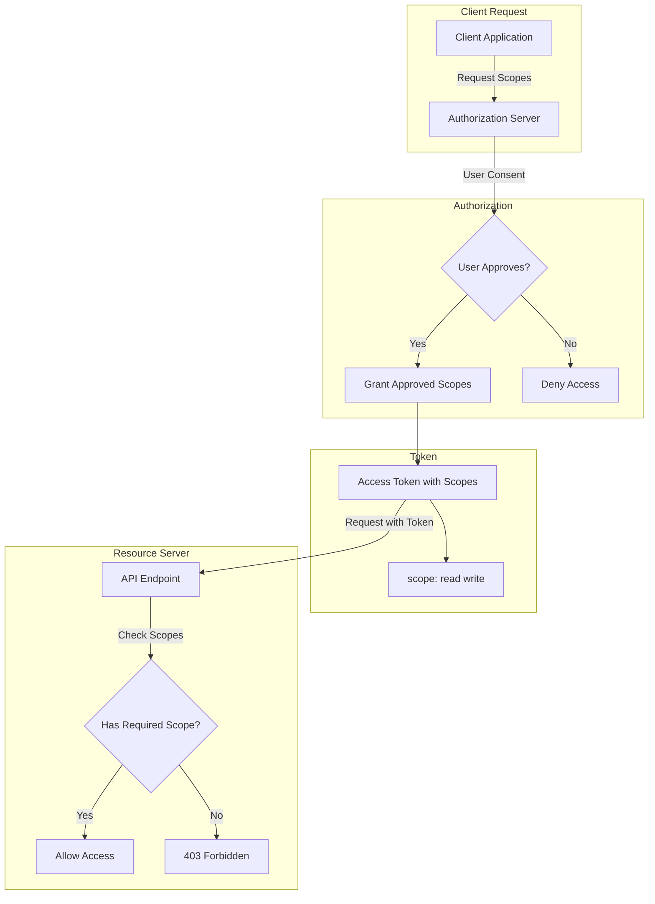
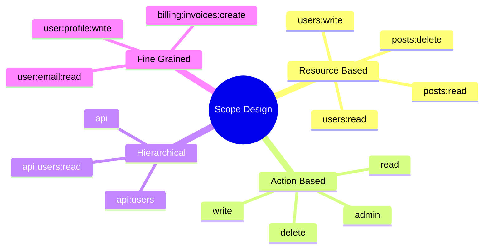
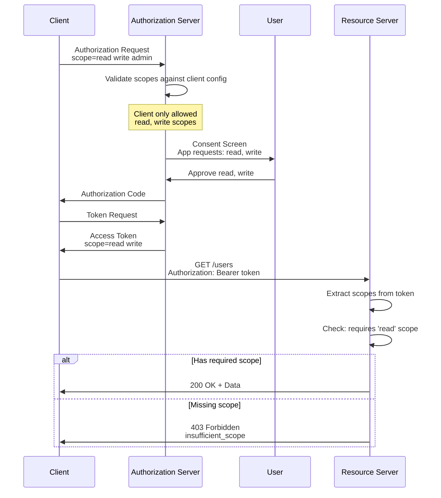
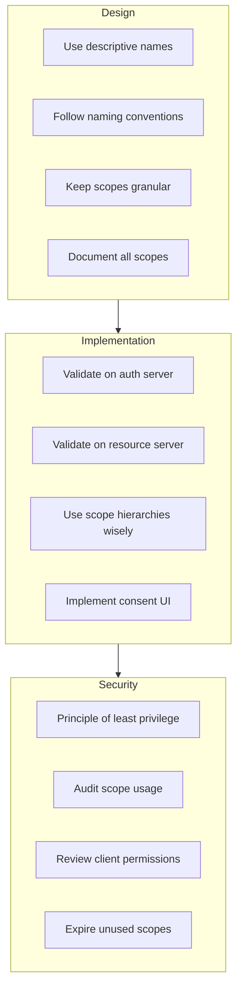

# How to Configure OAuth2 Scopes Properly

Author: [nawazdhandala](https://www.github.com/nawazdhandala)

Tags: OAuth2, Scopes, Authorization, Security, Access Control

Description: Learn how to properly configure OAuth2 scopes for fine-grained access control including scope design patterns, validation strategies, and best practices for scope management.

---

OAuth2 scopes provide a mechanism for limiting the access granted to access tokens. Properly configured scopes enable fine-grained access control and follow the principle of least privilege. This guide covers comprehensive scope configuration strategies with practical implementations.

## Understanding OAuth2 Scopes



## Scope Design Patterns



## Scope Configuration in Authorization Server

```javascript
// scope-config.js
// Comprehensive OAuth2 scope configuration for authorization server

const ScopeDefinitions = {
    // Basic scopes
    'openid': {
        description: 'Access your user identifier',
        claims: ['sub'],
        default: true,
        required: false
    },
    'profile': {
        description: 'Access your basic profile information',
        claims: ['name', 'family_name', 'given_name', 'picture', 'updated_at'],
        default: false,
        required: false
    },
    'email': {
        description: 'Access your email address',
        claims: ['email', 'email_verified'],
        default: false,
        required: false
    },

    // API scopes - Resource based
    'users:read': {
        description: 'Read user information',
        permissions: ['GET /users', 'GET /users/:id'],
        default: false,
        required: false
    },
    'users:write': {
        description: 'Create and update users',
        permissions: ['POST /users', 'PUT /users/:id', 'PATCH /users/:id'],
        default: false,
        required: false
    },
    'users:delete': {
        description: 'Delete users',
        permissions: ['DELETE /users/:id'],
        default: false,
        required: false,
        sensitive: true
    },

    // Hierarchical scopes
    'admin': {
        description: 'Full administrative access',
        includes: ['users:read', 'users:write', 'users:delete', 'settings:read', 'settings:write'],
        default: false,
        required: false,
        sensitive: true,
        requiresApproval: true
    },

    // Offline access
    'offline_access': {
        description: 'Access your data when you are not present',
        grantsRefreshToken: true,
        default: false,
        required: false
    }
};

class ScopeManager {
    constructor(definitions = ScopeDefinitions) {
        this.definitions = definitions;
        this.scopeCache = new Map();
    }

    // Parse scope string into array
    parseScopes(scopeString) {
        if (!scopeString) return [];
        if (Array.isArray(scopeString)) return scopeString;
        return scopeString.split(/\s+/).filter(Boolean);
    }

    // Validate requested scopes
    validateScopes(requestedScopes, clientAllowedScopes) {
        const scopes = this.parseScopes(requestedScopes);
        const allowed = this.parseScopes(clientAllowedScopes);

        const result = {
            valid: [],
            invalid: [],
            expanded: []
        };

        for (const scope of scopes) {
            // Check if scope exists
            if (!this.definitions[scope]) {
                result.invalid.push({
                    scope,
                    reason: 'Unknown scope'
                });
                continue;
            }

            // Check if client is allowed this scope
            if (allowed.length > 0 && !allowed.includes(scope)) {
                result.invalid.push({
                    scope,
                    reason: 'Scope not allowed for this client'
                });
                continue;
            }

            result.valid.push(scope);

            // Expand hierarchical scopes
            const definition = this.definitions[scope];
            if (definition.includes) {
                result.expanded.push(...definition.includes);
            }
        }

        // Remove duplicates from expanded
        result.expanded = [...new Set([...result.valid, ...result.expanded])];

        return result;
    }

    // Get default scopes for a client
    getDefaultScopes(clientAllowedScopes) {
        const allowed = this.parseScopes(clientAllowedScopes);
        const defaults = [];

        for (const [scope, definition] of Object.entries(this.definitions)) {
            if (definition.default) {
                if (allowed.length === 0 || allowed.includes(scope)) {
                    defaults.push(scope);
                }
            }
        }

        return defaults;
    }

    // Check if scope grants specific permission
    hasPermission(scopes, permission) {
        const scopeArray = this.parseScopes(scopes);

        for (const scope of scopeArray) {
            const definition = this.definitions[scope];
            if (!definition) continue;

            // Check direct permissions
            if (definition.permissions && definition.permissions.includes(permission)) {
                return true;
            }

            // Check included scopes recursively
            if (definition.includes) {
                if (this.hasPermission(definition.includes, permission)) {
                    return true;
                }
            }
        }

        return false;
    }

    // Get scope description for consent screen
    getScopeDescriptions(scopes) {
        const scopeArray = this.parseScopes(scopes);
        const descriptions = [];

        for (const scope of scopeArray) {
            const definition = this.definitions[scope];
            if (definition) {
                descriptions.push({
                    scope,
                    description: definition.description,
                    sensitive: definition.sensitive || false
                });
            }
        }

        return descriptions;
    }

    // Check if scopes require special approval
    requiresApproval(scopes) {
        const scopeArray = this.parseScopes(scopes);

        for (const scope of scopeArray) {
            const definition = this.definitions[scope];
            if (definition && definition.requiresApproval) {
                return true;
            }
        }

        return false;
    }

    // Filter scopes based on user consent
    filterByConsent(requestedScopes, consentedScopes) {
        const requested = this.parseScopes(requestedScopes);
        const consented = this.parseScopes(consentedScopes);

        return requested.filter(scope => consented.includes(scope));
    }

    // Get claims for OpenID Connect scopes
    getClaimsForScopes(scopes) {
        const scopeArray = this.parseScopes(scopes);
        const claims = new Set();

        for (const scope of scopeArray) {
            const definition = this.definitions[scope];
            if (definition && definition.claims) {
                definition.claims.forEach(claim => claims.add(claim));
            }
        }

        return Array.from(claims);
    }
}

module.exports = { ScopeManager, ScopeDefinitions };
```

## Client Scope Configuration

```javascript
// client-config.js
// Client-specific scope configuration

const ClientScopeConfig = {
    // Web application - full access
    'web-app': {
        clientId: 'web-app-client-id',
        allowedScopes: [
            'openid',
            'profile',
            'email',
            'users:read',
            'users:write',
            'offline_access'
        ],
        defaultScopes: ['openid', 'profile'],
        maxTokenLifetime: 3600, // 1 hour
        allowRefreshTokens: true
    },

    // Mobile app - limited scope
    'mobile-app': {
        clientId: 'mobile-app-client-id',
        allowedScopes: [
            'openid',
            'profile',
            'users:read',
            'offline_access'
        ],
        defaultScopes: ['openid'],
        maxTokenLifetime: 7200, // 2 hours
        allowRefreshTokens: true
    },

    // Machine-to-machine - specific scopes
    'm2m-service': {
        clientId: 'm2m-service-client-id',
        allowedScopes: [
            'users:read',
            'users:write'
        ],
        defaultScopes: ['users:read'],
        maxTokenLifetime: 900, // 15 minutes
        allowRefreshTokens: false
    },

    // Third-party integration - very limited
    'third-party': {
        clientId: 'third-party-client-id',
        allowedScopes: [
            'users:read'
        ],
        defaultScopes: [],
        maxTokenLifetime: 1800, // 30 minutes
        allowRefreshTokens: false,
        requireConsent: true
    }
};

class ClientScopeValidator {
    constructor(clientConfigs = ClientScopeConfig) {
        this.clients = clientConfigs;
    }

    // Get client configuration
    getClient(clientId) {
        const client = Object.values(this.clients).find(c => c.clientId === clientId);
        if (!client) {
            throw new Error(`Unknown client: ${clientId}`);
        }
        return client;
    }

    // Validate and filter scopes for client
    validateClientScopes(clientId, requestedScopes) {
        const client = this.getClient(clientId);
        const scopes = Array.isArray(requestedScopes)
            ? requestedScopes
            : requestedScopes.split(/\s+/);

        const result = {
            granted: [],
            denied: [],
            default: false
        };

        // If no scopes requested, use defaults
        if (scopes.length === 0 || (scopes.length === 1 && scopes[0] === '')) {
            result.granted = [...client.defaultScopes];
            result.default = true;
            return result;
        }

        // Validate each requested scope
        for (const scope of scopes) {
            if (client.allowedScopes.includes(scope)) {
                result.granted.push(scope);
            } else {
                result.denied.push(scope);
            }
        }

        return result;
    }

    // Check if client requires user consent
    requiresConsent(clientId) {
        const client = this.getClient(clientId);
        return client.requireConsent === true;
    }

    // Get token configuration for client
    getTokenConfig(clientId) {
        const client = this.getClient(clientId);
        return {
            maxLifetime: client.maxTokenLifetime,
            allowRefreshTokens: client.allowRefreshTokens
        };
    }
}

module.exports = { ClientScopeValidator, ClientScopeConfig };
```

## Scope Validation Middleware

```javascript
// middleware/scope-validator.js
// Express middleware for validating OAuth2 scopes

function createScopeMiddleware(options = {}) {
    const { scopeClaimName = 'scope', delimiter = ' ' } = options;

    // Parse scopes from token
    function getTokenScopes(req) {
        const token = req.user || req.auth;
        if (!token) return [];

        const scopeClaim = token[scopeClaimName];
        if (!scopeClaim) return [];

        if (Array.isArray(scopeClaim)) return scopeClaim;
        return scopeClaim.split(delimiter).filter(Boolean);
    }

    // Require specific scopes
    function requireScopes(...requiredScopes) {
        return function(req, res, next) {
            const tokenScopes = getTokenScopes(req);

            // Check if token has all required scopes
            const missingScopes = requiredScopes.filter(
                scope => !tokenScopes.includes(scope)
            );

            if (missingScopes.length > 0) {
                return res.status(403).json({
                    error: 'insufficient_scope',
                    error_description: `Missing required scopes: ${missingScopes.join(', ')}`,
                    required_scopes: requiredScopes,
                    token_scopes: tokenScopes
                });
            }

            next();
        };
    }

    // Require any of the specified scopes
    function requireAnyScope(...requiredScopes) {
        return function(req, res, next) {
            const tokenScopes = getTokenScopes(req);

            // Check if token has at least one required scope
            const hasScope = requiredScopes.some(
                scope => tokenScopes.includes(scope)
            );

            if (!hasScope) {
                return res.status(403).json({
                    error: 'insufficient_scope',
                    error_description: `Requires one of: ${requiredScopes.join(', ')}`,
                    required_scopes: requiredScopes,
                    token_scopes: tokenScopes
                });
            }

            next();
        };
    }

    // Check scope with pattern matching
    function requireScopePattern(pattern) {
        const regex = new RegExp(pattern);

        return function(req, res, next) {
            const tokenScopes = getTokenScopes(req);

            const hasMatchingScope = tokenScopes.some(scope => regex.test(scope));

            if (!hasMatchingScope) {
                return res.status(403).json({
                    error: 'insufficient_scope',
                    error_description: `Requires scope matching pattern: ${pattern}`,
                    token_scopes: tokenScopes
                });
            }

            next();
        };
    }

    // Dynamic scope based on resource
    function requireResourceScope(getResourceScope) {
        return async function(req, res, next) {
            const tokenScopes = getTokenScopes(req);

            // Get required scope based on request
            const requiredScope = await getResourceScope(req);

            if (!tokenScopes.includes(requiredScope)) {
                return res.status(403).json({
                    error: 'insufficient_scope',
                    error_description: `Missing required scope: ${requiredScope}`,
                    required_scope: requiredScope,
                    token_scopes: tokenScopes
                });
            }

            next();
        };
    }

    return {
        requireScopes,
        requireAnyScope,
        requireScopePattern,
        requireResourceScope,
        getTokenScopes
    };
}

module.exports = { createScopeMiddleware };
```

## Scope Validation Flow



## Python Scope Implementation

```python
# scope_manager.py
# Python implementation of OAuth2 scope management

from typing import List, Dict, Set, Optional, Any
from dataclasses import dataclass, field
from enum import Enum


class ScopeType(Enum):
    """Types of OAuth2 scopes."""
    OPENID = "openid"
    RESOURCE = "resource"
    ACTION = "action"
    ADMIN = "admin"


@dataclass
class ScopeDefinition:
    """Definition of an OAuth2 scope."""
    name: str
    description: str
    scope_type: ScopeType
    claims: List[str] = field(default_factory=list)
    permissions: List[str] = field(default_factory=list)
    includes: List[str] = field(default_factory=list)
    is_default: bool = False
    is_sensitive: bool = False
    requires_approval: bool = False


class ScopeRegistry:
    """Registry for OAuth2 scope definitions."""

    def __init__(self):
        self._scopes: Dict[str, ScopeDefinition] = {}
        self._register_default_scopes()

    def _register_default_scopes(self):
        """Register standard OpenID Connect scopes."""
        self.register(ScopeDefinition(
            name="openid",
            description="Access your user identifier",
            scope_type=ScopeType.OPENID,
            claims=["sub"],
            is_default=True
        ))

        self.register(ScopeDefinition(
            name="profile",
            description="Access your profile information",
            scope_type=ScopeType.OPENID,
            claims=["name", "family_name", "given_name", "picture"]
        ))

        self.register(ScopeDefinition(
            name="email",
            description="Access your email address",
            scope_type=ScopeType.OPENID,
            claims=["email", "email_verified"]
        ))

        self.register(ScopeDefinition(
            name="offline_access",
            description="Access your data when you are offline",
            scope_type=ScopeType.OPENID
        ))

    def register(self, scope: ScopeDefinition) -> None:
        """Register a scope definition."""
        self._scopes[scope.name] = scope

    def get(self, name: str) -> Optional[ScopeDefinition]:
        """Get a scope definition by name."""
        return self._scopes.get(name)

    def exists(self, name: str) -> bool:
        """Check if a scope exists."""
        return name in self._scopes

    def get_all(self) -> List[ScopeDefinition]:
        """Get all registered scopes."""
        return list(self._scopes.values())

    def get_defaults(self) -> List[str]:
        """Get default scope names."""
        return [s.name for s in self._scopes.values() if s.is_default]


class ScopeValidator:
    """Validates and processes OAuth2 scopes."""

    def __init__(self, registry: ScopeRegistry):
        self.registry = registry

    def parse(self, scope_string: str) -> List[str]:
        """Parse scope string into list of scopes."""
        if not scope_string:
            return []
        return [s.strip() for s in scope_string.split() if s.strip()]

    def validate(
        self,
        requested_scopes: List[str],
        allowed_scopes: Optional[List[str]] = None
    ) -> Dict[str, Any]:
        """
        Validate requested scopes.

        Returns dict with valid, invalid, and expanded scopes.
        """
        result = {
            "valid": [],
            "invalid": [],
            "expanded": set(),
            "sensitive": []
        }

        for scope in requested_scopes:
            # Check if scope exists
            definition = self.registry.get(scope)
            if not definition:
                result["invalid"].append({
                    "scope": scope,
                    "reason": "Unknown scope"
                })
                continue

            # Check if scope is allowed for client
            if allowed_scopes is not None and scope not in allowed_scopes:
                result["invalid"].append({
                    "scope": scope,
                    "reason": "Not allowed for this client"
                })
                continue

            result["valid"].append(scope)
            result["expanded"].add(scope)

            # Track sensitive scopes
            if definition.is_sensitive:
                result["sensitive"].append(scope)

            # Expand hierarchical scopes
            for included in definition.includes:
                result["expanded"].add(included)

        result["expanded"] = list(result["expanded"])
        return result

    def expand(self, scopes: List[str]) -> Set[str]:
        """Expand hierarchical scopes to include all child scopes."""
        expanded = set(scopes)

        for scope in scopes:
            definition = self.registry.get(scope)
            if definition and definition.includes:
                # Recursively expand included scopes
                expanded.update(self.expand(definition.includes))

        return expanded

    def get_permissions(self, scopes: List[str]) -> Set[str]:
        """Get all permissions granted by scopes."""
        permissions = set()
        expanded = self.expand(scopes)

        for scope in expanded:
            definition = self.registry.get(scope)
            if definition:
                permissions.update(definition.permissions)

        return permissions

    def get_claims(self, scopes: List[str]) -> Set[str]:
        """Get all claims associated with scopes."""
        claims = set()

        for scope in scopes:
            definition = self.registry.get(scope)
            if definition:
                claims.update(definition.claims)

        return claims

    def check_permission(self, scopes: List[str], permission: str) -> bool:
        """Check if scopes grant a specific permission."""
        permissions = self.get_permissions(scopes)
        return permission in permissions


@dataclass
class ClientScopeConfig:
    """Scope configuration for an OAuth2 client."""
    client_id: str
    allowed_scopes: List[str]
    default_scopes: List[str] = field(default_factory=list)
    require_consent: bool = True
    max_scope_count: int = 10


class ClientScopeManager:
    """Manages scope configurations for OAuth2 clients."""

    def __init__(self, validator: ScopeValidator):
        self.validator = validator
        self._clients: Dict[str, ClientScopeConfig] = {}

    def register_client(self, config: ClientScopeConfig) -> None:
        """Register a client scope configuration."""
        self._clients[config.client_id] = config

    def get_client(self, client_id: str) -> Optional[ClientScopeConfig]:
        """Get client configuration."""
        return self._clients.get(client_id)

    def validate_request(
        self,
        client_id: str,
        requested_scopes: str
    ) -> Dict[str, Any]:
        """
        Validate scope request for a client.

        Returns dict with granted and denied scopes.
        """
        config = self.get_client(client_id)
        if not config:
            raise ValueError(f"Unknown client: {client_id}")

        scopes = self.validator.parse(requested_scopes)

        # Use defaults if no scopes requested
        if not scopes:
            return {
                "granted": config.default_scopes.copy(),
                "denied": [],
                "used_defaults": True
            }

        # Limit scope count
        if len(scopes) > config.max_scope_count:
            scopes = scopes[:config.max_scope_count]

        # Validate against allowed scopes
        result = self.validator.validate(scopes, config.allowed_scopes)

        return {
            "granted": result["valid"],
            "denied": [i["scope"] for i in result["invalid"]],
            "used_defaults": False,
            "sensitive": result["sensitive"]
        }


# FastAPI dependency for scope validation
def create_scope_checker(required_scopes: List[str]):
    """Create a FastAPI dependency for scope checking."""
    from fastapi import Depends, HTTPException, status
    from fastapi.security import OAuth2PasswordBearer

    oauth2_scheme = OAuth2PasswordBearer(tokenUrl="token")

    async def check_scopes(token: str = Depends(oauth2_scheme)):
        # In practice, decode and verify the token here
        # This is a simplified example
        import jwt

        try:
            payload = jwt.decode(token, options={"verify_signature": False})
            token_scopes = payload.get("scope", "").split()
        except Exception:
            raise HTTPException(
                status_code=status.HTTP_401_UNAUTHORIZED,
                detail="Invalid token"
            )

        # Check if token has required scopes
        missing = [s for s in required_scopes if s not in token_scopes]
        if missing:
            raise HTTPException(
                status_code=status.HTTP_403_FORBIDDEN,
                detail={
                    "error": "insufficient_scope",
                    "required": required_scopes,
                    "missing": missing
                }
            )

        return payload

    return check_scopes


# Example usage
if __name__ == "__main__":
    # Setup registry and validator
    registry = ScopeRegistry()

    # Register custom scopes
    registry.register(ScopeDefinition(
        name="users:read",
        description="Read user data",
        scope_type=ScopeType.RESOURCE,
        permissions=["GET /users", "GET /users/*"]
    ))

    registry.register(ScopeDefinition(
        name="users:write",
        description="Modify user data",
        scope_type=ScopeType.RESOURCE,
        permissions=["POST /users", "PUT /users/*"]
    ))

    registry.register(ScopeDefinition(
        name="admin",
        description="Administrative access",
        scope_type=ScopeType.ADMIN,
        includes=["users:read", "users:write"],
        is_sensitive=True,
        requires_approval=True
    ))

    # Create validator
    validator = ScopeValidator(registry)

    # Validate scopes
    result = validator.validate(
        ["openid", "users:read", "unknown:scope"],
        allowed_scopes=["openid", "profile", "users:read"]
    )

    print("Valid scopes:", result["valid"])
    print("Invalid scopes:", result["invalid"])
    print("Expanded scopes:", result["expanded"])
```

## Express.js API with Scope Protection

```javascript
// app.js
// Express API with comprehensive scope-based access control

const express = require('express');
const jwt = require('express-jwt');
const { createScopeMiddleware } = require('./middleware/scope-validator');

const app = express();
app.use(express.json());

// JWT middleware
const jwtMiddleware = jwt({
    secret: process.env.JWT_SECRET,
    algorithms: ['RS256']
});

// Scope middleware
const { requireScopes, requireAnyScope } = createScopeMiddleware();

// Public endpoints
app.get('/health', (req, res) => {
    res.json({ status: 'healthy' });
});

// Protected endpoints with scope requirements

// Requires 'users:read' scope
app.get('/api/users',
    jwtMiddleware,
    requireScopes('users:read'),
    async (req, res) => {
        const users = await getUserList();
        res.json(users);
    }
);

// Requires 'users:read' scope
app.get('/api/users/:id',
    jwtMiddleware,
    requireScopes('users:read'),
    async (req, res) => {
        const user = await getUserById(req.params.id);
        res.json(user);
    }
);

// Requires 'users:write' scope
app.post('/api/users',
    jwtMiddleware,
    requireScopes('users:write'),
    async (req, res) => {
        const user = await createUser(req.body);
        res.status(201).json(user);
    }
);

// Requires both 'users:read' AND 'users:write' scopes
app.put('/api/users/:id',
    jwtMiddleware,
    requireScopes('users:read', 'users:write'),
    async (req, res) => {
        const user = await updateUser(req.params.id, req.body);
        res.json(user);
    }
);

// Requires 'users:delete' scope
app.delete('/api/users/:id',
    jwtMiddleware,
    requireScopes('users:delete'),
    async (req, res) => {
        await deleteUser(req.params.id);
        res.status(204).send();
    }
);

// Requires 'admin' OR 'settings:read' scope
app.get('/api/settings',
    jwtMiddleware,
    requireAnyScope('admin', 'settings:read'),
    async (req, res) => {
        const settings = await getSettings();
        res.json(settings);
    }
);

// Error handling for scope errors
app.use((err, req, res, next) => {
    if (err.code === 'insufficient_scope') {
        return res.status(403).json({
            error: 'insufficient_scope',
            error_description: err.message,
            required_scopes: err.required
        });
    }
    next(err);
});

app.listen(3000);
```

## Best Practices for Scope Configuration



## Scope Naming Conventions

| Pattern | Example | Use Case |
|---------|---------|----------|
| `resource:action` | `users:read` | Most common, clear and specific |
| `resource:subresource:action` | `users:profile:write` | Fine-grained access |
| `action` | `read`, `write` | Simple APIs with few resources |
| `api:version:resource` | `api:v1:users` | Versioned APIs |

## Summary

Properly configured OAuth2 scopes are essential for implementing fine-grained access control. Key takeaways include designing scopes with clear naming conventions, validating scopes at both the authorization and resource servers, using hierarchical scopes sparingly, and always following the principle of least privilege. Implement comprehensive scope validation middleware and provide clear consent screens to users. Regular audits of scope usage and client permissions help maintain security over time.
