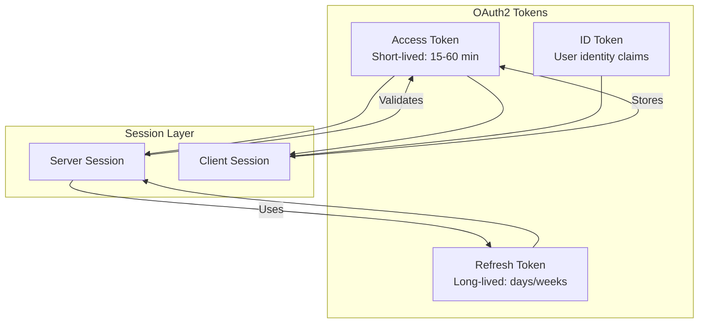
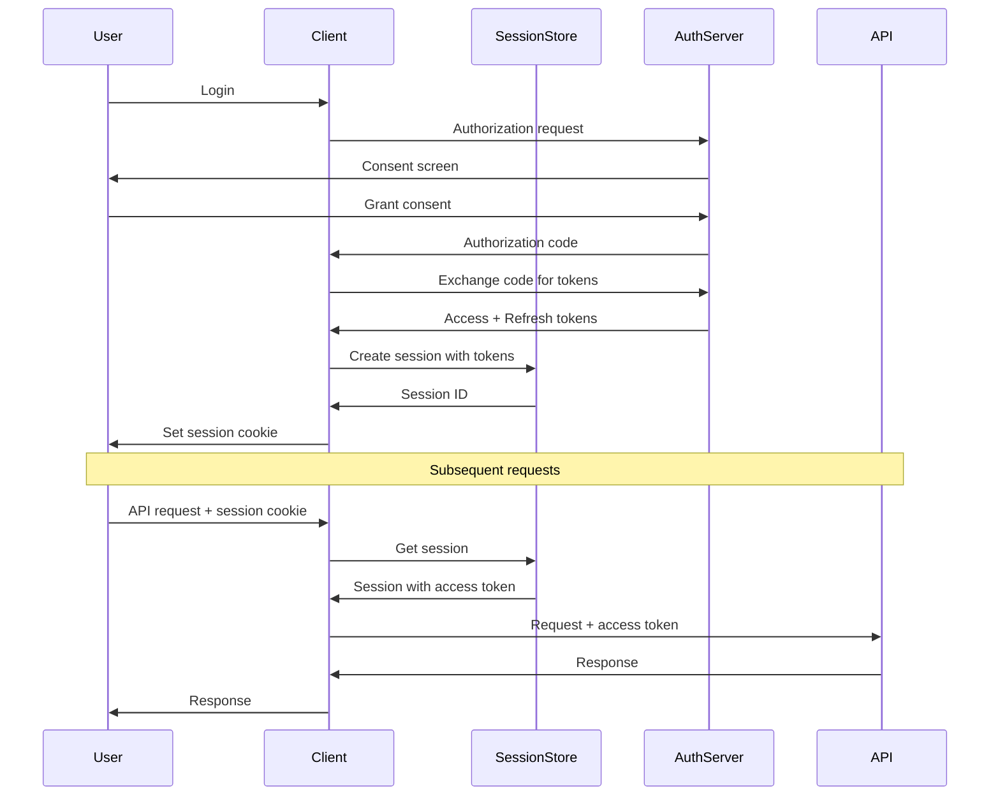
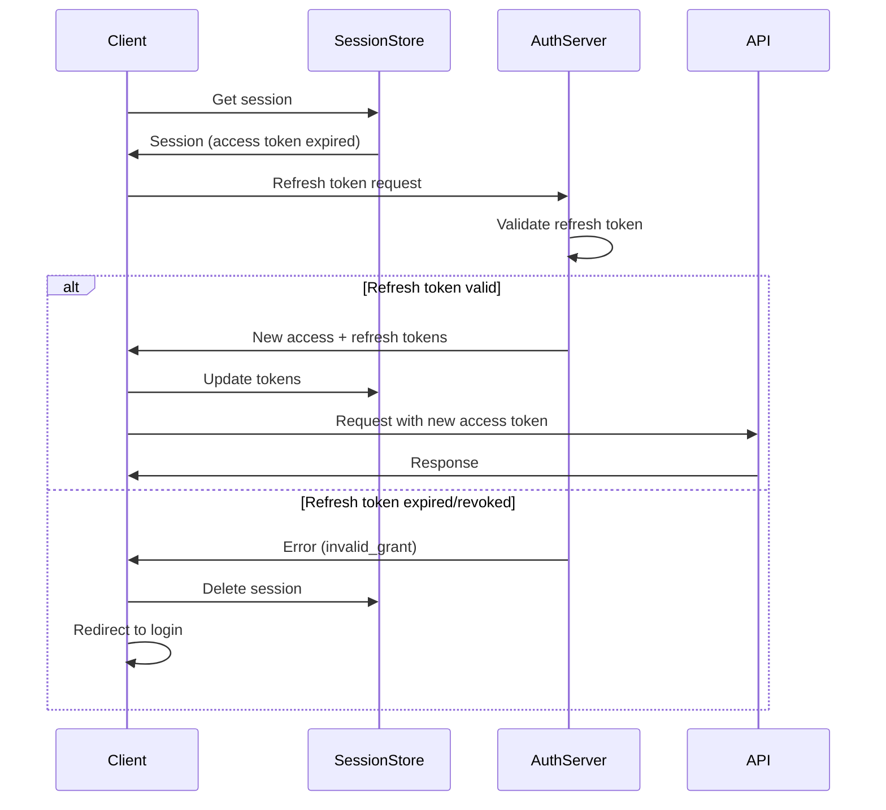
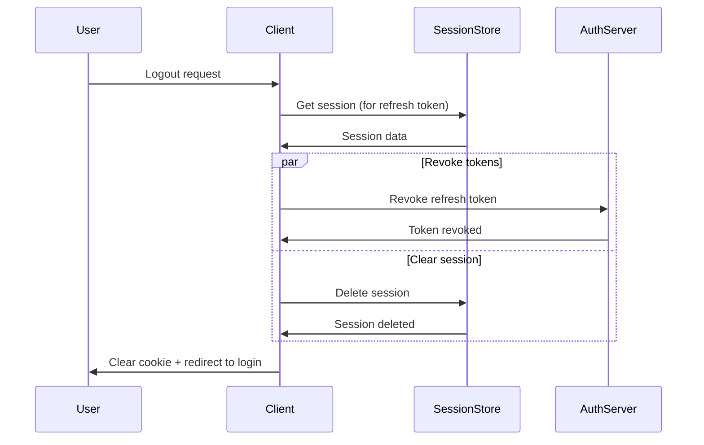

# How to Handle Session Management with OAuth2

Author: [nawazdhandala](https://www.github.com/nawazdhandala)

Tags: OAuth2, Session Management, Authentication, Security, Tokens, Refresh Tokens

Description: Learn how to implement secure session management with OAuth2, including token storage, refresh flows, and session lifecycle handling.

---

> OAuth2 gives you tokens, but managing sessions around those tokens is your responsibility. Get it wrong and you will have security vulnerabilities or frustrated users getting logged out unexpectedly.

This guide covers practical session management patterns with OAuth2, from token storage strategies to handling refresh flows and implementing secure logout.

---

## OAuth2 Token Types and Sessions



### Token Responsibilities

| Token | Purpose | Storage | Lifetime |
|-------|---------|---------|----------|
| Access Token | API authorization | Memory/secure storage | 15-60 minutes |
| Refresh Token | Obtain new access tokens | Server-side only | Days to weeks |
| ID Token | User identity (OIDC) | Client storage | Until logout |

---

## Session Architecture



---

## Server-Side Session Implementation

### Session Store with Redis

```python
import redis
import json
import secrets
import hashlib
from datetime import datetime, timedelta
from typing import Optional, Dict, Any

class OAuth2SessionStore:
    """
    Redis-based session store for OAuth2 tokens.
    Stores refresh tokens server-side for security.
    """

    def __init__(self, redis_client: redis.Redis,
                 session_ttl: int = 86400 * 7):  # 7 days default
        self.redis = redis_client
        self.session_ttl = session_ttl
        self.session_prefix = "oauth2:session:"
        self.user_sessions_prefix = "oauth2:user_sessions:"

    def create_session(
        self,
        user_id: str,
        access_token: str,
        refresh_token: str,
        id_token: Optional[str] = None,
        access_token_expires: Optional[datetime] = None,
        metadata: Optional[Dict[str, Any]] = None
    ) -> str:
        """
        Create a new session for authenticated user.

        Returns:
            Session ID to be stored in cookie
        """
        # Generate secure session ID
        session_id = secrets.token_urlsafe(32)

        # Hash session ID for storage (prevents session fixation)
        session_hash = self._hash_session_id(session_id)

        session_data = {
            'user_id': user_id,
            'access_token': access_token,
            'refresh_token': refresh_token,  # Never send to client
            'id_token': id_token,
            'access_token_expires': access_token_expires.isoformat()
                if access_token_expires else None,
            'created_at': datetime.utcnow().isoformat(),
            'last_activity': datetime.utcnow().isoformat(),
            'metadata': metadata or {},
        }

        # Store session
        session_key = f"{self.session_prefix}{session_hash}"
        self.redis.setex(
            session_key,
            self.session_ttl,
            json.dumps(session_data)
        )

        # Track user's sessions (for logout all devices)
        user_sessions_key = f"{self.user_sessions_prefix}{user_id}"
        self.redis.sadd(user_sessions_key, session_hash)
        self.redis.expire(user_sessions_key, self.session_ttl)

        return session_id

    def get_session(self, session_id: str) -> Optional[Dict[str, Any]]:
        """
        Retrieve session data.
        Updates last activity timestamp.
        """
        session_hash = self._hash_session_id(session_id)
        session_key = f"{self.session_prefix}{session_hash}"

        data = self.redis.get(session_key)
        if not data:
            return None

        session = json.loads(data)

        # Update last activity
        session['last_activity'] = datetime.utcnow().isoformat()
        self.redis.setex(session_key, self.session_ttl, json.dumps(session))

        return session

    def update_tokens(
        self,
        session_id: str,
        access_token: str,
        refresh_token: Optional[str] = None,
        access_token_expires: Optional[datetime] = None
    ) -> bool:
        """
        Update tokens after refresh.
        """
        session_hash = self._hash_session_id(session_id)
        session_key = f"{self.session_prefix}{session_hash}"

        data = self.redis.get(session_key)
        if not data:
            return False

        session = json.loads(data)
        session['access_token'] = access_token

        if refresh_token:
            session['refresh_token'] = refresh_token

        if access_token_expires:
            session['access_token_expires'] = access_token_expires.isoformat()

        session['last_activity'] = datetime.utcnow().isoformat()

        self.redis.setex(session_key, self.session_ttl, json.dumps(session))
        return True

    def delete_session(self, session_id: str) -> bool:
        """
        Delete a specific session (logout).
        """
        session = self.get_session(session_id)
        if not session:
            return False

        session_hash = self._hash_session_id(session_id)
        session_key = f"{self.session_prefix}{session_hash}"

        # Remove from user's session list
        user_sessions_key = f"{self.user_sessions_prefix}{session['user_id']}"
        self.redis.srem(user_sessions_key, session_hash)

        # Delete session
        self.redis.delete(session_key)
        return True

    def delete_all_user_sessions(self, user_id: str) -> int:
        """
        Delete all sessions for a user (logout everywhere).
        """
        user_sessions_key = f"{self.user_sessions_prefix}{user_id}"
        session_hashes = self.redis.smembers(user_sessions_key)

        count = 0
        for session_hash in session_hashes:
            session_key = f"{self.session_prefix}{session_hash.decode()}"
            if self.redis.delete(session_key):
                count += 1

        self.redis.delete(user_sessions_key)
        return count

    def is_access_token_expired(self, session: Dict[str, Any]) -> bool:
        """
        Check if the access token needs refresh.
        """
        expires_str = session.get('access_token_expires')
        if not expires_str:
            return True  # Assume expired if no expiry set

        expires = datetime.fromisoformat(expires_str)
        # Add buffer time (refresh 5 minutes before expiry)
        buffer = timedelta(minutes=5)
        return datetime.utcnow() >= (expires - buffer)

    def _hash_session_id(self, session_id: str) -> str:
        """
        Hash session ID for secure storage.
        """
        return hashlib.sha256(session_id.encode()).hexdigest()
```

---

## Token Refresh Flow



### Implementing Token Refresh

```python
import httpx
from dataclasses import dataclass
from typing import Optional, Tuple

@dataclass
class TokenResponse:
    access_token: str
    refresh_token: Optional[str]
    expires_in: int
    token_type: str
    scope: Optional[str] = None

class OAuth2TokenManager:
    """
    Manages OAuth2 token lifecycle including refresh.
    """

    def __init__(
        self,
        token_url: str,
        client_id: str,
        client_secret: str,
        session_store: OAuth2SessionStore
    ):
        self.token_url = token_url
        self.client_id = client_id
        self.client_secret = client_secret
        self.session_store = session_store

    async def refresh_tokens(
        self,
        session_id: str
    ) -> Tuple[bool, Optional[str]]:
        """
        Refresh tokens for a session.

        Returns:
            Tuple of (success, error_message)
        """
        session = self.session_store.get_session(session_id)
        if not session:
            return False, "Session not found"

        refresh_token = session.get('refresh_token')
        if not refresh_token:
            return False, "No refresh token available"

        try:
            async with httpx.AsyncClient() as client:
                response = await client.post(
                    self.token_url,
                    data={
                        'grant_type': 'refresh_token',
                        'refresh_token': refresh_token,
                        'client_id': self.client_id,
                        'client_secret': self.client_secret,
                    },
                    headers={
                        'Content-Type': 'application/x-www-form-urlencoded'
                    }
                )

                if response.status_code != 200:
                    error_data = response.json()
                    error = error_data.get('error', 'unknown_error')

                    if error in ['invalid_grant', 'invalid_token']:
                        # Refresh token is invalid, session must end
                        self.session_store.delete_session(session_id)
                        return False, "Refresh token expired or revoked"

                    return False, f"Token refresh failed: {error}"

                token_data = response.json()

                # Calculate expiration time
                expires_in = token_data.get('expires_in', 3600)
                expires_at = datetime.utcnow() + timedelta(seconds=expires_in)

                # Update session with new tokens
                self.session_store.update_tokens(
                    session_id=session_id,
                    access_token=token_data['access_token'],
                    refresh_token=token_data.get('refresh_token', refresh_token),
                    access_token_expires=expires_at
                )

                return True, None

        except httpx.RequestError as e:
            return False, f"Network error during refresh: {str(e)}"

    async def get_valid_access_token(
        self,
        session_id: str
    ) -> Tuple[Optional[str], Optional[str]]:
        """
        Get a valid access token, refreshing if necessary.

        Returns:
            Tuple of (access_token, error_message)
        """
        session = self.session_store.get_session(session_id)
        if not session:
            return None, "Session not found"

        # Check if token needs refresh
        if self.session_store.is_access_token_expired(session):
            success, error = await self.refresh_tokens(session_id)
            if not success:
                return None, error

            # Get updated session
            session = self.session_store.get_session(session_id)

        return session['access_token'], None
```

---

## Middleware for Session Management

```python
from fastapi import FastAPI, Request, Response, HTTPException
from fastapi.responses import RedirectResponse
from starlette.middleware.base import BaseHTTPMiddleware
import logging

logger = logging.getLogger(__name__)

class OAuth2SessionMiddleware(BaseHTTPMiddleware):
    """
    Middleware for handling OAuth2 sessions.
    """

    def __init__(
        self,
        app: FastAPI,
        session_store: OAuth2SessionStore,
        token_manager: OAuth2TokenManager,
        cookie_name: str = "session_id",
        excluded_paths: list = None
    ):
        super().__init__(app)
        self.session_store = session_store
        self.token_manager = token_manager
        self.cookie_name = cookie_name
        self.excluded_paths = excluded_paths or [
            '/health',
            '/login',
            '/callback',
            '/public'
        ]

    async def dispatch(self, request: Request, call_next):
        # Skip excluded paths
        if any(request.url.path.startswith(p) for p in self.excluded_paths):
            return await call_next(request)

        # Get session ID from cookie
        session_id = request.cookies.get(self.cookie_name)

        if not session_id:
            return self._unauthorized_response(request)

        # Get session
        session = self.session_store.get_session(session_id)

        if not session:
            return self._unauthorized_response(request, clear_cookie=True)

        # Refresh token if needed
        if self.session_store.is_access_token_expired(session):
            success, error = await self.token_manager.refresh_tokens(session_id)

            if not success:
                logger.warning(f"Token refresh failed: {error}")
                return self._unauthorized_response(request, clear_cookie=True)

            # Get updated session
            session = self.session_store.get_session(session_id)

        # Add session to request state
        request.state.session = session
        request.state.session_id = session_id
        request.state.access_token = session['access_token']
        request.state.user_id = session['user_id']

        # Process request
        response = await call_next(request)

        return response

    def _unauthorized_response(
        self,
        request: Request,
        clear_cookie: bool = False
    ) -> Response:
        """
        Handle unauthorized access.
        """
        # For API requests, return 401
        if request.url.path.startswith('/api'):
            response = Response(
                content='{"error": "unauthorized", "message": "Session expired or invalid"}',
                status_code=401,
                media_type="application/json"
            )
        else:
            # For page requests, redirect to login
            response = RedirectResponse(
                url=f"/login?redirect={request.url.path}",
                status_code=302
            )

        if clear_cookie:
            response.delete_cookie(self.cookie_name)

        return response
```

---

## Session Security Patterns

### Secure Cookie Configuration

```python
from fastapi import FastAPI, Response
from datetime import datetime, timedelta

def set_session_cookie(
    response: Response,
    session_id: str,
    max_age: int = 86400 * 7,  # 7 days
    secure: bool = True,
    domain: str = None
):
    """
    Set session cookie with secure defaults.
    """
    response.set_cookie(
        key="session_id",
        value=session_id,
        max_age=max_age,
        expires=datetime.utcnow() + timedelta(seconds=max_age),
        path="/",
        domain=domain,
        secure=secure,         # Only send over HTTPS
        httponly=True,         # Not accessible via JavaScript
        samesite="lax"         # CSRF protection
    )

def clear_session_cookie(response: Response, domain: str = None):
    """
    Clear session cookie on logout.
    """
    response.delete_cookie(
        key="session_id",
        path="/",
        domain=domain,
        secure=True,
        httponly=True,
        samesite="lax"
    )
```

### Session Binding

Bind sessions to client characteristics to prevent session hijacking:

```python
import hashlib
from dataclasses import dataclass
from typing import Optional

@dataclass
class SessionFingerprint:
    user_agent: str
    accept_language: str
    # Note: IP can change (mobile networks), use cautiously

    def compute_hash(self) -> str:
        """Compute fingerprint hash."""
        data = f"{self.user_agent}|{self.accept_language}"
        return hashlib.sha256(data.encode()).hexdigest()[:16]

class SecureSessionStore(OAuth2SessionStore):
    """
    Enhanced session store with fingerprint validation.
    """

    def create_session(
        self,
        user_id: str,
        access_token: str,
        refresh_token: str,
        fingerprint: SessionFingerprint,
        **kwargs
    ) -> str:
        """Create session with fingerprint."""
        metadata = kwargs.get('metadata', {})
        metadata['fingerprint'] = fingerprint.compute_hash()
        kwargs['metadata'] = metadata

        return super().create_session(
            user_id=user_id,
            access_token=access_token,
            refresh_token=refresh_token,
            **kwargs
        )

    def validate_session(
        self,
        session_id: str,
        fingerprint: SessionFingerprint
    ) -> tuple:
        """
        Validate session and fingerprint.

        Returns:
            (session, error_message)
        """
        session = self.get_session(session_id)

        if not session:
            return None, "Session not found"

        stored_fingerprint = session.get('metadata', {}).get('fingerprint')
        current_fingerprint = fingerprint.compute_hash()

        if stored_fingerprint and stored_fingerprint != current_fingerprint:
            # Potential session hijacking
            self.delete_session(session_id)
            return None, "Session fingerprint mismatch"

        return session, None
```

---

## Logout Implementation



### Logout Handler

```python
from fastapi import APIRouter, Request, Response
from fastapi.responses import RedirectResponse
import httpx

router = APIRouter()

class LogoutHandler:
    """
    Handles logout flow including token revocation.
    """

    def __init__(
        self,
        session_store: OAuth2SessionStore,
        revocation_url: str,
        client_id: str,
        client_secret: str
    ):
        self.session_store = session_store
        self.revocation_url = revocation_url
        self.client_id = client_id
        self.client_secret = client_secret

    async def logout(
        self,
        session_id: str,
        revoke_token: bool = True
    ) -> dict:
        """
        Perform logout operations.
        """
        result = {
            'session_deleted': False,
            'token_revoked': False,
            'errors': []
        }

        # Get session for token revocation
        session = self.session_store.get_session(session_id)

        if not session:
            result['errors'].append("Session not found")
            return result

        # Revoke refresh token at authorization server
        if revoke_token and self.revocation_url:
            try:
                await self._revoke_token(session.get('refresh_token'))
                result['token_revoked'] = True
            except Exception as e:
                result['errors'].append(f"Token revocation failed: {str(e)}")

        # Delete session
        if self.session_store.delete_session(session_id):
            result['session_deleted'] = True
        else:
            result['errors'].append("Failed to delete session")

        return result

    async def logout_all_devices(self, user_id: str) -> dict:
        """
        Logout user from all devices.
        """
        count = self.session_store.delete_all_user_sessions(user_id)
        return {
            'sessions_deleted': count,
            'message': f"Logged out from {count} device(s)"
        }

    async def _revoke_token(self, token: str):
        """
        Revoke token at authorization server.
        """
        if not token:
            return

        async with httpx.AsyncClient() as client:
            response = await client.post(
                self.revocation_url,
                data={
                    'token': token,
                    'token_type_hint': 'refresh_token',
                    'client_id': self.client_id,
                    'client_secret': self.client_secret,
                },
                headers={
                    'Content-Type': 'application/x-www-form-urlencoded'
                }
            )

            # RFC 7009: Server should return 200 even if token was invalid
            if response.status_code not in [200, 400]:
                raise Exception(f"Revocation failed: {response.status_code}")


@router.post("/logout")
async def logout(request: Request, response: Response):
    """
    Logout endpoint.
    """
    session_id = request.cookies.get("session_id")

    if session_id:
        logout_handler = request.app.state.logout_handler
        result = await logout_handler.logout(session_id)

    # Clear cookie
    clear_session_cookie(response)

    return {"message": "Logged out successfully"}


@router.post("/logout/all-devices")
async def logout_all_devices(request: Request, response: Response):
    """
    Logout from all devices.
    """
    user_id = request.state.user_id
    logout_handler = request.app.state.logout_handler

    result = await logout_handler.logout_all_devices(user_id)

    # Clear current session cookie
    clear_session_cookie(response)

    return result
```

---

## Session Monitoring and Cleanup

```python
import asyncio
from datetime import datetime, timedelta
import logging

logger = logging.getLogger(__name__)

class SessionMonitor:
    """
    Monitors and cleans up sessions.
    """

    def __init__(
        self,
        session_store: OAuth2SessionStore,
        redis_client,
        cleanup_interval: int = 3600,  # 1 hour
        inactive_threshold: int = 86400  # 24 hours
    ):
        self.session_store = session_store
        self.redis = redis_client
        self.cleanup_interval = cleanup_interval
        self.inactive_threshold = inactive_threshold

    async def start_cleanup_task(self):
        """
        Start background cleanup task.
        """
        while True:
            try:
                await self.cleanup_inactive_sessions()
            except Exception as e:
                logger.error(f"Session cleanup error: {e}")

            await asyncio.sleep(self.cleanup_interval)

    async def cleanup_inactive_sessions(self):
        """
        Remove sessions that have been inactive too long.
        """
        pattern = f"{self.session_store.session_prefix}*"
        cursor = 0
        cleaned = 0
        threshold = datetime.utcnow() - timedelta(seconds=self.inactive_threshold)

        while True:
            cursor, keys = self.redis.scan(cursor, match=pattern, count=100)

            for key in keys:
                data = self.redis.get(key)
                if not data:
                    continue

                session = json.loads(data)
                last_activity = datetime.fromisoformat(
                    session.get('last_activity', session.get('created_at'))
                )

                if last_activity < threshold:
                    self.redis.delete(key)
                    cleaned += 1

            if cursor == 0:
                break

        if cleaned > 0:
            logger.info(f"Cleaned up {cleaned} inactive sessions")

    def get_session_stats(self, user_id: str = None) -> dict:
        """
        Get session statistics.
        """
        if user_id:
            user_sessions_key = f"{self.session_store.user_sessions_prefix}{user_id}"
            count = self.redis.scard(user_sessions_key)
            return {
                'user_id': user_id,
                'active_sessions': count
            }

        # Global stats
        pattern = f"{self.session_store.session_prefix}*"
        cursor = 0
        total = 0

        while True:
            cursor, keys = self.redis.scan(cursor, match=pattern, count=100)
            total += len(keys)
            if cursor == 0:
                break

        return {
            'total_active_sessions': total
        }

    def list_user_sessions(self, user_id: str) -> list:
        """
        List all sessions for a user (for "active sessions" UI).
        """
        user_sessions_key = f"{self.session_store.user_sessions_prefix}{user_id}"
        session_hashes = self.redis.smembers(user_sessions_key)

        sessions = []
        for session_hash in session_hashes:
            key = f"{self.session_store.session_prefix}{session_hash.decode()}"
            data = self.redis.get(key)
            if data:
                session = json.loads(data)
                sessions.append({
                    'created_at': session['created_at'],
                    'last_activity': session['last_activity'],
                    'metadata': {
                        k: v for k, v in session.get('metadata', {}).items()
                        if k not in ['fingerprint']  # Don't expose internal data
                    }
                })

        return sessions
```

---

## Complete Flow Example

```python
from fastapi import FastAPI, Request, Response, Depends
from fastapi.responses import RedirectResponse
import redis

app = FastAPI()

# Initialize components
redis_client = redis.Redis(host='localhost', port=6379, db=0)
session_store = OAuth2SessionStore(redis_client)
token_manager = OAuth2TokenManager(
    token_url="https://auth.example.com/oauth/token",
    client_id="your-client-id",
    client_secret="your-client-secret",
    session_store=session_store
)

# Add middleware
app.add_middleware(
    OAuth2SessionMiddleware,
    session_store=session_store,
    token_manager=token_manager,
    excluded_paths=['/health', '/login', '/callback', '/public']
)


@app.get("/callback")
async def oauth_callback(request: Request, response: Response):
    """
    OAuth2 callback handler.
    """
    code = request.query_params.get('code')

    # Exchange code for tokens
    tokens = await exchange_code_for_tokens(code)

    # Extract user info from ID token or userinfo endpoint
    user_info = decode_id_token(tokens['id_token'])

    # Create session
    session_id = session_store.create_session(
        user_id=user_info['sub'],
        access_token=tokens['access_token'],
        refresh_token=tokens['refresh_token'],
        id_token=tokens['id_token'],
        access_token_expires=datetime.utcnow() + timedelta(
            seconds=tokens['expires_in']
        ),
        metadata={
            'email': user_info.get('email'),
            'name': user_info.get('name')
        }
    )

    # Set session cookie
    redirect = RedirectResponse(url="/dashboard", status_code=302)
    set_session_cookie(redirect, session_id)

    return redirect


@app.get("/api/me")
async def get_current_user(request: Request):
    """
    Get current user info from session.
    """
    return {
        'user_id': request.state.user_id,
        'session': {
            'metadata': request.state.session.get('metadata', {})
        }
    }


@app.get("/api/sessions")
async def list_sessions(request: Request):
    """
    List user's active sessions.
    """
    monitor = SessionMonitor(session_store, redis_client)
    sessions = monitor.list_user_sessions(request.state.user_id)
    return {'sessions': sessions}
```

---

## Summary

Effective OAuth2 session management requires:

1. **Store refresh tokens server-side** - Never expose them to the client
2. **Implement automatic token refresh** - Users should not notice token expiration
3. **Use secure cookie settings** - HttpOnly, Secure, SameSite
4. **Handle logout properly** - Revoke tokens and clear sessions
5. **Monitor sessions** - Track active sessions and clean up inactive ones
6. **Consider session binding** - Prevent session hijacking with fingerprinting

Key patterns:
- Proactive token refresh before expiration (with buffer time)
- Graceful handling of refresh failures with re-authentication
- Support for "logout everywhere" functionality
- Session activity tracking for security visibility

The session layer bridges OAuth2 tokens with your application's user experience. Get it right, and users enjoy seamless authentication. Get it wrong, and they face constant logouts or security vulnerabilities.
