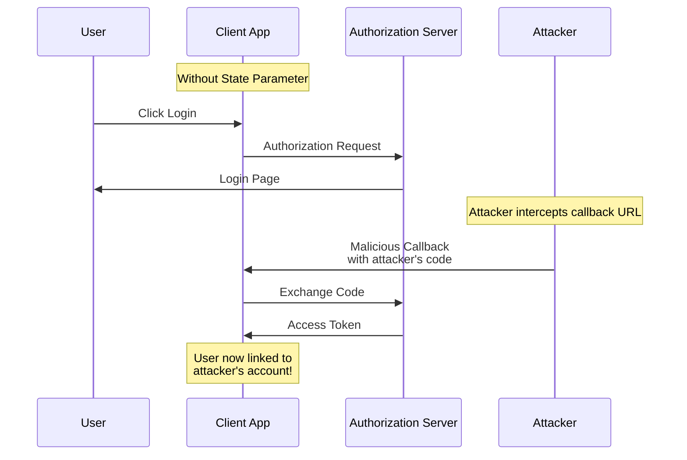
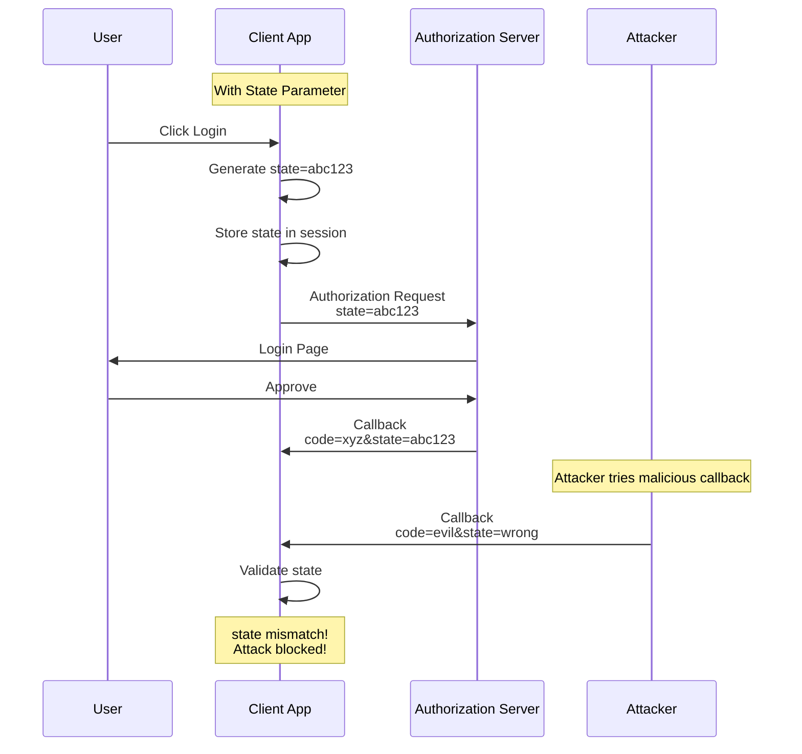
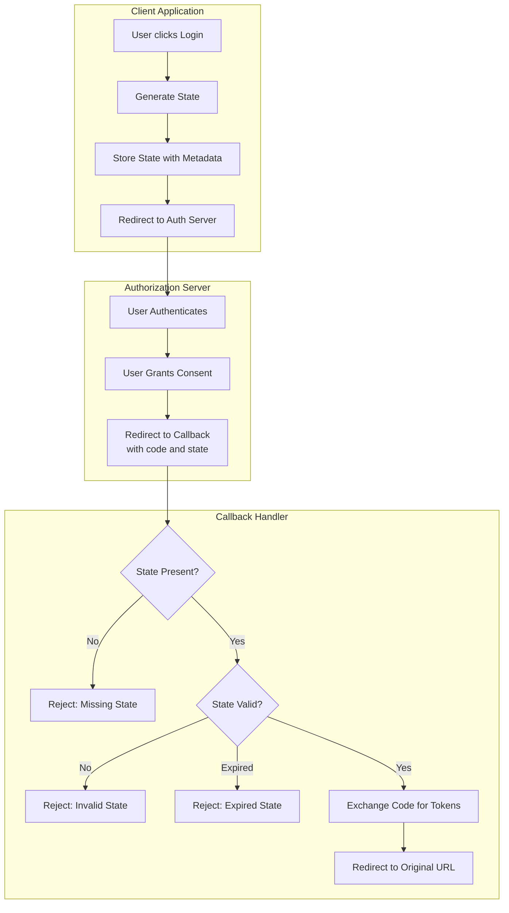
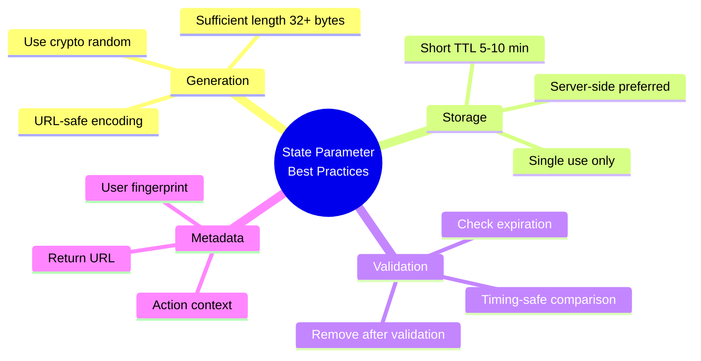

# How to Handle OAuth2 State Parameter

Author: [nawazdhandala](https://www.github.com/nawazdhandala)

Tags: OAuth2, Security, CSRF Protection, State Parameter, Authentication

Description: Learn how to properly implement the OAuth2 state parameter for CSRF protection including generation strategies, validation techniques, and handling edge cases.

---

The OAuth2 state parameter is a critical security mechanism that prevents Cross-Site Request Forgery (CSRF) attacks during the authorization flow. This guide covers comprehensive strategies for implementing state parameter handling correctly.

## Understanding the State Parameter



## CSRF Attack Prevention with State



## State Parameter Generation

```javascript
// state-generator.js
// Secure OAuth2 state parameter generation and validation

const crypto = require('crypto');

class StateManager {
    constructor(options = {}) {
        // State storage (in production, use Redis or database)
        this.states = new Map();

        // Configuration
        this.stateLength = options.stateLength || 32;
        this.stateTTL = options.stateTTL || 600000; // 10 minutes
        this.cleanupInterval = options.cleanupInterval || 60000; // 1 minute

        // Start cleanup timer
        this.startCleanup();
    }

    // Generate cryptographically secure state
    generate(metadata = {}) {
        // Generate random bytes
        const randomBytes = crypto.randomBytes(this.stateLength);
        const state = randomBytes.toString('base64url');

        // Store state with metadata and expiry
        const stateData = {
            state,
            metadata,
            createdAt: Date.now(),
            expiresAt: Date.now() + this.stateTTL
        };

        this.states.set(state, stateData);

        return state;
    }

    // Generate state with HMAC signature for stateless validation
    generateSigned(payload, secret) {
        const timestamp = Date.now();
        const nonce = crypto.randomBytes(16).toString('base64url');

        // Create payload string
        const data = JSON.stringify({
            ...payload,
            timestamp,
            nonce
        });

        // Encode payload
        const encodedPayload = Buffer.from(data).toString('base64url');

        // Create HMAC signature
        const hmac = crypto.createHmac('sha256', secret);
        hmac.update(encodedPayload);
        const signature = hmac.digest('base64url');

        // Combine payload and signature
        return `${encodedPayload}.${signature}`;
    }

    // Validate stored state
    validate(state) {
        const stateData = this.states.get(state);

        if (!stateData) {
            return {
                valid: false,
                error: 'STATE_NOT_FOUND',
                message: 'State parameter not found or already used'
            };
        }

        // Check expiration
        if (Date.now() > stateData.expiresAt) {
            this.states.delete(state);
            return {
                valid: false,
                error: 'STATE_EXPIRED',
                message: 'State parameter has expired'
            };
        }

        // State is valid - remove it to prevent reuse
        this.states.delete(state);

        return {
            valid: true,
            metadata: stateData.metadata
        };
    }

    // Validate signed state (stateless)
    validateSigned(state, secret, maxAge = 600000) {
        try {
            // Split payload and signature
            const [encodedPayload, signature] = state.split('.');

            if (!encodedPayload || !signature) {
                return {
                    valid: false,
                    error: 'INVALID_FORMAT',
                    message: 'State parameter has invalid format'
                };
            }

            // Verify signature
            const hmac = crypto.createHmac('sha256', secret);
            hmac.update(encodedPayload);
            const expectedSignature = hmac.digest('base64url');

            if (!crypto.timingSafeEqual(
                Buffer.from(signature),
                Buffer.from(expectedSignature)
            )) {
                return {
                    valid: false,
                    error: 'INVALID_SIGNATURE',
                    message: 'State parameter signature is invalid'
                };
            }

            // Decode and parse payload
            const data = JSON.parse(
                Buffer.from(encodedPayload, 'base64url').toString()
            );

            // Check timestamp
            if (Date.now() - data.timestamp > maxAge) {
                return {
                    valid: false,
                    error: 'STATE_EXPIRED',
                    message: 'State parameter has expired'
                };
            }

            return {
                valid: true,
                payload: data
            };

        } catch (error) {
            return {
                valid: false,
                error: 'VALIDATION_ERROR',
                message: error.message
            };
        }
    }

    // Clean up expired states
    cleanup() {
        const now = Date.now();
        for (const [state, data] of this.states) {
            if (now > data.expiresAt) {
                this.states.delete(state);
            }
        }
    }

    // Start periodic cleanup
    startCleanup() {
        this.cleanupTimer = setInterval(() => {
            this.cleanup();
        }, this.cleanupInterval);
    }

    // Stop cleanup timer
    stop() {
        if (this.cleanupTimer) {
            clearInterval(this.cleanupTimer);
        }
    }
}

module.exports = { StateManager };
```

## Express OAuth2 Implementation with State

```javascript
// oauth2-routes.js
// Express routes for OAuth2 flow with state parameter handling

const express = require('express');
const { StateManager } = require('./state-generator');

const router = express.Router();
const stateManager = new StateManager();

// OAuth2 configuration
const oauth2Config = {
    authorizationEndpoint: 'https://auth.example.com/authorize',
    tokenEndpoint: 'https://auth.example.com/oauth/token',
    clientId: process.env.OAUTH_CLIENT_ID,
    clientSecret: process.env.OAUTH_CLIENT_SECRET,
    redirectUri: process.env.OAUTH_REDIRECT_URI,
    scopes: ['openid', 'profile', 'email']
};

// Initiate OAuth2 flow
router.get('/login', (req, res) => {
    // Generate state with metadata
    const state = stateManager.generate({
        // Store return URL for post-login redirect
        returnTo: req.query.returnTo || '/',
        // Store any other context needed after authentication
        action: req.query.action,
        // Fingerprint for additional validation
        userAgent: req.headers['user-agent'],
        ip: req.ip
    });

    // Build authorization URL
    const authUrl = new URL(oauth2Config.authorizationEndpoint);
    authUrl.searchParams.set('response_type', 'code');
    authUrl.searchParams.set('client_id', oauth2Config.clientId);
    authUrl.searchParams.set('redirect_uri', oauth2Config.redirectUri);
    authUrl.searchParams.set('scope', oauth2Config.scopes.join(' '));
    authUrl.searchParams.set('state', state);

    // Redirect to authorization server
    res.redirect(authUrl.toString());
});

// OAuth2 callback handler
router.get('/callback', async (req, res) => {
    const { code, state, error, error_description } = req.query;

    // Handle authorization errors
    if (error) {
        console.error('OAuth2 error:', error, error_description);
        return res.status(400).render('error', {
            title: 'Authentication Failed',
            message: error_description || 'Authorization was denied'
        });
    }

    // Validate state parameter
    if (!state) {
        return res.status(400).render('error', {
            title: 'Invalid Request',
            message: 'Missing state parameter'
        });
    }

    const stateValidation = stateManager.validate(state);

    if (!stateValidation.valid) {
        console.error('State validation failed:', stateValidation.error);

        // Different handling based on error type
        if (stateValidation.error === 'STATE_EXPIRED') {
            return res.redirect('/login?error=session_expired');
        }

        return res.status(400).render('error', {
            title: 'Security Error',
            message: 'Invalid state parameter. Please try logging in again.'
        });
    }

    // Optional: Additional validation using metadata
    const metadata = stateValidation.metadata;
    if (metadata.userAgent !== req.headers['user-agent']) {
        console.warn('User agent mismatch in OAuth callback');
        // Could be suspicious, but might also be legitimate
    }

    // Validate authorization code is present
    if (!code) {
        return res.status(400).render('error', {
            title: 'Invalid Response',
            message: 'Missing authorization code'
        });
    }

    try {
        // Exchange code for tokens
        const tokenResponse = await fetch(oauth2Config.tokenEndpoint, {
            method: 'POST',
            headers: {
                'Content-Type': 'application/x-www-form-urlencoded'
            },
            body: new URLSearchParams({
                grant_type: 'authorization_code',
                code,
                redirect_uri: oauth2Config.redirectUri,
                client_id: oauth2Config.clientId,
                client_secret: oauth2Config.clientSecret
            })
        });

        if (!tokenResponse.ok) {
            const error = await tokenResponse.json();
            throw new Error(error.error_description || 'Token exchange failed');
        }

        const tokens = await tokenResponse.json();

        // Store tokens in session
        req.session.accessToken = tokens.access_token;
        req.session.refreshToken = tokens.refresh_token;
        req.session.tokenExpiry = Date.now() + (tokens.expires_in * 1000);

        // Redirect to original destination
        const returnTo = metadata.returnTo || '/';

        // Validate returnTo is a relative URL (prevent open redirect)
        if (returnTo.startsWith('/') && !returnTo.startsWith('//')) {
            res.redirect(returnTo);
        } else {
            res.redirect('/');
        }

    } catch (error) {
        console.error('Token exchange error:', error);
        res.status(500).render('error', {
            title: 'Authentication Error',
            message: 'Failed to complete authentication'
        });
    }
});

// Logout
router.get('/logout', (req, res) => {
    req.session.destroy(() => {
        res.redirect('/');
    });
});

module.exports = router;
```

## State Parameter Flow Diagram



## Python State Parameter Implementation

```python
# state_manager.py
# Python implementation of OAuth2 state parameter handling

import secrets
import hmac
import hashlib
import json
import time
import base64
from typing import Dict, Any, Optional
from dataclasses import dataclass, field
from datetime import datetime, timedelta
from threading import Lock


@dataclass
class StateData:
    """Data associated with an OAuth2 state."""
    state: str
    metadata: Dict[str, Any]
    created_at: float
    expires_at: float


class StateManager:
    """
    Manages OAuth2 state parameters for CSRF protection.
    """

    def __init__(
        self,
        state_ttl: int = 600,  # seconds
        state_length: int = 32
    ):
        self._states: Dict[str, StateData] = {}
        self._lock = Lock()
        self.state_ttl = state_ttl
        self.state_length = state_length

    def generate(self, metadata: Dict[str, Any] = None) -> str:
        """
        Generate a cryptographically secure state parameter.

        Args:
            metadata: Optional metadata to associate with state

        Returns:
            State string
        """
        # Generate random state
        state = secrets.token_urlsafe(self.state_length)

        # Calculate expiry
        now = time.time()
        expires_at = now + self.state_ttl

        # Store state data
        state_data = StateData(
            state=state,
            metadata=metadata or {},
            created_at=now,
            expires_at=expires_at
        )

        with self._lock:
            self._states[state] = state_data
            self._cleanup()

        return state

    def validate(self, state: str) -> Dict[str, Any]:
        """
        Validate a state parameter.

        Args:
            state: State string to validate

        Returns:
            Dict with 'valid' boolean and 'metadata' or 'error'
        """
        with self._lock:
            state_data = self._states.get(state)

            if not state_data:
                return {
                    "valid": False,
                    "error": "STATE_NOT_FOUND",
                    "message": "State not found or already used"
                }

            # Check expiration
            if time.time() > state_data.expires_at:
                del self._states[state]
                return {
                    "valid": False,
                    "error": "STATE_EXPIRED",
                    "message": "State has expired"
                }

            # Remove state to prevent reuse
            del self._states[state]

        return {
            "valid": True,
            "metadata": state_data.metadata
        }

    def _cleanup(self) -> None:
        """Remove expired states."""
        now = time.time()
        expired = [
            state for state, data in self._states.items()
            if now > data.expires_at
        ]
        for state in expired:
            del self._states[state]


class SignedStateManager:
    """
    Stateless state parameter management using signed tokens.
    """

    def __init__(self, secret: str, max_age: int = 600):
        self.secret = secret.encode()
        self.max_age = max_age

    def generate(self, payload: Dict[str, Any] = None) -> str:
        """
        Generate a signed state parameter.

        Args:
            payload: Data to include in state

        Returns:
            Signed state string
        """
        data = {
            **(payload or {}),
            "timestamp": time.time(),
            "nonce": secrets.token_urlsafe(16)
        }

        # Encode payload
        payload_json = json.dumps(data, separators=(",", ":"))
        encoded_payload = base64.urlsafe_b64encode(
            payload_json.encode()
        ).decode().rstrip("=")

        # Create signature
        signature = hmac.new(
            self.secret,
            encoded_payload.encode(),
            hashlib.sha256
        ).digest()
        encoded_signature = base64.urlsafe_b64encode(
            signature
        ).decode().rstrip("=")

        return f"{encoded_payload}.{encoded_signature}"

    def validate(self, state: str) -> Dict[str, Any]:
        """
        Validate a signed state parameter.

        Args:
            state: Signed state string

        Returns:
            Dict with 'valid' boolean and 'payload' or 'error'
        """
        try:
            # Split payload and signature
            parts = state.split(".")
            if len(parts) != 2:
                return {
                    "valid": False,
                    "error": "INVALID_FORMAT",
                    "message": "Invalid state format"
                }

            encoded_payload, encoded_signature = parts

            # Verify signature
            expected_signature = hmac.new(
                self.secret,
                encoded_payload.encode(),
                hashlib.sha256
            ).digest()
            expected_encoded = base64.urlsafe_b64encode(
                expected_signature
            ).decode().rstrip("=")

            if not hmac.compare_digest(encoded_signature, expected_encoded):
                return {
                    "valid": False,
                    "error": "INVALID_SIGNATURE",
                    "message": "State signature is invalid"
                }

            # Decode payload
            padding = 4 - len(encoded_payload) % 4
            if padding != 4:
                encoded_payload += "=" * padding

            payload_json = base64.urlsafe_b64decode(encoded_payload).decode()
            payload = json.loads(payload_json)

            # Check timestamp
            if time.time() - payload.get("timestamp", 0) > self.max_age:
                return {
                    "valid": False,
                    "error": "STATE_EXPIRED",
                    "message": "State has expired"
                }

            return {
                "valid": True,
                "payload": payload
            }

        except Exception as e:
            return {
                "valid": False,
                "error": "VALIDATION_ERROR",
                "message": str(e)
            }


# FastAPI OAuth2 implementation
from fastapi import FastAPI, Request, HTTPException
from fastapi.responses import RedirectResponse
import httpx

app = FastAPI()
state_manager = StateManager()

OAUTH_CONFIG = {
    "authorization_endpoint": "https://auth.example.com/authorize",
    "token_endpoint": "https://auth.example.com/oauth/token",
    "client_id": "your-client-id",
    "client_secret": "your-client-secret",
    "redirect_uri": "https://yourapp.com/callback",
    "scopes": ["openid", "profile", "email"]
}


@app.get("/login")
async def login(request: Request, return_to: str = "/"):
    """Initiate OAuth2 authorization flow."""
    # Generate state with metadata
    state = state_manager.generate({
        "return_to": return_to,
        "ip": request.client.host,
        "user_agent": request.headers.get("user-agent", "")
    })

    # Build authorization URL
    params = {
        "response_type": "code",
        "client_id": OAUTH_CONFIG["client_id"],
        "redirect_uri": OAUTH_CONFIG["redirect_uri"],
        "scope": " ".join(OAUTH_CONFIG["scopes"]),
        "state": state
    }

    auth_url = f"{OAUTH_CONFIG['authorization_endpoint']}?"
    auth_url += "&".join(f"{k}={v}" for k, v in params.items())

    return RedirectResponse(url=auth_url)


@app.get("/callback")
async def callback(
    request: Request,
    code: str = None,
    state: str = None,
    error: str = None,
    error_description: str = None
):
    """Handle OAuth2 callback."""
    # Handle authorization errors
    if error:
        raise HTTPException(
            status_code=400,
            detail=f"Authorization failed: {error_description or error}"
        )

    # Validate state
    if not state:
        raise HTTPException(
            status_code=400,
            detail="Missing state parameter"
        )

    validation = state_manager.validate(state)

    if not validation["valid"]:
        if validation["error"] == "STATE_EXPIRED":
            return RedirectResponse(url="/login?error=session_expired")

        raise HTTPException(
            status_code=400,
            detail=f"Invalid state: {validation['message']}"
        )

    # Validate code
    if not code:
        raise HTTPException(
            status_code=400,
            detail="Missing authorization code"
        )

    # Exchange code for tokens
    async with httpx.AsyncClient() as client:
        response = await client.post(
            OAUTH_CONFIG["token_endpoint"],
            data={
                "grant_type": "authorization_code",
                "code": code,
                "redirect_uri": OAUTH_CONFIG["redirect_uri"],
                "client_id": OAUTH_CONFIG["client_id"],
                "client_secret": OAUTH_CONFIG["client_secret"]
            }
        )

        if response.status_code != 200:
            raise HTTPException(
                status_code=500,
                detail="Token exchange failed"
            )

        tokens = response.json()

    # Store tokens in session (simplified)
    # In production, use proper session management
    request.session["access_token"] = tokens["access_token"]

    # Redirect to original destination
    return_to = validation["metadata"].get("return_to", "/")

    # Validate return_to is safe
    if not return_to.startswith("/") or return_to.startswith("//"):
        return_to = "/"

    return RedirectResponse(url=return_to)
```

## State Parameter Best Practices



## Security Considerations

| Aspect | Recommendation |
|--------|----------------|
| Length | Minimum 32 bytes of entropy |
| Storage | Server-side storage or signed tokens |
| TTL | 5-10 minutes maximum |
| Usage | Single use, delete after validation |
| Comparison | Use timing-safe comparison |
| Return URL | Validate to prevent open redirect |

## Common Mistakes to Avoid

1. **Using predictable values**: Never use sequential numbers, timestamps alone, or user IDs
2. **Storing in URL only**: Always validate server-side, not just presence
3. **Allowing reuse**: Delete state immediately after successful validation
4. **Long TTL**: Keep expiration short to limit attack window
5. **Missing validation**: Always check state on callback, even for "trusted" providers
6. **Open redirect via returnTo**: Validate redirect URLs are relative and safe

## Summary

The OAuth2 state parameter is essential for preventing CSRF attacks during the authorization flow. Proper implementation requires generating cryptographically secure random values, storing them server-side with short TTL, validating on callback with timing-safe comparison, and removing after single use. By following these patterns, you can ensure your OAuth2 implementation is secure against cross-site request forgery attacks.
