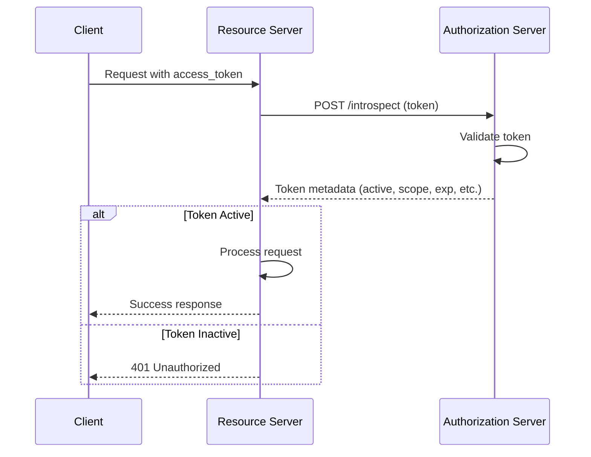
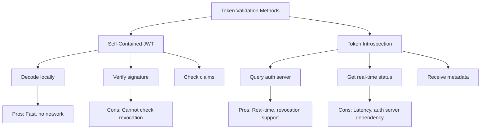
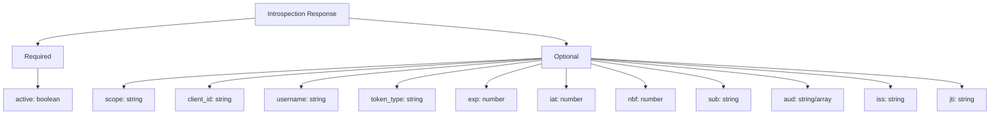
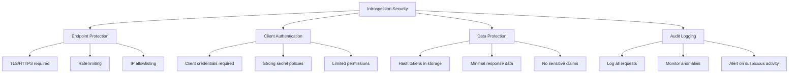

# How to Handle OAuth2 Token Introspection

Author: [nawazdhandala](https://www.github.com/nawazdhandala)

Tags: OAuth2, Token Introspection, Security, API, Authentication, RFC7662

Description: Learn how to implement OAuth2 token introspection for validating opaque tokens and checking token metadata in your applications.

---

OAuth2 Token Introspection (RFC 7662) provides a standard way for resource servers to query an authorization server about the current state of an access token. This is essential when using opaque tokens or when you need real-time token validation. This guide covers implementation patterns for both introspection clients and servers.

## Understanding Token Introspection

Token introspection allows a protected resource to query the authorization server to determine the active state of an access token and retrieve metadata about the token.





## Implementing an Introspection Client

### Basic Introspection Request

```javascript
// introspection-client.js
// OAuth2 token introspection client

const axios = require('axios');

class TokenIntrospectionClient {
    constructor(options) {
        this.introspectionEndpoint = options.introspectionEndpoint;
        this.clientId = options.clientId;
        this.clientSecret = options.clientSecret;

        // Optional caching
        this.cache = options.enableCache ? new Map() : null;
        this.cacheTTL = options.cacheTTL || 60000;  // 1 minute default
    }

    async introspect(token, tokenTypeHint = 'access_token') {
        // Check cache first
        if (this.cache) {
            const cached = this.getFromCache(token);
            if (cached) {
                return cached;
            }
        }

        try {
            const response = await axios.post(
                this.introspectionEndpoint,
                new URLSearchParams({
                    token: token,
                    token_type_hint: tokenTypeHint
                }),
                {
                    headers: {
                        'Content-Type': 'application/x-www-form-urlencoded'
                    },
                    auth: {
                        username: this.clientId,
                        password: this.clientSecret
                    }
                }
            );

            const result = response.data;

            // Cache the result if caching is enabled
            if (this.cache && result.active) {
                this.addToCache(token, result);
            }

            return result;

        } catch (error) {
            console.error('Introspection failed:', error.message);
            throw new Error('Token introspection failed');
        }
    }

    getFromCache(token) {
        if (!this.cache.has(token)) {
            return null;
        }

        const entry = this.cache.get(token);

        // Check if cache entry has expired
        if (Date.now() > entry.expiresAt) {
            this.cache.delete(token);
            return null;
        }

        return entry.data;
    }

    addToCache(token, data) {
        // Calculate cache expiry based on token exp or default TTL
        let expiresAt;

        if (data.exp) {
            // Use token expiry minus buffer time
            const tokenExpiry = data.exp * 1000;
            const bufferTime = 30000;  // 30 seconds
            expiresAt = Math.min(tokenExpiry - bufferTime, Date.now() + this.cacheTTL);
        } else {
            expiresAt = Date.now() + this.cacheTTL;
        }

        this.cache.set(token, {
            data,
            expiresAt
        });

        // Cleanup old entries periodically
        this.cleanupCache();
    }

    cleanupCache() {
        const now = Date.now();
        for (const [key, entry] of this.cache.entries()) {
            if (now > entry.expiresAt) {
                this.cache.delete(key);
            }
        }
    }
}

// Usage
const introspectionClient = new TokenIntrospectionClient({
    introspectionEndpoint: 'https://auth.example.com/oauth/introspect',
    clientId: 'resource-server-client-id',
    clientSecret: 'resource-server-client-secret',
    enableCache: true,
    cacheTTL: 60000
});

// Introspect a token
const tokenInfo = await introspectionClient.introspect('access-token-here');

if (tokenInfo.active) {
    console.log('Token is valid');
    console.log('Subject:', tokenInfo.sub);
    console.log('Scope:', tokenInfo.scope);
    console.log('Expires:', new Date(tokenInfo.exp * 1000));
} else {
    console.log('Token is not active');
}
```

### Express Middleware for Token Introspection

```javascript
// introspection-middleware.js
// Express middleware using token introspection

const express = require('express');

function createIntrospectionMiddleware(introspectionClient, options = {}) {
    const requiredScopes = options.scopes || [];

    return async (req, res, next) => {
        // Extract token from Authorization header
        const authHeader = req.headers.authorization;

        if (!authHeader) {
            return res.status(401).json({
                error: 'missing_token',
                error_description: 'No authorization header provided'
            });
        }

        const [scheme, token] = authHeader.split(' ');

        if (scheme.toLowerCase() !== 'bearer' || !token) {
            return res.status(401).json({
                error: 'invalid_token',
                error_description: 'Invalid authorization header format'
            });
        }

        try {
            // Introspect the token
            const tokenInfo = await introspectionClient.introspect(token);

            if (!tokenInfo.active) {
                return res.status(401).json({
                    error: 'invalid_token',
                    error_description: 'Token is not active'
                });
            }

            // Check required scopes
            if (requiredScopes.length > 0) {
                const tokenScopes = (tokenInfo.scope || '').split(' ');
                const missingScopes = requiredScopes.filter(s => !tokenScopes.includes(s));

                if (missingScopes.length > 0) {
                    return res.status(403).json({
                        error: 'insufficient_scope',
                        error_description: `Missing required scopes: ${missingScopes.join(', ')}`
                    });
                }
            }

            // Attach token info to request
            req.tokenInfo = tokenInfo;
            req.user = {
                id: tokenInfo.sub,
                clientId: tokenInfo.client_id,
                scope: tokenInfo.scope
            };

            next();

        } catch (error) {
            console.error('Token introspection error:', error);
            return res.status(500).json({
                error: 'server_error',
                error_description: 'Failed to validate token'
            });
        }
    };
}

// Usage
const app = express();

// Create middleware
const validateToken = createIntrospectionMiddleware(introspectionClient);
const validateTokenWithScopes = createIntrospectionMiddleware(introspectionClient, {
    scopes: ['read:users']
});

// Protected routes
app.get('/api/profile', validateToken, (req, res) => {
    res.json({
        userId: req.user.id,
        tokenInfo: req.tokenInfo
    });
});

app.get('/api/users', validateTokenWithScopes, (req, res) => {
    res.json({ users: [] });
});
```

## Implementing an Introspection Server

### Basic Introspection Endpoint

```javascript
// introspection-server.js
// OAuth2 token introspection endpoint

const express = require('express');
const router = express.Router();

// Token storage (use database in production)
const tokens = new Map();

// Client credentials storage
const clients = new Map([
    ['resource-server-1', {
        id: 'resource-server-1',
        secret: 'resource-server-secret',
        allowedToIntrospect: true
    }]
]);

// POST /oauth/introspect
router.post('/introspect',
    express.urlencoded({ extended: false }),
    authenticateClient,
    (req, res) => {
        const { token, token_type_hint } = req.body;

        if (!token) {
            return res.status(400).json({
                error: 'invalid_request',
                error_description: 'Missing required parameter: token'
            });
        }

        // Look up token
        const tokenData = findToken(token, token_type_hint);

        if (!tokenData) {
            // Token not found - return inactive
            return res.json({ active: false });
        }

        // Check if token is expired
        if (tokenData.expiresAt && Date.now() > tokenData.expiresAt) {
            return res.json({ active: false });
        }

        // Check if token is revoked
        if (tokenData.revoked) {
            return res.json({ active: false });
        }

        // Return token metadata
        const response = {
            active: true,
            scope: tokenData.scope,
            client_id: tokenData.clientId,
            username: tokenData.username,
            token_type: tokenData.tokenType || 'Bearer',
            exp: Math.floor(tokenData.expiresAt / 1000),
            iat: Math.floor(tokenData.issuedAt / 1000),
            nbf: Math.floor(tokenData.notBefore / 1000),
            sub: tokenData.subject,
            aud: tokenData.audience,
            iss: tokenData.issuer
        };

        // Add custom claims if present
        if (tokenData.customClaims) {
            Object.assign(response, tokenData.customClaims);
        }

        // Remove undefined values
        Object.keys(response).forEach(key => {
            if (response[key] === undefined) {
                delete response[key];
            }
        });

        res.json(response);
    }
);

// Client authentication middleware
function authenticateClient(req, res, next) {
    // Support Basic authentication
    const authHeader = req.headers.authorization;

    if (authHeader && authHeader.startsWith('Basic ')) {
        const credentials = Buffer.from(authHeader.slice(6), 'base64').toString();
        const [clientId, clientSecret] = credentials.split(':');

        const client = clients.get(clientId);

        if (client && client.secret === clientSecret && client.allowedToIntrospect) {
            req.client = client;
            return next();
        }
    }

    // Support POST body authentication
    const { client_id, client_secret } = req.body;

    if (client_id && client_secret) {
        const client = clients.get(client_id);

        if (client && client.secret === client_secret && client.allowedToIntrospect) {
            req.client = client;
            return next();
        }
    }

    return res.status(401).json({
        error: 'invalid_client',
        error_description: 'Client authentication failed'
    });
}

// Find token by value, optionally considering type hint
function findToken(tokenValue, typeHint) {
    // If type hint is provided, search that type first
    const searchOrder = typeHint === 'refresh_token'
        ? ['refresh_token', 'access_token']
        : ['access_token', 'refresh_token'];

    for (const tokenType of searchOrder) {
        const key = `${tokenType}:${tokenValue}`;
        if (tokens.has(key)) {
            return tokens.get(key);
        }
    }

    // Also check by token value directly
    return tokens.get(tokenValue);
}

module.exports = router;
```

### Complete Introspection Server with Database

```javascript
// introspection-server-db.js
// Production-ready introspection server with database

const express = require('express');
const { Pool } = require('pg');
const bcrypt = require('bcrypt');

const router = express.Router();
const pool = new Pool();

// POST /oauth/introspect
router.post('/introspect',
    express.urlencoded({ extended: false }),
    rateLimit({ windowMs: 60000, max: 100 }),
    async (req, res) => {
        // Authenticate the requesting client
        const client = await authenticateClient(req);

        if (!client) {
            return res.status(401).json({
                error: 'invalid_client',
                error_description: 'Client authentication failed'
            });
        }

        const { token, token_type_hint } = req.body;

        if (!token) {
            return res.status(400).json({
                error: 'invalid_request',
                error_description: 'Missing required parameter: token'
            });
        }

        try {
            // Query token from database
            const tokenData = await findTokenInDatabase(token, token_type_hint);

            if (!tokenData || !isTokenActive(tokenData)) {
                // Always return 200 with active: false for invalid/expired tokens
                return res.json({ active: false });
            }

            // Check if client is allowed to introspect this token
            if (!canClientIntrospect(client, tokenData)) {
                return res.json({ active: false });
            }

            // Build response
            const response = buildIntrospectionResponse(tokenData);

            // Log introspection event
            await logIntrospection(client.id, tokenData.id, req.ip);

            res.json(response);

        } catch (error) {
            console.error('Introspection error:', error);
            return res.status(500).json({
                error: 'server_error',
                error_description: 'Internal server error'
            });
        }
    }
);

async function authenticateClient(req) {
    let clientId, clientSecret;

    // Try Basic auth first
    const authHeader = req.headers.authorization;
    if (authHeader && authHeader.startsWith('Basic ')) {
        const credentials = Buffer.from(authHeader.slice(6), 'base64').toString();
        [clientId, clientSecret] = credentials.split(':');
    } else {
        // Fall back to POST body
        clientId = req.body.client_id;
        clientSecret = req.body.client_secret;
    }

    if (!clientId || !clientSecret) {
        return null;
    }

    // Look up client in database
    const result = await pool.query(
        'SELECT * FROM oauth_clients WHERE client_id = $1',
        [clientId]
    );

    const client = result.rows[0];

    if (!client) {
        return null;
    }

    // Verify secret
    const secretValid = await bcrypt.compare(clientSecret, client.client_secret_hash);

    if (!secretValid) {
        return null;
    }

    // Check if client has introspection permission
    if (!client.can_introspect) {
        return null;
    }

    return client;
}

async function findTokenInDatabase(tokenValue, typeHint) {
    // Hash the token value for lookup (tokens are stored hashed)
    const tokenHash = hashToken(tokenValue);

    let query;
    let params;

    if (typeHint === 'refresh_token') {
        query = `
            SELECT * FROM oauth_tokens
            WHERE token_hash = $1 AND token_type = 'refresh_token'
            UNION
            SELECT * FROM oauth_tokens
            WHERE token_hash = $1 AND token_type = 'access_token'
            LIMIT 1
        `;
    } else {
        query = `
            SELECT * FROM oauth_tokens
            WHERE token_hash = $1 AND token_type = 'access_token'
            UNION
            SELECT * FROM oauth_tokens
            WHERE token_hash = $1 AND token_type = 'refresh_token'
            LIMIT 1
        `;
    }

    const result = await pool.query(query, [tokenHash]);
    return result.rows[0];
}

function isTokenActive(tokenData) {
    // Check revocation
    if (tokenData.revoked_at) {
        return false;
    }

    // Check expiration
    if (tokenData.expires_at && new Date(tokenData.expires_at) < new Date()) {
        return false;
    }

    // Check not-before time
    if (tokenData.not_before && new Date(tokenData.not_before) > new Date()) {
        return false;
    }

    return true;
}

function canClientIntrospect(client, tokenData) {
    // Resource servers can only introspect tokens for their own audience
    if (client.client_type === 'resource_server') {
        const audience = Array.isArray(tokenData.audience)
            ? tokenData.audience
            : [tokenData.audience];

        return audience.includes(client.resource_identifier);
    }

    // Confidential clients can introspect their own tokens
    if (client.client_type === 'confidential') {
        return tokenData.client_id === client.client_id;
    }

    return false;
}

function buildIntrospectionResponse(tokenData) {
    const response = {
        active: true,
        scope: tokenData.scope,
        client_id: tokenData.client_id,
        token_type: tokenData.token_type === 'access_token' ? 'Bearer' : tokenData.token_type,
        sub: tokenData.subject,
        aud: tokenData.audience,
        iss: tokenData.issuer
    };

    // Add timestamps
    if (tokenData.expires_at) {
        response.exp = Math.floor(new Date(tokenData.expires_at).getTime() / 1000);
    }
    if (tokenData.issued_at) {
        response.iat = Math.floor(new Date(tokenData.issued_at).getTime() / 1000);
    }
    if (tokenData.not_before) {
        response.nbf = Math.floor(new Date(tokenData.not_before).getTime() / 1000);
    }

    // Add username if available
    if (tokenData.username) {
        response.username = tokenData.username;
    }

    // Add custom claims
    if (tokenData.custom_claims) {
        Object.assign(response, tokenData.custom_claims);
    }

    return response;
}

function hashToken(token) {
    const crypto = require('crypto');
    return crypto.createHash('sha256').update(token).digest('hex');
}

async function logIntrospection(clientId, tokenId, ipAddress) {
    await pool.query(
        'INSERT INTO introspection_logs (client_id, token_id, ip_address, timestamp) VALUES ($1, $2, $3, NOW())',
        [clientId, tokenId, ipAddress]
    );
}

module.exports = router;
```

## Introspection Response Structure

The introspection response contains metadata about the token.



### Response Examples

```javascript
// Active token response
const activeResponse = {
    "active": true,
    "scope": "read write",
    "client_id": "mobile-app",
    "username": "john.doe@example.com",
    "token_type": "Bearer",
    "exp": 1735689600,
    "iat": 1735603200,
    "sub": "user-123",
    "aud": "https://api.example.com",
    "iss": "https://auth.example.com"
};

// Inactive token response (expired, revoked, or not found)
const inactiveResponse = {
    "active": false
};

// Token with custom claims
const tokenWithCustomClaims = {
    "active": true,
    "scope": "openid profile email",
    "client_id": "spa-client",
    "sub": "user-456",
    "exp": 1735689600,
    "iat": 1735603200,
    "iss": "https://auth.example.com",
    // Custom claims
    "https://example.com/roles": ["admin", "editor"],
    "https://example.com/tenant": "acme-corp"
};
```

## Performance Optimization

### Caching Strategies

```javascript
// caching-introspection.js
// Optimized introspection with multi-level caching

const Redis = require('ioredis');

class CachedIntrospectionClient {
    constructor(options) {
        this.introspectionEndpoint = options.introspectionEndpoint;
        this.clientId = options.clientId;
        this.clientSecret = options.clientSecret;

        // Local in-memory cache (L1)
        this.localCache = new Map();
        this.localCacheTTL = options.localCacheTTL || 10000;  // 10 seconds

        // Redis cache (L2)
        this.redis = new Redis(options.redisUrl);
        this.redisCacheTTL = options.redisCacheTTL || 60;  // 60 seconds

        // Cleanup interval
        setInterval(() => this.cleanupLocalCache(), 30000);
    }

    async introspect(token) {
        const cacheKey = this.getCacheKey(token);

        // Check L1 cache
        const localCached = this.getFromLocalCache(cacheKey);
        if (localCached) {
            return localCached;
        }

        // Check L2 cache (Redis)
        const redisCached = await this.getFromRedisCache(cacheKey);
        if (redisCached) {
            // Populate L1 cache
            this.setLocalCache(cacheKey, redisCached);
            return redisCached;
        }

        // Call introspection endpoint
        const result = await this.callIntrospectionEndpoint(token);

        // Cache the result
        if (result.active) {
            await this.cacheResult(cacheKey, result);
        }

        return result;
    }

    getCacheKey(token) {
        const crypto = require('crypto');
        return `introspection:${crypto.createHash('sha256').update(token).digest('hex')}`;
    }

    getFromLocalCache(key) {
        const entry = this.localCache.get(key);
        if (entry && Date.now() < entry.expiresAt) {
            return entry.data;
        }
        this.localCache.delete(key);
        return null;
    }

    setLocalCache(key, data) {
        this.localCache.set(key, {
            data,
            expiresAt: Date.now() + this.localCacheTTL
        });
    }

    async getFromRedisCache(key) {
        const cached = await this.redis.get(key);
        return cached ? JSON.parse(cached) : null;
    }

    async setRedisCache(key, data, ttl) {
        await this.redis.setex(key, ttl, JSON.stringify(data));
    }

    async cacheResult(key, result) {
        // Calculate TTL based on token expiration
        let ttl = this.redisCacheTTL;

        if (result.exp) {
            const tokenTTL = result.exp - Math.floor(Date.now() / 1000);
            ttl = Math.min(ttl, tokenTTL - 5);  // 5 second buffer
        }

        if (ttl > 0) {
            this.setLocalCache(key, result);
            await this.setRedisCache(key, result, ttl);
        }
    }

    async callIntrospectionEndpoint(token) {
        const axios = require('axios');

        const response = await axios.post(
            this.introspectionEndpoint,
            new URLSearchParams({ token }),
            {
                headers: { 'Content-Type': 'application/x-www-form-urlencoded' },
                auth: { username: this.clientId, password: this.clientSecret },
                timeout: 5000
            }
        );

        return response.data;
    }

    cleanupLocalCache() {
        const now = Date.now();
        for (const [key, entry] of this.localCache.entries()) {
            if (now >= entry.expiresAt) {
                this.localCache.delete(key);
            }
        }
    }

    // Invalidate cache when token is revoked
    async invalidate(token) {
        const cacheKey = this.getCacheKey(token);
        this.localCache.delete(cacheKey);
        await this.redis.del(cacheKey);
    }
}
```

### Batch Introspection

```javascript
// batch-introspection.js
// Handle multiple token introspections efficiently

class BatchIntrospectionClient {
    constructor(options) {
        this.client = new CachedIntrospectionClient(options);
        this.batchSize = options.batchSize || 10;
        this.batchDelay = options.batchDelay || 50;  // milliseconds

        this.pendingRequests = new Map();
        this.batchTimer = null;
    }

    async introspect(token) {
        // Check if already pending
        if (this.pendingRequests.has(token)) {
            return this.pendingRequests.get(token);
        }

        // Create promise for this request
        const promise = new Promise((resolve, reject) => {
            this.pendingRequests.set(token, { resolve, reject, token });
        });

        // Schedule batch execution
        this.scheduleBatch();

        return promise;
    }

    scheduleBatch() {
        if (this.batchTimer) {
            return;
        }

        this.batchTimer = setTimeout(() => this.executeBatch(), this.batchDelay);
    }

    async executeBatch() {
        this.batchTimer = null;

        const batch = Array.from(this.pendingRequests.values());
        this.pendingRequests.clear();

        // Process in parallel with concurrency limit
        const results = await this.processBatch(batch);

        // Resolve promises
        batch.forEach((request, index) => {
            if (results[index].error) {
                request.reject(results[index].error);
            } else {
                request.resolve(results[index].data);
            }
        });
    }

    async processBatch(batch) {
        const concurrency = this.batchSize;
        const results = [];

        for (let i = 0; i < batch.length; i += concurrency) {
            const chunk = batch.slice(i, i + concurrency);
            const chunkResults = await Promise.all(
                chunk.map(async (request) => {
                    try {
                        const data = await this.client.introspect(request.token);
                        return { data };
                    } catch (error) {
                        return { error };
                    }
                })
            );
            results.push(...chunkResults);
        }

        return results;
    }
}
```

## Security Considerations



### Security Best Practices

```javascript
// security-config.js
// Security hardening for introspection

const rateLimit = require('express-rate-limit');
const helmet = require('helmet');

// 1. Rate limiting
const introspectionRateLimit = rateLimit({
    windowMs: 60 * 1000,  // 1 minute
    max: 100,  // 100 requests per minute per client
    keyGenerator: (req) => {
        // Rate limit by client ID
        const clientId = extractClientId(req);
        return clientId || req.ip;
    },
    handler: (req, res) => {
        res.status(429).json({
            error: 'rate_limit_exceeded',
            error_description: 'Too many introspection requests'
        });
    }
});

// 2. IP allowlisting for internal services
function ipAllowlist(allowedIPs) {
    return (req, res, next) => {
        const clientIP = req.ip || req.connection.remoteAddress;

        if (!allowedIPs.includes(clientIP)) {
            return res.status(403).json({
                error: 'access_denied',
                error_description: 'IP not allowed'
            });
        }

        next();
    };
}

// 3. Secure token storage
const crypto = require('crypto');

function hashTokenForStorage(token) {
    // Use SHA-256 for token lookup
    return crypto.createHash('sha256').update(token).digest('hex');
}

function generateSecureToken() {
    // Generate cryptographically secure random token
    return crypto.randomBytes(32).toString('base64url');
}

// 4. Audit logging
async function logIntrospectionRequest(req, tokenInfo, result) {
    const logEntry = {
        timestamp: new Date().toISOString(),
        clientId: req.client?.id,
        clientIP: req.ip,
        userAgent: req.headers['user-agent'],
        tokenId: tokenInfo?.jti,
        tokenSubject: tokenInfo?.sub,
        result: result.active ? 'active' : 'inactive',
        responseTime: req.responseTime
    };

    // Log to audit system
    await auditLogger.log('token_introspection', logEntry);

    // Alert on suspicious patterns
    await checkForSuspiciousActivity(logEntry);
}
```

## Testing Introspection

```javascript
// introspection.test.js
// Test suite for token introspection

const request = require('supertest');
const app = require('./app');

describe('Token Introspection', () => {
    const validToken = 'valid-access-token';
    const expiredToken = 'expired-access-token';
    const revokedToken = 'revoked-access-token';
    const clientCredentials = Buffer.from('client:secret').toString('base64');

    describe('POST /oauth/introspect', () => {
        it('should return active: true for valid token', async () => {
            const response = await request(app)
                .post('/oauth/introspect')
                .set('Authorization', `Basic ${clientCredentials}`)
                .send({ token: validToken });

            expect(response.status).toBe(200);
            expect(response.body.active).toBe(true);
            expect(response.body.scope).toBeDefined();
            expect(response.body.sub).toBeDefined();
        });

        it('should return active: false for expired token', async () => {
            const response = await request(app)
                .post('/oauth/introspect')
                .set('Authorization', `Basic ${clientCredentials}`)
                .send({ token: expiredToken });

            expect(response.status).toBe(200);
            expect(response.body.active).toBe(false);
        });

        it('should return active: false for revoked token', async () => {
            const response = await request(app)
                .post('/oauth/introspect')
                .set('Authorization', `Basic ${clientCredentials}`)
                .send({ token: revokedToken });

            expect(response.status).toBe(200);
            expect(response.body.active).toBe(false);
        });

        it('should return active: false for unknown token', async () => {
            const response = await request(app)
                .post('/oauth/introspect')
                .set('Authorization', `Basic ${clientCredentials}`)
                .send({ token: 'non-existent-token' });

            expect(response.status).toBe(200);
            expect(response.body.active).toBe(false);
        });

        it('should reject request without client authentication', async () => {
            const response = await request(app)
                .post('/oauth/introspect')
                .send({ token: validToken });

            expect(response.status).toBe(401);
            expect(response.body.error).toBe('invalid_client');
        });

        it('should handle missing token parameter', async () => {
            const response = await request(app)
                .post('/oauth/introspect')
                .set('Authorization', `Basic ${clientCredentials}`)
                .send({});

            expect(response.status).toBe(400);
            expect(response.body.error).toBe('invalid_request');
        });
    });
});
```

## Conclusion

Token introspection is essential for applications that use opaque tokens or require real-time token validation with revocation support. Implement proper caching to minimize latency, secure your introspection endpoint with authentication and rate limiting, and ensure you handle all token states correctly. For high-throughput systems, consider using a combination of JWT validation for most requests with introspection checks for sensitive operations or periodic revalidation.
