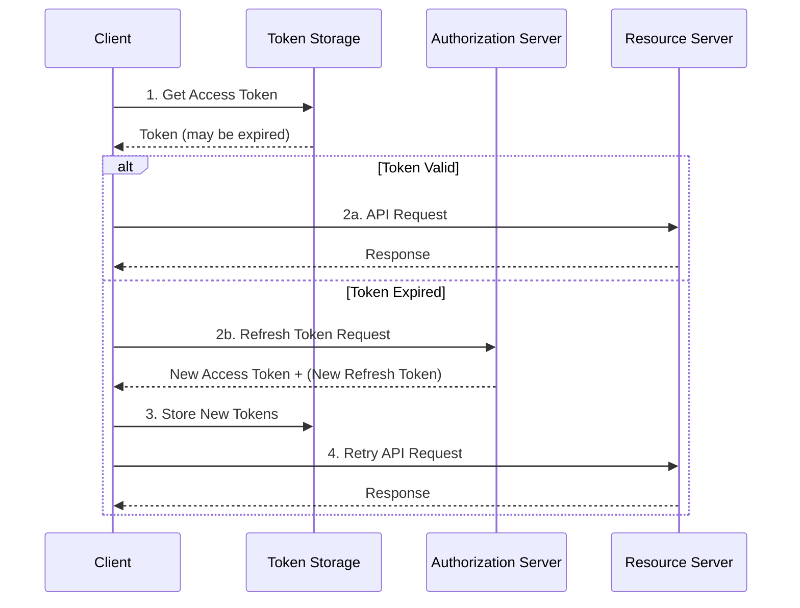
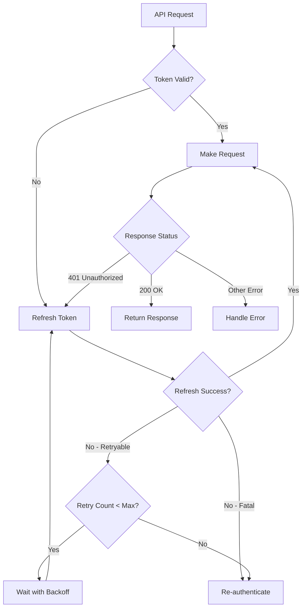
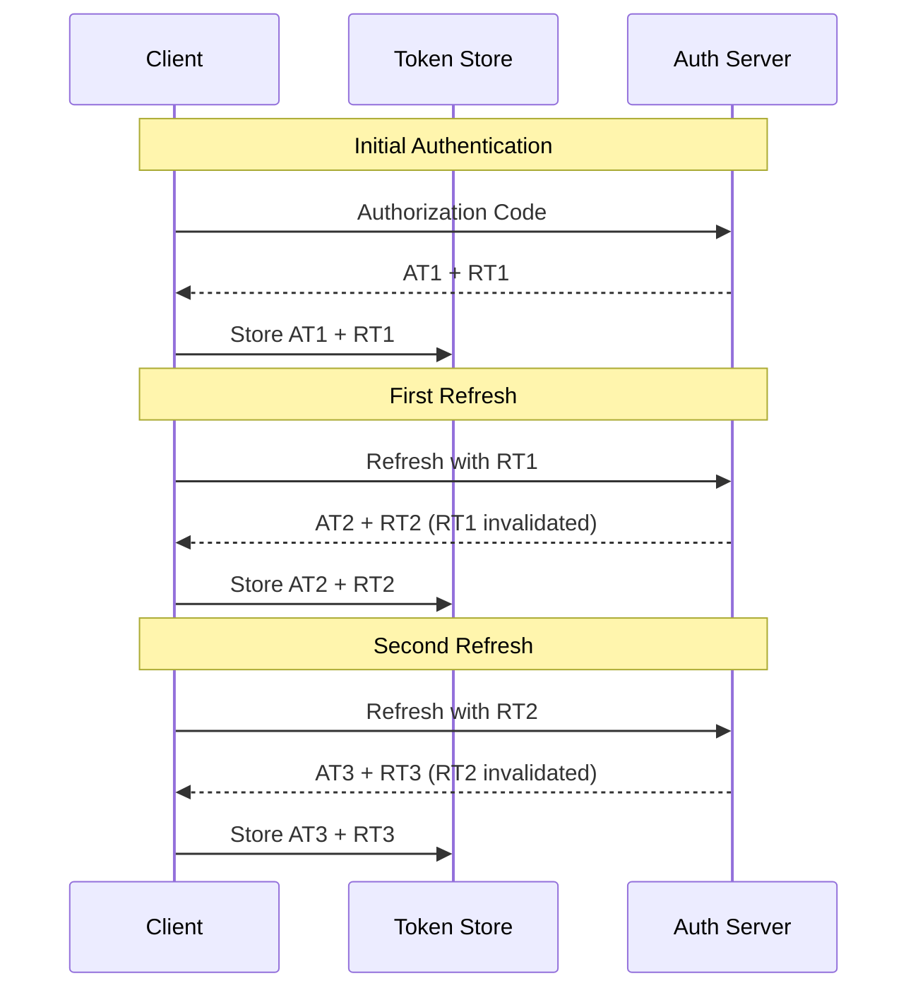

# How to Handle Token Refresh in OAuth2

Author: [nawazdhandala](https://www.github.com/nawazdhandala)

Tags: OAuth2, Authentication, Security, API, Token Management

Description: Learn how to implement robust OAuth2 token refresh mechanisms including automatic refresh, retry strategies, token rotation, and handling refresh failures gracefully.

---

Token refresh is a critical component of OAuth2 implementations. Access tokens are intentionally short-lived for security, so applications must refresh them periodically without disrupting the user experience. This guide covers best practices for implementing reliable token refresh mechanisms.

## Understanding Token Refresh Flow



## Basic Token Refresh Implementation

```python
import time
import requests
from dataclasses import dataclass
from typing import Optional
import threading

@dataclass
class TokenData:
    """Holds OAuth2 token information."""
    access_token: str
    refresh_token: str
    expires_at: float
    token_type: str = "Bearer"
    scope: Optional[str] = None


class OAuth2TokenManager:
    """
    Manages OAuth2 tokens with automatic refresh capability.
    """

    def __init__(
        self,
        client_id: str,
        client_secret: str,
        token_url: str,
        refresh_buffer_seconds: int = 60
    ):
        self.client_id = client_id
        self.client_secret = client_secret
        self.token_url = token_url
        self.refresh_buffer = refresh_buffer_seconds
        self._token_data: Optional[TokenData] = None
        self._lock = threading.Lock()

    def set_tokens(self, token_response: dict) -> None:
        """
        Store tokens from an OAuth2 token response.
        """
        expires_in = token_response.get("expires_in", 3600)

        self._token_data = TokenData(
            access_token=token_response["access_token"],
            refresh_token=token_response["refresh_token"],
            expires_at=time.time() + expires_in,
            token_type=token_response.get("token_type", "Bearer"),
            scope=token_response.get("scope")
        )

    def get_access_token(self) -> str:
        """
        Get a valid access token, refreshing if necessary.
        Thread-safe implementation.
        """
        with self._lock:
            if self._token_data is None:
                raise TokenNotAvailableError("No tokens available. User must authenticate.")

            # Check if token needs refresh (with buffer time)
            if self._is_token_expiring():
                self._refresh_token()

            return self._token_data.access_token

    def _is_token_expiring(self) -> bool:
        """Check if token is expired or will expire soon."""
        if self._token_data is None:
            return True
        return time.time() >= (self._token_data.expires_at - self.refresh_buffer)

    def _refresh_token(self) -> None:
        """
        Refresh the access token using the refresh token.
        """
        if self._token_data is None or not self._token_data.refresh_token:
            raise TokenNotAvailableError("No refresh token available")

        response = requests.post(
            self.token_url,
            data={
                "grant_type": "refresh_token",
                "refresh_token": self._token_data.refresh_token,
                "client_id": self.client_id,
                "client_secret": self.client_secret
            },
            timeout=30
        )

        if response.status_code == 200:
            token_response = response.json()

            # Handle refresh token rotation
            new_refresh_token = token_response.get(
                "refresh_token",
                self._token_data.refresh_token  # Keep old if not rotated
            )
            token_response["refresh_token"] = new_refresh_token

            self.set_tokens(token_response)
        else:
            error_data = response.json()
            if error_data.get("error") == "invalid_grant":
                # Refresh token is invalid/expired
                self._token_data = None
                raise RefreshTokenExpiredError(
                    "Refresh token expired. User must re-authenticate."
                )
            raise TokenRefreshError(f"Token refresh failed: {error_data}")


class TokenNotAvailableError(Exception):
    pass


class RefreshTokenExpiredError(Exception):
    pass


class TokenRefreshError(Exception):
    pass
```

## Automatic Token Refresh with HTTP Client

```python
import requests
from requests.adapters import HTTPAdapter
from urllib3.util.retry import Retry

class OAuth2Session:
    """
    HTTP session with automatic token refresh.
    """

    def __init__(self, token_manager: OAuth2TokenManager, base_url: str = ""):
        self.token_manager = token_manager
        self.base_url = base_url
        self.session = self._create_session()

    def _create_session(self) -> requests.Session:
        """Create a session with retry configuration."""
        session = requests.Session()

        # Configure retries for transient failures
        retry_strategy = Retry(
            total=3,
            backoff_factor=0.5,
            status_forcelist=[500, 502, 503, 504],
            allowed_methods=["GET", "POST", "PUT", "DELETE", "PATCH"]
        )

        adapter = HTTPAdapter(max_retries=retry_strategy)
        session.mount("http://", adapter)
        session.mount("https://", adapter)

        return session

    def request(self, method: str, url: str, **kwargs) -> requests.Response:
        """
        Make an authenticated request with automatic token refresh.
        """
        full_url = f"{self.base_url}{url}" if self.base_url else url

        # Get current access token
        try:
            access_token = self.token_manager.get_access_token()
        except RefreshTokenExpiredError:
            raise  # Re-authentication required

        # Add authorization header
        headers = kwargs.pop("headers", {})
        headers["Authorization"] = f"Bearer {access_token}"

        # Make the request
        response = self.session.request(method, full_url, headers=headers, **kwargs)

        # Handle 401 - token might have been invalidated server-side
        if response.status_code == 401:
            response = self._handle_unauthorized(method, full_url, headers, kwargs)

        return response

    def _handle_unauthorized(
        self,
        method: str,
        url: str,
        headers: dict,
        kwargs: dict
    ) -> requests.Response:
        """
        Handle 401 response by forcing token refresh and retrying.
        """
        try:
            # Force refresh
            self.token_manager._refresh_token()

            # Update header with new token
            headers["Authorization"] = f"Bearer {self.token_manager._token_data.access_token}"

            # Retry the request
            return self.session.request(method, url, headers=headers, **kwargs)

        except (RefreshTokenExpiredError, TokenRefreshError):
            raise

    def get(self, url: str, **kwargs) -> requests.Response:
        return self.request("GET", url, **kwargs)

    def post(self, url: str, **kwargs) -> requests.Response:
        return self.request("POST", url, **kwargs)

    def put(self, url: str, **kwargs) -> requests.Response:
        return self.request("PUT", url, **kwargs)

    def delete(self, url: str, **kwargs) -> requests.Response:
        return self.request("DELETE", url, **kwargs)

    def patch(self, url: str, **kwargs) -> requests.Response:
        return self.request("PATCH", url, **kwargs)


# Usage example
token_manager = OAuth2TokenManager(
    client_id="your_client_id",
    client_secret="your_client_secret",
    token_url="https://auth.example.com/oauth/token"
)

# After initial authentication
token_manager.set_tokens({
    "access_token": "initial_access_token",
    "refresh_token": "initial_refresh_token",
    "expires_in": 3600
})

# Create authenticated session
api = OAuth2Session(token_manager, base_url="https://api.example.com")

# Make requests - tokens are refreshed automatically
response = api.get("/users/me")
```

## Token Refresh with Retry Strategy



```python
import time
import random
from enum import Enum
from typing import Callable

class RefreshErrorType(Enum):
    RETRYABLE = "retryable"      # Network errors, timeouts
    EXPIRED = "expired"          # Refresh token expired
    REVOKED = "revoked"          # Token revoked
    INVALID = "invalid"          # Invalid client credentials


class TokenRefreshWithRetry:
    """
    Token refresh with exponential backoff retry strategy.
    """

    def __init__(
        self,
        token_manager: OAuth2TokenManager,
        max_retries: int = 3,
        base_delay: float = 1.0,
        max_delay: float = 30.0,
        jitter: bool = True
    ):
        self.token_manager = token_manager
        self.max_retries = max_retries
        self.base_delay = base_delay
        self.max_delay = max_delay
        self.jitter = jitter

    def refresh_with_retry(self) -> str:
        """
        Attempt token refresh with exponential backoff.
        Returns the new access token.
        """
        last_exception = None

        for attempt in range(self.max_retries + 1):
            try:
                self.token_manager._refresh_token()
                return self.token_manager._token_data.access_token

            except requests.exceptions.RequestException as e:
                # Network error - retryable
                last_exception = e
                error_type = RefreshErrorType.RETRYABLE

            except TokenRefreshError as e:
                # Check if error is retryable
                error_type = self._classify_error(e)
                last_exception = e

                if error_type != RefreshErrorType.RETRYABLE:
                    # Non-retryable error
                    if error_type == RefreshErrorType.EXPIRED:
                        raise RefreshTokenExpiredError(str(e))
                    raise

            # Calculate delay for retry
            if attempt < self.max_retries:
                delay = self._calculate_delay(attempt)
                print(f"Token refresh failed, retrying in {delay:.2f}s (attempt {attempt + 1}/{self.max_retries})")
                time.sleep(delay)

        # All retries exhausted
        raise TokenRefreshError(f"Token refresh failed after {self.max_retries} retries: {last_exception}")

    def _classify_error(self, error: TokenRefreshError) -> RefreshErrorType:
        """Classify the error to determine if retry is appropriate."""
        error_str = str(error).lower()

        if "invalid_grant" in error_str:
            if "expired" in error_str:
                return RefreshErrorType.EXPIRED
            if "revoked" in error_str:
                return RefreshErrorType.REVOKED

        if "invalid_client" in error_str:
            return RefreshErrorType.INVALID

        # Default to retryable for unknown errors
        return RefreshErrorType.RETRYABLE

    def _calculate_delay(self, attempt: int) -> float:
        """
        Calculate delay with exponential backoff and optional jitter.
        """
        # Exponential backoff: base_delay * 2^attempt
        delay = self.base_delay * (2 ** attempt)

        # Cap at max delay
        delay = min(delay, self.max_delay)

        # Add jitter to prevent thundering herd
        if self.jitter:
            delay = delay * (0.5 + random.random())

        return delay
```

## Proactive Token Refresh

Instead of refreshing tokens when they expire, refresh them proactively in the background:

```python
import threading
import time
from typing import Optional, Callable
import logging

logger = logging.getLogger(__name__)


class ProactiveTokenRefresher:
    """
    Proactively refreshes tokens before they expire.
    """

    def __init__(
        self,
        token_manager: OAuth2TokenManager,
        refresh_threshold: float = 0.75,  # Refresh when 75% of lifetime passed
        check_interval: int = 60,         # Check every 60 seconds
        on_refresh_failure: Optional[Callable] = None
    ):
        self.token_manager = token_manager
        self.refresh_threshold = refresh_threshold
        self.check_interval = check_interval
        self.on_refresh_failure = on_refresh_failure

        self._stop_event = threading.Event()
        self._refresh_thread: Optional[threading.Thread] = None

    def start(self) -> None:
        """Start the background refresh thread."""
        if self._refresh_thread and self._refresh_thread.is_alive():
            return

        self._stop_event.clear()
        self._refresh_thread = threading.Thread(
            target=self._refresh_loop,
            daemon=True,
            name="token-refresher"
        )
        self._refresh_thread.start()
        logger.info("Proactive token refresher started")

    def stop(self) -> None:
        """Stop the background refresh thread."""
        self._stop_event.set()
        if self._refresh_thread:
            self._refresh_thread.join(timeout=5)
        logger.info("Proactive token refresher stopped")

    def _refresh_loop(self) -> None:
        """Background loop that checks and refreshes tokens."""
        while not self._stop_event.is_set():
            try:
                self._check_and_refresh()
            except Exception as e:
                logger.error(f"Error in refresh loop: {e}")

            # Wait for next check interval or stop event
            self._stop_event.wait(timeout=self.check_interval)

    def _check_and_refresh(self) -> None:
        """Check if token needs refresh and refresh if necessary."""
        token_data = self.token_manager._token_data

        if token_data is None:
            return

        # Calculate token lifetime progress
        current_time = time.time()

        # Estimate original expiry time (assuming 1 hour default)
        token_lifetime = 3600  # Could be stored from original response
        issued_at = token_data.expires_at - token_lifetime
        elapsed = current_time - issued_at
        progress = elapsed / token_lifetime

        if progress >= self.refresh_threshold:
            logger.info(f"Token is {progress*100:.1f}% through lifetime, refreshing proactively")

            try:
                self.token_manager._refresh_token()
                logger.info("Proactive token refresh successful")

            except RefreshTokenExpiredError as e:
                logger.error(f"Refresh token expired: {e}")
                if self.on_refresh_failure:
                    self.on_refresh_failure(e)

            except TokenRefreshError as e:
                logger.warning(f"Token refresh failed, will retry: {e}")


# Usage
def handle_refresh_failure(error):
    """Called when token refresh fails and user needs to re-authenticate."""
    print(f"Authentication required: {error}")
    # Notify user, redirect to login, etc.

token_manager = OAuth2TokenManager(
    client_id="your_client_id",
    client_secret="your_client_secret",
    token_url="https://auth.example.com/oauth/token"
)

refresher = ProactiveTokenRefresher(
    token_manager=token_manager,
    refresh_threshold=0.75,
    check_interval=60,
    on_refresh_failure=handle_refresh_failure
)

# Start background refresh
refresher.start()

# Application runs...
# Tokens are refreshed automatically in the background

# On shutdown
refresher.stop()
```

## Handling Refresh Token Rotation

Some OAuth2 providers rotate refresh tokens with each use. Handle this properly:



```python
import json
import os
from pathlib import Path
from typing import Optional
import fcntl


class PersistentTokenStore:
    """
    Persistent token storage with atomic updates for refresh token rotation.
    """

    def __init__(self, storage_path: str):
        self.storage_path = Path(storage_path)
        self.storage_path.parent.mkdir(parents=True, exist_ok=True)

    def save_tokens(self, token_data: TokenData) -> None:
        """
        Atomically save tokens to storage.
        Uses file locking to prevent race conditions.
        """
        data = {
            "access_token": token_data.access_token,
            "refresh_token": token_data.refresh_token,
            "expires_at": token_data.expires_at,
            "token_type": token_data.token_type,
            "scope": token_data.scope
        }

        # Write to temp file first
        temp_path = self.storage_path.with_suffix(".tmp")

        with open(temp_path, "w") as f:
            # Acquire exclusive lock
            fcntl.flock(f.fileno(), fcntl.LOCK_EX)
            try:
                json.dump(data, f)
                f.flush()
                os.fsync(f.fileno())
            finally:
                fcntl.flock(f.fileno(), fcntl.LOCK_UN)

        # Atomic rename
        temp_path.rename(self.storage_path)

    def load_tokens(self) -> Optional[TokenData]:
        """Load tokens from storage."""
        if not self.storage_path.exists():
            return None

        with open(self.storage_path, "r") as f:
            fcntl.flock(f.fileno(), fcntl.LOCK_SH)
            try:
                data = json.load(f)
            finally:
                fcntl.flock(f.fileno(), fcntl.LOCK_UN)

        return TokenData(
            access_token=data["access_token"],
            refresh_token=data["refresh_token"],
            expires_at=data["expires_at"],
            token_type=data.get("token_type", "Bearer"),
            scope=data.get("scope")
        )

    def clear_tokens(self) -> None:
        """Remove stored tokens."""
        if self.storage_path.exists():
            self.storage_path.unlink()


class TokenManagerWithRotation(OAuth2TokenManager):
    """
    Token manager that properly handles refresh token rotation.
    """

    def __init__(
        self,
        client_id: str,
        client_secret: str,
        token_url: str,
        token_store: PersistentTokenStore,
        refresh_buffer_seconds: int = 60
    ):
        super().__init__(client_id, client_secret, token_url, refresh_buffer_seconds)
        self.token_store = token_store

        # Load existing tokens
        stored_tokens = self.token_store.load_tokens()
        if stored_tokens:
            self._token_data = stored_tokens

    def set_tokens(self, token_response: dict) -> None:
        """Store tokens in memory and persist to storage."""
        super().set_tokens(token_response)

        # Persist immediately after refresh token rotation
        if self._token_data:
            self.token_store.save_tokens(self._token_data)

    def _refresh_token(self) -> None:
        """
        Refresh token with proper handling of rotation.
        """
        if self._token_data is None:
            raise TokenNotAvailableError("No tokens available")

        old_refresh_token = self._token_data.refresh_token

        response = requests.post(
            self.token_url,
            data={
                "grant_type": "refresh_token",
                "refresh_token": old_refresh_token,
                "client_id": self.client_id,
                "client_secret": self.client_secret
            },
            timeout=30
        )

        if response.status_code == 200:
            token_response = response.json()

            # Check for rotated refresh token
            new_refresh_token = token_response.get("refresh_token")

            if new_refresh_token and new_refresh_token != old_refresh_token:
                print("Refresh token was rotated")
            elif not new_refresh_token:
                # Provider does not rotate - keep the old one
                token_response["refresh_token"] = old_refresh_token

            self.set_tokens(token_response)
        else:
            error_data = response.json()
            if error_data.get("error") == "invalid_grant":
                self._token_data = None
                self.token_store.clear_tokens()
                raise RefreshTokenExpiredError("Refresh token expired or revoked")
            raise TokenRefreshError(f"Token refresh failed: {error_data}")
```

## Token Refresh in Distributed Systems

Handle token refresh across multiple application instances:

```python
import redis
import time
import json
from typing import Optional

class DistributedTokenManager:
    """
    Token manager for distributed systems using Redis.
    Ensures only one instance refreshes at a time.
    """

    def __init__(
        self,
        client_id: str,
        client_secret: str,
        token_url: str,
        redis_client: redis.Redis,
        token_key: str = "oauth2:tokens",
        lock_key: str = "oauth2:refresh_lock",
        refresh_buffer_seconds: int = 60
    ):
        self.client_id = client_id
        self.client_secret = client_secret
        self.token_url = token_url
        self.redis = redis_client
        self.token_key = token_key
        self.lock_key = lock_key
        self.refresh_buffer = refresh_buffer_seconds

    def get_access_token(self) -> str:
        """
        Get a valid access token, coordinating refresh across instances.
        """
        # Try to get valid token from Redis
        token_data = self._load_tokens()

        if token_data and not self._is_token_expiring(token_data):
            return token_data["access_token"]

        # Token needs refresh - acquire distributed lock
        return self._refresh_with_lock()

    def _load_tokens(self) -> Optional[dict]:
        """Load tokens from Redis."""
        data = self.redis.get(self.token_key)
        if data:
            return json.loads(data)
        return None

    def _save_tokens(self, token_data: dict) -> None:
        """Save tokens to Redis with expiry."""
        # Set expiry slightly longer than token lifetime
        ttl = int(token_data.get("expires_in", 3600) * 1.5)
        self.redis.setex(
            self.token_key,
            ttl,
            json.dumps(token_data)
        )

    def _is_token_expiring(self, token_data: dict) -> bool:
        """Check if token needs refresh."""
        expires_at = token_data.get("expires_at", 0)
        return time.time() >= (expires_at - self.refresh_buffer)

    def _refresh_with_lock(self) -> str:
        """
        Refresh token with distributed lock.
        Only one instance can refresh at a time.
        """
        # Try to acquire lock (30 second timeout)
        lock_acquired = self.redis.set(
            self.lock_key,
            "locked",
            nx=True,  # Only set if not exists
            ex=30     # 30 second expiry
        )

        if lock_acquired:
            try:
                # Double-check token after acquiring lock
                token_data = self._load_tokens()
                if token_data and not self._is_token_expiring(token_data):
                    return token_data["access_token"]

                # Perform refresh
                new_tokens = self._do_refresh(token_data)
                return new_tokens["access_token"]
            finally:
                # Release lock
                self.redis.delete(self.lock_key)
        else:
            # Another instance is refreshing - wait and retry
            return self._wait_for_refresh()

    def _wait_for_refresh(self, max_wait: int = 10) -> str:
        """
        Wait for another instance to complete refresh.
        """
        start_time = time.time()

        while time.time() - start_time < max_wait:
            # Check if refresh completed
            token_data = self._load_tokens()
            if token_data and not self._is_token_expiring(token_data):
                return token_data["access_token"]

            # Wait briefly before checking again
            time.sleep(0.5)

        # Timeout - try to refresh ourselves
        return self._refresh_with_lock()

    def _do_refresh(self, current_tokens: Optional[dict]) -> dict:
        """
        Perform the actual token refresh.
        """
        if not current_tokens or "refresh_token" not in current_tokens:
            raise TokenNotAvailableError("No refresh token available")

        response = requests.post(
            self.token_url,
            data={
                "grant_type": "refresh_token",
                "refresh_token": current_tokens["refresh_token"],
                "client_id": self.client_id,
                "client_secret": self.client_secret
            },
            timeout=30
        )

        if response.status_code != 200:
            error_data = response.json()
            if error_data.get("error") == "invalid_grant":
                self.redis.delete(self.token_key)
                raise RefreshTokenExpiredError("Refresh token expired")
            raise TokenRefreshError(f"Refresh failed: {error_data}")

        new_tokens = response.json()

        # Add metadata
        new_tokens["expires_at"] = time.time() + new_tokens.get("expires_in", 3600)

        # Handle rotation
        if "refresh_token" not in new_tokens:
            new_tokens["refresh_token"] = current_tokens["refresh_token"]

        # Save to Redis
        self._save_tokens(new_tokens)

        return new_tokens
```

## Async Token Refresh

For async applications, implement token refresh with asyncio:

```python
import asyncio
import aiohttp
import time
from typing import Optional

class AsyncTokenManager:
    """
    Async token manager with automatic refresh.
    """

    def __init__(
        self,
        client_id: str,
        client_secret: str,
        token_url: str,
        refresh_buffer_seconds: int = 60
    ):
        self.client_id = client_id
        self.client_secret = client_secret
        self.token_url = token_url
        self.refresh_buffer = refresh_buffer_seconds
        self._token_data: Optional[TokenData] = None
        self._refresh_lock = asyncio.Lock()
        self._session: Optional[aiohttp.ClientSession] = None

    async def _get_session(self) -> aiohttp.ClientSession:
        """Get or create aiohttp session."""
        if self._session is None or self._session.closed:
            self._session = aiohttp.ClientSession()
        return self._session

    async def close(self) -> None:
        """Close the HTTP session."""
        if self._session and not self._session.closed:
            await self._session.close()

    async def get_access_token(self) -> str:
        """
        Get a valid access token, refreshing if necessary.
        Uses async lock to prevent concurrent refresh.
        """
        if self._token_data is None:
            raise TokenNotAvailableError("No tokens available")

        # Check if refresh needed
        if not self._is_token_expiring():
            return self._token_data.access_token

        # Acquire lock for refresh
        async with self._refresh_lock:
            # Double-check after acquiring lock
            if self._is_token_expiring():
                await self._refresh_token()

            return self._token_data.access_token

    def _is_token_expiring(self) -> bool:
        """Check if token needs refresh."""
        if self._token_data is None:
            return True
        return time.time() >= (self._token_data.expires_at - self.refresh_buffer)

    async def _refresh_token(self) -> None:
        """Refresh the access token asynchronously."""
        if self._token_data is None:
            raise TokenNotAvailableError("No tokens available")

        session = await self._get_session()

        async with session.post(
            self.token_url,
            data={
                "grant_type": "refresh_token",
                "refresh_token": self._token_data.refresh_token,
                "client_id": self.client_id,
                "client_secret": self.client_secret
            }
        ) as response:
            if response.status == 200:
                token_response = await response.json()

                # Handle rotation
                if "refresh_token" not in token_response:
                    token_response["refresh_token"] = self._token_data.refresh_token

                self._set_tokens(token_response)
            else:
                error_data = await response.json()
                if error_data.get("error") == "invalid_grant":
                    self._token_data = None
                    raise RefreshTokenExpiredError("Refresh token expired")
                raise TokenRefreshError(f"Refresh failed: {error_data}")

    def _set_tokens(self, token_response: dict) -> None:
        """Store tokens from response."""
        self._token_data = TokenData(
            access_token=token_response["access_token"],
            refresh_token=token_response["refresh_token"],
            expires_at=time.time() + token_response.get("expires_in", 3600),
            token_type=token_response.get("token_type", "Bearer")
        )


class AsyncOAuth2Client:
    """
    Async HTTP client with automatic token refresh.
    """

    def __init__(self, token_manager: AsyncTokenManager, base_url: str = ""):
        self.token_manager = token_manager
        self.base_url = base_url
        self._session: Optional[aiohttp.ClientSession] = None

    async def _get_session(self) -> aiohttp.ClientSession:
        if self._session is None or self._session.closed:
            self._session = aiohttp.ClientSession()
        return self._session

    async def close(self) -> None:
        if self._session and not self._session.closed:
            await self._session.close()
        await self.token_manager.close()

    async def request(self, method: str, url: str, **kwargs) -> aiohttp.ClientResponse:
        """Make an authenticated async request."""
        full_url = f"{self.base_url}{url}" if self.base_url else url

        access_token = await self.token_manager.get_access_token()

        headers = kwargs.pop("headers", {})
        headers["Authorization"] = f"Bearer {access_token}"

        session = await self._get_session()
        response = await session.request(method, full_url, headers=headers, **kwargs)

        # Handle 401 with retry
        if response.status == 401:
            await self.token_manager._refresh_token()
            access_token = await self.token_manager.get_access_token()
            headers["Authorization"] = f"Bearer {access_token}"
            response = await session.request(method, full_url, headers=headers, **kwargs)

        return response

    async def get(self, url: str, **kwargs):
        return await self.request("GET", url, **kwargs)

    async def post(self, url: str, **kwargs):
        return await self.request("POST", url, **kwargs)


# Usage
async def main():
    token_manager = AsyncTokenManager(
        client_id="your_client_id",
        client_secret="your_client_secret",
        token_url="https://auth.example.com/oauth/token"
    )

    client = AsyncOAuth2Client(token_manager, base_url="https://api.example.com")

    try:
        response = await client.get("/users/me")
        data = await response.json()
        print(data)
    finally:
        await client.close()


# Run
asyncio.run(main())
```

## Best Practices Summary

| Practice | Description |
|----------|-------------|
| Refresh proactively | Refresh before expiration to avoid failed requests |
| Use buffer time | Refresh 1-2 minutes before actual expiry |
| Handle rotation | Always check for new refresh token in response |
| Persist tokens | Store tokens securely for application restarts |
| Coordinate refresh | Use locks in multi-threaded/distributed systems |
| Retry with backoff | Implement exponential backoff for transient failures |
| Graceful degradation | Handle refresh failures by prompting re-authentication |

## Summary

Proper token refresh handling is essential for OAuth2 applications. Key takeaways:

- Refresh tokens proactively before access tokens expire
- Use thread-safe or async-safe locking to prevent concurrent refreshes
- Handle refresh token rotation by always storing the latest refresh token
- Implement retry logic with exponential backoff for transient failures
- Use distributed locks (like Redis) in multi-instance deployments
- Always have a fallback to re-authentication when refresh tokens expire
- Persist tokens securely for application restarts
