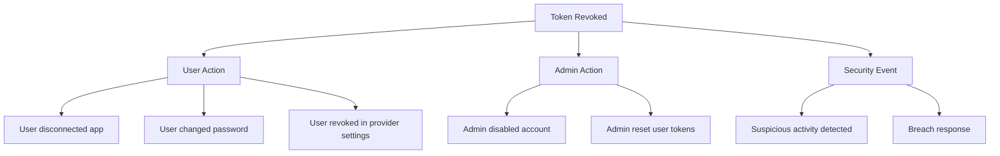
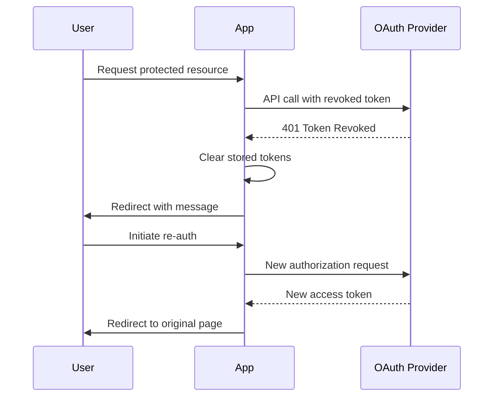

# How to Fix 'Token Revoked' OAuth2 Errors

Author: [nawazdhandala](https://www.github.com/nawazdhandala)

Tags: OAuth2, Authentication, Security, Tokens, Troubleshooting, Error Handling

Description: Learn how to diagnose and fix OAuth2 token revoked errors, including detection strategies, graceful handling, and re-authentication flows.

---

A "token revoked" error occurs when an OAuth2 access token is no longer valid because it was explicitly invalidated. Unlike expired tokens, revoked tokens cannot be refreshed and require the user to re-authenticate.

## Why Tokens Get Revoked

Tokens can be revoked for several reasons:



## Detecting Revoked Tokens

Different OAuth2 providers return this error in various formats.

```python
# Common error formats
# Standard OAuth2
{"error": "invalid_token", "error_description": "The access token has been revoked"}

# GitHub
{"message": "Bad credentials"}

# Microsoft Azure AD
{"error": "invalid_grant", "error_description": "AADSTS70000: The refresh token has been revoked."}
```

### Detection Logic

```python
import re

class TokenRevokedError(Exception):
    def __init__(self, message: str, provider: str = None):
        self.message = message
        self.provider = provider
        super().__init__(self.message)

def is_token_revoked(response: dict, status_code: int) -> bool:
    """Detect if an API response indicates a revoked token."""
    if status_code not in [401, 403]:
        return False

    response_str = str(response).lower()

    revoked_patterns = [
        r"token.*revoked",
        r"invalid.*token",
        r"bad.*credentials",
        r"unauthorized"
    ]

    for pattern in revoked_patterns:
        if re.search(pattern, response_str):
            return True

    error = response.get("error", "")
    return error in ["invalid_token", "invalid_grant", "access_denied"]
```

## Handling Revoked Tokens

```python
from functools import wraps

def handle_token_revoked(redirect_to: str = "login"):
    """Decorator to handle revoked tokens gracefully."""
    def decorator(func):
        @wraps(func)
        def wrapper(*args, **kwargs):
            try:
                return func(*args, **kwargs)
            except TokenRevokedError:
                session.pop("oauth_token", None)
                flash("Your session has ended. Please sign in again.", "info")
                return redirect(url_for(redirect_to))
        return wrapper
    return decorator
```

## Re-Authentication Flow



## Best Practices

### User Communication

Provide clear messages when re-authentication is needed:

```python
REAUTH_MESSAGES = {
    "default": "Your session has ended. Please sign in again.",
    "password_changed": "Your password was recently changed. Please sign in again.",
    "security": "For your security, please verify your identity by signing in again."
}
```

Token revocation is a normal part of OAuth2 lifecycle management. Implement robust detection, graceful handling, and clear user communication for the best experience.
