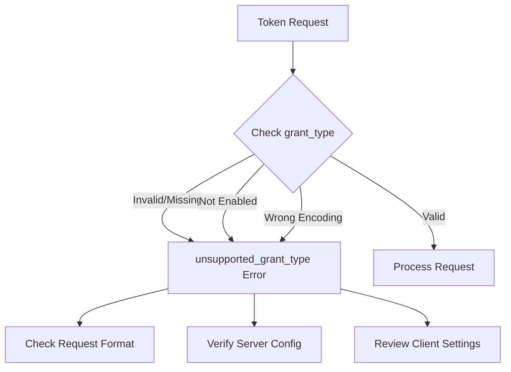
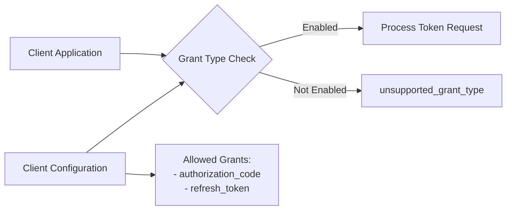

# How to Fix "Unsupported Grant Type" OAuth2 Errors

Author: [nawazdhandala](https://www.github.com/nawazdhandala)

Tags: OAuth2, Authentication, Troubleshooting, Security, API, Errors

Description: Learn how to diagnose and fix "unsupported_grant_type" errors in OAuth2 implementations with practical examples and solutions.

---

The "unsupported_grant_type" error is one of the most common OAuth2 issues developers encounter. This error occurs when the authorization server does not recognize or support the grant type specified in your token request. This guide will help you understand why this error happens and how to fix it.

## Understanding the Error

When you see this error response from an OAuth2 token endpoint, it means something is wrong with your grant_type parameter.

```json
{
  "error": "unsupported_grant_type",
  "error_description": "The authorization grant type is not supported by the authorization server"
}
```



## Common Causes and Solutions

### Cause 1: Incorrect Grant Type Value

The most frequent cause is using an incorrect grant type string.

```javascript
// common-mistakes.js
// Examples of incorrect and correct grant type values

// INCORRECT - typos and wrong values
const incorrectGrants = [
    'authorization-code',     // Wrong: uses dash instead of underscore
    'authorizationcode',      // Wrong: missing underscore
    'auth_code',              // Wrong: abbreviated form
    'Authorization_Code',     // Wrong: capitalized
    'password_grant',         // Wrong: extra word
    'Bearer',                 // Wrong: this is a token type, not grant type
];

// CORRECT - standard OAuth2 grant types
const correctGrants = {
    authorizationCode: 'authorization_code',
    clientCredentials: 'client_credentials',
    refreshToken: 'refresh_token',
    password: 'password',  // Resource Owner Password Credentials
    deviceCode: 'urn:ietf:params:oauth:grant-type:device_code',
    jwtBearer: 'urn:ietf:params:oauth:grant-type:jwt-bearer',
    tokenExchange: 'urn:ietf:params:oauth:grant-type:token-exchange'
};

// Correct token request example
async function getTokenWithAuthorizationCode(code) {
    const response = await fetch('https://auth.example.com/oauth/token', {
        method: 'POST',
        headers: {
            'Content-Type': 'application/x-www-form-urlencoded'
        },
        body: new URLSearchParams({
            grant_type: 'authorization_code',  // Correct value
            code: code,
            redirect_uri: 'https://app.example.com/callback',
            client_id: 'your-client-id',
            client_secret: 'your-client-secret'
        })
    });

    return response.json();
}
```

### Cause 2: Wrong Content-Type Header

OAuth2 token endpoints require `application/x-www-form-urlencoded` content type.

```javascript
// content-type-fix.js
// Demonstrating correct vs incorrect content type

// INCORRECT - Using JSON content type
async function incorrectRequest() {
    const response = await fetch('https://auth.example.com/oauth/token', {
        method: 'POST',
        headers: {
            'Content-Type': 'application/json'  // WRONG
        },
        body: JSON.stringify({
            grant_type: 'client_credentials',
            client_id: 'your-client-id',
            client_secret: 'your-client-secret'
        })
    });

    // This will likely return unsupported_grant_type
    // because the server cannot parse the grant_type from JSON body
    return response.json();
}

// CORRECT - Using form-urlencoded content type
async function correctRequest() {
    const response = await fetch('https://auth.example.com/oauth/token', {
        method: 'POST',
        headers: {
            'Content-Type': 'application/x-www-form-urlencoded'
        },
        body: new URLSearchParams({
            grant_type: 'client_credentials',
            client_id: 'your-client-id',
            client_secret: 'your-client-secret'
        }).toString()
    });

    return response.json();
}
```

### Cause 3: Grant Type Not Enabled for Client

Many OAuth2 servers require grant types to be explicitly enabled per client.



```javascript
// client-config-example.js
// How to check and configure client grant types

// Example: Auth0 Management API to update client grant types
async function enableGrantTypes(clientId, grantTypes) {
    const managementToken = await getManagementToken();

    const response = await fetch(
        `https://your-tenant.auth0.com/api/v2/clients/${clientId}`,
        {
            method: 'PATCH',
            headers: {
                'Authorization': `Bearer ${managementToken}`,
                'Content-Type': 'application/json'
            },
            body: JSON.stringify({
                grant_types: grantTypes
            })
        }
    );

    return response.json();
}

// Enable multiple grant types for a client
await enableGrantTypes('your-client-id', [
    'authorization_code',
    'refresh_token',
    'client_credentials'
]);

// Server-side validation example
function validateGrantType(clientConfig, requestedGrantType) {
    const allowedGrants = clientConfig.grant_types || ['authorization_code'];

    if (!allowedGrants.includes(requestedGrantType)) {
        throw {
            error: 'unsupported_grant_type',
            error_description: `Grant type '${requestedGrantType}' is not allowed for this client`
        };
    }
}
```

### Cause 4: URL Encoding Issues

Special characters in grant type URNs must be properly encoded.

```javascript
// url-encoding-fix.js
// Handle URL encoding for extended grant types

// INCORRECT - Manually constructed body with encoding issues
const incorrectBody =
    'grant_type=urn:ietf:params:oauth:grant-type:device_code' +
    '&device_code=abc123';
// The colons might need encoding depending on the server

// CORRECT - Use URLSearchParams for proper encoding
function buildTokenRequest(grantType, params) {
    const body = new URLSearchParams();
    body.append('grant_type', grantType);

    for (const [key, value] of Object.entries(params)) {
        body.append(key, value);
    }

    // URLSearchParams handles encoding automatically
    return body.toString();
}

// Example for device code grant
const deviceCodeBody = buildTokenRequest(
    'urn:ietf:params:oauth:grant-type:device_code',
    {
        device_code: 'abc123',
        client_id: 'your-client-id'
    }
);

// Example for JWT bearer grant
const jwtBearerBody = buildTokenRequest(
    'urn:ietf:params:oauth:grant-type:jwt-bearer',
    {
        assertion: 'eyJhbGciOiJSUzI1NiIs...',
        client_id: 'your-client-id'
    }
);
```

## Debugging the Error

Here is a systematic approach to debugging the unsupported_grant_type error.

```javascript
// debug-grant-type.js
// Comprehensive debugging utility for OAuth2 token requests

const axios = require('axios');

class OAuth2Debugger {
    constructor(tokenEndpoint) {
        this.tokenEndpoint = tokenEndpoint;
    }

    async debugTokenRequest(params) {
        console.log('=== OAuth2 Token Request Debug ===\n');

        // Step 1: Validate grant type format
        this.validateGrantType(params.grant_type);

        // Step 2: Build request
        const body = new URLSearchParams(params);

        console.log('Request Details:');
        console.log(`  Endpoint: ${this.tokenEndpoint}`);
        console.log(`  Method: POST`);
        console.log(`  Content-Type: application/x-www-form-urlencoded`);
        console.log(`  Body Parameters:`);

        for (const [key, value] of body.entries()) {
            const displayValue = key.includes('secret') || key.includes('password')
                ? '***REDACTED***'
                : value;
            console.log(`    ${key}: ${displayValue}`);
        }

        // Step 3: Make request
        console.log('\nSending request...\n');

        try {
            const response = await axios.post(
                this.tokenEndpoint,
                body.toString(),
                {
                    headers: {
                        'Content-Type': 'application/x-www-form-urlencoded'
                    },
                    validateStatus: () => true  // Accept all status codes
                }
            );

            console.log(`Response Status: ${response.status}`);
            console.log('Response Body:', JSON.stringify(response.data, null, 2));

            if (response.data.error === 'unsupported_grant_type') {
                this.suggestFix(params.grant_type, response.data);
            }

            return response.data;

        } catch (error) {
            console.error('Network Error:', error.message);
            throw error;
        }
    }

    validateGrantType(grantType) {
        const standardGrants = [
            'authorization_code',
            'client_credentials',
            'refresh_token',
            'password'
        ];

        const extendedGrants = [
            'urn:ietf:params:oauth:grant-type:device_code',
            'urn:ietf:params:oauth:grant-type:jwt-bearer',
            'urn:ietf:params:oauth:grant-type:token-exchange'
        ];

        console.log('Grant Type Validation:');
        console.log(`  Provided: "${grantType}"`);

        if (standardGrants.includes(grantType)) {
            console.log('  Status: Valid standard grant type');
        } else if (extendedGrants.includes(grantType)) {
            console.log('  Status: Valid extended grant type (URN format)');
        } else {
            console.log('  Status: WARNING - Non-standard grant type');
            console.log('  Check for typos or verify server supports this grant');
        }

        console.log('');
    }

    suggestFix(grantType, errorResponse) {
        console.log('\n=== Troubleshooting Suggestions ===\n');

        // Check for common typos
        const typoSuggestions = {
            'authorization-code': 'authorization_code',
            'authorizationcode': 'authorization_code',
            'auth_code': 'authorization_code',
            'client-credentials': 'client_credentials',
            'clientcredentials': 'client_credentials',
            'refresh-token': 'refresh_token',
            'refreshtoken': 'refresh_token',
            'device_code': 'urn:ietf:params:oauth:grant-type:device_code'
        };

        if (typoSuggestions[grantType]) {
            console.log(`1. Did you mean "${typoSuggestions[grantType]}"?`);
        }

        console.log('2. Verify the grant type is enabled for your client in the OAuth2 server');
        console.log('3. Check that Content-Type header is "application/x-www-form-urlencoded"');
        console.log('4. Ensure the request body is properly URL-encoded');
        console.log('5. Review the OAuth2 server documentation for supported grant types');
    }
}

// Usage example
async function main() {
    const debugger = new OAuth2Debugger('https://auth.example.com/oauth/token');

    await debugger.debugTokenRequest({
        grant_type: 'client_credentials',
        client_id: 'your-client-id',
        client_secret: 'your-client-secret'
    });
}
```

## Server-Side Implementation Guide

If you are implementing an OAuth2 server, here is how to properly handle grant types.

```javascript
// oauth2-server.js
// Express middleware for handling OAuth2 token requests

const express = require('express');
const router = express.Router();

// Supported grant types
const SUPPORTED_GRANTS = {
    'authorization_code': handleAuthorizationCodeGrant,
    'client_credentials': handleClientCredentialsGrant,
    'refresh_token': handleRefreshTokenGrant,
    'password': handlePasswordGrant,
    'urn:ietf:params:oauth:grant-type:device_code': handleDeviceCodeGrant
};

// Token endpoint
router.post('/token', express.urlencoded({ extended: false }), async (req, res) => {
    const { grant_type } = req.body;

    // Validate grant_type is provided
    if (!grant_type) {
        return res.status(400).json({
            error: 'invalid_request',
            error_description: 'Missing required parameter: grant_type'
        });
    }

    // Check if grant type is supported by server
    const grantHandler = SUPPORTED_GRANTS[grant_type];

    if (!grantHandler) {
        return res.status(400).json({
            error: 'unsupported_grant_type',
            error_description: `Grant type "${grant_type}" is not supported. ` +
                `Supported types: ${Object.keys(SUPPORTED_GRANTS).join(', ')}`
        });
    }

    // Authenticate client
    const client = await authenticateClient(req);

    if (!client) {
        return res.status(401).json({
            error: 'invalid_client',
            error_description: 'Client authentication failed'
        });
    }

    // Check if grant type is allowed for this client
    if (!isGrantAllowedForClient(client, grant_type)) {
        return res.status(400).json({
            error: 'unsupported_grant_type',
            error_description: `Grant type "${grant_type}" is not allowed for this client`
        });
    }

    // Handle the grant
    try {
        const tokens = await grantHandler(req, client);
        res.json(tokens);
    } catch (error) {
        res.status(400).json({
            error: error.code || 'invalid_grant',
            error_description: error.message
        });
    }
});

// Grant handlers
async function handleAuthorizationCodeGrant(req, client) {
    const { code, redirect_uri, code_verifier } = req.body;

    // Validate authorization code
    const authCode = await validateAuthorizationCode(code, client.id);

    if (!authCode) {
        throw { code: 'invalid_grant', message: 'Invalid authorization code' };
    }

    // Verify redirect_uri matches
    if (authCode.redirect_uri !== redirect_uri) {
        throw { code: 'invalid_grant', message: 'redirect_uri mismatch' };
    }

    // Verify PKCE if code_challenge was provided
    if (authCode.code_challenge) {
        if (!verifyCodeVerifier(code_verifier, authCode.code_challenge)) {
            throw { code: 'invalid_grant', message: 'Invalid code_verifier' };
        }
    }

    // Generate tokens
    return generateTokens(authCode.user_id, authCode.scope, client);
}

async function handleClientCredentialsGrant(req, client) {
    const { scope } = req.body;

    // Client credentials grant does not have a user
    // Validate requested scope against client's allowed scopes
    const validatedScope = validateScope(scope, client.allowed_scopes);

    return generateTokens(null, validatedScope, client);
}

async function handleRefreshTokenGrant(req, client) {
    const { refresh_token, scope } = req.body;

    // Validate refresh token
    const tokenData = await validateRefreshToken(refresh_token, client.id);

    if (!tokenData) {
        throw { code: 'invalid_grant', message: 'Invalid refresh token' };
    }

    // Check if narrower scope is requested
    const newScope = scope
        ? validateScopeSubset(scope, tokenData.scope)
        : tokenData.scope;

    return generateTokens(tokenData.user_id, newScope, client);
}

async function handlePasswordGrant(req, client) {
    const { username, password, scope } = req.body;

    // Validate user credentials
    const user = await validateUserCredentials(username, password);

    if (!user) {
        throw { code: 'invalid_grant', message: 'Invalid username or password' };
    }

    return generateTokens(user.id, scope, client);
}

async function handleDeviceCodeGrant(req, client) {
    const { device_code } = req.body;

    // Check device code status
    const codeData = await getDeviceCodeStatus(device_code, client.id);

    if (!codeData) {
        throw { code: 'invalid_grant', message: 'Invalid device code' };
    }

    if (codeData.expired) {
        throw { code: 'expired_token', message: 'Device code has expired' };
    }

    if (!codeData.authorized) {
        throw { code: 'authorization_pending', message: 'Waiting for user authorization' };
    }

    return generateTokens(codeData.user_id, codeData.scope, client);
}

// Helper functions
function isGrantAllowedForClient(client, grantType) {
    const defaultGrants = ['authorization_code', 'refresh_token'];
    const allowedGrants = client.grant_types || defaultGrants;
    return allowedGrants.includes(grantType);
}

module.exports = router;
```

## Framework-Specific Solutions

### Node.js with Axios

```javascript
// axios-oauth2.js
// Proper OAuth2 token request with Axios

const axios = require('axios');
const qs = require('qs');

async function getToken(config) {
    const { tokenUrl, grantType, ...params } = config;

    try {
        const response = await axios({
            method: 'POST',
            url: tokenUrl,
            headers: {
                'Content-Type': 'application/x-www-form-urlencoded'
            },
            // Use qs.stringify for proper encoding
            data: qs.stringify({
                grant_type: grantType,
                ...params
            })
        });

        return response.data;

    } catch (error) {
        if (error.response?.data?.error === 'unsupported_grant_type') {
            console.error('Grant type error. Check:');
            console.error(`  - grant_type value: "${grantType}"`);
            console.error('  - Client configuration in OAuth2 server');
            console.error('  - Server supported grant types');
        }
        throw error;
    }
}

// Usage
await getToken({
    tokenUrl: 'https://auth.example.com/oauth/token',
    grantType: 'client_credentials',
    client_id: 'your-client-id',
    client_secret: 'your-client-secret',
    scope: 'read write'
});
```

### Python with Requests

```python
# oauth2_client.py
# Python OAuth2 token request

import requests

def get_token(token_url, grant_type, **kwargs):
    """
    Request OAuth2 token with proper grant type handling.
    """
    # Build request data
    data = {
        'grant_type': grant_type,
        **kwargs
    }

    # Make request with form-encoded body
    response = requests.post(
        token_url,
        data=data,  # requests automatically uses form encoding
        headers={
            'Content-Type': 'application/x-www-form-urlencoded'
        }
    )

    result = response.json()

    if 'error' in result:
        if result['error'] == 'unsupported_grant_type':
            print(f"Error: Grant type '{grant_type}' is not supported")
            print("Check client configuration and server supported grants")
        raise Exception(result.get('error_description', result['error']))

    return result

# Usage examples
# Client credentials
token = get_token(
    'https://auth.example.com/oauth/token',
    grant_type='client_credentials',
    client_id='your-client-id',
    client_secret='your-client-secret'
)

# Authorization code
token = get_token(
    'https://auth.example.com/oauth/token',
    grant_type='authorization_code',
    code='authorization-code-here',
    redirect_uri='https://app.example.com/callback',
    client_id='your-client-id',
    client_secret='your-client-secret'
)
```

### cURL Examples

```bash
#!/bin/bash
# oauth2-curl.sh
# cURL examples for different grant types

# Client Credentials Grant
curl -X POST https://auth.example.com/oauth/token \
  -H "Content-Type: application/x-www-form-urlencoded" \
  -d "grant_type=client_credentials" \
  -d "client_id=your-client-id" \
  -d "client_secret=your-client-secret"

# Authorization Code Grant
curl -X POST https://auth.example.com/oauth/token \
  -H "Content-Type: application/x-www-form-urlencoded" \
  -d "grant_type=authorization_code" \
  -d "code=AUTH_CODE_HERE" \
  -d "redirect_uri=https://app.example.com/callback" \
  -d "client_id=your-client-id" \
  -d "client_secret=your-client-secret"

# Refresh Token Grant
curl -X POST https://auth.example.com/oauth/token \
  -H "Content-Type: application/x-www-form-urlencoded" \
  -d "grant_type=refresh_token" \
  -d "refresh_token=REFRESH_TOKEN_HERE" \
  -d "client_id=your-client-id" \
  -d "client_secret=your-client-secret"

# Device Code Grant (URN format)
curl -X POST https://auth.example.com/oauth/token \
  -H "Content-Type: application/x-www-form-urlencoded" \
  --data-urlencode "grant_type=urn:ietf:params:oauth:grant-type:device_code" \
  -d "device_code=DEVICE_CODE_HERE" \
  -d "client_id=your-client-id"
```

## Quick Reference Table

| Grant Type | Value | Use Case |
|------------|-------|----------|
| Authorization Code | `authorization_code` | Web apps with server backend |
| Client Credentials | `client_credentials` | Machine-to-machine, APIs |
| Refresh Token | `refresh_token` | Obtaining new access tokens |
| Password | `password` | Legacy apps (not recommended) |
| Device Code | `urn:ietf:params:oauth:grant-type:device_code` | Smart TVs, CLI tools |
| JWT Bearer | `urn:ietf:params:oauth:grant-type:jwt-bearer` | Service accounts |
| Token Exchange | `urn:ietf:params:oauth:grant-type:token-exchange` | Token delegation |

## Conclusion

The "unsupported_grant_type" error typically stems from one of these issues: typos in the grant type value, incorrect Content-Type header, or the grant type not being enabled for your client. By following the debugging steps in this guide and ensuring your requests are properly formatted, you can quickly identify and resolve this common OAuth2 error.
