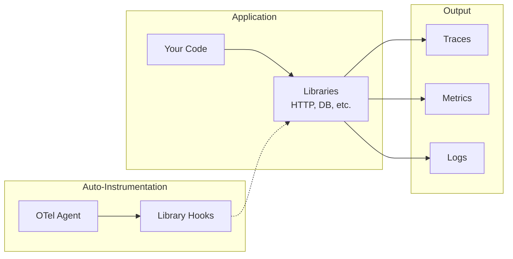
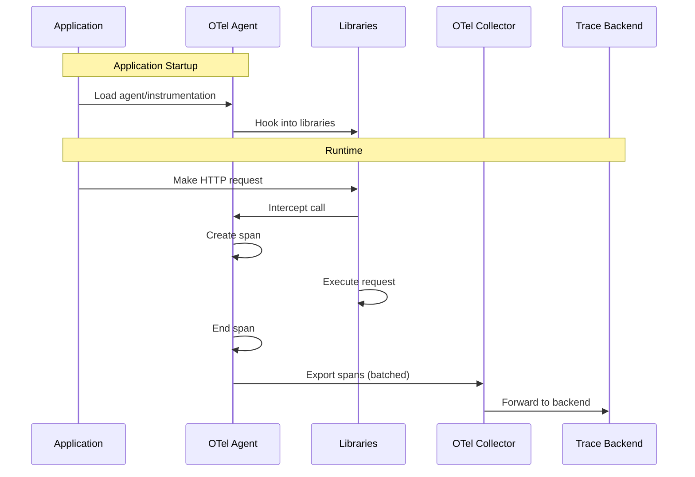

# How to Configure OpenTelemetry Auto-Instrumentation

Author: [nawazdhandala](https://www.github.com/nawazdhandala)

Tags: OpenTelemetry, Auto-Instrumentation, Tracing, Observability, Java, Python, Node.js

Description: Learn how to set up automatic instrumentation in OpenTelemetry for Java, Python, and Node.js applications without code changes.

---

Auto-instrumentation is one of the most powerful features of OpenTelemetry. It allows you to add comprehensive tracing to your applications without modifying your source code. In this guide, we will explore how to configure auto-instrumentation for the most popular programming languages.

## What is Auto-Instrumentation?

Auto-instrumentation automatically captures telemetry data from your application by hooking into common libraries and frameworks. This includes:

- HTTP clients and servers
- Database clients
- Message queues
- Logging frameworks
- And many more



## Java Auto-Instrumentation

Java auto-instrumentation uses a Java agent that attaches to your JVM at startup and instruments bytecode on the fly.

### Setting Up the Java Agent

```bash
# Download the latest OpenTelemetry Java agent
curl -L -O https://github.com/open-telemetry/opentelemetry-java-instrumentation/releases/latest/download/opentelemetry-javaagent.jar
```

### Running Your Application with the Agent

```bash
# Run your Java application with the OpenTelemetry agent
# The -javaagent flag attaches the agent to the JVM
java -javaagent:opentelemetry-javaagent.jar \
  -Dotel.service.name=my-java-service \
  -Dotel.exporter.otlp.endpoint=http://localhost:4317 \
  -Dotel.exporter.otlp.protocol=grpc \
  -jar my-application.jar
```

### Configuration via Environment Variables

```bash
# Environment variables for Java auto-instrumentation
# These can be set in your shell profile or container configuration

# Required: Name your service for identification in traces
export OTEL_SERVICE_NAME=my-java-service

# Required: Point to your OpenTelemetry Collector
export OTEL_EXPORTER_OTLP_ENDPOINT=http://localhost:4317

# Optional: Use gRPC or HTTP protocol
export OTEL_EXPORTER_OTLP_PROTOCOL=grpc

# Optional: Add resource attributes
export OTEL_RESOURCE_ATTRIBUTES=deployment.environment=production,service.version=1.0.0

# Optional: Configure sampling (1.0 = 100% of traces)
export OTEL_TRACES_SAMPLER=parentbased_traceidratio
export OTEL_TRACES_SAMPLER_ARG=0.1

# Optional: Enable specific instrumentations only
export OTEL_INSTRUMENTATION_COMMON_DEFAULT_ENABLED=false
export OTEL_INSTRUMENTATION_HTTP_ENABLED=true
export OTEL_INSTRUMENTATION_JDBC_ENABLED=true

# Optional: Disable specific instrumentations
export OTEL_INSTRUMENTATION_KAFKA_ENABLED=false
```

### Docker Configuration for Java

```dockerfile
# Dockerfile for Java application with OpenTelemetry auto-instrumentation
FROM eclipse-temurin:17-jre

WORKDIR /app

# Copy your application JAR
COPY target/my-application.jar /app/

# Download the OpenTelemetry Java agent
ADD https://github.com/open-telemetry/opentelemetry-java-instrumentation/releases/latest/download/opentelemetry-javaagent.jar /app/opentelemetry-javaagent.jar

# Set environment variables for OpenTelemetry
ENV OTEL_SERVICE_NAME=my-java-service
ENV OTEL_EXPORTER_OTLP_ENDPOINT=http://otel-collector:4317
ENV OTEL_RESOURCE_ATTRIBUTES=deployment.environment=production

# Run with the Java agent attached
ENTRYPOINT ["java", "-javaagent:/app/opentelemetry-javaagent.jar", "-jar", "/app/my-application.jar"]
```

### Spring Boot Configuration File

```yaml
# application.yaml
# Spring Boot configuration for OpenTelemetry

# These properties are read by the OpenTelemetry agent
otel:
  service:
    name: my-spring-boot-service
  exporter:
    otlp:
      endpoint: http://localhost:4317
  resource:
    attributes:
      deployment.environment: production
      service.version: 1.0.0

# Spring Boot Actuator for health checks
management:
  endpoints:
    web:
      exposure:
        include: health,info,prometheus
```

## Python Auto-Instrumentation

Python auto-instrumentation uses monkey-patching to intercept calls to instrumented libraries.

### Installing the Auto-Instrumentation Package

```bash
# Install the OpenTelemetry auto-instrumentation package
pip install opentelemetry-distro opentelemetry-exporter-otlp

# Install all available instrumentations
opentelemetry-bootstrap -a install

# Or install specific instrumentations only
pip install opentelemetry-instrumentation-flask
pip install opentelemetry-instrumentation-requests
pip install opentelemetry-instrumentation-sqlalchemy
pip install opentelemetry-instrumentation-redis
```

### Running Your Application with Auto-Instrumentation

```bash
# Run your Python application with auto-instrumentation
# The opentelemetry-instrument command wraps your application

# Set environment variables
export OTEL_SERVICE_NAME=my-python-service
export OTEL_EXPORTER_OTLP_ENDPOINT=http://localhost:4317
export OTEL_EXPORTER_OTLP_PROTOCOL=grpc
export OTEL_RESOURCE_ATTRIBUTES=deployment.environment=production

# Run with auto-instrumentation
opentelemetry-instrument python my_application.py

# Or for Flask applications
opentelemetry-instrument flask run

# Or for Django applications
opentelemetry-instrument python manage.py runserver

# Or for Gunicorn
opentelemetry-instrument gunicorn myapp:app
```

### Programmatic Configuration in Python

```python
# instrumentation.py
# Programmatic setup for Python auto-instrumentation
# Import this file at the very beginning of your application

from opentelemetry import trace
from opentelemetry.sdk.trace import TracerProvider
from opentelemetry.sdk.trace.export import BatchSpanProcessor
from opentelemetry.exporter.otlp.proto.grpc.trace_exporter import OTLPSpanExporter
from opentelemetry.sdk.resources import Resource, SERVICE_NAME

# Import auto-instrumentation libraries
from opentelemetry.instrumentation.flask import FlaskInstrumentor
from opentelemetry.instrumentation.requests import RequestsInstrumentor
from opentelemetry.instrumentation.sqlalchemy import SQLAlchemyInstrumentor

def configure_tracing(service_name: str, otlp_endpoint: str):
    """
    Configure OpenTelemetry tracing with auto-instrumentation.

    Args:
        service_name: The name of your service
        otlp_endpoint: The OTLP collector endpoint
    """
    # Create a resource with service information
    resource = Resource(attributes={
        SERVICE_NAME: service_name,
        "deployment.environment": "production",
    })

    # Create and configure the tracer provider
    provider = TracerProvider(resource=resource)

    # Create the OTLP exporter
    exporter = OTLPSpanExporter(
        endpoint=otlp_endpoint,
        insecure=True,
    )

    # Use BatchSpanProcessor for efficient export
    processor = BatchSpanProcessor(exporter)
    provider.add_span_processor(processor)

    # Set the global tracer provider
    trace.set_tracer_provider(provider)

    # Enable auto-instrumentation for various libraries
    # Flask - HTTP server framework
    FlaskInstrumentor().instrument()

    # Requests - HTTP client library
    RequestsInstrumentor().instrument()

    # SQLAlchemy - Database ORM
    SQLAlchemyInstrumentor().instrument()

    print(f"Tracing configured for {service_name}")

# Call this at application startup
configure_tracing("my-python-service", "http://localhost:4317")
```

### Docker Configuration for Python

```dockerfile
# Dockerfile for Python application with OpenTelemetry auto-instrumentation
FROM python:3.11-slim

WORKDIR /app

# Copy requirements and install dependencies
COPY requirements.txt .
RUN pip install --no-cache-dir -r requirements.txt

# Install OpenTelemetry auto-instrumentation
RUN pip install opentelemetry-distro opentelemetry-exporter-otlp
RUN opentelemetry-bootstrap -a install

# Copy application code
COPY . .

# Set environment variables for OpenTelemetry
ENV OTEL_SERVICE_NAME=my-python-service
ENV OTEL_EXPORTER_OTLP_ENDPOINT=http://otel-collector:4317
ENV OTEL_RESOURCE_ATTRIBUTES=deployment.environment=production

# Run with auto-instrumentation wrapper
CMD ["opentelemetry-instrument", "python", "app.py"]
```

## Node.js Auto-Instrumentation

Node.js auto-instrumentation uses require hooks to intercept module loading.

### Installing the Auto-Instrumentation Package

```bash
# Install OpenTelemetry auto-instrumentation for Node.js
npm install @opentelemetry/auto-instrumentations-node
npm install @opentelemetry/sdk-node
npm install @opentelemetry/exporter-trace-otlp-grpc
```

### Creating the Instrumentation File

```javascript
// tracing.js
// This file must be loaded BEFORE any other imports in your application
// Use: node --require ./tracing.js app.js

const { NodeSDK } = require('@opentelemetry/sdk-node');
const { getNodeAutoInstrumentations } = require('@opentelemetry/auto-instrumentations-node');
const { OTLPTraceExporter } = require('@opentelemetry/exporter-trace-otlp-grpc');
const { Resource } = require('@opentelemetry/resources');
const { SemanticResourceAttributes } = require('@opentelemetry/semantic-conventions');

// Create the OTLP exporter
const traceExporter = new OTLPTraceExporter({
  // Point to your OpenTelemetry Collector
  url: process.env.OTEL_EXPORTER_OTLP_ENDPOINT || 'http://localhost:4317',
});

// Initialize the SDK
const sdk = new NodeSDK({
  // Define resource attributes
  resource: new Resource({
    [SemanticResourceAttributes.SERVICE_NAME]: process.env.OTEL_SERVICE_NAME || 'my-nodejs-service',
    [SemanticResourceAttributes.SERVICE_VERSION]: process.env.npm_package_version || '1.0.0',
    [SemanticResourceAttributes.DEPLOYMENT_ENVIRONMENT]: process.env.NODE_ENV || 'development',
  }),
  // Configure the trace exporter
  traceExporter: traceExporter,
  // Enable all auto-instrumentations
  instrumentations: [
    getNodeAutoInstrumentations({
      // Configure specific instrumentations
      '@opentelemetry/instrumentation-http': {
        // Ignore health check endpoints
        ignoreIncomingPaths: ['/health', '/ready', '/metrics'],
      },
      '@opentelemetry/instrumentation-express': {
        // Enable express middleware tracing
        enabled: true,
      },
      '@opentelemetry/instrumentation-fs': {
        // Disable file system instrumentation (can be noisy)
        enabled: false,
      },
    }),
  ],
});

// Start the SDK
sdk.start();

// Graceful shutdown
process.on('SIGTERM', () => {
  sdk.shutdown()
    .then(() => console.log('Tracing terminated'))
    .catch((error) => console.error('Error terminating tracing', error))
    .finally(() => process.exit(0));
});

console.log('OpenTelemetry tracing initialized');
```

### Running Your Application

```bash
# Run your Node.js application with the tracing module loaded first
node --require ./tracing.js app.js

# Or using environment variables
OTEL_SERVICE_NAME=my-nodejs-service \
OTEL_EXPORTER_OTLP_ENDPOINT=http://localhost:4317 \
node --require ./tracing.js app.js
```

### Using Environment Variables Only

```javascript
// tracing-env.js
// Minimal setup using environment variables

const { NodeSDK } = require('@opentelemetry/sdk-node');
const { getNodeAutoInstrumentations } = require('@opentelemetry/auto-instrumentations-node');
const { OTLPTraceExporter } = require('@opentelemetry/exporter-trace-otlp-grpc');

// SDK automatically reads OTEL_* environment variables
const sdk = new NodeSDK({
  traceExporter: new OTLPTraceExporter(),
  instrumentations: [getNodeAutoInstrumentations()],
});

sdk.start();
```

```bash
# Set environment variables and run
export OTEL_SERVICE_NAME=my-nodejs-service
export OTEL_EXPORTER_OTLP_ENDPOINT=http://localhost:4317
export OTEL_RESOURCE_ATTRIBUTES=deployment.environment=production

node --require ./tracing-env.js app.js
```

### Docker Configuration for Node.js

```dockerfile
# Dockerfile for Node.js application with OpenTelemetry auto-instrumentation
FROM node:18-slim

WORKDIR /app

# Copy package files and install dependencies
COPY package*.json ./
RUN npm ci --only=production

# Copy application code
COPY . .

# Set environment variables for OpenTelemetry
ENV OTEL_SERVICE_NAME=my-nodejs-service
ENV OTEL_EXPORTER_OTLP_ENDPOINT=http://otel-collector:4317
ENV OTEL_RESOURCE_ATTRIBUTES=deployment.environment=production
ENV NODE_ENV=production

# Run with tracing module loaded first
CMD ["node", "--require", "./tracing.js", "app.js"]
```

## Kubernetes Deployment with Auto-Instrumentation

### Using the OpenTelemetry Operator

The OpenTelemetry Operator can automatically inject instrumentation into your pods.

```yaml
# Install the OpenTelemetry Operator first
# kubectl apply -f https://github.com/open-telemetry/opentelemetry-operator/releases/latest/download/opentelemetry-operator.yaml

# instrumentation.yaml
# Define an Instrumentation resource
apiVersion: opentelemetry.io/v1alpha1
kind: Instrumentation
metadata:
  name: my-instrumentation
  namespace: default
spec:
  exporter:
    endpoint: http://otel-collector.observability:4317
  propagators:
    - tracecontext
    - baggage
  sampler:
    type: parentbased_traceidratio
    argument: "0.1"
  # Java-specific configuration
  java:
    image: ghcr.io/open-telemetry/opentelemetry-operator/autoinstrumentation-java:latest
  # Python-specific configuration
  python:
    image: ghcr.io/open-telemetry/opentelemetry-operator/autoinstrumentation-python:latest
  # Node.js-specific configuration
  nodejs:
    image: ghcr.io/open-telemetry/opentelemetry-operator/autoinstrumentation-nodejs:latest
```

### Annotating Your Deployments

```yaml
# deployment.yaml
# Add annotations to automatically inject instrumentation
apiVersion: apps/v1
kind: Deployment
metadata:
  name: my-java-app
  namespace: default
spec:
  replicas: 3
  selector:
    matchLabels:
      app: my-java-app
  template:
    metadata:
      labels:
        app: my-java-app
      annotations:
        # This annotation triggers automatic Java instrumentation
        instrumentation.opentelemetry.io/inject-java: "true"
    spec:
      containers:
        - name: app
          image: my-java-app:latest
          ports:
            - containerPort: 8080
          env:
            # The operator will automatically add OTEL_* variables
            - name: OTEL_SERVICE_NAME
              value: my-java-app
---
# For Python applications
apiVersion: apps/v1
kind: Deployment
metadata:
  name: my-python-app
spec:
  template:
    metadata:
      annotations:
        # This annotation triggers automatic Python instrumentation
        instrumentation.opentelemetry.io/inject-python: "true"
    spec:
      containers:
        - name: app
          image: my-python-app:latest
---
# For Node.js applications
apiVersion: apps/v1
kind: Deployment
metadata:
  name: my-nodejs-app
spec:
  template:
    metadata:
      annotations:
        # This annotation triggers automatic Node.js instrumentation
        instrumentation.opentelemetry.io/inject-nodejs: "true"
    spec:
      containers:
        - name: app
          image: my-nodejs-app:latest
```

## Auto-Instrumentation Flow



## Common Configuration Options

| Environment Variable | Description | Default |
|---------------------|-------------|---------|
| OTEL_SERVICE_NAME | Name of your service | unknown_service |
| OTEL_EXPORTER_OTLP_ENDPOINT | Collector endpoint | http://localhost:4317 |
| OTEL_EXPORTER_OTLP_PROTOCOL | Protocol (grpc/http) | grpc |
| OTEL_TRACES_SAMPLER | Sampling strategy | parentbased_always_on |
| OTEL_TRACES_SAMPLER_ARG | Sampler argument | 1.0 |
| OTEL_PROPAGATORS | Context propagators | tracecontext,baggage |
| OTEL_RESOURCE_ATTRIBUTES | Additional attributes | none |

## Troubleshooting Auto-Instrumentation

### Enable Debug Logging

```bash
# Java
export OTEL_JAVAAGENT_DEBUG=true

# Python
export OTEL_PYTHON_LOG_LEVEL=debug

# Node.js
export OTEL_LOG_LEVEL=debug
```

### Verify Instrumentation is Active

```bash
# Check if spans are being exported
# Look for these log messages:
# - "Exporting X spans"
# - "Span exported successfully"
```

### Common Issues

1. **No traces appearing**: Verify the Collector endpoint is accessible
2. **Missing library traces**: Ensure the specific instrumentation package is installed
3. **High overhead**: Adjust sampling rate using OTEL_TRACES_SAMPLER_ARG
4. **Duplicate traces**: Check that manual and auto instrumentation are not both active

## Next Steps

Now that you have auto-instrumentation configured, consider:

- Adding custom spans for business-critical operations
- Configuring sampling to reduce data volume
- Setting up alerts based on trace data
- Correlating traces with logs and metrics

**Related Reading:**

- [How to Set Up OpenTelemetry Collector for Traces](https://oneuptime.com/blog/post/2026-01-24-opentelemetry-collector-traces-setup/view)
- [How to Fix "Exporter Failed" Errors in OpenTelemetry](https://oneuptime.com/blog/post/2026-01-24-opentelemetry-exporter-failed-errors/view)
- [How to Handle Span Context Propagation in OpenTelemetry](https://oneuptime.com/blog/post/2026-01-24-opentelemetry-span-context-propagation/view)
