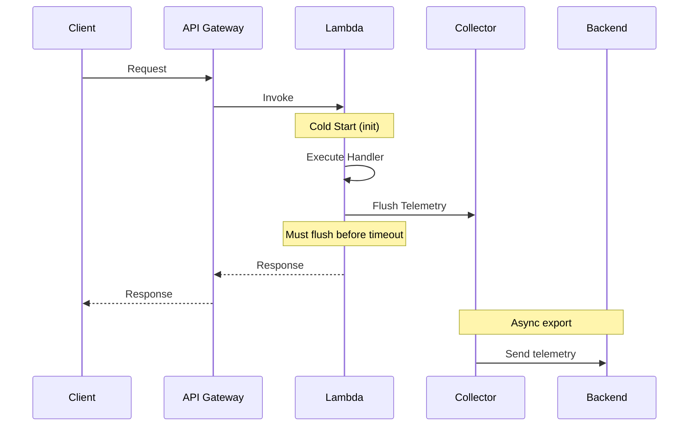
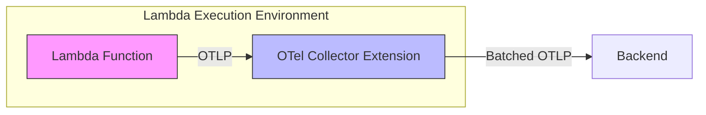
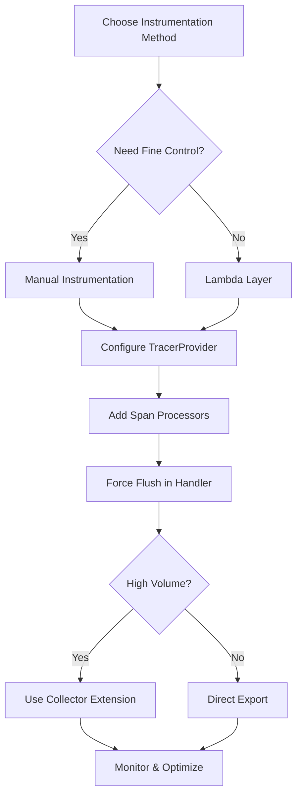

# How to Configure OpenTelemetry for AWS Lambda

Author: [nawazdhandala](https://www.github.com/nawazdhandala)

Tags: OpenTelemetry, AWS Lambda, Serverless, Observability, Tracing, Metrics

Description: A complete guide to instrumenting AWS Lambda functions with OpenTelemetry for traces, metrics, and logs using layers and manual configuration.

---

AWS Lambda's ephemeral nature makes observability challenging. Functions spin up and down rapidly, cold starts affect performance, and traditional APM tools often struggle with serverless architectures. OpenTelemetry provides a vendor-neutral way to instrument Lambda functions and gain deep visibility into your serverless applications.

## Understanding Lambda Instrumentation Challenges

Before diving into configuration, understand what makes Lambda different:



Key challenges:
- **Cold starts** - Initialization overhead matters
- **Short execution times** - Must flush telemetry quickly
- **Timeout constraints** - Functions may be killed before export completes
- **Cost sensitivity** - Extra processing time costs money

## Method 1: Using the AWS Lambda OpenTelemetry Layer

The easiest way to instrument Lambda is using AWS-provided or community layers.

### Step 1: Add the OpenTelemetry Layer

For Node.js Lambda functions:

```yaml
# serverless.yml (Serverless Framework)
service: my-otel-lambda

provider:
  name: aws
  runtime: nodejs18.x
  region: us-east-1
  # Environment variables for OpenTelemetry configuration
  environment:
    # Enable auto-instrumentation for AWS SDK and HTTP
    AWS_LAMBDA_EXEC_WRAPPER: /opt/otel-handler
    # Set the OTLP endpoint for your collector
    OTEL_EXPORTER_OTLP_ENDPOINT: https://your-collector:4318
    # Name your service for identification in traces
    OTEL_SERVICE_NAME: my-lambda-service
    # Set resource attributes for better organization
    OTEL_RESOURCE_ATTRIBUTES: deployment.environment=production

functions:
  hello:
    handler: handler.hello
    # Add the OpenTelemetry Lambda layer
    layers:
      # Use the appropriate ARN for your region
      # Check https://github.com/open-telemetry/opentelemetry-lambda for latest versions
      - arn:aws:lambda:us-east-1:901920570463:layer:aws-otel-nodejs-amd64-ver-1-18-1:1
```

For Python Lambda functions:

```yaml
# serverless.yml
service: my-python-lambda

provider:
  name: aws
  runtime: python3.11
  environment:
    AWS_LAMBDA_EXEC_WRAPPER: /opt/otel-instrument
    OTEL_EXPORTER_OTLP_ENDPOINT: https://your-collector:4318
    OTEL_SERVICE_NAME: my-python-service
    # Python-specific: set the traces exporter
    OTEL_TRACES_EXPORTER: otlp
    OTEL_METRICS_EXPORTER: otlp

functions:
  process:
    handler: handler.process
    layers:
      # Python OpenTelemetry layer
      - arn:aws:lambda:us-east-1:901920570463:layer:aws-otel-python-amd64-ver-1-21-0:1
```

### Step 2: Configure Your Handler

With the layer approach, your handler code requires minimal changes:

```javascript
// handler.js - Node.js example with layer auto-instrumentation
// The layer automatically instruments AWS SDK, HTTP, and other libraries

const { DynamoDBClient, GetItemCommand } = require('@aws-sdk/client-dynamodb');

// Create clients outside handler for connection reuse
const dynamodb = new DynamoDBClient({});

exports.hello = async (event, context) => {
    // All AWS SDK calls are automatically traced
    const result = await dynamodb.send(new GetItemCommand({
        TableName: 'my-table',
        Key: { id: { S: event.id } }
    }));

    return {
        statusCode: 200,
        body: JSON.stringify({ item: result.Item })
    };
};
```

## Method 2: Manual Instrumentation

For more control, configure OpenTelemetry manually in your Lambda function.

### Node.js Manual Setup

```javascript
// tracing.js - OpenTelemetry configuration for Lambda
const { NodeTracerProvider } = require('@opentelemetry/sdk-trace-node');
const { BatchSpanProcessor } = require('@opentelemetry/sdk-trace-base');
const { OTLPTraceExporter } = require('@opentelemetry/exporter-trace-otlp-http');
const { AWSXRayIdGenerator } = require('@opentelemetry/id-generator-aws-xray');
const { Resource } = require('@opentelemetry/resources');
const { SemanticResourceAttributes } = require('@opentelemetry/semantic-conventions');
const { AwsInstrumentation } = require('@opentelemetry/instrumentation-aws-sdk');
const { HttpInstrumentation } = require('@opentelemetry/instrumentation-http');
const { registerInstrumentations } = require('@opentelemetry/instrumentation');

// Initialize OpenTelemetry - call this BEFORE importing other modules
function initTracing() {
    // Create a resource that identifies this Lambda function
    const resource = new Resource({
        [SemanticResourceAttributes.SERVICE_NAME]: process.env.OTEL_SERVICE_NAME || 'lambda-function',
        [SemanticResourceAttributes.SERVICE_VERSION]: process.env.AWS_LAMBDA_FUNCTION_VERSION,
        [SemanticResourceAttributes.FAAS_NAME]: process.env.AWS_LAMBDA_FUNCTION_NAME,
        [SemanticResourceAttributes.FAAS_VERSION]: process.env.AWS_LAMBDA_FUNCTION_VERSION,
        [SemanticResourceAttributes.CLOUD_PROVIDER]: 'aws',
        [SemanticResourceAttributes.CLOUD_REGION]: process.env.AWS_REGION,
    });

    // Configure the OTLP exporter
    const exporter = new OTLPTraceExporter({
        url: process.env.OTEL_EXPORTER_OTLP_ENDPOINT + '/v1/traces',
        headers: {
            // Add authentication headers if required
            'Authorization': process.env.OTEL_EXPORTER_OTLP_HEADERS_AUTH
        }
    });

    // Create the tracer provider with AWS X-Ray compatible ID generation
    const provider = new NodeTracerProvider({
        resource: resource,
        // Use X-Ray ID generator for compatibility with AWS tracing
        idGenerator: new AWSXRayIdGenerator(),
    });

    // Use BatchSpanProcessor for efficient batching
    // Configure for Lambda's short execution times
    provider.addSpanProcessor(new BatchSpanProcessor(exporter, {
        maxQueueSize: 100,           // Smaller queue for Lambda
        maxExportBatchSize: 50,      // Smaller batches
        scheduledDelayMillis: 500,   // Flush more frequently
        exportTimeoutMillis: 5000,   // Shorter timeout
    }));

    // Register the provider globally
    provider.register();

    // Register auto-instrumentations
    registerInstrumentations({
        instrumentations: [
            new AwsInstrumentation({
                // Suppress internal AWS SDK spans for cleaner traces
                suppressInternalInstrumentation: true,
            }),
            new HttpInstrumentation({
                // Ignore health check endpoints
                ignoreIncomingPaths: ['/health', '/ready'],
            }),
        ],
    });

    return provider;
}

module.exports = { initTracing };
```

```javascript
// handler.js - Lambda handler with manual instrumentation
// IMPORTANT: Initialize tracing BEFORE other imports
const { initTracing } = require('./tracing');
const provider = initTracing();

const { trace, context, SpanStatusCode } = require('@opentelemetry/api');
const { DynamoDBClient, GetItemCommand } = require('@aws-sdk/client-dynamodb');

const tracer = trace.getTracer('lambda-handler');
const dynamodb = new DynamoDBClient({});

exports.handler = async (event, lambdaContext) => {
    // Create a root span for the Lambda invocation
    return tracer.startActiveSpan('lambda-handler', async (span) => {
        try {
            // Add Lambda context as span attributes
            span.setAttributes({
                'faas.execution': lambdaContext.awsRequestId,
                'faas.coldstart': !global.isWarm,
                'faas.trigger': detectTriggerType(event),
            });

            // Mark that we are warm for subsequent invocations
            global.isWarm = true;

            // Create child span for business logic
            const result = await tracer.startActiveSpan('process-request', async (childSpan) => {
                childSpan.setAttribute('request.id', event.id);

                // Your business logic here
                const data = await fetchData(event.id);

                childSpan.end();
                return data;
            });

            span.setStatus({ code: SpanStatusCode.OK });

            return {
                statusCode: 200,
                body: JSON.stringify(result)
            };
        } catch (error) {
            // Record the error in the span
            span.recordException(error);
            span.setStatus({
                code: SpanStatusCode.ERROR,
                message: error.message
            });

            return {
                statusCode: 500,
                body: JSON.stringify({ error: 'Internal server error' })
            };
        } finally {
            span.end();

            // CRITICAL: Force flush before Lambda freezes
            // This ensures all spans are exported
            await provider.forceFlush();
        }
    });
};

// Helper to detect the event source
function detectTriggerType(event) {
    if (event.requestContext?.apiId) return 'api-gateway';
    if (event.Records?.[0]?.eventSource === 'aws:sqs') return 'sqs';
    if (event.Records?.[0]?.eventSource === 'aws:sns') return 'sns';
    if (event.Records?.[0]?.eventSource === 'aws:s3') return 's3';
    if (event.Records?.[0]?.eventSource === 'aws:kinesis') return 'kinesis';
    return 'unknown';
}

async function fetchData(id) {
    const result = await dynamodb.send(new GetItemCommand({
        TableName: process.env.TABLE_NAME,
        Key: { id: { S: id } }
    }));
    return result.Item;
}
```

### Python Manual Setup

```python
# tracing.py - OpenTelemetry configuration for Python Lambda
import os
from opentelemetry import trace
from opentelemetry.sdk.trace import TracerProvider
from opentelemetry.sdk.trace.export import BatchSpanProcessor
from opentelemetry.exporter.otlp.proto.http.trace_exporter import OTLPSpanExporter
from opentelemetry.sdk.resources import Resource, SERVICE_NAME, SERVICE_VERSION
from opentelemetry.instrumentation.botocore import BotocoreInstrumentor
from opentelemetry.instrumentation.requests import RequestsInstrumentor

# Global variable to track initialization
_tracer_provider = None

def init_tracing():
    """Initialize OpenTelemetry tracing for Lambda."""
    global _tracer_provider

    # Only initialize once (handles Lambda container reuse)
    if _tracer_provider is not None:
        return _tracer_provider

    # Create resource with Lambda-specific attributes
    resource = Resource.create({
        SERVICE_NAME: os.environ.get('OTEL_SERVICE_NAME', 'lambda-function'),
        SERVICE_VERSION: os.environ.get('AWS_LAMBDA_FUNCTION_VERSION', 'unknown'),
        'faas.name': os.environ.get('AWS_LAMBDA_FUNCTION_NAME'),
        'cloud.provider': 'aws',
        'cloud.region': os.environ.get('AWS_REGION'),
    })

    # Create and configure the tracer provider
    _tracer_provider = TracerProvider(resource=resource)

    # Configure OTLP exporter
    otlp_exporter = OTLPSpanExporter(
        endpoint=os.environ.get('OTEL_EXPORTER_OTLP_ENDPOINT', 'http://localhost:4318') + '/v1/traces',
    )

    # Use BatchSpanProcessor with Lambda-optimized settings
    span_processor = BatchSpanProcessor(
        otlp_exporter,
        max_queue_size=100,          # Smaller queue for Lambda
        max_export_batch_size=50,    # Smaller batches
        schedule_delay_millis=500,   # More frequent flushes
        export_timeout_millis=5000,  # Shorter timeout
    )

    _tracer_provider.add_span_processor(span_processor)
    trace.set_tracer_provider(_tracer_provider)

    # Instrument AWS SDK (boto3/botocore)
    BotocoreInstrumentor().instrument()

    # Instrument HTTP requests library
    RequestsInstrumentor().instrument()

    return _tracer_provider
```

```python
# handler.py - Lambda handler with manual instrumentation
import json
import os
import boto3
from opentelemetry import trace
from opentelemetry.trace import SpanKind, Status, StatusCode

# Initialize tracing before other imports that might make network calls
from tracing import init_tracing
tracer_provider = init_tracing()

# Get a tracer instance
tracer = trace.get_tracer(__name__)

# Create DynamoDB client outside handler for reuse
dynamodb = boto3.resource('dynamodb')
table = dynamodb.Table(os.environ.get('TABLE_NAME', 'my-table'))

# Track cold starts
is_cold_start = True

def handler(event, context):
    """Lambda handler with OpenTelemetry instrumentation."""
    global is_cold_start

    # Start a span for the entire Lambda invocation
    with tracer.start_as_current_span(
        'lambda-handler',
        kind=SpanKind.SERVER,
    ) as span:
        try:
            # Add Lambda context attributes
            span.set_attributes({
                'faas.execution': context.aws_request_id,
                'faas.coldstart': is_cold_start,
                'faas.memory': context.memory_limit_in_mb,
                'faas.remaining_time_ms': context.get_remaining_time_in_millis(),
            })

            # Mark as warm for next invocation
            is_cold_start = False

            # Extract request data
            request_id = event.get('id', 'unknown')
            span.set_attribute('request.id', request_id)

            # Process the request with a child span
            with tracer.start_as_current_span('process-data') as process_span:
                result = process_request(request_id)
                process_span.set_attribute('result.count', len(result) if result else 0)

            span.set_status(Status(StatusCode.OK))

            return {
                'statusCode': 200,
                'body': json.dumps({'data': result})
            }

        except Exception as e:
            # Record exception details in the span
            span.record_exception(e)
            span.set_status(Status(StatusCode.ERROR, str(e)))

            return {
                'statusCode': 500,
                'body': json.dumps({'error': 'Internal server error'})
            }

        finally:
            # CRITICAL: Force flush telemetry before Lambda freezes
            # Without this, spans may be lost
            tracer_provider.force_flush(timeout_millis=5000)


def process_request(request_id):
    """Business logic with automatic boto3 instrumentation."""
    # DynamoDB calls are automatically traced by BotocoreInstrumentor
    response = table.get_item(Key={'id': request_id})
    return response.get('Item')
```

## Collector Sidecar Pattern for Lambda

For high-volume Lambda functions, run a collector as an extension:



### Configure Lambda Extension

```yaml
# template.yaml (AWS SAM)
AWSTemplateFormatVersion: '2010-09-09'
Transform: AWS::Serverless-2016-10-31

Globals:
  Function:
    Timeout: 30
    MemorySize: 512

Resources:
  MyFunction:
    Type: AWS::Serverless::Function
    Properties:
      Handler: handler.handler
      Runtime: python3.11
      Layers:
        # Add collector as Lambda extension layer
        - !Sub arn:aws:lambda:${AWS::Region}:901920570463:layer:aws-otel-collector-amd64-ver-0-88-0:1
      Environment:
        Variables:
          # Point to local collector extension
          OTEL_EXPORTER_OTLP_ENDPOINT: http://localhost:4317
          OTEL_SERVICE_NAME: my-function
          # Configure the collector via environment variable
          OPENTELEMETRY_COLLECTOR_CONFIG_FILE: /var/task/collector-config.yaml
```

```yaml
# collector-config.yaml - Collector configuration for Lambda extension
receivers:
  otlp:
    protocols:
      grpc:
        endpoint: localhost:4317
      http:
        endpoint: localhost:4318

processors:
  # Batch with Lambda-appropriate settings
  batch:
    timeout: 1s
    send_batch_size: 50
    send_batch_max_size: 100

  # Add Lambda-specific resource attributes
  resource:
    attributes:
      - key: cloud.provider
        value: aws
        action: upsert
      - key: faas.platform
        value: aws_lambda
        action: upsert

exporters:
  otlp:
    endpoint: https://your-backend:4317
    tls:
      insecure: false
    headers:
      Authorization: "Bearer ${OTEL_AUTH_TOKEN}"

  # Also send to CloudWatch for AWS-native visibility
  awsxray:
    region: ${AWS_REGION}

service:
  pipelines:
    traces:
      receivers: [otlp]
      processors: [resource, batch]
      exporters: [otlp, awsxray]
    metrics:
      receivers: [otlp]
      processors: [resource, batch]
      exporters: [otlp]
```

## Handling Cold Starts

Cold starts require special attention for observability:

```javascript
// cold-start-tracking.js
const { trace, metrics } = require('@opentelemetry/api');

const tracer = trace.getTracer('cold-start-tracker');
const meter = metrics.getMeter('cold-start-tracker');

// Create metrics for cold start monitoring
const coldStartCounter = meter.createCounter('lambda.cold_starts', {
    description: 'Number of cold starts',
});

const initDuration = meter.createHistogram('lambda.init_duration', {
    description: 'Cold start initialization duration in milliseconds',
    unit: 'ms',
});

// Track initialization time
const initStart = Date.now();
let isInitialized = false;

function recordColdStart(functionName) {
    if (!isInitialized) {
        const duration = Date.now() - initStart;

        // Record cold start metric
        coldStartCounter.add(1, {
            'faas.name': functionName,
        });

        // Record initialization duration
        initDuration.record(duration, {
            'faas.name': functionName,
        });

        isInitialized = true;
        return { isColdStart: true, initDuration: duration };
    }

    return { isColdStart: false, initDuration: 0 };
}

module.exports = { recordColdStart };
```

## Context Propagation Across Lambda Invocations

When Lambda functions call each other or downstream services, propagate context:

```javascript
// context-propagation.js
const { trace, context, propagation } = require('@opentelemetry/api');

// Inject trace context into outgoing requests
function injectContext(headers = {}) {
    // Inject W3C trace context headers
    propagation.inject(context.active(), headers);
    return headers;
}

// Extract trace context from incoming events
function extractContext(event) {
    // Handle API Gateway events
    if (event.headers) {
        return propagation.extract(context.active(), event.headers);
    }

    // Handle SQS events with trace context in message attributes
    if (event.Records?.[0]?.messageAttributes?.traceContext) {
        const traceHeaders = JSON.parse(
            event.Records[0].messageAttributes.traceContext.stringValue
        );
        return propagation.extract(context.active(), traceHeaders);
    }

    return context.active();
}

// Example: Lambda calling another Lambda
const { LambdaClient, InvokeCommand } = require('@aws-sdk/client-lambda');
const lambda = new LambdaClient({});

async function invokeDownstreamLambda(functionName, payload) {
    const tracer = trace.getTracer('lambda-invoker');

    return tracer.startActiveSpan('invoke-lambda', async (span) => {
        span.setAttribute('faas.invoked_name', functionName);

        // Create headers object with trace context
        const traceHeaders = injectContext();

        // Include trace context in the payload
        const enrichedPayload = {
            ...payload,
            _traceContext: traceHeaders,
        };

        const response = await lambda.send(new InvokeCommand({
            FunctionName: functionName,
            Payload: JSON.stringify(enrichedPayload),
        }));

        span.end();
        return JSON.parse(Buffer.from(response.Payload).toString());
    });
}
```

## Environment Variables Reference

Here is a complete reference for OpenTelemetry Lambda environment variables:

```yaml
# Complete environment variable configuration
Environment:
  Variables:
    # Core configuration
    OTEL_SERVICE_NAME: my-lambda-service
    OTEL_EXPORTER_OTLP_ENDPOINT: https://collector.example.com:4317
    OTEL_EXPORTER_OTLP_PROTOCOL: grpc  # or http/protobuf

    # Authentication
    OTEL_EXPORTER_OTLP_HEADERS: "Authorization=Bearer token123"

    # Resource attributes
    OTEL_RESOURCE_ATTRIBUTES: "deployment.environment=production,service.version=1.0.0"

    # Trace configuration
    OTEL_TRACES_EXPORTER: otlp
    OTEL_TRACES_SAMPLER: parentbased_traceidratio
    OTEL_TRACES_SAMPLER_ARG: "0.1"  # Sample 10% of traces

    # Metrics configuration
    OTEL_METRICS_EXPORTER: otlp

    # Logs configuration
    OTEL_LOGS_EXPORTER: otlp

    # Propagation
    OTEL_PROPAGATORS: tracecontext,baggage,xray

    # Lambda-specific
    AWS_LAMBDA_EXEC_WRAPPER: /opt/otel-handler  # For layer auto-instrumentation
    OPENTELEMETRY_COLLECTOR_CONFIG_FILE: /var/task/collector.yaml
```

## Monitoring Lambda Performance with Metrics

Create custom metrics to monitor Lambda-specific performance:

```python
# metrics.py - Lambda performance metrics
import os
from opentelemetry import metrics
from opentelemetry.sdk.metrics import MeterProvider
from opentelemetry.sdk.metrics.export import PeriodicExportingMetricReader
from opentelemetry.exporter.otlp.proto.http.metric_exporter import OTLPMetricExporter

def init_metrics():
    """Initialize metrics for Lambda monitoring."""
    exporter = OTLPMetricExporter(
        endpoint=os.environ.get('OTEL_EXPORTER_OTLP_ENDPOINT') + '/v1/metrics'
    )

    # Use shorter export interval for Lambda
    reader = PeriodicExportingMetricReader(
        exporter,
        export_interval_millis=5000,  # 5 seconds
    )

    provider = MeterProvider(metric_readers=[reader])
    metrics.set_meter_provider(provider)

    return provider

# Create Lambda-specific metrics
meter = metrics.get_meter('lambda-metrics')

# Invocation counter
invocation_counter = meter.create_counter(
    'lambda.invocations',
    description='Number of Lambda invocations',
    unit='1',
)

# Duration histogram
duration_histogram = meter.create_histogram(
    'lambda.duration',
    description='Lambda execution duration',
    unit='ms',
)

# Memory usage gauge
memory_gauge = meter.create_observable_gauge(
    'lambda.memory_used',
    callbacks=[lambda options: get_memory_usage()],
    description='Memory used by Lambda function',
    unit='MB',
)

def record_invocation(function_name, status, duration_ms):
    """Record Lambda invocation metrics."""
    attributes = {
        'faas.name': function_name,
        'faas.status': status,  # success, error, timeout
    }

    invocation_counter.add(1, attributes)
    duration_histogram.record(duration_ms, attributes)

def get_memory_usage():
    """Get current memory usage for gauge callback."""
    import resource
    usage = resource.getrusage(resource.RUSAGE_SELF)
    # Convert to MB
    return usage.ru_maxrss / 1024
```

## Summary

Instrumenting AWS Lambda with OpenTelemetry requires understanding the serverless execution model:



Key takeaways:

1. **Use Lambda layers** for simple auto-instrumentation
2. **Force flush** telemetry before Lambda freezes
3. **Track cold starts** as they affect user experience
4. **Propagate context** across service boundaries
5. **Use the collector extension** for high-volume functions
6. **Configure timeouts** appropriately for Lambda's execution model

With proper OpenTelemetry configuration, you will have full visibility into your serverless applications, enabling faster debugging and performance optimization.
