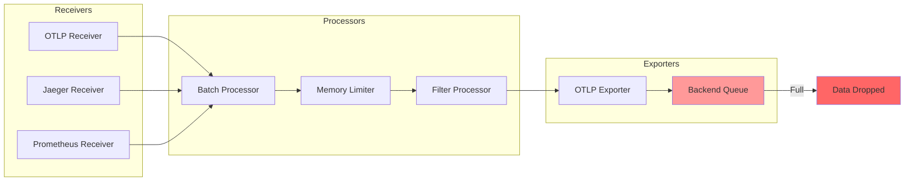
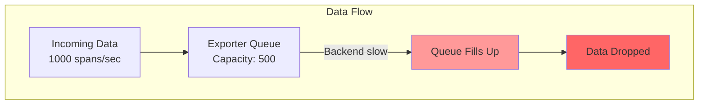
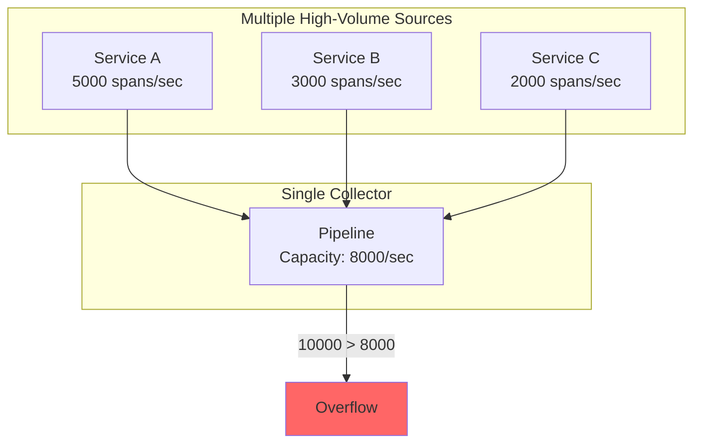
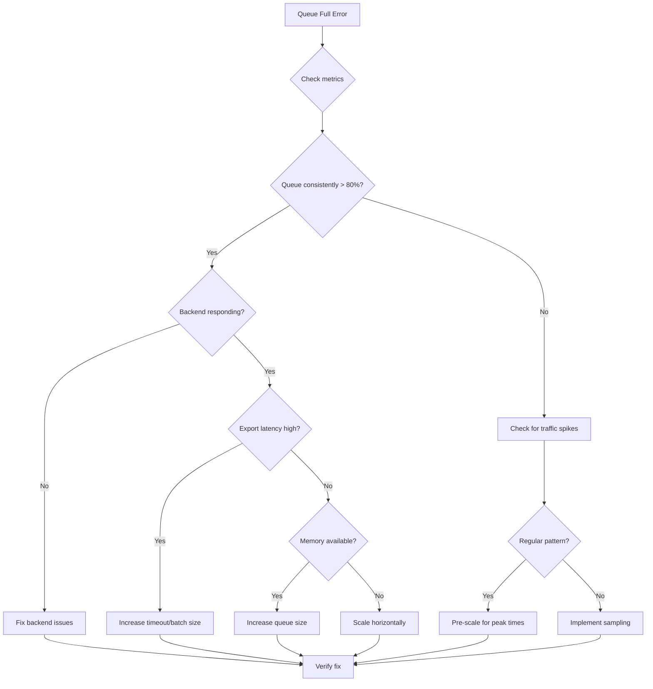

# How to Fix "Batch Queue Full" Collector Errors

Author: [nawazdhandala](https://www.github.com/nawazdhandala)

Tags: OpenTelemetry, Collector, Troubleshooting, Performance, Queue, Backpressure, Observability, Scaling

Description: A practical guide to diagnosing and fixing batch queue full errors in OpenTelemetry Collector, including configuration tuning, scaling strategies, and backpressure handling.

---

> The "batch queue full" error in OpenTelemetry Collector indicates that telemetry data is arriving faster than it can be processed and exported. This leads to data loss and gaps in your observability. This guide will help you diagnose the root cause and implement effective solutions.

Understanding how data flows through the collector pipeline is essential for properly tuning queue sizes and preventing data loss.

---

## Understanding the Collector Pipeline



### Queue Locations in the Pipeline

| Component | Queue Type | Purpose |
|-----------|-----------|---------|
| Receiver | Internal buffer | Accept incoming data |
| Batch Processor | Batching queue | Accumulate data for efficient processing |
| Exporter | Sending queue | Buffer data for backend delivery |
| Memory Limiter | Backpressure | Prevent OOM conditions |

---

## Identifying the Problem

### Common Error Messages

```
2024-01-15T10:30:45.123Z    warn    exporterhelper/queued_retry.go:123
    Dropping data because sending_queue is full.
    {"kind": "exporter", "data_type": "traces", "name": "otlp", "dropped_items": 1024}

2024-01-15T10:30:45.456Z    warn    batchprocessor/batch_processor.go:89
    Batch queue is full. Dropping data.
    {"kind": "processor", "name": "batch", "dropped_items": 512}
```

### Step 1: Check Collector Metrics

The collector exposes metrics that help diagnose queue issues.

```bash
# Query collector metrics endpoint
curl http://localhost:8888/metrics | grep -E "(queue|dropped|refused)"

# Key metrics to look for:
# otelcol_exporter_queue_size - Current queue size
# otelcol_exporter_queue_capacity - Maximum queue capacity
# otelcol_exporter_send_failed_spans - Failed export attempts
# otelcol_processor_dropped_spans - Spans dropped by processors
```

### Step 2: Enable Debug Logging

```yaml
# otel-collector-config.yaml
service:
  telemetry:
    logs:
      level: debug
    metrics:
      level: detailed
      address: 0.0.0.0:8888
```

### Step 3: Monitor Resource Usage

```bash
# Check collector resource usage
docker stats otel-collector

# Or for Kubernetes
kubectl top pod -l app=otel-collector

# Watch for CPU and memory spikes during high load
```

---

## Common Causes and Solutions

### Cause 1: Exporter Queue Too Small



**Solution: Increase Exporter Queue Size**

```yaml
# otel-collector-config.yaml
exporters:
  otlp:
    endpoint: backend:4317
    tls:
      insecure: true
    # Configure the sending queue
    sending_queue:
      enabled: true
      # Increase queue size based on your throughput
      # Default is 1000, increase for high-volume scenarios
      queue_size: 10000
      # Number of consumers sending data in parallel
      num_consumers: 20
    # Configure retry behavior
    retry_on_failure:
      enabled: true
      initial_interval: 5s
      max_interval: 30s
      max_elapsed_time: 300s
```

### Cause 2: Backend Too Slow

**Solution: Add Batch Processor and Optimize Export**

```yaml
# otel-collector-config.yaml
processors:
  # Batch data for more efficient export
  batch:
    # Maximum time to wait before sending a batch
    timeout: 10s
    # Maximum number of spans in a batch
    send_batch_size: 10000
    # Absolute maximum batch size (hard limit)
    send_batch_max_size: 15000

exporters:
  otlp:
    endpoint: backend:4317
    tls:
      insecure: true
    # Increase timeout for slow backends
    timeout: 60s
    # Use compression to reduce network transfer time
    compression: gzip
    sending_queue:
      enabled: true
      queue_size: 10000
      num_consumers: 20

service:
  pipelines:
    traces:
      receivers: [otlp]
      processors: [batch]
      exporters: [otlp]
```

### Cause 3: Memory Constraints

**Solution: Configure Memory Limiter**

```yaml
# otel-collector-config.yaml
processors:
  # Memory limiter prevents OOM by applying backpressure
  memory_limiter:
    # Check memory usage at this interval
    check_interval: 1s
    # Hard limit - refuse data when reached
    limit_mib: 1500
    # Soft limit - start applying backpressure
    spike_limit_mib: 500
    # Percentage-based limits (alternative to MiB)
    # limit_percentage: 80
    # spike_limit_percentage: 25

  batch:
    timeout: 10s
    send_batch_size: 5000

service:
  pipelines:
    traces:
      receivers: [otlp]
      # Memory limiter should be first processor
      processors: [memory_limiter, batch]
      exporters: [otlp]
```

### Cause 4: Too Many Receivers Overwhelming Pipeline



**Solution: Scale Collectors Horizontally**

```yaml
# Kubernetes deployment for scaled collectors
apiVersion: apps/v1
kind: Deployment
metadata:
  name: otel-collector
spec:
  replicas: 3  # Scale based on load
  selector:
    matchLabels:
      app: otel-collector
  template:
    metadata:
      labels:
        app: otel-collector
    spec:
      containers:
      - name: collector
        image: otel/opentelemetry-collector-contrib:latest
        resources:
          requests:
            memory: "1Gi"
            cpu: "500m"
          limits:
            memory: "2Gi"
            cpu: "1000m"
        ports:
        - containerPort: 4317
          name: otlp-grpc
        - containerPort: 4318
          name: otlp-http
---
# Load balancer service
apiVersion: v1
kind: Service
metadata:
  name: otel-collector
spec:
  type: LoadBalancer
  selector:
    app: otel-collector
  ports:
  - name: otlp-grpc
    port: 4317
    targetPort: 4317
  - name: otlp-http
    port: 4318
    targetPort: 4318
```

### Cause 5: Inefficient Pipeline Configuration

**Solution: Optimize Pipeline with Filtering and Sampling**

```yaml
# otel-collector-config.yaml
processors:
  # Filter out unnecessary data
  filter:
    spans:
      exclude:
        match_type: regexp
        span_names:
          # Exclude health checks and other noisy spans
          - "health.*"
          - "metrics.*"
          - "readiness.*"
          - "liveness.*"
        attributes:
          # Exclude specific services or endpoints
          - key: http.route
            value: "/health"
          - key: http.route
            value: "/metrics"

  # Probabilistic sampling for high-volume traces
  probabilistic_sampler:
    # Sample 10% of traces
    sampling_percentage: 10

  # Tail-based sampling (keep errors and slow requests)
  tail_sampling:
    decision_wait: 10s
    num_traces: 100000
    expected_new_traces_per_sec: 1000
    policies:
      # Always keep error traces
      - name: error-policy
        type: status_code
        status_code: {status_codes: [ERROR]}
      # Always keep slow traces
      - name: latency-policy
        type: latency
        latency: {threshold_ms: 5000}
      # Sample the rest
      - name: probabilistic-policy
        type: probabilistic
        probabilistic: {sampling_percentage: 10}

  batch:
    timeout: 10s
    send_batch_size: 5000

service:
  pipelines:
    traces:
      receivers: [otlp]
      processors: [filter, tail_sampling, batch]
      exporters: [otlp]
```

---

## Advanced Queue Configuration

### Per-Exporter Queue Settings

```yaml
# otel-collector-config.yaml
exporters:
  # Primary backend with large queue
  otlp/primary:
    endpoint: primary-backend:4317
    tls:
      insecure: true
    sending_queue:
      enabled: true
      queue_size: 20000
      num_consumers: 30
    retry_on_failure:
      enabled: true
      initial_interval: 5s
      max_interval: 60s
      max_elapsed_time: 600s

  # Secondary backend (backup) with smaller queue
  otlp/backup:
    endpoint: backup-backend:4317
    tls:
      insecure: true
    sending_queue:
      enabled: true
      queue_size: 5000
      num_consumers: 10
    retry_on_failure:
      enabled: true
      initial_interval: 10s
      max_interval: 120s
      max_elapsed_time: 300s

service:
  pipelines:
    traces:
      receivers: [otlp]
      processors: [batch]
      # Fan-out to multiple backends
      exporters: [otlp/primary, otlp/backup]
```

### Persistent Queue for Durability

```yaml
# otel-collector-config.yaml
exporters:
  otlp:
    endpoint: backend:4317
    tls:
      insecure: true
    sending_queue:
      enabled: true
      # Use persistent storage for the queue
      # Data survives collector restarts
      storage: file_storage
      queue_size: 50000
      num_consumers: 20

extensions:
  file_storage:
    directory: /var/lib/otel-collector/queue
    # Maximum storage size
    timeout: 10s
    compaction:
      # Compact storage files periodically
      on_start: true
      on_rebound: true
      directory: /var/lib/otel-collector/queue/compaction

service:
  extensions: [file_storage]
  pipelines:
    traces:
      receivers: [otlp]
      processors: [batch]
      exporters: [otlp]
```

---

## Implementing Backpressure

### Client-Side Backpressure Handling

```python
from opentelemetry import trace
from opentelemetry.sdk.trace import TracerProvider
from opentelemetry.sdk.trace.export import BatchSpanProcessor
from opentelemetry.exporter.otlp.proto.grpc.trace_exporter import OTLPSpanExporter
import logging

logger = logging.getLogger(__name__)

class BackpressureAwareProcessor(BatchSpanProcessor):
    """Custom processor that handles backpressure gracefully."""

    def __init__(self, exporter, **kwargs):
        super().__init__(exporter, **kwargs)
        self.dropped_count = 0
        self.total_count = 0

    def on_end(self, span):
        self.total_count += 1

        # Check if queue is nearly full
        if self._queue_size() > self._max_queue_size * 0.9:
            logger.warning(
                f"Queue nearly full ({self._queue_size()}/{self._max_queue_size}). "
                f"Consider reducing telemetry volume."
            )

            # Optional: Apply local sampling when under pressure
            if self.total_count % 10 != 0:  # Keep 10% when under pressure
                self.dropped_count += 1
                return

        super().on_end(span)

    def _queue_size(self):
        # Access internal queue size (implementation detail)
        return len(self.queue) if hasattr(self, 'queue') else 0

    def _max_queue_size(self):
        return self.max_queue_size

# Usage
exporter = OTLPSpanExporter(endpoint="http://collector:4317", insecure=True)

processor = BackpressureAwareProcessor(
    exporter,
    max_queue_size=4096,
    schedule_delay_millis=5000,
    max_export_batch_size=512,
)

provider = TracerProvider()
provider.add_span_processor(processor)
trace.set_tracer_provider(provider)
```

### Collector-Side Backpressure

```yaml
# otel-collector-config.yaml
receivers:
  otlp:
    protocols:
      grpc:
        endpoint: 0.0.0.0:4317
        # Limit concurrent connections
        max_concurrent_streams: 100
        # Read buffer size
        read_buffer_size: 512KB
      http:
        endpoint: 0.0.0.0:4318

processors:
  memory_limiter:
    check_interval: 1s
    limit_mib: 1500
    spike_limit_mib: 500
    # Garbage collection settings
    ballast_size_mib: 200

extensions:
  # Health check extension for load balancer
  health_check:
    endpoint: 0.0.0.0:13133
    path: /health
    # Report unhealthy when memory is under pressure
    # This signals load balancer to reduce traffic
    check_collector_pipeline:
      enabled: true
      interval: 5s
      exporter_failure_threshold: 5

service:
  extensions: [health_check]
  pipelines:
    traces:
      receivers: [otlp]
      processors: [memory_limiter, batch]
      exporters: [otlp]
```

---

## Monitoring and Alerting

### Collector Metrics Dashboard

```yaml
# Prometheus alerting rules for collector health
groups:
  - name: otel-collector-alerts
    rules:
      # Alert when queue is filling up
      - alert: CollectorQueueFillingUp
        expr: |
          otelcol_exporter_queue_size / otelcol_exporter_queue_capacity > 0.8
        for: 5m
        labels:
          severity: warning
        annotations:
          summary: "Collector exporter queue is filling up"
          description: "Queue is at {{ $value | humanizePercentage }} capacity"

      # Alert when data is being dropped
      - alert: CollectorDroppingData
        expr: |
          rate(otelcol_processor_dropped_spans_total[5m]) > 0
        for: 1m
        labels:
          severity: critical
        annotations:
          summary: "Collector is dropping telemetry data"
          description: "Dropping {{ $value }} spans per second"

      # Alert when export is failing
      - alert: CollectorExportFailing
        expr: |
          rate(otelcol_exporter_send_failed_spans_total[5m]) > 0
        for: 5m
        labels:
          severity: warning
        annotations:
          summary: "Collector export is failing"
          description: "Failed to export {{ $value }} spans per second"

      # Alert on memory pressure
      - alert: CollectorMemoryPressure
        expr: |
          otelcol_process_memory_rss / 1024 / 1024 > 1500
        for: 5m
        labels:
          severity: warning
        annotations:
          summary: "Collector memory usage is high"
          description: "Memory usage is {{ $value }}MB"
```

### Custom Metrics Exporter for Queue Monitoring

```go
package main

import (
    "context"
    "time"

    "go.opentelemetry.io/otel/metric"
)

type QueueMonitor struct {
    queueSize     metric.Int64ObservableGauge
    queueCapacity metric.Int64ObservableGauge
    droppedItems  metric.Int64Counter
}

func NewQueueMonitor(meter metric.Meter) (*QueueMonitor, error) {
    queueSize, err := meter.Int64ObservableGauge(
        "collector.queue.size",
        metric.WithDescription("Current number of items in the queue"),
    )
    if err != nil {
        return nil, err
    }

    queueCapacity, err := meter.Int64ObservableGauge(
        "collector.queue.capacity",
        metric.WithDescription("Maximum queue capacity"),
    )
    if err != nil {
        return nil, err
    }

    droppedItems, err := meter.Int64Counter(
        "collector.queue.dropped_items",
        metric.WithDescription("Number of items dropped due to full queue"),
    )
    if err != nil {
        return nil, err
    }

    return &QueueMonitor{
        queueSize:     queueSize,
        queueCapacity: queueCapacity,
        droppedItems:  droppedItems,
    }, nil
}
```

---

## Scaling Strategy Flowchart



---

## Production Configuration Example

```yaml
# otel-collector-config.yaml - Production-ready configuration
receivers:
  otlp:
    protocols:
      grpc:
        endpoint: 0.0.0.0:4317
        max_recv_msg_size_mib: 16
      http:
        endpoint: 0.0.0.0:4318

processors:
  # First: Memory limiter for safety
  memory_limiter:
    check_interval: 1s
    limit_mib: 1800
    spike_limit_mib: 400

  # Second: Filter unnecessary data
  filter:
    spans:
      exclude:
        match_type: regexp
        span_names:
          - "health.*"

  # Third: Sample high-volume data
  probabilistic_sampler:
    sampling_percentage: 50

  # Fourth: Batch for efficiency
  batch:
    timeout: 10s
    send_batch_size: 8000
    send_batch_max_size: 10000

exporters:
  otlp:
    endpoint: backend:4317
    tls:
      insecure: true
    timeout: 60s
    compression: gzip
    sending_queue:
      enabled: true
      queue_size: 20000
      num_consumers: 25
    retry_on_failure:
      enabled: true
      initial_interval: 5s
      max_interval: 60s
      max_elapsed_time: 600s

extensions:
  health_check:
    endpoint: 0.0.0.0:13133
  pprof:
    endpoint: 0.0.0.0:1777

service:
  extensions: [health_check, pprof]
  telemetry:
    logs:
      level: info
    metrics:
      level: detailed
      address: 0.0.0.0:8888
  pipelines:
    traces:
      receivers: [otlp]
      processors: [memory_limiter, filter, probabilistic_sampler, batch]
      exporters: [otlp]
```

---

## Best Practices Summary

1. **Monitor queue metrics proactively** - Set up alerts before queues fill up
2. **Use memory limiter** - Always include memory_limiter as the first processor
3. **Size queues appropriately** - Start with 2-3x your expected throughput
4. **Enable persistent queues** - For critical data that must not be lost
5. **Implement sampling** - Reduce volume at the source when necessary
6. **Scale horizontally** - Add more collectors rather than oversizing single instances
7. **Filter at the edge** - Remove unnecessary data as early as possible
8. **Test under load** - Verify your configuration handles peak traffic

---

## Conclusion

The "batch queue full" error indicates that your telemetry pipeline is overwhelmed. The solution depends on the root cause: slow backends, insufficient queue size, memory constraints, or simply too much data. By properly configuring queue sizes, implementing backpressure handling, and scaling horizontally when needed, you can build a reliable observability pipeline that handles production traffic without data loss.

The key is to monitor your collector metrics proactively and tune your configuration based on actual traffic patterns rather than waiting for errors to occur.

---

*Need comprehensive monitoring for your OpenTelemetry collectors? [OneUptime](https://oneuptime.com) provides real-time visibility into collector health, queue metrics, and automated alerting for data pipeline issues.*

**Related Reading:**
- [How to Fix "Timeout" Errors in OpenTelemetry Export](https://oneuptime.com/blog)
- [Scaling OpenTelemetry Collectors for High Volume](https://oneuptime.com/blog)
- [OpenTelemetry Collector Best Practices](https://oneuptime.com/blog)
