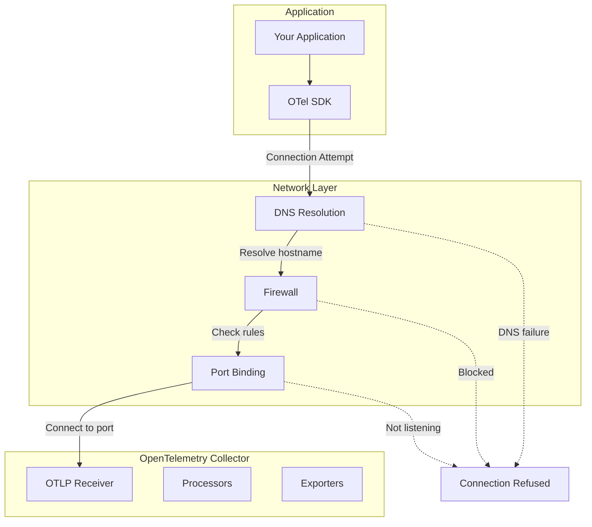
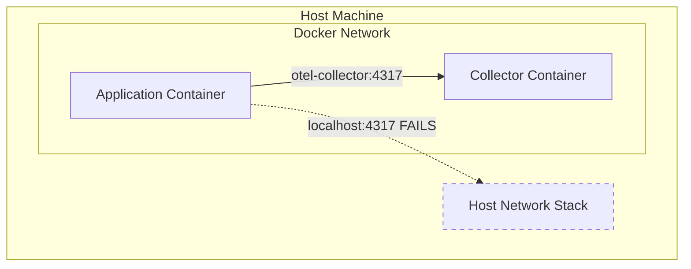
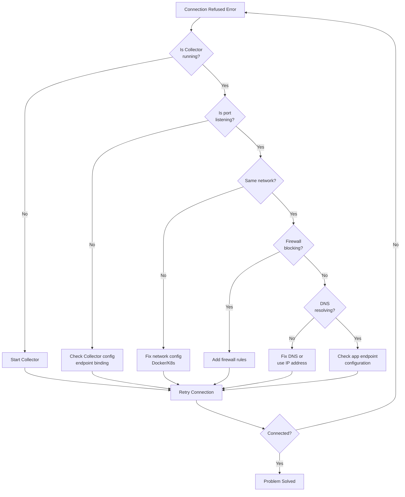

# How to Fix 'Collector Connection Refused' Errors

Author: [nawazdhandala](https://www.github.com/nawazdhandala)

Tags: OpenTelemetry, Collector, Troubleshooting, Networking, Docker, Kubernetes

Description: Learn how to diagnose and fix 'connection refused' errors when connecting applications to the OpenTelemetry Collector.

---

The "connection refused" error is one of the most common issues when setting up OpenTelemetry. It occurs when your application cannot establish a connection to the OpenTelemetry Collector. In this guide, we will explore the various causes of this error and provide step-by-step solutions for different deployment scenarios.

## Understanding the Error

When you see a "connection refused" error, it typically looks like one of these:

```
Error: failed to export traces: connection refused
Error: dial tcp 127.0.0.1:4317: connect: connection refused
Error: UNAVAILABLE: Connection refused
Error: connect ECONNREFUSED 127.0.0.1:4317
```

This error means that the TCP connection attempt to the Collector's endpoint was rejected. The server is either not running, not listening on the expected port, or network configuration is preventing the connection.



## Quick Diagnostic Checklist

Before diving into specific solutions, run through this quick checklist:

```bash
# 1. Is the Collector running?
docker ps | grep otel
# or
systemctl status otel-collector
# or
ps aux | grep otelcol

# 2. Is the port open and listening?
netstat -tlnp | grep 4317
# or
lsof -i :4317
# or
ss -tlnp | grep 4317

# 3. Can you reach the port?
nc -zv localhost 4317
# or
telnet localhost 4317

# 4. Is there a firewall blocking?
sudo iptables -L -n | grep 4317
# or on macOS
sudo pfctl -sr 2>/dev/null

# 5. Check Collector logs for errors
docker logs otel-collector 2>&1 | tail -50
# or
journalctl -u otel-collector -n 50
```

## Common Causes and Solutions

### Cause 1: Collector Not Running

The most basic cause is that the Collector service is not running.

**Diagnosis:**

```bash
# Check if Collector container is running
docker ps -a | grep otel

# Check if Collector process is running
pgrep -f otelcol
```

**Solution:**

```bash
# Start Docker container
docker start otel-collector

# Or start the service
sudo systemctl start otel-collector

# Or run the Collector directly
./otelcol --config=config.yaml
```

### Cause 2: Wrong Endpoint Configuration

Your application might be configured to connect to the wrong endpoint.

**Diagnosis:**

```javascript
// Check your application configuration
console.log('OTEL Endpoint:', process.env.OTEL_EXPORTER_OTLP_ENDPOINT);
```

**Solution for Node.js:**

```javascript
// Ensure correct endpoint configuration
const { OTLPTraceExporter } = require('@opentelemetry/exporter-trace-otlp-grpc');

// For local Collector
const exporter = new OTLPTraceExporter({
  url: 'http://localhost:4317',  // gRPC endpoint
});

// For Docker Compose networking
const exporter = new OTLPTraceExporter({
  url: 'http://otel-collector:4317',  // Use service name
});

// For Kubernetes
const exporter = new OTLPTraceExporter({
  url: 'http://otel-collector.observability.svc.cluster.local:4317',
});
```

**Solution for Python:**

```python
import os
from opentelemetry.exporter.otlp.proto.grpc.trace_exporter import OTLPSpanExporter

# Use environment variable with fallback
endpoint = os.getenv('OTEL_EXPORTER_OTLP_ENDPOINT', 'http://localhost:4317')

exporter = OTLPSpanExporter(
    endpoint=endpoint,
    insecure=True,  # Set to False for production with TLS
)
```

### Cause 3: Collector Listening on Wrong Interface

The Collector might be listening on localhost only, but your application is trying to connect from a different host or container.

**Diagnosis:**

```bash
# Check what interface the Collector is listening on
netstat -tlnp | grep 4317

# Output showing localhost only (problematic for Docker):
# tcp  0  0  127.0.0.1:4317  0.0.0.0:*  LISTEN

# Output showing all interfaces (correct):
# tcp  0  0  0.0.0.0:4317    0.0.0.0:*  LISTEN
```

**Solution:**

```yaml
# otel-collector-config.yaml
# Configure receiver to listen on all interfaces
receivers:
  otlp:
    protocols:
      grpc:
        # Listen on all interfaces (0.0.0.0), not just localhost
        endpoint: 0.0.0.0:4317
      http:
        endpoint: 0.0.0.0:4318
```

### Cause 4: Docker Networking Issues

When running in Docker, network configuration is a common source of connection problems.



**Problem: Using localhost from a container**

```yaml
# WRONG: This will try to connect to the container's own localhost
environment:
  - OTEL_EXPORTER_OTLP_ENDPOINT=http://localhost:4317
```

**Solution: Use Docker service name or network alias**

```yaml
# docker-compose.yaml
version: '3.8'

services:
  # Your application
  my-app:
    image: my-app:latest
    environment:
      # Use the Collector's service name
      - OTEL_EXPORTER_OTLP_ENDPOINT=http://otel-collector:4317
    depends_on:
      - otel-collector
    networks:
      - app-network

  # OpenTelemetry Collector
  otel-collector:
    image: otel/opentelemetry-collector:latest
    volumes:
      - ./otel-collector-config.yaml:/etc/otelcol/config.yaml
    command: ["--config=/etc/otelcol/config.yaml"]
    ports:
      - "4317:4317"  # gRPC
      - "4318:4318"  # HTTP
    networks:
      - app-network

networks:
  app-network:
    driver: bridge
```

**Solution: Use host.docker.internal (for host Collector)**

```yaml
# If Collector runs on host, not in Docker
environment:
  # macOS and Windows
  - OTEL_EXPORTER_OTLP_ENDPOINT=http://host.docker.internal:4317

  # Linux (add to docker run)
  # docker run --add-host=host.docker.internal:host-gateway ...
```

### Cause 5: Kubernetes Networking Issues

In Kubernetes, connection issues often stem from service discovery or network policies.

**Diagnosis:**

```bash
# Check if the Collector service exists
kubectl get svc -n observability | grep otel

# Check if the Collector pods are running
kubectl get pods -n observability | grep otel

# Check service endpoints
kubectl describe svc otel-collector -n observability

# Test connectivity from your pod
kubectl exec -it my-app-pod -- nc -zv otel-collector.observability 4317
```

**Solution: Correct Kubernetes Configuration**

```yaml
# collector-service.yaml
apiVersion: v1
kind: Service
metadata:
  name: otel-collector
  namespace: observability
spec:
  selector:
    app: otel-collector
  ports:
    - name: otlp-grpc
      port: 4317
      targetPort: 4317
    - name: otlp-http
      port: 4318
      targetPort: 4318
---
# collector-deployment.yaml
apiVersion: apps/v1
kind: Deployment
metadata:
  name: otel-collector
  namespace: observability
spec:
  replicas: 1
  selector:
    matchLabels:
      app: otel-collector
  template:
    metadata:
      labels:
        app: otel-collector
    spec:
      containers:
        - name: otel-collector
          image: otel/opentelemetry-collector:latest
          ports:
            - containerPort: 4317
              name: otlp-grpc
            - containerPort: 4318
              name: otlp-http
          volumeMounts:
            - name: config
              mountPath: /etc/otelcol/config.yaml
              subPath: config.yaml
      volumes:
        - name: config
          configMap:
            name: otel-collector-config
```

**Application Configuration:**

```yaml
# application-deployment.yaml
apiVersion: apps/v1
kind: Deployment
metadata:
  name: my-app
spec:
  template:
    spec:
      containers:
        - name: my-app
          env:
            # Use fully qualified service name
            - name: OTEL_EXPORTER_OTLP_ENDPOINT
              value: "http://otel-collector.observability.svc.cluster.local:4317"
            # Or use short name if in same namespace
            # value: "http://otel-collector:4317"
```

### Cause 6: Firewall or Security Groups Blocking Traffic

Network firewalls or cloud security groups might be blocking the connection.

**Diagnosis:**

```bash
# Check local firewall (Linux)
sudo iptables -L -n

# Check if connection is being blocked
sudo tcpdump -i any port 4317

# AWS Security Group (using AWS CLI)
aws ec2 describe-security-groups --group-ids sg-xxxxx
```

**Solution:**

```bash
# Allow port on Linux firewall
sudo iptables -A INPUT -p tcp --dport 4317 -j ACCEPT
sudo iptables -A INPUT -p tcp --dport 4318 -j ACCEPT

# Or using firewalld
sudo firewall-cmd --permanent --add-port=4317/tcp
sudo firewall-cmd --permanent --add-port=4318/tcp
sudo firewall-cmd --reload

# Or using ufw
sudo ufw allow 4317/tcp
sudo ufw allow 4318/tcp
```

```yaml
# Kubernetes NetworkPolicy to allow traffic
apiVersion: networking.k8s.io/v1
kind: NetworkPolicy
metadata:
  name: allow-otel-collector
  namespace: observability
spec:
  podSelector:
    matchLabels:
      app: otel-collector
  policyTypes:
    - Ingress
  ingress:
    - from:
        # Allow from all namespaces
        - namespaceSelector: {}
      ports:
        - protocol: TCP
          port: 4317
        - protocol: TCP
          port: 4318
```

### Cause 7: Port Already in Use

Another process might be using the same port as the Collector.

**Diagnosis:**

```bash
# Find what's using the port
lsof -i :4317
# or
netstat -tlnp | grep 4317
# or
ss -tlnp | grep 4317
```

**Solution:**

```bash
# Option 1: Stop the conflicting process
sudo kill -9 <PID>

# Option 2: Configure Collector to use a different port
```

```yaml
# otel-collector-config.yaml
receivers:
  otlp:
    protocols:
      grpc:
        # Use alternative port
        endpoint: 0.0.0.0:4320
      http:
        endpoint: 0.0.0.0:4321
```

### Cause 8: DNS Resolution Failure

The hostname might not be resolving correctly.

**Diagnosis:**

```bash
# Test DNS resolution
nslookup otel-collector
# or
dig otel-collector
# or
getent hosts otel-collector
```

**Solution:**

```bash
# Add to /etc/hosts if DNS is not available
echo "192.168.1.100 otel-collector" | sudo tee -a /etc/hosts

# Or use IP address directly in configuration
export OTEL_EXPORTER_OTLP_ENDPOINT=http://192.168.1.100:4317
```

## Comprehensive Troubleshooting Script

```bash
#!/bin/bash
# otel-connectivity-check.sh
# Comprehensive script to diagnose Collector connectivity issues

COLLECTOR_HOST="${1:-localhost}"
COLLECTOR_PORT="${2:-4317}"

echo "=========================================="
echo "OpenTelemetry Collector Connectivity Check"
echo "=========================================="
echo "Target: $COLLECTOR_HOST:$COLLECTOR_PORT"
echo ""

# Check 1: DNS Resolution
echo "[1/6] Checking DNS resolution..."
if host "$COLLECTOR_HOST" > /dev/null 2>&1; then
    echo "    OK: Hostname resolves"
    host "$COLLECTOR_HOST"
else
    echo "    WARN: DNS resolution may have issues (could be IP address)"
fi
echo ""

# Check 2: Port connectivity
echo "[2/6] Checking port connectivity..."
if nc -zv "$COLLECTOR_HOST" "$COLLECTOR_PORT" 2>&1 | grep -q "succeeded"; then
    echo "    OK: Port $COLLECTOR_PORT is reachable"
else
    echo "    FAIL: Cannot connect to $COLLECTOR_HOST:$COLLECTOR_PORT"
fi
echo ""

# Check 3: Local port binding
echo "[3/6] Checking local port binding..."
if netstat -tlnp 2>/dev/null | grep -q ":$COLLECTOR_PORT"; then
    echo "    OK: Port $COLLECTOR_PORT is bound locally"
    netstat -tlnp 2>/dev/null | grep ":$COLLECTOR_PORT"
elif ss -tlnp 2>/dev/null | grep -q ":$COLLECTOR_PORT"; then
    echo "    OK: Port $COLLECTOR_PORT is bound locally"
    ss -tlnp 2>/dev/null | grep ":$COLLECTOR_PORT"
else
    echo "    WARN: Port $COLLECTOR_PORT not bound locally (may be on remote host)"
fi
echo ""

# Check 4: Docker containers
echo "[4/6] Checking Docker containers..."
if command -v docker &> /dev/null; then
    if docker ps | grep -q otel; then
        echo "    OK: OpenTelemetry container is running"
        docker ps | grep otel
    else
        echo "    WARN: No running otel container found"
    fi
else
    echo "    SKIP: Docker not installed"
fi
echo ""

# Check 5: gRPC health check
echo "[5/6] Checking gRPC health..."
if command -v grpcurl &> /dev/null; then
    if grpcurl -plaintext "$COLLECTOR_HOST:$COLLECTOR_PORT" list 2>/dev/null; then
        echo "    OK: gRPC endpoint is responding"
    else
        echo "    FAIL: gRPC endpoint not responding"
    fi
else
    echo "    SKIP: grpcurl not installed"
fi
echo ""

# Check 6: HTTP endpoint (if applicable)
HTTP_PORT=$((COLLECTOR_PORT + 1))
echo "[6/6] Checking HTTP endpoint on port $HTTP_PORT..."
if curl -s -o /dev/null -w "%{http_code}" "http://$COLLECTOR_HOST:$HTTP_PORT" | grep -qE "2[0-9]{2}|4[0-9]{2}"; then
    echo "    OK: HTTP endpoint is responding"
else
    echo "    WARN: HTTP endpoint not responding (may not be configured)"
fi
echo ""

echo "=========================================="
echo "Diagnosis complete"
echo "=========================================="
```

## Error Recovery Flow



## Prevention Best Practices

1. **Use health checks** to verify Collector availability before starting applications
2. **Implement retry logic** in your exporters for transient failures
3. **Use service mesh** (like Istio) for automatic service discovery
4. **Monitor Collector metrics** to detect issues early
5. **Document network architecture** including ports and protocols
6. **Test connectivity** in staging before production deployments

## Summary

"Connection refused" errors in OpenTelemetry typically stem from one of several common causes: the Collector not running, wrong endpoint configuration, network isolation issues, or firewall rules. By systematically checking each potential cause using the diagnostic steps in this guide, you can quickly identify and resolve the issue.

Key points to remember:
- Always verify the Collector is running and healthy
- Ensure endpoint configuration matches across application and Collector
- In Docker/Kubernetes, use service names instead of localhost
- Check firewall rules and network policies
- Use diagnostic tools like netcat, grpcurl, and tcpdump

**Related Reading:**

- [How to Set Up OpenTelemetry Collector for Traces](https://oneuptime.com/blog/post/2026-01-24-opentelemetry-collector-traces-setup/view)
- [How to Fix "Exporter Failed" Errors in OpenTelemetry](https://oneuptime.com/blog/post/2026-01-24-opentelemetry-exporter-failed-errors/view)
- [How to Configure OpenTelemetry Auto-Instrumentation](https://oneuptime.com/blog/post/2026-01-24-opentelemetry-auto-instrumentation/view)
