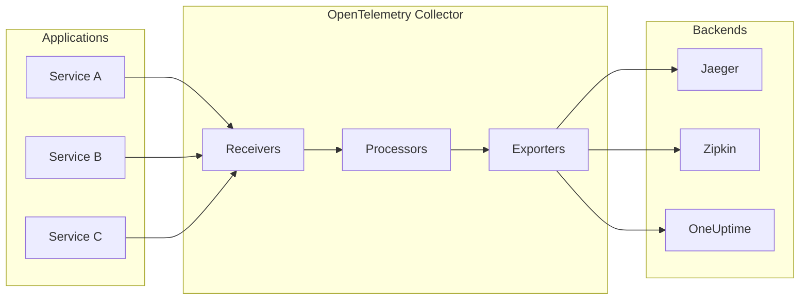
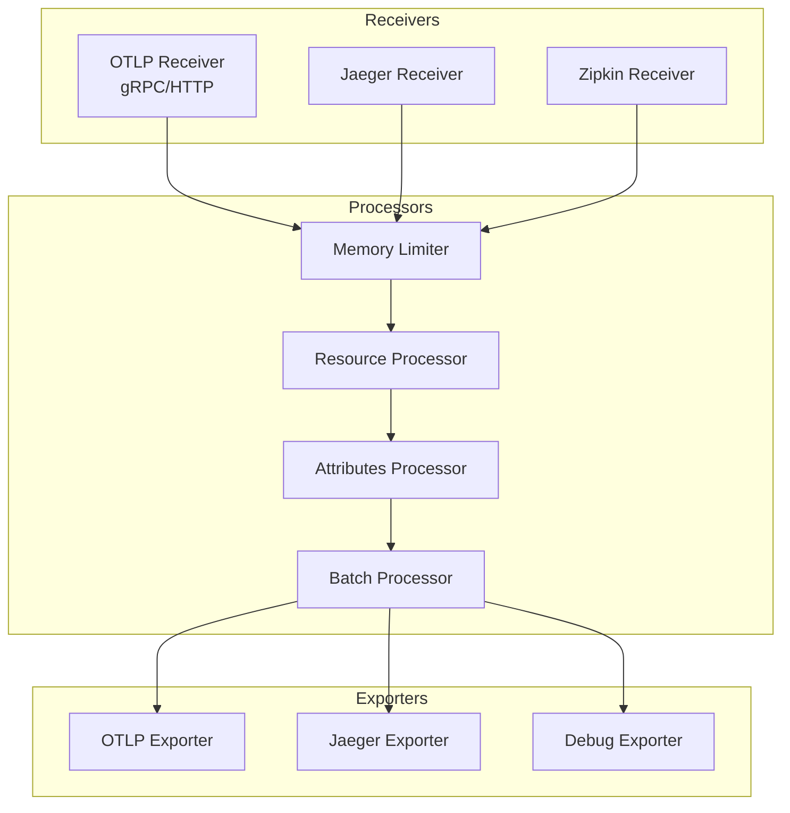
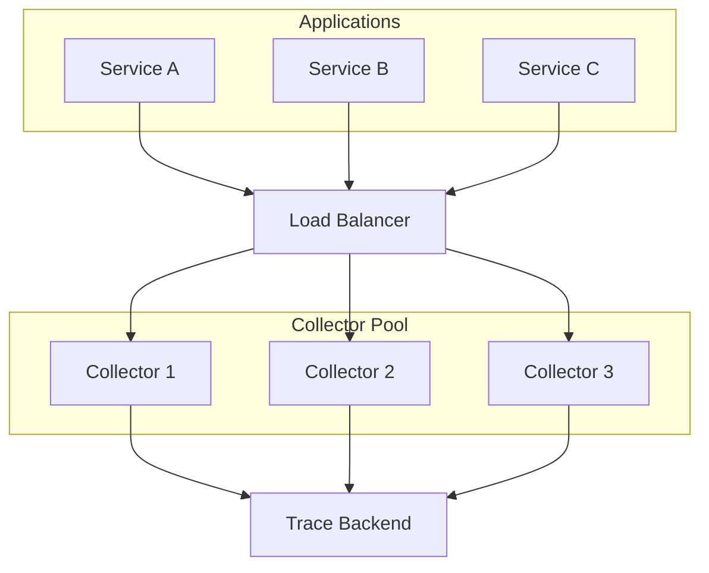

# How to Set Up OpenTelemetry Collector for Traces

Author: [nawazdhandala](https://www.github.com/nawazdhandala)

Tags: OpenTelemetry, Tracing, Observability, Collector, DevOps, Monitoring

Description: Learn how to set up and configure the OpenTelemetry Collector to receive, process, and export traces from your applications.

---

The OpenTelemetry Collector is a vendor-agnostic service that receives, processes, and exports telemetry data. It acts as a central hub for your observability pipeline, allowing you to collect traces from multiple sources and route them to various backends. In this guide, we will walk through setting up the OpenTelemetry Collector specifically for trace collection.

## Understanding the OpenTelemetry Collector Architecture

Before diving into the setup, let us understand how the Collector works:



The Collector has three main components:

- **Receivers**: Accept data from various sources using different protocols
- **Processors**: Transform, filter, or enrich the data
- **Exporters**: Send data to one or more destinations

## Installing the OpenTelemetry Collector

### Option 1: Using Docker

The easiest way to run the Collector is using Docker:

```bash
# Pull the official OpenTelemetry Collector image
docker pull otel/opentelemetry-collector:latest

# Run the collector with a custom configuration file
docker run -d \
  --name otel-collector \
  -p 4317:4317 \      # gRPC receiver port
  -p 4318:4318 \      # HTTP receiver port
  -p 55679:55679 \    # zpages extension for debugging
  -v $(pwd)/otel-collector-config.yaml:/etc/otel-collector-config.yaml \
  otel/opentelemetry-collector:latest \
  --config=/etc/otel-collector-config.yaml
```

### Option 2: Using Docker Compose

For a more structured deployment, use Docker Compose:

```yaml
# docker-compose.yaml
# This configuration sets up the OpenTelemetry Collector with Jaeger as a backend
version: '3.8'

services:
  otel-collector:
    image: otel/opentelemetry-collector:latest
    container_name: otel-collector
    # Mount the configuration file into the container
    volumes:
      - ./otel-collector-config.yaml:/etc/otel-collector-config.yaml
    # Specify the config file location
    command: ["--config=/etc/otel-collector-config.yaml"]
    ports:
      - "4317:4317"   # OTLP gRPC receiver
      - "4318:4318"   # OTLP HTTP receiver
      - "55679:55679" # zpages extension
    networks:
      - observability

  # Optional: Add Jaeger for trace visualization
  jaeger:
    image: jaegertracing/all-in-one:latest
    container_name: jaeger
    ports:
      - "16686:16686" # Jaeger UI
      - "14250:14250" # gRPC receiver
    networks:
      - observability

networks:
  observability:
    driver: bridge
```

### Option 3: Binary Installation

For production environments, you may want to install the Collector as a system service:

```bash
# Download the latest release for your platform
# Replace VERSION and ARCH with appropriate values
wget https://github.com/open-telemetry/opentelemetry-collector-releases/releases/download/v0.90.0/otelcol_0.90.0_linux_amd64.tar.gz

# Extract the binary
tar -xzf otelcol_0.90.0_linux_amd64.tar.gz

# Move to a system location
sudo mv otelcol /usr/local/bin/

# Create a systemd service file
sudo tee /etc/systemd/system/otel-collector.service > /dev/null <<EOF
[Unit]
Description=OpenTelemetry Collector
After=network.target

[Service]
Type=simple
ExecStart=/usr/local/bin/otelcol --config=/etc/otel-collector-config.yaml
Restart=always
RestartSec=10

[Install]
WantedBy=multi-user.target
EOF

# Reload systemd and start the service
sudo systemctl daemon-reload
sudo systemctl enable otel-collector
sudo systemctl start otel-collector
```

## Configuring the Collector for Traces

Here is a complete configuration file optimized for trace collection:

```yaml
# otel-collector-config.yaml
# Complete configuration for collecting and exporting traces

# Receivers define how data gets into the Collector
receivers:
  # OTLP receiver accepts data in OpenTelemetry Protocol format
  otlp:
    protocols:
      # gRPC is recommended for high-throughput scenarios
      grpc:
        endpoint: 0.0.0.0:4317
        # Optional: Configure TLS for secure communication
        # tls:
        #   cert_file: /path/to/cert.pem
        #   key_file: /path/to/key.pem
      # HTTP is useful for browser-based applications
      http:
        endpoint: 0.0.0.0:4318
        # Allow CORS for browser applications
        cors:
          allowed_origins:
            - "http://localhost:*"
            - "https://*.yourdomain.com"

  # Jaeger receiver for legacy Jaeger clients
  jaeger:
    protocols:
      thrift_http:
        endpoint: 0.0.0.0:14268
      grpc:
        endpoint: 0.0.0.0:14250

  # Zipkin receiver for Zipkin-compatible clients
  zipkin:
    endpoint: 0.0.0.0:9411

# Processors transform and enrich telemetry data
processors:
  # Batch processor groups data for efficient export
  batch:
    # Maximum time to wait before sending a batch
    timeout: 10s
    # Maximum number of spans per batch
    send_batch_size: 10000
    # Maximum batch size in bytes
    send_batch_max_size: 11000

  # Memory limiter prevents out-of-memory situations
  memory_limiter:
    # Check memory usage at this interval
    check_interval: 5s
    # Hard limit - collector will drop data above this
    limit_mib: 4000
    # Soft limit - collector will start throttling above this
    spike_limit_mib: 500

  # Resource processor adds attributes to all spans
  resource:
    attributes:
      - key: environment
        value: production
        action: upsert
      - key: collector.version
        value: "1.0.0"
        action: insert

  # Attributes processor modifies span attributes
  attributes:
    actions:
      # Remove sensitive information
      - key: http.request.header.authorization
        action: delete
      # Hash user identifiers for privacy
      - key: user.email
        action: hash

# Exporters define where data is sent
exporters:
  # Debug exporter prints to stdout (useful for development)
  debug:
    verbosity: detailed

  # OTLP exporter sends to another OTLP-compatible backend
  otlp:
    endpoint: "https://ingest.oneuptime.com:443"
    headers:
      # Replace with your actual API key
      x-oneuptime-token: "YOUR_ONEUPTIME_TOKEN"
    tls:
      insecure: false

  # Jaeger exporter for Jaeger backend
  jaeger:
    endpoint: "jaeger:14250"
    tls:
      insecure: true

# Extensions provide additional capabilities
extensions:
  # Health check endpoint for load balancers
  health_check:
    endpoint: 0.0.0.0:13133

  # zpages provides debugging information
  zpages:
    endpoint: 0.0.0.0:55679

  # pprof provides profiling endpoints
  pprof:
    endpoint: 0.0.0.0:1777

# Service section ties everything together
service:
  # Enable extensions
  extensions: [health_check, zpages, pprof]

  # Define pipelines for each telemetry type
  pipelines:
    # Traces pipeline
    traces:
      receivers: [otlp, jaeger, zipkin]
      processors: [memory_limiter, resource, attributes, batch]
      exporters: [otlp, jaeger, debug]
```

## Pipeline Architecture

The following diagram shows how traces flow through the Collector:



## Configuring Your Application to Send Traces

Once the Collector is running, configure your applications to send traces to it.

### Node.js Application

```javascript
// tracing.js
// OpenTelemetry SDK setup for Node.js applications

const { NodeSDK } = require('@opentelemetry/sdk-node');
const { OTLPTraceExporter } = require('@opentelemetry/exporter-trace-otlp-grpc');
const { getNodeAutoInstrumentations } = require('@opentelemetry/auto-instrumentations-node');
const { Resource } = require('@opentelemetry/resources');
const { SemanticResourceAttributes } = require('@opentelemetry/semantic-conventions');

// Create OTLP exporter pointing to your Collector
const traceExporter = new OTLPTraceExporter({
  // The Collector's OTLP gRPC endpoint
  url: 'http://localhost:4317',
});

// Initialize the SDK with auto-instrumentation
const sdk = new NodeSDK({
  // Define resource attributes for your service
  resource: new Resource({
    [SemanticResourceAttributes.SERVICE_NAME]: 'my-nodejs-service',
    [SemanticResourceAttributes.SERVICE_VERSION]: '1.0.0',
    [SemanticResourceAttributes.DEPLOYMENT_ENVIRONMENT]: 'production',
  }),
  // Configure the trace exporter
  traceExporter: traceExporter,
  // Enable automatic instrumentation for common libraries
  instrumentations: [getNodeAutoInstrumentations()],
});

// Start the SDK before your application code
sdk.start();

// Ensure traces are flushed before the process exits
process.on('SIGTERM', () => {
  sdk.shutdown()
    .then(() => console.log('Tracing terminated'))
    .catch((error) => console.log('Error terminating tracing', error))
    .finally(() => process.exit(0));
});
```

### Python Application

```python
# tracing.py
# OpenTelemetry SDK setup for Python applications

from opentelemetry import trace
from opentelemetry.sdk.trace import TracerProvider
from opentelemetry.sdk.trace.export import BatchSpanProcessor
from opentelemetry.exporter.otlp.proto.grpc.trace_exporter import OTLPSpanExporter
from opentelemetry.sdk.resources import Resource, SERVICE_NAME, SERVICE_VERSION

# Define resource attributes for your service
resource = Resource(attributes={
    SERVICE_NAME: "my-python-service",
    SERVICE_VERSION: "1.0.0",
    "deployment.environment": "production",
})

# Create a TracerProvider with the resource
provider = TracerProvider(resource=resource)

# Create an OTLP exporter pointing to the Collector
otlp_exporter = OTLPSpanExporter(
    # The Collector's OTLP gRPC endpoint
    endpoint="http://localhost:4317",
    # Set to True if not using TLS
    insecure=True,
)

# Use BatchSpanProcessor for efficient batching of spans
processor = BatchSpanProcessor(otlp_exporter)
provider.add_span_processor(processor)

# Set the global TracerProvider
trace.set_tracer_provider(provider)

# Get a tracer for creating spans
tracer = trace.get_tracer(__name__)

# Example usage: Create a span for an operation
def process_order(order_id):
    with tracer.start_as_current_span("process_order") as span:
        # Add attributes to the span
        span.set_attribute("order.id", order_id)
        span.set_attribute("order.status", "processing")

        # Your business logic here
        print(f"Processing order {order_id}")

        # Add an event to mark completion
        span.add_event("order_processed")
```

## Verifying Your Setup

### Check Collector Health

```bash
# Check if the Collector is healthy
curl http://localhost:13133/

# View zpages for debugging information
# Open in browser: http://localhost:55679/debug/tracez
```

### View Debug Output

If you enabled the debug exporter, you will see traces in the Collector logs:

```bash
# View Docker logs
docker logs -f otel-collector

# Or if running as a service
journalctl -u otel-collector -f
```

### Validate Configuration

Before deploying, validate your configuration:

```bash
# Validate the configuration file
otelcol validate --config=/etc/otel-collector-config.yaml
```

## Production Considerations

### High Availability Setup



### Resource Recommendations

For production deployments, consider these resource allocations:

| Traces per Second | CPU | Memory |
|------------------|-----|--------|
| Up to 1,000 | 1 core | 2 GB |
| 1,000 - 10,000 | 2 cores | 4 GB |
| 10,000 - 50,000 | 4 cores | 8 GB |
| 50,000+ | 8+ cores | 16+ GB |

## Troubleshooting

### Common Issues

1. **Collector not receiving data**: Check that your application is pointing to the correct endpoint and port
2. **High memory usage**: Adjust the `memory_limiter` processor settings
3. **Dropped spans**: Increase batch sizes or add more Collector instances
4. **Export failures**: Verify network connectivity and authentication credentials

### Useful Commands

```bash
# Check which ports are in use
netstat -tlnp | grep otel

# Test gRPC connectivity
grpcurl -plaintext localhost:4317 list

# Check Collector metrics
curl http://localhost:8888/metrics
```

## Next Steps

Now that you have the OpenTelemetry Collector set up for traces, consider:

- Adding metrics and logs pipelines for complete observability
- Implementing sampling strategies to reduce data volume
- Setting up alerts based on trace data
- Exploring tail-based sampling for capturing important traces

**Related Reading:**

- [How to Configure OpenTelemetry Auto-Instrumentation](https://oneuptime.com/blog/post/2026-01-24-opentelemetry-auto-instrumentation/view)
- [How to Fix "Exporter Failed" Errors in OpenTelemetry](https://oneuptime.com/blog/post/2026-01-24-opentelemetry-exporter-failed-errors/view)
- [How to Handle Span Context Propagation in OpenTelemetry](https://oneuptime.com/blog/post/2026-01-24-opentelemetry-span-context-propagation/view)
