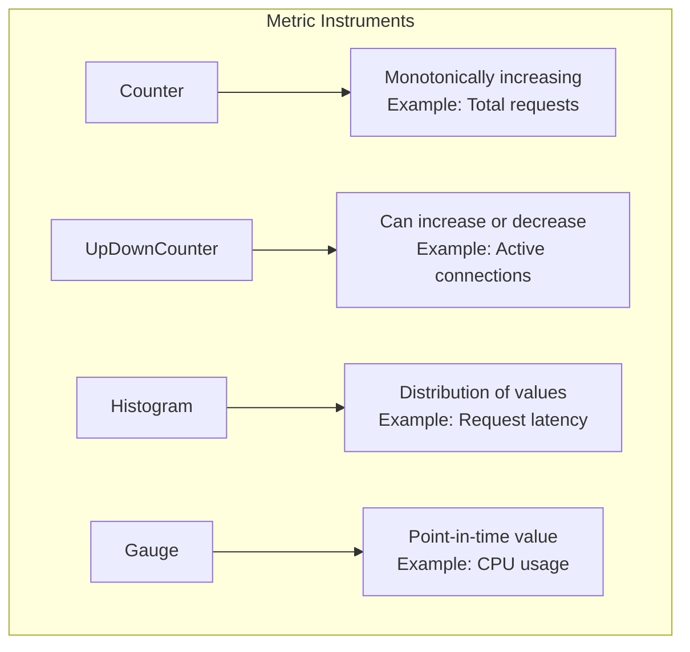
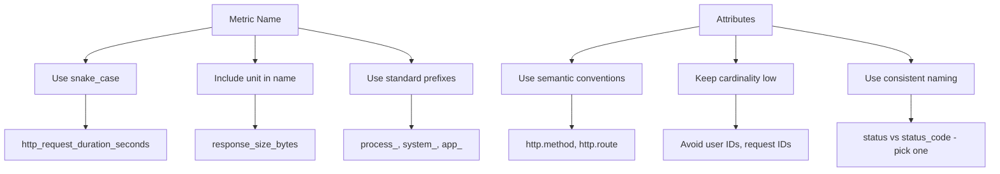
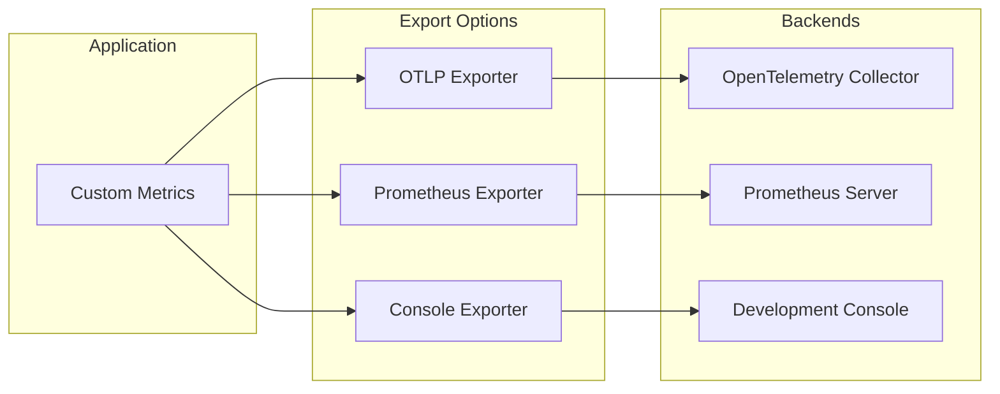

# How to Handle Custom Metrics in OpenTelemetry

Author: [nawazdhandala](https://www.github.com/nawazdhandala)

Tags: OpenTelemetry, Metrics, Observability, Monitoring, Custom Metrics

Description: Learn how to create, configure, and export custom metrics in OpenTelemetry for comprehensive application monitoring.

---

While auto-instrumentation provides great baseline metrics, custom metrics allow you to track business-specific data and application-level insights that matter most to your organization. This guide covers how to implement custom metrics in OpenTelemetry across different languages and use cases.

## Understanding OpenTelemetry Metrics

OpenTelemetry provides three main types of metrics instruments:



## Setting Up the Metrics SDK

Before creating custom metrics, you need to configure the metrics SDK.

```javascript
// JavaScript/Node.js - Metrics SDK Setup
const { MeterProvider, PeriodicExportingMetricReader } = require('@opentelemetry/sdk-metrics');
const { OTLPMetricExporter } = require('@opentelemetry/exporter-metrics-otlp-http');
const { Resource } = require('@opentelemetry/resources');
const { SemanticResourceAttributes } = require('@opentelemetry/semantic-conventions');

// Create a resource that identifies your service
const resource = new Resource({
  [SemanticResourceAttributes.SERVICE_NAME]: 'my-service',
  [SemanticResourceAttributes.SERVICE_VERSION]: '1.0.0',
  [SemanticResourceAttributes.DEPLOYMENT_ENVIRONMENT]: 'production',
});

// Configure the OTLP exporter
const metricExporter = new OTLPMetricExporter({
  url: 'http://otel-collector:4318/v1/metrics',
});

// Create a metric reader that exports every 60 seconds
const metricReader = new PeriodicExportingMetricReader({
  exporter: metricExporter,
  exportIntervalMillis: 60000,  // Export every 60 seconds
});

// Create and configure the meter provider
const meterProvider = new MeterProvider({
  resource: resource,
});

meterProvider.addMetricReader(metricReader);

// Get a meter for creating instruments
const meter = meterProvider.getMeter('my-service-metrics', '1.0.0');

module.exports = { meter };
```

```python
# Python - Metrics SDK Setup
from opentelemetry import metrics
from opentelemetry.sdk.metrics import MeterProvider
from opentelemetry.sdk.metrics.export import PeriodicExportingMetricReader
from opentelemetry.exporter.otlp.proto.grpc.metric_exporter import OTLPMetricExporter
from opentelemetry.sdk.resources import Resource, SERVICE_NAME, SERVICE_VERSION

# Define service resource attributes
resource = Resource(attributes={
    SERVICE_NAME: "my-python-service",
    SERVICE_VERSION: "1.0.0",
})

# Create OTLP exporter
exporter = OTLPMetricExporter(
    endpoint="http://otel-collector:4317",
    insecure=True
)

# Create metric reader with 30-second export interval
reader = PeriodicExportingMetricReader(
    exporter=exporter,
    export_interval_millis=30000
)

# Initialize the meter provider
provider = MeterProvider(
    resource=resource,
    metric_readers=[reader]
)

# Set as global meter provider
metrics.set_meter_provider(provider)

# Get a meter for creating instruments
meter = metrics.get_meter("my-python-service", "1.0.0")
```

## Creating Custom Counters

Counters are used for values that only increase, such as request counts or processed items.

```javascript
// JavaScript - Counter Examples
const { meter } = require('./metrics-setup');

// Create a counter for tracking total HTTP requests
const httpRequestCounter = meter.createCounter('http_requests_total', {
  description: 'Total number of HTTP requests received',
  unit: '1',  // Unit is "1" for counts
});

// Create a counter for tracking processed orders
const ordersProcessedCounter = meter.createCounter('orders_processed_total', {
  description: 'Total number of orders successfully processed',
  unit: '1',
});

// Express middleware to count requests
function requestCounterMiddleware(req, res, next) {
  // Increment counter with attributes for better analysis
  httpRequestCounter.add(1, {
    'http.method': req.method,
    'http.route': req.route?.path || req.path,
    'http.status_code': res.statusCode,
  });
  next();
}

// Function to track order processing
async function processOrder(order) {
  try {
    // Process the order logic here
    await saveOrder(order);

    // Increment counter on success
    ordersProcessedCounter.add(1, {
      'order.type': order.type,
      'order.region': order.region,
      'order.status': 'success',
    });
  } catch (error) {
    // Track failed orders separately
    ordersProcessedCounter.add(1, {
      'order.type': order.type,
      'order.region': order.region,
      'order.status': 'failed',
      'error.type': error.name,
    });
    throw error;
  }
}
```

```python
# Python - Counter Examples
from opentelemetry import metrics

meter = metrics.get_meter("order-service", "1.0.0")

# Create counters
request_counter = meter.create_counter(
    name="http_requests_total",
    description="Total HTTP requests",
    unit="1"
)

orders_counter = meter.create_counter(
    name="orders_total",
    description="Total orders processed",
    unit="1"
)

# FastAPI middleware example
from fastapi import FastAPI, Request
from starlette.middleware.base import BaseHTTPMiddleware

app = FastAPI()

class MetricsMiddleware(BaseHTTPMiddleware):
    async def dispatch(self, request: Request, call_next):
        response = await call_next(request)

        # Record the request with attributes
        request_counter.add(
            1,
            {
                "http.method": request.method,
                "http.route": request.url.path,
                "http.status_code": response.status_code,
            }
        )
        return response

app.add_middleware(MetricsMiddleware)

# Track business metrics
def process_order(order: dict):
    try:
        # Order processing logic
        save_to_database(order)

        orders_counter.add(1, {
            "order.type": order["type"],
            "order.payment_method": order["payment_method"],
            "status": "completed"
        })
    except Exception as e:
        orders_counter.add(1, {
            "order.type": order["type"],
            "status": "failed",
            "error.type": type(e).__name__
        })
        raise
```

## Creating UpDown Counters

UpDownCounters track values that can both increase and decrease.

```javascript
// JavaScript - UpDownCounter Examples
const { meter } = require('./metrics-setup');

// Track active connections
const activeConnections = meter.createUpDownCounter('active_connections', {
  description: 'Number of currently active connections',
  unit: '1',
});

// Track items in a queue
const queueSize = meter.createUpDownCounter('queue_size', {
  description: 'Current number of items in the processing queue',
  unit: '1',
});

// Connection pool management
class ConnectionPool {
  constructor() {
    this.connections = [];
  }

  acquire() {
    const conn = this.createConnection();
    this.connections.push(conn);

    // Increment active connections
    activeConnections.add(1, {
      'pool.name': 'database',
      'pool.type': 'postgresql',
    });

    return conn;
  }

  release(conn) {
    const index = this.connections.indexOf(conn);
    if (index > -1) {
      this.connections.splice(index, 1);

      // Decrement active connections
      activeConnections.add(-1, {
        'pool.name': 'database',
        'pool.type': 'postgresql',
      });
    }
  }
}

// Queue management example
class JobQueue {
  constructor(queueName) {
    this.queueName = queueName;
    this.jobs = [];
  }

  enqueue(job) {
    this.jobs.push(job);

    // Increment queue size
    queueSize.add(1, {
      'queue.name': this.queueName,
      'job.priority': job.priority || 'normal',
    });
  }

  dequeue() {
    const job = this.jobs.shift();
    if (job) {
      // Decrement queue size
      queueSize.add(-1, {
        'queue.name': this.queueName,
        'job.priority': job.priority || 'normal',
      });
    }
    return job;
  }
}
```

```go
// Go - UpDownCounter Examples
package main

import (
    "context"
    "go.opentelemetry.io/otel"
    "go.opentelemetry.io/otel/attribute"
    "go.opentelemetry.io/otel/metric"
)

var (
    meter = otel.Meter("my-service")

    // Create UpDownCounter for active goroutines
    activeGoroutines metric.Int64UpDownCounter

    // Create UpDownCounter for cache entries
    cacheEntries metric.Int64UpDownCounter
)

func init() {
    var err error

    activeGoroutines, err = meter.Int64UpDownCounter(
        "active_goroutines",
        metric.WithDescription("Number of active goroutines"),
        metric.WithUnit("1"),
    )
    if err != nil {
        panic(err)
    }

    cacheEntries, err = meter.Int64UpDownCounter(
        "cache_entries",
        metric.WithDescription("Number of entries in cache"),
        metric.WithUnit("1"),
    )
    if err != nil {
        panic(err)
    }
}

// Track goroutine lifecycle
func trackedGoroutine(ctx context.Context, name string, fn func()) {
    activeGoroutines.Add(ctx, 1, metric.WithAttributes(
        attribute.String("goroutine.name", name),
    ))

    go func() {
        defer activeGoroutines.Add(ctx, -1, metric.WithAttributes(
            attribute.String("goroutine.name", name),
        ))
        fn()
    }()
}

// Cache with metrics
type MetricsCache struct {
    data map[string]interface{}
    name string
}

func (c *MetricsCache) Set(ctx context.Context, key string, value interface{}) {
    _, exists := c.data[key]
    c.data[key] = value

    // Only increment if new entry
    if !exists {
        cacheEntries.Add(ctx, 1, metric.WithAttributes(
            attribute.String("cache.name", c.name),
        ))
    }
}

func (c *MetricsCache) Delete(ctx context.Context, key string) {
    if _, exists := c.data[key]; exists {
        delete(c.data, key)
        cacheEntries.Add(ctx, -1, metric.WithAttributes(
            attribute.String("cache.name", c.name),
        ))
    }
}
```

## Creating Histograms

Histograms are ideal for tracking distributions like latencies or sizes.

```javascript
// JavaScript - Histogram Examples
const { meter } = require('./metrics-setup');

// Create histogram for request latency
const requestLatency = meter.createHistogram('http_request_duration_seconds', {
  description: 'HTTP request latency in seconds',
  unit: 's',
  // Define custom bucket boundaries for latency
  advice: {
    explicitBucketBoundaries: [0.005, 0.01, 0.025, 0.05, 0.1, 0.25, 0.5, 1, 2.5, 5, 10],
  },
});

// Create histogram for response size
const responseSize = meter.createHistogram('http_response_size_bytes', {
  description: 'HTTP response size in bytes',
  unit: 'By',
  advice: {
    explicitBucketBoundaries: [100, 1000, 10000, 100000, 1000000, 10000000],
  },
});

// Create histogram for database query time
const dbQueryDuration = meter.createHistogram('db_query_duration_seconds', {
  description: 'Database query execution time',
  unit: 's',
});

// Express middleware for request latency
function latencyMiddleware(req, res, next) {
  const startTime = process.hrtime.bigint();

  // Hook into response finish event
  res.on('finish', () => {
    const endTime = process.hrtime.bigint();
    const durationNs = endTime - startTime;
    const durationSeconds = Number(durationNs) / 1e9;

    // Record latency with attributes
    requestLatency.record(durationSeconds, {
      'http.method': req.method,
      'http.route': req.route?.path || 'unknown',
      'http.status_code': res.statusCode,
    });

    // Record response size if available
    const contentLength = res.getHeader('content-length');
    if (contentLength) {
      responseSize.record(parseInt(contentLength, 10), {
        'http.method': req.method,
        'http.route': req.route?.path || 'unknown',
      });
    }
  });

  next();
}

// Database query wrapper with metrics
async function trackedQuery(queryName, queryFn) {
  const startTime = process.hrtime.bigint();

  try {
    const result = await queryFn();
    const durationSeconds = Number(process.hrtime.bigint() - startTime) / 1e9;

    dbQueryDuration.record(durationSeconds, {
      'db.operation': queryName,
      'db.status': 'success',
    });

    return result;
  } catch (error) {
    const durationSeconds = Number(process.hrtime.bigint() - startTime) / 1e9;

    dbQueryDuration.record(durationSeconds, {
      'db.operation': queryName,
      'db.status': 'error',
      'error.type': error.name,
    });

    throw error;
  }
}
```

```python
# Python - Histogram Examples
from opentelemetry import metrics
import time
from functools import wraps

meter = metrics.get_meter("my-service", "1.0.0")

# Create histograms with custom boundaries
request_latency = meter.create_histogram(
    name="http_request_duration_seconds",
    description="HTTP request latency",
    unit="s"
)

# Custom histogram for order processing time
order_processing_time = meter.create_histogram(
    name="order_processing_duration_seconds",
    description="Time to process an order",
    unit="s"
)

# Decorator for timing functions
def timed_operation(operation_name: str, histogram=None):
    """Decorator to automatically record function execution time."""
    def decorator(func):
        @wraps(func)
        def wrapper(*args, **kwargs):
            start_time = time.perf_counter()
            status = "success"
            error_type = None

            try:
                result = func(*args, **kwargs)
                return result
            except Exception as e:
                status = "error"
                error_type = type(e).__name__
                raise
            finally:
                duration = time.perf_counter() - start_time

                attributes = {
                    "operation.name": operation_name,
                    "operation.status": status,
                }
                if error_type:
                    attributes["error.type"] = error_type

                target_histogram = histogram or request_latency
                target_histogram.record(duration, attributes)

        return wrapper
    return decorator

# Usage example
@timed_operation("process_payment", order_processing_time)
def process_payment(order_id: str, amount: float):
    # Simulate payment processing
    time.sleep(0.1)
    return {"status": "completed", "order_id": order_id}

# Async version
async def timed_async_operation(operation_name: str, histogram, coro):
    """Helper for timing async operations."""
    start_time = time.perf_counter()
    status = "success"

    try:
        result = await coro
        return result
    except Exception as e:
        status = "error"
        raise
    finally:
        duration = time.perf_counter() - start_time
        histogram.record(duration, {
            "operation.name": operation_name,
            "operation.status": status,
        })
```

## Creating Observable Gauges

Observable gauges are used for values that are measured periodically, like system metrics.

```javascript
// JavaScript - Observable Gauge Examples
const { meter } = require('./metrics-setup');
const os = require('os');
const v8 = require('v8');

// Observable gauge for memory usage
meter.createObservableGauge('process_memory_bytes', {
  description: 'Process memory usage in bytes',
  unit: 'By',
}, (observableResult) => {
  const memUsage = process.memoryUsage();

  // Record different memory metrics
  observableResult.observe(memUsage.heapUsed, {
    'memory.type': 'heap_used',
  });
  observableResult.observe(memUsage.heapTotal, {
    'memory.type': 'heap_total',
  });
  observableResult.observe(memUsage.rss, {
    'memory.type': 'rss',
  });
  observableResult.observe(memUsage.external, {
    'memory.type': 'external',
  });
});

// Observable gauge for CPU usage
let lastCpuUsage = process.cpuUsage();
let lastCpuTime = Date.now();

meter.createObservableGauge('process_cpu_usage_percent', {
  description: 'Process CPU usage percentage',
  unit: '%',
}, (observableResult) => {
  const currentCpuUsage = process.cpuUsage(lastCpuUsage);
  const currentTime = Date.now();
  const timeDiff = (currentTime - lastCpuTime) * 1000; // Convert to microseconds

  // Calculate CPU percentage
  const userPercent = (currentCpuUsage.user / timeDiff) * 100;
  const systemPercent = (currentCpuUsage.system / timeDiff) * 100;

  observableResult.observe(userPercent, { 'cpu.type': 'user' });
  observableResult.observe(systemPercent, { 'cpu.type': 'system' });

  // Update for next measurement
  lastCpuUsage = process.cpuUsage();
  lastCpuTime = currentTime;
});

// Observable gauge for event loop lag
let lastLoopTime = Date.now();
meter.createObservableGauge('nodejs_eventloop_lag_seconds', {
  description: 'Node.js event loop lag in seconds',
  unit: 's',
}, (observableResult) => {
  const now = Date.now();
  const expectedInterval = 1000; // 1 second
  const actualInterval = now - lastLoopTime;
  const lag = Math.max(0, actualInterval - expectedInterval) / 1000;

  observableResult.observe(lag, {});
  lastLoopTime = now;
});

// Observable gauge for active handles/requests
meter.createObservableGauge('nodejs_active_resources', {
  description: 'Number of active resources in Node.js',
  unit: '1',
}, (observableResult) => {
  // Note: _getActiveHandles and _getActiveRequests are internal APIs
  const handles = process._getActiveHandles?.()?.length || 0;
  const requests = process._getActiveRequests?.()?.length || 0;

  observableResult.observe(handles, { 'resource.type': 'handles' });
  observableResult.observe(requests, { 'resource.type': 'requests' });
});
```

```python
# Python - Observable Gauge Examples
from opentelemetry import metrics
import psutil
import gc

meter = metrics.get_meter("system-metrics", "1.0.0")

def get_memory_callback(observer):
    """Callback to observe memory metrics."""
    process = psutil.Process()
    memory_info = process.memory_info()

    # Record various memory metrics
    observer.observe(memory_info.rss, {"memory.type": "rss"})
    observer.observe(memory_info.vms, {"memory.type": "vms"})

    # Python-specific memory
    gc_stats = gc.get_stats()
    for i, stat in enumerate(gc_stats):
        observer.observe(
            stat['collected'],
            {"memory.type": f"gc_gen{i}_collected"}
        )

def get_cpu_callback(observer):
    """Callback to observe CPU metrics."""
    process = psutil.Process()
    cpu_percent = process.cpu_percent(interval=None)
    cpu_times = process.cpu_times()

    observer.observe(cpu_percent, {"cpu.metric": "percent"})
    observer.observe(cpu_times.user, {"cpu.metric": "user_time"})
    observer.observe(cpu_times.system, {"cpu.metric": "system_time"})

def get_disk_callback(observer):
    """Callback to observe disk metrics."""
    disk = psutil.disk_usage('/')

    observer.observe(disk.total, {"disk.metric": "total"})
    observer.observe(disk.used, {"disk.metric": "used"})
    observer.observe(disk.free, {"disk.metric": "free"})
    observer.observe(disk.percent, {"disk.metric": "percent"})

# Register observable gauges
meter.create_observable_gauge(
    name="process_memory_bytes",
    callbacks=[get_memory_callback],
    description="Process memory usage",
    unit="By"
)

meter.create_observable_gauge(
    name="process_cpu",
    callbacks=[get_cpu_callback],
    description="Process CPU metrics",
    unit="1"
)

meter.create_observable_gauge(
    name="system_disk_bytes",
    callbacks=[get_disk_callback],
    description="System disk usage",
    unit="By"
)
```

## Best Practices for Custom Metrics

### Metric Naming Conventions



### Cardinality Management

```javascript
// BAD: High cardinality - creates too many time series
const badCounter = meter.createCounter('requests_by_user');

function trackRequest(userId) {
  // This creates a unique time series for each user!
  badCounter.add(1, { 'user.id': userId });  // Don't do this!
}

// GOOD: Low cardinality - bounded number of time series
const goodCounter = meter.createCounter('requests_by_tier');

function trackRequestBetter(user) {
  // Use a bounded attribute like user tier instead
  goodCounter.add(1, {
    'user.tier': user.tier,  // Only a few values: free, pro, enterprise
    'user.region': user.region,  // Limited to known regions
  });
}

// Use histograms for high-cardinality numerical values
const latencyHistogram = meter.createHistogram('request_latency_seconds');

function trackLatency(userId, latencyMs) {
  // The actual latency value goes in the histogram
  // User tier (low cardinality) goes in attributes
  latencyHistogram.record(latencyMs / 1000, {
    'user.tier': getUserTier(userId),
  });
}
```

## Exporting to Different Backends



```javascript
// Multiple exporters configuration
const { MeterProvider, PeriodicExportingMetricReader } = require('@opentelemetry/sdk-metrics');
const { OTLPMetricExporter } = require('@opentelemetry/exporter-metrics-otlp-http');
const { PrometheusExporter } = require('@opentelemetry/exporter-prometheus');
const { ConsoleMetricExporter } = require('@opentelemetry/sdk-metrics');

// Development: Console exporter for debugging
const consoleReader = new PeriodicExportingMetricReader({
  exporter: new ConsoleMetricExporter(),
  exportIntervalMillis: 10000,
});

// Production: OTLP exporter to collector
const otlpReader = new PeriodicExportingMetricReader({
  exporter: new OTLPMetricExporter({
    url: process.env.OTEL_EXPORTER_OTLP_ENDPOINT,
  }),
  exportIntervalMillis: 60000,
});

// Prometheus: Pull-based metrics endpoint
const prometheusExporter = new PrometheusExporter({
  port: 9464,
  endpoint: '/metrics',
});

// Configure based on environment
const meterProvider = new MeterProvider();

if (process.env.NODE_ENV === 'development') {
  meterProvider.addMetricReader(consoleReader);
}

if (process.env.OTEL_EXPORTER_OTLP_ENDPOINT) {
  meterProvider.addMetricReader(otlpReader);
}

if (process.env.PROMETHEUS_ENABLED === 'true') {
  meterProvider.addMetricReader(prometheusExporter);
}
```

## Summary

Custom metrics in OpenTelemetry allow you to track exactly what matters for your application. Key takeaways:

1. **Choose the right instrument type** - Counters for totals, histograms for distributions, gauges for point-in-time values
2. **Use meaningful attributes** - But keep cardinality low to avoid metric explosion
3. **Follow naming conventions** - Use snake_case, include units, and follow semantic conventions
4. **Configure appropriate export intervals** - Balance between data freshness and system load
5. **Use observable instruments** - For values that are expensive to compute or come from external sources

With these patterns, you can build comprehensive observability that captures both technical and business metrics.
