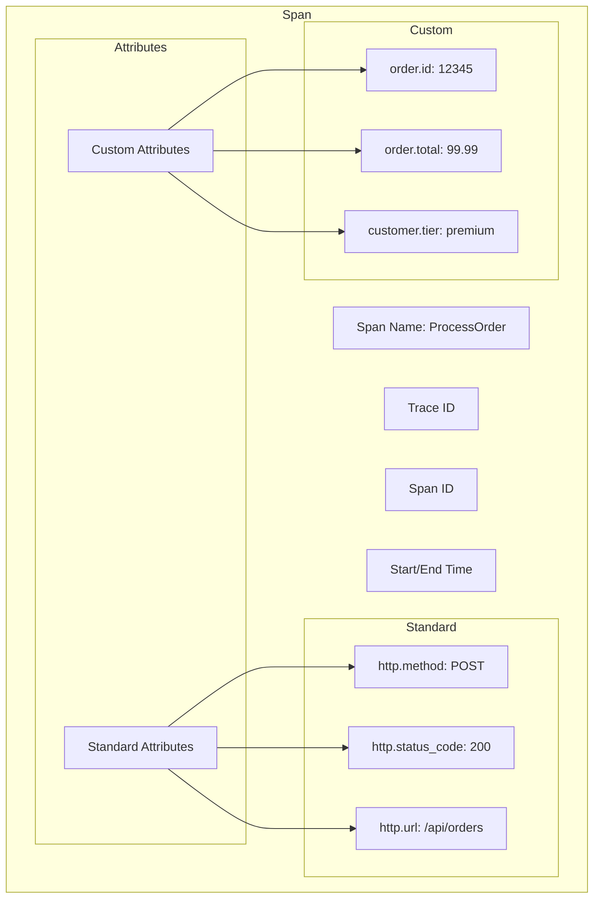
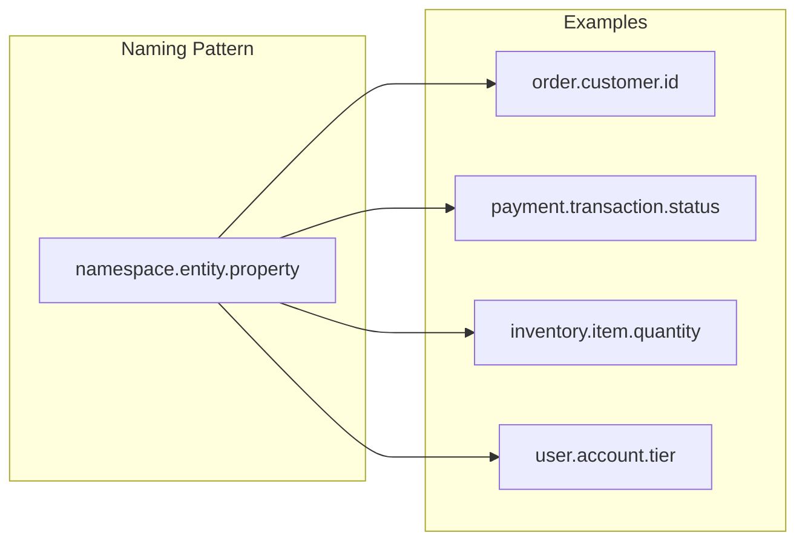
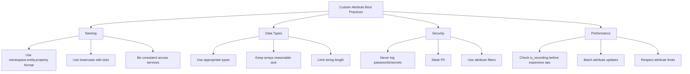

# How to Handle Custom Span Attributes in OpenTelemetry

Author: [nawazdhandala](https://www.github.com/nawazdhandala)

Tags: OpenTelemetry, Tracing, Observability, Span Attributes, Best Practices, Python, JavaScript, Go, Java

Description: A comprehensive guide to working with custom span attributes in OpenTelemetry, including naming conventions, data types, semantic conventions, and best practices for effective tracing.

---

> Span attributes are key-value pairs that provide context and metadata about operations in your traces. While OpenTelemetry defines semantic conventions for common attributes, adding custom attributes allows you to capture business-specific context that makes your traces truly useful. This guide covers everything you need to know about working with custom span attributes effectively.

Understanding how to properly define and use span attributes is essential for building traces that provide actionable insights into your application behavior.

---

## Understanding Span Attributes



### Attribute Data Types

| Type | Description | Example |
|------|-------------|---------|
| String | Text values | `"order_123"` |
| Boolean | True/false | `true` |
| Integer | Whole numbers | `42` |
| Float | Decimal numbers | `99.99` |
| String Array | List of strings | `["tag1", "tag2"]` |
| Integer Array | List of integers | `[1, 2, 3]` |
| Float Array | List of floats | `[1.1, 2.2]` |
| Boolean Array | List of booleans | `[true, false]` |

---

## Adding Custom Attributes

### Python

```python
from opentelemetry import trace
from opentelemetry.trace import Status, StatusCode

# Get the tracer
tracer = trace.get_tracer(__name__)

def process_order(order_id, customer_id, items):
    """Process an order with custom span attributes."""

    # Start a span with initial attributes
    with tracer.start_as_current_span(
        "ProcessOrder",
        attributes={
            # Business-specific attributes
            "order.id": order_id,
            "customer.id": customer_id,
            "order.item_count": len(items),
        }
    ) as span:

        # Calculate order total
        total = sum(item['price'] * item['quantity'] for item in items)

        # Add attributes after span creation
        span.set_attribute("order.total_amount", total)
        span.set_attribute("order.currency", "USD")

        # Add array attributes
        item_ids = [item['id'] for item in items]
        span.set_attribute("order.item_ids", item_ids)

        # Add boolean attribute
        is_premium = total > 100
        span.set_attribute("order.is_premium", is_premium)

        # Conditional attributes based on business logic
        if is_premium:
            span.set_attribute("order.discount_applied", True)
            span.set_attribute("order.discount_percentage", 10.0)

        # Process the order...
        result = execute_order(order_id, items, total)

        # Add result attributes
        span.set_attribute("order.status", result['status'])
        span.set_attribute("order.confirmation_number", result['confirmation'])

        return result
```

### JavaScript/TypeScript

```javascript
const { trace } = require('@opentelemetry/api');

const tracer = trace.getTracer('order-service');

async function processOrder(orderId, customerId, items) {
  // Start span with initial attributes
  return tracer.startActiveSpan(
    'ProcessOrder',
    {
      attributes: {
        'order.id': orderId,
        'customer.id': customerId,
        'order.item_count': items.length,
      },
    },
    async (span) => {
      try {
        // Calculate totals
        const subtotal = items.reduce(
          (sum, item) => sum + item.price * item.quantity,
          0
        );

        // Add computed attributes
        span.setAttribute('order.subtotal', subtotal);
        span.setAttribute('order.currency', 'USD');

        // Add array of item SKUs
        const skus = items.map((item) => item.sku);
        span.setAttribute('order.item_skus', skus);

        // Apply discounts
        const discount = calculateDiscount(customerId, subtotal);
        span.setAttribute('order.discount_amount', discount);
        span.setAttribute('order.final_total', subtotal - discount);

        // Process payment
        const paymentResult = await processPayment(orderId, subtotal - discount);

        // Add payment attributes
        span.setAttribute('payment.method', paymentResult.method);
        span.setAttribute('payment.transaction_id', paymentResult.transactionId);
        span.setAttribute('payment.success', paymentResult.success);

        return paymentResult;

      } catch (error) {
        // Record error attributes
        span.setAttribute('error.type', error.name);
        span.setAttribute('error.message', error.message);
        span.recordException(error);
        span.setStatus({ code: 2, message: error.message });
        throw error;

      } finally {
        span.end();
      }
    }
  );
}
```

### Go

```go
package main

import (
    "context"

    "go.opentelemetry.io/otel"
    "go.opentelemetry.io/otel/attribute"
    "go.opentelemetry.io/otel/codes"
    "go.opentelemetry.io/otel/trace"
)

var tracer = otel.Tracer("order-service")

type Order struct {
    ID         string
    CustomerID string
    Items      []Item
    Total      float64
}

type Item struct {
    ID       string
    SKU      string
    Price    float64
    Quantity int
}

func ProcessOrder(ctx context.Context, order Order) error {
    // Start span with initial attributes
    ctx, span := tracer.Start(ctx, "ProcessOrder",
        trace.WithAttributes(
            attribute.String("order.id", order.ID),
            attribute.String("customer.id", order.CustomerID),
            attribute.Int("order.item_count", len(order.Items)),
        ),
    )
    defer span.End()

    // Calculate total
    var total float64
    var skus []string
    for _, item := range order.Items {
        total += item.Price * float64(item.Quantity)
        skus = append(skus, item.SKU)
    }

    // Add computed attributes
    span.SetAttributes(
        attribute.Float64("order.total", total),
        attribute.String("order.currency", "USD"),
        attribute.StringSlice("order.item_skus", skus),
        attribute.Bool("order.is_premium", total > 100),
    )

    // Process payment
    paymentID, err := ProcessPayment(ctx, order.ID, total)
    if err != nil {
        span.RecordError(err)
        span.SetStatus(codes.Error, err.Error())
        span.SetAttributes(
            attribute.String("error.type", "payment_failed"),
        )
        return err
    }

    // Add success attributes
    span.SetAttributes(
        attribute.String("payment.id", paymentID),
        attribute.String("order.status", "completed"),
    )

    return nil
}
```

### Java

```java
import io.opentelemetry.api.trace.Span;
import io.opentelemetry.api.trace.Tracer;
import io.opentelemetry.api.common.AttributeKey;
import io.opentelemetry.api.common.Attributes;
import io.opentelemetry.context.Scope;

public class OrderService {

    // Define attribute keys for type safety
    private static final AttributeKey<String> ORDER_ID = AttributeKey.stringKey("order.id");
    private static final AttributeKey<String> CUSTOMER_ID = AttributeKey.stringKey("customer.id");
    private static final AttributeKey<Long> ITEM_COUNT = AttributeKey.longKey("order.item_count");
    private static final AttributeKey<Double> ORDER_TOTAL = AttributeKey.doubleKey("order.total");
    private static final AttributeKey<Boolean> IS_PREMIUM = AttributeKey.booleanKey("order.is_premium");
    private static final AttributeKey<List<String>> ITEM_SKUS = AttributeKey.stringArrayKey("order.item_skus");

    private final Tracer tracer;

    public OrderService(Tracer tracer) {
        this.tracer = tracer;
    }

    public OrderResult processOrder(Order order) {
        // Create span with typed attributes
        Span span = tracer.spanBuilder("ProcessOrder")
            .setAttribute(ORDER_ID, order.getId())
            .setAttribute(CUSTOMER_ID, order.getCustomerId())
            .setAttribute(ITEM_COUNT, (long) order.getItems().size())
            .startSpan();

        try (Scope scope = span.makeCurrent()) {
            // Calculate total
            double total = order.getItems().stream()
                .mapToDouble(item -> item.getPrice() * item.getQuantity())
                .sum();

            // Add computed attributes
            span.setAttribute(ORDER_TOTAL, total);
            span.setAttribute(IS_PREMIUM, total > 100);

            // Add item SKUs as array
            List<String> skus = order.getItems().stream()
                .map(Item::getSku)
                .collect(Collectors.toList());
            span.setAttribute(ITEM_SKUS, skus);

            // Process the order
            OrderResult result = executeOrder(order, total);

            // Add result attributes
            span.setAttribute("order.status", result.getStatus());
            span.setAttribute("order.confirmation", result.getConfirmationNumber());

            return result;

        } catch (Exception e) {
            span.recordException(e);
            span.setStatus(StatusCode.ERROR, e.getMessage());
            throw e;

        } finally {
            span.end();
        }
    }
}
```

---

## Naming Conventions

### Recommended Attribute Naming Pattern



### Naming Guidelines

```python
# Good: Clear, namespaced, lowercase with dots
span.set_attribute("order.id", "12345")
span.set_attribute("order.customer.id", "cust_789")
span.set_attribute("order.total.amount", 99.99)
span.set_attribute("order.total.currency", "USD")
span.set_attribute("order.shipping.method", "express")
span.set_attribute("order.shipping.cost", 9.99)

# Bad: Inconsistent naming
span.set_attribute("OrderID", "12345")           # PascalCase
span.set_attribute("order-id", "12345")          # Kebab-case
span.set_attribute("ORDER_ID", "12345")          # SCREAMING_SNAKE_CASE
span.set_attribute("id", "12345")                # Too generic, no namespace
span.set_attribute("the_order_identifier", "12345")  # Too verbose

# Good: Boolean attributes use is_, has_, or can_ prefixes
span.set_attribute("order.is_premium", True)
span.set_attribute("order.has_discount", True)
span.set_attribute("user.can_checkout", True)

# Good: Counts and quantities use _count suffix
span.set_attribute("order.item_count", 5)
span.set_attribute("cart.product_count", 3)
span.set_attribute("retry.attempt_count", 2)
```

### Namespace Organization

```python
# Organize attributes by domain
ATTRIBUTE_NAMESPACES = {
    # Business domain
    "order": ["id", "status", "total", "currency", "item_count"],
    "customer": ["id", "tier", "email", "country"],
    "product": ["id", "sku", "category", "price"],
    "payment": ["method", "status", "transaction_id", "amount"],

    # Technical domain
    "cache": ["hit", "key", "ttl"],
    "db": ["query_type", "table", "rows_affected"],
    "queue": ["name", "message_id", "delay"],

    # Error domain
    "error": ["type", "message", "code", "retryable"],
}
```

---

## Semantic Conventions

### Using Standard OpenTelemetry Conventions

```python
from opentelemetry.semconv.trace import SpanAttributes

# HTTP attributes (use standard conventions)
span.set_attribute(SpanAttributes.HTTP_METHOD, "POST")
span.set_attribute(SpanAttributes.HTTP_URL, "https://api.example.com/orders")
span.set_attribute(SpanAttributes.HTTP_STATUS_CODE, 200)
span.set_attribute(SpanAttributes.HTTP_REQUEST_CONTENT_LENGTH, 1024)

# Database attributes
span.set_attribute(SpanAttributes.DB_SYSTEM, "postgresql")
span.set_attribute(SpanAttributes.DB_NAME, "orders")
span.set_attribute(SpanAttributes.DB_OPERATION, "SELECT")
span.set_attribute(SpanAttributes.DB_STATEMENT, "SELECT * FROM orders WHERE id = ?")

# Messaging attributes
span.set_attribute(SpanAttributes.MESSAGING_SYSTEM, "kafka")
span.set_attribute(SpanAttributes.MESSAGING_DESTINATION, "order-events")
span.set_attribute(SpanAttributes.MESSAGING_MESSAGE_ID, "msg_123")

# RPC attributes
span.set_attribute(SpanAttributes.RPC_SYSTEM, "grpc")
span.set_attribute(SpanAttributes.RPC_SERVICE, "OrderService")
span.set_attribute(SpanAttributes.RPC_METHOD, "CreateOrder")
```

### Extending Standard Conventions

```python
from opentelemetry.semconv.trace import SpanAttributes

def create_http_span_with_custom_attrs(tracer, method, url, custom_context):
    """Create an HTTP span with both standard and custom attributes."""

    with tracer.start_as_current_span("HTTP Request") as span:
        # Standard HTTP attributes
        span.set_attribute(SpanAttributes.HTTP_METHOD, method)
        span.set_attribute(SpanAttributes.HTTP_URL, url)

        # Custom business context
        span.set_attribute("request.correlation_id", custom_context.get("correlation_id"))
        span.set_attribute("request.user_id", custom_context.get("user_id"))
        span.set_attribute("request.tenant_id", custom_context.get("tenant_id"))
        span.set_attribute("request.feature_flags", custom_context.get("feature_flags", []))

        # Custom performance context
        span.set_attribute("request.queue_time_ms", custom_context.get("queue_time", 0))
        span.set_attribute("request.priority", custom_context.get("priority", "normal"))
```

---

## Sensitive Data Handling

### Filtering Sensitive Attributes

```python
import re
from opentelemetry.sdk.trace import SpanProcessor

class SensitiveDataFilter(SpanProcessor):
    """Filter sensitive data from span attributes before export."""

    # Patterns that indicate sensitive data
    SENSITIVE_PATTERNS = [
        re.compile(r'password', re.IGNORECASE),
        re.compile(r'secret', re.IGNORECASE),
        re.compile(r'token', re.IGNORECASE),
        re.compile(r'api[_-]?key', re.IGNORECASE),
        re.compile(r'credit[_-]?card', re.IGNORECASE),
        re.compile(r'ssn', re.IGNORECASE),
    ]

    # Patterns for masking (keep partial value)
    MASK_PATTERNS = {
        re.compile(r'email', re.IGNORECASE): lambda v: v.split('@')[0][:2] + '***@***',
        re.compile(r'phone', re.IGNORECASE): lambda v: '***' + str(v)[-4:] if len(str(v)) > 4 else '****',
        re.compile(r'card[_-]?number', re.IGNORECASE): lambda v: '****' + str(v)[-4:] if len(str(v)) > 4 else '****',
    }

    def on_end(self, span):
        """Filter attributes when span ends."""

        # Get mutable copy of attributes
        attrs = dict(span.attributes) if span.attributes else {}
        modified = False

        for key, value in list(attrs.items()):
            # Check if attribute should be completely removed
            if self._is_sensitive(key):
                attrs[key] = "[REDACTED]"
                modified = True
                continue

            # Check if attribute should be masked
            for pattern, mask_func in self.MASK_PATTERNS.items():
                if pattern.search(key):
                    attrs[key] = mask_func(value)
                    modified = True
                    break

        if modified:
            # Update span attributes
            span._attributes = attrs

    def _is_sensitive(self, key):
        """Check if attribute key indicates sensitive data."""
        return any(pattern.search(key) for pattern in self.SENSITIVE_PATTERNS)

    def on_start(self, span, parent_context):
        pass

    def shutdown(self):
        pass

    def force_flush(self, timeout_millis=None):
        pass
```

### Safe Attribute Helper

```javascript
class SafeAttributeHelper {
  // Keys that should never be logged
  static BLOCKED_KEYS = new Set([
    'password',
    'secret',
    'token',
    'api_key',
    'apiKey',
    'credit_card',
    'creditCard',
    'ssn',
    'social_security',
  ]);

  // Keys that should be masked
  static MASK_KEYS = new Set(['email', 'phone', 'ip_address', 'ipAddress']);

  static setAttributes(span, attributes) {
    for (const [key, value] of Object.entries(attributes)) {
      const normalizedKey = key.toLowerCase().replace(/[-_]/g, '');

      // Skip blocked keys
      if (this.BLOCKED_KEYS.has(normalizedKey)) {
        span.setAttribute(key, '[REDACTED]');
        continue;
      }

      // Mask sensitive keys
      if (this.MASK_KEYS.has(normalizedKey)) {
        span.setAttribute(key, this.maskValue(value));
        continue;
      }

      // Set normal attribute
      span.setAttribute(key, value);
    }
  }

  static maskValue(value) {
    if (typeof value !== 'string') {
      return '[MASKED]';
    }

    if (value.length <= 4) {
      return '****';
    }

    // Show first 2 and last 2 characters
    return value.substring(0, 2) + '****' + value.substring(value.length - 2);
  }
}

// Usage
SafeAttributeHelper.setAttributes(span, {
  'user.id': 'user_123',
  'user.email': 'john.doe@example.com', // Will be masked
  'user.password': 'secret123', // Will be redacted
  'order.total': 99.99,
});
```

---

## Performance Considerations

### Attribute Limits

```python
from opentelemetry.sdk.trace import TracerProvider
from opentelemetry.sdk.trace.export import BatchSpanProcessor

# Configure attribute limits
provider = TracerProvider(
    # Set limits on span attributes
    span_limits={
        # Maximum number of attributes per span
        'max_attributes': 128,
        # Maximum number of events per span
        'max_events': 128,
        # Maximum number of links per span
        'max_links': 128,
        # Maximum length of attribute values
        'max_attribute_length': 1024,
    }
)
```

### Lazy Attribute Evaluation

```python
from opentelemetry import trace

tracer = trace.get_tracer(__name__)

def expensive_calculation():
    """Simulates an expensive operation."""
    import time
    time.sleep(0.1)
    return {"computed": "value"}

def process_with_lazy_attributes():
    """Only compute expensive attributes when span is actually sampled."""

    with tracer.start_as_current_span("ProcessData") as span:
        # Check if span is recording before expensive computation
        if span.is_recording():
            # Only compute expensive attributes if span will be recorded
            expensive_data = expensive_calculation()
            span.set_attribute("computed.data", str(expensive_data))

        # Do the actual work
        result = do_work()

        return result

def process_with_attribute_builder():
    """Use a builder pattern for complex attributes."""

    with tracer.start_as_current_span("ProcessData") as span:
        builder = AttributeBuilder(span)

        # Chain attribute setting
        builder.set("operation.type", "batch")
        builder.set("operation.size", 1000)

        # Conditionally add expensive attributes
        if span.is_recording():
            builder.set_computed("operation.stats", lambda: compute_stats())

        builder.apply()

        return do_work()

class AttributeBuilder:
    """Builder for efficiently setting span attributes."""

    def __init__(self, span):
        self.span = span
        self.attributes = {}
        self.computed = {}

    def set(self, key, value):
        self.attributes[key] = value
        return self

    def set_computed(self, key, func):
        self.computed[key] = func
        return self

    def apply(self):
        # Set simple attributes
        for key, value in self.attributes.items():
            self.span.set_attribute(key, value)

        # Compute and set lazy attributes only if recording
        if self.span.is_recording():
            for key, func in self.computed.items():
                self.span.set_attribute(key, func())
```

### Batching Attribute Updates

```go
package main

import (
    "go.opentelemetry.io/otel/attribute"
    "go.opentelemetry.io/otel/trace"
)

// SetAttributes in batch is more efficient than multiple SetAttribute calls
func processOrder(ctx context.Context, order Order) {
    ctx, span := tracer.Start(ctx, "ProcessOrder")
    defer span.End()

    // GOOD: Set multiple attributes at once
    span.SetAttributes(
        attribute.String("order.id", order.ID),
        attribute.String("customer.id", order.CustomerID),
        attribute.Int("order.item_count", len(order.Items)),
        attribute.Float64("order.total", order.Total),
        attribute.Bool("order.is_express", order.IsExpress),
    )

    // BAD: Multiple individual calls (less efficient)
    // span.SetAttributes(attribute.String("order.id", order.ID))
    // span.SetAttributes(attribute.String("customer.id", order.CustomerID))
    // span.SetAttributes(attribute.Int("order.item_count", len(order.Items)))
}
```

---

## Querying and Analyzing Attributes

### Designing for Queryability

```python
# Design attributes for common query patterns

def add_queryable_attributes(span, order, customer, context):
    """Add attributes optimized for common queries."""

    # High-cardinality identifiers (for finding specific traces)
    span.set_attribute("order.id", order.id)
    span.set_attribute("customer.id", customer.id)
    span.set_attribute("trace.correlation_id", context.correlation_id)

    # Low-cardinality dimensions (for aggregation and filtering)
    span.set_attribute("order.type", order.type)  # "standard", "express", "subscription"
    span.set_attribute("customer.tier", customer.tier)  # "free", "premium", "enterprise"
    span.set_attribute("region", context.region)  # "us-east", "us-west", "eu"
    span.set_attribute("environment", context.environment)  # "production", "staging"

    # Numeric values (for range queries and percentiles)
    span.set_attribute("order.total", order.total)
    span.set_attribute("order.item_count", len(order.items))
    span.set_attribute("processing.duration_ms", context.processing_time)

    # Booleans (for filtering)
    span.set_attribute("order.is_first_order", customer.order_count == 0)
    span.set_attribute("order.has_promotion", order.promotion_code is not None)
    span.set_attribute("order.requires_review", order.total > 1000)
```

### Example Queries

```sql
-- Find all orders over $100 for premium customers
SELECT *
FROM traces
WHERE span_name = 'ProcessOrder'
  AND attributes['order.total'] > 100
  AND attributes['customer.tier'] = 'premium'

-- Analyze error rates by region
SELECT
  attributes['region'] as region,
  COUNT(*) as total,
  SUM(CASE WHEN status = 'ERROR' THEN 1 ELSE 0 END) as errors,
  SUM(CASE WHEN status = 'ERROR' THEN 1 ELSE 0 END) * 100.0 / COUNT(*) as error_rate
FROM traces
WHERE span_name = 'ProcessOrder'
GROUP BY attributes['region']

-- Find slow orders by customer tier
SELECT
  attributes['customer.tier'] as tier,
  AVG(duration_ms) as avg_duration,
  P95(duration_ms) as p95_duration
FROM traces
WHERE span_name = 'ProcessOrder'
GROUP BY attributes['customer.tier']
```

---

## Best Practices Summary



---

## Complete Example

```python
from opentelemetry import trace
from opentelemetry.sdk.trace import TracerProvider
from opentelemetry.sdk.trace.export import BatchSpanProcessor
from opentelemetry.exporter.otlp.proto.grpc.trace_exporter import OTLPSpanExporter
from opentelemetry.sdk.resources import Resource, SERVICE_NAME
from dataclasses import dataclass
from typing import List, Optional
import hashlib

@dataclass
class OrderItem:
    id: str
    sku: str
    name: str
    price: float
    quantity: int

@dataclass
class Order:
    id: str
    customer_id: str
    items: List[OrderItem]
    promotion_code: Optional[str] = None

@dataclass
class Customer:
    id: str
    email: str
    tier: str
    order_count: int

class OrderProcessor:
    """Order processor with comprehensive attribute instrumentation."""

    def __init__(self):
        self.tracer = trace.get_tracer(__name__)

    def process_order(self, order: Order, customer: Customer) -> dict:
        """Process an order with detailed span attributes."""

        with self.tracer.start_as_current_span("ProcessOrder") as span:
            # Add core identifiers
            span.set_attribute("order.id", order.id)
            span.set_attribute("customer.id", customer.id)

            # Add business context
            span.set_attribute("customer.tier", customer.tier)
            span.set_attribute("customer.is_new", customer.order_count == 0)
            span.set_attribute("order.has_promotion", order.promotion_code is not None)

            # Calculate order metrics
            total = self._calculate_total(span, order)

            # Add item details (safely)
            span.set_attribute("order.item_count", len(order.items))
            span.set_attribute("order.item_skus", [item.sku for item in order.items])

            # Add computed business attributes
            span.set_attribute("order.total", total)
            span.set_attribute("order.is_premium", total > 100)
            span.set_attribute("order.requires_review", total > 1000)

            # Add masked customer email
            span.set_attribute("customer.email_hash", self._hash_email(customer.email))

            # Process payment
            payment_result = self._process_payment(span, order.id, total)

            # Add result attributes
            span.set_attribute("order.status", "completed" if payment_result else "failed")

            return {
                "order_id": order.id,
                "total": total,
                "status": "completed" if payment_result else "failed"
            }

    def _calculate_total(self, parent_span, order: Order) -> float:
        """Calculate order total with its own span."""

        with self.tracer.start_as_current_span("CalculateTotal") as span:
            subtotal = sum(item.price * item.quantity for item in order.items)

            span.set_attribute("calculation.subtotal", subtotal)

            # Apply promotion if present
            discount = 0
            if order.promotion_code:
                discount = self._get_discount(order.promotion_code, subtotal)
                span.set_attribute("calculation.discount", discount)
                span.set_attribute("calculation.promotion_code", order.promotion_code)

            total = subtotal - discount
            span.set_attribute("calculation.total", total)

            return total

    def _process_payment(self, parent_span, order_id: str, amount: float) -> bool:
        """Process payment with detailed instrumentation."""

        with self.tracer.start_as_current_span("ProcessPayment") as span:
            span.set_attribute("payment.order_id", order_id)
            span.set_attribute("payment.amount", amount)
            span.set_attribute("payment.currency", "USD")
            span.set_attribute("payment.method", "card")

            # Simulate payment processing
            success = amount < 10000  # Fail large orders for demo

            span.set_attribute("payment.success", success)
            if not success:
                span.set_attribute("payment.failure_reason", "amount_exceeded_limit")

            return success

    def _get_discount(self, code: str, subtotal: float) -> float:
        """Get discount for promotion code."""
        discounts = {
            "SAVE10": 0.10,
            "SAVE20": 0.20,
        }
        rate = discounts.get(code, 0)
        return subtotal * rate

    def _hash_email(self, email: str) -> str:
        """Hash email for privacy while maintaining queryability."""
        return hashlib.sha256(email.encode()).hexdigest()[:16]


# Initialize OpenTelemetry
def init_tracing():
    resource = Resource.create({SERVICE_NAME: "order-service"})
    provider = TracerProvider(resource=resource)

    exporter = OTLPSpanExporter(endpoint="http://localhost:4317", insecure=True)
    provider.add_span_processor(BatchSpanProcessor(exporter))

    trace.set_tracer_provider(provider)


if __name__ == "__main__":
    init_tracing()

    processor = OrderProcessor()

    order = Order(
        id="order_123",
        customer_id="cust_456",
        items=[
            OrderItem("item_1", "SKU001", "Widget", 29.99, 2),
            OrderItem("item_2", "SKU002", "Gadget", 49.99, 1),
        ],
        promotion_code="SAVE10"
    )

    customer = Customer(
        id="cust_456",
        email="john.doe@example.com",
        tier="premium",
        order_count=5
    )

    result = processor.process_order(order, customer)
    print(f"Order processed: {result}")
```

---

## Conclusion

Custom span attributes transform your traces from basic timing data into rich, queryable insights about your application behavior. By following naming conventions, handling sensitive data properly, and designing for queryability, you can build an observability solution that helps you understand not just what happened, but why.

The key is to think about attributes from the perspective of someone debugging an issue at 2 AM. What information would they need? Add those attributes, name them clearly, and your future self will thank you.

---

*Want to explore your span attributes with powerful querying? [OneUptime](https://oneuptime.com) provides advanced trace analysis with attribute-based filtering, aggregation, and alerting capabilities.*

**Related Reading:**
- [How to Name Spans in OpenTelemetry](https://oneuptime.com/blog)
- [How to Configure OpenTelemetry for gRPC Services](https://oneuptime.com/blog)
- [Distributed Tracing Best Practices](https://oneuptime.com/blog)
