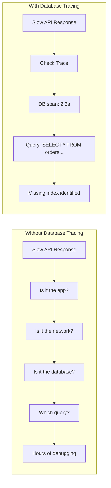

# How to Configure OpenTelemetry for Database Tracing

Author: [nawazdhandala](https://www.github.com/nawazdhandala)

Tags: OpenTelemetry, Database, Tracing, PostgreSQL, MySQL, MongoDB, Redis, Observability, Performance

Description: A comprehensive guide to configuring OpenTelemetry for database tracing, covering automatic instrumentation for SQL and NoSQL databases, query sanitization, and performance optimization.

---

Database queries are often the biggest source of latency in applications. OpenTelemetry's database instrumentation helps you identify slow queries, understand query patterns, and optimize database performance. This guide covers how to configure database tracing across different database types and programming languages.

## Why Trace Database Operations?

Database tracing provides critical insights:



## Database Span Attributes

OpenTelemetry uses semantic conventions for database spans:

| Attribute | Description | Example |
|-----------|-------------|---------|
| `db.system` | Database type | `postgresql`, `mysql`, `mongodb` |
| `db.name` | Database name | `users_db` |
| `db.operation` | Query type | `SELECT`, `INSERT`, `UPDATE` |
| `db.statement` | Query text (sanitized) | `SELECT * FROM users WHERE id = ?` |
| `db.user` | Database username | `app_user` |
| `server.address` | Database host | `db.example.com` |
| `server.port` | Database port | `5432` |

## Node.js Database Instrumentation

### PostgreSQL with pg

```bash
# Install required packages
npm install @opentelemetry/instrumentation-pg pg
```

```typescript
// instrumentation.ts
import { NodeSDK } from '@opentelemetry/sdk-node';
import { PgInstrumentation } from '@opentelemetry/instrumentation-pg';
import { OTLPTraceExporter } from '@opentelemetry/exporter-trace-otlp-http';
import { Resource } from '@opentelemetry/resources';
import { ATTR_SERVICE_NAME } from '@opentelemetry/semantic-conventions';

const resource = new Resource({
  [ATTR_SERVICE_NAME]: 'user-service',
});

const sdk = new NodeSDK({
  resource,
  traceExporter: new OTLPTraceExporter({
    url: process.env.OTEL_EXPORTER_OTLP_ENDPOINT || 'http://localhost:4318/v1/traces',
  }),
  instrumentations: [
    new PgInstrumentation({
      // Enhance span names with the operation type
      enhancedDatabaseReporting: true,

      // Add hook to capture additional information
      responseHook: (span, responseInfo) => {
        // Add row count to span attributes
        if (responseInfo.data?.rowCount !== undefined) {
          span.setAttribute('db.rows_affected', responseInfo.data.rowCount);
        }
      },

      // Request hook for adding custom attributes
      requestHook: (span, queryInfo) => {
        // Add custom attributes based on query
        if (queryInfo.query?.text) {
          // Identify query type for easier filtering
          const queryType = queryInfo.query.text.trim().split(' ')[0].toUpperCase();
          span.setAttribute('db.operation.type', queryType);
        }
      },

      // Control whether to add db.statement (query text)
      // Set to false if you need to hide queries for security
      addSqlCommenterCommentToQueries: true,
    }),
  ],
});

sdk.start();
```

```typescript
// database.ts
import { Pool } from 'pg';
import { trace, SpanStatusCode } from '@opentelemetry/api';

const pool = new Pool({
  host: process.env.DB_HOST || 'localhost',
  port: parseInt(process.env.DB_PORT || '5432'),
  database: process.env.DB_NAME || 'myapp',
  user: process.env.DB_USER || 'postgres',
  password: process.env.DB_PASSWORD,
  max: 20,
  idleTimeoutMillis: 30000,
});

const tracer = trace.getTracer('user-service');

// Example: Get user by ID with automatic tracing
export async function getUserById(id: string) {
  // The query is automatically traced by the instrumentation
  // A span is created with db.statement, db.system, etc.
  const result = await pool.query(
    'SELECT id, name, email, created_at FROM users WHERE id = $1',
    [id]
  );

  return result.rows[0];
}

// Example: Complex query with manual span for business context
export async function getUserOrders(userId: string, limit: number = 10) {
  return tracer.startActiveSpan('get-user-orders', async (span) => {
    span.setAttribute('user.id', userId);
    span.setAttribute('query.limit', limit);

    try {
      // This query will have its own database span as a child
      const result = await pool.query(
        `SELECT o.id, o.total, o.status, o.created_at,
                json_agg(json_build_object('product_id', oi.product_id, 'quantity', oi.quantity)) as items
         FROM orders o
         JOIN order_items oi ON o.id = oi.order_id
         WHERE o.user_id = $1
         GROUP BY o.id
         ORDER BY o.created_at DESC
         LIMIT $2`,
        [userId, limit]
      );

      span.setAttribute('result.count', result.rows.length);
      span.setStatus({ code: SpanStatusCode.OK });

      return result.rows;
    } catch (error: any) {
      span.recordException(error);
      span.setStatus({ code: SpanStatusCode.ERROR, message: error.message });
      throw error;
    } finally {
      span.end();
    }
  });
}
```

### MySQL with mysql2

```bash
npm install @opentelemetry/instrumentation-mysql2 mysql2
```

```typescript
// mysql-instrumentation.ts
import { NodeSDK } from '@opentelemetry/sdk-node';
import { MySQL2Instrumentation } from '@opentelemetry/instrumentation-mysql2';

const sdk = new NodeSDK({
  instrumentations: [
    new MySQL2Instrumentation({
      // Include the query text in spans
      enhancedDatabaseReporting: true,

      responseHook: (span, responseInfo) => {
        // Add affected rows for write operations
        if (responseInfo.response?.affectedRows !== undefined) {
          span.setAttribute('db.rows_affected', responseInfo.response.affectedRows);
        }
      },
    }),
  ],
});

sdk.start();
```

```typescript
// mysql-database.ts
import mysql from 'mysql2/promise';

const pool = mysql.createPool({
  host: process.env.DB_HOST || 'localhost',
  port: parseInt(process.env.DB_PORT || '3306'),
  database: process.env.DB_NAME || 'myapp',
  user: process.env.DB_USER || 'root',
  password: process.env.DB_PASSWORD,
  connectionLimit: 10,
});

// Queries are automatically traced
export async function getProducts(category: string) {
  const [rows] = await pool.execute(
    'SELECT id, name, price, stock FROM products WHERE category = ? AND active = 1',
    [category]
  );
  return rows;
}

// Transactions are traced as well
export async function createOrder(userId: string, items: Array<{ productId: string; quantity: number }>) {
  const connection = await pool.getConnection();

  try {
    await connection.beginTransaction();

    // Each query within the transaction creates a separate span
    const [orderResult] = await connection.execute(
      'INSERT INTO orders (user_id, status, created_at) VALUES (?, ?, NOW())',
      [userId, 'pending']
    );

    const orderId = (orderResult as any).insertId;

    for (const item of items) {
      await connection.execute(
        'INSERT INTO order_items (order_id, product_id, quantity) VALUES (?, ?, ?)',
        [orderId, item.productId, item.quantity]
      );
    }

    await connection.commit();
    return orderId;
  } catch (error) {
    await connection.rollback();
    throw error;
  } finally {
    connection.release();
  }
}
```

### MongoDB

```bash
npm install @opentelemetry/instrumentation-mongodb mongodb
```

```typescript
// mongodb-instrumentation.ts
import { NodeSDK } from '@opentelemetry/sdk-node';
import { MongoDBInstrumentation } from '@opentelemetry/instrumentation-mongodb';

const sdk = new NodeSDK({
  instrumentations: [
    new MongoDBInstrumentation({
      // Enhanced reporting includes command details
      enhancedDatabaseReporting: true,

      // Hook to add custom attributes
      responseHook: (span, responseInfo) => {
        // Add document count for find operations
        if (responseInfo.data?.cursor?.firstBatch) {
          span.setAttribute('db.mongodb.documents_returned',
            responseInfo.data.cursor.firstBatch.length);
        }
      },

      // Add comment to queries for correlation
      dbStatementSerializer: (commandObj) => {
        // Sanitize sensitive data from command
        const sanitized = { ...commandObj };
        if (sanitized.filter) {
          // Replace actual values with placeholders
          sanitized.filter = sanitizeFilter(sanitized.filter);
        }
        return JSON.stringify(sanitized);
      },
    }),
  ],
});

function sanitizeFilter(filter: any): any {
  const sanitized: any = {};
  for (const key of Object.keys(filter)) {
    const value = filter[key];
    if (typeof value === 'object' && value !== null) {
      sanitized[key] = sanitizeFilter(value);
    } else {
      sanitized[key] = '?';
    }
  }
  return sanitized;
}

sdk.start();
```

```typescript
// mongodb-database.ts
import { MongoClient, ObjectId } from 'mongodb';

const client = new MongoClient(process.env.MONGODB_URI || 'mongodb://localhost:27017');
const db = client.db('myapp');

// All MongoDB operations are automatically traced
export async function findUserById(id: string) {
  return db.collection('users').findOne({ _id: new ObjectId(id) });
}

export async function searchProducts(query: string, options: { skip?: number; limit?: number } = {}) {
  return db.collection('products')
    .find({
      $text: { $search: query },
    })
    .skip(options.skip || 0)
    .limit(options.limit || 20)
    .toArray();
}

export async function aggregateOrderStats(userId: string) {
  // Aggregation pipelines are traced with full pipeline details
  return db.collection('orders').aggregate([
    { $match: { userId: new ObjectId(userId) } },
    { $group: {
      _id: '$status',
      count: { $sum: 1 },
      totalAmount: { $sum: '$total' },
    }},
  ]).toArray();
}
```

### Redis

```bash
npm install @opentelemetry/instrumentation-redis-4 redis
```

```typescript
// redis-instrumentation.ts
import { NodeSDK } from '@opentelemetry/sdk-node';
import { RedisInstrumentation } from '@opentelemetry/instrumentation-redis-4';

const sdk = new NodeSDK({
  instrumentations: [
    new RedisInstrumentation({
      // Include command arguments in spans
      dbStatementSerializer: (cmdName, cmdArgs) => {
        // Sanitize sensitive data
        if (['AUTH', 'SET', 'SETEX', 'HSET'].includes(cmdName.toUpperCase())) {
          // Hide values for sensitive commands
          return `${cmdName} ${cmdArgs[0]} [REDACTED]`;
        }
        return `${cmdName} ${cmdArgs.join(' ')}`;
      },

      responseHook: (span, cmdName, cmdArgs, response) => {
        // Add response info
        if (cmdName === 'GET' && response === null) {
          span.setAttribute('cache.hit', false);
        } else if (cmdName === 'GET') {
          span.setAttribute('cache.hit', true);
        }
      },
    }),
  ],
});

sdk.start();
```

```typescript
// redis-cache.ts
import { createClient } from 'redis';
import { trace, SpanStatusCode } from '@opentelemetry/api';

const redis = createClient({
  url: process.env.REDIS_URL || 'redis://localhost:6379',
});

redis.connect();

const tracer = trace.getTracer('cache-service');

// Basic caching with automatic tracing
export async function getCachedUser(userId: string) {
  const cached = await redis.get(`user:${userId}`);
  if (cached) {
    return JSON.parse(cached);
  }
  return null;
}

export async function setCachedUser(userId: string, user: object, ttlSeconds: number = 3600) {
  await redis.setEx(`user:${userId}`, ttlSeconds, JSON.stringify(user));
}

// Cache-aside pattern with business context
export async function getOrFetchUser(userId: string, fetchFn: () => Promise<any>) {
  return tracer.startActiveSpan('cache-aside-user', async (span) => {
    span.setAttribute('user.id', userId);

    // Check cache - this creates a Redis span
    const cached = await redis.get(`user:${userId}`);

    if (cached) {
      span.setAttribute('cache.hit', true);
      span.setStatus({ code: SpanStatusCode.OK });
      span.end();
      return JSON.parse(cached);
    }

    span.setAttribute('cache.hit', false);

    // Fetch from source - this might create database spans
    const user = await fetchFn();

    // Cache the result - this creates another Redis span
    await redis.setEx(`user:${userId}`, 3600, JSON.stringify(user));

    span.setStatus({ code: SpanStatusCode.OK });
    span.end();
    return user;
  });
}
```

## Python Database Instrumentation

### PostgreSQL with psycopg2

```python
# instrumentation.py
from opentelemetry import trace
from opentelemetry.sdk.trace import TracerProvider
from opentelemetry.sdk.trace.export import BatchSpanProcessor
from opentelemetry.exporter.otlp.proto.http.trace_exporter import OTLPSpanExporter
from opentelemetry.instrumentation.psycopg2 import Psycopg2Instrumentor
from opentelemetry.sdk.resources import Resource
import os

def configure_opentelemetry():
    resource = Resource.create({
        "service.name": os.getenv("OTEL_SERVICE_NAME", "python-service"),
    })

    provider = TracerProvider(resource=resource)
    exporter = OTLPSpanExporter(
        endpoint=os.getenv("OTEL_EXPORTER_OTLP_ENDPOINT", "http://localhost:4318/v1/traces"),
    )
    provider.add_span_processor(BatchSpanProcessor(exporter))
    trace.set_tracer_provider(provider)

    # Instrument psycopg2
    Psycopg2Instrumentor().instrument(
        # Enable query text capture
        enable_commenter=True,
        commenter_options={
            "db_driver": True,
            "dbapi_level": True,
            "dbapi_threadsafety": True,
            "driver_paramstyle": True,
        },
    )
```

```python
# database.py
import psycopg2
from psycopg2.extras import RealDictCursor
from opentelemetry import trace
import os

tracer = trace.get_tracer("user-service")

def get_connection():
    return psycopg2.connect(
        host=os.getenv("DB_HOST", "localhost"),
        port=os.getenv("DB_PORT", "5432"),
        database=os.getenv("DB_NAME", "myapp"),
        user=os.getenv("DB_USER", "postgres"),
        password=os.getenv("DB_PASSWORD"),
        cursor_factory=RealDictCursor,
    )

# Queries are automatically traced
def get_user_by_id(user_id: str):
    with get_connection() as conn:
        with conn.cursor() as cur:
            cur.execute(
                "SELECT id, name, email FROM users WHERE id = %s",
                (user_id,)
            )
            return cur.fetchone()

# Complex operation with business context
def get_user_dashboard(user_id: str):
    with tracer.start_as_current_span("get-user-dashboard") as span:
        span.set_attribute("user.id", user_id)

        with get_connection() as conn:
            with conn.cursor() as cur:
                # Each query creates a child span
                cur.execute(
                    "SELECT id, name, email FROM users WHERE id = %s",
                    (user_id,)
                )
                user = cur.fetchone()

                if not user:
                    span.set_status(trace.Status(trace.StatusCode.ERROR, "User not found"))
                    return None

                cur.execute(
                    """SELECT COUNT(*) as order_count, SUM(total) as total_spent
                       FROM orders WHERE user_id = %s""",
                    (user_id,)
                )
                stats = cur.fetchone()

                span.set_attribute("orders.count", stats["order_count"])

                return {
                    "user": user,
                    "stats": stats,
                }
```

### SQLAlchemy

```python
# sqlalchemy_instrumentation.py
from opentelemetry.instrumentation.sqlalchemy import SQLAlchemyInstrumentor
from sqlalchemy import create_engine
from sqlalchemy.orm import sessionmaker
import os

# Configure SQLAlchemy engine
engine = create_engine(
    os.getenv("DATABASE_URL", "postgresql://postgres@localhost/myapp"),
    pool_size=10,
    max_overflow=20,
)

# Instrument SQLAlchemy
SQLAlchemyInstrumentor().instrument(
    engine=engine,
    enable_commenter=True,
)

Session = sessionmaker(bind=engine)

# Usage with ORM
def get_users_with_orders():
    session = Session()
    try:
        # ORM queries are automatically traced
        users = session.query(User).join(Order).filter(
            Order.status == 'completed'
        ).all()
        return users
    finally:
        session.close()
```

## Trace Visualization

Here is how database spans appear in a distributed trace:

```mermaid
gantt
    title Database Trace Timeline
    dateFormat X
    axisFormat %L ms

    section HTTP Handler
    GET /api/users/123    :0, 250

    section Database
    SELECT users          :10, 45
    SELECT orders         :50, 120
    SELECT order_items    :125, 80

    section Redis
    GET user:123:cache    :5, 5
    SET user:123:cache    :210, 10
```

## Query Sanitization

For security, sanitize queries to avoid exposing sensitive data:

```typescript
// query-sanitizer.ts

// Simple sanitizer that replaces values with placeholders
export function sanitizeQuery(query: string): string {
  // Replace string literals
  let sanitized = query.replace(/'[^']*'/g, "'?'");

  // Replace numeric literals
  sanitized = sanitized.replace(/\b\d+\b/g, '?');

  // Replace IN clauses
  sanitized = sanitized.replace(/IN\s*\([^)]+\)/gi, 'IN (?)');

  return sanitized;
}

// Configure instrumentation with sanitization
const pgInstrumentation = new PgInstrumentation({
  requestHook: (span, queryInfo) => {
    if (queryInfo.query?.text) {
      // Use sanitized query for db.statement
      span.setAttribute('db.statement', sanitizeQuery(queryInfo.query.text));
    }
  },
});
```

## Performance Considerations

### Connection Pool Tracing

Add visibility into connection pool behavior:

```typescript
// pool-monitoring.ts
import { Pool } from 'pg';
import { metrics } from '@opentelemetry/api';

const meter = metrics.getMeter('database-service');

// Create metrics for pool monitoring
const poolSize = meter.createObservableGauge('db.pool.size', {
  description: 'Total size of the connection pool',
});

const poolAvailable = meter.createObservableGauge('db.pool.available', {
  description: 'Number of available connections',
});

const poolWaiting = meter.createObservableGauge('db.pool.waiting', {
  description: 'Number of clients waiting for a connection',
});

export function instrumentPool(pool: Pool, poolName: string) {
  // Register observable callbacks
  poolSize.addCallback((result) => {
    result.observe(pool.totalCount, { 'db.pool.name': poolName });
  });

  poolAvailable.addCallback((result) => {
    result.observe(pool.idleCount, { 'db.pool.name': poolName });
  });

  poolWaiting.addCallback((result) => {
    result.observe(pool.waitingCount, { 'db.pool.name': poolName });
  });

  // Listen for pool events
  pool.on('connect', () => {
    console.log(`[${poolName}] New connection established`);
  });

  pool.on('error', (err) => {
    console.error(`[${poolName}] Pool error:`, err);
  });
}
```

### Sampling Strategies

For high-volume database operations, consider sampling:

```typescript
// database-sampler.ts
import {
  Sampler,
  SamplingDecision,
  SamplingResult
} from '@opentelemetry/sdk-trace-base';
import { Attributes, Context, SpanKind } from '@opentelemetry/api';

export class DatabaseAwareSampler implements Sampler {
  private baseSampler: Sampler;

  constructor(baseSampler: Sampler) {
    this.baseSampler = baseSampler;
  }

  shouldSample(
    context: Context,
    traceId: string,
    spanName: string,
    spanKind: SpanKind,
    attributes: Attributes
  ): SamplingResult {
    // Always sample slow queries
    const duration = attributes['db.duration_ms'];
    if (typeof duration === 'number' && duration > 100) {
      return { decision: SamplingDecision.RECORD_AND_SAMPLED };
    }

    // Always sample errors
    const errorType = attributes['error.type'];
    if (errorType) {
      return { decision: SamplingDecision.RECORD_AND_SAMPLED };
    }

    // Sample other database spans at a lower rate
    if (spanName.startsWith('pg.') || spanName.startsWith('mysql.')) {
      if (Math.random() < 0.1) {
        // 10% sampling for DB spans
        return { decision: SamplingDecision.RECORD_AND_SAMPLED };
      }
      return { decision: SamplingDecision.NOT_RECORD };
    }

    // Use base sampler for non-database spans
    return this.baseSampler.shouldSample(context, traceId, spanName, spanKind, attributes);
  }

  toString(): string {
    return 'DatabaseAwareSampler';
  }
}
```

## Collector Configuration

Configure the OpenTelemetry Collector to handle database traces:

```yaml
# otel-collector-config.yaml
receivers:
  otlp:
    protocols:
      http:
        endpoint: 0.0.0.0:4318
      grpc:
        endpoint: 0.0.0.0:4317

processors:
  batch:
    send_batch_size: 512
    timeout: 5s

  # Add latency category attribute
  attributes:
    actions:
      - key: db.latency_category
        action: insert
        from_context: db.duration_ms
        # This would need custom processor logic

  # Filter out noisy spans
  filter:
    spans:
      exclude:
        match_type: regexp
        attributes:
          - key: db.statement
            value: ".*SELECT 1.*"  # Health checks
          - key: db.statement
            value: ".*pg_.*"  # System queries

exporters:
  otlphttp:
    endpoint: "https://oneuptime.com/otlp"
    encoding: json
    headers:
      "x-oneuptime-token": "${ONEUPTIME_TOKEN}"

service:
  pipelines:
    traces:
      receivers: [otlp]
      processors: [batch, attributes, filter]
      exporters: [otlphttp]
```

## Best Practices Summary

1. **Enable automatic instrumentation** for your database libraries
2. **Sanitize query text** to avoid exposing sensitive data
3. **Add business context** with manual spans around database operations
4. **Monitor connection pools** with observable metrics
5. **Sample appropriately** for high-volume workloads
6. **Filter health checks** and system queries at the collector level
7. **Set appropriate timeouts** to detect slow queries
8. **Include row counts** and affected rows in span attributes

With proper database tracing, you can quickly identify:
- Slow queries that need optimization
- N+1 query patterns
- Connection pool exhaustion
- Missing indexes
- Deadlocks and lock contention

This visibility is essential for maintaining performant, reliable applications.
