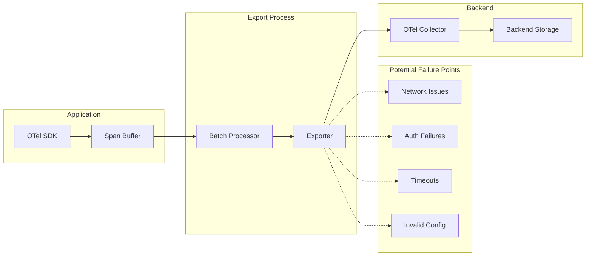
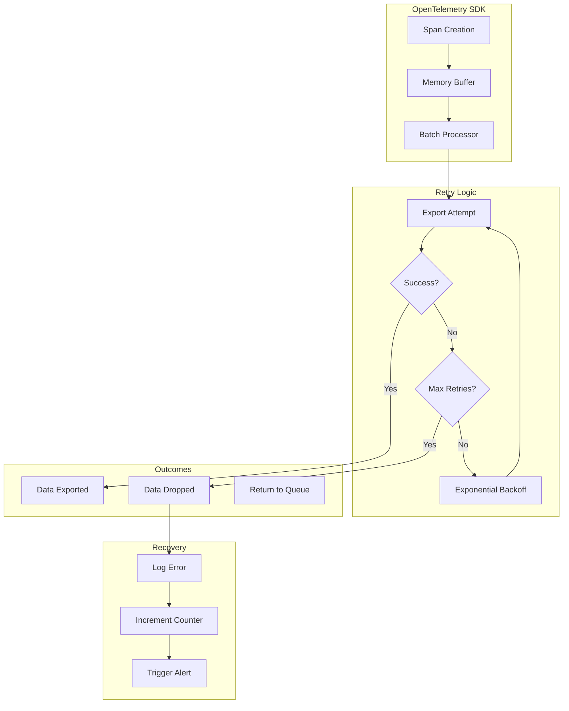

# How to Fix 'Exporter Failed' Errors in OpenTelemetry

Author: [nawazdhandala](https://www.github.com/nawazdhandala)

Tags: OpenTelemetry, Troubleshooting, Exporter, Observability, Debugging, DevOps

Description: Learn how to diagnose and fix common 'Exporter Failed' errors in OpenTelemetry including connection issues, authentication problems, and timeout errors.

---

One of the most frustrating issues when setting up OpenTelemetry is encountering "Exporter Failed" errors. These errors prevent your telemetry data from reaching your observability backend, leaving you blind to what is happening in your applications. In this guide, we will cover the most common causes of exporter failures and how to fix them.

## Understanding Exporter Errors

When an exporter fails, it means that the OpenTelemetry SDK or Collector could not send telemetry data to the configured backend. This can happen at various points in the export pipeline:



## Common Error Messages and Solutions

### Error 1: Connection Refused

```
Error: failed to export traces: connection refused
Export failed: dial tcp 127.0.0.1:4317: connect: connection refused
```

**Cause**: The Collector or backend is not running, not accessible, or listening on a different port.

**Solution**:

```bash
# Step 1: Verify the Collector is running
docker ps | grep otel-collector

# Step 2: Check if the port is listening
netstat -tlnp | grep 4317

# Step 3: Test connectivity
nc -zv localhost 4317

# Step 4: If using Docker, ensure proper network configuration
docker network inspect bridge
```

```yaml
# Fix: Ensure your exporter configuration matches the Collector endpoint
# otel-collector-config.yaml
receivers:
  otlp:
    protocols:
      grpc:
        # Make sure this matches your exporter endpoint
        endpoint: 0.0.0.0:4317
      http:
        endpoint: 0.0.0.0:4318
```

### Error 2: Deadline Exceeded / Timeout

```
Error: failed to export: context deadline exceeded
Error: rpc error: code = DeadlineExceeded desc = context deadline exceeded
```

**Cause**: The export operation took longer than the configured timeout, often due to network latency or overloaded backends.

**Solution**:

```javascript
// Node.js: Increase timeout configuration
const { OTLPTraceExporter } = require('@opentelemetry/exporter-trace-otlp-grpc');

const exporter = new OTLPTraceExporter({
  url: 'http://localhost:4317',
  // Increase timeout from default 10s to 30s
  timeoutMillis: 30000,
});
```

```python
# Python: Configure timeout
from opentelemetry.exporter.otlp.proto.grpc.trace_exporter import OTLPSpanExporter

exporter = OTLPSpanExporter(
    endpoint="http://localhost:4317",
    # Increase timeout to 30 seconds
    timeout=30,
)
```

```yaml
# Collector: Configure exporter timeout
exporters:
  otlp:
    endpoint: "backend.example.com:4317"
    # Increase timeout for slow backends
    timeout: 30s
    # Configure retry settings
    retry_on_failure:
      enabled: true
      initial_interval: 5s
      max_interval: 30s
      max_elapsed_time: 300s
```

### Error 3: Authentication Failed

```
Error: failed to export: Unauthenticated
Error: rpc error: code = Unauthenticated desc = invalid or missing API key
```

**Cause**: Missing or invalid authentication credentials.

**Solution**:

```javascript
// Node.js: Add authentication headers
const { OTLPTraceExporter } = require('@opentelemetry/exporter-trace-otlp-grpc');
const grpc = require('@grpc/grpc-js');

// Create metadata with authentication
const metadata = new grpc.Metadata();
metadata.set('x-api-key', process.env.OTEL_API_KEY);

const exporter = new OTLPTraceExporter({
  url: 'https://ingest.example.com:4317',
  metadata: metadata,
});
```

```python
# Python: Add authentication headers
from opentelemetry.exporter.otlp.proto.grpc.trace_exporter import OTLPSpanExporter

exporter = OTLPSpanExporter(
    endpoint="https://ingest.example.com:4317",
    # Add authentication headers
    headers={
        "x-api-key": os.environ.get("OTEL_API_KEY"),
        "Authorization": f"Bearer {os.environ.get('OTEL_BEARER_TOKEN')}"
    },
)
```

```yaml
# Collector: Configure authentication
exporters:
  otlp:
    endpoint: "https://ingest.oneuptime.com:443"
    headers:
      # Use environment variable substitution
      x-oneuptime-token: "${ONEUPTIME_API_TOKEN}"
    tls:
      insecure: false
```

### Error 4: TLS/SSL Certificate Errors

```
Error: failed to export: certificate signed by unknown authority
Error: x509: certificate verify failed
```

**Cause**: The exporter cannot verify the backend's TLS certificate.

**Solution**:

```javascript
// Node.js: Configure TLS options
const { OTLPTraceExporter } = require('@opentelemetry/exporter-trace-otlp-grpc');
const grpc = require('@grpc/grpc-js');
const fs = require('fs');

// Option 1: Use custom CA certificate
const rootCert = fs.readFileSync('/path/to/ca.pem');
const credentials = grpc.credentials.createSsl(rootCert);

const exporter = new OTLPTraceExporter({
  url: 'https://collector.example.com:4317',
  credentials: credentials,
});

// Option 2: Skip verification (NOT recommended for production)
const exporter = new OTLPTraceExporter({
  url: 'https://collector.example.com:4317',
  credentials: grpc.credentials.createSsl(null, null, null, {
    checkServerIdentity: () => undefined,
  }),
});
```

```yaml
# Collector: Configure TLS
exporters:
  otlp:
    endpoint: "backend.example.com:4317"
    tls:
      # Option 1: Provide CA certificate
      ca_file: /etc/ssl/certs/ca.pem

      # Option 2: Skip verification (NOT for production)
      # insecure_skip_verify: true

      # Option 3: Completely disable TLS
      # insecure: true
```

### Error 5: Resource Exhausted

```
Error: failed to export: ResourceExhausted
Error: rpc error: code = ResourceExhausted desc = received message larger than max
```

**Cause**: The payload is too large or the backend is rate limiting.

**Solution**:

```yaml
# Collector: Configure batch processor to reduce payload size
processors:
  batch:
    # Reduce batch size
    send_batch_size: 1000
    send_batch_max_size: 2000
    # Send more frequently
    timeout: 5s
```

```javascript
// Node.js: Configure batch processor
const { BatchSpanProcessor } = require('@opentelemetry/sdk-trace-base');

const processor = new BatchSpanProcessor(exporter, {
  // Maximum number of spans per batch
  maxExportBatchSize: 512,
  // Maximum queue size
  maxQueueSize: 2048,
  // Export interval in milliseconds
  scheduledDelayMillis: 5000,
  // Timeout for export
  exportTimeoutMillis: 30000,
});
```

### Error 6: Invalid Endpoint Format

```
Error: failed to create exporter: invalid endpoint
Error: parse error: invalid URL
```

**Cause**: The endpoint URL is malformed or missing required components.

**Solution**:

```javascript
// Correct endpoint formats for different exporters

// gRPC exporter - no protocol prefix needed
const grpcExporter = new OTLPTraceExporter({
  url: 'localhost:4317',  // Correct
  // url: 'http://localhost:4317',  // Also works
  // url: 'grpc://localhost:4317',  // WRONG
});

// HTTP exporter - requires full URL
const httpExporter = new OTLPTraceExporter({
  url: 'http://localhost:4318/v1/traces',  // Correct for HTTP
});
```

```yaml
# Collector endpoint formats
exporters:
  # gRPC exporter
  otlp/grpc:
    endpoint: "collector.example.com:4317"  # No protocol prefix

  # HTTP exporter
  otlp/http:
    endpoint: "http://collector.example.com:4318"  # Full URL required
```

## Diagnostic Tools and Techniques

### Enable Debug Logging

```bash
# Environment variable to enable debug logging
export OTEL_LOG_LEVEL=debug

# For Java agent
export OTEL_JAVAAGENT_DEBUG=true

# For Python
export OTEL_PYTHON_LOG_LEVEL=debug
```

### Use the Debug Exporter

```yaml
# Add debug exporter to see what data is being exported
exporters:
  debug:
    verbosity: detailed
    sampling_initial: 5
    sampling_thereafter: 200

service:
  pipelines:
    traces:
      receivers: [otlp]
      processors: [batch]
      # Add debug alongside your primary exporter
      exporters: [otlp, debug]
```

### Test Connectivity with grpcurl

```bash
# Install grpcurl
brew install grpcurl  # macOS
# or
go install github.com/fullstorydev/grpcurl/cmd/grpcurl@latest

# Test gRPC connectivity
grpcurl -plaintext localhost:4317 list

# Test with reflection
grpcurl -plaintext localhost:4317 describe

# Send a health check
grpcurl -plaintext localhost:4317 grpc.health.v1.Health/Check
```

### Monitor Collector Metrics

```bash
# Check Collector internal metrics
curl http://localhost:8888/metrics | grep otelcol

# Look for these key metrics:
# otelcol_exporter_sent_spans - successfully exported spans
# otelcol_exporter_send_failed_spans - failed span exports
# otelcol_exporter_queue_size - current queue size
```

## Error Recovery Architecture



## Implementing Robust Error Handling

### Node.js Implementation

```javascript
// robust-exporter.js
// Implement custom error handling for exports

const { OTLPTraceExporter } = require('@opentelemetry/exporter-trace-otlp-grpc');
const { BatchSpanProcessor } = require('@opentelemetry/sdk-trace-base');

class RobustExporter {
  constructor(options) {
    this.primaryExporter = new OTLPTraceExporter({
      url: options.primaryEndpoint,
      timeoutMillis: 30000,
    });

    // Optional: Configure a fallback exporter
    this.fallbackExporter = options.fallbackEndpoint
      ? new OTLPTraceExporter({
          url: options.fallbackEndpoint,
          timeoutMillis: 30000,
        })
      : null;

    this.exportFailures = 0;
    this.maxConsecutiveFailures = 5;
  }

  async export(spans, resultCallback) {
    try {
      // Try primary exporter first
      await this.exportWithRetry(this.primaryExporter, spans);
      this.exportFailures = 0;
      resultCallback({ code: 0 });
    } catch (primaryError) {
      console.error('Primary export failed:', primaryError.message);
      this.exportFailures++;

      // Try fallback if available
      if (this.fallbackExporter && this.exportFailures >= this.maxConsecutiveFailures) {
        try {
          await this.exportWithRetry(this.fallbackExporter, spans);
          console.log('Fallback export succeeded');
          resultCallback({ code: 0 });
          return;
        } catch (fallbackError) {
          console.error('Fallback export also failed:', fallbackError.message);
        }
      }

      resultCallback({
        code: 1,
        error: primaryError
      });
    }
  }

  async exportWithRetry(exporter, spans, maxRetries = 3) {
    let lastError;

    for (let attempt = 1; attempt <= maxRetries; attempt++) {
      try {
        return await new Promise((resolve, reject) => {
          exporter.export(spans, (result) => {
            if (result.code === 0) {
              resolve(result);
            } else {
              reject(result.error || new Error('Export failed'));
            }
          });
        });
      } catch (error) {
        lastError = error;
        console.warn(`Export attempt ${attempt}/${maxRetries} failed: ${error.message}`);

        if (attempt < maxRetries) {
          // Exponential backoff: 1s, 2s, 4s
          const delay = Math.pow(2, attempt - 1) * 1000;
          await new Promise(resolve => setTimeout(resolve, delay));
        }
      }
    }

    throw lastError;
  }

  shutdown() {
    return Promise.all([
      this.primaryExporter.shutdown(),
      this.fallbackExporter?.shutdown(),
    ].filter(Boolean));
  }
}

module.exports = { RobustExporter };
```

### Python Implementation

```python
# robust_exporter.py
# Implement custom error handling for exports

import time
import logging
from typing import Optional
from opentelemetry.sdk.trace.export import SpanExporter, SpanExportResult
from opentelemetry.exporter.otlp.proto.grpc.trace_exporter import OTLPSpanExporter

logger = logging.getLogger(__name__)

class RobustSpanExporter(SpanExporter):
    """
    A wrapper exporter that provides retry logic and fallback support.
    """

    def __init__(
        self,
        primary_endpoint: str,
        fallback_endpoint: Optional[str] = None,
        max_retries: int = 3,
        max_consecutive_failures: int = 5,
    ):
        # Initialize primary exporter
        self.primary_exporter = OTLPSpanExporter(
            endpoint=primary_endpoint,
            timeout=30,
        )

        # Initialize fallback exporter if provided
        self.fallback_exporter = None
        if fallback_endpoint:
            self.fallback_exporter = OTLPSpanExporter(
                endpoint=fallback_endpoint,
                timeout=30,
            )

        self.max_retries = max_retries
        self.max_consecutive_failures = max_consecutive_failures
        self.consecutive_failures = 0

    def export(self, spans) -> SpanExportResult:
        """
        Export spans with retry logic and optional fallback.
        """
        # Try primary exporter
        result = self._export_with_retry(self.primary_exporter, spans)

        if result == SpanExportResult.SUCCESS:
            self.consecutive_failures = 0
            return result

        # Primary failed
        self.consecutive_failures += 1
        logger.warning(
            f"Primary export failed. Consecutive failures: {self.consecutive_failures}"
        )

        # Try fallback if available and threshold reached
        if (
            self.fallback_exporter
            and self.consecutive_failures >= self.max_consecutive_failures
        ):
            logger.info("Attempting fallback exporter")
            fallback_result = self._export_with_retry(
                self.fallback_exporter,
                spans
            )

            if fallback_result == SpanExportResult.SUCCESS:
                logger.info("Fallback export succeeded")
                return fallback_result

        return SpanExportResult.FAILURE

    def _export_with_retry(self, exporter, spans) -> SpanExportResult:
        """
        Export with exponential backoff retry.
        """
        last_exception = None

        for attempt in range(1, self.max_retries + 1):
            try:
                result = exporter.export(spans)
                if result == SpanExportResult.SUCCESS:
                    return result
            except Exception as e:
                last_exception = e
                logger.warning(
                    f"Export attempt {attempt}/{self.max_retries} failed: {e}"
                )

            if attempt < self.max_retries:
                # Exponential backoff: 1s, 2s, 4s
                delay = (2 ** (attempt - 1))
                time.sleep(delay)

        if last_exception:
            logger.error(f"All export attempts failed: {last_exception}")

        return SpanExportResult.FAILURE

    def shutdown(self) -> None:
        """
        Shutdown all exporters.
        """
        self.primary_exporter.shutdown()
        if self.fallback_exporter:
            self.fallback_exporter.shutdown()

    def force_flush(self, timeout_millis: int = 30000) -> bool:
        """
        Force flush all pending spans.
        """
        primary_flushed = self.primary_exporter.force_flush(timeout_millis)
        fallback_flushed = True
        if self.fallback_exporter:
            fallback_flushed = self.fallback_exporter.force_flush(timeout_millis)
        return primary_flushed and fallback_flushed
```

## Checklist for Troubleshooting Export Failures

Use this checklist when debugging exporter issues:

1. **Verify Collector/Backend Status**
   - Is the Collector running?
   - Is the endpoint accessible from your application?
   - Are the correct ports open?

2. **Check Configuration**
   - Is the endpoint URL correctly formatted?
   - Are authentication credentials present and valid?
   - Is TLS configured correctly?

3. **Review Network**
   - Can you ping the endpoint?
   - Are there any firewalls blocking traffic?
   - Is DNS resolving correctly?

4. **Examine Logs**
   - Enable debug logging
   - Look for specific error codes
   - Check Collector logs for incoming requests

5. **Test Incrementally**
   - Start with debug exporter only
   - Add one exporter at a time
   - Use simple configuration first

## Summary

Exporter failures in OpenTelemetry can be caused by various issues including network problems, authentication failures, timeouts, and configuration errors. By understanding the common error messages and their solutions, you can quickly diagnose and fix these issues. Remember to:

- Always enable debug logging when troubleshooting
- Use the debug exporter to verify data is being generated
- Test connectivity before deploying to production
- Implement robust error handling with retries and fallbacks

**Related Reading:**

- [How to Set Up OpenTelemetry Collector for Traces](https://oneuptime.com/blog/post/2026-01-24-opentelemetry-collector-traces-setup/view)
- [How to Fix "Collector Connection Refused" Errors](https://oneuptime.com/blog/post/2026-01-24-opentelemetry-collector-connection-refused/view)
- [How to Handle Span Context Propagation in OpenTelemetry](https://oneuptime.com/blog/post/2026-01-24-opentelemetry-span-context-propagation/view)
