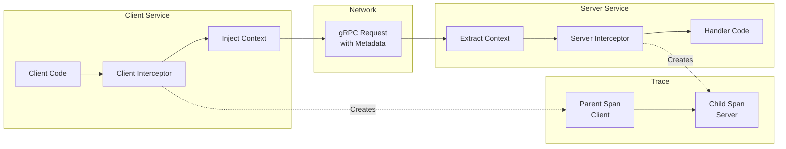
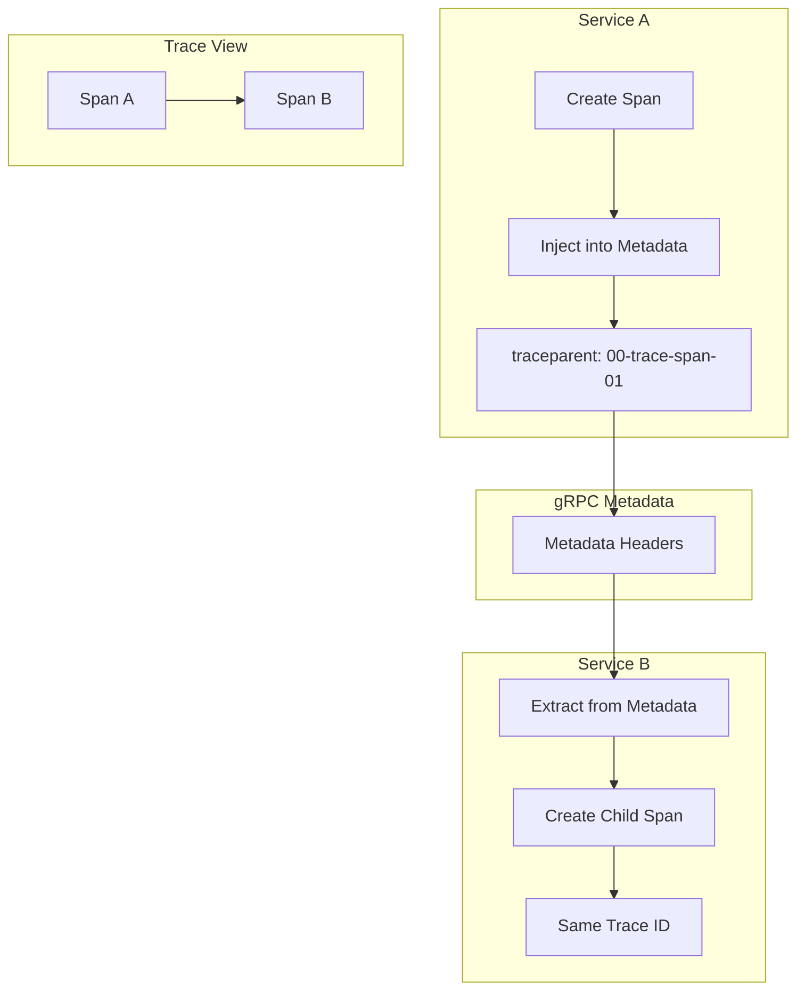

# How to Configure OpenTelemetry for gRPC Services

Author: [nawazdhandala](https://www.github.com/nawazdhandala)

Tags: OpenTelemetry, gRPC, Observability, Tracing, Microservices, Distributed Tracing, Go, Python, Java

Description: A comprehensive guide to setting up OpenTelemetry instrumentation for gRPC services, including automatic and manual instrumentation, context propagation, and best practices.

---

> gRPC is a popular choice for microservices communication due to its efficiency and strong typing. Properly instrumenting gRPC services with OpenTelemetry gives you visibility into service-to-service calls, latency patterns, and error rates. This guide covers everything you need to know about setting up OpenTelemetry for gRPC.

Understanding how traces flow through gRPC interceptors and how context propagates between services is essential for building observable distributed systems.

---

## Understanding gRPC and OpenTelemetry Integration



### Key Concepts

| Concept | Description |
|---------|-------------|
| Interceptor | Middleware that wraps gRPC calls for instrumentation |
| Metadata | gRPC headers used for context propagation |
| Propagator | Serializes/deserializes trace context |
| Span Kind | CLIENT for outgoing calls, SERVER for incoming calls |

---

## Automatic Instrumentation

### Python with grpcio

```python
# Install required packages:
# pip install opentelemetry-instrumentation-grpc
# pip install opentelemetry-exporter-otlp
# pip install grpcio

from opentelemetry import trace
from opentelemetry.sdk.trace import TracerProvider
from opentelemetry.sdk.trace.export import BatchSpanProcessor
from opentelemetry.exporter.otlp.proto.grpc.trace_exporter import OTLPSpanExporter
from opentelemetry.instrumentation.grpc import GrpcInstrumentorClient, GrpcInstrumentorServer
from opentelemetry.sdk.resources import Resource, SERVICE_NAME

# Configure the tracer provider with service information
resource = Resource.create({
    SERVICE_NAME: "my-grpc-service",
    "service.version": "1.0.0",
})

provider = TracerProvider(resource=resource)

# Configure the OTLP exporter
exporter = OTLPSpanExporter(
    endpoint="http://otel-collector:4317",
    insecure=True
)

# Add batch processor for efficient export
provider.add_span_processor(BatchSpanProcessor(exporter))
trace.set_tracer_provider(provider)

# Instrument gRPC client calls automatically
# This wraps all outgoing gRPC calls with tracing
GrpcInstrumentorClient().instrument()

# Instrument gRPC server handlers automatically
# This wraps all incoming gRPC requests with tracing
GrpcInstrumentorServer().instrument()
```

### Node.js with grpc-js

```javascript
// Install required packages:
// npm install @opentelemetry/instrumentation-grpc
// npm install @opentelemetry/exporter-trace-otlp-grpc
// npm install @grpc/grpc-js

const { NodeTracerProvider } = require('@opentelemetry/sdk-trace-node');
const { BatchSpanProcessor } = require('@opentelemetry/sdk-trace-base');
const { OTLPTraceExporter } = require('@opentelemetry/exporter-trace-otlp-grpc');
const { GrpcInstrumentation } = require('@opentelemetry/instrumentation-grpc');
const { registerInstrumentations } = require('@opentelemetry/instrumentation');
const { Resource } = require('@opentelemetry/resources');
const { SemanticResourceAttributes } = require('@opentelemetry/semantic-conventions');

// Create resource with service information
const resource = new Resource({
  [SemanticResourceAttributes.SERVICE_NAME]: 'my-grpc-service',
  [SemanticResourceAttributes.SERVICE_VERSION]: '1.0.0',
});

// Configure the tracer provider
const provider = new NodeTracerProvider({ resource });

// Configure the OTLP exporter
const exporter = new OTLPTraceExporter({
  url: 'http://otel-collector:4317',
});

// Add batch processor
provider.addSpanProcessor(new BatchSpanProcessor(exporter));
provider.register();

// Register gRPC instrumentation
// This automatically instruments both client and server calls
registerInstrumentations({
  instrumentations: [
    new GrpcInstrumentation({
      // Capture metadata as span attributes
      ignoreGrpcMethods: [], // Instrument all methods
    }),
  ],
});

// Now create your gRPC client/server as normal
const grpc = require('@grpc/grpc-js');
```

### Go with otelgrpc

```go
package main

import (
    "context"
    "log"

    "go.opentelemetry.io/contrib/instrumentation/google.golang.org/grpc/otelgrpc"
    "go.opentelemetry.io/otel"
    "go.opentelemetry.io/otel/exporters/otlp/otlptrace/otlptracegrpc"
    "go.opentelemetry.io/otel/sdk/resource"
    sdktrace "go.opentelemetry.io/otel/sdk/trace"
    semconv "go.opentelemetry.io/otel/semconv/v1.21.0"
    "google.golang.org/grpc"
    "google.golang.org/grpc/credentials/insecure"
)

func initTracer() (*sdktrace.TracerProvider, error) {
    ctx := context.Background()

    // Create OTLP exporter
    exporter, err := otlptracegrpc.New(ctx,
        otlptracegrpc.WithEndpoint("otel-collector:4317"),
        otlptracegrpc.WithInsecure(),
    )
    if err != nil {
        return nil, err
    }

    // Create resource with service information
    res, err := resource.New(ctx,
        resource.WithAttributes(
            semconv.ServiceName("my-grpc-service"),
            semconv.ServiceVersion("1.0.0"),
        ),
    )
    if err != nil {
        return nil, err
    }

    // Create tracer provider
    tp := sdktrace.NewTracerProvider(
        sdktrace.WithBatcher(exporter),
        sdktrace.WithResource(res),
    )

    otel.SetTracerProvider(tp)
    return tp, nil
}

func main() {
    // Initialize tracer
    tp, err := initTracer()
    if err != nil {
        log.Fatal(err)
    }
    defer tp.Shutdown(context.Background())

    // Create gRPC server with OpenTelemetry interceptors
    server := grpc.NewServer(
        // Add unary interceptor for single request/response calls
        grpc.UnaryInterceptor(otelgrpc.UnaryServerInterceptor()),
        // Add stream interceptor for streaming calls
        grpc.StreamInterceptor(otelgrpc.StreamServerInterceptor()),
    )

    // Create gRPC client with OpenTelemetry interceptors
    conn, err := grpc.Dial("target-service:50051",
        grpc.WithTransportCredentials(insecure.NewCredentials()),
        // Add client interceptors
        grpc.WithUnaryInterceptor(otelgrpc.UnaryClientInterceptor()),
        grpc.WithStreamInterceptor(otelgrpc.StreamClientInterceptor()),
    )
    if err != nil {
        log.Fatal(err)
    }
    defer conn.Close()
}
```

### Java with opentelemetry-grpc

```java
// Add dependencies to build.gradle:
// implementation 'io.opentelemetry.instrumentation:opentelemetry-grpc-1.6:1.32.0-alpha'
// implementation 'io.opentelemetry:opentelemetry-exporter-otlp:1.32.0'

import io.grpc.ManagedChannel;
import io.grpc.ManagedChannelBuilder;
import io.grpc.Server;
import io.grpc.ServerBuilder;
import io.opentelemetry.api.OpenTelemetry;
import io.opentelemetry.api.trace.Tracer;
import io.opentelemetry.exporter.otlp.trace.OtlpGrpcSpanExporter;
import io.opentelemetry.instrumentation.grpc.v1_6.GrpcTelemetry;
import io.opentelemetry.sdk.OpenTelemetrySdk;
import io.opentelemetry.sdk.resources.Resource;
import io.opentelemetry.sdk.trace.SdkTracerProvider;
import io.opentelemetry.sdk.trace.export.BatchSpanProcessor;
import io.opentelemetry.semconv.ResourceAttributes;

public class GrpcOpenTelemetrySetup {

    public static OpenTelemetry initOpenTelemetry() {
        // Create OTLP exporter
        OtlpGrpcSpanExporter exporter = OtlpGrpcSpanExporter.builder()
            .setEndpoint("http://otel-collector:4317")
            .build();

        // Create resource with service information
        Resource resource = Resource.getDefault()
            .merge(Resource.create(io.opentelemetry.api.common.Attributes.of(
                ResourceAttributes.SERVICE_NAME, "my-grpc-service",
                ResourceAttributes.SERVICE_VERSION, "1.0.0"
            )));

        // Create tracer provider
        SdkTracerProvider tracerProvider = SdkTracerProvider.builder()
            .addSpanProcessor(BatchSpanProcessor.builder(exporter).build())
            .setResource(resource)
            .build();

        return OpenTelemetrySdk.builder()
            .setTracerProvider(tracerProvider)
            .buildAndRegisterGlobal();
    }

    public static void main(String[] args) throws Exception {
        OpenTelemetry openTelemetry = initOpenTelemetry();

        // Create gRPC telemetry instance
        GrpcTelemetry grpcTelemetry = GrpcTelemetry.create(openTelemetry);

        // Create server with interceptors
        Server server = ServerBuilder.forPort(50051)
            .intercept(grpcTelemetry.newServerInterceptor())
            .addService(new MyServiceImpl())
            .build();

        // Create client with interceptors
        ManagedChannel channel = ManagedChannelBuilder
            .forAddress("target-service", 50051)
            .usePlaintext()
            .intercept(grpcTelemetry.newClientInterceptor())
            .build();
    }
}
```

---

## Manual Instrumentation

### Creating Custom Spans in gRPC Handlers

```python
import grpc
from opentelemetry import trace
from opentelemetry.trace import Status, StatusCode

# Get the tracer for creating custom spans
tracer = trace.get_tracer(__name__)

class UserServiceServicer(user_pb2_grpc.UserServiceServicer):
    """gRPC service implementation with manual instrumentation."""

    def GetUser(self, request, context):
        # The parent span is automatically created by the gRPC instrumentation
        # Get the current span to add attributes
        current_span = trace.get_current_span()

        # Add custom attributes to the span
        current_span.set_attribute("user.id", request.user_id)
        current_span.set_attribute("rpc.request_size", request.ByteSize())

        # Create a child span for database operations
        with tracer.start_as_current_span("database.get_user") as db_span:
            db_span.set_attribute("db.system", "postgresql")
            db_span.set_attribute("db.operation", "SELECT")
            db_span.set_attribute("db.table", "users")

            try:
                user = self.db.get_user(request.user_id)

                if user is None:
                    # Record not found error
                    current_span.set_status(Status(StatusCode.ERROR, "User not found"))
                    context.set_code(grpc.StatusCode.NOT_FOUND)
                    context.set_details(f"User {request.user_id} not found")
                    return user_pb2.GetUserResponse()

                # Add response information
                current_span.set_attribute("user.found", True)
                return user_pb2.GetUserResponse(user=user)

            except Exception as e:
                # Record the exception in the span
                current_span.record_exception(e)
                current_span.set_status(Status(StatusCode.ERROR, str(e)))
                context.set_code(grpc.StatusCode.INTERNAL)
                context.set_details(str(e))
                raise
```

### Custom Client-Side Instrumentation

```go
package main

import (
    "context"

    "go.opentelemetry.io/otel"
    "go.opentelemetry.io/otel/attribute"
    "go.opentelemetry.io/otel/codes"
    "go.opentelemetry.io/otel/trace"
    "google.golang.org/grpc"
    "google.golang.org/grpc/metadata"
)

var tracer = otel.Tracer("grpc-client")

// MakeUserRequest demonstrates manual client-side instrumentation
func MakeUserRequest(ctx context.Context, client UserServiceClient, userID string) (*User, error) {
    // Start a span for the entire operation
    ctx, span := tracer.Start(ctx, "GetUser",
        trace.WithSpanKind(trace.SpanKindClient),
        trace.WithAttributes(
            attribute.String("rpc.system", "grpc"),
            attribute.String("rpc.service", "UserService"),
            attribute.String("rpc.method", "GetUser"),
            attribute.String("user.id", userID),
        ),
    )
    defer span.End()

    // Create the request
    req := &GetUserRequest{UserId: userID}

    // Add custom metadata that will be propagated
    ctx = metadata.AppendToOutgoingContext(ctx,
        "x-request-id", generateRequestID(),
        "x-client-version", "1.0.0",
    )

    // Make the gRPC call
    resp, err := client.GetUser(ctx, req)
    if err != nil {
        // Record the error in the span
        span.RecordError(err)
        span.SetStatus(codes.Error, err.Error())
        return nil, err
    }

    // Record success
    span.SetStatus(codes.Ok, "")
    span.SetAttributes(
        attribute.Bool("user.found", resp.User != nil),
    )

    return resp.User, nil
}
```

---

## Context Propagation



### Configuring Propagators

```python
from opentelemetry import trace
from opentelemetry.propagate import set_global_textmap
from opentelemetry.propagators.composite import CompositePropagator
from opentelemetry.propagators.b3 import B3MultiFormat
from opentelemetry.trace.propagation.tracecontext import TraceContextTextMapPropagator
from opentelemetry.baggage.propagation import W3CBaggagePropagator

# Configure multiple propagators for compatibility with different systems
# W3C TraceContext is the standard, B3 is used by Zipkin
propagator = CompositePropagator([
    TraceContextTextMapPropagator(),  # W3C standard
    W3CBaggagePropagator(),           # For baggage propagation
    B3MultiFormat(),                   # Zipkin compatibility
])

set_global_textmap(propagator)
```

### Manual Context Propagation in gRPC

```javascript
const { context, propagation, trace } = require('@opentelemetry/api');
const grpc = require('@grpc/grpc-js');

// Client-side: Inject context into metadata
function createTracedMetadata() {
  const metadata = new grpc.Metadata();

  // Inject the current context into metadata
  propagation.inject(context.active(), metadata, {
    set: (carrier, key, value) => {
      carrier.set(key, value);
    },
  });

  return metadata;
}

// Server-side: Extract context from metadata
function extractContextFromMetadata(metadata) {
  return propagation.extract(context.active(), metadata, {
    get: (carrier, key) => {
      const values = carrier.get(key);
      return values && values.length > 0 ? values[0] : undefined;
    },
    keys: (carrier) => {
      return carrier.getMap ? Object.keys(carrier.getMap()) : [];
    },
  });
}

// Example usage in a gRPC client
async function callRemoteService(client, request) {
  const tracer = trace.getTracer('grpc-client');

  return tracer.startActiveSpan('RemoteService.DoSomething', async (span) => {
    try {
      const metadata = createTracedMetadata();

      return await new Promise((resolve, reject) => {
        client.doSomething(request, metadata, (err, response) => {
          if (err) {
            span.recordException(err);
            span.setStatus({ code: 2, message: err.message });
            reject(err);
          } else {
            span.setStatus({ code: 1 });
            resolve(response);
          }
        });
      });
    } finally {
      span.end();
    }
  });
}
```

---

## Streaming RPCs

### Instrumenting Server Streaming

```python
import grpc
from opentelemetry import trace

tracer = trace.get_tracer(__name__)

class StreamingServiceServicer(streaming_pb2_grpc.StreamingServiceServicer):
    """Service with instrumented streaming RPC."""

    def ListItems(self, request, context):
        """Server streaming RPC that sends multiple responses."""

        # Get the current span created by gRPC instrumentation
        current_span = trace.get_current_span()
        current_span.set_attribute("stream.type", "server")
        current_span.set_attribute("stream.request.page_size", request.page_size)

        items_sent = 0

        try:
            # Query database for items
            with tracer.start_as_current_span("database.query_items") as db_span:
                db_span.set_attribute("db.system", "postgresql")
                items = self.db.query_items(request.filter)

            # Stream items back to client
            for item in items:
                # Create a span for each item sent (optional, may be too granular)
                with tracer.start_as_current_span("stream.send_item") as send_span:
                    send_span.set_attribute("item.id", item.id)
                    yield streaming_pb2.Item(id=item.id, name=item.name)
                    items_sent += 1

            # Record total items sent
            current_span.set_attribute("stream.items_sent", items_sent)

        except Exception as e:
            current_span.record_exception(e)
            current_span.set_status(trace.Status(trace.StatusCode.ERROR, str(e)))
            context.abort(grpc.StatusCode.INTERNAL, str(e))
```

### Instrumenting Bidirectional Streaming

```go
package main

import (
    "context"
    "io"

    "go.opentelemetry.io/otel"
    "go.opentelemetry.io/otel/attribute"
    "go.opentelemetry.io/otel/trace"
)

var tracer = otel.Tracer("streaming-service")

type streamingServer struct {
    pb.UnimplementedChatServiceServer
}

// Chat handles bidirectional streaming
func (s *streamingServer) Chat(stream pb.ChatService_ChatServer) error {
    ctx := stream.Context()

    // Start a span for the entire stream
    ctx, span := tracer.Start(ctx, "ChatService.Chat",
        trace.WithSpanKind(trace.SpanKindServer),
        trace.WithAttributes(
            attribute.String("stream.type", "bidirectional"),
        ),
    )
    defer span.End()

    messagesSent := 0
    messagesReceived := 0

    for {
        // Receive message from client
        msg, err := stream.Recv()
        if err == io.EOF {
            // Client closed the stream
            span.SetAttributes(
                attribute.Int("stream.messages_received", messagesReceived),
                attribute.Int("stream.messages_sent", messagesSent),
            )
            return nil
        }
        if err != nil {
            span.RecordError(err)
            return err
        }

        messagesReceived++

        // Create a span for processing each message
        _, processSpan := tracer.Start(ctx, "process_message",
            trace.WithAttributes(
                attribute.String("message.id", msg.Id),
                attribute.Int("message.sequence", messagesReceived),
            ),
        )

        // Process the message
        response := s.processMessage(msg)

        processSpan.End()

        // Send response
        if err := stream.Send(response); err != nil {
            span.RecordError(err)
            return err
        }
        messagesSent++
    }
}
```

---

## Error Handling and Status Codes

### Mapping gRPC Status to Span Status

```python
import grpc
from opentelemetry import trace
from opentelemetry.trace import StatusCode

# Mapping of gRPC status codes to OpenTelemetry status codes
GRPC_TO_OTEL_STATUS = {
    grpc.StatusCode.OK: StatusCode.OK,
    grpc.StatusCode.CANCELLED: StatusCode.ERROR,
    grpc.StatusCode.UNKNOWN: StatusCode.ERROR,
    grpc.StatusCode.INVALID_ARGUMENT: StatusCode.ERROR,
    grpc.StatusCode.DEADLINE_EXCEEDED: StatusCode.ERROR,
    grpc.StatusCode.NOT_FOUND: StatusCode.ERROR,
    grpc.StatusCode.ALREADY_EXISTS: StatusCode.ERROR,
    grpc.StatusCode.PERMISSION_DENIED: StatusCode.ERROR,
    grpc.StatusCode.RESOURCE_EXHAUSTED: StatusCode.ERROR,
    grpc.StatusCode.FAILED_PRECONDITION: StatusCode.ERROR,
    grpc.StatusCode.ABORTED: StatusCode.ERROR,
    grpc.StatusCode.OUT_OF_RANGE: StatusCode.ERROR,
    grpc.StatusCode.UNIMPLEMENTED: StatusCode.ERROR,
    grpc.StatusCode.INTERNAL: StatusCode.ERROR,
    grpc.StatusCode.UNAVAILABLE: StatusCode.ERROR,
    grpc.StatusCode.DATA_LOSS: StatusCode.ERROR,
    grpc.StatusCode.UNAUTHENTICATED: StatusCode.ERROR,
}

def handle_grpc_error(span, context, grpc_code, message):
    """Helper to properly record gRPC errors in spans."""

    # Set the span status
    otel_status = GRPC_TO_OTEL_STATUS.get(grpc_code, StatusCode.ERROR)
    span.set_status(trace.Status(otel_status, message))

    # Add gRPC-specific attributes
    span.set_attribute("rpc.grpc.status_code", grpc_code.value[0])
    span.set_attribute("rpc.grpc.status_text", grpc_code.name)

    # Set the gRPC context
    context.set_code(grpc_code)
    context.set_details(message)
```

---

## Semantic Conventions

### Standard Attributes for gRPC Spans

```python
from opentelemetry import trace
from opentelemetry.semconv.trace import SpanAttributes

tracer = trace.get_tracer(__name__)

def create_grpc_client_span(service, method, server_address, server_port):
    """Create a properly attributed gRPC client span."""

    return tracer.start_span(
        f"{service}/{method}",
        kind=trace.SpanKind.CLIENT,
        attributes={
            # RPC attributes (required)
            SpanAttributes.RPC_SYSTEM: "grpc",
            SpanAttributes.RPC_SERVICE: service,
            SpanAttributes.RPC_METHOD: method,

            # Network attributes
            SpanAttributes.NET_PEER_NAME: server_address,
            SpanAttributes.NET_PEER_PORT: server_port,

            # gRPC-specific attributes
            "rpc.grpc.status_code": 0,  # Will be updated on completion
        }
    )

def create_grpc_server_span(service, method, client_address):
    """Create a properly attributed gRPC server span."""

    return tracer.start_span(
        f"{service}/{method}",
        kind=trace.SpanKind.SERVER,
        attributes={
            # RPC attributes (required)
            SpanAttributes.RPC_SYSTEM: "grpc",
            SpanAttributes.RPC_SERVICE: service,
            SpanAttributes.RPC_METHOD: method,

            # Network attributes
            SpanAttributes.NET_SOCK_PEER_ADDR: client_address,
        }
    )
```

---

## Production Configuration

### Complete gRPC Service Setup

```python
import os
import grpc
from concurrent import futures
from opentelemetry import trace, metrics
from opentelemetry.sdk.trace import TracerProvider
from opentelemetry.sdk.trace.export import BatchSpanProcessor
from opentelemetry.sdk.metrics import MeterProvider
from opentelemetry.sdk.metrics.export import PeriodicExportingMetricReader
from opentelemetry.exporter.otlp.proto.grpc.trace_exporter import OTLPSpanExporter
from opentelemetry.exporter.otlp.proto.grpc.metric_exporter import OTLPMetricExporter
from opentelemetry.instrumentation.grpc import GrpcInstrumentorServer, GrpcInstrumentorClient
from opentelemetry.sdk.resources import Resource, SERVICE_NAME

def configure_observability():
    """Configure OpenTelemetry for a production gRPC service."""

    # Create resource with service metadata
    resource = Resource.create({
        SERVICE_NAME: os.getenv("SERVICE_NAME", "grpc-service"),
        "service.version": os.getenv("SERVICE_VERSION", "1.0.0"),
        "deployment.environment": os.getenv("ENVIRONMENT", "production"),
        "service.instance.id": os.getenv("HOSTNAME", "unknown"),
    })

    # Configure tracing
    trace_exporter = OTLPSpanExporter(
        endpoint=os.getenv("OTEL_EXPORTER_OTLP_ENDPOINT", "http://otel-collector:4317"),
        insecure=os.getenv("OTEL_EXPORTER_OTLP_INSECURE", "true").lower() == "true",
    )

    trace_provider = TracerProvider(resource=resource)
    trace_provider.add_span_processor(BatchSpanProcessor(
        trace_exporter,
        max_export_batch_size=512,
        schedule_delay_millis=5000,
    ))
    trace.set_tracer_provider(trace_provider)

    # Configure metrics
    metric_exporter = OTLPMetricExporter(
        endpoint=os.getenv("OTEL_EXPORTER_OTLP_ENDPOINT", "http://otel-collector:4317"),
        insecure=os.getenv("OTEL_EXPORTER_OTLP_INSECURE", "true").lower() == "true",
    )

    metric_reader = PeriodicExportingMetricReader(
        metric_exporter,
        export_interval_millis=60000,
    )

    metric_provider = MeterProvider(resource=resource, metric_readers=[metric_reader])
    metrics.set_meter_provider(metric_provider)

    # Instrument gRPC
    GrpcInstrumentorServer().instrument()
    GrpcInstrumentorClient().instrument()

    return trace_provider, metric_provider

def create_grpc_server(port=50051):
    """Create a production-ready gRPC server."""

    server = grpc.server(
        futures.ThreadPoolExecutor(max_workers=10),
        options=[
            # Keepalive settings
            ('grpc.keepalive_time_ms', 10000),
            ('grpc.keepalive_timeout_ms', 5000),
            ('grpc.keepalive_permit_without_calls', True),
            ('grpc.http2.max_pings_without_data', 0),
            # Message size limits
            ('grpc.max_send_message_length', 50 * 1024 * 1024),
            ('grpc.max_receive_message_length', 50 * 1024 * 1024),
        ]
    )

    return server

def main():
    # Configure observability
    trace_provider, metric_provider = configure_observability()

    # Create and start server
    server = create_grpc_server()

    # Register your services here
    # user_pb2_grpc.add_UserServiceServicer_to_server(UserServiceServicer(), server)

    server.add_insecure_port('[::]:50051')
    server.start()

    print("gRPC server started on port 50051")

    try:
        server.wait_for_termination()
    finally:
        # Cleanup
        trace_provider.shutdown()
        metric_provider.shutdown()

if __name__ == "__main__":
    main()
```

---

## Collector Configuration for gRPC

```yaml
# otel-collector-config.yaml
receivers:
  otlp:
    protocols:
      grpc:
        endpoint: 0.0.0.0:4317
        # TLS configuration for secure connections
        # tls:
        #   cert_file: /certs/server.crt
        #   key_file: /certs/server.key
      http:
        endpoint: 0.0.0.0:4318

processors:
  # Add gRPC-specific attributes
  attributes:
    actions:
      - key: collector.name
        value: grpc-collector
        action: insert

  # Batch for efficiency
  batch:
    send_batch_size: 1000
    timeout: 10s

  # Filter out health check spans if needed
  filter:
    spans:
      exclude:
        match_type: regexp
        span_names:
          - "grpc.health.*"

exporters:
  otlp:
    endpoint: backend:4317
    tls:
      insecure: true

service:
  pipelines:
    traces:
      receivers: [otlp]
      processors: [attributes, filter, batch]
      exporters: [otlp]
```

---

## Best Practices Summary

1. **Use automatic instrumentation** - Start with auto-instrumentation and add manual spans only where needed
2. **Configure propagators correctly** - Use W3C TraceContext for compatibility
3. **Set appropriate span attributes** - Follow semantic conventions for consistency
4. **Handle errors properly** - Map gRPC status codes to span status
5. **Instrument streaming carefully** - Do not create spans for every message in high-volume streams
6. **Use batching** - Configure batch processors to reduce export overhead
7. **Monitor instrumentation overhead** - Ensure tracing does not impact service latency
8. **Test context propagation** - Verify traces flow correctly across service boundaries

---

## Conclusion

Properly instrumenting gRPC services with OpenTelemetry provides invaluable visibility into your microservices architecture. By using automatic instrumentation for basic coverage and adding manual instrumentation for business-specific context, you can build a comprehensive observability solution.

The key is to ensure context propagates correctly between services and to follow semantic conventions for consistent attribute naming. This enables powerful querying and analysis of your distributed traces.

---

*Want to monitor your gRPC services with comprehensive observability? [OneUptime](https://oneuptime.com) provides end-to-end tracing, metrics, and alerting for gRPC-based microservices architectures.*

**Related Reading:**
- [How to Fix "Timeout" Errors in OpenTelemetry Export](https://oneuptime.com/blog)
- [How to Handle Custom Span Attributes in OpenTelemetry](https://oneuptime.com/blog)
- [Distributed Tracing Best Practices](https://oneuptime.com/blog)
