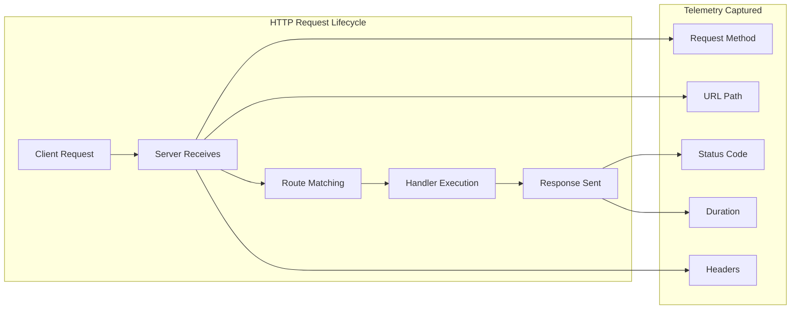
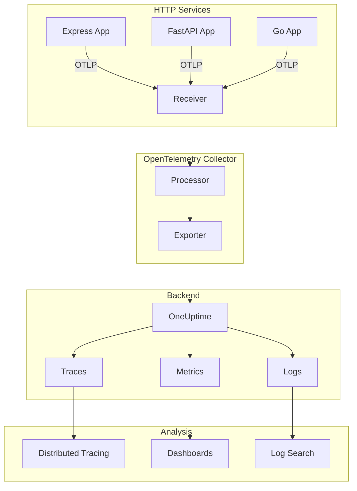

# How to Configure OpenTelemetry for HTTP Services

Author: [nawazdhandala](https://www.github.com/nawazdhandala)

Tags: OpenTelemetry, HTTP, Observability, Tracing, Metrics, Node.js, Python, Go, Instrumentation

Description: A comprehensive guide to configuring OpenTelemetry for HTTP services, covering automatic instrumentation, manual spans, and best practices for production deployments.

---

HTTP services are the backbone of modern applications. Whether you are building REST APIs, GraphQL endpoints, or microservices, having visibility into HTTP request lifecycles is essential for debugging, performance optimization, and maintaining reliability. OpenTelemetry provides a vendor-neutral way to instrument HTTP services and collect telemetry data.

This guide walks you through configuring OpenTelemetry for HTTP services across multiple languages and frameworks.

## Understanding HTTP Instrumentation

When instrumenting HTTP services, OpenTelemetry captures several key pieces of information:



## Node.js with Express

For Node.js applications using Express, OpenTelemetry provides automatic instrumentation that captures HTTP spans with minimal configuration.

### Installation

```bash
# Install core OpenTelemetry packages
npm install @opentelemetry/sdk-node \
  @opentelemetry/auto-instrumentations-node \
  @opentelemetry/exporter-trace-otlp-http \
  @opentelemetry/exporter-metrics-otlp-http \
  @opentelemetry/resources \
  @opentelemetry/semantic-conventions
```

### Instrumentation Setup

Create a file called `instrumentation.ts` that initializes OpenTelemetry before your application starts:

```typescript
// instrumentation.ts
// This file must be loaded before any other application code
import { NodeSDK } from '@opentelemetry/sdk-node';
import { getNodeAutoInstrumentations } from '@opentelemetry/auto-instrumentations-node';
import { OTLPTraceExporter } from '@opentelemetry/exporter-trace-otlp-http';
import { OTLPMetricExporter } from '@opentelemetry/exporter-metrics-otlp-http';
import { PeriodicExportingMetricReader } from '@opentelemetry/sdk-metrics';
import { Resource } from '@opentelemetry/resources';
import {
  ATTR_SERVICE_NAME,
  ATTR_SERVICE_VERSION,
  ATTR_DEPLOYMENT_ENVIRONMENT,
} from '@opentelemetry/semantic-conventions';

// Define resource attributes that identify your service
const resource = new Resource({
  [ATTR_SERVICE_NAME]: process.env.OTEL_SERVICE_NAME || 'my-http-service',
  [ATTR_SERVICE_VERSION]: process.env.npm_package_version || '1.0.0',
  [ATTR_DEPLOYMENT_ENVIRONMENT]: process.env.NODE_ENV || 'development',
});

// Configure the trace exporter to send data to your collector
const traceExporter = new OTLPTraceExporter({
  url: process.env.OTEL_EXPORTER_OTLP_ENDPOINT || 'http://localhost:4318/v1/traces',
  headers: {
    // Add authentication headers if required
    'x-oneuptime-token': process.env.ONEUPTIME_TOKEN || '',
  },
});

// Configure the metric exporter
const metricExporter = new OTLPMetricExporter({
  url: process.env.OTEL_EXPORTER_OTLP_ENDPOINT || 'http://localhost:4318/v1/metrics',
  headers: {
    'x-oneuptime-token': process.env.ONEUPTIME_TOKEN || '',
  },
});

// Initialize the SDK with auto-instrumentation
const sdk = new NodeSDK({
  resource,
  traceExporter,
  metricReader: new PeriodicExportingMetricReader({
    exporter: metricExporter,
    exportIntervalMillis: 15000, // Export metrics every 15 seconds
  }),
  instrumentations: [
    getNodeAutoInstrumentations({
      // Configure HTTP instrumentation options
      '@opentelemetry/instrumentation-http': {
        // Ignore health check endpoints to reduce noise
        ignoreIncomingRequestHook: (request) => {
          const ignorePaths = ['/health', '/healthz', '/ready', '/metrics'];
          return ignorePaths.some((path) => request.url?.includes(path));
        },
        // Add custom attributes to HTTP spans
        requestHook: (span, request) => {
          // Add request ID if available
          const requestId = request.headers['x-request-id'];
          if (requestId) {
            span.setAttribute('http.request_id', requestId as string);
          }
        },
        // Capture response headers
        responseHook: (span, response) => {
          const contentLength = response.getHeader('content-length');
          if (contentLength) {
            span.setAttribute('http.response_content_length', Number(contentLength));
          }
        },
      },
      // Configure Express instrumentation
      '@opentelemetry/instrumentation-express': {
        // Capture route parameters
        requestHook: (span, info) => {
          if (info.layerType === 'request_handler') {
            span.setAttribute('express.route', info.route);
          }
        },
      },
    }),
  ],
});

// Start the SDK and handle graceful shutdown
sdk.start();

process.on('SIGTERM', () => {
  sdk
    .shutdown()
    .then(() => console.log('OpenTelemetry shut down successfully'))
    .catch((error) => console.error('Error shutting down OpenTelemetry', error))
    .finally(() => process.exit(0));
});
```

### Application Code

Your Express application works normally. The instrumentation captures HTTP spans automatically:

```typescript
// app.ts
import express from 'express';
import { trace, SpanStatusCode } from '@opentelemetry/api';

const app = express();
const tracer = trace.getTracer('my-http-service');

app.use(express.json());

// Standard route - automatically instrumented
app.get('/api/users/:id', async (req, res) => {
  const { id } = req.params;

  // Create a child span for database operations
  const span = tracer.startSpan('fetch-user-from-db');
  span.setAttribute('user.id', id);

  try {
    // Simulate database call
    const user = await fetchUserFromDatabase(id);

    if (!user) {
      span.setStatus({ code: SpanStatusCode.ERROR, message: 'User not found' });
      res.status(404).json({ error: 'User not found' });
    } else {
      span.setStatus({ code: SpanStatusCode.OK });
      res.json(user);
    }
  } catch (error: any) {
    span.recordException(error);
    span.setStatus({ code: SpanStatusCode.ERROR, message: error.message });
    res.status(500).json({ error: 'Internal server error' });
  } finally {
    span.end();
  }
});

// Start the server
const PORT = process.env.PORT || 3000;
app.listen(PORT, () => {
  console.log(`Server running on port ${PORT}`);
});

async function fetchUserFromDatabase(id: string) {
  // Simulated database fetch
  return { id, name: 'John Doe', email: 'john@example.com' };
}
```

### Running with Instrumentation

Load the instrumentation file before your application:

```bash
# Using ts-node
node -r ts-node/register instrumentation.ts & node -r ts-node/register app.ts

# Or use the --require flag
node --require ./instrumentation.js app.js
```

## Python with FastAPI

Python applications using FastAPI can leverage OpenTelemetry's automatic instrumentation for ASGI applications.

### Installation

```bash
# Install OpenTelemetry packages for Python
pip install opentelemetry-sdk \
  opentelemetry-instrumentation-fastapi \
  opentelemetry-instrumentation-httpx \
  opentelemetry-exporter-otlp-proto-http
```

### Instrumentation Setup

```python
# instrumentation.py
# Configure OpenTelemetry for FastAPI applications

from opentelemetry import trace
from opentelemetry.sdk.trace import TracerProvider
from opentelemetry.sdk.trace.export import BatchSpanProcessor
from opentelemetry.exporter.otlp.proto.http.trace_exporter import OTLPSpanExporter
from opentelemetry.sdk.resources import Resource
from opentelemetry.semconv.resource import ResourceAttributes
from opentelemetry.instrumentation.fastapi import FastAPIInstrumentor
from opentelemetry.instrumentation.httpx import HTTPXClientInstrumentor
import os

def configure_opentelemetry(app):
    """
    Configure OpenTelemetry instrumentation for a FastAPI application.

    Args:
        app: The FastAPI application instance
    """
    # Define resource attributes
    resource = Resource.create({
        ResourceAttributes.SERVICE_NAME: os.getenv("OTEL_SERVICE_NAME", "fastapi-service"),
        ResourceAttributes.SERVICE_VERSION: os.getenv("SERVICE_VERSION", "1.0.0"),
        ResourceAttributes.DEPLOYMENT_ENVIRONMENT: os.getenv("ENVIRONMENT", "development"),
    })

    # Create and configure the tracer provider
    provider = TracerProvider(resource=resource)

    # Configure the OTLP exporter
    otlp_exporter = OTLPSpanExporter(
        endpoint=os.getenv("OTEL_EXPORTER_OTLP_ENDPOINT", "http://localhost:4318/v1/traces"),
        headers={
            "x-oneuptime-token": os.getenv("ONEUPTIME_TOKEN", ""),
        },
    )

    # Add the span processor with batching for better performance
    provider.add_span_processor(BatchSpanProcessor(otlp_exporter))

    # Set the global tracer provider
    trace.set_tracer_provider(provider)

    # Instrument FastAPI
    FastAPIInstrumentor.instrument_app(
        app,
        excluded_urls="health,healthz,ready,metrics",  # Exclude health endpoints
    )

    # Instrument outgoing HTTP requests made with httpx
    HTTPXClientInstrumentor().instrument()

    return provider
```

### Application Code

```python
# main.py
from fastapi import FastAPI, HTTPException, Request
from opentelemetry import trace
from instrumentation import configure_opentelemetry
import httpx

app = FastAPI(title="User Service")

# Configure OpenTelemetry before the app starts handling requests
provider = configure_opentelemetry(app)

# Get a tracer for creating custom spans
tracer = trace.get_tracer("user-service")


@app.get("/api/users/{user_id}")
async def get_user(user_id: str, request: Request):
    """
    Fetch a user by ID. This endpoint is automatically instrumented.
    """
    # Create a child span for the database operation
    with tracer.start_as_current_span("fetch-user-from-db") as span:
        span.set_attribute("user.id", user_id)

        # Simulate database lookup
        user = await fetch_user_from_database(user_id)

        if not user:
            span.set_status(trace.Status(trace.StatusCode.ERROR, "User not found"))
            raise HTTPException(status_code=404, detail="User not found")

        span.set_status(trace.Status(trace.StatusCode.OK))
        return user


@app.get("/api/users/{user_id}/orders")
async def get_user_orders(user_id: str):
    """
    Fetch orders for a user from an external service.
    Outgoing HTTP requests are automatically traced.
    """
    with tracer.start_as_current_span("fetch-user-orders") as span:
        span.set_attribute("user.id", user_id)

        # This HTTP request is automatically traced by httpx instrumentation
        async with httpx.AsyncClient() as client:
            response = await client.get(
                f"http://order-service/api/orders?user_id={user_id}",
                timeout=10.0,
            )
            response.raise_for_status()
            return response.json()


async def fetch_user_from_database(user_id: str):
    """Simulated database fetch."""
    return {"id": user_id, "name": "Jane Doe", "email": "jane@example.com"}


@app.on_event("shutdown")
async def shutdown_event():
    """Clean up OpenTelemetry resources on shutdown."""
    provider.shutdown()
```

## Go with net/http

Go applications can use OpenTelemetry's HTTP instrumentation middleware.

### Installation

```bash
go get go.opentelemetry.io/otel \
  go.opentelemetry.io/otel/sdk \
  go.opentelemetry.io/otel/exporters/otlp/otlptrace/otlptracehttp \
  go.opentelemetry.io/contrib/instrumentation/net/http/otelhttp
```

### Instrumentation Setup

```go
// instrumentation.go
package main

import (
	"context"
	"os"
	"time"

	"go.opentelemetry.io/otel"
	"go.opentelemetry.io/otel/attribute"
	"go.opentelemetry.io/otel/exporters/otlp/otlptrace/otlptracehttp"
	"go.opentelemetry.io/otel/propagation"
	"go.opentelemetry.io/otel/sdk/resource"
	sdktrace "go.opentelemetry.io/otel/sdk/trace"
	semconv "go.opentelemetry.io/otel/semconv/v1.21.0"
)

// InitTracer initializes the OpenTelemetry tracer provider
func InitTracer(ctx context.Context) (*sdktrace.TracerProvider, error) {
	// Get configuration from environment variables
	endpoint := os.Getenv("OTEL_EXPORTER_OTLP_ENDPOINT")
	if endpoint == "" {
		endpoint = "localhost:4318"
	}

	serviceName := os.Getenv("OTEL_SERVICE_NAME")
	if serviceName == "" {
		serviceName = "go-http-service"
	}

	// Create the OTLP HTTP exporter
	exporter, err := otlptracehttp.New(ctx,
		otlptracehttp.WithEndpoint(endpoint),
		otlptracehttp.WithHeaders(map[string]string{
			"x-oneuptime-token": os.Getenv("ONEUPTIME_TOKEN"),
		}),
	)
	if err != nil {
		return nil, err
	}

	// Define resource attributes
	res, err := resource.Merge(
		resource.Default(),
		resource.NewWithAttributes(
			semconv.SchemaURL,
			semconv.ServiceName(serviceName),
			semconv.ServiceVersion("1.0.0"),
			attribute.String("deployment.environment", os.Getenv("ENVIRONMENT")),
		),
	)
	if err != nil {
		return nil, err
	}

	// Create the tracer provider with batching
	tp := sdktrace.NewTracerProvider(
		sdktrace.WithBatcher(exporter,
			sdktrace.WithBatchTimeout(5*time.Second),
			sdktrace.WithMaxExportBatchSize(512),
		),
		sdktrace.WithResource(res),
		sdktrace.WithSampler(sdktrace.AlwaysSample()),
	)

	// Set the global tracer provider
	otel.SetTracerProvider(tp)

	// Set the global propagator for distributed tracing
	otel.SetTextMapPropagator(propagation.NewCompositeTextMapPropagator(
		propagation.TraceContext{},
		propagation.Baggage{},
	))

	return tp, nil
}
```

### Application Code

```go
// main.go
package main

import (
	"context"
	"encoding/json"
	"log"
	"net/http"
	"os"
	"os/signal"
	"syscall"
	"time"

	"go.opentelemetry.io/contrib/instrumentation/net/http/otelhttp"
	"go.opentelemetry.io/otel"
	"go.opentelemetry.io/otel/attribute"
	"go.opentelemetry.io/otel/codes"
)

var tracer = otel.Tracer("go-http-service")

func main() {
	ctx := context.Background()

	// Initialize OpenTelemetry
	tp, err := InitTracer(ctx)
	if err != nil {
		log.Fatalf("Failed to initialize tracer: %v", err)
	}

	// Create a new mux for routing
	mux := http.NewServeMux()

	// Register handlers
	mux.HandleFunc("/api/users/", getUserHandler)
	mux.HandleFunc("/health", healthHandler)

	// Wrap the mux with OpenTelemetry instrumentation
	handler := otelhttp.NewHandler(mux, "http-server",
		otelhttp.WithFilter(func(r *http.Request) bool {
			// Filter out health check endpoints
			return r.URL.Path != "/health" && r.URL.Path != "/healthz"
		}),
	)

	// Create the HTTP server
	server := &http.Server{
		Addr:         ":8080",
		Handler:      handler,
		ReadTimeout:  10 * time.Second,
		WriteTimeout: 10 * time.Second,
	}

	// Handle graceful shutdown
	go func() {
		sigChan := make(chan os.Signal, 1)
		signal.Notify(sigChan, syscall.SIGINT, syscall.SIGTERM)
		<-sigChan

		log.Println("Shutting down server...")

		shutdownCtx, cancel := context.WithTimeout(ctx, 10*time.Second)
		defer cancel()

		// Shutdown the HTTP server
		if err := server.Shutdown(shutdownCtx); err != nil {
			log.Printf("HTTP server shutdown error: %v", err)
		}

		// Shutdown the tracer provider
		if err := tp.Shutdown(shutdownCtx); err != nil {
			log.Printf("Tracer provider shutdown error: %v", err)
		}
	}()

	log.Println("Server starting on :8080")
	if err := server.ListenAndServe(); err != http.ErrServerClosed {
		log.Fatalf("Server error: %v", err)
	}
}

func getUserHandler(w http.ResponseWriter, r *http.Request) {
	ctx := r.Context()

	// Extract user ID from path
	userID := r.URL.Path[len("/api/users/"):]

	// Create a child span for database operation
	ctx, span := tracer.Start(ctx, "fetch-user-from-db")
	defer span.End()

	span.SetAttributes(attribute.String("user.id", userID))

	// Simulate database lookup
	user, err := fetchUserFromDatabase(ctx, userID)
	if err != nil {
		span.RecordError(err)
		span.SetStatus(codes.Error, err.Error())
		http.Error(w, "Internal server error", http.StatusInternalServerError)
		return
	}

	if user == nil {
		span.SetStatus(codes.Error, "User not found")
		http.Error(w, "User not found", http.StatusNotFound)
		return
	}

	span.SetStatus(codes.Ok, "")

	w.Header().Set("Content-Type", "application/json")
	json.NewEncoder(w).Encode(user)
}

func healthHandler(w http.ResponseWriter, r *http.Request) {
	w.WriteHeader(http.StatusOK)
	w.Write([]byte("OK"))
}

type User struct {
	ID    string `json:"id"`
	Name  string `json:"name"`
	Email string `json:"email"`
}

func fetchUserFromDatabase(ctx context.Context, id string) (*User, error) {
	// Simulated database fetch
	return &User{
		ID:    id,
		Name:  "John Doe",
		Email: "john@example.com",
	}, nil
}
```

## Collector Configuration

Configure the OpenTelemetry Collector to receive, process, and export HTTP telemetry:

```yaml
# otel-collector-config.yaml
receivers:
  otlp:
    protocols:
      http:
        endpoint: 0.0.0.0:4318
      grpc:
        endpoint: 0.0.0.0:4317

processors:
  # Batch spans for efficient export
  batch:
    send_batch_size: 512
    timeout: 5s

  # Add attributes to identify the source
  attributes:
    actions:
      - key: collector.name
        value: "http-services-collector"
        action: insert

  # Filter out noisy spans
  filter:
    spans:
      exclude:
        match_type: regexp
        span_names:
          - "health.*"
          - "healthz.*"
          - "metrics.*"

  # Limit memory usage
  memory_limiter:
    limit_mib: 512
    spike_limit_mib: 128
    check_interval: 5s

exporters:
  # Export to OneUptime
  otlphttp:
    endpoint: "https://oneuptime.com/otlp"
    encoding: json
    headers:
      "Content-Type": "application/json"
      "x-oneuptime-token": "${ONEUPTIME_TOKEN}"

  # Debug logging (disable in production)
  logging:
    verbosity: detailed

service:
  pipelines:
    traces:
      receivers: [otlp]
      processors: [memory_limiter, batch, attributes, filter]
      exporters: [otlphttp, logging]
    metrics:
      receivers: [otlp]
      processors: [memory_limiter, batch]
      exporters: [otlphttp]
```

## Data Flow Architecture

Here is how telemetry flows from your HTTP services through the collector to your observability backend:



## Best Practices

### 1. Filter Health Check Endpoints

Health check endpoints generate noise without providing value. Filter them at the instrumentation level:

```typescript
// Node.js example
ignoreIncomingRequestHook: (request) => {
  const ignorePaths = ['/health', '/healthz', '/ready', '/metrics', '/favicon.ico'];
  return ignorePaths.some((path) => request.url?.includes(path));
}
```

### 2. Capture Meaningful Attributes

Add attributes that help with debugging and analysis:

```typescript
// Good attributes to capture
span.setAttribute('http.request_id', requestId);
span.setAttribute('user.id', userId);
span.setAttribute('tenant.id', tenantId);
span.setAttribute('http.route', '/api/users/:id');

// Avoid high-cardinality attributes in metrics
// These are fine in traces but can cause cardinality explosion in metrics
span.setAttribute('session.id', sessionId);  // Only for traces
```

### 3. Propagate Context Across Services

Ensure trace context propagates across service boundaries:

```typescript
// When making outgoing HTTP requests, ensure headers are propagated
import { propagation, context } from '@opentelemetry/api';

function makeRequest(url: string, options: RequestInit = {}) {
  const headers = new Headers(options.headers);

  // Inject trace context into outgoing request headers
  propagation.inject(context.active(), headers, {
    set: (carrier, key, value) => carrier.set(key, value),
  });

  return fetch(url, { ...options, headers });
}
```

### 4. Handle Errors Properly

Always record exceptions and set appropriate status codes:

```typescript
try {
  const result = await riskyOperation();
  span.setStatus({ code: SpanStatusCode.OK });
  return result;
} catch (error) {
  span.recordException(error);
  span.setStatus({
    code: SpanStatusCode.ERROR,
    message: error.message
  });
  throw error;
}
```

## Troubleshooting Common Issues

| Issue | Cause | Solution |
|-------|-------|----------|
| No traces appearing | Exporter not configured | Check OTEL_EXPORTER_OTLP_ENDPOINT |
| Missing spans | Instrumentation not loaded first | Load instrumentation before app code |
| Context not propagating | Propagator not set | Configure W3C TraceContext propagator |
| High cardinality | Too many unique attribute values | Limit dynamic attributes, use sampling |
| Memory issues | Too many pending spans | Configure memory limiter processor |

## Conclusion

Configuring OpenTelemetry for HTTP services provides deep visibility into your application's behavior. By following these patterns, you can:

- Automatically capture HTTP request and response data
- Create custom spans for business-critical operations
- Propagate trace context across service boundaries
- Filter noise while retaining valuable telemetry
- Export data to any OpenTelemetry-compatible backend

Start with automatic instrumentation and progressively add manual spans for areas that need more visibility. The key is to capture enough detail to debug issues without overwhelming your observability backend with noise.
