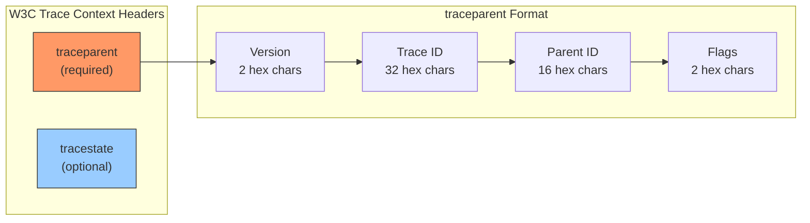
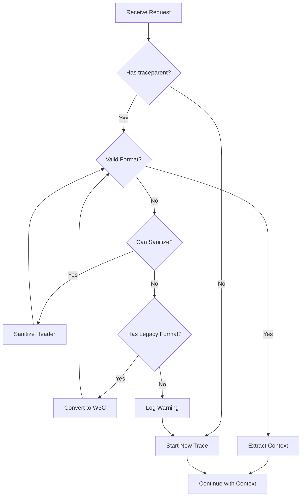

# How to Fix "Invalid W3C Trace Context" Errors

Author: [nawazdhandala](https://www.github.com/nawazdhandala)

Tags: OpenTelemetry, W3C Trace Context, Distributed Tracing, Debugging, Trace Propagation, HTTP Headers

Description: Learn how to diagnose and fix Invalid W3C Trace Context errors in OpenTelemetry implementations.

---

The "Invalid W3C Trace Context" error occurs when OpenTelemetry receives malformed trace context headers during distributed trace propagation. This error can break trace continuity across services, making it difficult to debug distributed systems. This guide explains the W3C Trace Context format, common causes of validation errors, and how to fix them.

## Understanding W3C Trace Context

W3C Trace Context is a standard for propagating trace information across service boundaries using HTTP headers. It consists of two headers: `traceparent` and `tracestate`.



### The traceparent Header Format

The `traceparent` header follows this exact format:

```
traceparent: {version}-{trace-id}-{parent-id}-{flags}
```

Example of a valid traceparent:
```
traceparent: 00-4bf92f3577b34da6a3ce929d0e0e4736-00f067aa0ba902b7-01
             |  |                                |                |
             |  |                                |                +-- flags (01 = sampled)
             |  |                                +------------------- parent-id (16 hex chars)
             |  +--------------------------------------------------- trace-id (32 hex chars)
             +------------------------------------------------------ version (00)
```

## Common Causes of Invalid Trace Context Errors

### 1. Incorrect Header Format

The most common cause is a malformed traceparent header:

```javascript
// WRONG: Missing dashes between components
const badHeader1 = "004bf92f3577b34da6a3ce929d0e0e473600f067aa0ba902b701";

// WRONG: Wrong number of characters in trace-id (should be 32)
const badHeader2 = "00-4bf92f3577b34da6a3ce929d0e0e47-00f067aa0ba902b7-01";

// WRONG: Invalid hex characters (contains 'g')
const badHeader3 = "00-4bf92f3577b34da6a3ce929d0g0e4736-00f067aa0ba902b7-01";

// WRONG: Using uppercase (should be lowercase)
const badHeader4 = "00-4BF92F3577B34DA6A3CE929D0E0E4736-00F067AA0BA902B7-01";

// CORRECT: Valid traceparent format
const goodHeader = "00-4bf92f3577b34da6a3ce929d0e0e4736-00f067aa0ba902b7-01";
```

### 2. All-Zero Trace ID or Parent ID

W3C Trace Context explicitly forbids all-zero values:

```javascript
// INVALID: All-zero trace-id
const invalidTraceId = "00-00000000000000000000000000000000-00f067aa0ba902b7-01";

// INVALID: All-zero parent-id
const invalidParentId = "00-4bf92f3577b34da6a3ce929d0e0e4736-0000000000000000-01";

// Validation function to check for all-zero values
function isValidTraceContext(traceparent) {
  const parts = traceparent.split('-');
  if (parts.length !== 4) return false;

  const [version, traceId, parentId, flags] = parts;

  // Check for all-zero trace-id
  if (traceId === '00000000000000000000000000000000') {
    console.error('Invalid trace context: trace-id cannot be all zeros');
    return false;
  }

  // Check for all-zero parent-id
  if (parentId === '0000000000000000') {
    console.error('Invalid trace context: parent-id cannot be all zeros');
    return false;
  }

  return true;
}
```

### 3. Unsupported Version Number

Currently, only version `00` is supported:

```javascript
// INVALID: Unsupported version
const unsupportedVersion = "01-4bf92f3577b34da6a3ce929d0e0e4736-00f067aa0ba902b7-01";

// INVALID: Invalid version format
const invalidVersion = "ff-4bf92f3577b34da6a3ce929d0e0e4736-00f067aa0ba902b7-01";

// Version validation
function validateVersion(version) {
  // According to W3C spec, version ff is invalid
  if (version === 'ff') {
    throw new Error('Invalid trace context: version ff is not allowed');
  }

  // Currently only version 00 is defined
  if (version !== '00') {
    console.warn(`Unknown trace context version: ${version}, treating as version 00`);
  }

  return true;
}
```

## Diagnosing Trace Context Issues

### Step 1: Enable Debug Logging

Enable OpenTelemetry debug logging to see the actual headers being processed:

```javascript
// Enable diagnostic logging in OpenTelemetry
const { diag, DiagConsoleLogger, DiagLogLevel } = require('@opentelemetry/api');

// Set to DEBUG level to see all trace context processing
diag.setLogger(new DiagConsoleLogger(), DiagLogLevel.DEBUG);

// Now you will see logs like:
// @opentelemetry/api: Extracting trace context from headers
// @opentelemetry/core: Invalid traceparent header: ...
```

### Step 2: Create a Validation Middleware

Add middleware to log and validate incoming trace context:

```javascript
// Express middleware to validate and log trace context
function traceContextDebugMiddleware(req, res, next) {
  const traceparent = req.headers['traceparent'];
  const tracestate = req.headers['tracestate'];

  console.log('Incoming trace context:');
  console.log('  traceparent:', traceparent || '(not present)');
  console.log('  tracestate:', tracestate || '(not present)');

  if (traceparent) {
    const validation = validateTraceparent(traceparent);
    if (!validation.valid) {
      console.error('  Validation errors:', validation.errors);
    }
  }

  next();
}

// Comprehensive traceparent validation
function validateTraceparent(traceparent) {
  const errors = [];

  // Check basic format
  if (typeof traceparent !== 'string') {
    return { valid: false, errors: ['traceparent must be a string'] };
  }

  const parts = traceparent.split('-');

  // Must have exactly 4 parts
  if (parts.length !== 4) {
    errors.push(`Expected 4 parts separated by dashes, got ${parts.length}`);
    return { valid: false, errors };
  }

  const [version, traceId, parentId, flags] = parts;

  // Validate version (2 lowercase hex chars)
  if (!/^[0-9a-f]{2}$/.test(version)) {
    errors.push(`Invalid version: "${version}" (must be 2 lowercase hex chars)`);
  }
  if (version === 'ff') {
    errors.push('Version ff is not allowed');
  }

  // Validate trace-id (32 lowercase hex chars, not all zeros)
  if (!/^[0-9a-f]{32}$/.test(traceId)) {
    errors.push(`Invalid trace-id: "${traceId}" (must be 32 lowercase hex chars)`);
  }
  if (traceId === '00000000000000000000000000000000') {
    errors.push('trace-id cannot be all zeros');
  }

  // Validate parent-id (16 lowercase hex chars, not all zeros)
  if (!/^[0-9a-f]{16}$/.test(parentId)) {
    errors.push(`Invalid parent-id: "${parentId}" (must be 16 lowercase hex chars)`);
  }
  if (parentId === '0000000000000000') {
    errors.push('parent-id cannot be all zeros');
  }

  // Validate flags (2 lowercase hex chars)
  if (!/^[0-9a-f]{2}$/.test(flags)) {
    errors.push(`Invalid flags: "${flags}" (must be 2 lowercase hex chars)`);
  }

  return {
    valid: errors.length === 0,
    errors,
    parsed: { version, traceId, parentId, flags }
  };
}

// Use the middleware
app.use(traceContextDebugMiddleware);
```

## Fixing Common Issues

### Fix 1: Sanitize Incoming Headers

Create a middleware that fixes common formatting issues:

```javascript
// Middleware to sanitize trace context headers
function sanitizeTraceContext(req, res, next) {
  let traceparent = req.headers['traceparent'];

  if (traceparent) {
    // Convert to lowercase (some systems send uppercase)
    traceparent = traceparent.toLowerCase();

    // Remove any whitespace
    traceparent = traceparent.trim().replace(/\s/g, '');

    // Update the header
    req.headers['traceparent'] = traceparent;
  }

  next();
}

// Apply before OpenTelemetry middleware
app.use(sanitizeTraceContext);
```

### Fix 2: Handle Legacy Trace Formats

If you receive trace context from systems using older formats, convert them:

```javascript
// Convert legacy trace formats to W3C Trace Context
function convertLegacyTraceContext(req, res, next) {
  // Check for B3 single header format (used by Zipkin)
  const b3Single = req.headers['b3'];
  if (b3Single && !req.headers['traceparent']) {
    const converted = convertB3ToW3C(b3Single);
    if (converted) {
      req.headers['traceparent'] = converted;
    }
  }

  // Check for X-B3 headers (multi-header B3 format)
  const xB3TraceId = req.headers['x-b3-traceid'];
  const xB3SpanId = req.headers['x-b3-spanid'];
  const xB3Sampled = req.headers['x-b3-sampled'];

  if (xB3TraceId && xB3SpanId && !req.headers['traceparent']) {
    const converted = convertB3HeadersToW3C(xB3TraceId, xB3SpanId, xB3Sampled);
    if (converted) {
      req.headers['traceparent'] = converted;
    }
  }

  next();
}

// Convert B3 single header to W3C traceparent
function convertB3ToW3C(b3Header) {
  // B3 format: {traceId}-{spanId}-{sampled}-{parentSpanId}
  // or: {traceId}-{spanId}-{sampled}
  // or: {traceId}-{spanId}
  const parts = b3Header.split('-');

  if (parts.length < 2) return null;

  let traceId = parts[0].toLowerCase();
  const spanId = parts[1].toLowerCase();
  const sampled = parts[2] === '1' || parts[2] === 'd' ? '01' : '00';

  // B3 trace IDs can be 16 or 32 chars, pad if needed
  if (traceId.length === 16) {
    traceId = '0000000000000000' + traceId;
  }

  // Validate lengths
  if (traceId.length !== 32 || spanId.length !== 16) {
    return null;
  }

  return `00-${traceId}-${spanId}-${sampled}`;
}

// Convert B3 multi-headers to W3C traceparent
function convertB3HeadersToW3C(traceId, spanId, sampled) {
  traceId = traceId.toLowerCase();
  spanId = spanId.toLowerCase();

  // Pad 16-char trace IDs to 32 chars
  if (traceId.length === 16) {
    traceId = '0000000000000000' + traceId;
  }

  const flags = sampled === '1' ? '01' : '00';

  if (traceId.length !== 32 || spanId.length !== 16) {
    return null;
  }

  return `00-${traceId}-${spanId}-${flags}`;
}
```

### Fix 3: Configure Composite Propagator

Use a composite propagator to handle multiple trace context formats:

```javascript
const { W3CTraceContextPropagator } = require('@opentelemetry/core');
const { B3Propagator, B3InjectEncoding } = require('@opentelemetry/propagator-b3');
const { JaegerPropagator } = require('@opentelemetry/propagator-jaeger');
const {
  CompositePropagator,
  W3CBaggagePropagator
} = require('@opentelemetry/core');

// Create a composite propagator that handles multiple formats
const propagator = new CompositePropagator({
  propagators: [
    // W3C Trace Context (primary)
    new W3CTraceContextPropagator(),
    // W3C Baggage
    new W3CBaggagePropagator(),
    // B3 format (for Zipkin compatibility)
    new B3Propagator({
      injectEncoding: B3InjectEncoding.MULTI_HEADER,
    }),
    // Jaeger format
    new JaegerPropagator(),
  ],
});

// Register the composite propagator
const { propagation } = require('@opentelemetry/api');
propagation.setGlobalPropagator(propagator);
```

## Error Handling Strategy



### Implement Graceful Fallback

```javascript
const { trace, context, propagation } = require('@opentelemetry/api');

// Custom context extraction with fallback
function extractTraceContext(req) {
  // First, try standard W3C extraction
  let extractedContext = propagation.extract(
    context.active(),
    req.headers
  );

  // Check if we got a valid span context
  const spanContext = trace.getSpanContext(extractedContext);

  if (!spanContext || !spanContext.traceId ||
      spanContext.traceId === '00000000000000000000000000000000') {
    // Log the issue for debugging
    console.warn('Invalid or missing trace context, starting new trace', {
      traceparent: req.headers['traceparent'],
      path: req.path,
    });

    // Return active context without extracted parent
    // This will cause a new trace to be started
    return context.active();
  }

  return extractedContext;
}

// Use in your request handler
app.use((req, res, next) => {
  const ctx = extractTraceContext(req);

  context.with(ctx, () => {
    next();
  });
});
```

## Testing Trace Context Handling

Create tests to verify your trace context handling:

```javascript
const { describe, it, expect } = require('@jest/globals');

describe('Trace Context Validation', () => {
  it('should accept valid traceparent', () => {
    const valid = '00-4bf92f3577b34da6a3ce929d0e0e4736-00f067aa0ba902b7-01';
    const result = validateTraceparent(valid);
    expect(result.valid).toBe(true);
  });

  it('should reject all-zero trace-id', () => {
    const invalid = '00-00000000000000000000000000000000-00f067aa0ba902b7-01';
    const result = validateTraceparent(invalid);
    expect(result.valid).toBe(false);
    expect(result.errors).toContain('trace-id cannot be all zeros');
  });

  it('should reject uppercase characters', () => {
    const invalid = '00-4BF92F3577B34DA6A3CE929D0E0E4736-00f067aa0ba902b7-01';
    const result = validateTraceparent(invalid);
    expect(result.valid).toBe(false);
  });

  it('should reject wrong length trace-id', () => {
    const invalid = '00-4bf92f3577b34da6a3ce929d0e0e47-00f067aa0ba902b7-01';
    const result = validateTraceparent(invalid);
    expect(result.valid).toBe(false);
  });

  it('should convert B3 format correctly', () => {
    const b3 = '463ac35c9f6413ad48485a3953bb6124-0020000000000001-1';
    const w3c = convertB3ToW3C(b3);
    expect(w3c).toBe('00-463ac35c9f6413ad48485a3953bb6124-0020000000000001-01');
  });
});
```

## Debugging Checklist

When you encounter "Invalid W3C Trace Context" errors, follow this checklist:

1. **Enable Debug Logging**: Set `DiagLogLevel.DEBUG` to see the exact headers
2. **Check Header Presence**: Verify `traceparent` header is being sent
3. **Validate Format**: Use the validation function to check each component
4. **Check Character Case**: Ensure all hex characters are lowercase
5. **Verify IDs Are Not All Zeros**: Both trace-id and parent-id must have non-zero values
6. **Check for Whitespace**: Remove any leading/trailing spaces
7. **Verify Dash Separators**: Ensure exactly 3 dashes separate 4 components
8. **Test with Known Good Values**: Use a valid traceparent to isolate the issue

## Conclusion

Invalid W3C Trace Context errors usually stem from malformed headers, typically due to incorrect case, wrong lengths, all-zero IDs, or missing separators. By implementing proper validation middleware, sanitization logic, and composite propagators for legacy format support, you can ensure reliable trace context propagation across your distributed system. Always log invalid trace contexts for debugging while gracefully falling back to starting new traces when context cannot be recovered.
