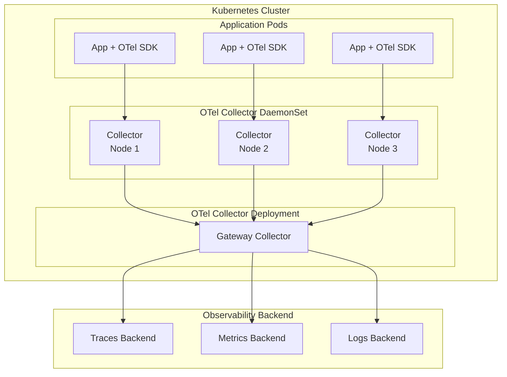
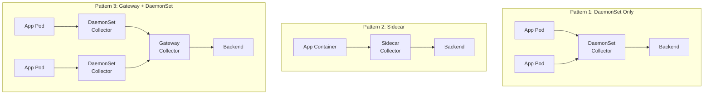
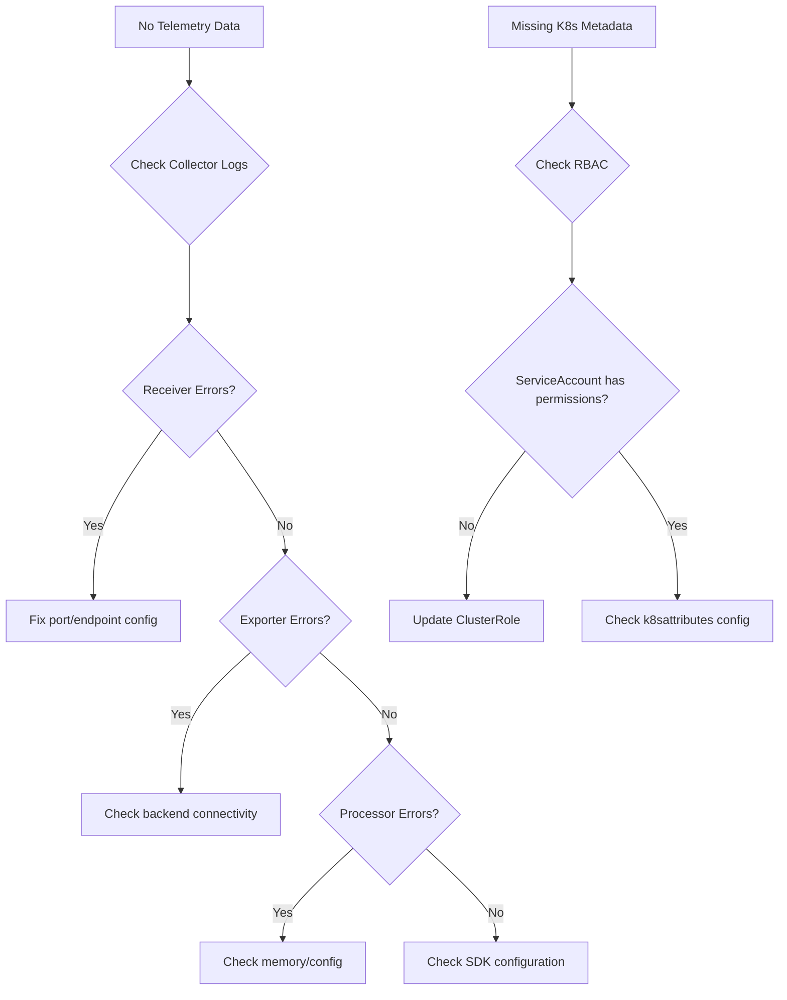

# How to Configure OpenTelemetry for Kubernetes

Author: [nawazdhandala](https://www.github.com/nawazdhandala)

Tags: OpenTelemetry, Kubernetes, Observability, DevOps, Cloud Native, Monitoring

Description: A comprehensive guide to deploying and configuring OpenTelemetry in Kubernetes environments for complete observability.

---

Running OpenTelemetry in Kubernetes requires understanding how to deploy collectors, configure applications, and leverage Kubernetes-native features for automatic instrumentation and resource detection. This guide covers everything you need to get OpenTelemetry working effectively in your Kubernetes cluster.

## Architecture Overview



## Deploying the OpenTelemetry Collector

### Option 1: Using the OpenTelemetry Operator

The OpenTelemetry Operator simplifies collector deployment and management.

```yaml
# Install the OpenTelemetry Operator using Helm
# helm repo add open-telemetry https://open-telemetry.github.io/opentelemetry-helm-charts
# helm install opentelemetry-operator open-telemetry/opentelemetry-operator

# opentelemetry-collector.yaml
# Custom Resource for the OpenTelemetry Collector
apiVersion: opentelemetry.io/v1alpha1
kind: OpenTelemetryCollector
metadata:
  name: otel-collector
  namespace: observability
spec:
  # Deploy as DaemonSet - one collector per node
  mode: daemonset

  # Resource limits for the collector
  resources:
    limits:
      cpu: 500m
      memory: 512Mi
    requests:
      cpu: 100m
      memory: 128Mi

  # Collector configuration
  config: |
    receivers:
      otlp:
        protocols:
          grpc:
            endpoint: 0.0.0.0:4317
          http:
            endpoint: 0.0.0.0:4318

      # Collect Kubernetes events
      k8s_events:
        namespaces: [default, production]

      # Collect node and pod metrics
      kubeletstats:
        collection_interval: 30s
        auth_type: serviceAccount
        endpoint: "${K8S_NODE_NAME}:10250"
        insecure_skip_verify: true

    processors:
      # Add Kubernetes metadata to telemetry
      k8sattributes:
        auth_type: serviceAccount
        extract:
          metadata:
            - k8s.namespace.name
            - k8s.deployment.name
            - k8s.pod.name
            - k8s.pod.uid
            - k8s.node.name
            - k8s.container.name
          labels:
            - tag_name: app
              key: app
              from: pod
            - tag_name: version
              key: version
              from: pod
        pod_association:
          - sources:
              - from: resource_attribute
                name: k8s.pod.ip
          - sources:
              - from: connection

      # Batch telemetry for efficient export
      batch:
        timeout: 10s
        send_batch_size: 1000

      # Memory limiter to prevent OOM
      memory_limiter:
        check_interval: 5s
        limit_mib: 400
        spike_limit_mib: 100

    exporters:
      otlp:
        endpoint: "your-backend:4317"
        tls:
          insecure: false

      # Debug exporter for troubleshooting
      logging:
        loglevel: info

    service:
      pipelines:
        traces:
          receivers: [otlp]
          processors: [k8sattributes, memory_limiter, batch]
          exporters: [otlp]
        metrics:
          receivers: [otlp, kubeletstats]
          processors: [k8sattributes, memory_limiter, batch]
          exporters: [otlp]
        logs:
          receivers: [otlp, k8s_events]
          processors: [k8sattributes, memory_limiter, batch]
          exporters: [otlp]
```

### Option 2: Manual Deployment with Helm

```bash
# Add the OpenTelemetry Helm repository
helm repo add open-telemetry https://open-telemetry.github.io/opentelemetry-helm-charts
helm repo update

# Install the collector as a DaemonSet
helm install otel-collector open-telemetry/opentelemetry-collector \
  --namespace observability \
  --create-namespace \
  --values collector-values.yaml
```

```yaml
# collector-values.yaml
# Helm values for OpenTelemetry Collector

mode: daemonset

# Image configuration
image:
  repository: otel/opentelemetry-collector-contrib
  tag: latest

# Service configuration
service:
  type: ClusterIP

# Ports configuration
ports:
  otlp:
    enabled: true
    containerPort: 4317
    servicePort: 4317
    protocol: TCP
  otlp-http:
    enabled: true
    containerPort: 4318
    servicePort: 4318
    protocol: TCP

# Resource limits
resources:
  limits:
    cpu: 500m
    memory: 512Mi
  requests:
    cpu: 100m
    memory: 128Mi

# RBAC for Kubernetes attribute processing
clusterRole:
  create: true
  rules:
    - apiGroups: [""]
      resources: ["pods", "namespaces", "nodes"]
      verbs: ["get", "watch", "list"]
    - apiGroups: ["apps"]
      resources: ["replicasets", "deployments"]
      verbs: ["get", "watch", "list"]

# Collector configuration
config:
  receivers:
    otlp:
      protocols:
        grpc:
          endpoint: 0.0.0.0:4317
        http:
          endpoint: 0.0.0.0:4318

    prometheus:
      config:
        scrape_configs:
          - job_name: 'otel-collector'
            scrape_interval: 30s
            static_configs:
              - targets: ['localhost:8888']

  processors:
    batch:
      timeout: 10s
      send_batch_size: 1000

    k8sattributes:
      auth_type: serviceAccount
      extract:
        metadata:
          - k8s.namespace.name
          - k8s.deployment.name
          - k8s.pod.name
          - k8s.node.name
      pod_association:
        - sources:
            - from: resource_attribute
              name: k8s.pod.ip
        - sources:
            - from: connection

    memory_limiter:
      check_interval: 5s
      limit_mib: 400
      spike_limit_mib: 100

  exporters:
    otlp:
      endpoint: "your-backend:4317"
      tls:
        insecure: false

  service:
    pipelines:
      traces:
        receivers: [otlp]
        processors: [k8sattributes, memory_limiter, batch]
        exporters: [otlp]
      metrics:
        receivers: [otlp, prometheus]
        processors: [k8sattributes, memory_limiter, batch]
        exporters: [otlp]
      logs:
        receivers: [otlp]
        processors: [k8sattributes, memory_limiter, batch]
        exporters: [otlp]
```

## Configuring Applications for OpenTelemetry

### Application Deployment with OTel Environment Variables

```yaml
# application-deployment.yaml
apiVersion: apps/v1
kind: Deployment
metadata:
  name: my-application
  namespace: default
  labels:
    app: my-application
    version: v1.0.0
spec:
  replicas: 3
  selector:
    matchLabels:
      app: my-application
  template:
    metadata:
      labels:
        app: my-application
        version: v1.0.0
      annotations:
        # Enable auto-instrumentation if using OTel Operator
        instrumentation.opentelemetry.io/inject-nodejs: "true"
    spec:
      containers:
        - name: my-application
          image: my-application:v1.0.0
          ports:
            - containerPort: 8080
          env:
            # OpenTelemetry SDK Configuration
            - name: OTEL_SERVICE_NAME
              value: "my-application"

            # Export to collector DaemonSet on the same node
            - name: OTEL_EXPORTER_OTLP_ENDPOINT
              value: "http://otel-collector.observability.svc.cluster.local:4317"

            # Enable all signal types
            - name: OTEL_TRACES_EXPORTER
              value: "otlp"
            - name: OTEL_METRICS_EXPORTER
              value: "otlp"
            - name: OTEL_LOGS_EXPORTER
              value: "otlp"

            # Sampling configuration
            - name: OTEL_TRACES_SAMPLER
              value: "parentbased_traceidratio"
            - name: OTEL_TRACES_SAMPLER_ARG
              value: "0.1"

            # Resource attributes
            - name: OTEL_RESOURCE_ATTRIBUTES
              value: "deployment.environment=production,team.name=platform"

            # Kubernetes metadata from Downward API
            - name: K8S_POD_NAME
              valueFrom:
                fieldRef:
                  fieldPath: metadata.name
            - name: K8S_POD_UID
              valueFrom:
                fieldRef:
                  fieldPath: metadata.uid
            - name: K8S_NAMESPACE
              valueFrom:
                fieldRef:
                  fieldPath: metadata.namespace
            - name: K8S_NODE_NAME
              valueFrom:
                fieldRef:
                  fieldPath: spec.nodeName
            - name: K8S_POD_IP
              valueFrom:
                fieldRef:
                  fieldPath: status.podIP

          resources:
            limits:
              cpu: 500m
              memory: 512Mi
            requests:
              cpu: 100m
              memory: 128Mi
```

### Auto-Instrumentation with the OpenTelemetry Operator

```yaml
# instrumentation.yaml
# Auto-instrumentation configuration for the OTel Operator
apiVersion: opentelemetry.io/v1alpha1
kind: Instrumentation
metadata:
  name: auto-instrumentation
  namespace: default
spec:
  exporter:
    endpoint: http://otel-collector.observability.svc.cluster.local:4317

  propagators:
    - tracecontext
    - baggage

  sampler:
    type: parentbased_traceidratio
    argument: "0.25"

  # Node.js auto-instrumentation settings
  nodejs:
    image: ghcr.io/open-telemetry/opentelemetry-operator/autoinstrumentation-nodejs:latest
    env:
      - name: OTEL_NODE_ENABLED_INSTRUMENTATIONS
        value: "http,express,pg,redis"

  # Python auto-instrumentation settings
  python:
    image: ghcr.io/open-telemetry/opentelemetry-operator/autoinstrumentation-python:latest
    env:
      - name: OTEL_PYTHON_EXCLUDED_URLS
        value: "/health,/ready"

  # Java auto-instrumentation settings
  java:
    image: ghcr.io/open-telemetry/opentelemetry-operator/autoinstrumentation-java:latest

  # .NET auto-instrumentation settings
  dotnet:
    image: ghcr.io/open-telemetry/opentelemetry-operator/autoinstrumentation-dotnet:latest

---
# Annotate deployments to enable auto-instrumentation
# Add these annotations to your pod template:
#
# For Node.js:
#   instrumentation.opentelemetry.io/inject-nodejs: "true"
#
# For Python:
#   instrumentation.opentelemetry.io/inject-python: "true"
#
# For Java:
#   instrumentation.opentelemetry.io/inject-java: "true"
#
# For .NET:
#   instrumentation.opentelemetry.io/inject-dotnet: "true"
```

## Collector Deployment Patterns



### Sidecar Deployment Pattern

```yaml
# sidecar-deployment.yaml
# Use sidecar pattern for high-throughput applications
apiVersion: apps/v1
kind: Deployment
metadata:
  name: high-throughput-app
spec:
  template:
    spec:
      containers:
        # Application container
        - name: application
          image: my-app:latest
          ports:
            - containerPort: 8080
          env:
            - name: OTEL_EXPORTER_OTLP_ENDPOINT
              value: "http://localhost:4317"  # Send to sidecar

        # OpenTelemetry Collector sidecar
        - name: otel-collector
          image: otel/opentelemetry-collector-contrib:latest
          args:
            - "--config=/etc/otel/config.yaml"
          ports:
            - containerPort: 4317  # OTLP gRPC
            - containerPort: 4318  # OTLP HTTP
          volumeMounts:
            - name: otel-config
              mountPath: /etc/otel
          resources:
            limits:
              cpu: 200m
              memory: 256Mi
            requests:
              cpu: 50m
              memory: 64Mi

      volumes:
        - name: otel-config
          configMap:
            name: otel-sidecar-config

---
apiVersion: v1
kind: ConfigMap
metadata:
  name: otel-sidecar-config
data:
  config.yaml: |
    receivers:
      otlp:
        protocols:
          grpc:
            endpoint: 0.0.0.0:4317
          http:
            endpoint: 0.0.0.0:4318

    processors:
      batch:
        timeout: 5s
        send_batch_size: 500

    exporters:
      otlp:
        endpoint: "otel-gateway.observability.svc.cluster.local:4317"
        tls:
          insecure: true

    service:
      pipelines:
        traces:
          receivers: [otlp]
          processors: [batch]
          exporters: [otlp]
        metrics:
          receivers: [otlp]
          processors: [batch]
          exporters: [otlp]
```

### Gateway Collector Deployment

```yaml
# gateway-collector.yaml
# Centralized collector for processing and routing
apiVersion: apps/v1
kind: Deployment
metadata:
  name: otel-gateway
  namespace: observability
spec:
  replicas: 3
  selector:
    matchLabels:
      app: otel-gateway
  template:
    metadata:
      labels:
        app: otel-gateway
    spec:
      containers:
        - name: collector
          image: otel/opentelemetry-collector-contrib:latest
          args:
            - "--config=/etc/otel/config.yaml"
          ports:
            - containerPort: 4317
            - containerPort: 4318
            - containerPort: 8888  # Metrics
          volumeMounts:
            - name: config
              mountPath: /etc/otel
          resources:
            limits:
              cpu: 1000m
              memory: 2Gi
            requests:
              cpu: 500m
              memory: 1Gi
      volumes:
        - name: config
          configMap:
            name: otel-gateway-config

---
apiVersion: v1
kind: Service
metadata:
  name: otel-gateway
  namespace: observability
spec:
  selector:
    app: otel-gateway
  ports:
    - name: otlp-grpc
      port: 4317
      targetPort: 4317
    - name: otlp-http
      port: 4318
      targetPort: 4318

---
apiVersion: v1
kind: ConfigMap
metadata:
  name: otel-gateway-config
  namespace: observability
data:
  config.yaml: |
    receivers:
      otlp:
        protocols:
          grpc:
            endpoint: 0.0.0.0:4317
          http:
            endpoint: 0.0.0.0:4318

    processors:
      batch:
        timeout: 10s
        send_batch_size: 2000

      memory_limiter:
        check_interval: 5s
        limit_mib: 1500
        spike_limit_mib: 500

      # Tail sampling at the gateway
      tail_sampling:
        decision_wait: 10s
        num_traces: 100000
        policies:
          - name: error-sampling
            type: status_code
            status_code:
              status_codes: [ERROR]
          - name: slow-sampling
            type: latency
            latency:
              threshold_ms: 5000
          - name: probabilistic
            type: probabilistic
            probabilistic:
              sampling_percentage: 10

    exporters:
      otlp/traces:
        endpoint: "traces-backend:4317"
        tls:
          insecure: false

      otlp/metrics:
        endpoint: "metrics-backend:4317"
        tls:
          insecure: false

      otlp/logs:
        endpoint: "logs-backend:4317"
        tls:
          insecure: false

    service:
      pipelines:
        traces:
          receivers: [otlp]
          processors: [memory_limiter, tail_sampling, batch]
          exporters: [otlp/traces]
        metrics:
          receivers: [otlp]
          processors: [memory_limiter, batch]
          exporters: [otlp/metrics]
        logs:
          receivers: [otlp]
          processors: [memory_limiter, batch]
          exporters: [otlp/logs]
```

## Collecting Kubernetes Metrics

```yaml
# kubernetes-metrics-collector.yaml
# Collector configuration for Kubernetes infrastructure metrics
apiVersion: v1
kind: ConfigMap
metadata:
  name: otel-k8s-metrics-config
  namespace: observability
data:
  config.yaml: |
    receivers:
      # Kubernetes cluster metrics from the API server
      k8s_cluster:
        collection_interval: 30s
        node_conditions_to_report:
          - Ready
          - MemoryPressure
          - DiskPressure
          - PIDPressure
        allocatable_types_to_report:
          - cpu
          - memory
          - storage

      # Node and pod metrics from kubelet
      kubeletstats:
        collection_interval: 30s
        auth_type: serviceAccount
        endpoint: "https://${K8S_NODE_NAME}:10250"
        insecure_skip_verify: true
        extra_metadata_labels:
          - container.id
          - k8s.volume.type
        metric_groups:
          - node
          - pod
          - container
          - volume

      # Prometheus metrics from kube-state-metrics
      prometheus:
        config:
          scrape_configs:
            - job_name: 'kube-state-metrics'
              scrape_interval: 30s
              kubernetes_sd_configs:
                - role: endpoints
                  namespaces:
                    names: [kube-system]
              relabel_configs:
                - source_labels: [__meta_kubernetes_service_name]
                  action: keep
                  regex: kube-state-metrics

    processors:
      batch:
        timeout: 30s

      # Add resource attributes for Kubernetes context
      resource:
        attributes:
          - key: k8s.cluster.name
            value: "my-cluster"
            action: upsert

      # Transform metrics if needed
      transform:
        metric_statements:
          - context: datapoint
            statements:
              # Convert CPU from nanocores to cores
              - set(value, value / 1000000000) where metric.name == "k8s.container.cpu.usage"

    exporters:
      otlp:
        endpoint: "your-backend:4317"

    service:
      pipelines:
        metrics:
          receivers: [k8s_cluster, kubeletstats, prometheus]
          processors: [resource, transform, batch]
          exporters: [otlp]
```

## Service Mesh Integration

```yaml
# istio-integration.yaml
# Configure OpenTelemetry with Istio service mesh
apiVersion: install.istio.io/v1alpha1
kind: IstioOperator
spec:
  meshConfig:
    enableTracing: true
    defaultConfig:
      tracing:
        sampling: 100.0
        zipkin:
          address: otel-collector.observability.svc.cluster.local:9411

    extensionProviders:
      - name: otel
        opentelemetry:
          service: otel-collector.observability.svc.cluster.local
          port: 4317

---
# Telemetry configuration for OpenTelemetry
apiVersion: telemetry.istio.io/v1alpha1
kind: Telemetry
metadata:
  name: otel-tracing
  namespace: istio-system
spec:
  tracing:
    - providers:
        - name: otel
      randomSamplingPercentage: 10.0
```

## Troubleshooting

### Common Issues and Solutions



### Debug ConfigMap

```yaml
# debug-config.yaml
# Debug configuration for troubleshooting
apiVersion: v1
kind: ConfigMap
metadata:
  name: otel-debug-config
  namespace: observability
data:
  config.yaml: |
    receivers:
      otlp:
        protocols:
          grpc:
            endpoint: 0.0.0.0:4317
          http:
            endpoint: 0.0.0.0:4318

    processors:
      batch:
        timeout: 1s  # Shorter timeout for debugging

    exporters:
      # Log everything for debugging
      logging:
        verbosity: detailed
        sampling_initial: 5
        sampling_thereafter: 200

      # Also export to your backend
      otlp:
        endpoint: "your-backend:4317"

    extensions:
      # Health check endpoint
      health_check:
        endpoint: 0.0.0.0:13133

      # Performance profiling
      pprof:
        endpoint: 0.0.0.0:1777

      # Prometheus metrics about the collector itself
      zpages:
        endpoint: 0.0.0.0:55679

    service:
      extensions: [health_check, pprof, zpages]

      # Enable telemetry about the collector
      telemetry:
        logs:
          level: debug
        metrics:
          address: 0.0.0.0:8888

      pipelines:
        traces:
          receivers: [otlp]
          processors: [batch]
          exporters: [logging, otlp]
        metrics:
          receivers: [otlp]
          processors: [batch]
          exporters: [logging, otlp]
```

## Summary

Deploying OpenTelemetry in Kubernetes involves several key decisions:

1. **Choose your deployment pattern** - DaemonSet for most cases, sidecar for high-throughput apps, gateway for centralized processing
2. **Use the OpenTelemetry Operator** - Simplifies collector management and enables auto-instrumentation
3. **Configure Kubernetes resource detection** - Use the k8sattributes processor and Downward API
4. **Set up proper RBAC** - Ensure collectors have permissions to query Kubernetes API
5. **Monitor your collectors** - Use the built-in metrics and health check endpoints
6. **Plan for scale** - Use appropriate resource limits and consider horizontal scaling

With these configurations, you will have comprehensive observability coverage for your Kubernetes workloads, including automatic service discovery, resource attribution, and infrastructure metrics collection.
