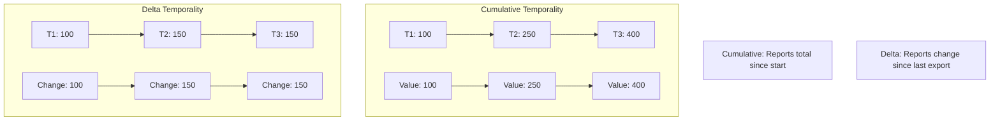
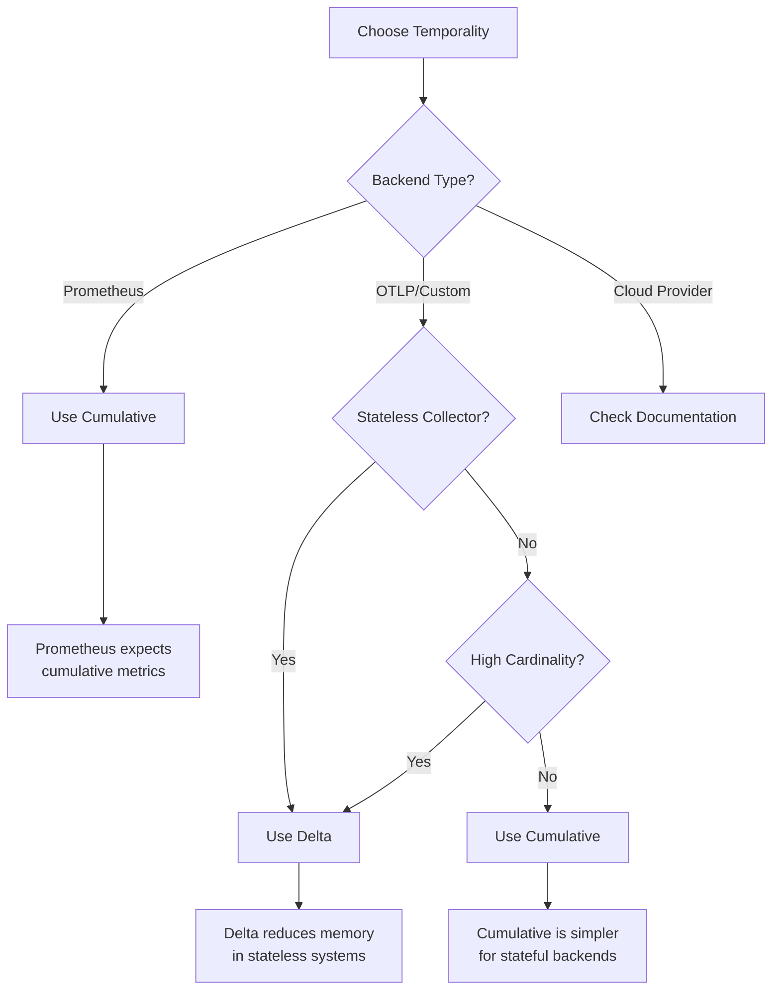
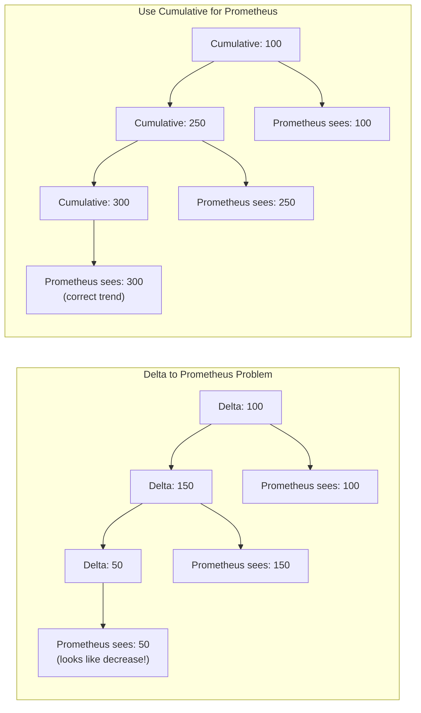

# How to Handle Metrics Aggregation Temporality

Author: [nawazdhandala](https://www.github.com/nawazdhandala)

Tags: OpenTelemetry, Metrics, Aggregation, Temporality, Cumulative, Delta, Prometheus, OTLP

Description: Learn how to properly configure and handle metrics aggregation temporality in OpenTelemetry for different backend systems.

---

Metrics aggregation temporality is one of the most confusing aspects of OpenTelemetry metrics. It determines whether metric values are reported as cumulative totals since process start or as deltas between collection intervals. Choosing the wrong temporality can lead to incorrect metric values, gaps in data, or incompatibility with your metrics backend. This guide explains the concepts and shows you how to configure temporality correctly.

## Understanding Aggregation Temporality



### Cumulative Temporality

Cumulative metrics report the total value accumulated since the process started:

- At T1: Counter value is 100 (total requests so far)
- At T2: Counter value is 250 (total requests so far)
- At T3: Counter value is 400 (total requests so far)

### Delta Temporality

Delta metrics report only the change since the last collection:

- At T1: Counter delta is 100 (requests in this interval)
- At T2: Counter delta is 150 (requests in this interval)
- At T3: Counter delta is 150 (requests in this interval)

## When to Use Each Temporality



### Use Cumulative When

- Your backend is Prometheus (requires cumulative)
- Your backend is stateful and can handle resets
- You need to calculate rates over arbitrary time ranges
- You have low-cardinality metrics

### Use Delta When

- Your backend supports delta metrics natively
- You have a stateless collector architecture
- You have high-cardinality metrics (reduces memory)
- You are using serverless or short-lived processes

## Configuring Temporality in OpenTelemetry

### Node.js Configuration

```javascript
// metrics.js - Configure metrics with specific temporality
const { MeterProvider, PeriodicExportingMetricReader } = require('@opentelemetry/sdk-metrics');
const { OTLPMetricExporter } = require('@opentelemetry/exporter-metrics-otlp-http');
const { PrometheusExporter } = require('@opentelemetry/exporter-prometheus');
const { Resource } = require('@opentelemetry/resources');
const { SemanticResourceAttributes } = require('@opentelemetry/semantic-conventions');

// Import temporality types
const {
  AggregationTemporality,
  InstrumentType,
} = require('@opentelemetry/sdk-metrics');

// Define temporality preference based on instrument type
// This function returns the appropriate temporality for each instrument
function deltaTemporalitySelector(instrumentType) {
  switch (instrumentType) {
    case InstrumentType.COUNTER:
    case InstrumentType.OBSERVABLE_COUNTER:
    case InstrumentType.HISTOGRAM:
    case InstrumentType.OBSERVABLE_GAUGE:
      // Use delta for counters and histograms
      return AggregationTemporality.DELTA;
    case InstrumentType.UP_DOWN_COUNTER:
    case InstrumentType.OBSERVABLE_UP_DOWN_COUNTER:
      // Up-down counters typically need cumulative
      return AggregationTemporality.CUMULATIVE;
    default:
      return AggregationTemporality.CUMULATIVE;
  }
}

// For Prometheus-compatible backends (must use cumulative)
function cumulativeTemporalitySelector(instrumentType) {
  // Prometheus requires cumulative temporality for all instruments
  return AggregationTemporality.CUMULATIVE;
}

// Create OTLP exporter with delta temporality (for stateless backends)
const otlpExporter = new OTLPMetricExporter({
  url: process.env.OTEL_EXPORTER_OTLP_METRICS_ENDPOINT || 'http://localhost:4318/v1/metrics',
  temporalityPreference: AggregationTemporality.DELTA,
  // Or use the selector function for fine-grained control
  // temporalityPreference: deltaTemporalitySelector,
});

// Create the meter provider
const meterProvider = new MeterProvider({
  resource: new Resource({
    [SemanticResourceAttributes.SERVICE_NAME]: 'my-service',
  }),
});

// Add the metric reader with export interval
meterProvider.addMetricReader(
  new PeriodicExportingMetricReader({
    exporter: otlpExporter,
    exportIntervalMillis: 60000, // Export every 60 seconds
    exportTimeoutMillis: 30000,
  })
);

// Get a meter for creating instruments
const meter = meterProvider.getMeter('my-service-metrics');

// Export for use in application
module.exports = { meterProvider, meter };
```

### Python Configuration

```python
# metrics.py - Configure metrics with specific temporality
from opentelemetry import metrics
from opentelemetry.sdk.metrics import MeterProvider
from opentelemetry.sdk.metrics.export import (
    PeriodicExportingMetricReader,
    AggregationTemporality,
)
from opentelemetry.exporter.otlp.proto.grpc.metric_exporter import OTLPMetricExporter
from opentelemetry.sdk.resources import Resource, SERVICE_NAME

# Define temporality mapping for different instrument types
# This dictionary maps each instrument type to its preferred temporality
DELTA_TEMPORALITY = {
    # Counters use delta - report change since last export
    "Counter": AggregationTemporality.DELTA,
    "UpDownCounter": AggregationTemporality.CUMULATIVE,  # Needs cumulative for negative values
    "Histogram": AggregationTemporality.DELTA,
    # Observable instruments
    "ObservableCounter": AggregationTemporality.DELTA,
    "ObservableUpDownCounter": AggregationTemporality.CUMULATIVE,
    "ObservableGauge": AggregationTemporality.CUMULATIVE,
}

CUMULATIVE_TEMPORALITY = {
    # All instruments use cumulative for Prometheus compatibility
    "Counter": AggregationTemporality.CUMULATIVE,
    "UpDownCounter": AggregationTemporality.CUMULATIVE,
    "Histogram": AggregationTemporality.CUMULATIVE,
    "ObservableCounter": AggregationTemporality.CUMULATIVE,
    "ObservableUpDownCounter": AggregationTemporality.CUMULATIVE,
    "ObservableGauge": AggregationTemporality.CUMULATIVE,
}


def create_meter_provider(use_delta: bool = False) -> MeterProvider:
    """Create a MeterProvider with the specified temporality preference."""

    resource = Resource.create({SERVICE_NAME: "my-python-service"})

    # Choose temporality based on backend requirements
    temporality_preference = DELTA_TEMPORALITY if use_delta else CUMULATIVE_TEMPORALITY

    # Create the OTLP exporter with temporality preference
    exporter = OTLPMetricExporter(
        endpoint="http://localhost:4317",
        preferred_temporality=temporality_preference,
    )

    # Create the metric reader
    reader = PeriodicExportingMetricReader(
        exporter=exporter,
        export_interval_millis=60000,  # Export every 60 seconds
    )

    # Create and return the meter provider
    provider = MeterProvider(
        resource=resource,
        metric_readers=[reader],
    )

    return provider


# Initialize the meter provider
# Set use_delta=True for stateless backends, False for Prometheus
meter_provider = create_meter_provider(use_delta=False)
metrics.set_meter_provider(meter_provider)

# Get a meter for creating instruments
meter = metrics.get_meter("my-python-service")
```

### Go Configuration

```go
// metrics.go - Configure metrics with specific temporality
package main

import (
	"context"
	"time"

	"go.opentelemetry.io/otel"
	"go.opentelemetry.io/otel/exporters/otlp/otlpmetric/otlpmetricgrpc"
	"go.opentelemetry.io/otel/sdk/metric"
	"go.opentelemetry.io/otel/sdk/resource"
	semconv "go.opentelemetry.io/otel/semconv/v1.21.0"
)

// DeltaTemporalitySelector returns delta temporality for most instruments
// Use this for stateless backends that aggregate metrics themselves
func DeltaTemporalitySelector(kind metric.InstrumentKind) metric.Temporality {
	switch kind {
	case metric.InstrumentKindCounter,
		metric.InstrumentKindHistogram,
		metric.InstrumentKindObservableCounter:
		return metric.TemporalityDelta
	default:
		// UpDownCounter and Gauge use cumulative
		return metric.TemporalityCumulative
	}
}

// CumulativeTemporalitySelector returns cumulative for all instruments
// Use this for Prometheus and stateful backends
func CumulativeTemporalitySelector(kind metric.InstrumentKind) metric.Temporality {
	return metric.TemporalityCumulative
}

// InitMetrics initializes the meter provider with the specified temporality
func InitMetrics(ctx context.Context, useDelta bool) (*metric.MeterProvider, error) {
	// Create the resource describing this service
	res, err := resource.New(ctx,
		resource.WithAttributes(
			semconv.ServiceName("my-go-service"),
			semconv.ServiceVersion("1.0.0"),
		),
	)
	if err != nil {
		return nil, err
	}

	// Choose the temporality selector based on backend requirements
	var temporalitySelector metric.TemporalitySelector
	if useDelta {
		temporalitySelector = DeltaTemporalitySelector
	} else {
		temporalitySelector = CumulativeTemporalitySelector
	}

	// Create the OTLP exporter with temporality preference
	exporter, err := otlpmetricgrpc.New(ctx,
		otlpmetricgrpc.WithEndpoint("localhost:4317"),
		otlpmetricgrpc.WithInsecure(),
		otlpmetricgrpc.WithTemporalitySelector(temporalitySelector),
	)
	if err != nil {
		return nil, err
	}

	// Create the meter provider with periodic reader
	meterProvider := metric.NewMeterProvider(
		metric.WithResource(res),
		metric.WithReader(metric.NewPeriodicReader(exporter,
			metric.WithInterval(60*time.Second),
		)),
	)

	// Set as global meter provider
	otel.SetMeterProvider(meterProvider)

	return meterProvider, nil
}
```

## Handling Temporality Conversion

Sometimes you need to convert between temporalities. The OpenTelemetry Collector can help with this.

### Collector Configuration for Temporality Conversion

```yaml
# otel-collector-config.yaml
# Configure the collector to convert temporality between producers and consumers

receivers:
  otlp:
    protocols:
      grpc:
        endpoint: 0.0.0.0:4317
      http:
        endpoint: 0.0.0.0:4318

processors:
  # Memory limiter to prevent OOM
  memory_limiter:
    check_interval: 1s
    limit_mib: 1000
    spike_limit_mib: 200

  # Batch processor for efficient export
  batch:
    timeout: 10s
    send_batch_size: 1000

  # Transform processor can help with metric manipulation
  # but temporality conversion is handled by exporters
  transform:
    metric_statements:
      - context: datapoint
        statements:
          # Example: Add metadata to help track temporality
          - set(attributes["temporality.original"], "delta") where resource.attributes["service.name"] == "delta-service"

exporters:
  # Prometheus exporter (requires cumulative)
  # The exporter automatically converts delta to cumulative
  prometheus:
    endpoint: 0.0.0.0:8889
    # Enable cumulative temporality conversion
    enable_open_metrics: true

  # OTLP exporter with delta preference
  otlp/delta:
    endpoint: delta-backend:4317
    tls:
      insecure: true

  # OTLP exporter with cumulative preference
  otlp/cumulative:
    endpoint: cumulative-backend:4317
    tls:
      insecure: true

service:
  pipelines:
    # Pipeline for Prometheus (cumulative)
    metrics/prometheus:
      receivers: [otlp]
      processors: [memory_limiter, batch]
      exporters: [prometheus]

    # Pipeline for delta backend
    metrics/delta:
      receivers: [otlp]
      processors: [memory_limiter, batch]
      exporters: [otlp/delta]
```

## Common Temporality Issues and Solutions

### Issue 1: Gaps in Prometheus Graphs

When using delta temporality with Prometheus, you may see gaps because Prometheus expects cumulative metrics.



**Solution**: Always use cumulative temporality when exporting to Prometheus:

```javascript
// For Prometheus, always use cumulative
const prometheusExporter = new PrometheusExporter({
  port: 9464,
});

// Prometheus exporter automatically uses cumulative temporality
meterProvider.addMetricReader(prometheusExporter);
```

### Issue 2: Memory Growth with Cumulative Metrics

High-cardinality cumulative metrics can cause memory issues because the SDK must track all time series.

```javascript
// Problem: High cardinality label causes memory growth
const requestCounter = meter.createCounter('http_requests', {
  description: 'Number of HTTP requests',
});

// This creates a new time series for every unique user ID
// With cumulative temporality, all series are kept in memory
requestCounter.add(1, {
  user_id: userId,  // High cardinality - bad!
  method: 'GET',
  status: 200,
});

// Solution: Use delta temporality and reduce cardinality
const deltaRequestCounter = meter.createCounter('http_requests', {
  description: 'Number of HTTP requests',
});

// Remove high-cardinality labels
deltaRequestCounter.add(1, {
  method: 'GET',
  status_class: '2xx',  // Bucket status codes
});
```

### Issue 3: Process Restarts and Counter Resets

With cumulative temporality, counter resets on process restart can cause incorrect rate calculations.

```javascript
// Handling counter resets in your backend queries
// PromQL example: Use rate() or increase() which handle resets

// Wrong: Direct subtraction doesn't handle resets
// current_value - value_1_hour_ago

// Correct: Use rate() which handles resets
// rate(http_requests_total[1h])

// Correct: Use increase() which handles resets
// increase(http_requests_total[1h])
```

### Issue 4: Histogram Bucket Boundaries

Histogram temporality affects how bucket boundaries are reported:

```javascript
// Configure histogram with explicit bucket boundaries
const requestDuration = meter.createHistogram('http_request_duration', {
  description: 'HTTP request duration in milliseconds',
  unit: 'ms',
  // Define bucket boundaries in milliseconds
  boundaries: [5, 10, 25, 50, 100, 250, 500, 1000, 2500, 5000, 10000],
});

// Record a duration measurement
requestDuration.record(150, {
  method: 'GET',
  route: '/api/users',
});

// With DELTA temporality: Each export shows new observations in each bucket
// With CUMULATIVE temporality: Each export shows total observations since start
```

## Best Practices

### 1. Match Temporality to Backend

```javascript
// Configuration helper to choose temporality based on backend
function getTemporalityForBackend(backend) {
  const backendTemporality = {
    'prometheus': AggregationTemporality.CUMULATIVE,
    'datadog': AggregationTemporality.DELTA,
    'newrelic': AggregationTemporality.DELTA,
    'dynatrace': AggregationTemporality.DELTA,
    'grafana-cloud': AggregationTemporality.CUMULATIVE,  // Uses Prometheus
    'elastic': AggregationTemporality.DELTA,
    'default': AggregationTemporality.CUMULATIVE,
  };

  return backendTemporality[backend] || backendTemporality['default'];
}
```

### 2. Document Your Temporality Choice

```javascript
// Always document why you chose a specific temporality
const otlpExporter = new OTLPMetricExporter({
  url: process.env.OTEL_EXPORTER_OTLP_METRICS_ENDPOINT,
  // Using DELTA temporality because:
  // 1. Our backend (Datadog) prefers delta
  // 2. We have high-cardinality metrics that would cause memory issues with cumulative
  // 3. Our services are short-lived (serverless) and don't benefit from cumulative
  temporalityPreference: AggregationTemporality.DELTA,
});
```

### 3. Use Views for Instrument-Level Control

```javascript
// Use views to override temporality for specific instruments
const { View } = require('@opentelemetry/sdk-metrics');

const meterProvider = new MeterProvider({
  views: [
    // Use delta for high-cardinality counter
    new View({
      instrumentName: 'high_cardinality_counter',
      aggregation: new SumAggregation(),
      // Note: Temporality is set at the exporter level, not view level
      // But views can change the aggregation type
    }),
  ],
});
```

## Conclusion

Understanding metrics aggregation temporality is essential for accurate observability. Use cumulative temporality for Prometheus and stateful backends that handle rate calculations. Use delta temporality for stateless architectures, high-cardinality metrics, and backends that prefer delta. When in doubt, check your backend's documentation and test with sample data to verify metrics appear correctly. The OpenTelemetry Collector can help bridge temporality differences when you need to send metrics to multiple backends with different requirements.
