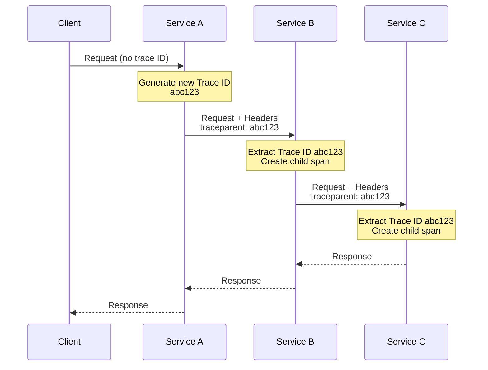
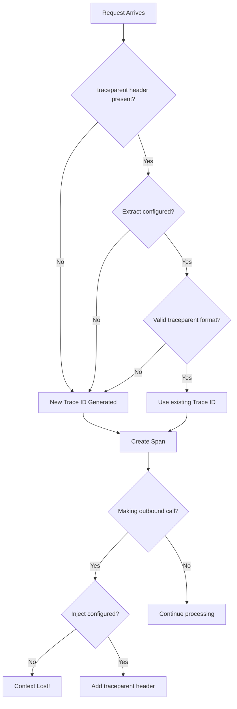
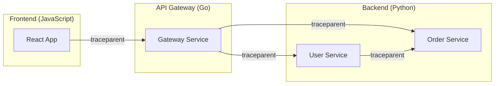
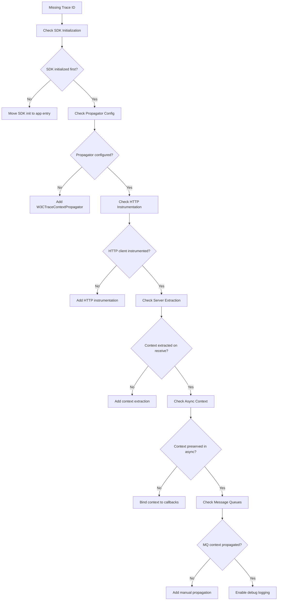

# How to Fix "Missing Trace ID" Issues in OpenTelemetry

Author: [nawazdhandala](https://www.github.com/nawazdhandala)

Tags: OpenTelemetry, Tracing, Debugging, Troubleshooting, Observability

Description: A comprehensive guide to diagnosing and fixing missing trace ID issues in OpenTelemetry instrumented applications.

---

One of the most frustrating issues when implementing distributed tracing is discovering that your traces are missing trace IDs. This can manifest as disconnected spans, traces that do not show in your backend, or correlation failures between services. This guide covers the common causes and solutions for missing trace ID issues in OpenTelemetry.

## Understanding Trace ID Propagation

Before diving into fixes, it is important to understand how trace IDs work in OpenTelemetry. A trace ID is a unique identifier that ties together all spans belonging to a single distributed transaction.



## Common Causes of Missing Trace IDs

### 1. Context Propagation Not Configured

The most common cause is missing context propagation configuration. Without propagators, trace context is not passed between services.

```javascript
// WRONG: Missing propagation configuration
const { NodeSDK } = require('@opentelemetry/sdk-node');
const { OTLPTraceExporter } = require('@opentelemetry/exporter-trace-otlp-http');

// This configuration lacks propagators
// Trace context will not be passed in HTTP headers
const sdk = new NodeSDK({
  traceExporter: new OTLPTraceExporter(),
});

sdk.start();
```

```javascript
// CORRECT: Proper propagation configuration
const { NodeSDK } = require('@opentelemetry/sdk-node');
const { OTLPTraceExporter } = require('@opentelemetry/exporter-trace-otlp-http');
const { W3CTraceContextPropagator } = require('@opentelemetry/core');
const { getNodeAutoInstrumentations } = require('@opentelemetry/auto-instrumentations-node');

// Include propagator and auto-instrumentation
const sdk = new NodeSDK({
  traceExporter: new OTLPTraceExporter(),
  // W3C Trace Context propagator adds traceparent headers
  textMapPropagator: new W3CTraceContextPropagator(),
  // Auto-instrumentation handles context injection/extraction
  instrumentations: [getNodeAutoInstrumentations()],
});

sdk.start();
```

### 2. HTTP Client Not Instrumented

If your HTTP client is not instrumented, outgoing requests will not carry trace context.

```python
# WRONG: Using requests without instrumentation
import requests
from opentelemetry import trace

tracer = trace.get_tracer(__name__)

def call_external_service():
    # This span is created but context is not propagated
    with tracer.start_as_current_span("call-service"):
        # The requests library is not instrumented
        # No traceparent header will be added
        response = requests.get("http://other-service/api/data")
        return response.json()
```

```python
# CORRECT: Instrument the HTTP client
from opentelemetry import trace
from opentelemetry.instrumentation.requests import RequestsInstrumentor
import requests

# Instrument the requests library BEFORE making calls
# This automatically injects trace context into HTTP headers
RequestsInstrumentor().instrument()

tracer = trace.get_tracer(__name__)

def call_external_service():
    with tracer.start_as_current_span("call-service"):
        # Now traceparent header is automatically added
        response = requests.get("http://other-service/api/data")
        return response.json()
```

### 3. Async Context Loss

In asynchronous code, context can be lost if not properly managed.

```javascript
// WRONG: Context lost in async callback
const { trace, context } = require('@opentelemetry/api');

async function processRequest(req, res) {
  const tracer = trace.getTracer('my-service');
  const span = tracer.startSpan('process-request');

  // Context is not bound to the callback
  setTimeout(() => {
    // This span has no parent - trace ID is different!
    const childSpan = tracer.startSpan('delayed-operation');
    childSpan.end();
  }, 1000);

  span.end();
}
```

```javascript
// CORRECT: Preserve context in async operations
const { trace, context } = require('@opentelemetry/api');

async function processRequest(req, res) {
  const tracer = trace.getTracer('my-service');
  const span = tracer.startSpan('process-request');

  // Capture the current context
  const currentContext = context.active();

  // Bind the context to the callback
  setTimeout(
    context.bind(currentContext, () => {
      // Now this span correctly uses the same trace ID
      const childSpan = tracer.startSpan('delayed-operation');
      // Your async operation here
      childSpan.end();
    }),
    1000
  );

  span.end();
}
```

```python
# Python async context preservation
import asyncio
from opentelemetry import trace, context
from opentelemetry.context import attach, detach

tracer = trace.get_tracer(__name__)

async def process_with_context():
    with tracer.start_as_current_span("main-operation") as span:
        # Capture current context before async operation
        ctx = context.get_current()

        # For asyncio tasks, context is automatically propagated
        # But for callbacks, you need to handle it manually
        await asyncio.gather(
            async_child_operation(),
            async_child_operation()
        )

async def async_child_operation():
    # Context is properly propagated in asyncio
    with tracer.start_as_current_span("child-operation"):
        await asyncio.sleep(0.1)
```

### 4. Missing Extract on Server Side

The receiving service must extract the trace context from incoming headers.

```go
// WRONG: Not extracting context from incoming request
package main

import (
    "net/http"
    "go.opentelemetry.io/otel"
)

func handler(w http.ResponseWriter, r *http.Request) {
    tracer := otel.Tracer("my-service")

    // Starting span without extracting context from request
    // This creates a NEW trace instead of continuing existing one
    ctx, span := tracer.Start(r.Context(), "handle-request")
    defer span.End()

    // Process request...
}
```

```go
// CORRECT: Extract context from incoming request headers
package main

import (
    "net/http"
    "go.opentelemetry.io/otel"
    "go.opentelemetry.io/otel/propagation"
)

func handler(w http.ResponseWriter, r *http.Request) {
    tracer := otel.Tracer("my-service")
    propagator := otel.GetTextMapPropagator()

    // Extract trace context from incoming HTTP headers
    // This gets the traceparent header and creates proper context
    ctx := propagator.Extract(r.Context(), propagation.HeaderCarrier(r.Header))

    // Now the span will have the correct parent trace ID
    ctx, span := tracer.Start(ctx, "handle-request")
    defer span.End()

    // Process request with the correct context
    processWithContext(ctx)
}
```

## Debugging Missing Trace IDs

### Step 1: Check Header Propagation

First, verify that trace context headers are being sent.

```javascript
// Debug middleware to log trace context headers
const { trace, context, propagation } = require('@opentelemetry/api');

function debugTracingMiddleware(req, res, next) {
  // Log incoming trace context headers
  console.log('Incoming headers:', {
    traceparent: req.headers['traceparent'],
    tracestate: req.headers['tracestate'],
  });

  // Get current span context
  const currentSpan = trace.getSpan(context.active());
  if (currentSpan) {
    const spanContext = currentSpan.spanContext();
    console.log('Current span context:', {
      traceId: spanContext.traceId,
      spanId: spanContext.spanId,
      traceFlags: spanContext.traceFlags,
    });
  } else {
    console.log('WARNING: No active span found!');
  }

  next();
}

// Use in Express app
app.use(debugTracingMiddleware);
```

### Step 2: Verify SDK Initialization Order

SDK must be initialized before any instrumented code runs.

```javascript
// WRONG: Import order causes instrumentation to miss
const express = require('express');  // Loaded before tracing
const { NodeSDK } = require('@opentelemetry/sdk-node');

const sdk = new NodeSDK({ /* config */ });
sdk.start();  // Too late! Express already loaded

const app = express();  // Not instrumented properly
```

```javascript
// CORRECT: Initialize SDK at the very start
// tracing.js - must be loaded first
const { NodeSDK } = require('@opentelemetry/sdk-node');
const { getNodeAutoInstrumentations } = require('@opentelemetry/auto-instrumentations-node');
const { OTLPTraceExporter } = require('@opentelemetry/exporter-trace-otlp-http');

const sdk = new NodeSDK({
  traceExporter: new OTLPTraceExporter(),
  instrumentations: [getNodeAutoInstrumentations()],
});

sdk.start();
console.log('OpenTelemetry SDK initialized');

// app.js - main application file
require('./tracing');  // MUST be first import
const express = require('express');  // Now properly instrumented

const app = express();
```

### Step 3: Check for Context Breaks



### Step 4: Validate Trace ID Format

Ensure trace IDs are valid W3C format.

```python
# Python utility to validate trace context
import re
from opentelemetry import trace

def validate_traceparent(traceparent: str) -> dict:
    """
    Validate W3C traceparent header format.
    Format: version-trace_id-parent_id-trace_flags
    Example: 00-4bf92f3577b34da6a3ce929d0e0e4736-00f067aa0ba902b7-01
    """
    pattern = r'^([0-9a-f]{2})-([0-9a-f]{32})-([0-9a-f]{16})-([0-9a-f]{2})$'
    match = re.match(pattern, traceparent)

    if not match:
        return {
            'valid': False,
            'error': 'Invalid traceparent format'
        }

    version, trace_id, parent_id, flags = match.groups()

    # Check for invalid all-zeros trace ID
    if trace_id == '0' * 32:
        return {
            'valid': False,
            'error': 'Trace ID cannot be all zeros'
        }

    # Check for invalid all-zeros parent ID
    if parent_id == '0' * 16:
        return {
            'valid': False,
            'error': 'Parent ID cannot be all zeros'
        }

    return {
        'valid': True,
        'version': version,
        'trace_id': trace_id,
        'parent_id': parent_id,
        'sampled': flags == '01'
    }

# Usage in middleware
def trace_debug_middleware(request):
    traceparent = request.headers.get('traceparent')
    if traceparent:
        result = validate_traceparent(traceparent)
        if not result['valid']:
            print(f"Invalid traceparent: {result['error']}")
        else:
            print(f"Valid trace ID: {result['trace_id']}")
    else:
        print("No traceparent header received")
```

## Fixing Common Scenarios

### Scenario 1: Microservices with Different Languages



Each service must be configured consistently:

```yaml
# Shared configuration pattern for all services
# Use environment variables for consistency

# Common environment variables for all services
OTEL_SERVICE_NAME: "service-name"
OTEL_EXPORTER_OTLP_ENDPOINT: "http://otel-collector:4317"
OTEL_PROPAGATORS: "tracecontext,baggage"
OTEL_TRACES_SAMPLER: "parentbased_traceidratio"
OTEL_TRACES_SAMPLER_ARG: "0.1"
```

### Scenario 2: Message Queue Context Propagation

Trace context must be manually propagated through message queues.

```javascript
// Producer: Inject context into message headers
const { trace, context, propagation } = require('@opentelemetry/api');

async function publishMessage(queue, payload) {
  const tracer = trace.getTracer('message-producer');

  return tracer.startActiveSpan('publish-message', async (span) => {
    try {
      // Create carrier object for context injection
      const carrier = {};

      // Inject current trace context into carrier
      propagation.inject(context.active(), carrier);

      // Include carrier as message headers
      const message = {
        headers: carrier,  // Contains traceparent, tracestate
        payload: payload,
        timestamp: Date.now(),
      };

      // Publish to queue
      await queue.publish(JSON.stringify(message));

      span.setStatus({ code: SpanStatusCode.OK });
    } catch (error) {
      span.setStatus({ code: SpanStatusCode.ERROR, message: error.message });
      throw error;
    } finally {
      span.end();
    }
  });
}
```

```javascript
// Consumer: Extract context from message headers
const { trace, context, propagation, SpanKind } = require('@opentelemetry/api');

async function consumeMessage(message) {
  const tracer = trace.getTracer('message-consumer');
  const parsed = JSON.parse(message);

  // Extract trace context from message headers
  const extractedContext = propagation.extract(
    context.active(),
    parsed.headers
  );

  // Create span with extracted context as parent
  return context.with(extractedContext, () => {
    return tracer.startActiveSpan(
      'process-message',
      { kind: SpanKind.CONSUMER },
      async (span) => {
        try {
          // Process the message
          await processPayload(parsed.payload);

          span.setStatus({ code: SpanStatusCode.OK });
        } catch (error) {
          span.setStatus({ code: SpanStatusCode.ERROR });
          throw error;
        } finally {
          span.end();
        }
      }
    );
  });
}
```

### Scenario 3: Thread Pool Context Loss

```java
// Java: Context lost when using thread pools
import io.opentelemetry.api.trace.Span;
import io.opentelemetry.api.trace.Tracer;
import io.opentelemetry.context.Context;
import io.opentelemetry.context.Scope;
import java.util.concurrent.ExecutorService;
import java.util.concurrent.Executors;

public class TracedExecutor {
    private final ExecutorService executor = Executors.newFixedThreadPool(10);
    private final Tracer tracer;

    public TracedExecutor(Tracer tracer) {
        this.tracer = tracer;
    }

    // WRONG: Context not propagated to thread pool
    public void wrongSubmit(Runnable task) {
        Span span = tracer.spanBuilder("parent-task").startSpan();
        try (Scope scope = span.makeCurrent()) {
            // Task runs in different thread without context
            executor.submit(task);  // Context is lost!
        } finally {
            span.end();
        }
    }

    // CORRECT: Wrap task with current context
    public void correctSubmit(Runnable task) {
        Span span = tracer.spanBuilder("parent-task").startSpan();
        try (Scope scope = span.makeCurrent()) {
            // Capture current context
            Context currentContext = Context.current();

            // Wrap task to restore context in new thread
            Runnable wrappedTask = currentContext.wrap(task);

            executor.submit(wrappedTask);
        } finally {
            span.end();
        }
    }

    // Alternative: Use context-aware executor
    public void usingContextExecutor(Runnable task) {
        // Wrap executor to automatically propagate context
        ExecutorService contextAwareExecutor =
            Context.taskWrapping(executor);

        Span span = tracer.spanBuilder("parent-task").startSpan();
        try (Scope scope = span.makeCurrent()) {
            // Context automatically propagated
            contextAwareExecutor.submit(task);
        } finally {
            span.end();
        }
    }
}
```

## Diagnostic Checklist

Use this checklist when debugging missing trace IDs:



## Summary

Missing trace IDs usually come down to one of these issues:

1. **Propagators not configured** - Ensure W3CTraceContextPropagator is set up
2. **HTTP clients not instrumented** - Add instrumentation for your HTTP library
3. **Context not extracted** - Server must extract context from incoming headers
4. **Async context loss** - Bind context when using callbacks or thread pools
5. **Message queues** - Manually inject/extract context in message headers
6. **SDK initialization order** - Initialize SDK before loading instrumented libraries

By systematically checking each of these areas, you can identify and fix the root cause of missing trace IDs in your distributed system.
