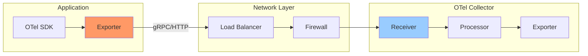
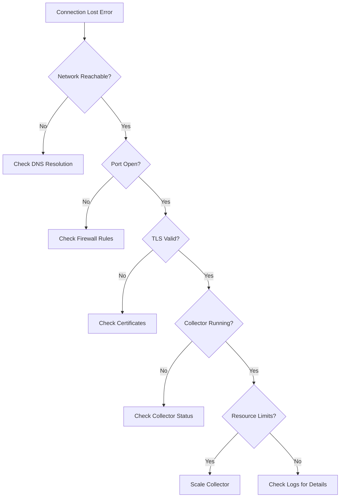

# How to Fix 'Receiver Connection Lost' Errors

Author: [nawazdhandala](https://www.github.com/nawazdhandala)

Tags: OpenTelemetry, Collector, Receiver, Connection, Troubleshooting, gRPC, OTLP, Networking

Description: Learn how to diagnose and fix Receiver Connection Lost errors in OpenTelemetry Collector deployments.

---

"Receiver Connection Lost" errors in OpenTelemetry indicate that the connection between your application's SDK and the OpenTelemetry Collector has been interrupted. This can lead to lost telemetry data, gaps in observability, and increased resource usage as the SDK attempts to reconnect. This guide walks you through diagnosing the root cause and implementing robust solutions.

## Understanding the Connection Architecture



## Common Causes of Connection Loss

### 1. Network Connectivity Issues

The most common cause is network problems between the SDK and collector.



### 2. Collector Resource Exhaustion

When the collector runs out of resources, it may drop connections.

### 3. Misconfigured Timeouts

Timeout mismatches between SDK and collector can cause premature disconnections.

### 4. Load Balancer Issues

Improper load balancer configuration can interrupt long-lived gRPC connections.

## Diagnosing the Problem

### Step 1: Check Collector Logs

First, examine the collector logs for error messages:

```bash
# View collector logs (Docker)
docker logs otel-collector 2>&1 | grep -i "error\|connection\|receiver"

# View collector logs (Kubernetes)
kubectl logs -n observability deployment/otel-collector | grep -i "error\|connection\|receiver"

# Example error messages you might see:
# "error receiving data: rpc error: code = Unavailable"
# "receiver/otlp: connection closed"
# "grpc: Server.Serve failed to complete: context deadline exceeded"
```

### Step 2: Verify Network Connectivity

Test connectivity from your application to the collector:

```bash
# Test TCP connectivity
nc -zv otel-collector.observability.svc.cluster.local 4317

# Test gRPC health (using grpcurl)
grpcurl -plaintext otel-collector:4317 grpc.health.v1.Health/Check

# Test HTTP endpoint
curl -v http://otel-collector:4318/v1/traces

# DNS resolution check
nslookup otel-collector.observability.svc.cluster.local
```

### Step 3: Check Collector Metrics

The collector exposes metrics about its health:

```bash
# Fetch collector metrics
curl http://otel-collector:8888/metrics | grep -E "otelcol_receiver|otelcol_exporter"

# Key metrics to check:
# otelcol_receiver_accepted_spans - Spans successfully received
# otelcol_receiver_refused_spans - Spans refused (indicates problems)
# otelcol_exporter_queue_size - Queue backup (indicates slow export)
# otelcol_process_memory_rss - Memory usage
```

### Step 4: Check SDK-Side Errors

Enable debug logging in your application:

```javascript
// Enable OpenTelemetry diagnostic logging
const { diag, DiagConsoleLogger, DiagLogLevel } = require('@opentelemetry/api');

// Set to DEBUG for detailed connection information
diag.setLogger(new DiagConsoleLogger(), DiagLogLevel.DEBUG);

// You will see logs like:
// "Exporter: sending spans"
// "Exporter: export failed - connection refused"
// "Exporter: retrying in 5000ms"
```

## Solutions

### Solution 1: Configure Retry and Timeout Settings

Configure robust retry settings in your SDK exporter:

```javascript
// Node.js - Configure OTLP exporter with retry settings
const { OTLPTraceExporter } = require('@opentelemetry/exporter-trace-otlp-grpc');
const { credentials } = require('@grpc/grpc-js');

const exporter = new OTLPTraceExporter({
  url: 'grpc://otel-collector:4317',
  credentials: credentials.createInsecure(),
  // Timeout for each export attempt (in milliseconds)
  timeoutMillis: 30000,
  // Compression to reduce bandwidth
  compression: 'gzip',
  // Additional gRPC options for connection resilience
  metadata: () => ({
    // Add any required metadata
  }),
});

// Configure the batch processor with retry logic
const { BatchSpanProcessor } = require('@opentelemetry/sdk-trace-base');

const spanProcessor = new BatchSpanProcessor(exporter, {
  // Maximum number of spans to buffer
  maxQueueSize: 2048,
  // Maximum number of spans per export batch
  maxExportBatchSize: 512,
  // Delay between exports (milliseconds)
  scheduledDelayMillis: 5000,
  // Timeout for each export (milliseconds)
  exportTimeoutMillis: 30000,
});
```

### Solution 2: Configure the Collector for High Availability

Update your collector configuration for better reliability:

```yaml
# otel-collector-config.yaml
receivers:
  otlp:
    protocols:
      grpc:
        endpoint: 0.0.0.0:4317
        # Increase max message size for large batches
        max_recv_msg_size_mib: 16
        # Keepalive settings to detect dead connections
        keepalive:
          server_parameters:
            # Send keepalive pings even with no active streams
            max_connection_idle: 300s
            # Maximum time connection can exist
            max_connection_age: 600s
            # Grace period after max_connection_age
            max_connection_age_grace: 60s
            # Minimum time between pings
            time: 60s
            # Wait time for ping ack
            timeout: 20s
          enforcement_policy:
            # Minimum time between client pings
            min_time: 30s
            # Allow pings with no active streams
            permit_without_stream: true
      http:
        endpoint: 0.0.0.0:4318
        # CORS configuration if needed
        cors:
          allowed_origins:
            - "*"

processors:
  # Memory limiter prevents OOM
  memory_limiter:
    # Check memory usage at this interval
    check_interval: 1s
    # Hard limit - will drop data above this
    limit_mib: 1800
    # Soft limit - will start dropping data
    spike_limit_mib: 500

  # Batch processor for efficient export
  batch:
    # Wait up to 10 seconds before sending a batch
    timeout: 10s
    # Send a batch when it reaches 1000 items
    send_batch_size: 1000
    # Maximum batch size
    send_batch_max_size: 1500

  # Retry on failures
  retry_on_failure:
    enabled: true
    initial_interval: 5s
    max_interval: 30s
    max_elapsed_time: 300s

exporters:
  otlp:
    endpoint: backend:4317
    tls:
      insecure: true
    # Sending queue configuration
    sending_queue:
      enabled: true
      # Number of consumers (parallel exports)
      num_consumers: 10
      # Queue size in batches
      queue_size: 1000
    # Retry configuration
    retry_on_failure:
      enabled: true
      initial_interval: 5s
      max_interval: 30s
      max_elapsed_time: 300s
    # Timeout for each export
    timeout: 30s

extensions:
  # Health check endpoint
  health_check:
    endpoint: 0.0.0.0:13133
    path: "/health"
    check_collector_pipeline:
      enabled: true
      interval: 5s
      exporter_failure_threshold: 5

  # Performance profiling
  pprof:
    endpoint: 0.0.0.0:1777

  # Prometheus metrics
  zpages:
    endpoint: 0.0.0.0:55679

service:
  extensions: [health_check, pprof, zpages]
  pipelines:
    traces:
      receivers: [otlp]
      processors: [memory_limiter, batch]
      exporters: [otlp]
    metrics:
      receivers: [otlp]
      processors: [memory_limiter, batch]
      exporters: [otlp]
```

### Solution 3: Configure Load Balancer for gRPC

For Kubernetes with gRPC traffic, configure proper load balancing:

```yaml
# kubernetes/otel-collector-service.yaml
apiVersion: v1
kind: Service
metadata:
  name: otel-collector
  namespace: observability
  annotations:
    # For AWS ALB
    service.beta.kubernetes.io/aws-load-balancer-backend-protocol: "http2"
    # For GKE
    cloud.google.com/backend-config: '{"default": "otel-collector-backendconfig"}'
spec:
  type: ClusterIP
  ports:
    - name: otlp-grpc
      port: 4317
      targetPort: 4317
      protocol: TCP
      # Use appProtocol for gRPC
      appProtocol: grpc
    - name: otlp-http
      port: 4318
      targetPort: 4318
      protocol: TCP
  selector:
    app: otel-collector
---
# For client-side load balancing with gRPC (headless service)
apiVersion: v1
kind: Service
metadata:
  name: otel-collector-headless
  namespace: observability
spec:
  type: ClusterIP
  clusterIP: None  # Headless service
  ports:
    - name: otlp-grpc
      port: 4317
      targetPort: 4317
      protocol: TCP
  selector:
    app: otel-collector
---
# GKE BackendConfig for gRPC
apiVersion: cloud.google.com/v1
kind: BackendConfig
metadata:
  name: otel-collector-backendconfig
  namespace: observability
spec:
  connectionDraining:
    drainingTimeoutSec: 60
  timeoutSec: 86400  # 24 hours for long-lived connections
  healthCheck:
    checkIntervalSec: 15
    timeoutSec: 5
    healthyThreshold: 2
    unhealthyThreshold: 3
    type: HTTP
    port: 13133
    requestPath: /health
```

### Solution 4: Implement Client-Side Connection Management

Add connection management logic in your application:

```javascript
// connection-manager.js - Robust connection handling
const { OTLPTraceExporter } = require('@opentelemetry/exporter-trace-otlp-grpc');
const { diag, DiagLogLevel } = require('@opentelemetry/api');

class ResilientExporter {
  constructor(config) {
    this.config = config;
    this.exporter = null;
    this.reconnectAttempts = 0;
    this.maxReconnectAttempts = 10;
    this.reconnectDelay = 1000;
    this.maxReconnectDelay = 60000;
    this.isShuttingDown = false;

    this.createExporter();
  }

  createExporter() {
    this.exporter = new OTLPTraceExporter({
      url: this.config.endpoint,
      timeoutMillis: this.config.timeout || 30000,
    });

    diag.info('OTLPTraceExporter created', {
      endpoint: this.config.endpoint,
    });
  }

  async export(spans, resultCallback) {
    if (this.isShuttingDown) {
      resultCallback({ code: 1, error: new Error('Exporter is shutting down') });
      return;
    }

    try {
      await this.exporter.export(spans, (result) => {
        if (result.code === 0) {
          // Success - reset reconnect counter
          this.reconnectAttempts = 0;
          this.reconnectDelay = 1000;
        } else {
          // Failure - handle reconnection
          this.handleExportFailure(result.error);
        }
        resultCallback(result);
      });
    } catch (error) {
      this.handleExportFailure(error);
      resultCallback({ code: 1, error });
    }
  }

  handleExportFailure(error) {
    diag.warn('Export failed', { error: error.message });

    if (this.reconnectAttempts < this.maxReconnectAttempts) {
      this.reconnectAttempts++;
      const delay = Math.min(
        this.reconnectDelay * Math.pow(2, this.reconnectAttempts - 1),
        this.maxReconnectDelay
      );

      diag.info('Scheduling reconnection', {
        attempt: this.reconnectAttempts,
        delayMs: delay,
      });

      setTimeout(() => {
        this.reconnect();
      }, delay);
    } else {
      diag.error('Max reconnection attempts reached', {
        attempts: this.reconnectAttempts,
      });
    }
  }

  async reconnect() {
    diag.info('Attempting to reconnect');

    try {
      // Shutdown old exporter
      if (this.exporter) {
        await this.exporter.shutdown();
      }
    } catch (e) {
      // Ignore shutdown errors
    }

    // Create new exporter
    this.createExporter();
  }

  async shutdown() {
    this.isShuttingDown = true;
    if (this.exporter) {
      await this.exporter.shutdown();
    }
  }
}

module.exports = { ResilientExporter };
```

### Solution 5: Monitor Connection Health

Implement health monitoring for your telemetry pipeline:

```javascript
// health-monitor.js - Monitor collector connectivity
const http = require('http');

class CollectorHealthMonitor {
  constructor(options) {
    this.healthEndpoint = options.healthEndpoint || 'http://otel-collector:13133/health';
    this.checkInterval = options.checkInterval || 30000;
    this.onHealthChange = options.onHealthChange || (() => {});
    this.isHealthy = null;
    this.intervalId = null;
  }

  start() {
    // Initial check
    this.checkHealth();

    // Periodic checks
    this.intervalId = setInterval(() => {
      this.checkHealth();
    }, this.checkInterval);
  }

  stop() {
    if (this.intervalId) {
      clearInterval(this.intervalId);
      this.intervalId = null;
    }
  }

  async checkHealth() {
    try {
      const response = await this.fetchHealth();
      const wasHealthy = this.isHealthy;
      this.isHealthy = response.status === 200;

      if (wasHealthy !== this.isHealthy) {
        this.onHealthChange({
          isHealthy: this.isHealthy,
          previousState: wasHealthy,
          timestamp: new Date().toISOString(),
        });
      }
    } catch (error) {
      const wasHealthy = this.isHealthy;
      this.isHealthy = false;

      if (wasHealthy !== false) {
        this.onHealthChange({
          isHealthy: false,
          previousState: wasHealthy,
          error: error.message,
          timestamp: new Date().toISOString(),
        });
      }
    }
  }

  fetchHealth() {
    return new Promise((resolve, reject) => {
      const req = http.get(this.healthEndpoint, { timeout: 5000 }, (res) => {
        resolve({ status: res.statusCode });
      });

      req.on('error', reject);
      req.on('timeout', () => {
        req.destroy();
        reject(new Error('Health check timeout'));
      });
    });
  }
}

// Usage
const monitor = new CollectorHealthMonitor({
  healthEndpoint: 'http://otel-collector:13133/health',
  checkInterval: 30000,
  onHealthChange: (event) => {
    if (event.isHealthy) {
      console.log('Collector is healthy');
    } else {
      console.error('Collector is unhealthy:', event.error);
      // Alert your team or trigger failover
    }
  },
});

monitor.start();
```

## Kubernetes Deployment Best Practices

```yaml
# kubernetes/otel-collector-deployment.yaml
apiVersion: apps/v1
kind: Deployment
metadata:
  name: otel-collector
  namespace: observability
spec:
  replicas: 3  # Multiple replicas for HA
  selector:
    matchLabels:
      app: otel-collector
  template:
    metadata:
      labels:
        app: otel-collector
    spec:
      # Anti-affinity to spread across nodes
      affinity:
        podAntiAffinity:
          preferredDuringSchedulingIgnoredDuringExecution:
            - weight: 100
              podAffinityTerm:
                labelSelector:
                  matchExpressions:
                    - key: app
                      operator: In
                      values:
                        - otel-collector
                topologyKey: kubernetes.io/hostname
      containers:
        - name: otel-collector
          image: otel/opentelemetry-collector-contrib:latest
          args:
            - --config=/etc/otel-collector-config.yaml
          ports:
            - containerPort: 4317  # OTLP gRPC
            - containerPort: 4318  # OTLP HTTP
            - containerPort: 13133 # Health check
            - containerPort: 8888  # Metrics
          resources:
            requests:
              memory: "512Mi"
              cpu: "250m"
            limits:
              memory: "2Gi"
              cpu: "1000m"
          livenessProbe:
            httpGet:
              path: /health
              port: 13133
            initialDelaySeconds: 10
            periodSeconds: 10
            timeoutSeconds: 5
            failureThreshold: 3
          readinessProbe:
            httpGet:
              path: /health
              port: 13133
            initialDelaySeconds: 5
            periodSeconds: 5
            timeoutSeconds: 3
            failureThreshold: 3
          volumeMounts:
            - name: config
              mountPath: /etc/otel-collector-config.yaml
              subPath: otel-collector-config.yaml
      volumes:
        - name: config
          configMap:
            name: otel-collector-config
---
# Pod Disruption Budget for HA
apiVersion: policy/v1
kind: PodDisruptionBudget
metadata:
  name: otel-collector-pdb
  namespace: observability
spec:
  minAvailable: 2
  selector:
    matchLabels:
      app: otel-collector
```

## Troubleshooting Checklist

When you encounter "Receiver Connection Lost" errors, follow this checklist:

1. **Check Collector Status**: Verify the collector pods are running and healthy
2. **Verify Network Path**: Test connectivity from application to collector
3. **Check Resource Usage**: Monitor collector CPU and memory
4. **Review Logs**: Check both SDK and collector logs for errors
5. **Validate Configuration**: Ensure timeouts and buffer sizes are appropriate
6. **Check TLS**: Verify certificates if using TLS
7. **Monitor Metrics**: Use collector metrics to identify bottlenecks
8. **Test Load**: Ensure collector can handle your telemetry volume

## Conclusion

"Receiver Connection Lost" errors typically stem from network issues, resource exhaustion, or timeout misconfigurations. The key to reliable telemetry is implementing robust retry logic in your SDK, properly configuring the collector for your workload, and monitoring the health of your telemetry pipeline. With proper configuration of keepalive settings, retry policies, and resource limits, you can maintain reliable connectivity even in demanding production environments.
