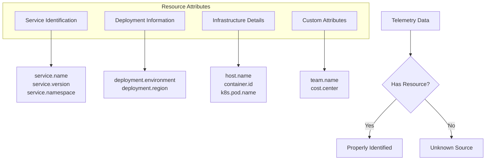
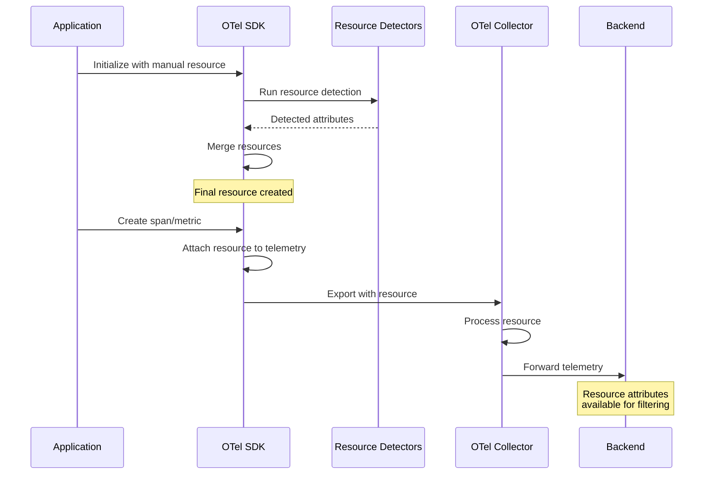

# How to Fix 'Resource Attributes Missing' in OpenTelemetry

Author: [nawazdhandala](https://www.github.com/nawazdhandala)

Tags: OpenTelemetry, Resources, Troubleshooting, Observability, Configuration

Description: Learn how to diagnose and fix missing resource attributes in OpenTelemetry to ensure proper service identification and telemetry correlation.

---

Resource attributes in OpenTelemetry provide crucial metadata about the entity producing telemetry data. When these attributes are missing, you lose the ability to properly identify services, correlate data across different signals, and filter telemetry effectively. This guide helps you diagnose and fix missing resource attribute issues.

## Understanding Resource Attributes

Resource attributes describe the source of telemetry data. They answer questions like "which service produced this trace?" and "what version is running?"



## Common Causes of Missing Resource Attributes

### 1. SDK Not Configured with Resource

The most common issue is simply not configuring a resource when initializing the SDK.

```javascript
// WRONG: No resource configuration
const { NodeSDK } = require('@opentelemetry/sdk-node');

// SDK initialized without resource - uses default empty resource
const sdk = new NodeSDK({
  traceExporter: new OTLPTraceExporter(),
});

sdk.start();
```

```javascript
// CORRECT: Properly configured resource
const { NodeSDK } = require('@opentelemetry/sdk-node');
const { Resource } = require('@opentelemetry/resources');
const {
  SEMRESATTRS_SERVICE_NAME,
  SEMRESATTRS_SERVICE_VERSION,
  SEMRESATTRS_DEPLOYMENT_ENVIRONMENT
} = require('@opentelemetry/semantic-conventions');
const { OTLPTraceExporter } = require('@opentelemetry/exporter-trace-otlp-http');

// Create a resource with all necessary attributes
const resource = new Resource({
  [SEMRESATTRS_SERVICE_NAME]: 'my-service',
  [SEMRESATTRS_SERVICE_VERSION]: '1.2.3',
  [SEMRESATTRS_DEPLOYMENT_ENVIRONMENT]: process.env.NODE_ENV || 'development',
});

const sdk = new NodeSDK({
  resource: resource,
  traceExporter: new OTLPTraceExporter(),
});

sdk.start();
```

### 2. Resource Detection Not Working

Auto-detection might fail silently if detectors are not properly configured.

```javascript
// Resource detectors may fail silently
const { NodeSDK } = require('@opentelemetry/sdk-node');
const { Resource, detectResourcesSync } = require('@opentelemetry/resources');
const {
  envDetectorSync,
  hostDetectorSync,
  osDetectorSync,
  processDetectorSync,
} = require('@opentelemetry/resources');

// Detect resources from environment and system
// Some detectors may fail in certain environments
const detectedResource = detectResourcesSync({
  detectors: [
    envDetectorSync,      // Reads OTEL_RESOURCE_ATTRIBUTES env var
    hostDetectorSync,     // Detects host.name, host.arch
    osDetectorSync,       // Detects os.type, os.version
    processDetectorSync,  // Detects process.pid, process.runtime.*
  ],
});

// Merge detected resources with manual configuration
// Manual config takes precedence over detected
const manualResource = new Resource({
  'service.name': 'my-service',
  'service.version': '1.0.0',
});

const finalResource = manualResource.merge(detectedResource);

console.log('Final resource attributes:', finalResource.attributes);

const sdk = new NodeSDK({
  resource: finalResource,
  // ... other config
});
```

### 3. Environment Variables Not Set

OpenTelemetry reads resource attributes from environment variables, but they might not be set.

```bash
# Check if OTEL environment variables are set
echo $OTEL_SERVICE_NAME
echo $OTEL_RESOURCE_ATTRIBUTES

# Properly set environment variables
export OTEL_SERVICE_NAME="my-service"
export OTEL_RESOURCE_ATTRIBUTES="service.version=1.0.0,deployment.environment=production,team.name=platform"
```

```yaml
# Kubernetes deployment with proper env vars
apiVersion: apps/v1
kind: Deployment
metadata:
  name: my-service
spec:
  template:
    spec:
      containers:
        - name: my-service
          image: my-service:latest
          env:
            # Service identification
            - name: OTEL_SERVICE_NAME
              value: "my-service"

            # Resource attributes as comma-separated key=value pairs
            - name: OTEL_RESOURCE_ATTRIBUTES
              value: "service.version=1.0.0,deployment.environment=production"

            # Kubernetes-specific attributes from downward API
            - name: K8S_POD_NAME
              valueFrom:
                fieldRef:
                  fieldPath: metadata.name
            - name: K8S_NAMESPACE
              valueFrom:
                fieldRef:
                  fieldPath: metadata.namespace
            - name: K8S_NODE_NAME
              valueFrom:
                fieldRef:
                  fieldPath: spec.nodeName
```

## Debugging Missing Resource Attributes

### Step 1: Enable Debug Logging

```javascript
// Enable OpenTelemetry debug logging
const { diag, DiagConsoleLogger, DiagLogLevel } = require('@opentelemetry/api');

// Set up diagnostic logging before SDK initialization
diag.setLogger(new DiagConsoleLogger(), DiagLogLevel.DEBUG);

// Now resource detection issues will be logged
const sdk = new NodeSDK({
  // ... config
});
```

### Step 2: Inspect Resource at Runtime

```javascript
// JavaScript - Debug resource attributes
const { trace } = require('@opentelemetry/api');
const { NodeTracerProvider } = require('@opentelemetry/sdk-trace-node');

// After SDK is initialized, inspect the resource
const provider = trace.getTracerProvider();

// Access the resource from the provider
if (provider instanceof NodeTracerProvider) {
  const resource = provider.resource;

  console.log('=== Resource Attributes ===');
  Object.entries(resource.attributes).forEach(([key, value]) => {
    console.log(`  ${key}: ${value}`);
  });

  // Check for required attributes
  const requiredAttrs = ['service.name', 'service.version', 'deployment.environment'];
  const missingAttrs = requiredAttrs.filter(attr => !resource.attributes[attr]);

  if (missingAttrs.length > 0) {
    console.warn('Missing required attributes:', missingAttrs);
  }
}
```

```python
# Python - Debug resource attributes
from opentelemetry import trace
from opentelemetry.sdk.trace import TracerProvider
from opentelemetry.sdk.resources import Resource, get_aggregated_resources
from opentelemetry.sdk.resources import (
    OTELResourceDetector,
    ProcessResourceDetector,
)

def debug_resource():
    """Print current resource attributes for debugging."""
    provider = trace.get_tracer_provider()

    if hasattr(provider, 'resource'):
        resource = provider.resource
        print("=== Current Resource Attributes ===")
        for key, value in resource.attributes.items():
            print(f"  {key}: {value}")

        # Check for required attributes
        required = ['service.name', 'service.version']
        missing = [attr for attr in required if attr not in resource.attributes]

        if missing:
            print(f"\nWARNING: Missing attributes: {missing}")
    else:
        print("WARNING: TracerProvider does not have resource attribute")
        print(f"Provider type: {type(provider)}")

# Call during startup to verify
debug_resource()
```

### Step 3: Verify Collector Reception

Check if the collector is receiving and forwarding resource attributes correctly.

```yaml
# otel-collector-config.yaml
# Add debug exporter to see what's being received

receivers:
  otlp:
    protocols:
      grpc:
        endpoint: 0.0.0.0:4317

processors:
  # Log all received telemetry for debugging
  batch:
    timeout: 1s

exporters:
  # Debug exporter logs everything to console
  debug:
    verbosity: detailed
    sampling_initial: 5
    sampling_thereafter: 200

  # Your actual exporter
  otlp:
    endpoint: "your-backend:4317"

service:
  pipelines:
    traces:
      receivers: [otlp]
      processors: [batch]
      exporters: [debug, otlp]  # Include debug for troubleshooting
```

## Fixing Resource Attributes

### Complete Resource Configuration

```javascript
// JavaScript - Complete resource setup
const { NodeSDK } = require('@opentelemetry/sdk-node');
const { Resource, detectResourcesSync } = require('@opentelemetry/resources');
const {
  SEMRESATTRS_SERVICE_NAME,
  SEMRESATTRS_SERVICE_VERSION,
  SEMRESATTRS_SERVICE_NAMESPACE,
  SEMRESATTRS_DEPLOYMENT_ENVIRONMENT,
  SEMRESATTRS_HOST_NAME,
  SEMRESATTRS_PROCESS_PID,
} = require('@opentelemetry/semantic-conventions');
const {
  envDetectorSync,
  hostDetectorSync,
  processDetectorSync,
} = require('@opentelemetry/resources');
const os = require('os');

// Read version from package.json
const packageJson = require('./package.json');

// Create comprehensive resource
function createResource() {
  // 1. Start with required manual attributes
  const baseResource = new Resource({
    // Required: Service identification
    [SEMRESATTRS_SERVICE_NAME]: process.env.OTEL_SERVICE_NAME || 'my-service',
    [SEMRESATTRS_SERVICE_VERSION]: packageJson.version,
    [SEMRESATTRS_SERVICE_NAMESPACE]: process.env.SERVICE_NAMESPACE || 'default',

    // Deployment context
    [SEMRESATTRS_DEPLOYMENT_ENVIRONMENT]: process.env.NODE_ENV || 'development',

    // Host information (fallback if detector fails)
    [SEMRESATTRS_HOST_NAME]: os.hostname(),

    // Process information
    [SEMRESATTRS_PROCESS_PID]: process.pid,

    // Custom business attributes
    'team.name': process.env.TEAM_NAME || 'unknown',
    'cost.center': process.env.COST_CENTER || 'unknown',
  });

  // 2. Detect additional resources from environment
  let detectedResource;
  try {
    detectedResource = detectResourcesSync({
      detectors: [envDetectorSync, hostDetectorSync, processDetectorSync],
    });
  } catch (error) {
    console.warn('Resource detection failed:', error.message);
    detectedResource = Resource.empty();
  }

  // 3. Merge resources - base takes precedence over detected
  return baseResource.merge(detectedResource);
}

const sdk = new NodeSDK({
  resource: createResource(),
  // ... other config
});

sdk.start();
console.log('OpenTelemetry initialized with resource attributes');
```

```python
# Python - Complete resource setup
from opentelemetry import trace
from opentelemetry.sdk.trace import TracerProvider
from opentelemetry.sdk.resources import Resource, SERVICE_NAME, SERVICE_VERSION
from opentelemetry.sdk.resources import (
    OTELResourceDetector,
    ProcessResourceDetector,
)
import os
import socket
import pkg_resources

def create_resource() -> Resource:
    """Create a comprehensive resource with all required attributes."""

    # Get version from installed package
    try:
        version = pkg_resources.get_distribution("my-package").version
    except pkg_resources.DistributionNotFound:
        version = "unknown"

    # Base required attributes
    base_attributes = {
        # Service identification - REQUIRED
        SERVICE_NAME: os.environ.get("OTEL_SERVICE_NAME", "my-service"),
        SERVICE_VERSION: version,
        "service.namespace": os.environ.get("SERVICE_NAMESPACE", "default"),

        # Deployment context
        "deployment.environment": os.environ.get("DEPLOYMENT_ENV", "development"),
        "deployment.region": os.environ.get("AWS_REGION", "unknown"),

        # Host information
        "host.name": socket.gethostname(),

        # Process information
        "process.pid": os.getpid(),
        "process.runtime.name": "python",
        "process.runtime.version": os.sys.version.split()[0],

        # Custom attributes
        "team.name": os.environ.get("TEAM_NAME", "platform"),
    }

    # Add Kubernetes attributes if available
    k8s_attributes = {}
    if os.environ.get("K8S_POD_NAME"):
        k8s_attributes.update({
            "k8s.pod.name": os.environ.get("K8S_POD_NAME"),
            "k8s.namespace.name": os.environ.get("K8S_NAMESPACE"),
            "k8s.node.name": os.environ.get("K8S_NODE_NAME"),
            "k8s.deployment.name": os.environ.get("K8S_DEPLOYMENT_NAME"),
        })

    # Combine all attributes
    all_attributes = {**base_attributes, **k8s_attributes}

    # Remove any None values
    clean_attributes = {k: v for k, v in all_attributes.items() if v is not None}

    return Resource.create(clean_attributes)


# Initialize provider with resource
resource = create_resource()
provider = TracerProvider(resource=resource)
trace.set_tracer_provider(provider)

# Log resource for verification
print("Resource attributes:")
for key, value in resource.attributes.items():
    print(f"  {key}: {value}")
```

### Kubernetes Resource Detection

```javascript
// Kubernetes-aware resource detection
const { Resource } = require('@opentelemetry/resources');
const fs = require('fs');

function detectKubernetesResource() {
  const attributes = {};

  // Check if running in Kubernetes
  const serviceAccountPath = '/var/run/secrets/kubernetes.io/serviceaccount';
  const isK8s = fs.existsSync(serviceAccountPath);

  if (!isK8s) {
    console.log('Not running in Kubernetes, skipping K8s resource detection');
    return Resource.empty();
  }

  // Read namespace from mounted secret
  try {
    const namespace = fs.readFileSync(`${serviceAccountPath}/namespace`, 'utf8').trim();
    attributes['k8s.namespace.name'] = namespace;
  } catch (e) {
    console.warn('Could not read K8s namespace:', e.message);
  }

  // Get pod information from environment (set via Downward API)
  const k8sEnvVars = {
    'k8s.pod.name': 'K8S_POD_NAME',
    'k8s.pod.uid': 'K8S_POD_UID',
    'k8s.node.name': 'K8S_NODE_NAME',
    'k8s.deployment.name': 'K8S_DEPLOYMENT_NAME',
    'k8s.replicaset.name': 'K8S_REPLICASET_NAME',
  };

  Object.entries(k8sEnvVars).forEach(([attr, envVar]) => {
    const value = process.env[envVar];
    if (value) {
      attributes[attr] = value;
    }
  });

  // Detect container ID from cgroup
  try {
    const cgroupContent = fs.readFileSync('/proc/self/cgroup', 'utf8');
    const containerIdMatch = cgroupContent.match(/[a-f0-9]{64}/);
    if (containerIdMatch) {
      attributes['container.id'] = containerIdMatch[0];
    }
  } catch (e) {
    // Not a critical error
  }

  return new Resource(attributes);
}

// Merge with other resources
const k8sResource = detectKubernetesResource();
const baseResource = new Resource({
  'service.name': 'my-service',
  'service.version': '1.0.0',
});

const finalResource = baseResource.merge(k8sResource);
```

## Resource Attribute Flow



## Validation Script

Create a validation script to check resource attributes at startup.

```javascript
// validate-resources.js
const { Resource } = require('@opentelemetry/resources');

const REQUIRED_ATTRIBUTES = [
  'service.name',
  'service.version',
  'deployment.environment',
];

const RECOMMENDED_ATTRIBUTES = [
  'service.namespace',
  'host.name',
  'process.pid',
  'team.name',
];

function validateResource(resource) {
  const attributes = resource.attributes;
  const errors = [];
  const warnings = [];

  // Check required attributes
  REQUIRED_ATTRIBUTES.forEach(attr => {
    if (!attributes[attr]) {
      errors.push(`Missing required attribute: ${attr}`);
    } else if (attributes[attr] === 'unknown' || attributes[attr] === '') {
      errors.push(`Required attribute has invalid value: ${attr}=${attributes[attr]}`);
    }
  });

  // Check recommended attributes
  RECOMMENDED_ATTRIBUTES.forEach(attr => {
    if (!attributes[attr]) {
      warnings.push(`Missing recommended attribute: ${attr}`);
    }
  });

  // Check service.name is not default
  if (attributes['service.name'] === 'unknown_service' ||
      attributes['service.name'] === 'service.name') {
    errors.push('service.name appears to be a default/placeholder value');
  }

  // Report results
  console.log('=== Resource Validation Results ===');
  console.log('\nCurrent attributes:');
  Object.entries(attributes).forEach(([k, v]) => console.log(`  ${k}: ${v}`));

  if (errors.length > 0) {
    console.error('\nERRORS:');
    errors.forEach(e => console.error(`  - ${e}`));
  }

  if (warnings.length > 0) {
    console.warn('\nWARNINGS:');
    warnings.forEach(w => console.warn(`  - ${w}`));
  }

  if (errors.length === 0 && warnings.length === 0) {
    console.log('\nAll resource attributes are properly configured!');
  }

  return {
    valid: errors.length === 0,
    errors,
    warnings,
  };
}

// Export for use in application
module.exports = { validateResource };

// Run validation if executed directly
if (require.main === module) {
  // Example resource for testing
  const testResource = new Resource({
    'service.name': process.env.OTEL_SERVICE_NAME || 'unknown_service',
    'service.version': process.env.SERVICE_VERSION || '',
    'deployment.environment': process.env.NODE_ENV || '',
  });

  const result = validateResource(testResource);
  process.exit(result.valid ? 0 : 1);
}
```

## Summary

Missing resource attributes can seriously impact your observability capabilities. To ensure your telemetry is properly identified:

1. **Always configure service.name and service.version** - These are essential for identifying your service
2. **Use environment variables** - Set OTEL_SERVICE_NAME and OTEL_RESOURCE_ATTRIBUTES
3. **Enable resource detectors** - Use automatic detection for host and process information
4. **Add Kubernetes context** - Use the Downward API to inject pod and deployment information
5. **Validate at startup** - Check that required attributes are present before the application starts
6. **Enable debug logging** - Use diagnostic logging to catch resource detection failures

With properly configured resource attributes, your telemetry data becomes much more useful for debugging, alerting, and understanding your distributed systems.
