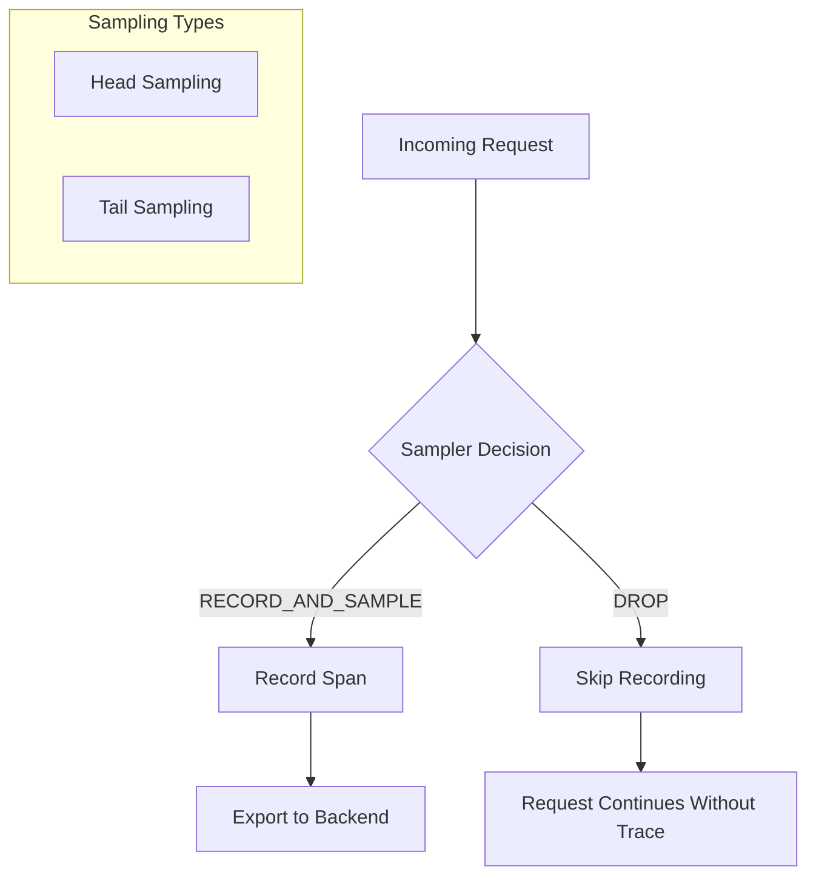
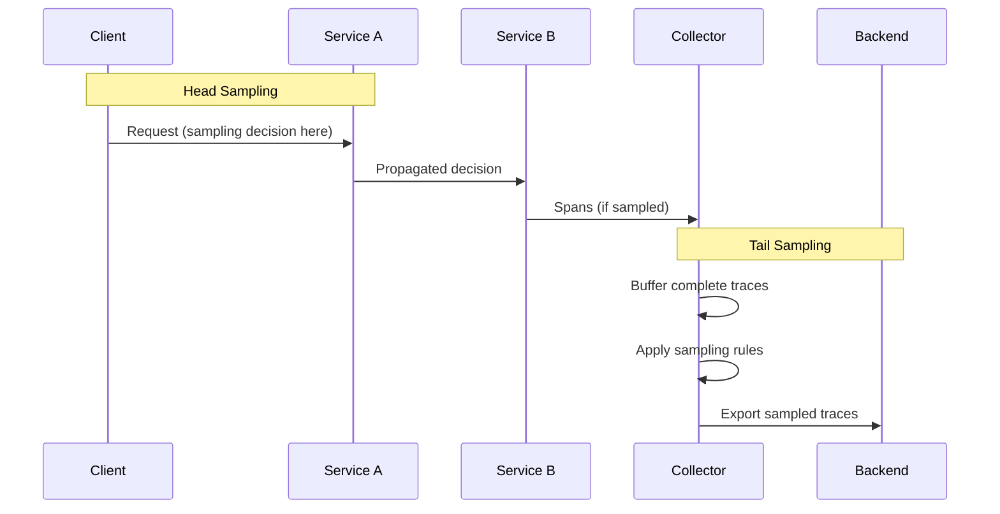
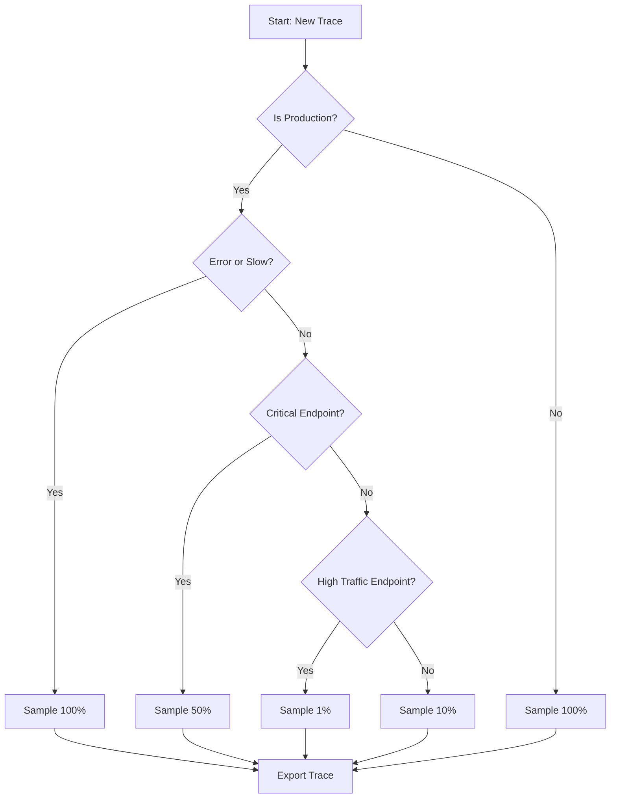
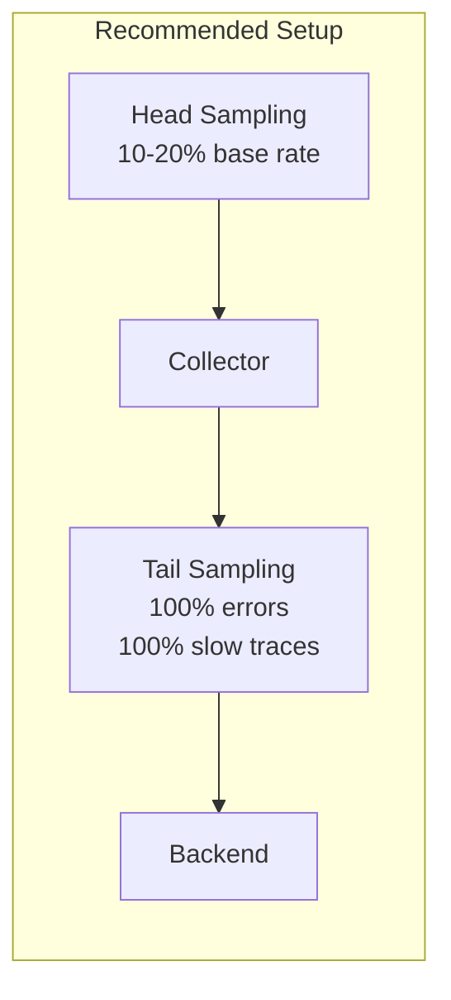

# How to Configure OpenTelemetry Sampling Strategies

Author: [nawazdhandala](https://www.github.com/nawazdhandala)

Tags: OpenTelemetry, Sampling, Observability, Tracing, Performance

Description: Learn how to configure and implement different sampling strategies in OpenTelemetry to balance observability needs with system performance and cost.

---

Sampling is one of the most critical decisions you will make when implementing distributed tracing with OpenTelemetry. Without proper sampling, you risk either overwhelming your backend with too much telemetry data or missing important traces that could help debug production issues. This guide walks you through the different sampling strategies available in OpenTelemetry and how to configure them effectively.

## Understanding Sampling in OpenTelemetry

Sampling determines which traces get recorded and exported. In high-throughput systems, recording every single trace is often impractical and expensive. Sampling helps you maintain observability while keeping costs and performance overhead manageable.



## Head Sampling vs Tail Sampling

There are two main approaches to sampling in distributed tracing:

**Head Sampling**: The decision to sample is made at the start of a trace, before any spans are created. This is efficient but means you might miss interesting traces.

**Tail Sampling**: The decision is made after the trace is complete, allowing you to sample based on the full trace characteristics. This requires a collector component.



## Configuring Head Samplers

### Always On Sampler

The simplest sampler that records all traces. Use this only in development or low-traffic environments.

```javascript
// JavaScript/Node.js configuration
const { NodeSDK } = require('@opentelemetry/sdk-node');
const { AlwaysOnSampler } = require('@opentelemetry/sdk-trace-base');

// AlwaysOnSampler records every trace
// WARNING: Only use in development or low-traffic scenarios
const sdk = new NodeSDK({
  sampler: new AlwaysOnSampler(),
});

sdk.start();
```

```python
# Python configuration
from opentelemetry import trace
from opentelemetry.sdk.trace import TracerProvider
from opentelemetry.sdk.trace.sampling import ALWAYS_ON

# Configure the tracer provider with always-on sampling
# This records 100% of traces - use only for debugging or low traffic
provider = TracerProvider(sampler=ALWAYS_ON)
trace.set_tracer_provider(provider)
```

### Always Off Sampler

Disables all tracing. Useful for temporarily disabling telemetry without removing instrumentation code.

```javascript
// JavaScript/Node.js - disable all tracing
const { AlwaysOffSampler } = require('@opentelemetry/sdk-trace-base');

// AlwaysOffSampler drops all traces
// Useful for temporarily disabling tracing in production
const sdk = new NodeSDK({
  sampler: new AlwaysOffSampler(),
});
```

### Trace ID Ratio Sampler

The most commonly used sampler. It samples a percentage of traces based on the trace ID.

```javascript
// JavaScript/Node.js - sample 10% of traces
const { TraceIdRatioBasedSampler } = require('@opentelemetry/sdk-trace-base');

// Sample 10% of all traces (0.1 = 10%)
// The ratio must be between 0.0 and 1.0
const sampler = new TraceIdRatioBasedSampler(0.1);

const sdk = new NodeSDK({
  sampler: sampler,
});

sdk.start();
```

```python
# Python - sample 25% of traces
from opentelemetry import trace
from opentelemetry.sdk.trace import TracerProvider
from opentelemetry.sdk.trace.sampling import TraceIdRatioBased

# Create a sampler that records 25% of traces
# The ratio is deterministic based on trace ID for consistency
sampler = TraceIdRatioBased(0.25)

provider = TracerProvider(sampler=sampler)
trace.set_tracer_provider(provider)
```

```go
// Go - sample 50% of traces
package main

import (
    "go.opentelemetry.io/otel"
    "go.opentelemetry.io/otel/sdk/trace"
)

func main() {
    // Create a sampler that samples 50% of traces
    // The fraction must be between 0 and 1
    sampler := trace.TraceIDRatioBased(0.5)

    // Create tracer provider with the sampler
    tp := trace.NewTracerProvider(
        trace.WithSampler(sampler),
    )

    otel.SetTracerProvider(tp)
}
```

### Parent-Based Sampler

This sampler respects the sampling decision of the parent span. It is the default sampler in most OpenTelemetry SDKs and ensures consistent sampling across distributed services.

```javascript
// JavaScript/Node.js - parent-based sampling with ratio fallback
const {
  ParentBasedSampler,
  TraceIdRatioBasedSampler
} = require('@opentelemetry/sdk-trace-base');

// ParentBasedSampler respects the parent's sampling decision
// If no parent exists, it falls back to the root sampler (10% ratio here)
const sampler = new ParentBasedSampler({
  // Used when there is no parent span (new trace)
  root: new TraceIdRatioBasedSampler(0.1),
});

const sdk = new NodeSDK({
  sampler: sampler,
});

sdk.start();
```

```python
# Python - parent-based sampling configuration
from opentelemetry import trace
from opentelemetry.sdk.trace import TracerProvider
from opentelemetry.sdk.trace.sampling import (
    ParentBased,
    TraceIdRatioBased,
    ALWAYS_ON,
    ALWAYS_OFF
)

# Create a parent-based sampler with custom rules
# - root: sampler for traces with no parent (15% ratio)
# - remote_parent_sampled: sampler when remote parent was sampled
# - remote_parent_not_sampled: sampler when remote parent was not sampled
sampler = ParentBased(
    root=TraceIdRatioBased(0.15),
    remote_parent_sampled=ALWAYS_ON,      # Always sample if parent was sampled
    remote_parent_not_sampled=ALWAYS_OFF  # Never sample if parent wasn't
)

provider = TracerProvider(sampler=sampler)
trace.set_tracer_provider(provider)
```

## Building a Custom Sampler

Sometimes the built-in samplers are not enough. You might want to sample based on specific attributes, HTTP routes, or business logic.

```javascript
// JavaScript/Node.js - custom sampler implementation
const { SamplingDecision } = require('@opentelemetry/sdk-trace-base');

// Custom sampler that makes decisions based on span attributes
class CustomAttributeSampler {
  shouldSample(context, traceId, spanName, spanKind, attributes, links) {
    // Always sample error spans for debugging
    if (attributes && attributes['error'] === true) {
      return {
        decision: SamplingDecision.RECORD_AND_SAMPLED,
        attributes: {},
      };
    }

    // Always sample health check endpoints at a lower rate
    if (spanName.includes('/health') || spanName.includes('/ready')) {
      // Only sample 1% of health checks
      const threshold = Math.floor(0.01 * 0xffffffff);
      const traceIdNum = parseInt(traceId.substring(0, 8), 16);

      if (traceIdNum < threshold) {
        return {
          decision: SamplingDecision.RECORD_AND_SAMPLED,
          attributes: {},
        };
      }
      return {
        decision: SamplingDecision.NOT_RECORD,
        attributes: {},
      };
    }

    // Sample 20% of all other traces
    const threshold = Math.floor(0.2 * 0xffffffff);
    const traceIdNum = parseInt(traceId.substring(0, 8), 16);

    if (traceIdNum < threshold) {
      return {
        decision: SamplingDecision.RECORD_AND_SAMPLED,
        attributes: {},
      };
    }

    return {
      decision: SamplingDecision.NOT_RECORD,
      attributes: {},
    };
  }

  toString() {
    return 'CustomAttributeSampler';
  }
}

// Use the custom sampler
const sdk = new NodeSDK({
  sampler: new CustomAttributeSampler(),
});
```

```python
# Python - custom sampler implementation
from opentelemetry.sdk.trace.sampling import Sampler, Decision, SamplingResult
from opentelemetry.trace import SpanKind
from opentelemetry.context import Context
from typing import Optional, Sequence
import hashlib

class PriorityBasedSampler(Sampler):
    """
    Custom sampler that adjusts sampling rate based on request priority.
    High priority requests are always sampled, low priority at 5%.
    """

    def __init__(self, default_rate: float = 0.1):
        self._default_rate = default_rate

    def should_sample(
        self,
        parent_context: Optional[Context],
        trace_id: int,
        name: str,
        kind: SpanKind = None,
        attributes: dict = None,
        links: Sequence = None,
    ) -> SamplingResult:
        attributes = attributes or {}

        # High priority requests are always sampled
        priority = attributes.get('request.priority', 'normal')
        if priority == 'high':
            return SamplingResult(
                decision=Decision.RECORD_AND_SAMPLED,
                attributes={'sampler.reason': 'high_priority'}
            )

        # Low priority requests sampled at 5%
        if priority == 'low':
            rate = 0.05
        else:
            rate = self._default_rate

        # Deterministic sampling based on trace ID
        # This ensures the same trace ID always gets the same decision
        threshold = int(rate * (2**64 - 1))
        if trace_id < threshold:
            return SamplingResult(
                decision=Decision.RECORD_AND_SAMPLED,
                attributes={'sampler.rate': str(rate)}
            )

        return SamplingResult(decision=Decision.DROP)

    def get_description(self) -> str:
        return f"PriorityBasedSampler(default_rate={self._default_rate})"


# Using the custom sampler
from opentelemetry import trace
from opentelemetry.sdk.trace import TracerProvider

provider = TracerProvider(sampler=PriorityBasedSampler(default_rate=0.1))
trace.set_tracer_provider(provider)
```

## Configuring Tail Sampling in OpenTelemetry Collector

Tail sampling happens in the OpenTelemetry Collector after complete traces are received. This allows for more intelligent sampling decisions.

```yaml
# otel-collector-config.yaml
# Tail sampling configuration for OpenTelemetry Collector

receivers:
  otlp:
    protocols:
      grpc:
        endpoint: 0.0.0.0:4317
      http:
        endpoint: 0.0.0.0:4318

processors:
  # Tail sampling processor configuration
  tail_sampling:
    # Time to wait for a trace to complete before making decision
    decision_wait: 10s
    # Number of traces kept in memory
    num_traces: 100000
    # Expected number of new traces per second
    expected_new_traces_per_sec: 1000

    policies:
      # Policy 1: Always sample traces with errors
      - name: error-policy
        type: status_code
        status_code:
          status_codes:
            - ERROR

      # Policy 2: Always sample slow traces (latency > 2 seconds)
      - name: latency-policy
        type: latency
        latency:
          threshold_ms: 2000

      # Policy 3: Sample specific endpoints at higher rate
      - name: important-endpoints
        type: string_attribute
        string_attribute:
          key: http.route
          values:
            - /api/checkout
            - /api/payment
          enabled_regex_matching: false

      # Policy 4: Probabilistic sampling for everything else
      - name: probabilistic-policy
        type: probabilistic
        probabilistic:
          sampling_percentage: 10

exporters:
  otlp:
    endpoint: "your-backend:4317"
    tls:
      insecure: false

service:
  pipelines:
    traces:
      receivers: [otlp]
      processors: [tail_sampling]
      exporters: [otlp]
```

## Advanced Tail Sampling Policies

```yaml
# Advanced tail sampling with composite policies
processors:
  tail_sampling:
    decision_wait: 15s
    num_traces: 200000
    expected_new_traces_per_sec: 5000

    policies:
      # Composite policy: AND logic - sample if ALL sub-policies match
      - name: composite-and-policy
        type: and
        and:
          and_sub_policy:
            # Must be from production environment
            - name: production-env
              type: string_attribute
              string_attribute:
                key: deployment.environment
                values: [production]
            # AND must have errors
            - name: has-errors
              type: status_code
              status_code:
                status_codes: [ERROR]

      # Composite policy: OR logic - sample if ANY sub-policy matches
      - name: composite-or-policy
        type: composite
        composite:
          max_total_spans_per_second: 1000
          policy_order: [error-traces, slow-traces, random-sample]
          composite_sub_policy:
            - name: error-traces
              type: status_code
              status_code:
                status_codes: [ERROR]
            - name: slow-traces
              type: latency
              latency:
                threshold_ms: 5000
            - name: random-sample
              type: probabilistic
              probabilistic:
                sampling_percentage: 5
          rate_allocation:
            - policy: error-traces
              percent: 50
            - policy: slow-traces
              percent: 30
            - policy: random-sample
              percent: 20

      # Sample traces with specific span attributes
      - name: user-action-traces
        type: span_count
        span_count:
          min_spans: 5  # Sample traces with at least 5 spans

      # Rate limiting policy
      - name: rate-limited-sample
        type: rate_limiting
        rate_limiting:
          spans_per_second: 500
```

## Sampling Strategy Decision Flow



## Environment-Based Sampling Configuration

Configure different sampling rates for different environments using environment variables.

```javascript
// JavaScript/Node.js - environment-based configuration
const { NodeSDK } = require('@opentelemetry/sdk-node');
const {
  TraceIdRatioBasedSampler,
  AlwaysOnSampler,
  ParentBasedSampler
} = require('@opentelemetry/sdk-trace-base');

// Get sampling configuration from environment
const environment = process.env.NODE_ENV || 'development';
const samplingRate = parseFloat(process.env.OTEL_SAMPLING_RATE || '1.0');

// Choose sampler based on environment
function getSampler() {
  switch (environment) {
    case 'production':
      // Production: Use ratio-based sampling with parent respect
      return new ParentBasedSampler({
        root: new TraceIdRatioBasedSampler(samplingRate),
      });

    case 'staging':
      // Staging: Sample more traces for testing
      return new ParentBasedSampler({
        root: new TraceIdRatioBasedSampler(0.5),
      });

    case 'development':
    default:
      // Development: Sample everything
      return new AlwaysOnSampler();
  }
}

const sdk = new NodeSDK({
  sampler: getSampler(),
});

sdk.start();

console.log(`OpenTelemetry initialized with ${environment} sampler`);
```

## Best Practices for Sampling

1. **Start with 100% sampling in development** to catch all issues during testing.

2. **Use parent-based sampling** to ensure consistent sampling decisions across services in a distributed system.

3. **Always sample errors** by configuring tail sampling to capture all error traces regardless of the probabilistic rate.

4. **Consider business criticality** when setting up sampling rules. Payment processing might need higher sampling than marketing pages.

5. **Monitor your sampling rates** to ensure you are capturing enough data for meaningful analysis.

6. **Use deterministic sampling** based on trace ID to ensure all spans of a trace are either all sampled or all dropped.



## Conclusion

Choosing the right sampling strategy is crucial for maintaining effective observability without breaking the bank or overwhelming your systems. Start with simple ratio-based sampling, then evolve to more sophisticated tail sampling as your needs grow. Remember that the goal is to capture enough data to debug issues effectively while keeping costs manageable. Use a combination of head and tail sampling for the best results in production environments.
