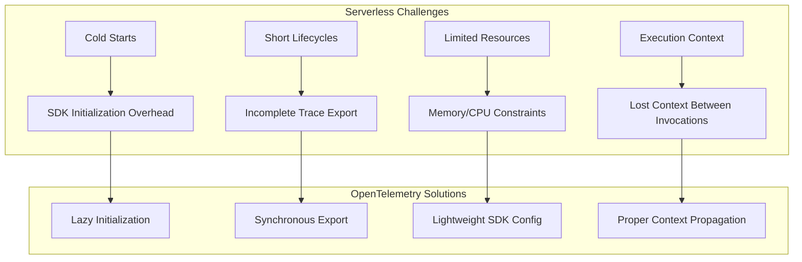
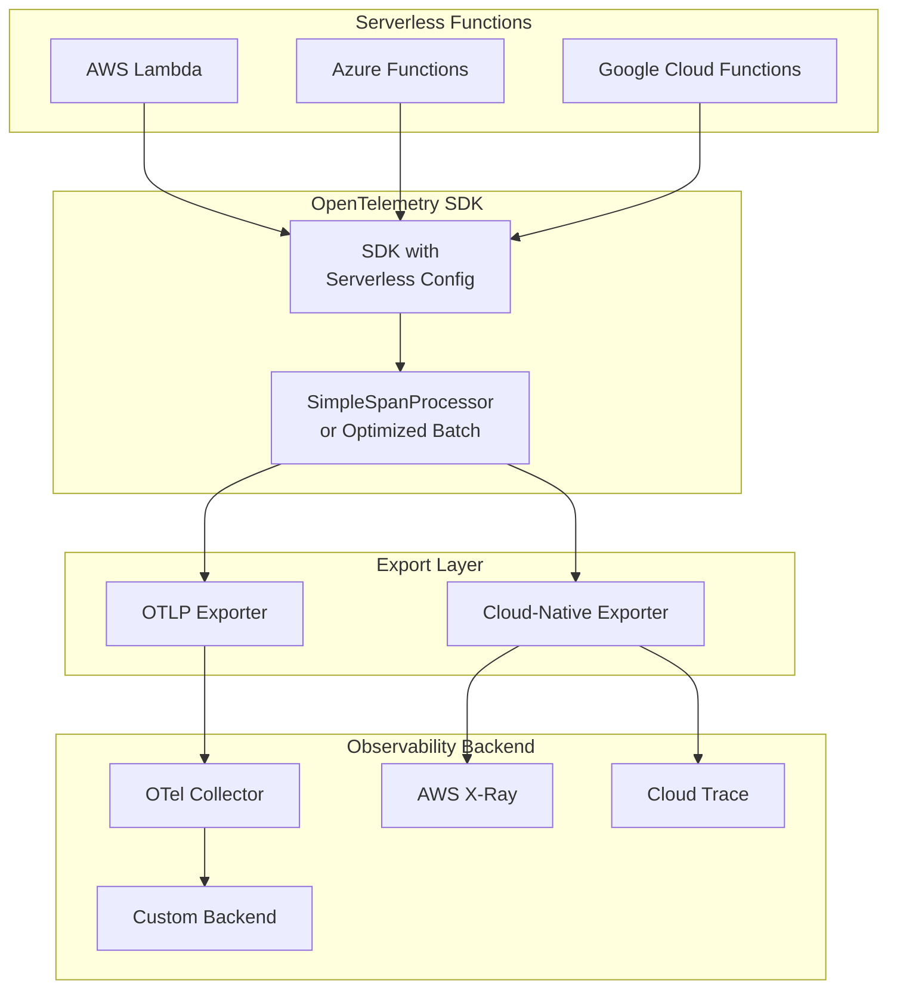

# How to Configure OpenTelemetry for Serverless

Author: [nawazdhandala](https://www.github.com/nawazdhandala)

Tags: OpenTelemetry, Serverless, AWS Lambda, Azure Functions, Google Cloud Functions, Observability, Tracing, Metrics

Description: Learn how to properly configure OpenTelemetry for serverless environments including AWS Lambda, Azure Functions, and Google Cloud Functions.

---

Configuring OpenTelemetry for serverless environments presents unique challenges compared to traditional long-running applications. Serverless functions have short lifecycles, cold starts, and limited control over the execution environment. This guide walks you through the essential configuration steps to get reliable observability data from your serverless workloads.

## Understanding Serverless Observability Challenges



## AWS Lambda Configuration

AWS Lambda is one of the most popular serverless platforms. Here is how to configure OpenTelemetry properly.

### Using the AWS Lambda Layer

The simplest approach is to use the official OpenTelemetry Lambda Layer:

```yaml
# serverless.yml configuration for AWS Lambda
# This configuration adds the OpenTelemetry collector layer and environment variables

service: my-service

provider:
  name: aws
  runtime: nodejs18.x
  # Environment variables for OpenTelemetry configuration
  environment:
    # Enable auto-instrumentation for AWS SDK calls
    AWS_LAMBDA_EXEC_WRAPPER: /opt/otel-handler
    # Configure the OTLP endpoint where traces will be sent
    OTEL_EXPORTER_OTLP_ENDPOINT: https://your-collector.example.com:4318
    # Set the service name for identification in your observability backend
    OTEL_SERVICE_NAME: ${self:service}
    # Use the batch processor for better performance
    OTEL_TRACES_SAMPLER: parentbased_traceidratio
    OTEL_TRACES_SAMPLER_ARG: "1.0"

functions:
  hello:
    handler: handler.hello
    layers:
      # Add the OpenTelemetry Lambda Layer for your region
      - arn:aws:lambda:us-east-1:901920570463:layer:aws-otel-nodejs-amd64-ver-1-18-1:1
```

### Manual SDK Configuration for Node.js Lambda

For more control over the instrumentation, configure the SDK manually:

```javascript
// tracing.js - OpenTelemetry initialization for AWS Lambda
// This file should be required before your handler code

const { NodeTracerProvider } = require('@opentelemetry/sdk-trace-node');
const { BatchSpanProcessor } = require('@opentelemetry/sdk-trace-base');
const { OTLPTraceExporter } = require('@opentelemetry/exporter-trace-otlp-http');
const { AWSXRayPropagator } = require('@opentelemetry/propagator-aws-xray');
const { AWSXRayIdGenerator } = require('@opentelemetry/id-generator-aws-xray');
const { AwsInstrumentation } = require('@opentelemetry/instrumentation-aws-sdk');
const { AwsLambdaInstrumentation } = require('@opentelemetry/instrumentation-aws-lambda');
const { registerInstrumentations } = require('@opentelemetry/instrumentation');
const { Resource } = require('@opentelemetry/resources');
const { SemanticResourceAttributes } = require('@opentelemetry/semantic-conventions');

// Create a resource that identifies your service
const resource = new Resource({
  [SemanticResourceAttributes.SERVICE_NAME]: process.env.AWS_LAMBDA_FUNCTION_NAME,
  [SemanticResourceAttributes.SERVICE_VERSION]: process.env.AWS_LAMBDA_FUNCTION_VERSION,
  [SemanticResourceAttributes.CLOUD_PROVIDER]: 'aws',
  [SemanticResourceAttributes.CLOUD_PLATFORM]: 'aws_lambda',
  [SemanticResourceAttributes.FAAS_NAME]: process.env.AWS_LAMBDA_FUNCTION_NAME,
});

// Configure the OTLP exporter to send traces to your collector
const traceExporter = new OTLPTraceExporter({
  url: process.env.OTEL_EXPORTER_OTLP_ENDPOINT + '/v1/traces',
  // Set a shorter timeout for serverless environments
  timeoutMillis: 5000,
});

// Create the tracer provider with AWS X-Ray compatible ID generation
const provider = new NodeTracerProvider({
  resource: resource,
  // Use AWS X-Ray ID generator for compatibility with AWS tracing
  idGenerator: new AWSXRayIdGenerator(),
});

// Add the batch processor with serverless-optimized settings
provider.addSpanProcessor(new BatchSpanProcessor(traceExporter, {
  // Smaller batch size for faster export in short-lived functions
  maxExportBatchSize: 10,
  // Shorter delay to ensure spans are exported before function ends
  scheduledDelayMillis: 100,
  // Shorter timeout for export operations
  exportTimeoutMillis: 5000,
}));

// Register the provider globally
provider.register({
  // Use AWS X-Ray propagator for trace context propagation
  propagator: new AWSXRayPropagator(),
});

// Register instrumentations for automatic tracing
registerInstrumentations({
  instrumentations: [
    // Automatically trace AWS SDK calls (DynamoDB, S3, SQS, etc.)
    new AwsInstrumentation({
      suppressInternalInstrumentation: true,
    }),
    // Automatically trace Lambda invocations
    new AwsLambdaInstrumentation({
      disableAwsContextPropagation: false,
    }),
  ],
});

// Export a function to force flush spans before Lambda freezes
module.exports.forceFlush = async () => {
  await provider.forceFlush();
};
```

### Lambda Handler with Proper Flush

```javascript
// handler.js - Lambda handler with OpenTelemetry tracing
const { forceFlush } = require('./tracing');
const { trace, context, SpanStatusCode } = require('@opentelemetry/api');

// Get a tracer for creating custom spans
const tracer = trace.getTracer('my-lambda-function');

exports.hello = async (event, lambdaContext) => {
  // Create a custom span for your business logic
  return tracer.startActiveSpan('process-request', async (span) => {
    try {
      // Add relevant attributes to the span for debugging
      span.setAttribute('request.id', event.requestContext?.requestId);
      span.setAttribute('http.method', event.httpMethod);
      span.setAttribute('http.path', event.path);

      // Your business logic here
      const result = await processEvent(event);

      // Mark the span as successful
      span.setStatus({ code: SpanStatusCode.OK });

      return {
        statusCode: 200,
        body: JSON.stringify(result),
      };
    } catch (error) {
      // Record the error on the span
      span.recordException(error);
      span.setStatus({
        code: SpanStatusCode.ERROR,
        message: error.message,
      });

      return {
        statusCode: 500,
        body: JSON.stringify({ error: error.message }),
      };
    } finally {
      // End the span
      span.end();

      // CRITICAL: Force flush spans before Lambda freezes
      // This ensures all spans are exported before the function ends
      await forceFlush();
    }
  });
};

async function processEvent(event) {
  // Create child spans for sub-operations
  return tracer.startActiveSpan('business-logic', async (span) => {
    try {
      // Simulate some work
      const data = JSON.parse(event.body || '{}');
      span.setAttribute('data.keys', Object.keys(data).join(','));

      return { processed: true, timestamp: Date.now() };
    } finally {
      span.end();
    }
  });
}
```

## Azure Functions Configuration

For Azure Functions, you need to configure OpenTelemetry to work with the Functions runtime.

```javascript
// src/functions/tracing.js - OpenTelemetry setup for Azure Functions
const { NodeTracerProvider } = require('@opentelemetry/sdk-trace-node');
const { SimpleSpanProcessor, BatchSpanProcessor } = require('@opentelemetry/sdk-trace-base');
const { OTLPTraceExporter } = require('@opentelemetry/exporter-trace-otlp-http');
const { Resource } = require('@opentelemetry/resources');
const { SemanticResourceAttributes } = require('@opentelemetry/semantic-conventions');
const { W3CTraceContextPropagator } = require('@opentelemetry/core');
const { HttpInstrumentation } = require('@opentelemetry/instrumentation-http');
const { registerInstrumentations } = require('@opentelemetry/instrumentation');

// Detect if running in Azure Functions environment
const isAzureFunctions = process.env.FUNCTIONS_WORKER_RUNTIME !== undefined;

const resource = new Resource({
  [SemanticResourceAttributes.SERVICE_NAME]: process.env.WEBSITE_SITE_NAME || 'azure-function',
  [SemanticResourceAttributes.SERVICE_VERSION]: '1.0.0',
  [SemanticResourceAttributes.CLOUD_PROVIDER]: 'azure',
  [SemanticResourceAttributes.CLOUD_PLATFORM]: 'azure_functions',
  // Azure-specific attributes
  'azure.function.name': process.env.WEBSITE_SITE_NAME,
  'azure.region': process.env.REGION_NAME,
});

const exporter = new OTLPTraceExporter({
  url: process.env.OTEL_EXPORTER_OTLP_ENDPOINT,
  headers: {
    // Add any required authentication headers
    'Authorization': `Bearer ${process.env.OTEL_AUTH_TOKEN}`,
  },
});

const provider = new NodeTracerProvider({
  resource: resource,
});

// Use SimpleSpanProcessor for Azure Functions to ensure immediate export
// BatchSpanProcessor may lose spans if the function ends before the batch is exported
if (isAzureFunctions) {
  provider.addSpanProcessor(new SimpleSpanProcessor(exporter));
} else {
  provider.addSpanProcessor(new BatchSpanProcessor(exporter));
}

provider.register({
  propagator: new W3CTraceContextPropagator(),
});

registerInstrumentations({
  instrumentations: [
    new HttpInstrumentation({
      // Ignore health check endpoints
      ignoreIncomingPaths: ['/api/health', '/api/ready'],
    }),
  ],
});

module.exports = { provider };
```

### Azure Function Handler

```javascript
// src/functions/httpTrigger.js - Azure Function with OpenTelemetry
const { app } = require('@azure/functions');
const { trace, SpanStatusCode } = require('@opentelemetry/api');
const { provider } = require('./tracing');

const tracer = trace.getTracer('azure-function');

app.http('httpTrigger', {
  methods: ['GET', 'POST'],
  authLevel: 'anonymous',
  handler: async (request, context) => {
    // Start a span for the function invocation
    return tracer.startActiveSpan('http-trigger', async (span) => {
      try {
        // Add function context as span attributes
        span.setAttribute('az.function.invocation_id', context.invocationId);
        span.setAttribute('http.method', request.method);
        span.setAttribute('http.url', request.url);

        // Process the request
        const body = await request.text();
        const result = await processRequest(body);

        span.setStatus({ code: SpanStatusCode.OK });

        return {
          status: 200,
          jsonBody: result,
        };
      } catch (error) {
        span.recordException(error);
        span.setStatus({
          code: SpanStatusCode.ERROR,
          message: error.message,
        });

        return {
          status: 500,
          jsonBody: { error: error.message },
        };
      } finally {
        span.end();
        // Force flush to ensure spans are exported
        await provider.forceFlush();
      }
    });
  },
});
```

## Google Cloud Functions Configuration

```javascript
// index.js - Google Cloud Function with OpenTelemetry
const { NodeTracerProvider } = require('@opentelemetry/sdk-trace-node');
const { SimpleSpanProcessor } = require('@opentelemetry/sdk-trace-base');
const { TraceExporter } = require('@google-cloud/opentelemetry-cloud-trace-exporter');
const { Resource } = require('@opentelemetry/resources');
const { SemanticResourceAttributes } = require('@opentelemetry/semantic-conventions');
const { trace, SpanStatusCode } = require('@opentelemetry/api');
const { CloudPropagator } = require('@google-cloud/opentelemetry-cloud-trace-propagator');

// Initialize tracing before the function handler
const resource = new Resource({
  [SemanticResourceAttributes.SERVICE_NAME]: process.env.FUNCTION_NAME || 'cloud-function',
  [SemanticResourceAttributes.SERVICE_VERSION]: '1.0.0',
  [SemanticResourceAttributes.CLOUD_PROVIDER]: 'gcp',
  [SemanticResourceAttributes.CLOUD_PLATFORM]: 'gcp_cloud_functions',
  [SemanticResourceAttributes.FAAS_NAME]: process.env.FUNCTION_NAME,
  [SemanticResourceAttributes.FAAS_VERSION]: process.env.X_GOOGLE_FUNCTION_VERSION,
});

// Use Google Cloud Trace Exporter for native integration
const exporter = new TraceExporter({
  // Project ID is auto-detected from environment
});

const provider = new NodeTracerProvider({
  resource: resource,
});

// Use SimpleSpanProcessor for immediate export in serverless
provider.addSpanProcessor(new SimpleSpanProcessor(exporter));

provider.register({
  // Use Cloud Trace propagator for compatibility with GCP tracing
  propagator: new CloudPropagator(),
});

const tracer = trace.getTracer('cloud-function');

// HTTP-triggered Cloud Function
exports.helloWorld = async (req, res) => {
  return tracer.startActiveSpan('cloud-function-handler', async (span) => {
    try {
      // Extract trace context from incoming request headers
      span.setAttribute('http.method', req.method);
      span.setAttribute('http.url', req.url);
      span.setAttribute('gcp.function.execution_id', req.headers['function-execution-id']);

      // Your business logic
      const result = await handleRequest(req);

      span.setStatus({ code: SpanStatusCode.OK });
      res.status(200).json(result);
    } catch (error) {
      span.recordException(error);
      span.setStatus({
        code: SpanStatusCode.ERROR,
        message: error.message,
      });
      res.status(500).json({ error: error.message });
    } finally {
      span.end();
      // Force flush before function terminates
      await provider.forceFlush();
    }
  });
};

// Pub/Sub-triggered Cloud Function
exports.pubsubHandler = async (message, context) => {
  return tracer.startActiveSpan('pubsub-handler', async (span) => {
    try {
      span.setAttribute('gcp.pubsub.message_id', context.eventId);
      span.setAttribute('gcp.pubsub.topic', context.resource.name);

      // Decode and process the message
      const data = Buffer.from(message.data, 'base64').toString();
      const payload = JSON.parse(data);

      await processMessage(payload);

      span.setStatus({ code: SpanStatusCode.OK });
    } catch (error) {
      span.recordException(error);
      span.setStatus({
        code: SpanStatusCode.ERROR,
        message: error.message,
      });
      throw error; // Re-throw to trigger retry
    } finally {
      span.end();
      await provider.forceFlush();
    }
  });
};
```

## Architecture Overview



## Best Practices for Serverless OpenTelemetry

### 1. Use Synchronous or Fast Batch Export

```javascript
// Configuration for fast batch export in serverless
const { BatchSpanProcessor } = require('@opentelemetry/sdk-trace-base');

// Optimized batch processor settings for serverless
const batchProcessor = new BatchSpanProcessor(exporter, {
  // Export smaller batches more frequently
  maxExportBatchSize: 5,
  // Very short delay to catch spans before function ends
  scheduledDelayMillis: 50,
  // Short timeout for export operations
  exportTimeoutMillis: 3000,
  // Smaller queue to reduce memory usage
  maxQueueSize: 100,
});
```

### 2. Always Force Flush Before Function Ends

```javascript
// Wrapper function to ensure flush on every invocation
function withTracing(handler) {
  return async (event, context) => {
    try {
      return await handler(event, context);
    } finally {
      // Always flush, even if handler throws
      await provider.forceFlush().catch(err => {
        console.error('Failed to flush spans:', err);
      });
    }
  };
}

// Use the wrapper
exports.handler = withTracing(async (event, context) => {
  // Your handler code
});
```

### 3. Handle Cold Starts Gracefully

```javascript
// tracing.js - Lazy initialization for cold start optimization
let provider = null;
let initialized = false;

function initializeTracing() {
  if (initialized) return provider;

  const { NodeTracerProvider } = require('@opentelemetry/sdk-trace-node');
  // ... other imports

  provider = new NodeTracerProvider({
    resource: createResource(),
  });

  provider.addSpanProcessor(createSpanProcessor());
  provider.register();

  initialized = true;
  return provider;
}

// Export lazy getter
module.exports = {
  getProvider: () => {
    if (!provider) {
      initializeTracing();
    }
    return provider;
  },
  getTracer: (name) => {
    initializeTracing();
    return trace.getTracer(name);
  },
};
```

### 4. Add Serverless-Specific Attributes

```javascript
// Add comprehensive serverless context to spans
function addServerlessAttributes(span, context) {
  // Common serverless attributes
  span.setAttribute('faas.execution', context.awsRequestId || context.invocationId);
  span.setAttribute('faas.coldstart', isColdStart());
  span.setAttribute('faas.trigger', determineTriggerType(context));

  // Memory and timeout context
  if (context.memoryLimitInMB) {
    span.setAttribute('faas.max_memory', context.memoryLimitInMB);
  }
  if (context.getRemainingTimeInMillis) {
    span.setAttribute('faas.timeout_ms', context.getRemainingTimeInMillis());
  }
}

// Track cold starts
let _isColdStart = true;
function isColdStart() {
  const wasCold = _isColdStart;
  _isColdStart = false;
  return wasCold;
}
```

## Troubleshooting Common Issues

### Missing Spans After Function Completion

If spans are not appearing in your backend, ensure you are flushing:

```javascript
// Always await the flush operation
await provider.forceFlush();

// Add a small delay if needed (some backends need time to process)
await new Promise(resolve => setTimeout(resolve, 100));
```

### High Cold Start Latency

Reduce initialization overhead by deferring non-critical setup:

```javascript
// Only initialize tracing if not in a local development environment
if (process.env.NODE_ENV !== 'development') {
  require('./tracing');
}
```

### Context Propagation Issues

Ensure trace context is properly extracted from incoming requests:

```javascript
const { propagation, context } = require('@opentelemetry/api');

// Extract context from incoming HTTP headers
const extractedContext = propagation.extract(
  context.active(),
  request.headers,
  // Use default text map getter
);

// Run your code within the extracted context
context.with(extractedContext, () => {
  // Spans created here will be linked to the incoming trace
});
```

## Conclusion

Configuring OpenTelemetry for serverless requires attention to the unique constraints of these environments. The key principles are: use synchronous or fast batch export, always force flush before function termination, handle cold starts efficiently, and add serverless-specific context to your spans. With proper configuration, you can achieve comprehensive observability across your serverless workloads while minimizing the impact on cold start times and execution duration.
