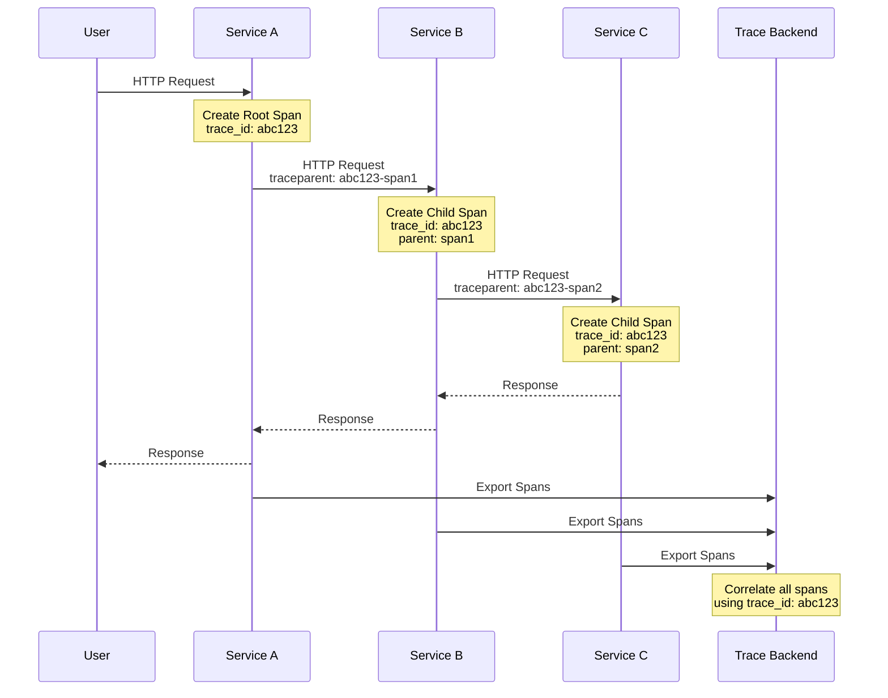
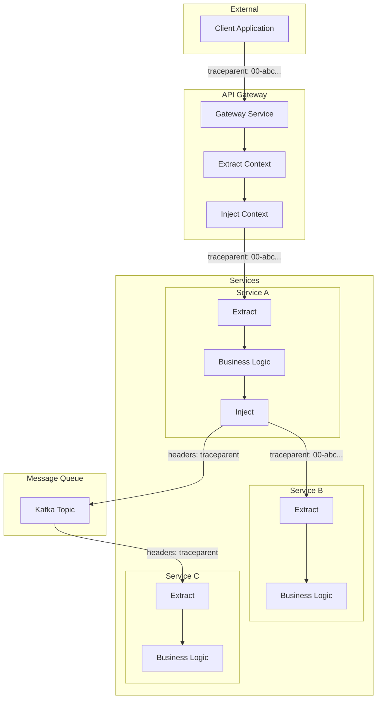

# How to Handle Span Context Propagation in OpenTelemetry

Author: [nawazdhandala](https://www.github.com/nawazdhandala)

Tags: OpenTelemetry, Tracing, Context Propagation, Distributed Tracing, Microservices, Observability

Description: Learn how to properly propagate trace context across service boundaries in distributed systems using OpenTelemetry.

---

In distributed systems, a single user request often spans multiple services. To understand the full journey of a request, you need to connect traces across service boundaries. This is where context propagation comes in. In this guide, we will explore how OpenTelemetry handles context propagation and how to implement it correctly in your applications.

## What is Context Propagation?

Context propagation is the mechanism by which trace information is passed from one service to another. When Service A calls Service B, the trace context (including the trace ID and span ID) must be transmitted so that Service B can create child spans that are linked to the parent trace.



## W3C Trace Context Standard

OpenTelemetry uses the W3C Trace Context standard by default. This standard defines two HTTP headers:

- **traceparent**: Contains the trace ID, parent span ID, and trace flags
- **tracestate**: Contains vendor-specific trace information

```
traceparent: 00-0af7651916cd43dd8448eb211c80319c-b7ad6b7169203331-01
             |  |                                |                |
             |  |                                |                +-- Trace flags (01 = sampled)
             |  |                                +------------------- Parent span ID (16 hex chars)
             |  +--------------------------------------------------- Trace ID (32 hex characters)
             +------------------------------------------------------ Version (always 00)
```

## Configuring Propagators

### Setting Up Propagators in Node.js

```javascript
// propagation-setup.js
// Configure context propagation in Node.js

const { NodeSDK } = require('@opentelemetry/sdk-node');
const { W3CTraceContextPropagator } = require('@opentelemetry/core');
const {
  CompositePropagator,
  W3CBaggagePropagator,
} = require('@opentelemetry/core');
const { B3Propagator, B3InjectEncoding } = require('@opentelemetry/propagator-b3');

// Option 1: Use W3C Trace Context only (default)
const w3cPropagator = new W3CTraceContextPropagator();

// Option 2: Use composite propagator for multiple formats
// This is useful when communicating with services that use different formats
const compositePropagator = new CompositePropagator({
  propagators: [
    // W3C Trace Context (standard)
    new W3CTraceContextPropagator(),
    // W3C Baggage for custom context data
    new W3CBaggagePropagator(),
    // B3 format for Zipkin compatibility
    new B3Propagator({
      // Use multi-header format for B3
      injectEncoding: B3InjectEncoding.MULTI_HEADER,
    }),
  ],
});

// Configure the SDK with the propagator
const sdk = new NodeSDK({
  // ... other configuration
  textMapPropagator: compositePropagator,
});

sdk.start();
```

### Setting Up Propagators in Python

```python
# propagation_setup.py
# Configure context propagation in Python

from opentelemetry import propagate
from opentelemetry.propagators.composite import CompositePropagator
from opentelemetry.propagators.b3 import B3MultiFormat
from opentelemetry.trace.propagation.tracecontext import TraceContextTextMapPropagator
from opentelemetry.baggage.propagation import W3CBaggagePropagator

# Option 1: Use W3C Trace Context only (default)
propagate.set_global_textmap(TraceContextTextMapPropagator())

# Option 2: Use composite propagator for multiple formats
composite_propagator = CompositePropagator([
    # W3C Trace Context (standard)
    TraceContextTextMapPropagator(),
    # W3C Baggage for custom context data
    W3CBaggagePropagator(),
    # B3 format for Zipkin compatibility
    B3MultiFormat(),
])

propagate.set_global_textmap(composite_propagator)
```

### Using Environment Variables

```bash
# Configure propagators via environment variable
# Comma-separated list of propagator names
export OTEL_PROPAGATORS=tracecontext,baggage,b3multi

# Available propagators:
# - tracecontext: W3C Trace Context
# - baggage: W3C Baggage
# - b3: B3 Single Header
# - b3multi: B3 Multi Header
# - jaeger: Jaeger format
# - xray: AWS X-Ray format
```

## Manual Context Propagation

### HTTP Client (Outgoing Requests)

```javascript
// http-client-propagation.js
// Manually inject trace context into outgoing HTTP requests

const { trace, context, propagation } = require('@opentelemetry/api');
const https = require('https');

async function makeTracedRequest(url, options = {}) {
  // Get the current tracer
  const tracer = trace.getTracer('http-client');

  // Start a span for the outgoing request
  return tracer.startActiveSpan('HTTP GET', async (span) => {
    try {
      // Add span attributes
      span.setAttribute('http.method', 'GET');
      span.setAttribute('http.url', url);

      // Create headers object if it doesn't exist
      options.headers = options.headers || {};

      // Inject trace context into headers
      // This adds traceparent and tracestate headers
      propagation.inject(context.active(), options.headers);

      console.log('Injected headers:', options.headers);
      // Output: { traceparent: '00-abc123...-def456...-01' }

      // Make the HTTP request with traced headers
      const response = await fetch(url, options);

      // Record response status
      span.setAttribute('http.status_code', response.status);

      return response;
    } catch (error) {
      // Record error
      span.recordException(error);
      span.setStatus({ code: 2, message: error.message });
      throw error;
    } finally {
      span.end();
    }
  });
}

// Example usage
makeTracedRequest('https://api.example.com/users')
  .then(response => console.log('Response received'))
  .catch(error => console.error('Request failed:', error));
```

### HTTP Server (Incoming Requests)

```javascript
// http-server-propagation.js
// Extract trace context from incoming HTTP requests

const { trace, context, propagation } = require('@opentelemetry/api');
const express = require('express');

const app = express();
const tracer = trace.getTracer('http-server');

// Middleware to extract and use trace context
app.use((req, res, next) => {
  // Extract trace context from incoming headers
  const extractedContext = propagation.extract(context.active(), req.headers);

  // Create a span within the extracted context
  // This ensures the new span is a child of the incoming trace
  context.with(extractedContext, () => {
    const span = tracer.startSpan('HTTP ' + req.method + ' ' + req.path);

    // Add request attributes
    span.setAttribute('http.method', req.method);
    span.setAttribute('http.url', req.url);
    span.setAttribute('http.route', req.path);

    // Store span in request for later use
    req.span = span;

    // End span when response is finished
    res.on('finish', () => {
      span.setAttribute('http.status_code', res.statusCode);
      span.end();
    });

    next();
  });
});

// Example route handler
app.get('/api/users', (req, res) => {
  // The request is already being traced
  // Any child spans created here will be linked to the parent trace

  const span = tracer.startSpan('fetch-users-from-db');
  // ... database operation
  span.end();

  res.json({ users: [] });
});

app.listen(3000, () => {
  console.log('Server listening on port 3000');
});
```

### Python HTTP Client

```python
# http_client_propagation.py
# Manually inject trace context into outgoing HTTP requests

import requests
from opentelemetry import trace, context, propagate
from opentelemetry.trace import SpanKind

tracer = trace.get_tracer(__name__)

def make_traced_request(url: str, method: str = "GET", **kwargs) -> requests.Response:
    """
    Make an HTTP request with trace context propagation.

    Args:
        url: The URL to request
        method: HTTP method (GET, POST, etc.)
        **kwargs: Additional arguments passed to requests

    Returns:
        The HTTP response
    """
    with tracer.start_as_current_span(
        f"HTTP {method}",
        kind=SpanKind.CLIENT,
    ) as span:
        # Add span attributes
        span.set_attribute("http.method", method)
        span.set_attribute("http.url", url)

        # Get or create headers dict
        headers = kwargs.get("headers", {})

        # Inject trace context into headers
        propagate.inject(headers)
        kwargs["headers"] = headers

        print(f"Injected headers: {headers}")
        # Output: {'traceparent': '00-abc123...-def456...-01'}

        try:
            # Make the request
            response = requests.request(method, url, **kwargs)

            # Record response status
            span.set_attribute("http.status_code", response.status_code)

            return response

        except Exception as e:
            span.record_exception(e)
            span.set_status(trace.Status(trace.StatusCode.ERROR, str(e)))
            raise

# Example usage
response = make_traced_request("https://api.example.com/users")
print(f"Status: {response.status_code}")
```

### Python HTTP Server (Flask)

```python
# http_server_propagation.py
# Extract trace context from incoming HTTP requests in Flask

from flask import Flask, request, g
from opentelemetry import trace, context, propagate
from opentelemetry.trace import SpanKind

app = Flask(__name__)
tracer = trace.get_tracer(__name__)

@app.before_request
def extract_trace_context():
    """
    Extract trace context from incoming request headers.
    This middleware ensures all request handling is traced.
    """
    # Extract context from incoming headers
    ctx = propagate.extract(carrier=request.headers)

    # Store the extracted context for use in request handlers
    g.trace_context = ctx

    # Start a span for this request within the extracted context
    token = context.attach(ctx)
    g.context_token = token

    span = tracer.start_span(
        f"HTTP {request.method} {request.path}",
        kind=SpanKind.SERVER,
    )

    # Add request attributes
    span.set_attribute("http.method", request.method)
    span.set_attribute("http.url", request.url)
    span.set_attribute("http.route", request.path)

    g.request_span = span

@app.after_request
def end_trace_span(response):
    """
    End the request span and record response status.
    """
    if hasattr(g, 'request_span'):
        g.request_span.set_attribute("http.status_code", response.status_code)
        g.request_span.end()

    if hasattr(g, 'context_token'):
        context.detach(g.context_token)

    return response

@app.route('/api/users')
def get_users():
    """
    Example endpoint that creates child spans.
    """
    # This span will be a child of the request span
    with tracer.start_as_current_span("fetch-users-from-db") as span:
        span.set_attribute("db.system", "postgresql")
        # ... database operation
        users = []

    return {"users": users}

if __name__ == '__main__':
    app.run(port=3000)
```

## Context Propagation Across Message Queues

### Kafka Producer

```javascript
// kafka-producer-propagation.js
// Inject trace context into Kafka messages

const { trace, context, propagation } = require('@opentelemetry/api');
const { Kafka } = require('kafkajs');

const kafka = new Kafka({ brokers: ['localhost:9092'] });
const producer = kafka.producer();
const tracer = trace.getTracer('kafka-producer');

async function sendTracedMessage(topic, message) {
  return tracer.startActiveSpan('kafka.produce', async (span) => {
    try {
      span.setAttribute('messaging.system', 'kafka');
      span.setAttribute('messaging.destination', topic);
      span.setAttribute('messaging.destination_kind', 'topic');

      // Create headers object for context propagation
      const headers = {};

      // Inject trace context into message headers
      propagation.inject(context.active(), headers);

      // Convert header values to Buffer (Kafka requirement)
      const kafkaHeaders = {};
      for (const [key, value] of Object.entries(headers)) {
        kafkaHeaders[key] = Buffer.from(value);
      }

      // Send message with trace context in headers
      await producer.send({
        topic,
        messages: [{
          value: JSON.stringify(message),
          headers: kafkaHeaders,
        }],
      });

      span.setStatus({ code: 0 });
    } catch (error) {
      span.recordException(error);
      span.setStatus({ code: 2, message: error.message });
      throw error;
    } finally {
      span.end();
    }
  });
}
```

### Kafka Consumer

```javascript
// kafka-consumer-propagation.js
// Extract trace context from Kafka messages

const { trace, context, propagation } = require('@opentelemetry/api');
const { Kafka } = require('kafkajs');

const kafka = new Kafka({ brokers: ['localhost:9092'] });
const consumer = kafka.consumer({ groupId: 'my-group' });
const tracer = trace.getTracer('kafka-consumer');

async function processMessage(message) {
  // Convert Kafka headers (Buffer) back to strings
  const headers = {};
  if (message.headers) {
    for (const [key, value] of Object.entries(message.headers)) {
      headers[key] = value.toString();
    }
  }

  // Extract trace context from message headers
  const extractedContext = propagation.extract(context.active(), headers);

  // Process message within the extracted context
  return context.with(extractedContext, () => {
    return tracer.startActiveSpan('kafka.process', (span) => {
      try {
        span.setAttribute('messaging.system', 'kafka');
        span.setAttribute('messaging.operation', 'process');

        // Parse and process the message
        const payload = JSON.parse(message.value.toString());
        console.log('Processing message:', payload);

        // Your business logic here

        span.setStatus({ code: 0 });
      } catch (error) {
        span.recordException(error);
        span.setStatus({ code: 2, message: error.message });
        throw error;
      } finally {
        span.end();
      }
    });
  });
}

// Consumer setup
async function startConsumer() {
  await consumer.connect();
  await consumer.subscribe({ topic: 'my-topic' });

  await consumer.run({
    eachMessage: async ({ message }) => {
      await processMessage(message);
    },
  });
}
```

## Propagation Flow in Microservices



## Using Baggage for Custom Context

Baggage allows you to propagate custom key-value pairs alongside trace context.

```javascript
// baggage-example.js
// Using baggage to propagate custom context

const { trace, context, propagation, baggage } = require('@opentelemetry/api');

// Service A: Set baggage values
function serviceA() {
  // Create baggage entries
  const bag = baggage.setEntry(
    baggage.active(),
    'user.id',
    { value: 'user-123' }
  );

  const bagWithTenant = baggage.setEntry(
    bag,
    'tenant.id',
    { value: 'tenant-456' }
  );

  // Run code with baggage context
  context.with(baggage.setActiveBaggage(bagWithTenant), () => {
    // Baggage will be automatically propagated
    // when making outgoing requests
    makeOutgoingRequest();
  });
}

// Service B: Read baggage values
function serviceB(incomingHeaders) {
  // Extract context (includes baggage)
  const extractedContext = propagation.extract(context.active(), incomingHeaders);

  context.with(extractedContext, () => {
    // Read baggage values
    const currentBaggage = baggage.getActiveBaggage();

    const userId = currentBaggage.getEntry('user.id');
    const tenantId = currentBaggage.getEntry('tenant.id');

    console.log('User ID:', userId?.value);     // 'user-123'
    console.log('Tenant ID:', tenantId?.value); // 'tenant-456'

    // Use baggage values in your business logic
    // e.g., for multi-tenant data isolation
  });
}
```

## Troubleshooting Context Propagation

### Common Issues

1. **Broken traces (spans not connected)**
   - Verify headers are being injected and extracted
   - Check that the same propagator format is used across services

2. **Missing traceparent header**
   - Ensure propagation.inject() is called before making requests
   - Verify the active context contains a span

3. **Context lost in async operations**
   - Use context.with() to maintain context across async boundaries
   - Ensure auto-instrumentation is properly configured

### Debug Logging

```javascript
// Enable debug logging to see propagation in action
const { diag, DiagConsoleLogger, DiagLogLevel } = require('@opentelemetry/api');

// Set up diagnostic logging
diag.setLogger(new DiagConsoleLogger(), DiagLogLevel.DEBUG);

// Now you'll see logs like:
// @opentelemetry/api: Injecting trace context
// @opentelemetry/api: Extracting trace context from headers
```

### Verifying Headers

```javascript
// Utility function to verify trace headers
function verifyTraceHeaders(headers) {
  const traceparent = headers['traceparent'];

  if (!traceparent) {
    console.error('Missing traceparent header');
    return false;
  }

  // Parse traceparent: version-traceId-parentId-flags
  const parts = traceparent.split('-');

  if (parts.length !== 4) {
    console.error('Invalid traceparent format');
    return false;
  }

  const [version, traceId, parentId, flags] = parts;

  console.log('Trace Context:');
  console.log('  Version:', version);
  console.log('  Trace ID:', traceId);
  console.log('  Parent ID:', parentId);
  console.log('  Flags:', flags);
  console.log('  Sampled:', flags === '01');

  return true;
}
```

## Best Practices

1. **Use W3C Trace Context** as the primary propagation format for interoperability
2. **Configure composite propagators** when integrating with legacy systems
3. **Always extract context** at service entry points
4. **Always inject context** before making outgoing calls
5. **Use baggage sparingly** as it adds overhead to every request
6. **Test propagation** by verifying traces span multiple services

## Summary

Context propagation is essential for distributed tracing in microservices architectures. OpenTelemetry provides robust support for multiple propagation formats, with W3C Trace Context as the default standard. By properly configuring propagators and ensuring context is injected and extracted at service boundaries, you can achieve complete visibility into request flows across your entire system.

**Related Reading:**

- [How to Set Up OpenTelemetry Collector for Traces](https://oneuptime.com/blog/post/2026-01-24-opentelemetry-collector-traces-setup/view)
- [How to Configure OpenTelemetry Auto-Instrumentation](https://oneuptime.com/blog/post/2026-01-24-opentelemetry-auto-instrumentation/view)
- [How to Fix "Exporter Failed" Errors in OpenTelemetry](https://oneuptime.com/blog/post/2026-01-24-opentelemetry-exporter-failed-errors/view)
