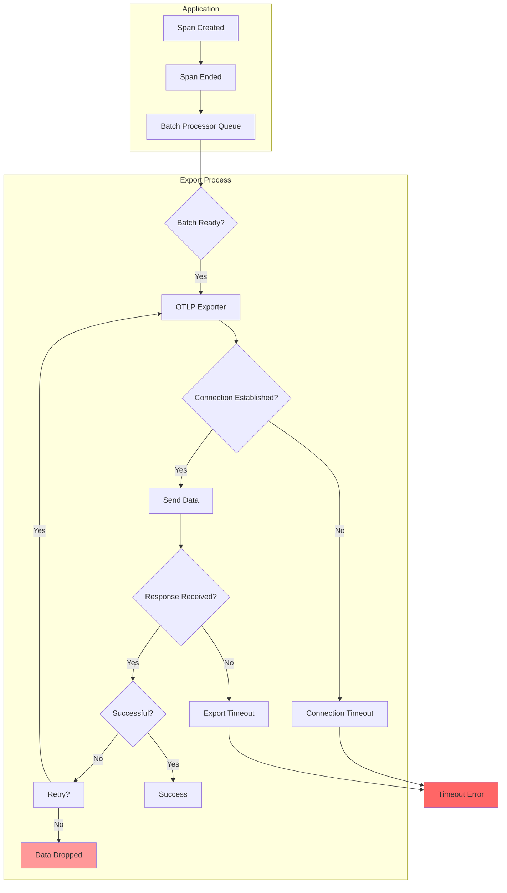
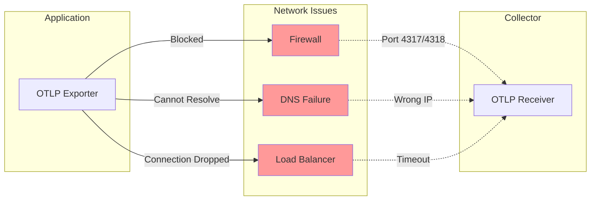
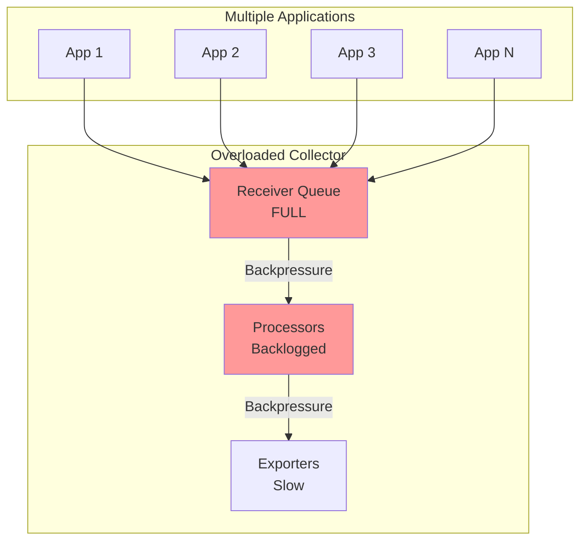
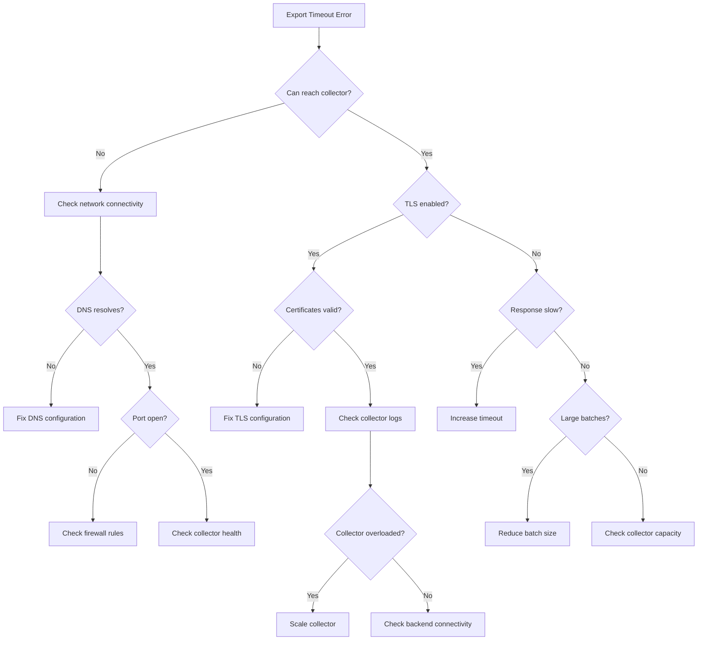

# How to Fix "Timeout" Errors in OpenTelemetry Export

Author: [nawazdhandala](https://www.github.com/nawazdhandala)

Tags: OpenTelemetry, Observability, Troubleshooting, OTLP, Export, Timeout, Performance, Debugging

Description: A practical guide to diagnosing and fixing timeout errors when exporting telemetry data in OpenTelemetry, covering configuration tuning, network troubleshooting, and best practices.

---

> Timeout errors during OpenTelemetry export are among the most common issues when setting up observability pipelines. These errors prevent your traces, metrics, and logs from reaching your backend, creating blind spots in your monitoring. This guide will help you systematically diagnose and fix export timeout issues.

Understanding where timeouts occur in the export pipeline is essential for building reliable observability systems that capture all your telemetry data.

---

## Understanding OpenTelemetry Export Timeouts



### Types of Export Timeouts

| Timeout Type | Configuration | Default | Description |
|-------------|---------------|---------|-------------|
| Connection | `OTEL_EXPORTER_OTLP_TIMEOUT` | 10000ms | Time to establish connection |
| Export | `OTEL_EXPORTER_OTLP_TIMEOUT` | 10000ms | Time to complete export request |
| Batch | `OTEL_BSP_EXPORT_TIMEOUT` | 30000ms | Maximum time for batch export |
| Schedule | `OTEL_BSP_SCHEDULE_DELAY` | 5000ms | Delay between batch exports |

---

## Diagnosing Timeout Issues

### Step 1: Enable Debug Logging

```python
import logging

# Enable detailed OpenTelemetry logging
logging.basicConfig(level=logging.DEBUG)

# Set specific loggers for export debugging
logging.getLogger('opentelemetry.sdk.trace.export').setLevel(logging.DEBUG)
logging.getLogger('opentelemetry.exporter.otlp').setLevel(logging.DEBUG)
```

For Node.js applications:

```javascript
// Enable debug logging for OpenTelemetry
const { diag, DiagConsoleLogger, DiagLogLevel } = require('@opentelemetry/api');

// Set the logger to DEBUG level to see all export details
// Use VERBOSE for even more detailed output
diag.setLogger(new DiagConsoleLogger(), DiagLogLevel.DEBUG);
```

### Step 2: Test Connectivity

```bash
# Test if the OTLP endpoint is reachable
curl -v -X POST https://your-otel-collector:4318/v1/traces \
  -H "Content-Type: application/json" \
  -d '{}'

# Test gRPC endpoint connectivity
grpcurl -plaintext your-otel-collector:4317 list

# Check DNS resolution
nslookup your-otel-collector

# Test with specific timeout
curl --connect-timeout 5 --max-time 10 \
  https://your-otel-collector:4318/v1/traces
```

### Step 3: Identify the Timeout Source

```python
from opentelemetry import trace
from opentelemetry.sdk.trace import TracerProvider
from opentelemetry.sdk.trace.export import BatchSpanProcessor
from opentelemetry.exporter.otlp.proto.grpc.trace_exporter import OTLPSpanExporter
import time

class DiagnosticExporter(OTLPSpanExporter):
    """Wrapper exporter that logs timing information for diagnosis."""

    def export(self, spans):
        start_time = time.time()
        print(f"Starting export of {len(spans)} spans at {start_time}")

        try:
            result = super().export(spans)
            elapsed = time.time() - start_time
            print(f"Export completed in {elapsed:.2f}s with result: {result}")
            return result

        except Exception as e:
            elapsed = time.time() - start_time
            print(f"Export failed after {elapsed:.2f}s: {type(e).__name__}: {e}")
            raise

# Use the diagnostic exporter
exporter = DiagnosticExporter(
    endpoint="http://localhost:4317",
    insecure=True
)
```

---

## Common Causes and Solutions

### Cause 1: Endpoint Not Reachable



**Solution: Verify and Configure Endpoint**

```python
from opentelemetry import trace
from opentelemetry.sdk.trace import TracerProvider
from opentelemetry.sdk.trace.export import BatchSpanProcessor
from opentelemetry.exporter.otlp.proto.grpc.trace_exporter import OTLPSpanExporter
from opentelemetry.exporter.otlp.proto.http.trace_exporter import OTLPSpanExporter as HTTPExporter

# Option 1: gRPC exporter (port 4317)
grpc_exporter = OTLPSpanExporter(
    endpoint="http://collector.example.com:4317",
    insecure=True,  # Set to False for TLS
    timeout=30  # Increase timeout to 30 seconds
)

# Option 2: HTTP exporter (port 4318) - often more firewall-friendly
http_exporter = HTTPExporter(
    endpoint="http://collector.example.com:4318/v1/traces",
    timeout=30
)

# Configure the tracer provider
provider = TracerProvider()
provider.add_span_processor(BatchSpanProcessor(grpc_exporter))
trace.set_tracer_provider(provider)
```

### Cause 2: Timeout Too Short for Network Latency

**Solution: Increase Export Timeout**

Using environment variables:

```bash
# Set export timeout to 30 seconds (in milliseconds)
export OTEL_EXPORTER_OTLP_TIMEOUT=30000

# Set batch processor export timeout
export OTEL_BSP_EXPORT_TIMEOUT=60000

# Increase schedule delay to reduce export frequency
export OTEL_BSP_SCHEDULE_DELAY=10000
```

Using code configuration:

```javascript
const { NodeTracerProvider } = require('@opentelemetry/sdk-trace-node');
const { BatchSpanProcessor } = require('@opentelemetry/sdk-trace-base');
const { OTLPTraceExporter } = require('@opentelemetry/exporter-trace-otlp-grpc');

// Configure exporter with extended timeout
const exporter = new OTLPTraceExporter({
  url: 'http://collector:4317',
  // Timeout in milliseconds for the export request
  timeoutMillis: 30000,
});

// Configure batch processor with appropriate timeouts
const batchProcessor = new BatchSpanProcessor(exporter, {
  // Maximum time to wait for export to complete
  exportTimeoutMillis: 60000,
  // Time to wait before exporting a batch
  scheduledDelayMillis: 5000,
  // Maximum batch size
  maxExportBatchSize: 512,
  // Maximum queue size
  maxQueueSize: 2048,
});

const provider = new NodeTracerProvider();
provider.addSpanProcessor(batchProcessor);
provider.register();
```

### Cause 3: Collector Overloaded



**Solution: Configure Collector for Higher Load**

```yaml
# otel-collector-config.yaml
receivers:
  otlp:
    protocols:
      grpc:
        endpoint: 0.0.0.0:4317
        # Increase max message size for large batches
        max_recv_msg_size_mib: 16
      http:
        endpoint: 0.0.0.0:4318

processors:
  # Add memory limiter to prevent OOM
  memory_limiter:
    check_interval: 1s
    limit_mib: 1000
    spike_limit_mib: 200

  # Batch processor to optimize throughput
  batch:
    send_batch_size: 1000
    send_batch_max_size: 1500
    timeout: 10s

exporters:
  otlp:
    endpoint: backend:4317
    tls:
      insecure: true
    # Increase timeout for slow backends
    timeout: 30s
    retry_on_failure:
      enabled: true
      initial_interval: 5s
      max_interval: 30s
      max_elapsed_time: 300s
    sending_queue:
      enabled: true
      num_consumers: 10
      queue_size: 5000

service:
  pipelines:
    traces:
      receivers: [otlp]
      processors: [memory_limiter, batch]
      exporters: [otlp]
```

### Cause 4: Large Batch Size

**Solution: Reduce Batch Size and Adjust Queue**

```python
from opentelemetry import trace
from opentelemetry.sdk.trace import TracerProvider
from opentelemetry.sdk.trace.export import BatchSpanProcessor
from opentelemetry.exporter.otlp.proto.grpc.trace_exporter import OTLPSpanExporter

exporter = OTLPSpanExporter(
    endpoint="http://collector:4317",
    insecure=True,
    timeout=30
)

# Configure batch processor with smaller batches
batch_processor = BatchSpanProcessor(
    exporter,
    # Reduce batch size to export faster
    max_export_batch_size=256,  # Default is 512
    # Increase queue to handle bursts
    max_queue_size=4096,  # Default is 2048
    # Export more frequently
    schedule_delay_millis=2000,  # Default is 5000
    # Timeout for export operation
    export_timeout_millis=30000  # Default is 30000
)

provider = TracerProvider()
provider.add_span_processor(batch_processor)
trace.set_tracer_provider(provider)
```

### Cause 5: TLS/SSL Certificate Issues

**Solution: Configure TLS Properly**

```python
from opentelemetry.exporter.otlp.proto.grpc.trace_exporter import OTLPSpanExporter
import grpc

# Option 1: Use system CA certificates
exporter = OTLPSpanExporter(
    endpoint="https://collector:4317",
    insecure=False  # Enable TLS
)

# Option 2: Use custom CA certificate
with open('/path/to/ca.crt', 'rb') as f:
    ca_cert = f.read()

credentials = grpc.ssl_channel_credentials(root_certificates=ca_cert)

exporter = OTLPSpanExporter(
    endpoint="collector:4317",
    credentials=credentials
)

# Option 3: Disable certificate verification (NOT for production)
exporter = OTLPSpanExporter(
    endpoint="https://collector:4317",
    insecure=True  # Skip TLS verification
)
```

---

## Retry Configuration

### Implementing Exponential Backoff

```javascript
const { OTLPTraceExporter } = require('@opentelemetry/exporter-trace-otlp-grpc');
const { BatchSpanProcessor } = require('@opentelemetry/sdk-trace-base');

class RetryableExporter {
  constructor(baseExporter, options = {}) {
    this.baseExporter = baseExporter;
    this.maxRetries = options.maxRetries || 5;
    this.initialDelayMs = options.initialDelayMs || 1000;
    this.maxDelayMs = options.maxDelayMs || 30000;
  }

  async export(spans, resultCallback) {
    let attempt = 0;
    let delay = this.initialDelayMs;

    while (attempt < this.maxRetries) {
      try {
        await new Promise((resolve, reject) => {
          this.baseExporter.export(spans, (result) => {
            if (result.code === 0) {
              resolve(result);
            } else {
              reject(new Error(result.error || 'Export failed'));
            }
          });
        });

        resultCallback({ code: 0 });
        return;

      } catch (error) {
        attempt++;
        console.log(`Export attempt ${attempt} failed: ${error.message}`);

        if (attempt < this.maxRetries) {
          // Exponential backoff with jitter
          const jitter = Math.random() * 0.3 * delay;
          await this.sleep(delay + jitter);
          delay = Math.min(delay * 2, this.maxDelayMs);
        }
      }
    }

    console.error(`Export failed after ${this.maxRetries} attempts`);
    resultCallback({ code: 1, error: 'Max retries exceeded' });
  }

  sleep(ms) {
    return new Promise(resolve => setTimeout(resolve, ms));
  }

  shutdown() {
    return this.baseExporter.shutdown();
  }
}

// Usage
const baseExporter = new OTLPTraceExporter({
  url: 'http://collector:4317',
  timeoutMillis: 10000,
});

const retryableExporter = new RetryableExporter(baseExporter, {
  maxRetries: 5,
  initialDelayMs: 1000,
  maxDelayMs: 30000,
});
```

---

## Fallback Strategies

### Implementing a Fallback Exporter

```python
from opentelemetry.sdk.trace.export import SpanExporter, SpanExportResult
from opentelemetry.exporter.otlp.proto.grpc.trace_exporter import OTLPSpanExporter
from opentelemetry.sdk.trace.export import ConsoleSpanExporter
import logging

logger = logging.getLogger(__name__)

class FallbackExporter(SpanExporter):
    """Exporter that falls back to secondary exporter on timeout."""

    def __init__(self, primary_exporter, fallback_exporter):
        self.primary = primary_exporter
        self.fallback = fallback_exporter
        self.primary_healthy = True
        self.failure_count = 0
        self.max_failures = 3

    def export(self, spans):
        if self.primary_healthy:
            try:
                result = self.primary.export(spans)
                if result == SpanExportResult.SUCCESS:
                    self.failure_count = 0
                    return result
                else:
                    self._handle_failure()
            except Exception as e:
                logger.error(f"Primary exporter failed: {e}")
                self._handle_failure()

        # Use fallback exporter
        logger.warning("Using fallback exporter")
        return self.fallback.export(spans)

    def _handle_failure(self):
        self.failure_count += 1
        if self.failure_count >= self.max_failures:
            self.primary_healthy = False
            logger.error("Primary exporter marked as unhealthy")

    def shutdown(self):
        self.primary.shutdown()
        self.fallback.shutdown()

# Usage
primary = OTLPSpanExporter(
    endpoint="http://collector:4317",
    insecure=True,
    timeout=10
)

# Fallback to console output or file
fallback = ConsoleSpanExporter()

exporter = FallbackExporter(primary, fallback)
```

---

## Monitoring Export Health

### Creating Export Metrics

```python
from opentelemetry import metrics
from opentelemetry.sdk.metrics import MeterProvider
from opentelemetry.sdk.trace.export import SpanExporter, SpanExportResult
import time

# Set up metrics
meter_provider = MeterProvider()
metrics.set_meter_provider(meter_provider)
meter = metrics.get_meter("export_monitor")

# Create metrics for monitoring export health
export_duration = meter.create_histogram(
    name="otel_export_duration_seconds",
    description="Time taken to export spans",
    unit="s"
)

export_success = meter.create_counter(
    name="otel_export_success_total",
    description="Number of successful exports"
)

export_failure = meter.create_counter(
    name="otel_export_failure_total",
    description="Number of failed exports"
)

class MonitoredExporter(SpanExporter):
    """Exporter wrapper that records metrics about export operations."""

    def __init__(self, base_exporter):
        self.base_exporter = base_exporter

    def export(self, spans):
        start_time = time.time()

        try:
            result = self.base_exporter.export(spans)
            duration = time.time() - start_time

            # Record metrics
            export_duration.record(duration, {"status": "success"})

            if result == SpanExportResult.SUCCESS:
                export_success.add(1, {"span_count": str(len(spans))})
            else:
                export_failure.add(1, {"reason": "export_error"})

            return result

        except Exception as e:
            duration = time.time() - start_time
            export_duration.record(duration, {"status": "error"})
            export_failure.add(1, {"reason": type(e).__name__})
            raise

    def shutdown(self):
        return self.base_exporter.shutdown()
```

---

## Production Configuration

### Complete Setup with Timeout Handling

```python
import os
from opentelemetry import trace
from opentelemetry.sdk.trace import TracerProvider
from opentelemetry.sdk.trace.export import BatchSpanProcessor
from opentelemetry.exporter.otlp.proto.grpc.trace_exporter import OTLPSpanExporter
from opentelemetry.sdk.resources import Resource, SERVICE_NAME

def configure_tracing():
    """Configure OpenTelemetry with robust timeout handling."""

    # Create resource with service information
    resource = Resource.create({
        SERVICE_NAME: os.getenv("SERVICE_NAME", "my-service"),
        "deployment.environment": os.getenv("ENVIRONMENT", "production"),
    })

    # Configure exporter with appropriate timeouts
    exporter = OTLPSpanExporter(
        endpoint=os.getenv("OTEL_EXPORTER_OTLP_ENDPOINT", "http://localhost:4317"),
        insecure=os.getenv("OTEL_EXPORTER_OTLP_INSECURE", "true").lower() == "true",
        # Increase timeout for high-latency environments
        timeout=int(os.getenv("OTEL_EXPORTER_OTLP_TIMEOUT", "30")),
    )

    # Configure batch processor with tuned parameters
    batch_processor = BatchSpanProcessor(
        exporter,
        # Export smaller batches more frequently to reduce timeout risk
        max_export_batch_size=int(os.getenv("OTEL_BSP_MAX_EXPORT_BATCH_SIZE", "256")),
        # Larger queue to handle bursts without dropping
        max_queue_size=int(os.getenv("OTEL_BSP_MAX_QUEUE_SIZE", "4096")),
        # More frequent exports
        schedule_delay_millis=int(os.getenv("OTEL_BSP_SCHEDULE_DELAY", "2000")),
        # Generous export timeout
        export_timeout_millis=int(os.getenv("OTEL_BSP_EXPORT_TIMEOUT", "60000")),
    )

    # Create and configure provider
    provider = TracerProvider(resource=resource)
    provider.add_span_processor(batch_processor)
    trace.set_tracer_provider(provider)

    return provider

# Initialize tracing
provider = configure_tracing()

# Get tracer for creating spans
tracer = trace.get_tracer(__name__)
```

Environment variables for production:

```bash
# Service identification
export SERVICE_NAME=my-application
export ENVIRONMENT=production

# OTLP endpoint configuration
export OTEL_EXPORTER_OTLP_ENDPOINT=http://otel-collector:4317
export OTEL_EXPORTER_OTLP_INSECURE=true
export OTEL_EXPORTER_OTLP_TIMEOUT=30

# Batch processor configuration
export OTEL_BSP_MAX_EXPORT_BATCH_SIZE=256
export OTEL_BSP_MAX_QUEUE_SIZE=4096
export OTEL_BSP_SCHEDULE_DELAY=2000
export OTEL_BSP_EXPORT_TIMEOUT=60000
```

---

## Troubleshooting Flowchart



---

## Best Practices Summary

1. **Start with reasonable timeouts** - Begin with 30 second export timeout and adjust based on observed latency
2. **Use smaller batch sizes** - Smaller batches are less likely to timeout and easier to retry
3. **Configure retry logic** - Implement exponential backoff for transient failures
4. **Monitor export metrics** - Track success rates, latency, and queue depth
5. **Use multiple collectors** - Load balance across collectors for redundancy
6. **Test in staging** - Simulate high latency and failures before production
7. **Have a fallback strategy** - Consider local file export as fallback for critical data
8. **Keep collectors close** - Deploy collectors in the same region as your applications

---

## Conclusion

Timeout errors in OpenTelemetry export are usually caused by network issues, misconfigured timeouts, or overloaded collectors. By systematically diagnosing the issue, adjusting timeout configurations, and implementing proper retry logic, you can build a robust observability pipeline that handles transient failures gracefully.

The key is to balance between waiting long enough for legitimate slow responses while failing fast enough to not block your application. Start with conservative timeouts and tune based on your observed latency patterns.

---

*Need to monitor your OpenTelemetry export health? [OneUptime](https://oneuptime.com) provides comprehensive observability monitoring, including export latency tracking, error rate monitoring, and automated alerting for your telemetry pipelines.*

**Related Reading:**
- [How to Fix "Batch Queue Full" Collector Errors](https://oneuptime.com/blog)
- [How to Fix "TLS Handshake" Errors in OpenTelemetry](https://oneuptime.com/blog)
- [How to Configure OpenTelemetry for gRPC Services](https://oneuptime.com/blog)
