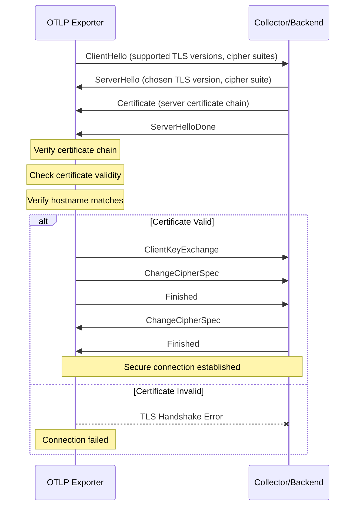
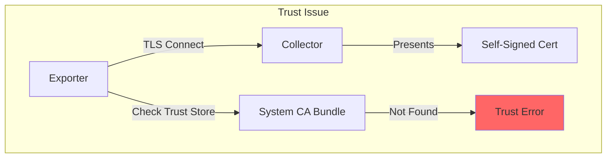
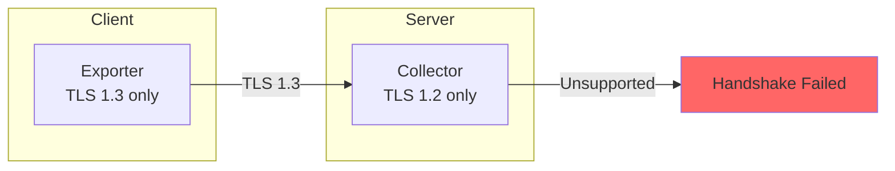
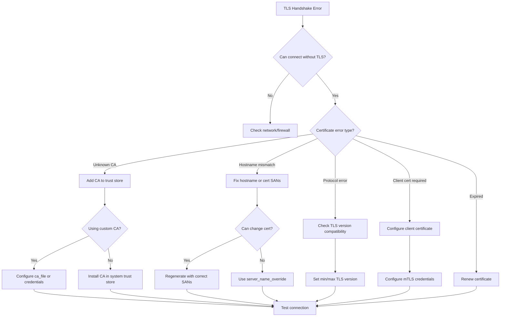

# How to Fix 'TLS Handshake' Errors in OpenTelemetry

Author: [nawazdhandala](https://www.github.com/nawazdhandala)

Tags: OpenTelemetry, TLS, Security, Troubleshooting, SSL, Certificates, OTLP, Observability

Description: A practical guide to diagnosing and fixing TLS handshake errors when connecting OpenTelemetry exporters to collectors and backends, including certificate configuration, trust chain issues, and common pitfalls.

---

> TLS handshake errors are among the most frustrating issues when setting up secure OpenTelemetry pipelines. These errors prevent your telemetry data from being transmitted securely, leaving you with either no data or insecure connections. This guide will help you understand, diagnose, and fix TLS handshake errors in OpenTelemetry.

Understanding the TLS handshake process and common failure points is essential for building secure observability pipelines.

---

## Understanding the TLS Handshake



### Common TLS Handshake Errors

| Error Message | Likely Cause |
|---------------|--------------|
| `certificate verify failed` | Certificate not trusted |
| `certificate has expired` | Certificate past validity date |
| `hostname mismatch` | Certificate CN/SAN does not match host |
| `unknown certificate authority` | CA certificate not in trust store |
| `handshake failure` | Protocol/cipher mismatch |
| `connection reset` | TLS not enabled on server |

---

## Diagnosing TLS Issues

### Step 1: Test the Connection with OpenSSL

```bash
# Test basic TLS connectivity to collector
openssl s_client -connect collector.example.com:4317 -showcerts

# Test with specific TLS version
openssl s_client -connect collector.example.com:4317 -tls1_2
openssl s_client -connect collector.example.com:4317 -tls1_3

# Show full certificate chain
openssl s_client -connect collector.example.com:4317 -showcerts 2>/dev/null | \
  openssl x509 -text -noout

# Check certificate expiration
openssl s_client -connect collector.example.com:4317 2>/dev/null | \
  openssl x509 -noout -dates

# Verify hostname in certificate
openssl s_client -connect collector.example.com:4317 2>/dev/null | \
  openssl x509 -noout -subject -ext subjectAltName
```

### Step 2: Enable Debug Logging

```python
import logging
import ssl

# Enable SSL debugging
logging.basicConfig(level=logging.DEBUG)
ssl.SSLContext.verify_mode = ssl.CERT_REQUIRED

# For detailed SSL debugging in Python
import http.client
http.client.HTTPConnection.debuglevel = 1
```

For gRPC connections:

```bash
# Enable gRPC SSL debugging
export GRPC_VERBOSITY=DEBUG
export GRPC_TRACE=secure_endpoint,transport_security

# Run your application
python your_app.py
```

### Step 3: Check Certificate Details

```bash
# Download and inspect the server certificate
echo | openssl s_client -connect collector.example.com:4317 2>/dev/null | \
  openssl x509 -text > server-cert.txt

# Key things to check:
# - Validity period (Not Before / Not After)
# - Subject CN and Subject Alternative Names
# - Issuer (who signed it)
# - Key Usage and Extended Key Usage

# Check if certificate is self-signed
openssl verify -CAfile server-cert.pem server-cert.pem
```

---

## Common Causes and Solutions

### Cause 1: Self-Signed or Internal CA Certificates



**Solution: Configure Custom CA Certificate**

Python:

```python
from opentelemetry.exporter.otlp.proto.grpc.trace_exporter import OTLPSpanExporter
import grpc

# Option 1: Load CA certificate from file
with open('/path/to/ca-certificate.crt', 'rb') as f:
    ca_cert = f.read()

# Create SSL credentials with custom CA
credentials = grpc.ssl_channel_credentials(root_certificates=ca_cert)

# Create exporter with custom credentials
exporter = OTLPSpanExporter(
    endpoint="collector.example.com:4317",
    credentials=credentials,
)
```

Go:

```go
package main

import (
    "context"
    "crypto/tls"
    "crypto/x509"
    "io/ioutil"
    "log"

    "go.opentelemetry.io/otel/exporters/otlp/otlptrace/otlptracegrpc"
    "google.golang.org/grpc"
    "google.golang.org/grpc/credentials"
)

func createExporter() (*otlptracegrpc.Exporter, error) {
    // Load CA certificate
    caCert, err := ioutil.ReadFile("/path/to/ca-certificate.crt")
    if err != nil {
        return nil, err
    }

    // Create certificate pool and add CA
    certPool := x509.NewCertPool()
    if !certPool.AppendCertsFromPEM(caCert) {
        log.Fatal("Failed to add CA certificate")
    }

    // Create TLS config
    tlsConfig := &tls.Config{
        RootCAs: certPool,
    }

    // Create gRPC connection with TLS
    ctx := context.Background()
    exporter, err := otlptracegrpc.New(ctx,
        otlptracegrpc.WithEndpoint("collector.example.com:4317"),
        otlptracegrpc.WithTLSCredentials(credentials.NewTLS(tlsConfig)),
    )

    return exporter, err
}
```

Node.js:

```javascript
const grpc = require('@grpc/grpc-js');
const fs = require('fs');
const { OTLPTraceExporter } = require('@opentelemetry/exporter-trace-otlp-grpc');

// Load CA certificate
const caCert = fs.readFileSync('/path/to/ca-certificate.crt');

// Create credentials with custom CA
const credentials = grpc.credentials.createSsl(caCert);

// Create exporter with custom credentials
const exporter = new OTLPTraceExporter({
  url: 'https://collector.example.com:4317',
  credentials: credentials,
});
```

### Cause 2: Certificate Hostname Mismatch

**Solution: Use Correct Endpoint or Configure Server**

```yaml
# Collector configuration with proper certificate
# The certificate must have a SAN (Subject Alternative Name) that matches
# the hostname used to connect

# If your certificate is for "otel-collector.prod.internal"
# You MUST connect using that exact hostname

# server.properties or collector config
receivers:
  otlp:
    protocols:
      grpc:
        endpoint: 0.0.0.0:4317
        tls:
          cert_file: /certs/server.crt
          key_file: /certs/server.key
          # Certificate must have SAN for the hostname clients use
```

Generate a certificate with proper SANs:

```bash
# Create a certificate with multiple SANs
openssl req -new -x509 -days 365 -nodes \
  -out server.crt \
  -keyout server.key \
  -subj "/CN=otel-collector" \
  -addext "subjectAltName=DNS:otel-collector,DNS:otel-collector.prod.internal,DNS:localhost,IP:10.0.0.100"

# Verify the SANs are in the certificate
openssl x509 -in server.crt -text -noout | grep -A1 "Subject Alternative Name"
```

### Cause 3: Expired Certificates

**Solution: Renew Certificate or Temporarily Disable Verification**

Check expiration:

```bash
# Check certificate expiration
openssl s_client -connect collector.example.com:4317 2>/dev/null | \
  openssl x509 -noout -dates

# Output:
# notBefore=Jan 15 00:00:00 2024 GMT
# notAfter=Jan 15 00:00:00 2025 GMT
```

Temporary workaround (NOT for production):

```python
from opentelemetry.exporter.otlp.proto.grpc.trace_exporter import OTLPSpanExporter

# WARNING: This disables certificate verification
# Only use for debugging, NEVER in production
exporter = OTLPSpanExporter(
    endpoint="collector.example.com:4317",
    insecure=True,  # Disables TLS entirely
)
```

Better solution - Use HTTP exporter with custom SSL context:

```python
import ssl
from opentelemetry.exporter.otlp.proto.http.trace_exporter import OTLPSpanExporter

# Create SSL context that ignores expiration (temporary debugging only)
ssl_context = ssl.create_default_context()
ssl_context.check_hostname = False
ssl_context.verify_mode = ssl.CERT_NONE

# Note: OTLPSpanExporter HTTP doesn't directly support ssl_context
# You may need to use environment variables or a custom session
```

### Cause 4: Protocol Version Mismatch



**Solution: Configure Compatible TLS Versions**

Collector configuration:

```yaml
# otel-collector-config.yaml
receivers:
  otlp:
    protocols:
      grpc:
        endpoint: 0.0.0.0:4317
        tls:
          cert_file: /certs/server.crt
          key_file: /certs/server.key
          # Specify minimum TLS version
          min_version: "1.2"
          # Optionally specify maximum version
          max_version: "1.3"
          # Specify allowed cipher suites
          cipher_suites:
            - TLS_ECDHE_RSA_WITH_AES_128_GCM_SHA256
            - TLS_ECDHE_RSA_WITH_AES_256_GCM_SHA384
            - TLS_AES_128_GCM_SHA256
            - TLS_AES_256_GCM_SHA384
```

Client-side TLS configuration (Go):

```go
package main

import (
    "crypto/tls"
    "crypto/x509"
    "io/ioutil"

    "google.golang.org/grpc/credentials"
)

func createTLSCredentials() (credentials.TransportCredentials, error) {
    // Load CA cert
    caCert, err := ioutil.ReadFile("/path/to/ca.crt")
    if err != nil {
        return nil, err
    }

    certPool := x509.NewCertPool()
    certPool.AppendCertsFromPEM(caCert)

    // Configure TLS with specific versions and ciphers
    tlsConfig := &tls.Config{
        RootCAs:    certPool,
        MinVersion: tls.VersionTLS12,
        MaxVersion: tls.VersionTLS13,
        CipherSuites: []uint16{
            tls.TLS_ECDHE_RSA_WITH_AES_128_GCM_SHA256,
            tls.TLS_ECDHE_RSA_WITH_AES_256_GCM_SHA384,
            tls.TLS_AES_128_GCM_SHA256,
            tls.TLS_AES_256_GCM_SHA384,
        },
    }

    return credentials.NewTLS(tlsConfig), nil
}
```

### Cause 5: Missing Client Certificate (mTLS)

```mermaid
flowchart TD
    subgraph "mTLS Handshake"
        A[Client] -->|ClientHello| B[Server]
        B -->|ServerHello + Certificate| A
        B -->|CertificateRequest| A
        A -->|Certificate + Verify| B

        Note over A,B: Both parties verify each other
    end
```

**Solution: Configure Client Certificate**

Python:

```python
from opentelemetry.exporter.otlp.proto.grpc.trace_exporter import OTLPSpanExporter
import grpc

# Load certificates for mTLS
with open('/path/to/ca.crt', 'rb') as f:
    ca_cert = f.read()

with open('/path/to/client.crt', 'rb') as f:
    client_cert = f.read()

with open('/path/to/client.key', 'rb') as f:
    client_key = f.read()

# Create SSL credentials with client certificate
credentials = grpc.ssl_channel_credentials(
    root_certificates=ca_cert,
    private_key=client_key,
    certificate_chain=client_cert,
)

# Create exporter with mTLS
exporter = OTLPSpanExporter(
    endpoint="collector.example.com:4317",
    credentials=credentials,
)
```

Go:

```go
package main

import (
    "crypto/tls"
    "crypto/x509"
    "io/ioutil"

    "google.golang.org/grpc/credentials"
)

func createMTLSCredentials() (credentials.TransportCredentials, error) {
    // Load CA certificate
    caCert, err := ioutil.ReadFile("/path/to/ca.crt")
    if err != nil {
        return nil, err
    }

    certPool := x509.NewCertPool()
    certPool.AppendCertsFromPEM(caCert)

    // Load client certificate and key
    clientCert, err := tls.LoadX509KeyPair(
        "/path/to/client.crt",
        "/path/to/client.key",
    )
    if err != nil {
        return nil, err
    }

    // Configure mTLS
    tlsConfig := &tls.Config{
        RootCAs:      certPool,
        Certificates: []tls.Certificate{clientCert},
        MinVersion:   tls.VersionTLS12,
    }

    return credentials.NewTLS(tlsConfig), nil
}
```

Collector configuration for mTLS:

```yaml
# otel-collector-config.yaml
receivers:
  otlp:
    protocols:
      grpc:
        endpoint: 0.0.0.0:4317
        tls:
          cert_file: /certs/server.crt
          key_file: /certs/server.key
          ca_file: /certs/ca.crt
          # Require client certificates
          client_ca_file: /certs/client-ca.crt
```

---

## Collector TLS Configuration

### Basic TLS Setup

```yaml
# otel-collector-config.yaml
receivers:
  otlp:
    protocols:
      grpc:
        endpoint: 0.0.0.0:4317
        tls:
          cert_file: /certs/server.crt
          key_file: /certs/server.key
      http:
        endpoint: 0.0.0.0:4318
        tls:
          cert_file: /certs/server.crt
          key_file: /certs/server.key

exporters:
  otlp:
    endpoint: backend.example.com:4317
    tls:
      # Use system CA bundle
      insecure: false
      # Or specify custom CA
      ca_file: /certs/backend-ca.crt

service:
  pipelines:
    traces:
      receivers: [otlp]
      exporters: [otlp]
```

### Advanced TLS Configuration

```yaml
# otel-collector-config.yaml
receivers:
  otlp:
    protocols:
      grpc:
        endpoint: 0.0.0.0:4317
        tls:
          cert_file: /certs/server.crt
          key_file: /certs/server.key
          ca_file: /certs/ca.crt
          # Require client certificates (mTLS)
          client_ca_file: /certs/client-ca.crt
          # Minimum TLS version
          min_version: "1.2"
          # Maximum TLS version
          max_version: "1.3"
          # Cipher suites (TLS 1.2)
          cipher_suites:
            - TLS_ECDHE_RSA_WITH_AES_128_GCM_SHA256
            - TLS_ECDHE_RSA_WITH_AES_256_GCM_SHA384
          # Reload certificates without restart
          reload_interval: 24h

exporters:
  otlp:
    endpoint: backend.example.com:4317
    tls:
      insecure: false
      ca_file: /certs/backend-ca.crt
      cert_file: /certs/client.crt
      key_file: /certs/client.key
      # Server name for verification
      server_name_override: backend.example.com
```

---

## Kubernetes TLS Setup

### Using cert-manager for Automatic Certificates

```yaml
# Certificate issuer
apiVersion: cert-manager.io/v1
kind: ClusterIssuer
metadata:
  name: selfsigned-issuer
spec:
  selfSigned: {}
---
# CA Certificate
apiVersion: cert-manager.io/v1
kind: Certificate
metadata:
  name: otel-ca
  namespace: observability
spec:
  isCA: true
  commonName: otel-ca
  secretName: otel-ca-secret
  privateKey:
    algorithm: ECDSA
    size: 256
  issuerRef:
    name: selfsigned-issuer
    kind: ClusterIssuer
---
# Issuer using the CA
apiVersion: cert-manager.io/v1
kind: Issuer
metadata:
  name: otel-issuer
  namespace: observability
spec:
  ca:
    secretName: otel-ca-secret
---
# Collector certificate
apiVersion: cert-manager.io/v1
kind: Certificate
metadata:
  name: otel-collector-cert
  namespace: observability
spec:
  secretName: otel-collector-tls
  duration: 2160h # 90 days
  renewBefore: 360h # 15 days
  subject:
    organizations:
      - otel
  commonName: otel-collector
  dnsNames:
    - otel-collector
    - otel-collector.observability
    - otel-collector.observability.svc
    - otel-collector.observability.svc.cluster.local
  issuerRef:
    name: otel-issuer
    kind: Issuer
```

### Collector Deployment with TLS

```yaml
apiVersion: apps/v1
kind: Deployment
metadata:
  name: otel-collector
  namespace: observability
spec:
  replicas: 1
  selector:
    matchLabels:
      app: otel-collector
  template:
    metadata:
      labels:
        app: otel-collector
    spec:
      containers:
      - name: collector
        image: otel/opentelemetry-collector-contrib:latest
        ports:
        - containerPort: 4317
          name: otlp-grpc
        - containerPort: 4318
          name: otlp-http
        volumeMounts:
        - name: config
          mountPath: /etc/otel
        - name: tls-certs
          mountPath: /certs
          readOnly: true
        args:
        - --config=/etc/otel/config.yaml
      volumes:
      - name: config
        configMap:
          name: otel-collector-config
      - name: tls-certs
        secret:
          secretName: otel-collector-tls
---
# ConfigMap with TLS-enabled config
apiVersion: v1
kind: ConfigMap
metadata:
  name: otel-collector-config
  namespace: observability
data:
  config.yaml: |
    receivers:
      otlp:
        protocols:
          grpc:
            endpoint: 0.0.0.0:4317
            tls:
              cert_file: /certs/tls.crt
              key_file: /certs/tls.key
          http:
            endpoint: 0.0.0.0:4318
            tls:
              cert_file: /certs/tls.crt
              key_file: /certs/tls.key
    exporters:
      debug:
        verbosity: detailed
    service:
      pipelines:
        traces:
          receivers: [otlp]
          exporters: [debug]
```

### Distributing CA to Applications

```yaml
# ConfigMap with CA certificate for applications
apiVersion: v1
kind: ConfigMap
metadata:
  name: otel-ca-bundle
  namespace: default
data:
  ca.crt: |
    -----BEGIN CERTIFICATE-----
    # CA certificate content here
    -----END CERTIFICATE-----
---
# Application deployment using the CA
apiVersion: apps/v1
kind: Deployment
metadata:
  name: my-application
spec:
  template:
    spec:
      containers:
      - name: app
        image: my-app:latest
        env:
        - name: OTEL_EXPORTER_OTLP_ENDPOINT
          value: "https://otel-collector.observability:4317"
        - name: OTEL_EXPORTER_OTLP_CERTIFICATE
          value: "/certs/ca.crt"
        volumeMounts:
        - name: otel-ca
          mountPath: /certs
          readOnly: true
      volumes:
      - name: otel-ca
        configMap:
          name: otel-ca-bundle
```

---

## Environment Variable Configuration

```bash
# Basic TLS configuration via environment variables
export OTEL_EXPORTER_OTLP_ENDPOINT="https://collector.example.com:4317"
export OTEL_EXPORTER_OTLP_CERTIFICATE="/path/to/ca.crt"

# For mTLS
export OTEL_EXPORTER_OTLP_CLIENT_CERTIFICATE="/path/to/client.crt"
export OTEL_EXPORTER_OTLP_CLIENT_KEY="/path/to/client.key"

# Disable TLS verification (debugging only)
export OTEL_EXPORTER_OTLP_INSECURE="true"

# Protocol-specific endpoints
export OTEL_EXPORTER_OTLP_TRACES_ENDPOINT="https://traces.collector.example.com:4317"
export OTEL_EXPORTER_OTLP_METRICS_ENDPOINT="https://metrics.collector.example.com:4317"
export OTEL_EXPORTER_OTLP_LOGS_ENDPOINT="https://logs.collector.example.com:4317"
```

---

## Troubleshooting Flowchart



---

## Complete Working Example

```python
import os
import ssl
from opentelemetry import trace
from opentelemetry.sdk.trace import TracerProvider
from opentelemetry.sdk.trace.export import BatchSpanProcessor
from opentelemetry.exporter.otlp.proto.grpc.trace_exporter import OTLPSpanExporter
from opentelemetry.sdk.resources import Resource, SERVICE_NAME
import grpc

def create_tls_exporter():
    """Create an OTLP exporter with proper TLS configuration."""

    endpoint = os.getenv("OTEL_EXPORTER_OTLP_ENDPOINT", "collector.example.com:4317")
    ca_cert_path = os.getenv("OTEL_EXPORTER_OTLP_CERTIFICATE")
    client_cert_path = os.getenv("OTEL_EXPORTER_OTLP_CLIENT_CERTIFICATE")
    client_key_path = os.getenv("OTEL_EXPORTER_OTLP_CLIENT_KEY")
    insecure = os.getenv("OTEL_EXPORTER_OTLP_INSECURE", "false").lower() == "true"

    if insecure:
        # No TLS (for development only)
        print("WARNING: Using insecure connection (no TLS)")
        return OTLPSpanExporter(endpoint=endpoint, insecure=True)

    # Load CA certificate
    ca_cert = None
    if ca_cert_path:
        with open(ca_cert_path, 'rb') as f:
            ca_cert = f.read()
        print(f"Loaded CA certificate from {ca_cert_path}")

    # Load client certificate for mTLS
    client_cert = None
    client_key = None
    if client_cert_path and client_key_path:
        with open(client_cert_path, 'rb') as f:
            client_cert = f.read()
        with open(client_key_path, 'rb') as f:
            client_key = f.read()
        print(f"Loaded client certificate from {client_cert_path}")

    # Create gRPC credentials
    credentials = grpc.ssl_channel_credentials(
        root_certificates=ca_cert,
        private_key=client_key,
        certificate_chain=client_cert,
    )

    return OTLPSpanExporter(
        endpoint=endpoint,
        credentials=credentials,
    )

def init_tracing():
    """Initialize OpenTelemetry with TLS-enabled exporter."""

    resource = Resource.create({
        SERVICE_NAME: os.getenv("SERVICE_NAME", "my-service"),
        "deployment.environment": os.getenv("ENVIRONMENT", "production"),
    })

    provider = TracerProvider(resource=resource)

    try:
        exporter = create_tls_exporter()
        provider.add_span_processor(BatchSpanProcessor(exporter))
        trace.set_tracer_provider(provider)
        print("OpenTelemetry tracing initialized with TLS")

    except Exception as e:
        print(f"Failed to initialize TLS exporter: {e}")
        print("Falling back to console exporter")

        from opentelemetry.sdk.trace.export import ConsoleSpanExporter
        provider.add_span_processor(BatchSpanProcessor(ConsoleSpanExporter()))
        trace.set_tracer_provider(provider)

    return provider

# Test the connection
def test_tls_connection():
    """Test the TLS connection with a simple span."""

    tracer = trace.get_tracer(__name__)

    with tracer.start_as_current_span("test-tls-connection") as span:
        span.set_attribute("test.purpose", "verify TLS connectivity")
        span.set_attribute("test.timestamp", str(datetime.now()))
        print("Test span created successfully")

if __name__ == "__main__":
    from datetime import datetime

    provider = init_tracing()

    test_tls_connection()

    # Flush and shutdown
    provider.shutdown()
    print("Tracing shutdown complete")
```

---

## Best Practices Summary

1. **Always use TLS in production** - Never disable TLS verification in production environments
2. **Use proper certificate management** - Use cert-manager or similar tools for automatic renewal
3. **Configure SANs correctly** - Ensure certificates have all necessary hostnames in Subject Alternative Names
4. **Monitor certificate expiration** - Set up alerts for certificates expiring within 30 days
5. **Use environment variables** - Configure TLS paths via environment variables for flexibility
6. **Test TLS configuration** - Use openssl s_client to verify configuration before deploying
7. **Keep TLS versions current** - Use TLS 1.2 minimum, prefer TLS 1.3
8. **Document your PKI setup** - Maintain documentation of your certificate chain and renewal process

---

## Conclusion

TLS handshake errors in OpenTelemetry are typically caused by certificate trust issues, hostname mismatches, or protocol incompatibilities. By understanding the TLS handshake process and systematically diagnosing the failure point, you can quickly resolve these issues and establish secure telemetry pipelines.

The key is to properly configure certificate trust chains, ensure hostnames match certificate SANs, and use consistent TLS versions across your infrastructure. With proper certificate management and monitoring, you can maintain secure observability pipelines with minimal operational overhead.

---

*Need to monitor your TLS certificate health? [OneUptime](https://oneuptime.com) provides SSL certificate monitoring, including expiration alerts, chain validation, and automatic notifications before your certificates expire.*

**Related Reading:**
- [How to Fix "Timeout" Errors in OpenTelemetry Export](https://oneuptime.com/blog)
- [How to Configure OpenTelemetry for gRPC Services](https://oneuptime.com/blog)
- [Security Best Practices for Observability Pipelines](https://oneuptime.com/blog)
