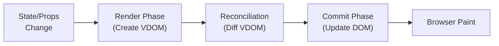
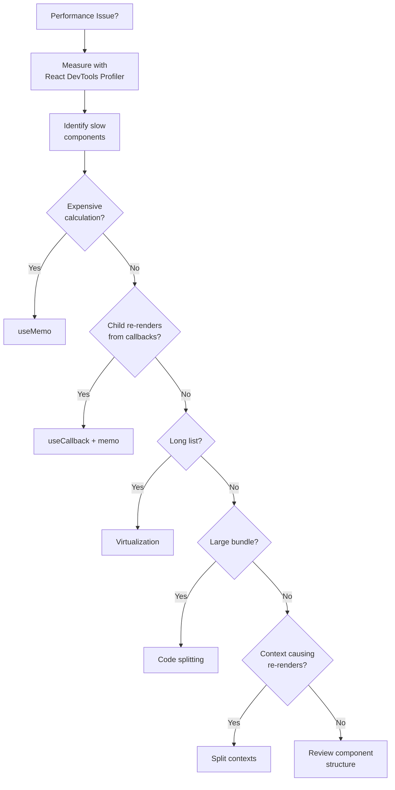

# How to Optimize React Component Performance

Author: [nawazdhandala](https://www.github.com/nawazdhandala)

Tags: React, Performance, Optimization, useMemo, useCallback, React.memo, Virtual DOM, JavaScript, TypeScript

Description: Learn how to optimize React component performance using memoization, code splitting, virtualization, and profiling techniques.

---

> React applications can become slow as they grow. Understanding when and why components re-render is essential for building performant UIs. This guide covers practical techniques to identify and fix performance issues in React.

Performance optimization starts with measurement. Do not optimize prematurely.

---

## React Rendering Lifecycle



---

## Identifying Performance Issues

### Using React DevTools Profiler

The Profiler helps identify which components are rendering and why:

```tsx
// src/App.tsx
import { Profiler, ProfilerOnRenderCallback } from 'react';

// Callback function that receives render timing information
const onRenderCallback: ProfilerOnRenderCallback = (
  id,           // Profiler tree id
  phase,        // "mount" or "update"
  actualDuration, // Time spent rendering
  baseDuration,   // Estimated time without memoization
  startTime,      // When React started rendering
  commitTime      // When React committed the update
) => {
  // Log slow renders (more than 16ms breaks 60fps)
  if (actualDuration > 16) {
    console.warn(`Slow render in ${id}:`, {
      phase,
      actualDuration: `${actualDuration.toFixed(2)}ms`,
      baseDuration: `${baseDuration.toFixed(2)}ms`,
    });
  }
};

function App() {
  return (
    <Profiler id="App" onRender={onRenderCallback}>
      <MainContent />
    </Profiler>
  );
}
```

### Creating a Performance Monitor

```tsx
// src/components/PerformanceMonitor.tsx
import { useEffect, useRef } from 'react';

interface PerformanceMonitorProps {
  id: string;
  children: React.ReactNode;
}

export function PerformanceMonitor({ id, children }: PerformanceMonitorProps) {
  const renderCount = useRef(0);
  const lastRenderTime = useRef(performance.now());

  useEffect(() => {
    renderCount.current += 1;
    const now = performance.now();
    const timeSinceLastRender = now - lastRenderTime.current;

    // Log if component renders more than twice per second
    if (timeSinceLastRender < 500 && renderCount.current > 1) {
      console.warn(
        `Frequent re-renders in ${id}:`,
        `${renderCount.current} renders`
      );
    }

    lastRenderTime.current = now;
  });

  return <>{children}</>;
}
```

---

## Memoization Techniques

### React.memo for Component Memoization

Prevent re-renders when props have not changed:

```tsx
// src/components/ExpensiveList.tsx
import { memo } from 'react';

interface Item {
  id: number;
  name: string;
  price: number;
}

interface ListItemProps {
  item: Item;
  onSelect: (id: number) => void;
}

// Without memo: re-renders whenever parent renders
function ListItem({ item, onSelect }: ListItemProps) {
  console.log(`Rendering item ${item.id}`);

  return (
    <div onClick={() => onSelect(item.id)}>
      <span>{item.name}</span>
      <span>${item.price}</span>
    </div>
  );
}

// With memo: only re-renders when props change
const MemoizedListItem = memo(ListItem);

// With custom comparison function
const MemoizedListItemCustom = memo(ListItem, (prevProps, nextProps) => {
  // Return true if props are equal (should NOT re-render)
  // Return false if props are different (should re-render)
  return (
    prevProps.item.id === nextProps.item.id &&
    prevProps.item.name === nextProps.item.name &&
    prevProps.item.price === nextProps.item.price
  );
});
```

### useMemo for Expensive Calculations

Cache the result of expensive computations:

```tsx
// src/components/DataTable.tsx
import { useMemo, useState } from 'react';

interface DataTableProps {
  data: Array<{ id: number; name: string; value: number }>;
}

function DataTable({ data }: DataTableProps) {
  const [sortField, setSortField] = useState<'name' | 'value'>('name');
  const [filterText, setFilterText] = useState('');

  // Expensive: filtering and sorting large datasets
  // Without useMemo, this runs on every render
  const processedData = useMemo(() => {
    console.log('Processing data...');

    // Filter
    const filtered = data.filter((item) =>
      item.name.toLowerCase().includes(filterText.toLowerCase())
    );

    // Sort
    const sorted = [...filtered].sort((a, b) => {
      if (sortField === 'name') {
        return a.name.localeCompare(b.name);
      }
      return a.value - b.value;
    });

    return sorted;
  }, [data, sortField, filterText]); // Only recompute when these change

  // Statistics computation
  const statistics = useMemo(() => {
    const total = processedData.reduce((sum, item) => sum + item.value, 0);
    const average = processedData.length > 0 ? total / processedData.length : 0;
    const max = Math.max(...processedData.map((item) => item.value), 0);
    const min = Math.min(...processedData.map((item) => item.value), 0);

    return { total, average, max, min };
  }, [processedData]);

  return (
    <div>
      <input
        type="text"
        value={filterText}
        onChange={(e) => setFilterText(e.target.value)}
        placeholder="Filter..."
      />

      <div>
        <p>Total: {statistics.total}</p>
        <p>Average: {statistics.average.toFixed(2)}</p>
      </div>

      <table>
        <thead>
          <tr>
            <th onClick={() => setSortField('name')}>Name</th>
            <th onClick={() => setSortField('value')}>Value</th>
          </tr>
        </thead>
        <tbody>
          {processedData.map((item) => (
            <tr key={item.id}>
              <td>{item.name}</td>
              <td>{item.value}</td>
            </tr>
          ))}
        </tbody>
      </table>
    </div>
  );
}
```

### useCallback for Stable Functions

Prevent child re-renders caused by new function references:

```tsx
// src/components/ParentComponent.tsx
import { useState, useCallback, memo } from 'react';

interface ChildProps {
  onIncrement: () => void;
  onDecrement: () => void;
}

// Child component memoized with React.memo
const Counter = memo(function Counter({ onIncrement, onDecrement }: ChildProps) {
  console.log('Counter rendered');
  return (
    <div>
      <button onClick={onDecrement}>-</button>
      <button onClick={onIncrement}>+</button>
    </div>
  );
});

function ParentComponent() {
  const [count, setCount] = useState(0);
  const [name, setName] = useState('');

  // Without useCallback: new function on every render
  // This breaks React.memo on Counter
  const handleIncrementBad = () => {
    setCount((c) => c + 1);
  };

  // With useCallback: stable function reference
  // Counter only re-renders when dependencies change
  const handleIncrement = useCallback(() => {
    setCount((c) => c + 1);
  }, []); // Empty deps because we use functional update

  const handleDecrement = useCallback(() => {
    setCount((c) => c - 1);
  }, []);

  return (
    <div>
      <input
        value={name}
        onChange={(e) => setName(e.target.value)}
        placeholder="Type here..."
      />
      <p>Count: {count}</p>
      {/* Counter does not re-render when name changes */}
      <Counter onIncrement={handleIncrement} onDecrement={handleDecrement} />
    </div>
  );
}
```

---

## Component Structure Optimization

### Splitting Components to Isolate Re-renders

```tsx
// BAD: Entire component re-renders on every input change
function BadForm() {
  const [name, setName] = useState('');
  const [email, setEmail] = useState('');

  // This expensive computation runs on every keystroke
  const suggestions = expensiveComputation(name);

  return (
    <form>
      <input value={name} onChange={(e) => setName(e.target.value)} />
      <input value={email} onChange={(e) => setEmail(e.target.value)} />
      <Suggestions items={suggestions} />
    </form>
  );
}

// GOOD: Split into smaller components
function NameInput() {
  const [name, setName] = useState('');
  const suggestions = useMemo(() => expensiveComputation(name), [name]);

  return (
    <div>
      <input value={name} onChange={(e) => setName(e.target.value)} />
      <Suggestions items={suggestions} />
    </div>
  );
}

function EmailInput() {
  const [email, setEmail] = useState('');
  return <input value={email} onChange={(e) => setEmail(e.target.value)} />;
}

function GoodForm() {
  return (
    <form>
      {/* Email input changes do not affect NameInput */}
      <NameInput />
      <EmailInput />
    </form>
  );
}
```

### Lifting Content Up Pattern

```tsx
// BAD: Children re-render when ExpensiveComponent updates
function BadLayout() {
  const [count, setCount] = useState(0);

  return (
    <div>
      <button onClick={() => setCount((c) => c + 1)}>
        Count: {count}
      </button>
      {/* These children re-render even though they do not use count */}
      <Sidebar />
      <MainContent />
      <Footer />
    </div>
  );
}

// GOOD: Pass children as props - they do not re-render
function CounterWrapper({ children }: { children: React.ReactNode }) {
  const [count, setCount] = useState(0);

  return (
    <div>
      <button onClick={() => setCount((c) => c + 1)}>
        Count: {count}
      </button>
      {/* Children are created in parent, not affected by count */}
      {children}
    </div>
  );
}

function GoodLayout() {
  return (
    <CounterWrapper>
      {/* These are created here, not re-rendered by count changes */}
      <Sidebar />
      <MainContent />
      <Footer />
    </CounterWrapper>
  );
}
```

---

## Virtualization for Long Lists

### Using react-window for List Virtualization

```tsx
// src/components/VirtualizedList.tsx
import { FixedSizeList, ListChildComponentProps } from 'react-window';
import { memo } from 'react';

interface Item {
  id: number;
  name: string;
  description: string;
}

interface VirtualizedListProps {
  items: Item[];
  height: number;
  itemHeight: number;
}

// Memoize row component to prevent unnecessary re-renders
const Row = memo(function Row({
  index,
  style,
  data,
}: ListChildComponentProps<Item[]>) {
  const item = data[index];

  return (
    <div style={style} className="list-item">
      <h3>{item.name}</h3>
      <p>{item.description}</p>
    </div>
  );
});

export function VirtualizedList({
  items,
  height,
  itemHeight,
}: VirtualizedListProps) {
  return (
    <FixedSizeList
      height={height}
      width="100%"
      itemCount={items.length}
      itemSize={itemHeight}
      itemData={items}
    >
      {Row}
    </FixedSizeList>
  );
}

// Usage
function ItemList() {
  // Generate 10000 items
  const items = Array.from({ length: 10000 }, (_, i) => ({
    id: i,
    name: `Item ${i}`,
    description: `Description for item ${i}`,
  }));

  // Only renders visible items (about 10-20 depending on height)
  // instead of all 10000
  return <VirtualizedList items={items} height={500} itemHeight={80} />;
}
```

### Variable Height Virtualization

```tsx
// src/components/VariableHeightList.tsx
import { VariableSizeList, ListChildComponentProps } from 'react-window';
import { useRef, useCallback } from 'react';

interface Message {
  id: number;
  text: string;
  type: 'short' | 'medium' | 'long';
}

interface MessageListProps {
  messages: Message[];
}

export function MessageList({ messages }: MessageListProps) {
  const listRef = useRef<VariableSizeList>(null);

  // Calculate item height based on content type
  const getItemHeight = useCallback(
    (index: number) => {
      const message = messages[index];
      switch (message.type) {
        case 'short':
          return 50;
        case 'medium':
          return 100;
        case 'long':
          return 200;
        default:
          return 50;
      }
    },
    [messages]
  );

  const Row = useCallback(
    ({ index, style }: ListChildComponentProps) => {
      const message = messages[index];

      return (
        <div style={style} className={`message message-${message.type}`}>
          {message.text}
        </div>
      );
    },
    [messages]
  );

  return (
    <VariableSizeList
      ref={listRef}
      height={600}
      width="100%"
      itemCount={messages.length}
      itemSize={getItemHeight}
      estimatedItemSize={100}
    >
      {Row}
    </VariableSizeList>
  );
}
```

---

## Code Splitting and Lazy Loading

### Lazy Loading Components

```tsx
// src/App.tsx
import { lazy, Suspense } from 'react';
import { Routes, Route } from 'react-router-dom';

// Lazy load route components
// These bundles are only downloaded when the route is visited
const Dashboard = lazy(() => import('./pages/Dashboard'));
const Settings = lazy(() => import('./pages/Settings'));
const Analytics = lazy(() => import('./pages/Analytics'));

// Loading fallback component
function PageLoader() {
  return (
    <div className="page-loader">
      <div className="spinner" />
      <p>Loading...</p>
    </div>
  );
}

function App() {
  return (
    <Suspense fallback={<PageLoader />}>
      <Routes>
        <Route path="/" element={<Dashboard />} />
        <Route path="/settings" element={<Settings />} />
        <Route path="/analytics" element={<Analytics />} />
      </Routes>
    </Suspense>
  );
}
```

### Lazy Loading with Named Exports

```tsx
// src/components/HeavyChart.tsx
export function HeavyChart() {
  // Heavy charting library code
}

// src/pages/Analytics.tsx
import { lazy, Suspense } from 'react';

// Lazy load component with named export
const HeavyChart = lazy(() =>
  import('../components/HeavyChart').then((module) => ({
    default: module.HeavyChart,
  }))
);

function Analytics() {
  const [showChart, setShowChart] = useState(false);

  return (
    <div>
      <button onClick={() => setShowChart(true)}>Show Chart</button>

      {showChart && (
        <Suspense fallback={<div>Loading chart...</div>}>
          <HeavyChart />
        </Suspense>
      )}
    </div>
  );
}
```

---

## State Management Optimization

### Avoiding Context Re-renders

```tsx
// BAD: All consumers re-render when any value changes
const AppContext = createContext<{
  user: User;
  theme: Theme;
  settings: Settings;
} | null>(null);

// GOOD: Split contexts by update frequency
const UserContext = createContext<User | null>(null);
const ThemeContext = createContext<Theme>('light');
const SettingsContext = createContext<Settings | null>(null);

// Even better: Separate state and dispatch
interface UserState {
  user: User | null;
  isLoading: boolean;
}

interface UserDispatch {
  login: (credentials: Credentials) => Promise<void>;
  logout: () => void;
}

const UserStateContext = createContext<UserState | null>(null);
const UserDispatchContext = createContext<UserDispatch | null>(null);

function UserProvider({ children }: { children: React.ReactNode }) {
  const [state, setState] = useState<UserState>({
    user: null,
    isLoading: true,
  });

  // Memoize dispatch functions so they never cause re-renders
  const dispatch = useMemo<UserDispatch>(
    () => ({
      login: async (credentials) => {
        setState((s) => ({ ...s, isLoading: true }));
        const user = await loginAPI(credentials);
        setState({ user, isLoading: false });
      },
      logout: () => {
        setState({ user: null, isLoading: false });
      },
    }),
    []
  );

  return (
    <UserStateContext.Provider value={state}>
      <UserDispatchContext.Provider value={dispatch}>
        {children}
      </UserDispatchContext.Provider>
    </UserStateContext.Provider>
  );
}

// Components that only need dispatch do not re-render on state changes
function LogoutButton() {
  const dispatch = useContext(UserDispatchContext);
  return <button onClick={dispatch?.logout}>Logout</button>;
}
```

---

## Performance Anti-patterns

### Anti-pattern 1: Inline Object/Array Props

```tsx
// BAD: New object created every render
function BadComponent() {
  return (
    <ChildComponent
      // New object reference every render
      style={{ color: 'red', fontSize: 16 }}
      // New array reference every render
      items={['a', 'b', 'c']}
    />
  );
}

// GOOD: Define outside component or use useMemo
const staticStyle = { color: 'red', fontSize: 16 };
const staticItems = ['a', 'b', 'c'];

function GoodComponent() {
  return <ChildComponent style={staticStyle} items={staticItems} />;
}

// Or with useMemo for dynamic values
function DynamicComponent({ color }: { color: string }) {
  const style = useMemo(() => ({ color, fontSize: 16 }), [color]);
  return <ChildComponent style={style} />;
}
```

### Anti-pattern 2: Index as Key

```tsx
// BAD: Index as key causes unnecessary re-renders and bugs
function BadList({ items }: { items: Item[] }) {
  return (
    <ul>
      {items.map((item, index) => (
        // When items reorder, React thinks different items are the same
        <li key={index}>{item.name}</li>
      ))}
    </ul>
  );
}

// GOOD: Use stable unique identifier
function GoodList({ items }: { items: Item[] }) {
  return (
    <ul>
      {items.map((item) => (
        <li key={item.id}>{item.name}</li>
      ))}
    </ul>
  );
}
```

---

## Optimization Decision Flow



---

## Best Practices

1. **Measure first** - use Profiler before optimizing
2. **Avoid premature optimization** - optimize only proven bottlenecks
3. **Keep components small** - isolate state to minimize re-render scope
4. **Memoize expensive computations** - use useMemo for complex calculations
5. **Stabilize callbacks** - use useCallback for props to memoized children
6. **Virtualize long lists** - render only visible items
7. **Split code** - lazy load routes and heavy components

---

## Conclusion

React performance optimization is about reducing unnecessary work. Key takeaways:

- **Profile before optimizing** to identify real bottlenecks
- **Use React.memo** for pure components with stable props
- **Use useMemo and useCallback** strategically, not everywhere
- **Virtualize long lists** to render only visible items
- **Split code** to reduce initial bundle size

---

*Need to monitor your React application's performance in production? [OneUptime](https://oneuptime.com) provides real user monitoring and performance metrics to identify slow pages and components.*
