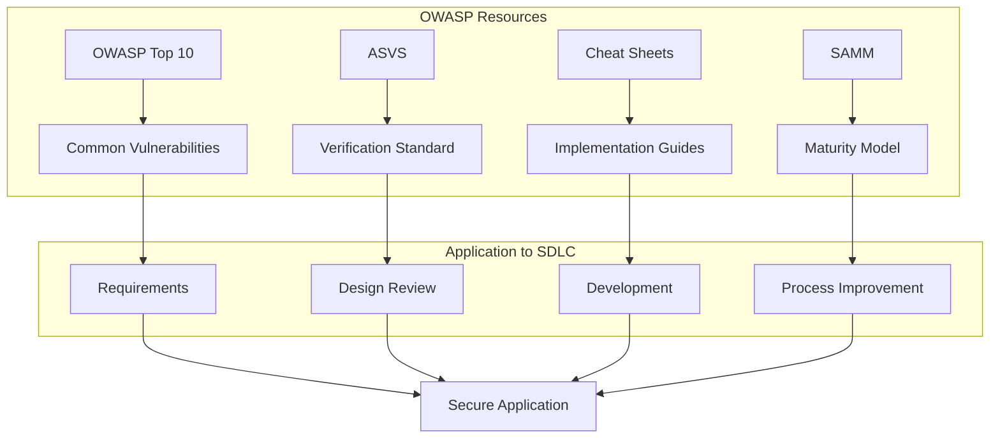

# How to Implement OWASP Security Guidelines

Author: [nawazdhandala](https://www.github.com/nawazdhandala)

Tags: Security, OWASP, Web Security, Application Security, Best Practices, Compliance

Description: A practical guide to implementing OWASP security guidelines in your applications with code examples and configuration templates.

---

The Open Web Application Security Project (OWASP) provides comprehensive security guidelines that help developers build secure applications. Rather than treating security as an afterthought, OWASP encourages integrating security practices throughout the development lifecycle. This guide walks through implementing key OWASP recommendations with practical examples.

## OWASP Security Framework Overview

OWASP provides several frameworks and resources. Understanding how they fit together helps you apply them effectively.



| Resource | Purpose | When to Use |
|----------|---------|-------------|
| OWASP Top 10 | Awareness of critical risks | Planning, training |
| ASVS | Security requirements | Design, testing |
| Cheat Sheets | Implementation guidance | Development |
| SAMM | Process maturity | Organizational improvement |
| Testing Guide | Security testing | QA, penetration testing |

## Implementing ASVS Requirements

The Application Security Verification Standard (ASVS) defines security requirements across three levels. Level 1 is for all applications, Level 2 for applications handling sensitive data, and Level 3 for critical applications.

### Authentication Requirements (V2)

```javascript
// Implementing ASVS V2: Authentication requirements
const express = require('express');
const bcrypt = require('bcrypt');
const speakeasy = require('speakeasy');
const rateLimit = require('express-rate-limit');

// V2.1.1: Passwords must be at least 12 characters
// V2.1.2: Passwords up to 128 characters must be permitted
// V2.1.7: Passwords must be checked against breached password lists
const passwordPolicy = {
    minLength: 12,
    maxLength: 128,
    requireUppercase: true,
    requireLowercase: true,
    requireNumber: true,
    requireSpecial: true
};

async function validatePassword(password) {
    const errors = [];

    if (password.length < passwordPolicy.minLength) {
        errors.push(`Password must be at least ${passwordPolicy.minLength} characters`);
    }

    if (password.length > passwordPolicy.maxLength) {
        errors.push(`Password cannot exceed ${passwordPolicy.maxLength} characters`);
    }

    if (passwordPolicy.requireUppercase && !/[A-Z]/.test(password)) {
        errors.push('Password must contain at least one uppercase letter');
    }

    if (passwordPolicy.requireLowercase && !/[a-z]/.test(password)) {
        errors.push('Password must contain at least one lowercase letter');
    }

    if (passwordPolicy.requireNumber && !/\d/.test(password)) {
        errors.push('Password must contain at least one number');
    }

    if (passwordPolicy.requireSpecial && !/[!@#$%^&*(),.?":{}|<>]/.test(password)) {
        errors.push('Password must contain at least one special character');
    }

    // V2.1.7: Check against breached password list
    const isBreached = await checkBreachedPassword(password);
    if (isBreached) {
        errors.push('This password has been found in a data breach. Please choose a different password.');
    }

    return {
        valid: errors.length === 0,
        errors
    };
}

// Check password against Have I Been Pwned API
async function checkBreachedPassword(password) {
    const crypto = require('crypto');
    const https = require('https');

    // Hash the password with SHA-1 (required by HIBP API)
    const hash = crypto.createHash('sha1').update(password).digest('hex').toUpperCase();
    const prefix = hash.substring(0, 5);
    const suffix = hash.substring(5);

    return new Promise((resolve) => {
        https.get(`https://api.pwnedpasswords.com/range/${prefix}`, (res) => {
            let data = '';
            res.on('data', chunk => data += chunk);
            res.on('end', () => {
                // Check if our hash suffix appears in the results
                const found = data.split('\n').some(line =>
                    line.startsWith(suffix)
                );
                resolve(found);
            });
        }).on('error', () => {
            // If API fails, do not block the user
            resolve(false);
        });
    });
}

// V2.2.1: Anti-automation controls
const authLimiter = rateLimit({
    windowMs: 15 * 60 * 1000,  // 15 minutes
    max: 10,                    // 10 attempts per window
    message: { error: 'Too many login attempts. Please try again later.' },
    standardHeaders: true,
    skipSuccessfulRequests: true
});

// V2.8: Multi-factor authentication
function setupMFA(user) {
    // Generate TOTP secret
    const secret = speakeasy.generateSecret({
        name: `MyApp (${user.email})`,
        length: 32
    });

    return {
        secret: secret.base32,
        qrCode: secret.otpauth_url
    };
}

function verifyMFA(secret, token) {
    return speakeasy.totp.verify({
        secret: secret,
        encoding: 'base32',
        token: token,
        window: 1  // Allow 1 step tolerance for clock drift
    });
}
```

### Session Management Requirements (V3)

```javascript
// Implementing ASVS V3: Session management
const session = require('express-session');
const RedisStore = require('connect-redis').default;
const Redis = require('ioredis');
const crypto = require('crypto');

const redisClient = new Redis({
    host: process.env.REDIS_HOST,
    port: 6379,
    password: process.env.REDIS_PASSWORD
});

// V3.2: Session binding requirements
const sessionConfig = {
    store: new RedisStore({ client: redisClient }),

    // V3.2.1: Generate session ID using cryptographically secure method
    genid: () => crypto.randomBytes(32).toString('hex'),

    // V3.3.1: Session timeout
    cookie: {
        maxAge: 30 * 60 * 1000,  // 30 minutes for sensitive apps

        // V3.4.1: Cookie security attributes
        httpOnly: true,   // Prevent JavaScript access
        secure: true,     // HTTPS only
        sameSite: 'lax',  // CSRF protection
        path: '/',
        domain: process.env.COOKIE_DOMAIN
    },

    name: 'sessionId',  // V3.4.4: Do not use default session cookie name
    secret: process.env.SESSION_SECRET,
    resave: false,
    saveUninitialized: false,

    // V3.3.2: Regenerate session on authentication
    rolling: true
};

// V3.3.3: Session regeneration on privilege change
async function regenerateSessionOnAuth(req, user) {
    return new Promise((resolve, reject) => {
        // Store data to preserve
        const cart = req.session.cart;

        // Destroy old session
        req.session.regenerate((err) => {
            if (err) return reject(err);

            // Set new session data
            req.session.userId = user.id;
            req.session.roles = user.roles;
            req.session.authenticatedAt = Date.now();
            req.session.cart = cart;  // Restore preserved data

            // V3.7: Session binding to additional context
            req.session.userAgent = req.get('User-Agent');
            req.session.ipAddress = req.ip;

            resolve();
        });
    });
}

// V3.7: Detect session hijacking attempts
function validateSessionContext(req, res, next) {
    if (req.session.userId) {
        // Check if User-Agent changed (possible session theft)
        if (req.session.userAgent !== req.get('User-Agent')) {
            req.session.destroy();
            return res.status(401).json({ error: 'Session invalidated' });
        }

        // Optionally check IP (may break for mobile users)
        // if (req.session.ipAddress !== req.ip) { ... }
    }
    next();
}
```

### Access Control Requirements (V4)

```javascript
// Implementing ASVS V4: Access control
const casbin = require('casbin');

// V4.1: General access control design
// Using attribute-based access control (ABAC) with Casbin

// Define the access control model
const model = `
[request_definition]
r = sub, obj, act

[policy_definition]
p = sub, obj, act

[role_definition]
g = _, _

[policy_effect]
e = some(where (p.eft == allow))

[matchers]
m = g(r.sub, p.sub) && r.obj == p.obj && r.act == p.act
`;

// Define policies
const policy = `
p, admin, users, read
p, admin, users, write
p, admin, users, delete
p, manager, users, read
p, manager, users, write
p, user, users, read

p, admin, reports, read
p, admin, reports, write
p, manager, reports, read

g, alice, admin
g, bob, manager
g, charlie, user
`;

async function setupAccessControl() {
    const enforcer = await casbin.newEnforcer(
        casbin.newModel(model),
        new casbin.StringAdapter(policy)
    );
    return enforcer;
}

// V4.1.1: Access control at a trusted enforcement point
async function checkAccess(enforcer, user, resource, action) {
    // Get user's roles from database
    const userRoles = await getUserRoles(user.id);

    // Check each role for permission
    for (const role of userRoles) {
        const allowed = await enforcer.enforce(role, resource, action);
        if (allowed) return true;
    }

    return false;
}

// Express middleware for access control
function requirePermission(resource, action) {
    return async (req, res, next) => {
        if (!req.user) {
            return res.status(401).json({ error: 'Authentication required' });
        }

        const allowed = await checkAccess(req.enforcer, req.user, resource, action);

        if (!allowed) {
            // V4.1.4: Log access control failures
            console.warn('Access denied', {
                userId: req.user.id,
                resource,
                action,
                ip: req.ip,
                timestamp: new Date().toISOString()
            });

            return res.status(403).json({ error: 'Access denied' });
        }

        next();
    };
}

// V4.2: Operation level access control
// V4.2.1: Verify access on every request, not cached
app.get('/api/users/:id',
    authenticate,
    requirePermission('users', 'read'),
    async (req, res) => {
        // Additional resource-level check
        const targetUser = await User.findById(req.params.id);

        // Users can only read their own data unless they have admin role
        if (targetUser.id !== req.user.id && !req.user.roles.includes('admin')) {
            return res.status(403).json({ error: 'Cannot access other user data' });
        }

        res.json(targetUser);
    }
);
```

### Input Validation Requirements (V5)

```javascript
// Implementing ASVS V5: Validation, sanitization, and encoding
const { body, param, query, validationResult } = require('express-validator');
const DOMPurify = require('isomorphic-dompurify');

// V5.1: Input validation
const userValidation = [
    // V5.1.1: Input validation applied on a trusted server
    body('email')
        .isEmail()
        .normalizeEmail()
        .withMessage('Valid email required'),

    body('username')
        .isLength({ min: 3, max: 50 })
        .matches(/^[a-zA-Z0-9_]+$/)
        .withMessage('Username must be 3-50 alphanumeric characters'),

    // V5.1.3: Structured data is validated
    body('age')
        .optional()
        .isInt({ min: 0, max: 150 })
        .withMessage('Age must be a valid number'),

    // V5.1.5: URL validation
    body('website')
        .optional()
        .isURL({ protocols: ['http', 'https'], require_protocol: true })
        .withMessage('Website must be a valid HTTP/HTTPS URL')
];

// V5.2: Sanitization and sandboxing
function sanitizeInput(input, options = {}) {
    if (typeof input !== 'string') return input;

    let sanitized = input;

    // Remove null bytes
    sanitized = sanitized.replace(/\0/g, '');

    // V5.2.1: HTML sanitization
    if (options.allowHtml) {
        sanitized = DOMPurify.sanitize(sanitized, {
            ALLOWED_TAGS: ['b', 'i', 'em', 'strong', 'p', 'br'],
            ALLOWED_ATTR: []
        });
    } else {
        // Escape HTML entities
        sanitized = sanitized
            .replace(/&/g, '&amp;')
            .replace(/</g, '&lt;')
            .replace(/>/g, '&gt;')
            .replace(/"/g, '&quot;')
            .replace(/'/g, '&#039;');
    }

    return sanitized;
}

// V5.3: Output encoding
const outputEncoders = {
    // V5.3.1: HTML context encoding
    html: (str) => str
        .replace(/&/g, '&amp;')
        .replace(/</g, '&lt;')
        .replace(/>/g, '&gt;')
        .replace(/"/g, '&quot;')
        .replace(/'/g, '&#039;'),

    // V5.3.2: HTML attribute encoding
    htmlAttr: (str) => str
        .replace(/&/g, '&amp;')
        .replace(/</g, '&lt;')
        .replace(/>/g, '&gt;')
        .replace(/"/g, '&quot;')
        .replace(/'/g, '&#039;')
        .replace(/`/g, '&#96;'),

    // V5.3.3: JavaScript encoding
    javascript: (str) => JSON.stringify(str).slice(1, -1),

    // V5.3.4: CSS encoding
    css: (str) => str.replace(/[^a-zA-Z0-9]/g, (char) =>
        '\\' + char.charCodeAt(0).toString(16) + ' '
    ),

    // V5.3.6: URL encoding
    url: (str) => encodeURIComponent(str)
};

// Middleware to validate requests
function validate(validations) {
    return async (req, res, next) => {
        await Promise.all(validations.map(v => v.run(req)));

        const errors = validationResult(req);
        if (!errors.isEmpty()) {
            return res.status(400).json({
                error: 'Validation failed',
                details: errors.array()
            });
        }

        next();
    };
}

// Usage
app.post('/api/users', validate(userValidation), async (req, res) => {
    // Input is now validated and safe to use
    const user = await User.create({
        email: req.body.email,
        username: req.body.username
    });

    res.status(201).json(user);
});
```

### Cryptography Requirements (V6)

```javascript
// Implementing ASVS V6: Stored cryptography
const crypto = require('crypto');

// V6.2: Algorithms
const cryptoConfig = {
    // V6.2.1: Use approved cryptographic algorithms
    symmetric: {
        algorithm: 'aes-256-gcm',  // Approved algorithm
        keyLength: 32,             // 256 bits
        ivLength: 12,              // 96 bits for GCM
        tagLength: 16              // 128 bits
    },

    // V6.2.5: Use approved hash functions
    hash: {
        algorithm: 'sha256'        // SHA-256 or higher
    },

    // V6.3.1: Random values using approved RNG
    random: {
        bytes: (length) => crypto.randomBytes(length)
    }
};

// V6.4: Secret management
class SecretManager {
    constructor() {
        // V6.4.1: Keys are not stored in application code
        this.encryptionKey = Buffer.from(process.env.ENCRYPTION_KEY, 'hex');

        if (!this.encryptionKey || this.encryptionKey.length !== 32) {
            throw new Error('Invalid encryption key configuration');
        }
    }

    // V6.2.3: Initialization vectors are not reused
    encrypt(plaintext) {
        // Generate unique IV for each encryption
        const iv = crypto.randomBytes(cryptoConfig.symmetric.ivLength);

        const cipher = crypto.createCipheriv(
            cryptoConfig.symmetric.algorithm,
            this.encryptionKey,
            iv
        );

        let encrypted = cipher.update(plaintext, 'utf8', 'hex');
        encrypted += cipher.final('hex');

        // V6.2.4: Use authenticated encryption
        const authTag = cipher.getAuthTag();

        return {
            ciphertext: encrypted,
            iv: iv.toString('hex'),
            authTag: authTag.toString('hex')
        };
    }

    decrypt(encryptedData) {
        const decipher = crypto.createDecipheriv(
            cryptoConfig.symmetric.algorithm,
            this.encryptionKey,
            Buffer.from(encryptedData.iv, 'hex')
        );

        decipher.setAuthTag(Buffer.from(encryptedData.authTag, 'hex'));

        let decrypted = decipher.update(encryptedData.ciphertext, 'hex', 'utf8');
        decrypted += decipher.final('utf8');

        return decrypted;
    }
}
```

## Security Headers Configuration

Implement comprehensive security headers following OWASP recommendations.

```javascript
// Implementing OWASP security headers
const helmet = require('helmet');

// Complete security headers configuration
const securityHeaders = helmet({
    // Content Security Policy
    contentSecurityPolicy: {
        directives: {
            defaultSrc: ["'self'"],
            scriptSrc: ["'self'", "'strict-dynamic'"],
            styleSrc: ["'self'", "'unsafe-inline'"],
            imgSrc: ["'self'", 'data:', 'https:'],
            fontSrc: ["'self'"],
            objectSrc: ["'none'"],
            baseUri: ["'self'"],
            formAction: ["'self'"],
            frameAncestors: ["'none'"],
            upgradeInsecureRequests: []
        }
    },

    // Cross-Origin policies
    crossOriginEmbedderPolicy: true,
    crossOriginOpenerPolicy: { policy: 'same-origin' },
    crossOriginResourcePolicy: { policy: 'same-origin' },

    // DNS prefetch control
    dnsPrefetchControl: { allow: false },

    // Frameguard (X-Frame-Options)
    frameguard: { action: 'deny' },

    // HSTS
    hsts: {
        maxAge: 31536000,
        includeSubDomains: true,
        preload: true
    },

    // IE No Open
    ieNoOpen: true,

    // No Sniff
    noSniff: true,

    // Origin Agent Cluster
    originAgentCluster: true,

    // Permitted Cross Domain Policies
    permittedCrossDomainPolicies: { permittedPolicies: 'none' },

    // Referrer Policy
    referrerPolicy: { policy: 'strict-origin-when-cross-origin' },

    // XSS Filter
    xssFilter: true
});

app.use(securityHeaders);

// Additional custom headers
app.use((req, res, next) => {
    // Permissions Policy (formerly Feature Policy)
    res.setHeader('Permissions-Policy',
        'accelerometer=(), camera=(), geolocation=(), gyroscope=(), ' +
        'magnetometer=(), microphone=(), payment=(), usb=()'
    );

    // Clear-Site-Data on logout
    if (req.path === '/logout') {
        res.setHeader('Clear-Site-Data', '"cache", "cookies", "storage"');
    }

    next();
});
```

## OWASP Compliance Checklist

Use this checklist to verify your implementation covers key OWASP requirements.

```yaml
# owasp-compliance-checklist.yml
compliance_checklist:

  authentication:
    - id: auth-01
      requirement: "Password minimum 12 characters"
      asvs: "V2.1.1"
      implemented: true

    - id: auth-02
      requirement: "Check passwords against breach database"
      asvs: "V2.1.7"
      implemented: true

    - id: auth-03
      requirement: "Multi-factor authentication available"
      asvs: "V2.8"
      implemented: true

    - id: auth-04
      requirement: "Rate limiting on authentication"
      asvs: "V2.2.1"
      implemented: true

  session:
    - id: sess-01
      requirement: "Cryptographically secure session IDs"
      asvs: "V3.2.1"
      implemented: true

    - id: sess-02
      requirement: "Session regeneration on login"
      asvs: "V3.3.2"
      implemented: true

    - id: sess-03
      requirement: "Secure cookie attributes"
      asvs: "V3.4.1"
      implemented: true

  access_control:
    - id: ac-01
      requirement: "Server-side access control"
      asvs: "V4.1.1"
      implemented: true

    - id: ac-02
      requirement: "Access control logging"
      asvs: "V4.1.4"
      implemented: true

  input_validation:
    - id: input-01
      requirement: "Server-side input validation"
      asvs: "V5.1.1"
      implemented: true

    - id: input-02
      requirement: "Output encoding for context"
      asvs: "V5.3"
      implemented: true

  cryptography:
    - id: crypto-01
      requirement: "Approved encryption algorithms"
      asvs: "V6.2.1"
      implemented: true

    - id: crypto-02
      requirement: "Unique IVs for each encryption"
      asvs: "V6.2.3"
      implemented: true
```

Implementing OWASP guidelines is an ongoing process, not a one-time task. Regularly review your implementation against updated standards, conduct security testing, and stay informed about new vulnerabilities. The goal is to build security into your development culture, making it a natural part of how you write and deploy code.
