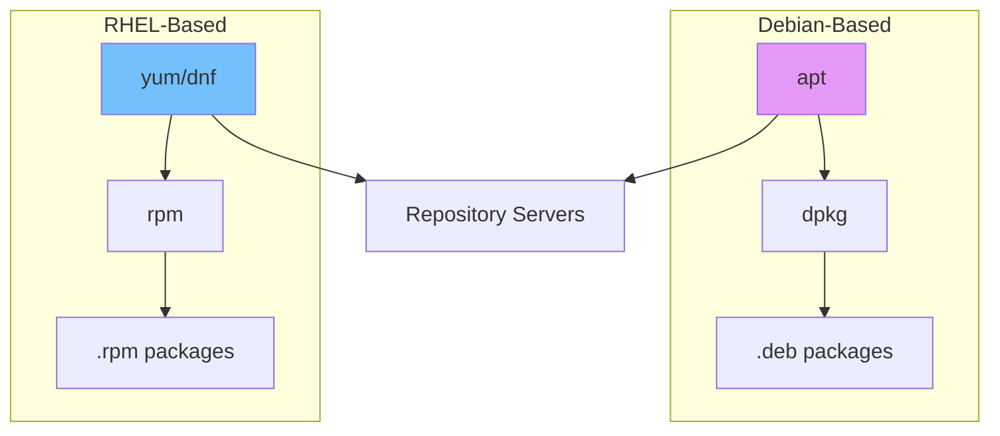
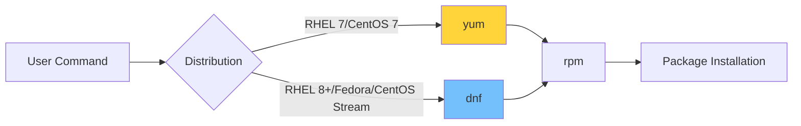
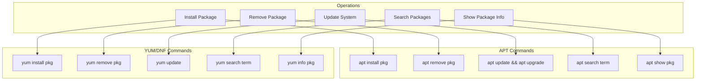

# How to Handle Package Management with apt and yum

Author: [nawazdhandala](https://www.github.com/nawazdhandala)

Tags: Linux, Package Management, apt, yum, dnf, Debian, Ubuntu, RHEL, CentOS, System Administration

Description: A comprehensive guide to managing software packages on Linux using apt for Debian-based systems and yum/dnf for RHEL-based systems.

---

Package management is a fundamental skill for any Linux administrator. Understanding how to install, update, remove, and troubleshoot packages is essential for maintaining healthy Linux systems. This guide covers both apt (used by Debian, Ubuntu, and derivatives) and yum/dnf (used by RHEL, CentOS, Fedora, and derivatives).

## Package Management Overview



## APT - Advanced Package Tool

APT is the package management system used by Debian, Ubuntu, Linux Mint, and other Debian-based distributions.

### Basic APT Operations

```bash
# Update the package index from all configured repositories
# Always run this before installing or upgrading packages
sudo apt update

# Upgrade all installed packages to their latest versions
# This will not remove packages or install new dependencies
sudo apt upgrade

# Full upgrade that can remove packages if needed for dependency resolution
# Use this for major system updates
sudo apt full-upgrade

# Install a single package
# APT will automatically resolve and install dependencies
sudo apt install nginx

# Install multiple packages at once
sudo apt install nginx postgresql redis-server

# Install a specific version of a package
# Useful when you need compatibility with other software
sudo apt install nginx=1.18.0-0ubuntu1

# Remove a package but keep configuration files
sudo apt remove nginx

# Remove a package and its configuration files
# Use this for a complete removal
sudo apt purge nginx

# Remove automatically installed dependencies that are no longer needed
sudo apt autoremove
```

### Searching and Information

```bash
# Search for packages by name or description
# Returns all packages matching the search term
apt search nginx

# Show detailed information about a package
# Includes version, dependencies, description, and size
apt show nginx

# List all installed packages
apt list --installed

# List packages that can be upgraded
apt list --upgradable

# Show which package provides a specific file
apt-file search /usr/bin/nginx

# Check if a package is installed and show its version
dpkg -l | grep nginx
```

### Managing Repositories

```bash
# List all configured repositories
cat /etc/apt/sources.list
ls /etc/apt/sources.list.d/

# Add a new repository using add-apt-repository
# This example adds the official Nginx repository
sudo add-apt-repository ppa:nginx/stable

# Add a repository manually by creating a sources file
# This is the preferred method for third-party repositories
echo "deb https://nginx.org/packages/ubuntu focal nginx" | sudo tee /etc/apt/sources.list.d/nginx.list

# Add a GPG key for repository authentication
# Always verify keys from official sources before adding
curl -fsSL https://nginx.org/keys/nginx_signing.key | sudo gpg --dearmor -o /usr/share/keyrings/nginx-archive-keyring.gpg

# Modern way to add a repository with signed-by option
echo "deb [signed-by=/usr/share/keyrings/nginx-archive-keyring.gpg] https://nginx.org/packages/ubuntu focal nginx" | sudo tee /etc/apt/sources.list.d/nginx.list

# Remove a repository
sudo add-apt-repository --remove ppa:nginx/stable

# Update package index after adding repositories
sudo apt update
```

### Handling Held Packages

Sometimes you need to prevent packages from being upgraded.

```bash
# Hold a package at its current version
# This prevents apt from upgrading the package
sudo apt-mark hold nginx

# Remove the hold to allow upgrades again
sudo apt-mark unhold nginx

# List all held packages
apt-mark showhold
```

### Troubleshooting APT Issues

```bash
# Fix broken dependencies
# This attempts to correct a system with broken dependencies
sudo apt --fix-broken install

# Clean the local repository cache
# Removes downloaded package files from /var/cache/apt/archives
sudo apt clean

# Remove old package files but keep the latest versions
sudo apt autoclean

# Reconfigure a package that was not properly configured
sudo dpkg --configure -a

# Force reinstall of a package
sudo apt install --reinstall nginx

# Check for and fix dpkg interruption issues
sudo dpkg --configure -a
sudo apt update
sudo apt upgrade
```

## YUM and DNF Package Management

YUM (Yellowdog Updater Modified) and its successor DNF (Dandified YUM) are used by RHEL, CentOS, Fedora, and other RPM-based distributions.



### Basic YUM/DNF Operations

```bash
# Check for available updates
# Shows all packages that have newer versions available
sudo yum check-update    # or: sudo dnf check-update

# Update all packages to their latest versions
sudo yum update          # or: sudo dnf upgrade

# Install a package with automatic dependency resolution
sudo yum install nginx   # or: sudo dnf install nginx

# Install multiple packages at once
sudo yum install nginx postgresql redis

# Install a specific version of a package
# Check available versions first with: yum list available nginx --showduplicates
sudo yum install nginx-1.18.0

# Remove a package
sudo yum remove nginx    # or: sudo dnf remove nginx

# Remove a package and its unused dependencies
sudo yum autoremove nginx   # or: sudo dnf autoremove nginx

# Reinstall a package
sudo yum reinstall nginx    # or: sudo dnf reinstall nginx
```

### Searching and Information

```bash
# Search for packages by name or description
yum search nginx         # or: dnf search nginx

# Get detailed information about a package
yum info nginx           # or: dnf info nginx

# List all installed packages
yum list installed       # or: dnf list installed

# List available packages matching a pattern
yum list available 'nginx*'

# Find which package provides a specific file
yum provides /usr/sbin/nginx   # or: dnf provides /usr/sbin/nginx

# Find which package provides a command
yum provides '*/nginx'

# Show package dependencies
yum deplist nginx        # or: dnf repoquery --requires nginx
```

### Managing Repositories

```bash
# List all enabled repositories
yum repolist             # or: dnf repolist

# List all repositories including disabled ones
yum repolist all         # or: dnf repolist all

# Enable a repository temporarily for one operation
sudo yum --enablerepo=epel install htop

# Disable a repository temporarily
sudo yum --disablerepo=epel update

# Install a repository configuration package
# This is common for adding third-party repos like EPEL
sudo yum install epel-release

# Add a repository manually
# Create a .repo file in /etc/yum.repos.d/
cat << 'EOF' | sudo tee /etc/yum.repos.d/nginx.repo
[nginx-stable]
name=nginx stable repo
baseurl=http://nginx.org/packages/centos/$releasever/$basearch/
gpgcheck=1
enabled=1
gpgkey=https://nginx.org/keys/nginx_signing.key
module_hotfixes=true
EOF

# Clean repository cache after adding/modifying repos
sudo yum clean all       # or: sudo dnf clean all
sudo yum makecache       # or: sudo dnf makecache
```

### Package Groups

YUM and DNF support installing groups of related packages.

```bash
# List available package groups
yum grouplist            # or: dnf grouplist

# Get information about a group
yum groupinfo "Development Tools"

# Install a package group
sudo yum groupinstall "Development Tools"
# or: sudo dnf groupinstall "Development Tools"

# Remove a package group
sudo yum groupremove "Development Tools"
```

### Version Locking

Prevent specific packages from being updated.

```bash
# Install the versionlock plugin (yum)
sudo yum install yum-plugin-versionlock

# Lock a package at its current version
sudo yum versionlock add nginx

# List locked packages
yum versionlock list

# Remove a version lock
sudo yum versionlock delete nginx

# Clear all version locks
sudo yum versionlock clear

# For DNF, use the versionlock plugin
sudo dnf install python3-dnf-plugin-versionlock
sudo dnf versionlock add nginx
```

### Troubleshooting YUM/DNF Issues

```bash
# Clean all cached data
# Use when experiencing repository or metadata issues
sudo yum clean all       # or: sudo dnf clean all

# Rebuild the cache
sudo yum makecache       # or: sudo dnf makecache

# Check for dependency problems
sudo yum check           # or: sudo dnf check

# Check for duplicate packages
sudo package-cleanup --dupes

# Remove duplicate packages
sudo package-cleanup --cleandupes

# Fix broken dependencies
sudo yum-complete-transaction    # For interrupted transactions

# For DNF, remove cached data and retry
sudo dnf clean all
sudo dnf distro-sync
```

## Comparison Chart: APT vs YUM/DNF



## Quick Reference Table

| Operation | APT (Debian/Ubuntu) | YUM/DNF (RHEL/CentOS) |
|-----------|---------------------|----------------------|
| Update package index | `apt update` | `yum makecache` |
| Upgrade all packages | `apt upgrade` | `yum update` |
| Install package | `apt install pkg` | `yum install pkg` |
| Remove package | `apt remove pkg` | `yum remove pkg` |
| Search packages | `apt search term` | `yum search term` |
| Package info | `apt show pkg` | `yum info pkg` |
| List installed | `apt list --installed` | `yum list installed` |
| Clean cache | `apt clean` | `yum clean all` |
| Fix dependencies | `apt --fix-broken install` | `yum check` |

## Best Practices for Package Management

### 1. Always Update Package Index First

```bash
# Debian/Ubuntu - update before installing
sudo apt update && sudo apt install nginx

# RHEL/CentOS - makecache before installing
sudo yum makecache && sudo yum install nginx
```

### 2. Review Changes Before Confirming

```bash
# Simulate installation to see what will change
apt install --dry-run nginx

# Or use the -y flag carefully with yum
yum install nginx   # Review prompt before confirming
```

### 3. Keep Systems Updated

```bash
# Create a simple update script for Debian/Ubuntu
cat << 'EOF' > /usr/local/bin/system-update.sh
#!/bin/bash
# Update package index and upgrade all packages
apt update && apt upgrade -y && apt autoremove -y
EOF
chmod +x /usr/local/bin/system-update.sh

# Schedule with cron (example: daily at 3 AM)
echo "0 3 * * * root /usr/local/bin/system-update.sh" >> /etc/crontab
```

### 4. Use Automatic Security Updates

```bash
# Debian/Ubuntu - install unattended-upgrades
sudo apt install unattended-upgrades
sudo dpkg-reconfigure unattended-upgrades

# RHEL/CentOS - configure automatic updates
sudo yum install yum-cron
sudo systemctl enable yum-cron
sudo systemctl start yum-cron
```

## Conclusion

Mastering package management is essential for effective Linux system administration. Whether you are using apt on Debian-based systems or yum/dnf on RHEL-based systems, the core concepts remain the same: keeping systems updated, managing dependencies, and troubleshooting issues when they arise.

**Key Takeaways:**
- Always update the package index before installing new software
- Use version locking for critical packages that should not be automatically updated
- Regularly clean package caches to free disk space
- Set up automatic security updates for production systems

**Related Reading:**
- [How to Fix "Read-Only File System" Errors](https://oneuptime.com/blog/post/2026-01-24-read-only-file-system-errors/view)
- [How to Configure LVM for Storage Management](https://oneuptime.com/blog/post/2026-01-24-lvm-storage-management/view)
