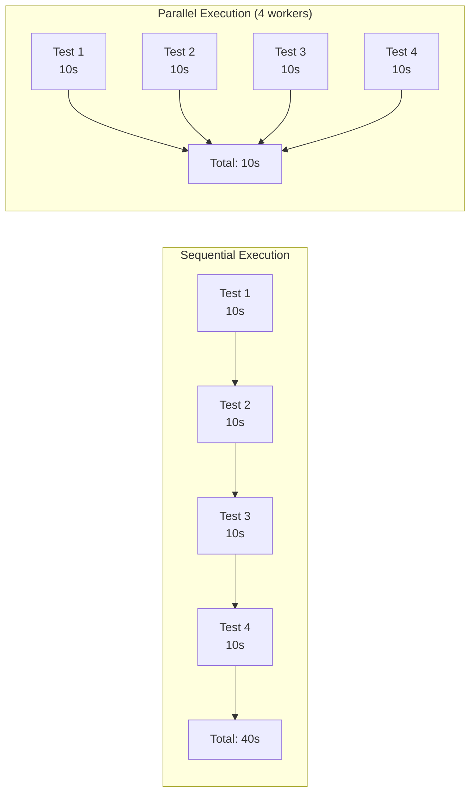
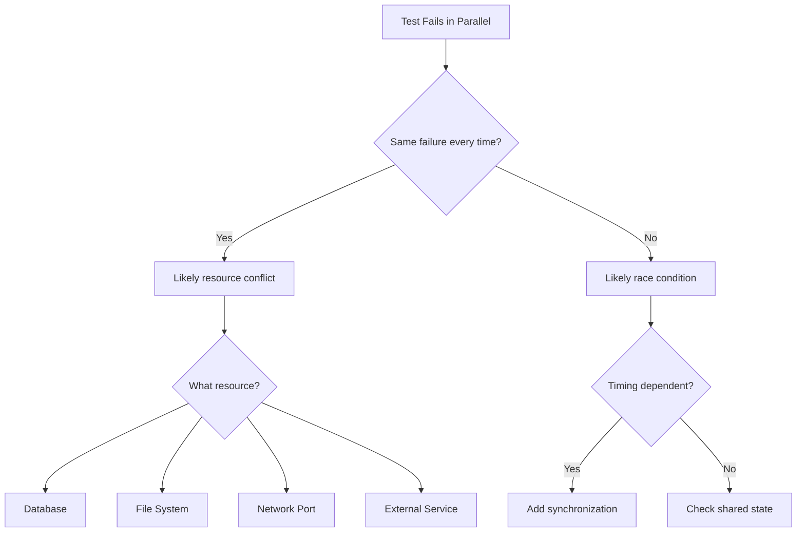
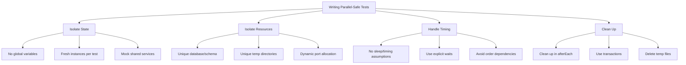

# How to Fix "Parallel Test" Execution Issues

Author: [nawazdhandala](https://www.github.com/nawazdhandala)

Tags: Parallel Testing, Test Execution, Jest, Pytest, Test Isolation, CI/CD, Performance, Concurrency

Description: Learn how to identify and fix common issues with parallel test execution including race conditions, resource conflicts, and test isolation problems.

---

Running tests in parallel can dramatically speed up your test suite. But parallel execution also introduces challenges: tests that pass individually may fail when run together, shared resources cause conflicts, and debugging becomes more difficult. This guide shows you how to identify and fix the most common parallel testing issues.

---

## Table of Contents

1. Understanding Parallel Test Execution
2. Common Parallel Testing Problems
3. Fixing Resource Conflicts
4. Database Isolation Strategies
5. File System Conflicts
6. Network Port Conflicts
7. Framework-Specific Solutions
8. Debugging Parallel Test Failures
9. Best Practices

---

## 1. Understanding Parallel Test Execution

Parallel testing runs multiple tests simultaneously to reduce total execution time.



### Levels of Parallelism

| Level | Description | Isolation | Speed |
|-------|-------------|-----------|-------|
| **Test File** | Different files run in parallel | High | Good |
| **Test Suite** | Different describe blocks in parallel | Medium | Better |
| **Individual Test** | Each test case in parallel | Low | Best |

### Why Parallel Tests Fail

Tests that pass individually but fail in parallel usually suffer from:

1. **Shared state** - Global variables, singletons, or caches
2. **Resource conflicts** - Same database, file, or port
3. **Race conditions** - Timing-dependent behavior
4. **Order dependencies** - Tests relying on previous test side effects

---

## 2. Common Parallel Testing Problems

### Problem: Tests Pass Individually, Fail Together

```javascript
// BAD: Shared module-level state
let userCount = 0;

function createUser() {
  userCount++;
  return { id: userCount };
}

// Test A runs, userCount becomes 1
// Test B runs in parallel, expects id:1 but gets id:2
test('creates first user', () => {
  const user = createUser();
  expect(user.id).toBe(1);  // May fail in parallel
});
```

**Fix: Isolate state per test**

```javascript
// GOOD: Factory function with isolated state
function createUserFactory() {
  let count = 0;
  return () => {
    count++;
    return { id: count };
  };
}

test('creates first user', () => {
  const createUser = createUserFactory();
  const user = createUser();
  expect(user.id).toBe(1);  // Always passes
});
```

### Problem: Flaky Tests Due to Race Conditions

```javascript
// BAD: Race condition with shared file
test('writes to config file', async () => {
  await fs.writeFile('/tmp/config.json', '{"key": "value1"}');
  const content = await fs.readFile('/tmp/config.json', 'utf8');
  expect(JSON.parse(content).key).toBe('value1');  // Another test may overwrite
});
```

**Fix: Use unique paths per test**

```javascript
// GOOD: Unique file per test
const { v4: uuid } = require('uuid');

test('writes to config file', async () => {
  const configPath = `/tmp/config-${uuid()}.json`;
  await fs.writeFile(configPath, '{"key": "value1"}');
  const content = await fs.readFile(configPath, 'utf8');
  expect(JSON.parse(content).key).toBe('value1');
  await fs.unlink(configPath);  // Cleanup
});
```

---

## 3. Fixing Resource Conflicts

### Identifying Resource Conflicts



### Strategy: Resource Namespacing

```javascript
// test/helpers/resourceNamespace.js
function getTestNamespace() {
  // Combine worker ID and test name for uniqueness
  const workerId = process.env.JEST_WORKER_ID || '1';
  const testName = expect.getState().currentTestName || 'unknown';
  const hash = require('crypto')
    .createHash('md5')
    .update(testName)
    .digest('hex')
    .slice(0, 8);

  return `test_${workerId}_${hash}`;
}

// Usage
test('creates temporary directory', async () => {
  const namespace = getTestNamespace();
  const tmpDir = `/tmp/${namespace}`;
  await fs.mkdir(tmpDir, { recursive: true });
  // Use tmpDir...
  await fs.rm(tmpDir, { recursive: true });
});
```

---

## 4. Database Isolation Strategies

Database conflicts are the most common source of parallel test failures.

### Strategy 1: Separate Databases Per Worker

```javascript
// jest.config.js
module.exports = {
  maxWorkers: 4,
  globalSetup: './test/setup/createDatabases.js',
  globalTeardown: './test/setup/dropDatabases.js'
};

// test/setup/createDatabases.js
const { Pool } = require('pg');

module.exports = async () => {
  const adminPool = new Pool({ database: 'postgres' });

  // Create a database for each worker
  for (let i = 1; i <= 4; i++) {
    const dbName = `test_db_worker_${i}`;
    await adminPool.query(`DROP DATABASE IF EXISTS ${dbName}`);
    await adminPool.query(`CREATE DATABASE ${dbName}`);

    // Run migrations on each database
    const workerPool = new Pool({ database: dbName });
    await runMigrations(workerPool);
    await workerPool.end();
  }

  await adminPool.end();
};

// test/setup/setupFile.js (runs before each test file)
beforeAll(() => {
  const workerId = process.env.JEST_WORKER_ID || '1';
  process.env.DATABASE_NAME = `test_db_worker_${workerId}`;
});
```

### Strategy 2: Transaction Rollback

```javascript
// test/helpers/transactionWrapper.js
const { getPool } = require('../../src/database');

class TestTransaction {
  constructor() {
    this.client = null;
    this.savepoints = [];
  }

  async begin() {
    this.client = await getPool().connect();
    await this.client.query('BEGIN');
    return this.client;
  }

  async savepoint(name) {
    await this.client.query(`SAVEPOINT ${name}`);
    this.savepoints.push(name);
  }

  async rollbackToSavepoint(name) {
    await this.client.query(`ROLLBACK TO SAVEPOINT ${name}`);
  }

  async rollback() {
    if (this.client) {
      await this.client.query('ROLLBACK');
      this.client.release();
      this.client = null;
    }
  }
}

// Usage in tests
describe('User Repository', () => {
  let tx;

  beforeEach(async () => {
    tx = new TestTransaction();
    await tx.begin();
  });

  afterEach(async () => {
    await tx.rollback();  // All changes rolled back
  });

  test('creates user', async () => {
    // Insert happens within transaction
    await tx.client.query(
      'INSERT INTO users (name) VALUES ($1)',
      ['Test User']
    );

    const result = await tx.client.query('SELECT * FROM users');
    expect(result.rows).toHaveLength(1);
  });
});
```

### Strategy 3: Table Prefixing

```javascript
// test/helpers/tablePrefix.js
function getTablePrefix() {
  const workerId = process.env.JEST_WORKER_ID || '1';
  return `test_w${workerId}_`;
}

// Override table names in your ORM/query builder
class TestUserRepository {
  constructor(pool) {
    this.pool = pool;
    this.tableName = `${getTablePrefix()}users`;
  }

  async create(user) {
    return this.pool.query(
      `INSERT INTO ${this.tableName} (name, email) VALUES ($1, $2) RETURNING *`,
      [user.name, user.email]
    );
  }
}
```

---

## 5. File System Conflicts

### Problem: Tests Writing to Same Files

```javascript
// BAD: Multiple tests write to same file
test('test A writes config', async () => {
  await fs.writeFile('config.json', '{"a": 1}');
});

test('test B writes config', async () => {
  await fs.writeFile('config.json', '{"b": 2}');
});

test('test C reads config', async () => {
  const config = JSON.parse(await fs.readFile('config.json'));
  // Which config? Depends on timing!
});
```

**Fix: Use isolated temporary directories**

```javascript
// test/helpers/tempDir.js
const os = require('os');
const path = require('path');
const fs = require('fs/promises');
const { v4: uuid } = require('uuid');

async function createTempDir() {
  const dir = path.join(os.tmpdir(), `test-${uuid()}`);
  await fs.mkdir(dir, { recursive: true });
  return dir;
}

async function removeTempDir(dir) {
  await fs.rm(dir, { recursive: true, force: true });
}

// Usage
describe('Config Manager', () => {
  let tempDir;

  beforeEach(async () => {
    tempDir = await createTempDir();
  });

  afterEach(async () => {
    await removeTempDir(tempDir);
  });

  test('writes config', async () => {
    const configPath = path.join(tempDir, 'config.json');
    await configManager.write(configPath, { key: 'value' });

    const content = await fs.readFile(configPath, 'utf8');
    expect(JSON.parse(content)).toEqual({ key: 'value' });
  });
});
```

### Using Jest's Built-in Temp Directories

```javascript
// jest.config.js
module.exports = {
  // Each worker gets isolated temp directory
  cacheDirectory: '<rootDir>/.jest-cache',

  // Custom setup to create per-worker temp dirs
  setupFilesAfterEnv: ['./test/setup/tempDir.js']
};

// test/setup/tempDir.js
const os = require('os');
const path = require('path');
const fs = require('fs');

const workerId = process.env.JEST_WORKER_ID || '1';
const testTempDir = path.join(os.tmpdir(), `jest-worker-${workerId}`);

beforeAll(() => {
  fs.mkdirSync(testTempDir, { recursive: true });
  process.env.TEST_TEMP_DIR = testTempDir;
});

afterAll(() => {
  fs.rmSync(testTempDir, { recursive: true, force: true });
});
```

---

## 6. Network Port Conflicts

### Problem: Tests Binding to Same Port

```javascript
// BAD: Fixed port causes conflicts
test('starts server on port 3000', async () => {
  const server = app.listen(3000);
  // Another parallel test also tries port 3000!
});
```

**Fix: Use dynamic port allocation**

```javascript
// test/helpers/dynamicPort.js
const net = require('net');

async function getAvailablePort() {
  return new Promise((resolve, reject) => {
    const server = net.createServer();
    server.listen(0, () => {
      const port = server.address().port;
      server.close(() => resolve(port));
    });
    server.on('error', reject);
  });
}

// Usage
describe('API Server', () => {
  let server;
  let port;

  beforeAll(async () => {
    port = await getAvailablePort();
    server = app.listen(port);
  });

  afterAll(() => {
    server.close();
  });

  test('responds to health check', async () => {
    const response = await fetch(`http://localhost:${port}/health`);
    expect(response.status).toBe(200);
  });
});
```

**Fix: Use port 0 for automatic assignment**

```javascript
// Express automatically assigns available port when given 0
const server = app.listen(0, () => {
  const actualPort = server.address().port;
  console.log(`Server running on port ${actualPort}`);
});
```

### Port Range Allocation Per Worker

```javascript
// Assign port ranges to avoid conflicts
function getPortRange() {
  const workerId = parseInt(process.env.JEST_WORKER_ID || '1');
  const basePort = 10000 + (workerId * 100);
  return {
    min: basePort,
    max: basePort + 99
  };
}

async function getPortInRange() {
  const { min, max } = getPortRange();
  for (let port = min; port <= max; port++) {
    if (await isPortAvailable(port)) {
      return port;
    }
  }
  throw new Error('No available port in range');
}
```

---

## 7. Framework-Specific Solutions

### Jest Configuration

```javascript
// jest.config.js
module.exports = {
  // Control parallelism
  maxWorkers: '50%',  // Use half of available CPUs
  // Or fixed number
  // maxWorkers: 4,

  // Run tests in band (sequentially) for debugging
  // runInBand: true,

  // Isolate test environments
  testEnvironment: 'node',

  // Run slow tests first for better parallelization
  testSequencer: './test/customSequencer.js',

  // Per-worker setup
  globalSetup: './test/setup/globalSetup.js',
  globalTeardown: './test/setup/globalTeardown.js',
  setupFilesAfterEnv: ['./test/setup/perWorkerSetup.js']
};

// test/customSequencer.js
const Sequencer = require('@jest/test-sequencer').default;

class CustomSequencer extends Sequencer {
  sort(tests) {
    // Run slowest tests first for optimal parallelization
    return tests.sort((a, b) => {
      // Use cached duration if available
      const durationA = a.duration || 0;
      const durationB = b.duration || 0;
      return durationB - durationA;  // Descending order
    });
  }
}

module.exports = CustomSequencer;
```

### Pytest Configuration

```python
# conftest.py
import pytest
import os

@pytest.fixture(scope="session")
def worker_id(request):
    """Get xdist worker ID or 'master' if not running in parallel."""
    if hasattr(request.config, 'workerinput'):
        return request.config.workerinput['workerid']
    return 'master'

@pytest.fixture(scope="session")
def test_database(worker_id):
    """Create isolated database per worker."""
    db_name = f"test_db_{worker_id}"

    # Create database
    create_database(db_name)
    run_migrations(db_name)

    yield db_name

    # Cleanup
    drop_database(db_name)

@pytest.fixture
def db_session(test_database):
    """Transaction-wrapped database session."""
    session = create_session(test_database)
    session.begin_nested()  # SAVEPOINT

    yield session

    session.rollback()
    session.close()
```

```ini
# pytest.ini
[pytest]
addopts = -n auto  # Automatic worker count
# Or fixed: -n 4

# Distribute tests by file (default)
# Or by test: --dist=loadfile
```

### Playwright Configuration

```javascript
// playwright.config.js
const { defineConfig } = require('@playwright/test');

module.exports = defineConfig({
  // Parallel by file
  fullyParallel: true,

  // Number of parallel workers
  workers: process.env.CI ? 4 : undefined,

  // Retry failed tests
  retries: process.env.CI ? 2 : 0,

  // Each test gets unique context
  use: {
    // Unique storage state per test
    storageState: undefined
  },

  // Limit parallelism for specific projects
  projects: [
    {
      name: 'unit-tests',
      testMatch: /.*\.unit\.spec\.ts/,
      // Full parallelism for unit tests
    },
    {
      name: 'e2e-tests',
      testMatch: /.*\.e2e\.spec\.ts/,
      // Limit parallelism for e2e tests
      fullyParallel: false
    }
  ]
});
```

---

## 8. Debugging Parallel Test Failures

### Finding the Problematic Test Combination

```bash
# Run tests in isolation to verify they pass
npx jest --runInBand

# Run specific test files together to find conflicts
npx jest test/a.test.js test/b.test.js

# Use bisect to find conflicting tests
npx jest --shard=1/2  # First half
npx jest --shard=2/2  # Second half
```

### Logging for Parallel Debugging

```javascript
// test/helpers/parallelLogger.js
function createLogger(testName) {
  const workerId = process.env.JEST_WORKER_ID || 'main';
  const prefix = `[Worker ${workerId}][${testName}]`;

  return {
    log: (...args) => console.log(prefix, ...args),
    error: (...args) => console.error(prefix, ...args),
    debug: (...args) => {
      if (process.env.DEBUG) {
        console.log(prefix, '[DEBUG]', ...args);
      }
    }
  };
}

// Usage
describe('User Service', () => {
  const logger = createLogger('UserService');

  test('creates user', async () => {
    logger.debug('Starting user creation');
    // Test code...
    logger.debug('User created successfully');
  });
});
```

### Using Test Annotations

```javascript
// Mark tests that cannot run in parallel
describe.serial('Database migrations', () => {
  // These tests run sequentially
});

// Or with Jest
describe('Tests requiring sequential execution', () => {
  beforeAll(() => {
    if (process.env.JEST_WORKER_ID !== '1') {
      throw new Error('These tests must run on worker 1 only');
    }
  });
});
```

---

## 9. Best Practices

### Parallel Testing Checklist



### Configuration Template

```javascript
// jest.config.js - Parallel-safe configuration
module.exports = {
  // Parallelism settings
  maxWorkers: process.env.CI ? 4 : '50%',

  // Timeout for slow parallel tests
  testTimeout: 30000,

  // Worker isolation
  globalSetup: './test/setup/globalSetup.js',
  globalTeardown: './test/setup/globalTeardown.js',
  setupFilesAfterEnv: ['./test/setup/workerSetup.js'],

  // Test environment
  testEnvironment: 'node',

  // Clear mocks between tests
  clearMocks: true,
  resetMocks: true,
  restoreMocks: true,

  // Fail fast on CI
  bail: process.env.CI ? 1 : 0,

  // Verbose output for debugging
  verbose: true
};
```

### When to Disable Parallelism

Some tests should run sequentially:

```javascript
// tests that modify global state
describe('Environment configuration', () => {
  // These tests modify process.env
});

// tests with external dependencies
describe('Third-party API integration', () => {
  // Rate-limited API that can't handle parallel requests
});

// tests that use shared resources that can't be isolated
describe('Legacy database tests', () => {
  // Tests against production-like database
});
```

```json
{
  "scripts": {
    "test": "jest",
    "test:parallel": "jest --maxWorkers=4",
    "test:sequential": "jest --runInBand",
    "test:integration": "jest --runInBand --testPathPattern=integration"
  }
}
```

---

## Key Takeaways

1. **Isolate test state** - Each test should create its own data and not rely on other tests
2. **Use unique resources** - Databases, files, and ports should be namespaced per worker
3. **Prefer transactions** - Roll back database changes instead of truncating tables
4. **Debug systematically** - Use bisecting and logging to find conflicting tests
5. **Configure appropriately** - Set worker counts based on available resources
6. **Mark sequential tests** - Some tests legitimately need to run in order
7. **Clean up properly** - Always clean up resources in afterEach/afterAll hooks
8. **Monitor CI resources** - Too many workers can slow down CI due to resource contention

---

*Need to monitor your test infrastructure and CI/CD pipelines? [OneUptime](https://oneuptime.com) provides infrastructure monitoring that helps you track build times, test durations, and resource utilization across your development workflow.*
