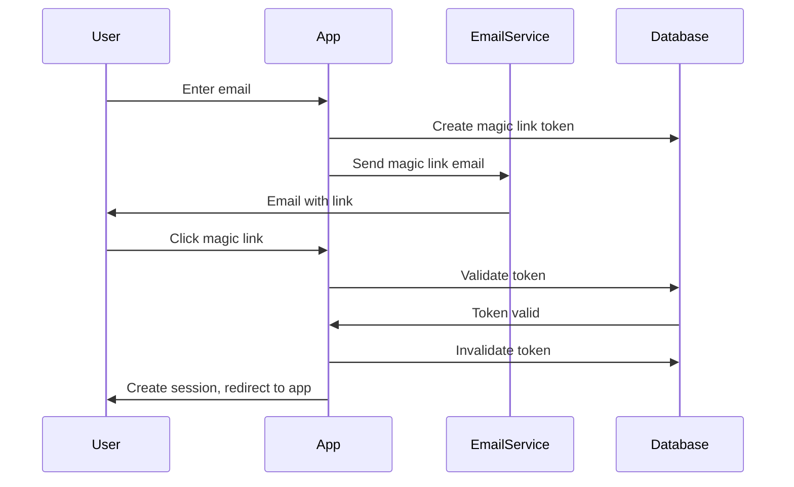
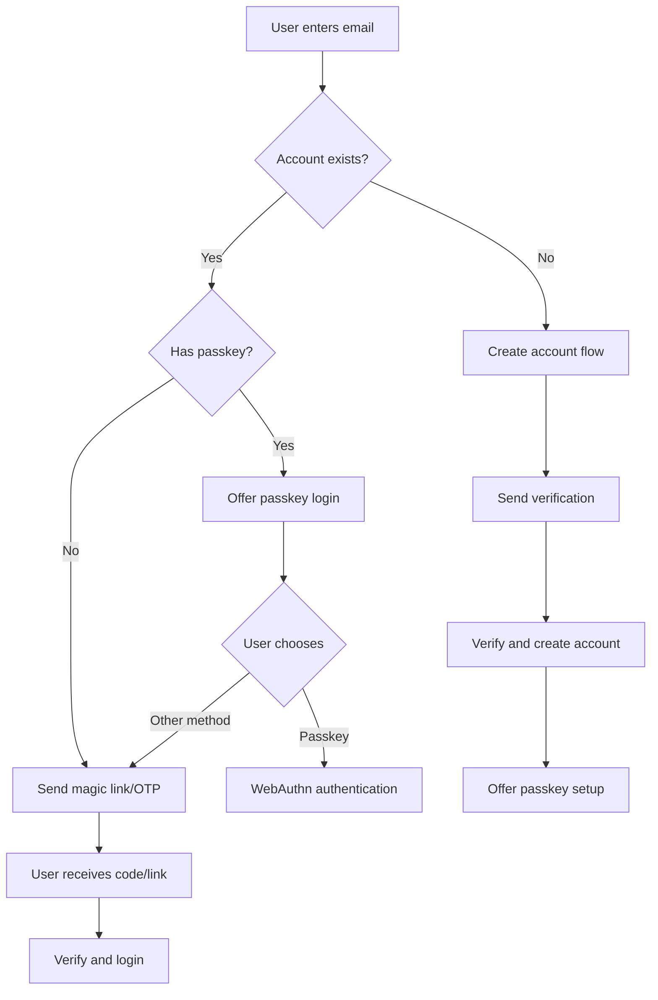

# How to Implement Passwordless Authentication

Author: [nawazdhandala](https://www.github.com/nawazdhandala)

Tags: Authentication, Passwordless, WebAuthn, Magic Links, Security, Passkeys, FIDO2

Description: A practical guide to implementing passwordless authentication using magic links, WebAuthn passkeys, and one-time codes with security best practices.

---

> Passwords are the weakest link in authentication. They get stolen, reused, forgotten, and phished. Passwordless authentication eliminates these problems while improving user experience.

This guide covers practical implementations of passwordless authentication methods including magic links, WebAuthn passkeys, and one-time codes.

---

## Why Go Passwordless


### Comparison of Passwordless Methods

| Method | Security | UX | Implementation | Best For |
|--------|----------|----|--------------------|----------|
| Magic Links | Medium | Excellent | Easy | Consumer apps |
| WebAuthn/Passkeys | High | Good | Medium | Security-focused apps |
| SMS/Email OTP | Medium | Good | Easy | Legacy compatibility |
| Push Notification | High | Excellent | Complex | Mobile-first apps |

---

## Magic Link Authentication

Magic links send a one-time login URL to the user's email. Clicking the link authenticates them without a password.



### Magic Link Implementation

```python
import secrets
import hashlib
from datetime import datetime, timedelta
from typing import Optional, Tuple
from dataclasses import dataclass
import redis
import smtplib
from email.mime.text import MIMEText
from email.mime.multipart import MIMEMultipart

@dataclass
class MagicLinkConfig:
    """Configuration for magic link authentication."""
    token_expiry_minutes: int = 15
    token_length: int = 32
    max_attempts: int = 3
    rate_limit_minutes: int = 5
    base_url: str = "https://app.example.com"

class MagicLinkAuth:
    """
    Implements magic link (email-based passwordless) authentication.
    """

    def __init__(
        self,
        redis_client: redis.Redis,
        config: MagicLinkConfig = None
    ):
        self.redis = redis_client
        self.config = config or MagicLinkConfig()

    def create_magic_link(self, email: str) -> Tuple[Optional[str], Optional[str]]:
        """
        Create a magic link for the given email.

        Returns:
            Tuple of (magic_link_url, error_message)
        """
        email = email.lower().strip()

        # Check rate limit
        rate_key = f"magic_link_rate:{email}"
        if self.redis.get(rate_key):
            return None, "Please wait before requesting another link"

        # Generate secure token
        token = secrets.token_urlsafe(self.config.token_length)

        # Hash token for storage (don't store plaintext)
        token_hash = hashlib.sha256(token.encode()).hexdigest()

        # Store token with metadata
        token_data = {
            'email': email,
            'created_at': datetime.utcnow().isoformat(),
            'attempts': 0,
            'used': False
        }

        # Store with expiration
        token_key = f"magic_link:{token_hash}"
        expiry_seconds = self.config.token_expiry_minutes * 60

        self.redis.setex(
            token_key,
            expiry_seconds,
            json.dumps(token_data)
        )

        # Set rate limit
        self.redis.setex(
            rate_key,
            self.config.rate_limit_minutes * 60,
            "1"
        )

        # Build magic link URL
        magic_link = f"{self.config.base_url}/auth/magic/{token}"

        return magic_link, None

    def verify_magic_link(self, token: str) -> Tuple[Optional[str], Optional[str]]:
        """
        Verify a magic link token.

        Returns:
            Tuple of (email, error_message)
        """
        # Hash the token to look up
        token_hash = hashlib.sha256(token.encode()).hexdigest()
        token_key = f"magic_link:{token_hash}"

        # Get token data
        data = self.redis.get(token_key)
        if not data:
            return None, "Link expired or invalid"

        token_data = json.loads(data)

        # Check if already used
        if token_data.get('used'):
            return None, "Link already used"

        # Check attempts
        if token_data.get('attempts', 0) >= self.config.max_attempts:
            self.redis.delete(token_key)
            return None, "Too many verification attempts"

        # Increment attempts
        token_data['attempts'] = token_data.get('attempts', 0) + 1
        token_data['used'] = True  # Mark as used

        # Update and keep TTL
        ttl = self.redis.ttl(token_key)
        if ttl > 0:
            self.redis.setex(token_key, ttl, json.dumps(token_data))

        return token_data['email'], None

    def invalidate_magic_link(self, token: str):
        """
        Invalidate a magic link (e.g., after successful login).
        """
        token_hash = hashlib.sha256(token.encode()).hexdigest()
        self.redis.delete(f"magic_link:{token_hash}")


class MagicLinkEmailSender:
    """
    Sends magic link emails.
    """

    def __init__(
        self,
        smtp_host: str,
        smtp_port: int,
        smtp_user: str,
        smtp_password: str,
        from_email: str,
        from_name: str = "App"
    ):
        self.smtp_host = smtp_host
        self.smtp_port = smtp_port
        self.smtp_user = smtp_user
        self.smtp_password = smtp_password
        self.from_email = from_email
        self.from_name = from_name

    def send_magic_link(
        self,
        to_email: str,
        magic_link: str,
        expiry_minutes: int = 15
    ):
        """
        Send magic link email.
        """
        subject = "Your login link"

        # HTML email body
        html_body = f"""
        <!DOCTYPE html>
        <html>
        <head>
            <style>
                .button {{
                    background-color: #4CAF50;
                    border: none;
                    color: white;
                    padding: 15px 32px;
                    text-align: center;
                    text-decoration: none;
                    display: inline-block;
                    font-size: 16px;
                    border-radius: 4px;
                }}
            </style>
        </head>
        <body>
            <h2>Login to Your Account</h2>
            <p>Click the button below to log in. This link expires in {expiry_minutes} minutes.</p>
            <p>
                <a href="{magic_link}" class="button">Log In</a>
            </p>
            <p>Or copy and paste this URL into your browser:</p>
            <p>{magic_link}</p>
            <p>If you did not request this link, you can safely ignore this email.</p>
        </body>
        </html>
        """

        # Plain text alternative
        text_body = f"""
        Login to Your Account

        Click the link below to log in (expires in {expiry_minutes} minutes):
        {magic_link}

        If you did not request this link, you can safely ignore this email.
        """

        msg = MIMEMultipart('alternative')
        msg['Subject'] = subject
        msg['From'] = f"{self.from_name} <{self.from_email}>"
        msg['To'] = to_email

        msg.attach(MIMEText(text_body, 'plain'))
        msg.attach(MIMEText(html_body, 'html'))

        with smtplib.SMTP(self.smtp_host, self.smtp_port) as server:
            server.starttls()
            server.login(self.smtp_user, self.smtp_password)
            server.send_message(msg)
```

### Magic Link API Routes

```python
from fastapi import FastAPI, Request, Response, HTTPException
from fastapi.responses import RedirectResponse
from pydantic import BaseModel, EmailStr

app = FastAPI()

class MagicLinkRequest(BaseModel):
    email: EmailStr

class MagicLinkVerifyResponse(BaseModel):
    success: bool
    redirect_url: str = None
    error: str = None

@app.post("/auth/magic-link/request")
async def request_magic_link(request: MagicLinkRequest):
    """
    Request a magic link for passwordless login.
    """
    magic_link_auth = app.state.magic_link_auth
    email_sender = app.state.email_sender

    # Create magic link
    link, error = magic_link_auth.create_magic_link(request.email)

    if error:
        # Don't reveal if email exists
        # Always return success to prevent enumeration
        pass
    else:
        # Send email
        email_sender.send_magic_link(
            to_email=request.email,
            magic_link=link,
            expiry_minutes=magic_link_auth.config.token_expiry_minutes
        )

    # Always return same response
    return {
        "message": "If an account exists, a login link has been sent"
    }

@app.get("/auth/magic/{token}")
async def verify_magic_link(token: str, response: Response):
    """
    Verify magic link and create session.
    """
    magic_link_auth = app.state.magic_link_auth
    session_store = app.state.session_store

    # Verify token
    email, error = magic_link_auth.verify_magic_link(token)

    if error:
        # Redirect to login with error
        return RedirectResponse(
            url=f"/login?error={error}",
            status_code=302
        )

    # Get or create user
    user = await get_or_create_user(email)

    # Create session
    session_id = session_store.create_session(
        user_id=user['id'],
        metadata={'login_method': 'magic_link'}
    )

    # Set session cookie
    redirect = RedirectResponse(url="/dashboard", status_code=302)
    redirect.set_cookie(
        key="session_id",
        value=session_id,
        httponly=True,
        secure=True,
        samesite="lax"
    )

    # Invalidate the magic link
    magic_link_auth.invalidate_magic_link(token)

    return redirect
```

---

## WebAuthn Passkeys

WebAuthn provides phishing-resistant authentication using platform authenticators (fingerprint, face recognition) or security keys.


### WebAuthn Server Implementation

```python
from webauthn import (
    generate_registration_options,
    verify_registration_response,
    generate_authentication_options,
    verify_authentication_response,
    options_to_json,
)
from webauthn.helpers.structs import (
    AuthenticatorSelectionCriteria,
    UserVerificationRequirement,
    ResidentKeyRequirement,
    AttestationConveyancePreference,
    AuthenticatorAttachment,
)
from webauthn.helpers import (
    bytes_to_base64url,
    base64url_to_bytes,
)
from typing import List, Optional, Dict, Any
from dataclasses import dataclass
import json

@dataclass
class WebAuthnConfig:
    """WebAuthn configuration."""
    rp_id: str  # Domain name (e.g., "example.com")
    rp_name: str  # Human-readable name
    origin: str  # Full origin (e.g., "https://example.com")

class PasskeyAuth:
    """
    Implements WebAuthn passkey authentication.
    """

    def __init__(
        self,
        config: WebAuthnConfig,
        credential_store  # Your database/storage
    ):
        self.config = config
        self.credential_store = credential_store
        self._challenges: Dict[str, bytes] = {}  # In production, use Redis

    def start_registration(
        self,
        user_id: str,
        user_email: str,
        user_display_name: str,
        authenticator_type: str = "any"
    ) -> Dict[str, Any]:
        """
        Start passkey registration.

        Args:
            user_id: Unique user identifier
            user_email: User's email (used as username)
            user_display_name: Display name shown to user
            authenticator_type: "platform", "cross-platform", or "any"
        """
        # Get existing credentials to exclude
        existing_credentials = self.credential_store.get_user_credentials(user_id)
        exclude_credentials = [
            {"id": base64url_to_bytes(cred["credential_id"]), "type": "public-key"}
            for cred in existing_credentials
        ]

        # Set authenticator selection based on type
        authenticator_selection = AuthenticatorSelectionCriteria(
            user_verification=UserVerificationRequirement.REQUIRED,
            resident_key=ResidentKeyRequirement.REQUIRED,  # For passkeys
        )

        if authenticator_type == "platform":
            authenticator_selection.authenticator_attachment = \
                AuthenticatorAttachment.PLATFORM
        elif authenticator_type == "cross-platform":
            authenticator_selection.authenticator_attachment = \
                AuthenticatorAttachment.CROSS_PLATFORM

        # Generate registration options
        options = generate_registration_options(
            rp_id=self.config.rp_id,
            rp_name=self.config.rp_name,
            user_id=user_id.encode(),
            user_name=user_email,
            user_display_name=user_display_name,
            exclude_credentials=exclude_credentials,
            authenticator_selection=authenticator_selection,
            attestation=AttestationConveyancePreference.NONE,
        )

        # Store challenge for verification
        self._challenges[user_id] = options.challenge

        return json.loads(options_to_json(options))

    def complete_registration(
        self,
        user_id: str,
        credential_response: Dict[str, Any],
        device_name: str = None
    ) -> Dict[str, Any]:
        """
        Complete passkey registration.
        """
        # Get stored challenge
        challenge = self._challenges.pop(user_id, None)
        if not challenge:
            raise ValueError("Registration session expired")

        # Verify registration response
        verification = verify_registration_response(
            credential=credential_response,
            expected_challenge=challenge,
            expected_rp_id=self.config.rp_id,
            expected_origin=self.config.origin,
        )

        # Store credential
        credential_data = {
            "credential_id": bytes_to_base64url(verification.credential_id),
            "public_key": bytes_to_base64url(verification.credential_public_key),
            "sign_count": verification.sign_count,
            "device_name": device_name or "Unknown Device",
            "created_at": datetime.utcnow().isoformat(),
        }

        self.credential_store.save_credential(user_id, credential_data)

        return {
            "success": True,
            "credential_id": credential_data["credential_id"],
        }

    def start_authentication(
        self,
        user_id: str = None
    ) -> Dict[str, Any]:
        """
        Start passkey authentication.

        If user_id is provided, only that user's credentials are allowed.
        If None, allows discoverable credentials (usernameless login).
        """
        allow_credentials = []

        if user_id:
            # Get user's credentials
            credentials = self.credential_store.get_user_credentials(user_id)
            allow_credentials = [
                {"id": base64url_to_bytes(cred["credential_id"]), "type": "public-key"}
                for cred in credentials
            ]

        # Generate authentication options
        options = generate_authentication_options(
            rp_id=self.config.rp_id,
            allow_credentials=allow_credentials if allow_credentials else None,
            user_verification=UserVerificationRequirement.REQUIRED,
        )

        # Store challenge
        challenge_key = user_id or "discoverable"
        self._challenges[challenge_key] = options.challenge

        return json.loads(options_to_json(options))

    def complete_authentication(
        self,
        credential_response: Dict[str, Any],
        user_id: str = None
    ) -> Dict[str, Any]:
        """
        Complete passkey authentication.
        """
        # Get credential ID from response
        credential_id = credential_response.get("id")

        # Find credential in storage
        if user_id:
            stored_credential = self.credential_store.get_credential(
                user_id, credential_id
            )
            challenge_key = user_id
        else:
            # Discoverable credential - find by credential ID
            stored_credential, user_id = self.credential_store.find_credential_by_id(
                credential_id
            )
            challenge_key = "discoverable"

        if not stored_credential:
            raise ValueError("Credential not found")

        # Get stored challenge
        challenge = self._challenges.pop(challenge_key, None)
        if not challenge:
            raise ValueError("Authentication session expired")

        # Verify authentication response
        verification = verify_authentication_response(
            credential=credential_response,
            expected_challenge=challenge,
            expected_rp_id=self.config.rp_id,
            expected_origin=self.config.origin,
            credential_public_key=base64url_to_bytes(
                stored_credential["public_key"]
            ),
            credential_current_sign_count=stored_credential["sign_count"],
        )

        # Update sign count
        self.credential_store.update_sign_count(
            user_id,
            credential_id,
            verification.new_sign_count
        )

        return {
            "success": True,
            "user_id": user_id,
        }
```

### WebAuthn Frontend Integration

```javascript
// webauthn.js - Client-side WebAuthn helper

class PasskeyAuth {
    constructor(apiBase = '/auth/passkey') {
        this.apiBase = apiBase;
    }

    // Check if WebAuthn is supported
    isSupported() {
        return window.PublicKeyCredential !== undefined;
    }

    // Check if platform authenticator is available (Touch ID, Face ID, Windows Hello)
    async isPlatformAuthenticatorAvailable() {
        if (!this.isSupported()) return false;
        return await PublicKeyCredential.isUserVerifyingPlatformAuthenticatorAvailable();
    }

    // Register a new passkey
    async register(options = {}) {
        // Get registration options from server
        const response = await fetch(`${this.apiBase}/register/start`, {
            method: 'POST',
            headers: { 'Content-Type': 'application/json' },
            body: JSON.stringify(options),
            credentials: 'include'
        });

        if (!response.ok) {
            throw new Error('Failed to start registration');
        }

        const registrationOptions = await response.json();

        // Convert base64url strings to ArrayBuffer
        registrationOptions.challenge = this.base64urlToBuffer(
            registrationOptions.challenge
        );
        registrationOptions.user.id = this.base64urlToBuffer(
            registrationOptions.user.id
        );

        if (registrationOptions.excludeCredentials) {
            registrationOptions.excludeCredentials =
                registrationOptions.excludeCredentials.map(cred => ({
                    ...cred,
                    id: this.base64urlToBuffer(cred.id)
                }));
        }

        // Create credential
        const credential = await navigator.credentials.create({
            publicKey: registrationOptions
        });

        // Send credential to server
        const verifyResponse = await fetch(`${this.apiBase}/register/complete`, {
            method: 'POST',
            headers: { 'Content-Type': 'application/json' },
            body: JSON.stringify({
                id: credential.id,
                rawId: this.bufferToBase64url(credential.rawId),
                type: credential.type,
                response: {
                    clientDataJSON: this.bufferToBase64url(
                        credential.response.clientDataJSON
                    ),
                    attestationObject: this.bufferToBase64url(
                        credential.response.attestationObject
                    ),
                },
                deviceName: options.deviceName
            }),
            credentials: 'include'
        });

        return await verifyResponse.json();
    }

    // Authenticate with passkey
    async authenticate(email = null) {
        // Get authentication options from server
        const body = email ? { email } : {};
        const response = await fetch(`${this.apiBase}/authenticate/start`, {
            method: 'POST',
            headers: { 'Content-Type': 'application/json' },
            body: JSON.stringify(body),
            credentials: 'include'
        });

        if (!response.ok) {
            throw new Error('Failed to start authentication');
        }

        const authOptions = await response.json();

        // Convert base64url strings to ArrayBuffer
        authOptions.challenge = this.base64urlToBuffer(authOptions.challenge);

        if (authOptions.allowCredentials) {
            authOptions.allowCredentials = authOptions.allowCredentials.map(cred => ({
                ...cred,
                id: this.base64urlToBuffer(cred.id)
            }));
        }

        // Get credential
        const credential = await navigator.credentials.get({
            publicKey: authOptions
        });

        // Send credential to server
        const verifyResponse = await fetch(`${this.apiBase}/authenticate/complete`, {
            method: 'POST',
            headers: { 'Content-Type': 'application/json' },
            body: JSON.stringify({
                id: credential.id,
                rawId: this.bufferToBase64url(credential.rawId),
                type: credential.type,
                response: {
                    clientDataJSON: this.bufferToBase64url(
                        credential.response.clientDataJSON
                    ),
                    authenticatorData: this.bufferToBase64url(
                        credential.response.authenticatorData
                    ),
                    signature: this.bufferToBase64url(
                        credential.response.signature
                    ),
                    userHandle: credential.response.userHandle
                        ? this.bufferToBase64url(credential.response.userHandle)
                        : null
                }
            }),
            credentials: 'include'
        });

        return await verifyResponse.json();
    }

    // Helper: ArrayBuffer to base64url
    bufferToBase64url(buffer) {
        const bytes = new Uint8Array(buffer);
        let str = '';
        for (const byte of bytes) {
            str += String.fromCharCode(byte);
        }
        return btoa(str)
            .replace(/\+/g, '-')
            .replace(/\//g, '_')
            .replace(/=/g, '');
    }

    // Helper: base64url to ArrayBuffer
    base64urlToBuffer(base64url) {
        const base64 = base64url
            .replace(/-/g, '+')
            .replace(/_/g, '/');
        const padLen = (4 - (base64.length % 4)) % 4;
        const padded = base64 + '='.repeat(padLen);
        const binary = atob(padded);
        const bytes = new Uint8Array(binary.length);
        for (let i = 0; i < binary.length; i++) {
            bytes[i] = binary.charCodeAt(i);
        }
        return bytes.buffer;
    }
}

// Usage example
const passkey = new PasskeyAuth();

// Check support
if (passkey.isSupported()) {
    console.log('WebAuthn supported');

    // Check for platform authenticator
    passkey.isPlatformAuthenticatorAvailable().then(available => {
        if (available) {
            console.log('Platform authenticator available (Face ID, Touch ID, etc.)');
        }
    });
}

// Register a passkey
async function registerPasskey() {
    try {
        const result = await passkey.register({
            deviceName: 'My MacBook'
        });
        console.log('Passkey registered:', result);
    } catch (error) {
        console.error('Registration failed:', error);
    }
}

// Authenticate with passkey
async function loginWithPasskey(email) {
    try {
        const result = await passkey.authenticate(email);
        console.log('Authentication successful:', result);
        window.location.href = '/dashboard';
    } catch (error) {
        console.error('Authentication failed:', error);
    }
}
```

---

## One-Time Password (OTP) Authentication

Email or SMS-based one-time codes provide a familiar passwordless experience.

```python
import secrets
import hashlib
from datetime import datetime, timedelta
from typing import Optional, Tuple

class OTPAuth:
    """
    One-time password authentication via email or SMS.
    """

    def __init__(
        self,
        redis_client,
        code_length: int = 6,
        expiry_minutes: int = 10,
        max_attempts: int = 3,
        rate_limit_seconds: int = 60
    ):
        self.redis = redis_client
        self.code_length = code_length
        self.expiry_minutes = expiry_minutes
        self.max_attempts = max_attempts
        self.rate_limit_seconds = rate_limit_seconds

    def generate_otp(self, identifier: str, channel: str = "email") -> Tuple[Optional[str], Optional[str]]:
        """
        Generate a one-time password.

        Args:
            identifier: Email or phone number
            channel: "email" or "sms"

        Returns:
            Tuple of (otp_code, error_message)
        """
        identifier = identifier.lower().strip()

        # Check rate limit
        rate_key = f"otp_rate:{channel}:{identifier}"
        if self.redis.exists(rate_key):
            ttl = self.redis.ttl(rate_key)
            return None, f"Please wait {ttl} seconds before requesting another code"

        # Generate numeric OTP
        otp_code = ''.join(
            secrets.choice('0123456789')
            for _ in range(self.code_length)
        )

        # Hash for storage
        code_hash = hashlib.sha256(otp_code.encode()).hexdigest()

        # Store OTP data
        otp_data = {
            'code_hash': code_hash,
            'identifier': identifier,
            'channel': channel,
            'attempts': 0,
            'created_at': datetime.utcnow().isoformat()
        }

        otp_key = f"otp:{channel}:{identifier}"
        self.redis.setex(
            otp_key,
            self.expiry_minutes * 60,
            json.dumps(otp_data)
        )

        # Set rate limit
        self.redis.setex(rate_key, self.rate_limit_seconds, "1")

        return otp_code, None

    def verify_otp(
        self,
        identifier: str,
        code: str,
        channel: str = "email"
    ) -> Tuple[bool, Optional[str]]:
        """
        Verify a one-time password.

        Returns:
            Tuple of (is_valid, error_message)
        """
        identifier = identifier.lower().strip()
        otp_key = f"otp:{channel}:{identifier}"

        # Get stored OTP data
        data = self.redis.get(otp_key)
        if not data:
            return False, "Code expired or not found"

        otp_data = json.loads(data)

        # Check attempts
        if otp_data['attempts'] >= self.max_attempts:
            self.redis.delete(otp_key)
            return False, "Too many failed attempts. Please request a new code."

        # Verify code (constant-time comparison)
        submitted_hash = hashlib.sha256(code.encode()).hexdigest()
        is_valid = secrets.compare_digest(submitted_hash, otp_data['code_hash'])

        if is_valid:
            # Delete OTP after successful verification
            self.redis.delete(otp_key)
            return True, None
        else:
            # Increment attempts
            otp_data['attempts'] += 1
            ttl = self.redis.ttl(otp_key)
            if ttl > 0:
                self.redis.setex(otp_key, ttl, json.dumps(otp_data))

            remaining = self.max_attempts - otp_data['attempts']
            return False, f"Invalid code. {remaining} attempts remaining."


class OTPEmailSender:
    """Send OTP codes via email."""

    def send_otp(self, email: str, code: str, expiry_minutes: int):
        subject = f"Your verification code: {code}"

        body = f"""
        Your verification code is: {code}

        This code expires in {expiry_minutes} minutes.

        If you did not request this code, please ignore this email.
        """

        # Send email using your email service
        send_email(to=email, subject=subject, body=body)


class OTPSMSSender:
    """Send OTP codes via SMS."""

    def __init__(self, sms_provider):
        self.sms = sms_provider

    def send_otp(self, phone: str, code: str, expiry_minutes: int):
        message = f"Your verification code is: {code}. Expires in {expiry_minutes} min."
        self.sms.send(to=phone, message=message)
```

---

## Combining Methods: Flexible Passwordless Auth



### Unified Passwordless Auth Service

```python
from enum import Enum
from typing import Optional, Dict, Any

class AuthMethod(Enum):
    MAGIC_LINK = "magic_link"
    OTP_EMAIL = "otp_email"
    OTP_SMS = "otp_sms"
    PASSKEY = "passkey"

class UnifiedPasswordlessAuth:
    """
    Unified service supporting multiple passwordless methods.
    """

    def __init__(
        self,
        magic_link_auth: MagicLinkAuth,
        otp_auth: OTPAuth,
        passkey_auth: PasskeyAuth,
        user_store,
        email_sender,
        sms_sender
    ):
        self.magic_link = magic_link_auth
        self.otp = otp_auth
        self.passkey = passkey_auth
        self.users = user_store
        self.email = email_sender
        self.sms = sms_sender

    async def initiate_auth(
        self,
        identifier: str,
        preferred_method: AuthMethod = None
    ) -> Dict[str, Any]:
        """
        Initiate authentication with best available method.
        """
        # Determine identifier type
        is_email = '@' in identifier
        is_phone = identifier.startswith('+')

        # Get user if exists
        user = await self.users.get_by_identifier(identifier)

        # Determine available methods
        available_methods = []

        if is_email:
            available_methods.extend([
                AuthMethod.MAGIC_LINK,
                AuthMethod.OTP_EMAIL
            ])

        if is_phone:
            available_methods.append(AuthMethod.OTP_SMS)

        if user and await self.passkey.user_has_passkeys(user['id']):
            available_methods.insert(0, AuthMethod.PASSKEY)

        # Select method
        if preferred_method and preferred_method in available_methods:
            method = preferred_method
        else:
            method = available_methods[0] if available_methods else None

        if not method:
            return {
                'success': False,
                'error': 'No authentication method available for this identifier'
            }

        # Initiate chosen method
        if method == AuthMethod.PASSKEY:
            options = self.passkey.start_authentication(user['id'])
            return {
                'success': True,
                'method': method.value,
                'passkey_options': options
            }

        elif method == AuthMethod.MAGIC_LINK:
            link, error = self.magic_link.create_magic_link(identifier)
            if error:
                return {'success': False, 'error': error}

            await self.email.send_magic_link(identifier, link)
            return {
                'success': True,
                'method': method.value,
                'message': 'Check your email for a login link'
            }

        elif method == AuthMethod.OTP_EMAIL:
            code, error = self.otp.generate_otp(identifier, 'email')
            if error:
                return {'success': False, 'error': error}

            await self.email.send_otp(identifier, code)
            return {
                'success': True,
                'method': method.value,
                'message': 'Check your email for a verification code'
            }

        elif method == AuthMethod.OTP_SMS:
            code, error = self.otp.generate_otp(identifier, 'sms')
            if error:
                return {'success': False, 'error': error}

            await self.sms.send_otp(identifier, code)
            return {
                'success': True,
                'method': method.value,
                'message': 'Check your phone for a verification code'
            }

    async def verify_auth(
        self,
        identifier: str,
        method: AuthMethod,
        credential: Any
    ) -> Dict[str, Any]:
        """
        Verify authentication credential.
        """
        if method == AuthMethod.MAGIC_LINK:
            email, error = self.magic_link.verify_magic_link(credential)
            if error:
                return {'success': False, 'error': error}
            return await self._complete_auth(email)

        elif method in [AuthMethod.OTP_EMAIL, AuthMethod.OTP_SMS]:
            channel = 'email' if method == AuthMethod.OTP_EMAIL else 'sms'
            valid, error = self.otp.verify_otp(identifier, credential, channel)
            if not valid:
                return {'success': False, 'error': error}
            return await self._complete_auth(identifier)

        elif method == AuthMethod.PASSKEY:
            result = self.passkey.complete_authentication(credential)
            if not result['success']:
                return result
            user = await self.users.get_by_id(result['user_id'])
            return await self._complete_auth(user['email'])

    async def _complete_auth(self, identifier: str) -> Dict[str, Any]:
        """
        Complete authentication and create session.
        """
        # Get or create user
        user = await self.users.get_or_create(identifier)

        # Create session
        session = await create_session(user['id'])

        return {
            'success': True,
            'user': {
                'id': user['id'],
                'email': user.get('email'),
            },
            'session_id': session['id'],
            'has_passkey': await self.passkey.user_has_passkeys(user['id'])
        }
```

---

## Security Considerations

### Rate Limiting and Abuse Prevention

```python
from functools import wraps
from flask import request, jsonify
import time

class AuthRateLimiter:
    """
    Rate limiter specifically for authentication endpoints.
    """

    def __init__(self, redis_client):
        self.redis = redis_client

    def check_rate_limit(
        self,
        key: str,
        max_requests: int,
        window_seconds: int
    ) -> tuple:
        """
        Check if rate limit is exceeded.
        Returns (is_limited, retry_after_seconds).
        """
        current = self.redis.get(key)

        if current and int(current) >= max_requests:
            ttl = self.redis.ttl(key)
            return True, ttl

        pipe = self.redis.pipeline()
        pipe.incr(key)
        pipe.expire(key, window_seconds)
        pipe.execute()

        return False, 0


def rate_limit_auth(
    requests_per_minute: int = 5,
    requests_per_hour: int = 20
):
    """
    Decorator to rate limit authentication endpoints.
    """
    def decorator(f):
        @wraps(f)
        async def decorated_function(*args, **kwargs):
            limiter = request.app.state.rate_limiter

            # Get identifier (IP + email if provided)
            ip = request.client.host
            email = (await request.json()).get('email', '')

            # Check minute limit
            minute_key = f"auth_rate:minute:{ip}"
            is_limited, retry_after = limiter.check_rate_limit(
                minute_key, requests_per_minute, 60
            )
            if is_limited:
                return jsonify({
                    'error': 'Too many requests',
                    'retry_after': retry_after
                }), 429

            # Check hour limit
            hour_key = f"auth_rate:hour:{ip}"
            is_limited, retry_after = limiter.check_rate_limit(
                hour_key, requests_per_hour, 3600
            )
            if is_limited:
                return jsonify({
                    'error': 'Too many requests',
                    'retry_after': retry_after
                }), 429

            # Check per-email limit
            if email:
                email_key = f"auth_rate:email:{email}"
                is_limited, retry_after = limiter.check_rate_limit(
                    email_key, 5, 300  # 5 per 5 minutes per email
                )
                if is_limited:
                    # Don't reveal email exists, just slow down
                    await asyncio.sleep(2)

            return await f(*args, **kwargs)
        return decorated_function
    return decorator
```

---

## Summary

Passwordless authentication improves security and user experience. Key takeaways:

1. **Magic links are easiest to implement** - Great for getting started with passwordless
2. **WebAuthn passkeys are most secure** - Phishing-resistant and increasingly supported
3. **OTP codes provide familiar UX** - Good fallback when other methods are unavailable
4. **Combine methods for flexibility** - Let users choose what works for them
5. **Always implement rate limiting** - Prevent abuse of authentication endpoints

Implementation priorities:
1. Start with magic links or email OTP for quick wins
2. Add WebAuthn support for security-conscious users
3. Prompt users to register passkeys after other auth methods
4. Monitor authentication patterns for abuse
5. Provide clear fallback paths when primary method fails

Passwordless authentication is the future. Start transitioning now to improve both security and user experience.
