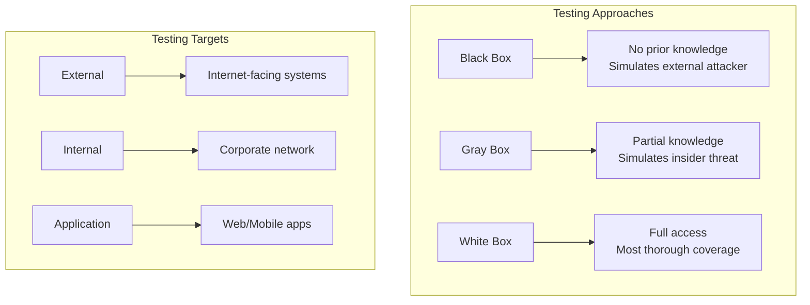

# How to Handle Penetration Testing

Author: [nawazdhandala](https://www.github.com/nawazdhandala)

Tags: Security, Penetration Testing, DevSecOps, Vulnerability Assessment, Red Team, Security Audit

Description: A comprehensive guide to planning, executing, and responding to penetration tests for your applications and infrastructure.

---

Penetration testing simulates real-world attacks against your systems to identify vulnerabilities before malicious actors do. Unlike automated scanning, penetration testing involves skilled professionals who think creatively to find weaknesses in your defenses. This guide covers how to prepare for, execute, and act on penetration test findings.

## Understanding Penetration Testing Types

Different types of penetration tests serve different purposes. Choose based on your security maturity and compliance requirements.



| Test Type | Knowledge Level | Best For |
|-----------|----------------|----------|
| Black Box | None | Simulating external attacks |
| Gray Box | Limited (user credentials) | Authenticated user attacks |
| White Box | Full (source code, architecture) | Finding deep vulnerabilities |
| Red Team | None, but extended scope | Testing detection and response |

## Planning Your Penetration Test

### Define Scope and Rules of Engagement

Before any testing begins, clearly document what is in scope and what boundaries testers must respect.

```yaml
# penetration-test-scope.yml
# Document your testing scope and rules

engagement:
  name: "Q1 2026 Application Security Assessment"
  start_date: "2026-02-01"
  end_date: "2026-02-14"
  testing_hours: "09:00-18:00 UTC"

scope:
  in_scope:
    - domain: "app.example.com"
      type: "web_application"
      authentication: "provided"

    - domain: "api.example.com"
      type: "api"
      documentation: "openapi-spec.json"

    - ip_range: "10.0.1.0/24"
      type: "internal_network"
      access_method: "vpn"

  out_of_scope:
    - "production-database.internal"
    - "third-party integrations"
    - "physical security testing"
    - "social engineering"

rules_of_engagement:
  # Destructive testing rules
  denial_of_service: false
  data_destruction: false
  data_exfiltration: "test data only"

  # Notification requirements
  critical_finding_notification: "immediate"
  emergency_contact: "security@example.com"
  phone: "+1-555-0123"

  # Testing restrictions
  max_concurrent_requests: 100
  restricted_hours: "weekends"

credentials_provided:
  - role: "standard_user"
    username: "pentest_user1"
  - role: "admin"
    username: "pentest_admin"
```

### Prepare Your Environment

Set up proper monitoring and create isolated test environments when possible.

```bash
#!/bin/bash
# prepare-pentest-environment.sh
# Script to prepare environment for penetration testing

# Create dedicated test accounts
echo "Creating test accounts..."
./scripts/create-user.sh pentest_standard "standard_user" --expires 2026-02-15
./scripts/create-user.sh pentest_admin "admin" --expires 2026-02-15

# Enable enhanced logging for the testing period
echo "Enabling enhanced security logging..."
cat > /etc/security/pentest-logging.conf << 'EOF'
# Enhanced logging configuration for penetration testing
log_level=DEBUG
log_all_auth_attempts=true
log_all_api_requests=true
log_response_bodies=false
retention_days=90
EOF

# Apply logging configuration
systemctl reload security-logging

# Create network monitoring rules
echo "Setting up network monitoring..."
cat > /etc/iptables/pentest-monitoring.rules << 'EOF'
# Log all traffic from pentest IP ranges
-A INPUT -s 203.0.113.0/24 -j LOG --log-prefix "PENTEST: "
-A OUTPUT -d 203.0.113.0/24 -j LOG --log-prefix "PENTEST: "
EOF

# Notify monitoring team
echo "Notifying SOC team..."
curl -X POST https://slack.example.com/webhook \
  -H "Content-Type: application/json" \
  -d '{
    "channel": "#security-ops",
    "text": "Penetration testing begins 2026-02-01. Enhanced monitoring enabled."
  }'

echo "Environment prepared for penetration testing."
```

## During the Penetration Test

### Monitoring and Communication

Maintain communication with the testing team throughout the engagement.

```python
# pentest_monitor.py
# Monitor and track penetration testing activity

import logging
from datetime import datetime
from dataclasses import dataclass
from typing import Optional
import json

# Configure logging
logging.basicConfig(
    filename='/var/log/pentest-activity.log',
    level=logging.INFO,
    format='%(asctime)s - %(levelname)s - %(message)s'
)

@dataclass
class PentestActivity:
    timestamp: datetime
    source_ip: str
    target: str
    activity_type: str
    severity: str
    details: Optional[str] = None

class PentestMonitor:
    def __init__(self, pentest_ip_ranges: list, alert_webhook: str):
        self.pentest_ranges = pentest_ip_ranges
        self.alert_webhook = alert_webhook
        self.activities = []

    def is_pentest_traffic(self, source_ip: str) -> bool:
        """Check if traffic originates from known pentest IP ranges."""
        from ipaddress import ip_address, ip_network

        try:
            ip = ip_address(source_ip)
            for range_str in self.pentest_ranges:
                if ip in ip_network(range_str):
                    return True
        except ValueError:
            pass
        return False

    def log_activity(self, activity: PentestActivity):
        """Log penetration testing activity."""
        self.activities.append(activity)

        log_entry = {
            'timestamp': activity.timestamp.isoformat(),
            'source_ip': activity.source_ip,
            'target': activity.target,
            'type': activity.activity_type,
            'severity': activity.severity,
            'details': activity.details
        }

        logging.info(json.dumps(log_entry))

        # Alert on high severity findings
        if activity.severity in ['critical', 'high']:
            self.send_alert(activity)

    def send_alert(self, activity: PentestActivity):
        """Send immediate alert for critical findings."""
        import requests

        message = {
            'text': f"Pentest Alert: {activity.severity.upper()} severity activity detected",
            'attachments': [{
                'color': 'danger' if activity.severity == 'critical' else 'warning',
                'fields': [
                    {'title': 'Target', 'value': activity.target, 'short': True},
                    {'title': 'Type', 'value': activity.activity_type, 'short': True},
                    {'title': 'Details', 'value': activity.details or 'N/A'}
                ]
            }]
        }

        try:
            requests.post(self.alert_webhook, json=message, timeout=10)
        except requests.RequestException as e:
            logging.error(f"Failed to send alert: {e}")

    def generate_daily_report(self) -> dict:
        """Generate daily summary of pentest activities."""
        today = datetime.now().date()

        today_activities = [
            a for a in self.activities
            if a.timestamp.date() == today
        ]

        severity_counts = {}
        for activity in today_activities:
            severity_counts[activity.severity] = \
                severity_counts.get(activity.severity, 0) + 1

        return {
            'date': today.isoformat(),
            'total_activities': len(today_activities),
            'by_severity': severity_counts,
            'unique_targets': len(set(a.target for a in today_activities))
        }


# Example usage
if __name__ == '__main__':
    monitor = PentestMonitor(
        pentest_ip_ranges=['203.0.113.0/24'],
        alert_webhook='https://hooks.slack.com/services/xxx'
    )

    # Log an activity
    monitor.log_activity(PentestActivity(
        timestamp=datetime.now(),
        source_ip='203.0.113.42',
        target='api.example.com',
        activity_type='sql_injection_attempt',
        severity='high',
        details='Attempted SQLi in /api/users endpoint'
    ))
```

### Incident Response Coordination

Have clear procedures for when testers find critical vulnerabilities.

```yaml
# critical-finding-procedure.yml
# Procedure for handling critical findings during pentest

critical_finding_workflow:

  step_1_immediate_notification:
    timeframe: "within 1 hour of discovery"
    contacts:
      - security_team_lead
      - application_owner
      - ciso  # For critical severity only
    channels:
      - phone
      - secure_email
      - slack_dm

  step_2_initial_assessment:
    timeframe: "within 4 hours"
    activities:
      - verify_finding_is_valid
      - assess_exploitability
      - determine_data_exposure_risk
      - identify_affected_systems

  step_3_decision_point:
    options:
      immediate_remediation:
        criteria:
          - "actively exploitable"
          - "exposes sensitive data"
          - "affects production systems"
        actions:
          - pause_pentest_on_affected_systems
          - deploy_emergency_fix
          - resume_after_verification

      continue_testing:
        criteria:
          - "requires specific conditions"
          - "low likelihood of exploitation"
          - "test environment only"
        actions:
          - document_finding
          - add_to_remediation_backlog
          - continue_pentest

  step_4_documentation:
    required_fields:
      - finding_id
      - discovery_timestamp
      - affected_systems
      - exploitation_steps
      - business_impact
      - remediation_actions
      - timeline
```

## Handling Penetration Test Results

### Processing the Final Report

Structure your response to findings systematically.

```javascript
// pentest-findings-processor.js
// Process and prioritize penetration test findings

const findings = {
    // Example finding structure from pentest report
    critical: [],
    high: [],
    medium: [],
    low: [],
    informational: []
};

class FindingProcessor {
    constructor(report) {
        this.report = report;
        this.prioritizedFindings = [];
    }

    // Calculate risk score based on multiple factors
    calculateRiskScore(finding) {
        const severityScores = {
            critical: 10,
            high: 8,
            medium: 5,
            low: 2,
            informational: 1
        };

        const exploitabilityScores = {
            easy: 3,      // Publicly available exploit
            moderate: 2,  // Requires some skill
            difficult: 1  // Requires significant expertise
        };

        const impactScores = {
            data_breach: 10,
            system_compromise: 8,
            privilege_escalation: 7,
            information_disclosure: 5,
            denial_of_service: 4
        };

        const baseScore = severityScores[finding.severity] || 0;
        const exploitability = exploitabilityScores[finding.exploitability] || 1;
        const impact = impactScores[finding.impact_type] || 1;

        // Factor in whether it affects production
        const environmentMultiplier = finding.affects_production ? 1.5 : 1;

        return (baseScore * exploitability * impact * environmentMultiplier) / 10;
    }

    // Assign remediation timelines based on risk
    assignTimeline(finding) {
        const riskScore = this.calculateRiskScore(finding);

        if (riskScore >= 20) {
            return {
                timeline: '24 hours',
                priority: 'P1',
                escalation: 'CISO'
            };
        } else if (riskScore >= 10) {
            return {
                timeline: '7 days',
                priority: 'P2',
                escalation: 'Security Lead'
            };
        } else if (riskScore >= 5) {
            return {
                timeline: '30 days',
                priority: 'P3',
                escalation: 'Team Lead'
            };
        } else {
            return {
                timeline: '90 days',
                priority: 'P4',
                escalation: 'None'
            };
        }
    }

    // Generate JIRA tickets for each finding
    generateTickets(findings) {
        return findings.map(finding => ({
            project: 'SEC',
            type: 'Security Vulnerability',
            summary: `[${finding.severity.toUpperCase()}] ${finding.title}`,
            description: this.formatDescription(finding),
            priority: this.assignTimeline(finding).priority,
            labels: ['pentest', 'security', finding.severity],
            dueDate: this.calculateDueDate(finding),
            assignee: this.determineAssignee(finding)
        }));
    }

    formatDescription(finding) {
        return `
## Summary
${finding.description}

## Affected Systems
${finding.affected_systems.join('\n')}

## Steps to Reproduce
${finding.reproduction_steps}

## Business Impact
${finding.business_impact}

## Recommended Remediation
${finding.remediation}

## References
${finding.references.join('\n')}

---
*Finding ID: ${finding.id}*
*Discovered: ${finding.discovered_date}*
*Risk Score: ${this.calculateRiskScore(finding)}*
        `;
    }

    calculateDueDate(finding) {
        const timeline = this.assignTimeline(finding);
        const days = parseInt(timeline.timeline) || 90;
        const dueDate = new Date();
        dueDate.setDate(dueDate.getDate() + days);
        return dueDate.toISOString().split('T')[0];
    }

    determineAssignee(finding) {
        // Map finding categories to team ownership
        const ownershipMap = {
            'authentication': 'identity-team',
            'authorization': 'identity-team',
            'injection': 'backend-team',
            'xss': 'frontend-team',
            'infrastructure': 'platform-team',
            'configuration': 'devops-team'
        };

        return ownershipMap[finding.category] || 'security-team';
    }
}

module.exports = FindingProcessor;
```

## Remediation Tracking

Track the status of all findings through to resolution.

```sql
-- Schema for tracking pentest findings and remediation
CREATE TABLE pentest_engagements (
    id SERIAL PRIMARY KEY,
    name VARCHAR(255) NOT NULL,
    vendor VARCHAR(255),
    start_date DATE NOT NULL,
    end_date DATE NOT NULL,
    report_received DATE,
    status VARCHAR(50) DEFAULT 'active'
);

CREATE TABLE pentest_findings (
    id SERIAL PRIMARY KEY,
    engagement_id INTEGER REFERENCES pentest_engagements(id),
    external_id VARCHAR(100),  -- Vendor's finding ID
    title VARCHAR(500) NOT NULL,
    severity VARCHAR(20) NOT NULL,
    cvss_score DECIMAL(3,1),
    description TEXT,
    affected_systems TEXT[],
    remediation_recommendation TEXT,
    status VARCHAR(50) DEFAULT 'open',
    assigned_team VARCHAR(100),
    due_date DATE,
    closed_date DATE,
    created_at TIMESTAMP DEFAULT CURRENT_TIMESTAMP,
    updated_at TIMESTAMP DEFAULT CURRENT_TIMESTAMP
);

CREATE TABLE finding_comments (
    id SERIAL PRIMARY KEY,
    finding_id INTEGER REFERENCES pentest_findings(id),
    author VARCHAR(255),
    comment TEXT,
    created_at TIMESTAMP DEFAULT CURRENT_TIMESTAMP
);

-- View for executive reporting
CREATE VIEW pentest_summary AS
SELECT
    pe.name as engagement,
    pf.severity,
    COUNT(*) as total_findings,
    SUM(CASE WHEN pf.status = 'closed' THEN 1 ELSE 0 END) as closed,
    SUM(CASE WHEN pf.status = 'open' AND pf.due_date < CURRENT_DATE THEN 1 ELSE 0 END) as overdue
FROM pentest_findings pf
JOIN pentest_engagements pe ON pf.engagement_id = pe.id
GROUP BY pe.name, pf.severity
ORDER BY pe.name,
    CASE pf.severity
        WHEN 'critical' THEN 1
        WHEN 'high' THEN 2
        WHEN 'medium' THEN 3
        WHEN 'low' THEN 4
        ELSE 5
    END;
```

## Post-Remediation Verification

After fixing vulnerabilities, verify the fixes work.

```bash
#!/bin/bash
# verify-remediation.sh
# Verify that pentest findings have been properly remediated

FINDING_ID=$1
TEST_TYPE=$2

echo "Verifying remediation for finding: $FINDING_ID"

case $TEST_TYPE in
    "sql_injection")
        # Test SQL injection fix using sqlmap
        sqlmap -u "https://app.example.com/api/users?id=1" \
            --batch \
            --level=3 \
            --risk=2 \
            --output-dir=/tmp/sqlmap-verify

        if grep -q "not injectable" /tmp/sqlmap-verify/*/log; then
            echo "PASS: SQL injection vulnerability remediated"
            exit 0
        else
            echo "FAIL: SQL injection may still be present"
            exit 1
        fi
        ;;

    "xss")
        # Test XSS fix using custom payloads
        PAYLOADS=(
            "<script>alert(1)</script>"
            ""
            "javascript:alert(1)"
        )

        for payload in "${PAYLOADS[@]}"; do
            response=$(curl -s "https://app.example.com/search?q=$(urlencode "$payload")")
            if echo "$response" | grep -q "$payload"; then
                echo "FAIL: XSS payload reflected: $payload"
                exit 1
            fi
        done
        echo "PASS: XSS vulnerability remediated"
        ;;

    *)
        echo "Unknown test type: $TEST_TYPE"
        exit 1
        ;;
esac
```

Penetration testing is not a one-time activity but part of an ongoing security program. Schedule regular tests, track metrics over time, and use findings to improve your overall security posture. The goal is not just to fix individual vulnerabilities but to strengthen your security processes and culture.
