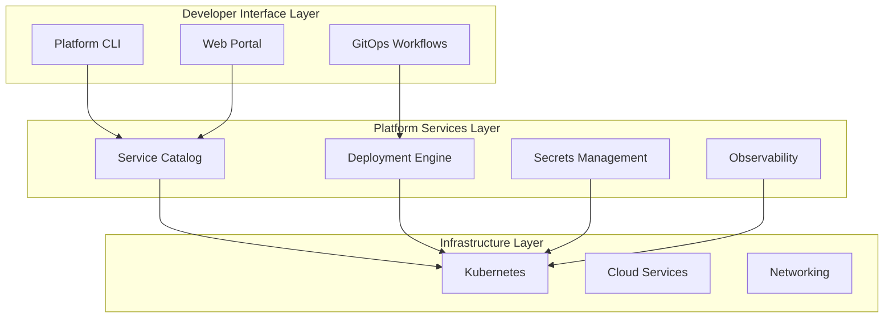

# How to Handle Platform Engineering

Author: [nawazdhandala](https://www.github.com/nawazdhandala)

Tags: Platform Engineering, DevOps, Infrastructure, Developer Experience, Internal Platforms

Description: A practical guide to building and managing platform engineering practices that improve developer productivity and reduce operational burden.

---

Platform engineering has emerged as the discipline that sits between infrastructure teams and application developers. Instead of throwing developers into the deep end of Kubernetes and cloud services, platform teams build golden paths that make the right thing easy.

## What Platform Engineering Actually Means

Platform engineering is about building internal products. Your users are developers. Your product is a self-service platform that handles infrastructure complexity so developers can focus on shipping features.

```mermaid
flowchart LR
    subgraph Traditional["Traditional Ops Model"]
        Dev1[Developer] --> Ticket[Support Ticket]
        Ticket --> Ops[Ops Team]
        Ops --> Infra[Infrastructure]
    end

    subgraph Platform["Platform Engineering Model"]
        Dev2[Developer] --> Portal[Self-Service Portal]
        Portal --> Platform[Platform]
        Platform --> Infra2[Infrastructure]
    end
```

The difference is wait time. With tickets, developers wait hours or days. With a platform, they wait seconds.

## Building Your Platform Strategy

Before writing any code, define what problems you are solving. Interview your developers. Watch them work. Find the friction points.

Common pain points platform engineering addresses:

- Environment provisioning takes too long
- Deployment processes are inconsistent across teams
- Developers lack visibility into their services in production
- Security and compliance requirements slow down delivery
- Onboarding new team members takes weeks

### Starting With a Platform Team

A platform team should be small and product-focused. Three to five engineers is plenty to start. Hire people who understand both infrastructure and developer workflows.

The team should treat internal developers like customers. That means user research, feedback loops, and iterating based on actual usage patterns.

## Core Components of a Developer Platform

A mature platform typically includes these building blocks.

### Service Catalog

A service catalog is a registry of all services, their owners, dependencies, and metadata. It answers questions like "who owns this service?" and "what depends on our database?"

Here is a simple service catalog entry stored as YAML in a git repository.

```yaml
# catalog/services/payment-service.yaml
apiVersion: oneuptime.com/v1
kind: Service
metadata:
  name: payment-service
  description: Handles all payment processing and billing
  owner: payments-team
spec:
  # Repository information
  repository: github.com/company/payment-service

  # Service tier affects SLA expectations
  tier: critical

  # Dependencies this service relies on
  dependencies:
    - name: postgres-primary
      type: database
    - name: redis-cache
      type: cache
    - name: stripe-api
      type: external

  # Deployment information
  deployment:
    environment: production
    namespace: payments
    replicas: 3

  # Observability endpoints
  observability:
    metrics: /metrics
    health: /healthz
    dashboards:
      - grafana.internal/d/payments-overview
```

### Self-Service Infrastructure

Developers should be able to provision what they need without filing tickets. Use Infrastructure as Code templates they can customize.

This Terraform module lets developers request a new database by filling in a few variables.

```hcl
# modules/postgres-database/main.tf
variable "service_name" {
  description = "Name of the service that owns this database"
  type        = string
}

variable "size" {
  description = "Database size: small, medium, large"
  type        = string
  default     = "small"

  validation {
    condition     = contains(["small", "medium", "large"], var.size)
    error_message = "Size must be small, medium, or large."
  }
}

variable "environment" {
  description = "Environment: development, staging, production"
  type        = string
}

locals {
  # Map sizes to actual resource specifications
  size_map = {
    small  = { cpu = "1", memory = "2Gi", storage = "20Gi" }
    medium = { cpu = "2", memory = "4Gi", storage = "50Gi" }
    large  = { cpu = "4", memory = "8Gi", storage = "100Gi" }
  }
}

resource "kubernetes_stateful_set" "postgres" {
  metadata {
    name      = "${var.service_name}-db"
    namespace = var.environment
    labels = {
      "app.kubernetes.io/name"       = "postgres"
      "app.kubernetes.io/instance"   = var.service_name
      "app.kubernetes.io/managed-by" = "platform-team"
    }
  }

  spec {
    service_name = "${var.service_name}-db"
    replicas     = var.environment == "production" ? 2 : 1

    selector {
      match_labels = {
        "app.kubernetes.io/name"     = "postgres"
        "app.kubernetes.io/instance" = var.service_name
      }
    }

    template {
      spec {
        container {
          name  = "postgres"
          image = "postgres:15"

          resources {
            requests = {
              cpu    = local.size_map[var.size].cpu
              memory = local.size_map[var.size].memory
            }
            limits = {
              cpu    = local.size_map[var.size].cpu
              memory = local.size_map[var.size].memory
            }
          }
        }
      }
    }

    volume_claim_template {
      metadata {
        name = "data"
      }
      spec {
        access_modes       = ["ReadWriteOnce"]
        storage_class_name = "fast-ssd"
        resources {
          requests = {
            storage = local.size_map[var.size].storage
          }
        }
      }
    }
  }
}

# Output connection string for the service to use
output "connection_string" {
  value     = "postgres://$(DB_USER):$(DB_PASSWORD)@${var.service_name}-db.${var.environment}.svc.cluster.local:5432/${var.service_name}"
  sensitive = true
}
```

### Golden Path Templates

Golden paths are opinionated starting points for new services. They encode your organization's best practices into templates developers can use immediately.

This script scaffolds a new service with all the basics in place.

```bash
#!/bin/bash
# scripts/create-service.sh
# Creates a new service from the golden path template

set -euo pipefail

SERVICE_NAME=$1
TEAM_NAME=$2
SERVICE_TYPE=${3:-"api"}  # api, worker, or frontend

if [[ -z "$SERVICE_NAME" || -z "$TEAM_NAME" ]]; then
    echo "Usage: create-service.sh <service-name> <team-name> [service-type]"
    exit 1
fi

TEMPLATE_DIR="templates/${SERVICE_TYPE}"
OUTPUT_DIR="services/${SERVICE_NAME}"

echo "Creating ${SERVICE_TYPE} service: ${SERVICE_NAME}"
echo "Owner: ${TEAM_NAME}"

# Copy template files
cp -r "${TEMPLATE_DIR}" "${OUTPUT_DIR}"

# Replace placeholders in all files
find "${OUTPUT_DIR}" -type f -exec sed -i \
    -e "s/{{SERVICE_NAME}}/${SERVICE_NAME}/g" \
    -e "s/{{TEAM_NAME}}/${TEAM_NAME}/g" \
    -e "s/{{CREATED_DATE}}/$(date +%Y-%m-%d)/g" \
    {} \;

# Rename template files
mv "${OUTPUT_DIR}/service.yaml.tmpl" "${OUTPUT_DIR}/${SERVICE_NAME}.yaml"

echo "Service created at ${OUTPUT_DIR}"
echo ""
echo "Next steps:"
echo "  1. Review generated files"
echo "  2. Add your service code to src/"
echo "  3. Run 'make deploy-dev' to deploy to development"
```

## Platform Architecture Patterns

A well-designed platform separates concerns into layers.



### GitOps for Everything

All infrastructure changes should flow through git. This provides audit trails, enables code review, and makes rollbacks trivial.

This GitHub Actions workflow deploys services when their configuration changes.

```yaml
# .github/workflows/platform-deploy.yaml
name: Platform Deployment

on:
  push:
    branches: [main]
    paths:
      - 'services/**'
      - 'infrastructure/**'

jobs:
  detect-changes:
    runs-on: ubuntu-latest
    outputs:
      services: ${{ steps.changes.outputs.services }}
    steps:
      - uses: actions/checkout@v4
        with:
          fetch-depth: 0

      - name: Detect changed services
        id: changes
        run: |
          # Find which services have changes
          CHANGED=$(git diff --name-only HEAD~1 HEAD | \
            grep '^services/' | \
            cut -d'/' -f2 | \
            sort -u | \
            jq -R -s -c 'split("\n") | map(select(. != ""))')
          echo "services=${CHANGED}" >> $GITHUB_OUTPUT

  deploy:
    needs: detect-changes
    if: needs.detect-changes.outputs.services != '[]'
    runs-on: ubuntu-latest
    strategy:
      matrix:
        service: ${{ fromJson(needs.detect-changes.outputs.services) }}
    steps:
      - uses: actions/checkout@v4

      - name: Deploy service
        run: |
          echo "Deploying ${{ matrix.service }}"
          kubectl apply -k services/${{ matrix.service }}/
```

## Measuring Platform Success

You need metrics to know if your platform is working. Track these numbers.

**Developer Velocity Metrics:**
- Time from commit to production (lead time)
- Deployment frequency per team
- Time to provision new environment
- New developer onboarding time

**Platform Adoption Metrics:**
- Percentage of services using the platform
- Number of self-service requests vs tickets
- Template usage rates
- Developer satisfaction scores

This dashboard configuration tracks key platform metrics using Prometheus and Grafana.

```yaml
# monitoring/platform-dashboard.yaml
apiVersion: grafana.integreatly.org/v1beta1
kind: GrafanaDashboard
metadata:
  name: platform-metrics
spec:
  json: |
    {
      "title": "Platform Engineering Metrics",
      "panels": [
        {
          "title": "Deployment Lead Time",
          "type": "stat",
          "targets": [
            {
              "expr": "histogram_quantile(0.50, rate(deployment_lead_time_seconds_bucket[7d]))"
            }
          ]
        },
        {
          "title": "Self-Service vs Tickets",
          "type": "piechart",
          "targets": [
            {
              "expr": "sum(increase(platform_self_service_requests_total[30d]))"
            },
            {
              "expr": "sum(increase(platform_ticket_requests_total[30d]))"
            }
          ]
        },
        {
          "title": "Services on Platform",
          "type": "gauge",
          "targets": [
            {
              "expr": "count(service_catalog_entries{platform_managed=\"true\"}) / count(service_catalog_entries) * 100"
            }
          ]
        }
      ]
    }
```

## Common Pitfalls to Avoid

**Building too much too fast.** Start with one or two high-impact capabilities. A service catalog and standardized deployments go a long way.

**Ignoring developer feedback.** If developers route around your platform, something is wrong. Find out why and fix it.

**Making the platform mandatory.** Let teams opt in. Good platforms attract users because they make life easier, not because policy requires them.

**Underinvesting in documentation.** Your platform is useless if developers cannot figure out how to use it. Write tutorials, record videos, and hold office hours.

## Getting Started

If you are just beginning platform engineering, here is a practical sequence:

1. **Week 1-2:** Interview five developer teams about their pain points
2. **Week 3-4:** Build a service catalog with ownership information
3. **Week 5-8:** Create one golden path template for your most common service type
4. **Week 9-12:** Add self-service environment provisioning
5. **Ongoing:** Iterate based on feedback and adoption metrics

Platform engineering is a journey, not a destination. Start small, measure results, and keep improving based on what your developers actually need.

---

The best platform is one developers choose to use. Focus on removing friction, encoding best practices, and treating your internal developers like the customers they are. When the platform makes their lives easier, adoption takes care of itself.
