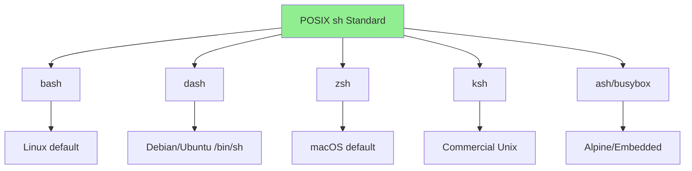

# How to Write Portable Shell Scripts

Author: [nawazdhandala](https://www.github.com/nawazdhandala)

Tags: Shell Scripting, POSIX, Bash, Portability, Linux, macOS, DevOps

Description: Learn how to write shell scripts that work across different Unix-like systems including Linux, macOS, and BSD by following POSIX standards and avoiding shell-specific features.

---

> Shell scripts are often expected to run across multiple platforms: development machines on macOS, CI/CD on Linux, production servers on various distributions. Writing portable scripts ensures your automation works everywhere without modification.

This guide covers techniques for writing scripts that work reliably across Unix-like systems.

---

## Understanding Shell Compatibility



### POSIX vs Bash

```bash
#!/bin/sh
# POSIX-compliant script - maximum portability

# POSIX features (work everywhere):
# - Variable assignment: var=value
# - Command substitution: $(command)
# - Conditionals: [ test ] or test
# - Loops: for, while, until
# - Functions: func() { ... }
# - Here documents: << EOF

# NON-POSIX features (Bash-specific):
# - [[ extended test ]]
# - Arrays: arr=(one two)
# - Process substitution: <(command)
# - Here strings: <<< "string"
# - {start..end} brace expansion
# - $'...' ANSI-C quoting
```

---

## Shebang Best Practices

### Choosing the Right Shebang

```bash
#!/bin/sh
# Most portable - uses system's POSIX shell
# On Debian/Ubuntu: dash
# On macOS: bash in sh mode
# On Alpine: ash/busybox

#!/bin/bash
# Requires bash - less portable but more features
# May not exist on minimal systems

#!/usr/bin/env bash
# More portable way to invoke bash
# Uses PATH to find bash
# Works even if bash is in non-standard location

#!/usr/bin/env sh
# Portable POSIX shell via env
# Recommended for maximum compatibility
```

### Platform Detection

```bash
#!/bin/sh
# Detect platform for conditional behavior

detect_platform() {
    case "$(uname -s)" in
        Linux*)
            echo "linux"
            ;;
        Darwin*)
            echo "macos"
            ;;
        FreeBSD*)
            echo "freebsd"
            ;;
        CYGWIN*|MINGW*|MSYS*)
            echo "windows"
            ;;
        *)
            echo "unknown"
            ;;
    esac
}

PLATFORM=$(detect_platform)

# Platform-specific code
case "$PLATFORM" in
    linux)
        # Linux-specific commands
        ;;
    macos)
        # macOS-specific commands
        ;;
esac
```

---

## Portable Test Constructs

### Using [ ] Instead of [[ ]]

```bash
#!/bin/sh
# POSIX test constructs

# String comparison
name="test"

# POSIX compliant
if [ "$name" = "test" ]; then
    echo "Match"
fi

# NOT POSIX (bash-specific)
# if [[ $name == "test" ]]; then

# Check if variable is empty
if [ -z "$name" ]; then
    echo "Empty"
fi

# Check if variable is non-empty
if [ -n "$name" ]; then
    echo "Not empty"
fi

# Numeric comparison (POSIX)
count=5
if [ "$count" -gt 3 ]; then
    echo "Greater than 3"
fi

# File tests (POSIX)
if [ -f "/etc/passwd" ]; then
    echo "File exists"
fi

if [ -d "/tmp" ]; then
    echo "Directory exists"
fi

if [ -r "/etc/passwd" ]; then
    echo "File is readable"
fi

# Combining conditions (POSIX)
if [ "$count" -gt 0 ] && [ "$count" -lt 10 ]; then
    echo "Between 1 and 9"
fi

# NOT POSIX: [[ $count -gt 0 && $count -lt 10 ]]
```

### Avoiding Bash-Specific Operators

```bash
#!/bin/sh
# Replace bash operators with POSIX equivalents

# Pattern matching
filename="script.sh"

# Bash: [[ $filename == *.sh ]]
# POSIX equivalent:
case "$filename" in
    *.sh)
        echo "Shell script"
        ;;
    *.py)
        echo "Python script"
        ;;
    *)
        echo "Unknown type"
        ;;
esac

# Regex matching
# Bash: [[ $string =~ ^[0-9]+$ ]]
# POSIX equivalent using expr or case:
is_number() {
    case "$1" in
        ''|*[!0-9]*)
            return 1
            ;;
        *)
            return 0
            ;;
    esac
}

if is_number "123"; then
    echo "Is a number"
fi

# Or using expr (less efficient but works)
if expr "$1" : '^[0-9][0-9]*$' > /dev/null 2>&1; then
    echo "Is a number"
fi
```

---

## Portable Variable Handling

### Parameter Expansion

```bash
#!/bin/sh
# POSIX parameter expansion

# Default value if unset or empty
name="${name:-default}"

# Default value only if unset
name="${name-default}"

# Assign default if unset or empty
: "${name:=default}"

# Error if unset or empty
: "${name:?Error: name is required}"

# Substring (POSIX)
string="Hello, World"
# Get from position 0, length 5
# Bash: ${string:0:5}
# POSIX: use expr or cut
result=$(expr substr "$string" 1 5)
# Or
result=$(echo "$string" | cut -c1-5)

# String length
# Bash: ${#string}
# POSIX: also works
length=${#string}

# Remove prefix (POSIX)
path="/home/user/file.txt"
filename="${path##*/}"  # file.txt (removes longest prefix)
dirname="${path%/*}"    # /home/user (removes shortest suffix)

# Remove suffix (POSIX)
base="${filename%.*}"   # file (removes extension)
ext="${filename##*.}"   # txt (gets extension)
```

### Avoiding Arrays

```bash
#!/bin/sh
# POSIX does not support arrays - alternatives

# Instead of: arr=(one two three)
# Use positional parameters:
set -- one two three
echo "First: $1"
echo "All: $*"
echo "Count: $#"

for item in "$@"; do
    echo "Item: $item"
done

# Or use a delimited string:
items="one:two:three"

# Save and restore IFS
old_ifs="$IFS"
IFS=":"
for item in $items; do
    echo "Item: $item"
done
IFS="$old_ifs"

# Or process with a while loop:
echo "$items" | tr ':' '\n' | while read -r item; do
    echo "Item: $item"
done

# Store multiple values in separate variables:
item1="one"
item2="two"
item3="three"
```

---

## Portable Command Differences

### sed Differences

```bash
#!/bin/sh
# sed varies between GNU (Linux) and BSD (macOS)

# In-place editing
# GNU sed: sed -i 's/old/new/' file
# BSD sed: sed -i '' 's/old/new/' file

# Portable in-place edit:
portable_sed_inplace() {
    local pattern="$1"
    local file="$2"
    local temp_file

    temp_file=$(mktemp)
    sed "$pattern" "$file" > "$temp_file"
    mv "$temp_file" "$file"
}

# Usage
portable_sed_inplace 's/old/new/g' myfile.txt

# Or detect platform:
sed_inplace() {
    if sed --version 2>/dev/null | grep -q GNU; then
        sed -i "$@"
    else
        sed -i '' "$@"
    fi
}

# Extended regex
# GNU: sed -r
# BSD: sed -E
# Portable: use basic regex or -E (works in modern versions)

# Newlines in replacement
# Avoid - behavior differs significantly
# Use awk or perl for complex replacements
```

### grep Differences

```bash
#!/bin/sh
# grep portability

# Extended regex
# GNU: grep -E or egrep
# BSD: grep -E or egrep
# POSIX: grep -E is standardized

# Perl regex (NOT POSIX)
# grep -P is GNU-only
# Portable alternative: use awk or sed

# Quiet mode (POSIX)
if grep -q "pattern" file; then
    echo "Found"
fi

# Count matches (POSIX)
count=$(grep -c "pattern" file)

# Line numbers (POSIX)
grep -n "pattern" file

# Recursive search
# GNU: grep -r
# BSD: grep -r
# POSIX: use find
find . -type f -exec grep -l "pattern" {} \;

# Or portable recursive:
grep_recursive() {
    local pattern="$1"
    local dir="${2:-.}"

    find "$dir" -type f -print0 2>/dev/null | \
        xargs -0 grep -l "$pattern" 2>/dev/null
}
```

### date Differences

```bash
#!/bin/sh
# date command varies significantly

# Current timestamp
# GNU: date +%s
# BSD: date +%s
# Both support this (POSIX-ish)

# Date arithmetic
# GNU: date -d "+1 day"
# BSD: date -v+1d
# POSIX: not standardized

# Portable date arithmetic:
add_days() {
    local days="$1"
    local base_date="${2:-$(date +%Y-%m-%d)}"

    if date --version 2>/dev/null | grep -q GNU; then
        # GNU date
        date -d "$base_date + $days days" +%Y-%m-%d
    else
        # BSD date (macOS)
        date -j -v+"${days}d" -f "%Y-%m-%d" "$base_date" +%Y-%m-%d
    fi
}

# Format date (mostly portable)
# ISO format works everywhere
date +%Y-%m-%dT%H:%M:%S

# Epoch to date
# GNU: date -d @1234567890
# BSD: date -r 1234567890
epoch_to_date() {
    local epoch="$1"

    if date --version 2>/dev/null | grep -q GNU; then
        date -d "@$epoch" +%Y-%m-%d
    else
        date -r "$epoch" +%Y-%m-%d
    fi
}
```

---

## Portable Process Handling

### Command Substitution

```bash
#!/bin/sh
# Command substitution - portable forms

# Modern form (POSIX, preferred)
result=$(command)

# Legacy form (also POSIX, avoid nesting)
result=`command`

# Nested substitution
# Modern - clear nesting
outer=$(echo "inner: $(date)")

# Legacy - confusing escaping
outer=`echo "inner: \`date\`"`

# Always use $() for clarity
```

### Process Management

```bash
#!/bin/sh
# Portable process handling

# Background process
command &
pid=$!

# Wait for process
wait "$pid"
exit_code=$?

# Kill process
kill "$pid" 2>/dev/null

# Check if process exists
# POSIX way using kill -0
is_running() {
    kill -0 "$1" 2>/dev/null
}

# Trap signals (POSIX)
cleanup() {
    echo "Cleaning up..."
    rm -f "$temp_file"
    exit
}
trap cleanup INT TERM EXIT

# Get script PID
echo "Script PID: $$"

# Get parent PID
echo "Parent PID: $PPID"
```

---

## Portable File Operations

### Temporary Files

```bash
#!/bin/sh
# Portable temporary file handling

# mktemp is not POSIX but widely available
# Create temp file
temp_file=$(mktemp)

# Create temp file with template
temp_file=$(mktemp /tmp/myapp.XXXXXX)

# Create temp directory
temp_dir=$(mktemp -d)

# Fallback if mktemp unavailable
create_temp_file() {
    if command -v mktemp > /dev/null 2>&1; then
        mktemp
    else
        # Fallback using PID and random
        local temp="/tmp/tmp.$$.$RANDOM"
        touch "$temp"
        echo "$temp"
    fi
}

# Always clean up
trap 'rm -rf "$temp_file" "$temp_dir"' EXIT
```

### Path Operations

```bash
#!/bin/sh
# Portable path handling

# Get script directory
# POSIX-compliant way
get_script_dir() {
    local script_path

    # Handle symlinks
    script_path="$0"
    while [ -L "$script_path" ]; do
        script_path=$(readlink "$script_path")
    done

    # Get directory
    cd "$(dirname "$script_path")" && pwd
}

SCRIPT_DIR=$(get_script_dir)

# Get absolute path
get_absolute_path() {
    local path="$1"

    if [ -d "$path" ]; then
        (cd "$path" && pwd)
    else
        (cd "$(dirname "$path")" && echo "$(pwd)/$(basename "$path")")
    fi
}

# readlink -f is GNU-specific
# Portable alternative:
realpath_portable() {
    local path="$1"

    if command -v realpath > /dev/null 2>&1; then
        realpath "$path"
    elif command -v readlink > /dev/null 2>&1 && readlink -f / > /dev/null 2>&1; then
        readlink -f "$path"
    else
        get_absolute_path "$path"
    fi
}
```

---

## Portable Output and Input

### echo Portability Issues

```bash
#!/bin/sh
# echo behavior varies - use printf instead

# Problem: echo -n and echo -e are not portable
# echo -n "no newline"  # May print "-n" on some systems
# echo -e "tab\there"   # May print "-e" on some systems

# Solution: use printf
printf "no newline"
printf "tab\there\n"

# Portable newline
printf '\n'

# Print variable safely (handles special characters)
var="hello\nworld"
printf '%s\n' "$var"    # Prints literally: hello\nworld
printf '%b\n' "$var"    # Interprets escapes: hello (newline) world

# Print to stderr
printf '%s\n' "Error message" >&2
```

### Reading Input

```bash
#!/bin/sh
# Portable input reading

# Basic read (POSIX)
printf "Enter name: "
read -r name
echo "Hello, $name"

# Read with prompt (NOT POSIX - bash specific)
# read -p "Enter name: " name

# Portable prompt + read
prompt_read() {
    local prompt="$1"
    local var_name="$2"

    printf '%s' "$prompt"
    read -r "$var_name"
}

# Read password (hide input)
# stty is POSIX
read_password() {
    local prompt="${1:-Password: }"

    printf '%s' "$prompt"
    stty -echo
    read -r password
    stty echo
    printf '\n'

    echo "$password"
}

# Read with default
read_with_default() {
    local prompt="$1"
    local default="$2"

    printf '%s [%s]: ' "$prompt" "$default"
    read -r value
    echo "${value:-$default}"
}

name=$(read_with_default "Enter name" "anonymous")
```

---

## Portable Script Template

```bash
#!/bin/sh
# Portable shell script template

# Strict mode (POSIX compatible)
set -e  # Exit on error
set -u  # Error on undefined variables

# Script metadata
SCRIPT_NAME=$(basename "$0")
SCRIPT_VERSION="1.0.0"

# Portable logging
log() {
    printf '[%s] %s: %s\n' "$(date '+%Y-%m-%d %H:%M:%S')" "$SCRIPT_NAME" "$*"
}

error() {
    printf '[%s] %s: ERROR: %s\n' "$(date '+%Y-%m-%d %H:%M:%S')" "$SCRIPT_NAME" "$*" >&2
}

die() {
    error "$*"
    exit 1
}

# Check for required commands
require_command() {
    command -v "$1" > /dev/null 2>&1 || die "Required command not found: $1"
}

# Parse arguments (POSIX getopts)
usage() {
    cat << EOF
Usage: $SCRIPT_NAME [OPTIONS]

Options:
    -h          Show this help
    -v          Verbose mode
    -f FILE     Input file
    -o DIR      Output directory

Version: $SCRIPT_VERSION
EOF
}

# Default values
VERBOSE=0
INPUT_FILE=""
OUTPUT_DIR="."

while getopts "hvf:o:" opt; do
    case "$opt" in
        h)
            usage
            exit 0
            ;;
        v)
            VERBOSE=1
            ;;
        f)
            INPUT_FILE="$OPTARG"
            ;;
        o)
            OUTPUT_DIR="$OPTARG"
            ;;
        *)
            usage >&2
            exit 1
            ;;
    esac
done
shift $((OPTIND - 1))

# Main function
main() {
    log "Starting $SCRIPT_NAME v$SCRIPT_VERSION"

    # Validate inputs
    [ -n "$INPUT_FILE" ] || die "Input file required (-f)"
    [ -f "$INPUT_FILE" ] || die "Input file not found: $INPUT_FILE"
    [ -d "$OUTPUT_DIR" ] || die "Output directory not found: $OUTPUT_DIR"

    # Your logic here
    if [ "$VERBOSE" -eq 1 ]; then
        log "Processing: $INPUT_FILE"
    fi

    log "Complete"
}

# Cleanup on exit
cleanup() {
    # Remove temporary files, etc.
    :
}
trap cleanup EXIT INT TERM

# Run main
main "$@"
```

---

## Summary

Key portability guidelines:

| Feature | Portable | Non-Portable |
|---------|----------|--------------|
| Shebang | `#!/bin/sh` | `#!/bin/bash` |
| Test | `[ ]` | `[[ ]]` |
| Arrays | Positional params | `arr=()` |
| Output | `printf` | `echo -e` |
| Regex | `case` pattern | `[[ =~ ]]` |
| Arithmetic | `$((expr))` | `let` |
| Local vars | `local` (widely supported) | - |

Best practices:
1. Use `#!/bin/sh` for maximum portability
2. Test on multiple platforms (Linux, macOS, BSD)
3. Use ShellCheck to identify portability issues
4. Prefer POSIX constructs over shell-specific features
5. Abstract platform differences into functions

---

*Running scripts across diverse infrastructure? [OneUptime](https://oneuptime.com) provides unified monitoring for your servers regardless of platform, alerting you to script failures anywhere.*

**Related Reading:**
- [How to Handle Script Debugging with set -x](https://oneuptime.com/blog/post/2026-01-24-bash-debugging-set-x/view)
- [How to Fix "Cannot Assign to Read-Only" Errors](https://oneuptime.com/blog/post/2026-01-24-bash-cannot-assign-readonly/view)
