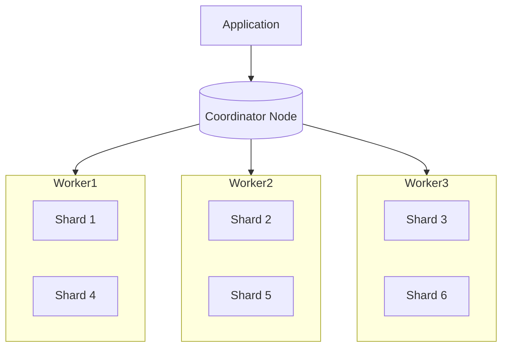

# How to Scale PostgreSQL with Citus Sharding

Author: [nawazdhandala](https://www.github.com/nawazdhandala)

Tags: PostgreSQL, Citus, Sharding, Distributed Database, Scalability, Performance

Description: Learn how to horizontally scale PostgreSQL using Citus for automatic sharding, distributed queries, and multi-tenant applications that handle billions of rows.

---

PostgreSQL is excellent until your tables hit hundreds of millions of rows. At that point, vertical scaling becomes expensive and eventually impossible. Citus extends PostgreSQL with transparent sharding, letting you scale horizontally across multiple nodes while keeping the PostgreSQL interface you already know.

## What is Citus?

Citus is a PostgreSQL extension that transforms a single database into a distributed system. It automatically shards tables across worker nodes and routes queries to the appropriate shards. Your application talks to PostgreSQL as usual, and Citus handles the distribution logic.



## Installing Citus

On Ubuntu or Debian:

```bash
# Add the Citus repository
curl https://install.citusdata.com/community/deb.sh | sudo bash

# Install Citus
sudo apt-get install -y postgresql-16-citus-12.1

# Enable the extension in postgresql.conf
echo "shared_preload_libraries = 'citus'" | sudo tee -a /etc/postgresql/16/main/postgresql.conf

# Restart PostgreSQL
sudo systemctl restart postgresql
```

Using Docker for testing:

```bash
# Start a Citus cluster with docker-compose
docker run -d --name citus_coordinator \
  -e POSTGRES_PASSWORD=mypassword \
  -p 5432:5432 \
  citusdata/citus:12.1

# Connect and enable the extension
psql -h localhost -U postgres -c "CREATE EXTENSION citus;"
```

## Setting Up a Distributed Cluster

A Citus cluster has one coordinator and multiple workers:

```sql
-- On the coordinator node, register workers
SELECT citus_set_coordinator_host('coordinator.example.com', 5432);

-- Add worker nodes
SELECT citus_add_node('worker1.example.com', 5432);
SELECT citus_add_node('worker2.example.com', 5432);
SELECT citus_add_node('worker3.example.com', 5432);

-- Verify the cluster
SELECT * FROM citus_get_active_worker_nodes();
```

## Creating Distributed Tables

The key decision is choosing the distribution column. This column determines how data is sharded.

```sql
-- Create a regular PostgreSQL table first
CREATE TABLE events (
    tenant_id    bigint NOT NULL,
    event_id     bigint NOT NULL,
    event_type   varchar(50),
    event_data   jsonb,
    created_at   timestamptz DEFAULT now(),
    PRIMARY KEY (tenant_id, event_id)
);

-- Distribute the table by tenant_id
-- This creates 32 shards (default) spread across workers
SELECT create_distributed_table('events', 'tenant_id');
```

Choose a distribution column that:
- Appears in most WHERE clauses and JOINs
- Has high cardinality (many distinct values)
- Distributes data evenly across shards
- For multi-tenant apps, use tenant_id

## Understanding Shard Placement

Check how shards are distributed:

```sql
-- View shard placement
SELECT
    shardid,
    nodename,
    nodeport,
    shardminvalue,
    shardmaxvalue
FROM pg_dist_shard_placement p
JOIN pg_dist_shard s ON p.shardid = s.shardid
WHERE logicalrelid = 'events'::regclass
ORDER BY shardid;
```

## Colocating Related Tables

Tables with the same distribution column can be colocated, enabling efficient JOINs:

```sql
-- Create a users table
CREATE TABLE users (
    tenant_id    bigint NOT NULL,
    user_id      bigint NOT NULL,
    email        varchar(255),
    created_at   timestamptz DEFAULT now(),
    PRIMARY KEY (tenant_id, user_id)
);

-- Distribute with the same column as events
-- The colocate_with parameter ensures they share shards
SELECT create_distributed_table('users', 'tenant_id', colocate_with => 'events');

-- This JOIN executes locally on each shard, no network overhead
SELECT u.email, count(e.event_id)
FROM users u
JOIN events e ON u.tenant_id = e.tenant_id AND u.user_id = e.user_id
WHERE u.tenant_id = 123
GROUP BY u.email;
```

## Reference Tables for Lookup Data

Small tables that need to JOIN with distributed tables should be reference tables:

```sql
-- Create a reference table (replicated to all workers)
CREATE TABLE event_types (
    type_id      serial PRIMARY KEY,
    type_name    varchar(50),
    description  text
);

-- Make it a reference table
SELECT create_reference_table('event_types');

-- Now JOINs work efficiently
SELECT e.*, et.type_name
FROM events e
JOIN event_types et ON e.event_type = et.type_name
WHERE e.tenant_id = 456;
```

## Writing Efficient Queries

### Single-Tenant Queries (Best Performance)

Queries that include the distribution column hit a single shard:

```sql
-- This query goes to exactly one shard
SELECT * FROM events
WHERE tenant_id = 123
  AND created_at > now() - interval '7 days';

-- Aggregations also hit one shard
SELECT event_type, count(*)
FROM events
WHERE tenant_id = 123
GROUP BY event_type;
```

### Cross-Tenant Queries

Queries without the distribution column must touch all shards:

```sql
-- This fans out to all shards (slower but sometimes necessary)
SELECT tenant_id, count(*)
FROM events
WHERE created_at > now() - interval '1 day'
GROUP BY tenant_id
ORDER BY count(*) DESC
LIMIT 10;
```

### Avoiding Common Pitfalls

```sql
-- Bad: Missing distribution column in JOIN
-- This causes a broadcast join (slow)
SELECT u.*, e.*
FROM users u
JOIN events e ON u.user_id = e.user_id;

-- Good: Include distribution column in JOIN
SELECT u.*, e.*
FROM users u
JOIN events e ON u.tenant_id = e.tenant_id
             AND u.user_id = e.user_id;

-- Bad: UPDATE without distribution column
-- This locks all shards
UPDATE events SET event_type = 'processed';

-- Good: Include distribution column
UPDATE events
SET event_type = 'processed'
WHERE tenant_id = 123;
```

## Rebalancing Shards

When adding new workers, rebalance data:

```sql
-- Add a new worker
SELECT citus_add_node('worker4.example.com', 5432);

-- Rebalance shards across all workers
SELECT citus_rebalance_start();

-- Monitor progress
SELECT * FROM citus_rebalance_status();

-- For fine-grained control
SELECT rebalance_table_shards(
    'events',
    rebalance_strategy => 'by_disk_size'
);
```

## Monitoring Distributed Queries

Track query distribution and performance:

```sql
-- View distributed query statistics
SELECT * FROM citus_stat_statements
ORDER BY total_time DESC
LIMIT 20;

-- Check shard sizes
SELECT
    logicalrelid::regclass AS table_name,
    shardid,
    shard_size
FROM citus_shards
ORDER BY shard_size DESC;

-- Find data skew
SELECT
    nodename,
    sum(shard_size) AS total_size,
    count(*) AS shard_count
FROM citus_shards
GROUP BY nodename;
```

## Schema Migrations

Citus handles most DDL automatically:

```sql
-- Add a column (executed on all shards)
ALTER TABLE events ADD COLUMN processed_at timestamptz;

-- Create an index (executed in parallel across shards)
CREATE INDEX CONCURRENTLY events_created_idx
ON events (tenant_id, created_at);

-- Note: Some operations require special handling
-- Check the documentation for complex migrations
```

## Tenant Isolation for Large Customers

For multi-tenant apps, isolate large tenants on dedicated shards:

```sql
-- Move a specific tenant to its own shard
SELECT isolate_tenant_to_new_shard(
    'events',
    123,  -- tenant_id to isolate
    'CASCADE'  -- also isolate colocated tables
);

-- Optionally move that shard to a dedicated worker
SELECT citus_move_shard_placement(
    (SELECT shardid FROM pg_dist_shard
     WHERE logicalrelid = 'events'::regclass
     AND shardminvalue = '123' AND shardmaxvalue = '123'),
    'worker1.example.com', 5432,
    'dedicated-worker.example.com', 5432
);
```

## Connection Pooling

Use PgBouncer in front of both coordinator and workers:

```ini
# pgbouncer.ini
[databases]
* = host=coordinator.example.com port=5432

[pgbouncer]
pool_mode = transaction
max_client_conn = 10000
default_pool_size = 100
```

## Backup and Recovery

Citus works with standard PostgreSQL backup tools:

```bash
# Backup coordinator metadata
pg_dump -h coordinator -U postgres -Fc -f coordinator_backup.dump postgres

# Backup each worker
for worker in worker1 worker2 worker3; do
    pg_dump -h $worker -U postgres -Fc -f ${worker}_backup.dump postgres
done

# For point-in-time recovery, use pg_basebackup with WAL archiving
```

## When to Use Citus

Citus shines for:
- Multi-tenant SaaS applications
- Time-series data with tenant partitioning
- Real-time analytics dashboards
- Tables exceeding billions of rows

Consider alternatives if:
- Single-tenant queries dominate (standard PostgreSQL with partitioning)
- You need complex cross-shard transactions
- Your team lacks distributed systems experience

---

Citus brings horizontal scaling to PostgreSQL without abandoning the ecosystem you know. Start with a single coordinator during development, distribute your largest tables first, and add workers as your data grows. The key is choosing the right distribution column early - getting that right makes everything else straightforward.
