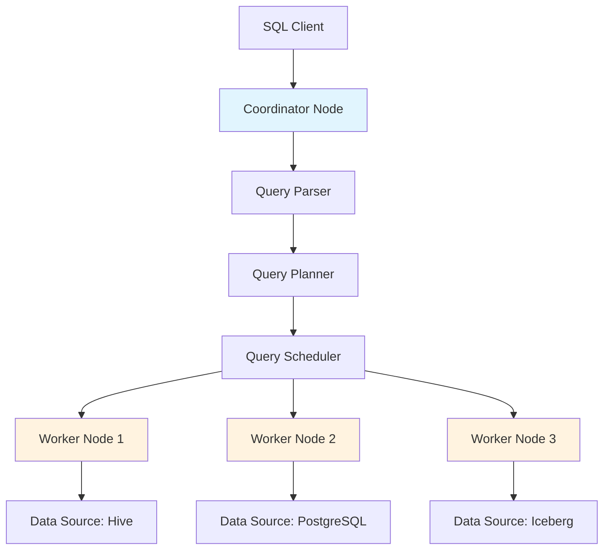
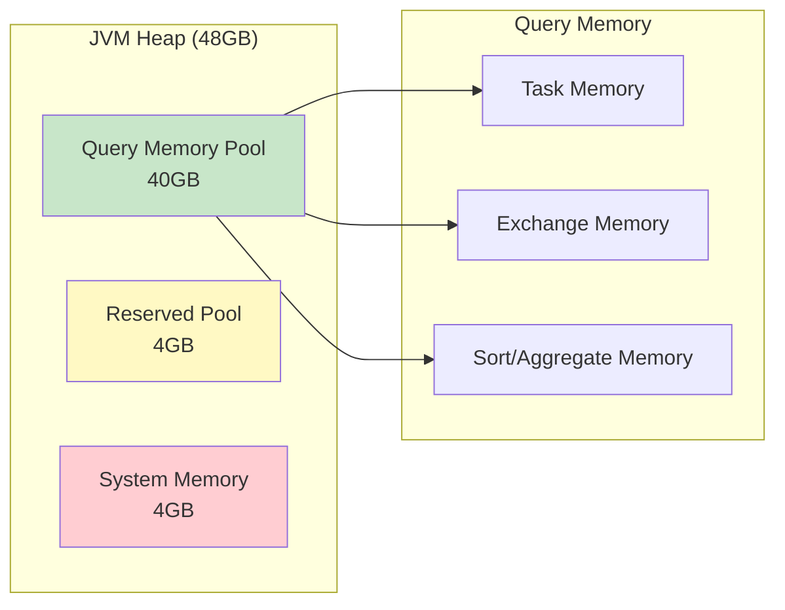

# How to Configure Presto/Trino Query Engine

Author: [nawazdhandala](https://www.github.com/nawazdhandala)

Tags: Presto, Trino, Query Engine, SQL, Big Data, Data Lake, Analytics, Performance Tuning

Description: Learn how to configure Presto and Trino query engines for optimal performance, including memory settings, connector configuration, resource management, and query optimization.

---

> Presto and Trino power analytics at companies processing petabytes of data daily. Getting the configuration right is the difference between queries that finish in seconds and those that never complete.

Trino (formerly PrestoSQL) and Presto are distributed SQL query engines designed for interactive analytics across diverse data sources. This guide covers essential configuration for running these engines reliably in production.

---

## Understanding the Architecture

Before configuring, understand how queries flow through the system:



The coordinator parses queries, plans execution, and distributes work to workers. Workers fetch data from connectors and perform computation.

---

## Core Configuration Files

### Node Properties

```properties
# etc/node.properties
# Basic node identification - set on every node

# Unique identifier for this installation
node.environment=production

# Unique ID for this specific node (auto-generated if omitted)
node.id=ffffffff-ffff-ffff-ffff-ffffffffffff

# Directory for storing data and logs
node.data-dir=/var/trino/data
```

### JVM Configuration

```properties
# etc/jvm.config
# JVM settings - critical for performance and stability

# Set heap size to ~70-80% of available memory
# Leave room for off-heap memory and OS
-Xmx48G
-Xms48G

# Use G1 garbage collector for large heaps
-XX:+UseG1GC
-XX:G1HeapRegionSize=32M

# GC tuning for low latency
-XX:+ExplicitGCInvokesConcurrent
-XX:+ExitOnOutOfMemoryError
-XX:+HeapDumpOnOutOfMemoryError
-XX:HeapDumpPath=/var/trino/logs

# Performance optimizations
-XX:ReservedCodeCacheSize=512M
-XX:PerMethodRecompilationCutoff=10000
-XX:PerBytecodeRecompilationCutoff=10000

# Disable some costly JVM features
-Djdk.attach.allowAttachSelf=true
-Djdk.nio.maxCachedBufferSize=2000000
```

### Coordinator Configuration

```properties
# etc/config.properties (Coordinator)
# Settings for the coordinator node

# This node is the coordinator
coordinator=true
# Coordinator can also act as a worker (disable for large clusters)
node-scheduler.include-coordinator=false

# HTTP server settings
http-server.http.port=8080
http-server.log.path=/var/trino/logs/http-request.log

# Discovery service - how nodes find each other
discovery.uri=http://coordinator.internal:8080

# Query limits - prevent runaway queries
query.max-memory=100GB
query.max-memory-per-node=10GB
query.max-total-memory-per-node=12GB

# Query execution settings
query.max-execution-time=30m
query.max-run-time=60m
query.max-stage-count=150

# Resource groups for workload management
resource-groups.configuration-manager=file
resource-groups.config-file=/etc/trino/resource-groups.json
```

### Worker Configuration

```properties
# etc/config.properties (Worker)
# Settings for worker nodes

# This node is a worker only
coordinator=false

# Connect to coordinator's discovery service
discovery.uri=http://coordinator.internal:8080

# HTTP server for worker communication
http-server.http.port=8080

# Memory settings - should match coordinator
query.max-memory-per-node=10GB
query.max-total-memory-per-node=12GB

# Task settings for parallel execution
task.max-worker-threads=16
task.min-drivers=32
task.max-drivers=64
```

---

## Connector Configuration

Connectors allow Trino to query different data sources.

### Hive Connector for Data Lakes

```properties
# etc/catalog/hive.properties
# Connect to data lake via Hive Metastore

connector.name=hive

# Hive Metastore connection
hive.metastore.uri=thrift://metastore.internal:9083

# S3 storage configuration
hive.s3.path-style-access=true
hive.s3.endpoint=https://s3.amazonaws.com
hive.s3.aws-access-key=${ENV:AWS_ACCESS_KEY_ID}
hive.s3.aws-secret-key=${ENV:AWS_SECRET_ACCESS_KEY}

# Performance settings
hive.max-split-size=128MB
hive.max-initial-splits=500
hive.max-splits-per-second=1000

# Enable file format optimizations
hive.parquet.use-column-names=true
hive.orc.use-column-names=true

# Caching for repeated queries
hive.file-status-cache-tables=*
hive.file-status-cache-size=100000
hive.file-status-cache-expire-time=1h
```

### Iceberg Connector

```properties
# etc/catalog/iceberg.properties
# Native Iceberg support with better features than Hive

connector.name=iceberg

# Iceberg catalog type
iceberg.catalog.type=hive_metastore
hive.metastore.uri=thrift://metastore.internal:9083

# S3 configuration
hive.s3.path-style-access=true
hive.s3.endpoint=https://s3.amazonaws.com

# Iceberg-specific optimizations
iceberg.max-partitions-per-writer=1000
iceberg.target-max-file-size=512MB

# Enable merge-on-read for efficient updates
iceberg.delete-schema-locations-fallback=true
```

### PostgreSQL Connector

```properties
# etc/catalog/postgresql.properties
# Connect to operational PostgreSQL database

connector.name=postgresql

connection-url=jdbc:postgresql://postgres.internal:5432/production
connection-user=${ENV:PG_USER}
connection-password=${ENV:PG_PASSWORD}

# Connection pool settings
postgresql.connection-pool.max-size=20

# Push predicates down to PostgreSQL
postgresql.experimental.enable-string-pushdown-with-collate=true
```

---

## Resource Groups for Workload Management

Control how different users and queries share cluster resources.

```json
{
  "rootGroups": [
    {
      "name": "global",
      "softMemoryLimit": "100%",
      "hardConcurrencyLimit": 100,
      "maxQueued": 1000,
      "schedulingPolicy": "weighted",
      "subGroups": [
        {
          "name": "adhoc",
          "softMemoryLimit": "30%",
          "hardConcurrencyLimit": 20,
          "maxQueued": 100,
          "schedulingWeight": 1,
          "subGroups": [
            {
              "name": "${USER}",
              "softMemoryLimit": "10%",
              "hardConcurrencyLimit": 5,
              "maxQueued": 10
            }
          ]
        },
        {
          "name": "pipeline",
          "softMemoryLimit": "50%",
          "hardConcurrencyLimit": 30,
          "maxQueued": 200,
          "schedulingWeight": 3
        },
        {
          "name": "dashboard",
          "softMemoryLimit": "20%",
          "hardConcurrencyLimit": 50,
          "maxQueued": 500,
          "schedulingWeight": 2
        }
      ]
    }
  ],
  "selectors": [
    {
      "source": ".*-pipeline$",
      "group": "global.pipeline"
    },
    {
      "source": ".*dashboard.*",
      "group": "global.dashboard"
    },
    {
      "group": "global.adhoc.${USER}"
    }
  ]
}
```

---

## Memory Configuration Deep Dive

Memory is the most critical resource to configure correctly.



```properties
# Memory configuration in config.properties

# Total memory available for queries across the cluster
query.max-memory=100GB

# Memory limit per node for a single query
query.max-memory-per-node=10GB

# Total memory per node including system overhead
query.max-total-memory-per-node=12GB

# Memory pool configuration
memory.heap-headroom-per-node=4GB

# Spill to disk when memory is exhausted
spill-enabled=true
spiller-spill-path=/var/trino/spill
spiller-max-used-space-threshold=0.9
max-spill-per-node=100GB
query-max-spill-per-node=20GB
```

---

## Query Optimization Settings

Tune the query optimizer for better performance.

```properties
# Optimizer configuration in config.properties

# Cost-based optimizer settings
optimizer.join-reordering-strategy=AUTOMATIC
optimizer.join-distribution-type=AUTOMATIC

# Predicate pushdown
optimizer.predicate-pushdown-use-table-properties=true

# Enable optimizations for common patterns
optimizer.optimize-hash-generation=true
optimizer.optimize-mixed-distinct-aggregations=true
optimizer.push-aggregation-through-outer-join=true

# Statistics for better planning
optimizer.use-mark-distinct=true

# Exchange settings for distributed joins
exchange.client-threads=25
exchange.concurrent-request-multiplier=3
exchange.max-buffer-size=32MB
exchange.max-response-size=16MB
```

---

## Performance Monitoring Queries

Use these queries to identify performance issues.

```sql
-- Check currently running queries
SELECT
    query_id,
    state,
    user,
    source,
    query,
    created,
    NOW() - created AS elapsed,
    total_cpu_time,
    peak_memory_bytes / 1024 / 1024 / 1024 AS peak_memory_gb
FROM system.runtime.queries
WHERE state = 'RUNNING'
ORDER BY created;

-- Find slow queries from history
SELECT
    query_id,
    user,
    source,
    LEFT(query, 100) AS query_preview,
    execution_time,
    queued_time,
    planning_time,
    peak_memory_bytes / 1024 / 1024 / 1024 AS peak_memory_gb,
    total_cpu_time
FROM system.runtime.queries
WHERE state = 'FINISHED'
AND execution_time > INTERVAL '1' MINUTE
ORDER BY created DESC
LIMIT 50;

-- Check worker node health
SELECT
    node_id,
    http_uri,
    node_version,
    coordinator,
    state,
    age(NOW(), last_response_time) AS time_since_response
FROM system.runtime.nodes;

-- Memory usage by query
SELECT
    query_id,
    user,
    peak_user_memory_reservation / 1024 / 1024 / 1024 AS peak_user_memory_gb,
    peak_total_memory_reservation / 1024 / 1024 / 1024 AS peak_total_memory_gb
FROM system.runtime.queries
WHERE state = 'RUNNING';
```

---

## Session Properties for Query Tuning

Override settings per query when needed.

```sql
-- Increase memory for a large query
SET SESSION query_max_memory = '20GB';
SET SESSION query_max_memory_per_node = '5GB';

-- Enable spilling for memory-intensive operations
SET SESSION spill_enabled = true;

-- Tune join behavior for specific queries
SET SESSION join_distribution_type = 'PARTITIONED';
SET SESSION join_reordering_strategy = 'ELIMINATE_CROSS_JOINS';

-- Control parallelism
SET SESSION task_concurrency = 16;
SET SESSION hash_partition_count = 100;

-- Run your query with these settings
SELECT ...
FROM large_table
JOIN another_large_table ON ...
```

---

## Best Practices

1. **Size coordinator and workers differently**: Coordinators need less memory but more CPU for planning. Workers need maximum memory for data processing.

2. **Enable spilling for reliability**: Queries that exceed memory will fail without spilling enabled. The performance hit is better than failures.

3. **Use resource groups**: Prevent one user or workload from consuming all cluster resources.

4. **Monitor query queuing**: If queries spend significant time queued, you need more workers or tighter resource limits.

5. **Set query timeouts**: Prevent runaway queries from consuming resources indefinitely.

6. **Tune connectors individually**: Each data source has different performance characteristics. Tune split sizes and parallelism per connector.

7. **Review EXPLAIN plans**: Use `EXPLAIN ANALYZE` to understand where queries spend time and optimize accordingly.

---

## Conclusion

Configuring Presto or Trino for production requires balancing memory, concurrency, and reliability. Start with conservative settings, monitor actual usage patterns, and tune incrementally. The combination of proper memory configuration, resource groups, and connector tuning will give you a query engine that handles diverse workloads reliably. Remember that configuration is not a one-time task; as your data and query patterns evolve, your configuration should too.
