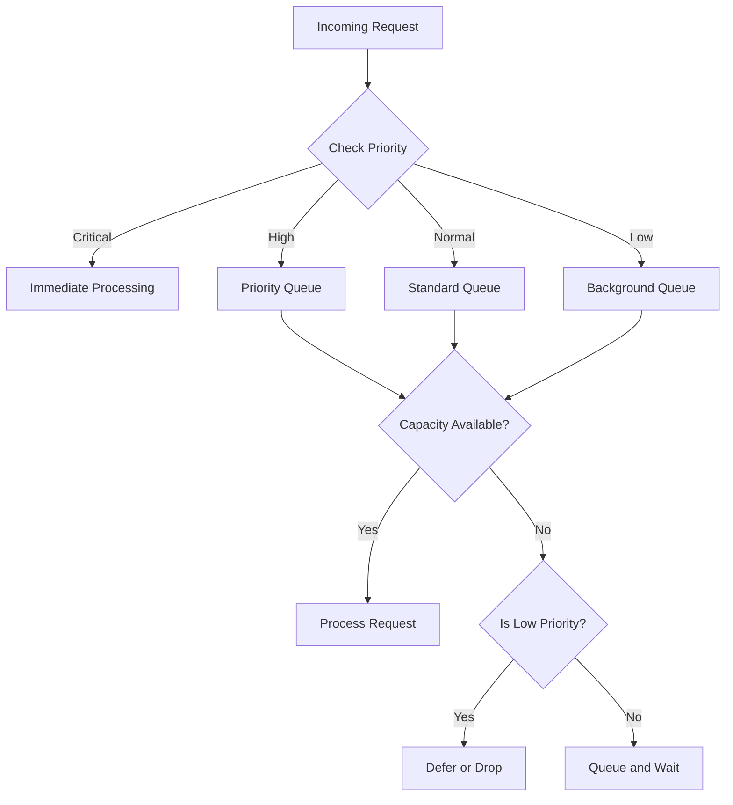

# How to Prioritize Requests in High-Load Python Services

Author: [nawazdhandala](https://www.github.com/nawazdhandala)

Tags: Python, Performance, Load Management, Priority Queue, FastAPI, Scalability, Rate Limiting

Description: Learn how to implement request prioritization in high-load Python services. This guide covers priority queues, admission control, and graceful degradation patterns that keep critical requests flowing under pressure.

---

> When traffic spikes hit your service, not all requests are equal. Payment processing should take priority over analytics. Admin operations should complete while background sync waits. This guide shows you how to build intelligent request prioritization in Python.

Under heavy load, a service that treats all requests equally will fail randomly. Critical operations might timeout while low-priority tasks consume resources. Request prioritization lets you control what gets processed when resources are scarce.

---

## Understanding Request Priority

Before diving into code, let's define priority levels and their characteristics:

| Priority | Examples | Behavior Under Load |
|----------|----------|---------------------|
| **Critical** | Payments, auth, health checks | Always process immediately |
| **High** | User-facing API calls | Process with minimal delay |
| **Normal** | Background jobs, webhooks | Process when capacity allows |
| **Low** | Analytics, reporting, sync | Defer or drop if necessary |



---

## Implementing a Priority Queue System

Here's a complete priority queue implementation for request handling:

```python
# priority_queue.py
# Priority-based request queue system
import asyncio
from enum import IntEnum
from dataclasses import dataclass, field
from typing import Callable, Awaitable, Any, Optional
from datetime import datetime
import heapq

class Priority(IntEnum):
    """
    Request priority levels.
    Lower numbers = higher priority (for heapq compatibility).
    """
    CRITICAL = 0
    HIGH = 1
    NORMAL = 2
    LOW = 3

@dataclass(order=True)
class PriorityRequest:
    """
    A request wrapper that enables priority-based ordering.
    The ordering is: priority first, then timestamp for FIFO within priority.
    """
    priority: int
    timestamp: float = field(compare=True)
    request_id: str = field(compare=False)
    handler: Callable = field(compare=False)
    args: tuple = field(compare=False, default=())
    kwargs: dict = field(compare=False, default_factory=dict)
    future: asyncio.Future = field(compare=False, default=None)

class PriorityRequestQueue:
    """
    Async priority queue that processes requests based on priority level.
    Uses heapq for efficient priority ordering.
    """

    def __init__(
        self,
        max_size: int = 10000,
        max_workers: int = 10
    ):
        self._queue: list = []  # Heap-based priority queue
        self._lock = asyncio.Lock()
        self._not_empty = asyncio.Condition(self._lock)
        self._max_size = max_size
        self._max_workers = max_workers
        self._active_workers = 0
        self._running = False

        # Metrics for monitoring
        self._processed = 0
        self._dropped = 0

    async def start(self) -> None:
        """Start the worker pool for processing requests."""
        self._running = True
        # Spawn worker tasks
        for _ in range(self._max_workers):
            asyncio.create_task(self._worker())

    async def stop(self) -> None:
        """Gracefully stop the queue processor."""
        self._running = False
        # Wake up all workers so they can exit
        async with self._not_empty:
            self._not_empty.notify_all()

    async def submit(
        self,
        handler: Callable[..., Awaitable[Any]],
        priority: Priority = Priority.NORMAL,
        request_id: Optional[str] = None,
        *args,
        **kwargs
    ) -> asyncio.Future:
        """
        Submit a request to the priority queue.
        Returns a Future that resolves when the request completes.
        """
        async with self._lock:
            # Check if queue is at capacity
            if len(self._queue) >= self._max_size:
                # Drop lowest priority requests when full
                if priority == Priority.LOW:
                    self._dropped += 1
                    raise QueueFullError("Queue full, low priority request dropped")

                # For higher priorities, try to evict a low priority request
                evicted = self._try_evict_lowest()
                if not evicted and priority > Priority.HIGH:
                    self._dropped += 1
                    raise QueueFullError("Queue full, unable to evict")

            # Create the priority request
            future = asyncio.get_event_loop().create_future()
            request = PriorityRequest(
                priority=priority,
                timestamp=datetime.utcnow().timestamp(),
                request_id=request_id or str(id(handler)),
                handler=handler,
                args=args,
                kwargs=kwargs,
                future=future
            )

            # Add to priority queue
            heapq.heappush(self._queue, request)

            # Notify waiting workers
            self._not_empty.notify()

        return future

    def _try_evict_lowest(self) -> bool:
        """
        Try to evict the lowest priority request from the queue.
        Returns True if a request was evicted.
        """
        # Find lowest priority request
        lowest_idx = None
        lowest_priority = Priority.CRITICAL

        for i, req in enumerate(self._queue):
            if req.priority > lowest_priority:
                lowest_priority = req.priority
                lowest_idx = i

        if lowest_idx is not None and lowest_priority >= Priority.LOW:
            # Remove the lowest priority request
            evicted = self._queue.pop(lowest_idx)
            evicted.future.set_exception(
                RequestEvictedError("Request evicted due to capacity")
            )
            heapq.heapify(self._queue)  # Restore heap invariant
            self._dropped += 1
            return True

        return False

    async def _worker(self) -> None:
        """Worker coroutine that processes requests from the queue."""
        while self._running:
            request = None

            async with self._not_empty:
                # Wait for a request to be available
                while not self._queue and self._running:
                    await self._not_empty.wait()

                if not self._running:
                    break

                # Get highest priority request
                request = heapq.heappop(self._queue)

            if request:
                try:
                    # Process the request
                    result = await request.handler(*request.args, **request.kwargs)
                    request.future.set_result(result)
                    self._processed += 1
                except Exception as e:
                    request.future.set_exception(e)

    def get_stats(self) -> dict:
        """Return queue statistics for monitoring."""
        return {
            "queued": len(self._queue),
            "processed": self._processed,
            "dropped": self._dropped,
            "max_size": self._max_size,
            "workers": self._max_workers
        }

class QueueFullError(Exception):
    """Raised when the queue is at capacity."""
    pass

class RequestEvictedError(Exception):
    """Raised when a request is evicted from the queue."""
    pass
```

---

## FastAPI Integration with Priority Middleware

Here's how to integrate priority-based request handling with FastAPI:

```python
# priority_middleware.py
# FastAPI middleware for request prioritization
from fastapi import FastAPI, Request, Response, HTTPException
from fastapi.responses import JSONResponse
from starlette.middleware.base import BaseHTTPMiddleware
from priority_queue import PriorityRequestQueue, Priority, QueueFullError
import asyncio

# Global priority queue instance
request_queue = PriorityRequestQueue(max_size=5000, max_workers=20)

# Priority rules based on path patterns
PRIORITY_RULES = {
    # Critical: always process
    "/health": Priority.CRITICAL,
    "/api/v1/payments": Priority.CRITICAL,
    "/api/v1/auth": Priority.CRITICAL,

    # High: user-facing operations
    "/api/v1/users": Priority.HIGH,
    "/api/v1/orders": Priority.HIGH,

    # Normal: standard operations
    "/api/v1/products": Priority.NORMAL,
    "/api/v1/search": Priority.NORMAL,

    # Low: background operations
    "/api/v1/analytics": Priority.LOW,
    "/api/v1/sync": Priority.LOW,
    "/api/v1/reports": Priority.LOW,
}

def get_request_priority(path: str, headers: dict) -> Priority:
    """
    Determine priority for a request based on path and headers.
    Admin requests and requests with priority header get special treatment.
    """
    # Check for explicit priority header
    if "X-Request-Priority" in headers:
        priority_name = headers["X-Request-Priority"].upper()
        try:
            return Priority[priority_name]
        except KeyError:
            pass

    # Admin requests get high priority
    if headers.get("X-Admin-Token"):
        return Priority.HIGH

    # Match path against rules
    for pattern, priority in PRIORITY_RULES.items():
        if path.startswith(pattern):
            return priority

    return Priority.NORMAL

class PriorityMiddleware(BaseHTTPMiddleware):
    """
    Middleware that routes requests through the priority queue.
    Critical requests bypass the queue entirely.
    """

    async def dispatch(self, request: Request, call_next) -> Response:
        priority = get_request_priority(
            request.url.path,
            dict(request.headers)
        )

        # Critical requests bypass the queue
        if priority == Priority.CRITICAL:
            return await call_next(request)

        try:
            # Submit request to priority queue
            future = await request_queue.submit(
                handler=call_next,
                priority=priority,
                request_id=request.headers.get("X-Request-ID"),
                request=request
            )

            # Wait for the request to be processed
            return await future

        except QueueFullError:
            # Return 503 when queue is full
            return JSONResponse(
                status_code=503,
                content={
                    "error": "Service temporarily unavailable",
                    "message": "Server is at capacity, please retry"
                },
                headers={"Retry-After": "5"}
            )

# FastAPI application setup
app = FastAPI()

@app.on_event("startup")
async def startup():
    await request_queue.start()

@app.on_event("shutdown")
async def shutdown():
    await request_queue.stop()

# Add the priority middleware
app.add_middleware(PriorityMiddleware)
```

---

## Admission Control with Load Shedding

When load exceeds capacity, you need to start rejecting requests proactively:

```python
# admission_control.py
# Load shedding and admission control
import asyncio
import time
from dataclasses import dataclass
from typing import Optional
from priority_queue import Priority

@dataclass
class LoadMetrics:
    """Current load metrics for admission decisions."""
    active_requests: int
    queue_depth: int
    avg_latency_ms: float
    error_rate: float
    cpu_usage: float

class AdmissionController:
    """
    Controls request admission based on current load.
    Implements progressive load shedding.
    """

    def __init__(
        self,
        max_active_requests: int = 100,
        max_queue_depth: int = 1000,
        latency_threshold_ms: float = 500,
        error_rate_threshold: float = 0.05
    ):
        self._max_active = max_active_requests
        self._max_queue = max_queue_depth
        self._latency_threshold = latency_threshold_ms
        self._error_threshold = error_rate_threshold

        # Current state
        self._active_requests = 0
        self._recent_latencies: list = []
        self._recent_errors: list = []
        self._lock = asyncio.Lock()

    async def should_admit(self, priority: Priority) -> tuple[bool, Optional[str]]:
        """
        Decide whether to admit a request based on current load.
        Returns (should_admit, reason_if_rejected).
        """
        metrics = await self._get_metrics()

        # Critical requests always admitted
        if priority == Priority.CRITICAL:
            return True, None

        # Check if we're overloaded
        load_factor = self._calculate_load_factor(metrics)

        # Determine admission threshold based on priority
        thresholds = {
            Priority.HIGH: 0.9,    # Reject at 90% load
            Priority.NORMAL: 0.7,  # Reject at 70% load
            Priority.LOW: 0.5      # Reject at 50% load
        }

        threshold = thresholds.get(priority, 0.7)

        if load_factor > threshold:
            return False, f"Load factor {load_factor:.2f} exceeds threshold {threshold}"

        return True, None

    def _calculate_load_factor(self, metrics: LoadMetrics) -> float:
        """
        Calculate overall load factor from 0.0 to 1.0+.
        Considers multiple signals.
        """
        # Weight each metric
        request_load = metrics.active_requests / self._max_active
        queue_load = metrics.queue_depth / self._max_queue
        latency_load = metrics.avg_latency_ms / self._latency_threshold
        error_load = metrics.error_rate / self._error_threshold

        # Combined load factor (weighted average)
        load = (
            0.4 * request_load +
            0.3 * queue_load +
            0.2 * latency_load +
            0.1 * error_load
        )

        return min(load, 1.5)  # Cap at 150% for extreme overload

    async def _get_metrics(self) -> LoadMetrics:
        """Gather current load metrics."""
        async with self._lock:
            # Calculate average latency from recent samples
            avg_latency = 0.0
            if self._recent_latencies:
                avg_latency = sum(self._recent_latencies) / len(self._recent_latencies)

            # Calculate error rate from recent samples
            error_rate = 0.0
            if self._recent_errors:
                error_rate = sum(self._recent_errors) / len(self._recent_errors)

            return LoadMetrics(
                active_requests=self._active_requests,
                queue_depth=0,  # Would be populated from queue
                avg_latency_ms=avg_latency,
                error_rate=error_rate,
                cpu_usage=0.0  # Would be populated from system metrics
            )

    async def record_request_start(self) -> None:
        """Record that a request has started processing."""
        async with self._lock:
            self._active_requests += 1

    async def record_request_end(
        self,
        latency_ms: float,
        is_error: bool
    ) -> None:
        """Record that a request has completed."""
        async with self._lock:
            self._active_requests -= 1

            # Keep rolling window of recent latencies
            self._recent_latencies.append(latency_ms)
            if len(self._recent_latencies) > 100:
                self._recent_latencies.pop(0)

            # Keep rolling window of recent errors
            self._recent_errors.append(1.0 if is_error else 0.0)
            if len(self._recent_errors) > 100:
                self._recent_errors.pop(0)
```

---

## Complete Priority Service Implementation

Here's a complete service that ties everything together:

```python
# priority_service.py
# Complete priority-based request handling service
from fastapi import FastAPI, Request, HTTPException, Depends
from fastapi.responses import JSONResponse
from contextlib import asynccontextmanager
from datetime import datetime
import asyncio
import time

from priority_queue import PriorityRequestQueue, Priority
from admission_control import AdmissionController

# Initialize components
request_queue = PriorityRequestQueue(max_size=5000, max_workers=20)
admission_controller = AdmissionController(
    max_active_requests=100,
    max_queue_depth=5000
)

@asynccontextmanager
async def lifespan(app: FastAPI):
    """Application lifespan manager."""
    # Startup
    await request_queue.start()
    yield
    # Shutdown
    await request_queue.stop()

app = FastAPI(lifespan=lifespan)

async def get_priority(request: Request) -> Priority:
    """Dependency that extracts priority from request."""
    path = request.url.path
    headers = dict(request.headers)

    # Map paths to priorities
    if "/payments" in path or "/auth" in path:
        return Priority.CRITICAL
    elif "/users" in path or "/orders" in path:
        return Priority.HIGH
    elif "/analytics" in path or "/sync" in path:
        return Priority.LOW

    # Check header override
    if priority_header := headers.get("x-priority"):
        try:
            return Priority[priority_header.upper()]
        except KeyError:
            pass

    return Priority.NORMAL

async def check_admission(
    request: Request,
    priority: Priority = Depends(get_priority)
) -> None:
    """Dependency that enforces admission control."""
    should_admit, reason = await admission_controller.should_admit(priority)

    if not should_admit:
        raise HTTPException(
            status_code=503,
            detail={
                "error": "Service overloaded",
                "reason": reason,
                "retry_after": 5
            }
        )

# Example endpoints with priority handling
@app.post("/api/v1/payments/process")
async def process_payment(
    request: Request,
    _: None = Depends(check_admission)
):
    """Critical priority - payment processing."""
    start_time = time.time()
    await admission_controller.record_request_start()

    try:
        # Simulate payment processing
        await asyncio.sleep(0.1)
        return {"status": "payment_processed"}
    finally:
        latency_ms = (time.time() - start_time) * 1000
        await admission_controller.record_request_end(latency_ms, is_error=False)

@app.get("/api/v1/users/{user_id}")
async def get_user(
    user_id: int,
    _: None = Depends(check_admission)
):
    """High priority - user data retrieval."""
    start_time = time.time()
    await admission_controller.record_request_start()

    try:
        await asyncio.sleep(0.05)
        return {"user_id": user_id, "name": "Example User"}
    finally:
        latency_ms = (time.time() - start_time) * 1000
        await admission_controller.record_request_end(latency_ms, is_error=False)

@app.post("/api/v1/analytics/track")
async def track_analytics(
    request: Request,
    _: None = Depends(check_admission)
):
    """Low priority - analytics tracking."""
    start_time = time.time()
    await admission_controller.record_request_start()

    try:
        await asyncio.sleep(0.02)
        return {"status": "tracked"}
    finally:
        latency_ms = (time.time() - start_time) * 1000
        await admission_controller.record_request_end(latency_ms, is_error=False)

@app.get("/metrics")
async def get_metrics():
    """Endpoint for monitoring queue and admission metrics."""
    return {
        "queue": request_queue.get_stats(),
        "admission": {
            "active_requests": admission_controller._active_requests,
            "max_active": admission_controller._max_active
        }
    }
```

---

## Best Practices

### 1. Keep Critical Paths Fast

Critical requests should bypass queuing entirely and have minimal processing overhead.

### 2. Set Realistic Thresholds

Test your load shedding thresholds under realistic conditions. Too aggressive and you reject good traffic; too lenient and the system collapses.

### 3. Monitor Everything

Track queue depths, admission rates, and latencies per priority level. You need visibility to tune the system.

### 4. Communicate Backpressure

Return proper HTTP status codes (503, 429) with Retry-After headers so clients know to back off.

### 5. Test Failure Modes

Regularly test what happens when the queue fills up. Ensure critical paths remain operational.

---

## Conclusion

Request prioritization is essential for building resilient high-load services. By classifying requests by importance and implementing proper admission control, you can:

- Ensure critical operations complete even under heavy load
- Gracefully degrade instead of failing randomly
- Provide predictable behavior to clients
- Maximize the value delivered under constrained resources

Start with simple path-based priority rules, then add admission control as your traffic grows.

---

*Managing high-load Python services? [OneUptime](https://oneuptime.com) provides real-time monitoring with alerting on queue depths, latencies, and error rates.*

**Related Reading:**
- [How to Implement Rate Limiting in Python FastAPI](https://oneuptime.com/blog/post/2025-01-06-fastapi-rate-limiting/view)
- [How to Build a Graceful Shutdown Handler in Python](https://oneuptime.com/blog/post/2025-01-06-python-graceful-shutdown-kubernetes/view)
