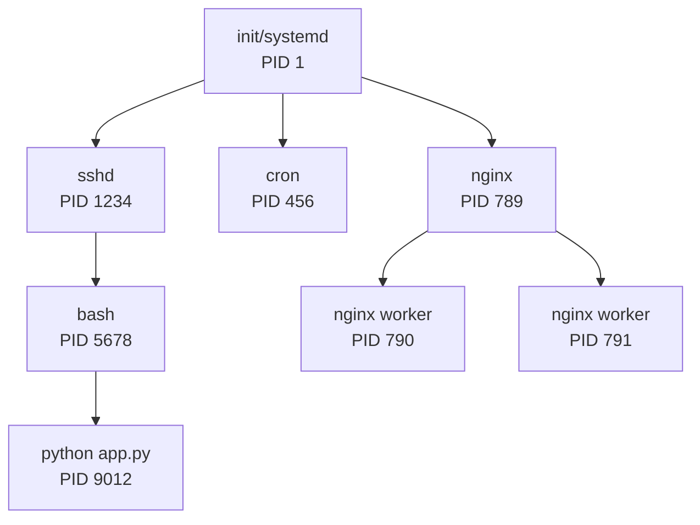
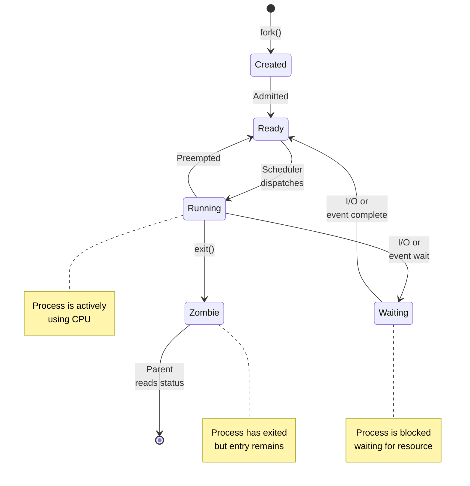
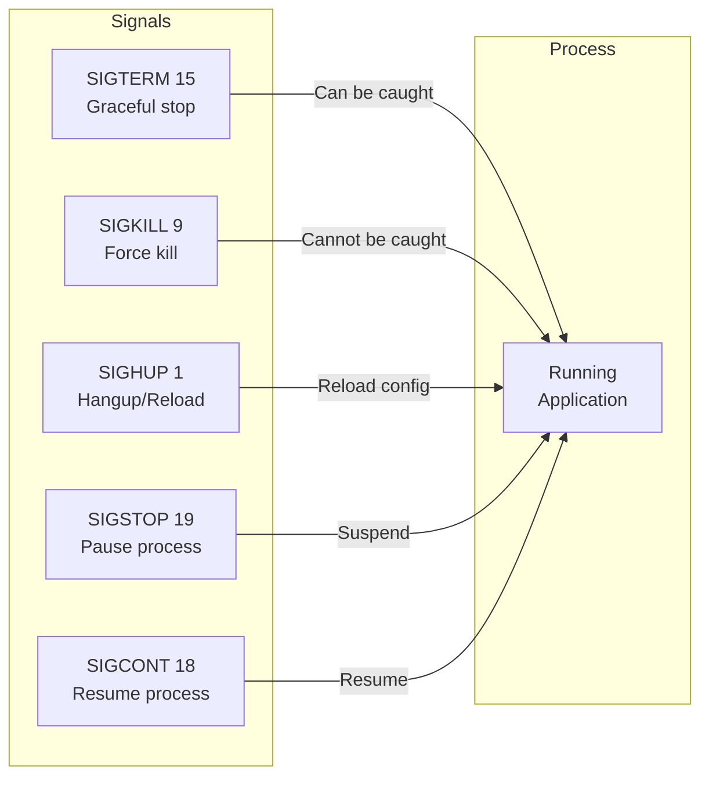
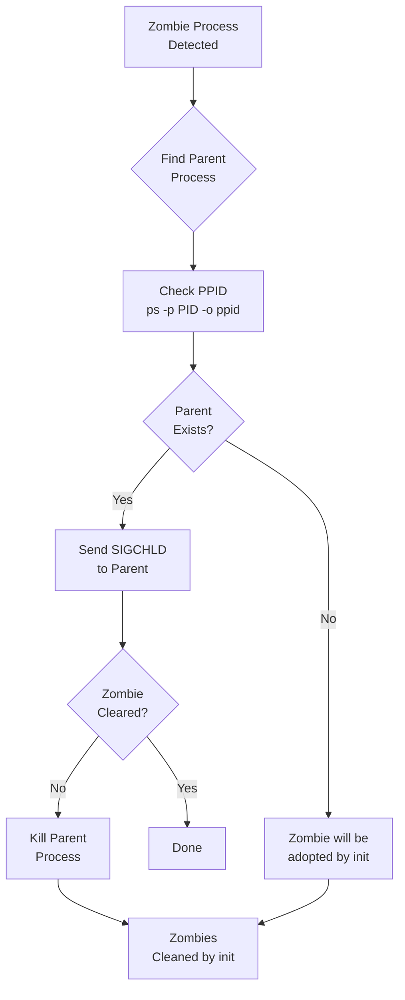

# How to Handle Process Management with ps and kill

Author: [nawazdhandala](https://www.github.com/nawazdhandala)

Tags: Linux, Process Management, System Administration, ps, kill, Troubleshooting

Description: Learn how to effectively monitor, manage, and terminate processes in Linux using ps and kill commands with practical examples and best practices.

---

Process management is a fundamental skill for any Linux system administrator. Whether you need to identify runaway processes, troubleshoot high CPU usage, or gracefully terminate applications, understanding `ps` and `kill` commands is essential. This guide covers everything you need to know about managing processes effectively.

## Understanding Linux Processes

Every running program in Linux is a process. Each process has a unique Process ID (PID) and various attributes like memory usage, CPU time, and parent-child relationships.



## The ps Command: Viewing Processes

The `ps` command displays information about active processes. Here are the most useful variations:

### Basic Process Listing

```bash
# Show processes for the current user in the current terminal
ps

# Example output:
#   PID TTY          TIME CMD
#  1234 pts/0    00:00:00 bash
#  5678 pts/0    00:00:00 ps
```

### View All Processes with Details

```bash
# Show all processes with full format (BSD style)
# a = show processes for all users
# u = display user-oriented format with detailed info
# x = show processes without a controlling terminal
ps aux

# Example output:
# USER       PID %CPU %MEM    VSZ   RSS TTY      STAT START   TIME COMMAND
# root         1  0.0  0.1 169584 13256 ?        Ss   Jan23   0:03 /sbin/init
# www-data  1234  2.5  1.2 456789 98765 ?        Sl   10:30   1:23 nginx: worker
```

### View Process Tree

```bash
# Display processes in a tree format showing parent-child relationships
# e = select all processes
# f = full format listing
# --forest = display process hierarchy as ASCII art tree
ps -ef --forest

# Example output:
# UID        PID  PPID  C STIME TTY          TIME CMD
# root         1     0  0 Jan23 ?        00:00:03 /sbin/init
# root       456     1  0 Jan23 ?        00:00:00  \_ /usr/sbin/sshd
# root      1234   456  0 10:30 ?        00:00:00      \_ sshd: admin [priv]
# admin     1235  1234  0 10:30 pts/0    00:00:00          \_ -bash
```

### Filter Processes by Name

```bash
# Find all processes matching a name pattern
# The grep -v grep excludes the grep command itself from results
ps aux | grep nginx | grep -v grep

# Alternative using pgrep (more elegant)
# -l = list process name along with PID
# -a = list full command line
pgrep -la nginx
```

### View Processes by User

```bash
# Show all processes owned by a specific user
# -u = select by effective user ID or name
ps -u www-data

# Show detailed info for a user's processes
ps -u www-data -o pid,ppid,%cpu,%mem,cmd

# Example output:
#   PID  PPID %CPU %MEM CMD
#  1234     1  0.5  2.1 nginx: worker process
#  1235     1  0.3  1.8 nginx: worker process
```

### Custom Output Format

```bash
# Display specific columns with custom formatting
# -e = select all processes
# -o = user-defined output format
ps -eo pid,ppid,user,%cpu,%mem,stat,start,time,cmd --sort=-%cpu | head -20

# Columns explained:
# pid    = Process ID
# ppid   = Parent Process ID
# user   = Username of process owner
# %cpu   = CPU utilization percentage
# %mem   = Memory utilization percentage
# stat   = Process state (R=running, S=sleeping, Z=zombie, etc.)
# start  = Start time of process
# time   = Cumulative CPU time
# cmd    = Command with arguments
```

## Process States Explained



Common process states in `ps` output:

| State | Meaning |
|-------|---------|
| R | Running or runnable |
| S | Interruptible sleep (waiting for event) |
| D | Uninterruptible sleep (usually I/O) |
| Z | Zombie (terminated but not reaped) |
| T | Stopped (by signal or debugger) |
| I | Idle kernel thread |

## The kill Command: Sending Signals

The `kill` command sends signals to processes. Despite its name, it does not always terminate processes.

### Understanding Signals



### Common Signals

| Signal | Number | Description | Can be Caught? |
|--------|--------|-------------|----------------|
| SIGHUP | 1 | Hangup - often used to reload configuration | Yes |
| SIGINT | 2 | Interrupt - same as Ctrl+C | Yes |
| SIGQUIT | 3 | Quit with core dump | Yes |
| SIGKILL | 9 | Force kill - cannot be ignored | No |
| SIGTERM | 15 | Graceful termination (default) | Yes |
| SIGSTOP | 19 | Stop/pause process | No |
| SIGCONT | 18 | Continue stopped process | Yes |

### Basic kill Usage

```bash
# Send SIGTERM (default, signal 15) - graceful termination
# The process can catch this signal and clean up before exiting
kill 1234

# Explicitly specify SIGTERM
kill -15 1234
kill -TERM 1234
kill -SIGTERM 1234
```

### Force Kill a Process

```bash
# Send SIGKILL (signal 9) - immediate termination
# Use this only when SIGTERM doesn't work
# WARNING: Process cannot clean up, may cause data loss
kill -9 1234
kill -KILL 1234
```

### Kill by Process Name

```bash
# Kill all processes matching a name
# Be careful - this affects ALL matching processes
killall nginx

# Kill with a specific signal
killall -TERM nginx

# Interactive mode - ask before each kill
killall -i nginx

# Using pkill (similar to killall but with pattern matching)
# Kill processes whose command matches the pattern
pkill -f "python app.py"
```

### Reload Configuration

```bash
# Send SIGHUP to reload configuration without stopping
# Many daemons interpret this as "reload config"
kill -HUP $(pgrep nginx)

# Or using pkill
pkill -HUP nginx

# For systemd services, prefer:
systemctl reload nginx
```

## Practical Workflows

### Finding and Killing a Runaway Process

```bash
# Step 1: Identify high CPU processes
# Sort by CPU usage descending, show top 10
ps aux --sort=-%cpu | head -10

# Step 2: Get more details about the suspicious process
# Replace 1234 with the actual PID
ps -p 1234 -o pid,ppid,user,%cpu,%mem,etime,cmd

# Step 3: Check what files the process has open
lsof -p 1234

# Step 4: Try graceful termination first
kill 1234

# Step 5: Wait a few seconds, then check if it's still running
sleep 3 && ps -p 1234

# Step 6: If still running, force kill
kill -9 1234
```

### Killing All User Processes

```bash
# Kill all processes owned by a specific user
# Useful when a user's session is stuck
pkill -u username

# Force kill all user processes
pkill -9 -u username

# More aggressive - kill user's processes and log them out
# WARNING: Use with caution
killall -u username
```

### Managing Background Jobs

```bash
# Run a command in background
./long_running_script.sh &

# List background jobs in current shell
jobs -l

# Bring job to foreground
fg %1

# Send job to background
bg %1

# Stop (pause) a foreground process
# Press Ctrl+Z

# Resume a stopped process in background
kill -CONT 1234
```

### Handling Zombie Processes



```bash
# Find zombie processes
# Zombies have 'Z' in the STAT column
ps aux | awk '$8=="Z" {print}'

# Find parent of zombie
# First, get the PPID
ps -p ZOMBIE_PID -o ppid=

# Try to signal parent to reap children
kill -SIGCHLD PARENT_PID

# If that doesn't work, killing the parent
# will cause init to adopt and reap zombies
kill PARENT_PID
```

## Advanced Techniques

### Monitoring Processes in Real-time

```bash
# Use top for interactive process monitoring
top

# Use htop for a more user-friendly interface (if installed)
htop

# Watch specific processes with custom format
# Updates every 2 seconds
watch -n 2 'ps aux --sort=-%cpu | head -10'
```

### Process Priority Management

```bash
# Run a command with modified priority
# Nice values: -20 (highest priority) to 19 (lowest)
nice -n 10 ./cpu_intensive_task.sh

# Change priority of running process
# Requires root for negative nice values
renice 10 -p 1234

# View process nice values
ps -eo pid,ni,cmd | grep python
```

### Using timeout to Auto-kill

```bash
# Run a command with a time limit
# Will send SIGTERM after 30 seconds
timeout 30s ./long_running_script.sh

# Send SIGKILL if process doesn't stop after SIGTERM
# Sends SIGTERM at 30s, SIGKILL at 35s if still running
timeout -k 5s 30s ./long_running_script.sh
```

## Best Practices

1. **Always try SIGTERM before SIGKILL**: Give processes a chance to clean up gracefully.

2. **Verify the PID before killing**: Double-check you have the right process to avoid disasters.

3. **Use pkill/killall carefully**: Pattern matching can affect unintended processes.

4. **Monitor zombie processes**: They indicate issues with parent processes not handling child termination.

5. **Check process relationships**: Before killing a parent process, understand what child processes exist.

6. **Document recurring issues**: If you frequently need to kill certain processes, investigate the root cause.

## Quick Reference

```bash
# View all processes with details
ps aux

# View process tree
ps -ef --forest

# Find process by name
pgrep -la process_name

# Graceful kill
kill PID

# Force kill
kill -9 PID

# Kill by name
pkill process_name

# Reload configuration
kill -HUP PID

# Real-time monitoring
top
```

## Conclusion

Mastering `ps` and `kill` commands is essential for effective Linux system administration. Remember to always try graceful termination first, verify process identities before killing, and investigate recurring issues rather than just treating symptoms. With these tools in your arsenal, you can effectively manage processes and maintain system stability.
