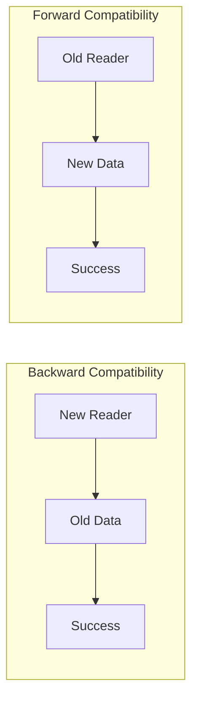
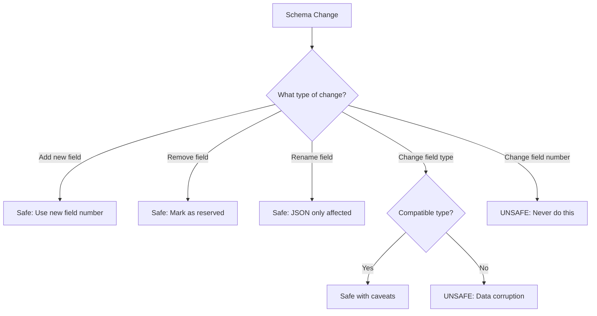
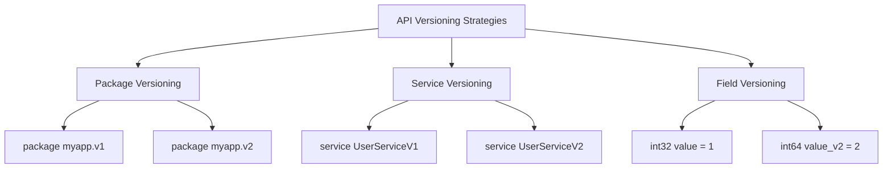

# How to Handle Protocol Buffer Evolution

Author: [nawazdhandala](https://www.github.com/nawazdhandala)

Tags: Protocol Buffers, gRPC, API Design, Schema Evolution, Backward Compatibility, Microservices

Description: A comprehensive guide to evolving Protocol Buffer schemas safely, covering backward and forward compatibility rules, field management strategies, and versioning patterns for production gRPC services.

---

Protocol Buffers (protobuf) are designed for schema evolution, allowing you to update message definitions without breaking existing clients or servers. However, evolving schemas incorrectly can cause data corruption, parsing failures, or subtle bugs that are difficult to diagnose. This guide covers the rules and best practices for safely evolving your protobuf definitions over time.

## Understanding Compatibility Types

Schema evolution involves two types of compatibility:



- **Backward Compatible**: New code can read data written by old code
- **Forward Compatible**: Old code can read data written by new code

For gRPC services, you typically need both types of compatibility because clients and servers may be updated at different times.

## The Golden Rules of Protobuf Evolution

### Rule 1: Never Change Field Numbers

Field numbers are the foundation of protobuf's binary encoding. Changing a field number is equivalent to deleting the old field and creating a new one:

```protobuf
// Original message
message User {
    string id = 1;
    string name = 2;
    string email = 3;
}

// WRONG: Changing field numbers breaks compatibility
message User {
    string id = 1;
    string email = 2;  // Was field 3, now field 2 - BROKEN
    string name = 3;   // Was field 2, now field 3 - BROKEN
}
```

### Rule 2: Never Reuse Field Numbers

Once a field number has been used, it should never be reused, even if the field is removed:

```protobuf
// Version 1
message Order {
    string id = 1;
    string customer_id = 2;
    double total = 3;
    string notes = 4;  // Removed in version 2
}

// Version 2 - WRONG: Reusing field number 4
message Order {
    string id = 1;
    string customer_id = 2;
    double total = 3;
    string shipping_method = 4;  // DANGER: Old 'notes' data will be parsed as shipping_method
}

// Version 2 - CORRECT: Use reserved and a new field number
message Order {
    string id = 1;
    string customer_id = 2;
    double total = 3;
    reserved 4;
    reserved "notes";
    string shipping_method = 5;
}
```

### Rule 3: Use Reserved Fields

Mark removed fields as reserved to prevent accidental reuse:

```protobuf
message Product {
    string id = 1;
    string name = 2;
    double price = 3;
    // Fields 4-6 were removed
    reserved 4, 5, 6;
    reserved "old_category", "deprecated_sku", "legacy_id";

    string category = 7;
    string sku = 8;
}
```

## Safe Schema Changes

The following diagram shows which changes are safe:



### Adding New Fields

Adding new fields is always safe:

```protobuf
// Version 1
message Customer {
    string id = 1;
    string name = 2;
    string email = 3;
}

// Version 2 - Safe addition
message Customer {
    string id = 1;
    string name = 2;
    string email = 3;
    string phone = 4;          // New optional field
    Address address = 5;       // New nested message
    repeated string tags = 6;  // New repeated field
}
```

Old clients will simply ignore the new fields, and new clients will see default values when reading old data.

### Removing Fields

Removing fields is safe if you mark them as reserved:

```protobuf
// Version 1
message Payment {
    string id = 1;
    double amount = 2;
    string currency = 3;
    string legacy_processor_id = 4;  // To be removed
}

// Version 2 - Safe removal
message Payment {
    string id = 1;
    double amount = 2;
    string currency = 3;
    reserved 4;
    reserved "legacy_processor_id";
}
```

### Renaming Fields

Renaming fields is safe for binary compatibility but affects JSON serialization:

```protobuf
// Version 1
message Item {
    string id = 1;
    string productName = 2;  // camelCase
}

// Version 2 - Binary compatible, JSON changed
message Item {
    string id = 1;
    string product_name = 2;  // snake_case - JSON key changes
}

// Version 2 - Preserve JSON compatibility with json_name
message Item {
    string id = 1;
    string product_name = 2 [json_name = "productName"];
}
```

## Compatible Type Changes

Some type changes are compatible because they share the same wire format:

```protobuf
// Wire-compatible types (can be interchanged)
// int32, uint32, int64, uint64, bool - all use varint encoding
// sint32 and sint64 - use zigzag varint encoding (NOT compatible with int32/int64)
// fixed32 and sfixed32 - 32-bit
// fixed64 and sfixed64 - 64-bit
// string and bytes - length-delimited (but semantic meaning differs)
```

### Safe Type Widening

```protobuf
// Version 1
message Metrics {
    int32 count = 1;      // Can hold values up to 2 billion
    float rate = 2;       // 32-bit float
}

// Version 2 - Safe widening
message Metrics {
    int64 count = 1;      // Now can hold larger values
    double rate = 2;      // More precision
}
```

### Dangerous Type Changes

```protobuf
// Version 1
message Record {
    string id = 1;
    int32 value = 2;
}

// Version 2 - DANGEROUS: Different wire format
message Record {
    string id = 1;
    sint32 value = 2;  // zigzag encoding, not compatible with int32
}

// Version 2 - DANGEROUS: Semantic mismatch
message Record {
    bytes id = 1;   // Wire compatible but semantic change
    int32 value = 2;
}
```

## Handling Optional and Required Fields

In proto3, all fields are optional by default. Use wrapper types when you need to distinguish between "not set" and "default value":

```protobuf
syntax = "proto3";

import "google/protobuf/wrappers.proto";

message Configuration {
    // Cannot distinguish between "timeout not set" and "timeout = 0"
    int32 timeout_ms = 1;

    // Can distinguish - null means not set
    google.protobuf.Int32Value timeout_ms_v2 = 2;

    // Alternative: use optional keyword (proto3 syntax)
    optional int32 timeout_ms_v3 = 3;
}
```

### Handling the optional Keyword

```go
// server/config_handler.go
package server

import (
    pb "myapp/proto/config"
)

func ProcessConfig(config *pb.Configuration) {
    // For regular field - cannot tell if explicitly set to 0
    if config.TimeoutMs == 0 {
        // Could be "not set" or "explicitly set to 0"
    }

    // For wrapper type
    if config.TimeoutMsV2 == nil {
        // Definitely not set
    } else {
        actualValue := config.TimeoutMsV2.GetValue()
        // Value was explicitly set (could be 0)
    }

    // For optional field
    if config.TimeoutMsV3 == nil {
        // Not set
    } else {
        actualValue := *config.TimeoutMsV3
        // Value was explicitly set
    }
}
```

## Evolving Enums Safely

Enums require special care because unknown values are handled differently in proto2 and proto3:

```protobuf
// Version 1
enum Status {
    STATUS_UNSPECIFIED = 0;
    STATUS_PENDING = 1;
    STATUS_ACTIVE = 2;
    STATUS_COMPLETED = 3;
}

// Version 2 - Safe addition
enum Status {
    STATUS_UNSPECIFIED = 0;
    STATUS_PENDING = 1;
    STATUS_ACTIVE = 2;
    STATUS_COMPLETED = 3;
    STATUS_CANCELLED = 4;   // New value
    STATUS_ON_HOLD = 5;     // New value
}
```

### Best Practices for Enums

```protobuf
enum OrderStatus {
    // Always have an UNSPECIFIED value at 0
    ORDER_STATUS_UNSPECIFIED = 0;

    // Use prefixes to avoid naming collisions
    ORDER_STATUS_DRAFT = 1;
    ORDER_STATUS_SUBMITTED = 2;
    ORDER_STATUS_PROCESSING = 3;
    ORDER_STATUS_SHIPPED = 4;
    ORDER_STATUS_DELIVERED = 5;

    // Reserve removed values
    reserved 6, 7;
    reserved "ORDER_STATUS_CANCELLED", "ORDER_STATUS_REFUNDED";

    // New values added at the end
    ORDER_STATUS_RETURNED = 8;
}
```

### Handling Unknown Enum Values

```go
// service/order_handler.go
package service

import (
    pb "myapp/proto/order"
)

func ProcessOrderStatus(status pb.OrderStatus) string {
    switch status {
    case pb.OrderStatus_ORDER_STATUS_DRAFT:
        return "Draft"
    case pb.OrderStatus_ORDER_STATUS_SUBMITTED:
        return "Submitted"
    case pb.OrderStatus_ORDER_STATUS_PROCESSING:
        return "Processing"
    case pb.OrderStatus_ORDER_STATUS_SHIPPED:
        return "Shipped"
    case pb.OrderStatus_ORDER_STATUS_DELIVERED:
        return "Delivered"
    case pb.OrderStatus_ORDER_STATUS_RETURNED:
        return "Returned"
    default:
        // Handle unknown values (from newer versions)
        // In proto3, unknown enum values are preserved as integers
        return fmt.Sprintf("Unknown (%d)", int32(status))
    }
}
```

## Oneof Evolution

Oneof fields require careful evolution to maintain compatibility:

```protobuf
// Version 1
message Notification {
    string id = 1;
    oneof content {
        EmailContent email = 2;
        SmsContent sms = 3;
    }
}

// Version 2 - Safe addition to oneof
message Notification {
    string id = 1;
    oneof content {
        EmailContent email = 2;
        SmsContent sms = 3;
        PushContent push = 4;  // New option
    }
}

// UNSAFE: Moving field into or out of oneof
message Notification {
    string id = 1;
    oneof content {
        EmailContent email = 2;
        SmsContent sms = 3;
    }
    PushContent push = 4;  // Was in oneof, now standalone - INCOMPATIBLE
}
```

## API Versioning Strategies

For major breaking changes, consider versioning your API:



### Package-Level Versioning

```protobuf
// v1/user.proto
syntax = "proto3";

package myapp.v1;

service UserService {
    rpc GetUser(GetUserRequest) returns (User);
}

message User {
    string id = 1;
    string name = 2;
}
```

```protobuf
// v2/user.proto
syntax = "proto3";

package myapp.v2;

service UserService {
    rpc GetUser(GetUserRequest) returns (User);
}

message User {
    string id = 1;
    string name = 2;
    string email = 3;
    Profile profile = 4;  // New in v2
}

message Profile {
    string avatar_url = 1;
    string bio = 2;
}
```

### Supporting Multiple Versions

```go
// server/main.go
package main

import (
    "google.golang.org/grpc"

    v1pb "myapp/proto/v1"
    v2pb "myapp/proto/v2"
)

func main() {
    server := grpc.NewServer()

    // Register both versions
    v1pb.RegisterUserServiceServer(server, NewUserServiceV1())
    v2pb.RegisterUserServiceServer(server, NewUserServiceV2())

    // Both services are available simultaneously
    // Clients can migrate at their own pace
}
```

## Deprecation Strategy

Use deprecation markers to signal planned removals:

```protobuf
message Account {
    string id = 1;
    string name = 2;

    // Deprecated: Use email_addresses instead
    string email = 3 [deprecated = true];

    repeated EmailAddress email_addresses = 4;

    // Document deprecation timeline
    // @deprecated Since v2.3, will be removed in v3.0
    string legacy_account_type = 5 [deprecated = true];
}

message EmailAddress {
    string address = 1;
    bool primary = 2;
    bool verified = 3;
}
```

### Runtime Deprecation Warnings

```go
// service/account_service.go
package service

import (
    "log"

    pb "myapp/proto/account"
)

func (s *AccountService) GetAccount(ctx context.Context, req *pb.GetAccountRequest) (*pb.Account, error) {
    account, err := s.repo.FindByID(ctx, req.GetId())
    if err != nil {
        return nil, err
    }

    // Log deprecation warning if client is using old field
    // This helps track migration progress
    if req.GetIncludeLegacyFields() {
        log.Printf("DEPRECATION WARNING: Client %s is using legacy fields for account %s",
            getClientID(ctx), req.GetId())
    }

    return account, nil
}
```

## Testing Schema Compatibility

Create tests to verify backward and forward compatibility:

```go
// schema_test.go
package schema_test

import (
    "testing"

    "google.golang.org/protobuf/proto"

    v1pb "myapp/proto/v1"
    v2pb "myapp/proto/v2"
)

func TestBackwardCompatibility(t *testing.T) {
    // Create a message with v1 schema
    v1User := &v1pb.User{
        Id:   "123",
        Name: "John Doe",
    }

    // Serialize with v1
    data, err := proto.Marshal(v1User)
    if err != nil {
        t.Fatalf("failed to marshal v1: %v", err)
    }

    // Deserialize with v2 (backward compatibility)
    v2User := &v2pb.User{}
    err = proto.Unmarshal(data, v2User)
    if err != nil {
        t.Fatalf("failed to unmarshal with v2: %v", err)
    }

    // Verify data is preserved
    if v2User.Id != v1User.Id {
        t.Errorf("id mismatch: got %s, want %s", v2User.Id, v1User.Id)
    }
    if v2User.Name != v1User.Name {
        t.Errorf("name mismatch: got %s, want %s", v2User.Name, v1User.Name)
    }
}

func TestForwardCompatibility(t *testing.T) {
    // Create a message with v2 schema (includes new fields)
    v2User := &v2pb.User{
        Id:    "456",
        Name:  "Jane Doe",
        Email: "jane@example.com",
        Profile: &v2pb.Profile{
            AvatarUrl: "https://example.com/avatar.jpg",
        },
    }

    // Serialize with v2
    data, err := proto.Marshal(v2User)
    if err != nil {
        t.Fatalf("failed to marshal v2: %v", err)
    }

    // Deserialize with v1 (forward compatibility)
    v1User := &v1pb.User{}
    err = proto.Unmarshal(data, v1User)
    if err != nil {
        t.Fatalf("failed to unmarshal with v1: %v", err)
    }

    // Verify known fields are preserved
    if v1User.Id != v2User.Id {
        t.Errorf("id mismatch: got %s, want %s", v1User.Id, v2User.Id)
    }
    if v1User.Name != v2User.Name {
        t.Errorf("name mismatch: got %s, want %s", v1User.Name, v2User.Name)
    }

    // New fields from v2 are simply ignored by v1
}
```

## Schema Evolution Checklist

Before releasing schema changes, verify:

1. **No field numbers changed** - Field numbers must remain constant
2. **No field numbers reused** - Removed fields should be reserved
3. **Type changes are compatible** - Check wire format compatibility
4. **Enum zero value exists** - All enums should have UNSPECIFIED = 0
5. **Oneof integrity maintained** - Fields not moved in/out of oneof
6. **Reserved fields documented** - Include names and numbers
7. **Deprecations marked** - Old fields marked with [deprecated = true]
8. **Tests pass** - Backward and forward compatibility tests succeed

## Conclusion

Protocol Buffer schema evolution requires careful attention to compatibility rules. By following the guidelines in this guide, including never changing or reusing field numbers, using reserved declarations, and implementing proper versioning strategies, you can safely evolve your schemas without breaking existing clients or corrupting data. Always test compatibility when making schema changes and communicate deprecations clearly to give consumers time to migrate.
