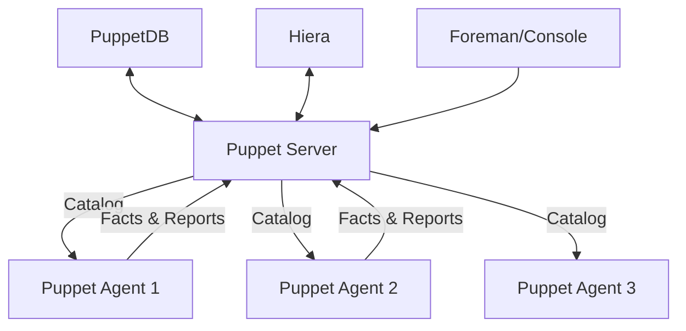

# How to Implement Puppet for Infrastructure Automation

Author: [nawazdhandala](https://www.github.com/nawazdhandala)

Tags: Puppet, Infrastructure Automation, Configuration Management, DevOps, IaC

Description: Learn Puppet for infrastructure automation with manifests, modules, Hiera data, and the Puppet server to enforce consistent configurations across your infrastructure.

---

Puppet is a mature configuration management tool that uses a declarative language to define system configurations. It enforces a desired state model where you describe what your systems should look like, and Puppet figures out how to get there. With over 15 years of development, Puppet has a rich ecosystem and proven track record in enterprise environments.

This guide covers Puppet installation, manifest writing, module development, and production deployment patterns.

## Puppet Architecture

Puppet uses a client-server model with periodic synchronization.



Key components:
- **Puppet Server**: Compiles manifests into catalogs
- **Puppet Agent**: Runs on managed nodes, applies catalogs
- **PuppetDB**: Stores facts, catalogs, and reports
- **Hiera**: Hierarchical data lookup for configuration values
- **Facter**: Collects system facts from nodes

## Installing Puppet Server

Set up the Puppet Server on your control node.

```bash
# Add Puppet repository (Ubuntu/Debian)
wget https://apt.puppet.com/puppet8-release-jammy.deb
sudo dpkg -i puppet8-release-jammy.deb
sudo apt update

# Install Puppet Server
sudo apt install -y puppetserver

# Configure JVM memory (adjust based on your server)
sudo sed -i 's/Xms2g/Xms1g/g' /etc/default/puppetserver
sudo sed -i 's/Xmx2g/Xmx1g/g' /etc/default/puppetserver

# Start Puppet Server
sudo systemctl enable puppetserver
sudo systemctl start puppetserver

# Verify installation
sudo /opt/puppetlabs/bin/puppetserver --version
```

Configure the Puppet Server:

```ini
# /etc/puppetlabs/puppet/puppet.conf
[server]
vardir = /opt/puppetlabs/server/data/puppetserver
logdir = /var/log/puppetlabs/puppetserver
rundir = /var/run/puppetlabs/puppetserver
pidfile = /var/run/puppetlabs/puppetserver/puppetserver.pid
codedir = /etc/puppetlabs/code

# DNS names for the server certificate
dns_alt_names = puppet,puppet.example.com

[main]
# Server hostname
server = puppet.example.com

# Certificate authority settings
ca_server = puppet.example.com

# Environment configuration
environment = production
environment_timeout = unlimited
```

## Installing Puppet Agent

Install the agent on managed nodes.

```bash
# Add Puppet repository
wget https://apt.puppet.com/puppet8-release-jammy.deb
sudo dpkg -i puppet8-release-jammy.deb
sudo apt update

# Install Puppet Agent
sudo apt install -y puppet-agent

# Configure agent to connect to server
sudo tee /etc/puppetlabs/puppet/puppet.conf << EOF
[main]
server = puppet.example.com
certname = $(hostname -f)

[agent]
environment = production
runinterval = 30m
EOF

# Start agent and request certificate
sudo /opt/puppetlabs/bin/puppet resource service puppet ensure=running enable=true
sudo /opt/puppetlabs/bin/puppet agent --test --waitforcert 60
```

## Managing Certificates

Puppet uses SSL certificates for authentication.

```bash
# On Puppet Server - list certificate requests
sudo /opt/puppetlabs/bin/puppetserver ca list

# Sign a specific certificate
sudo /opt/puppetlabs/bin/puppetserver ca sign --certname web1.example.com

# Sign all pending certificates
sudo /opt/puppetlabs/bin/puppetserver ca sign --all

# Revoke a certificate
sudo /opt/puppetlabs/bin/puppetserver ca revoke --certname old-server.example.com

# Clean up revoked certificates
sudo /opt/puppetlabs/bin/puppetserver ca clean --certname old-server.example.com
```

## Writing Manifests

Manifests are Puppet's configuration files written in Puppet DSL.

```puppet
# /etc/puppetlabs/code/environments/production/manifests/site.pp
# Main site manifest - entry point for all nodes

# Default node configuration
node default {
  include base
  include security
}

# Web server nodes
node /^web\d+\.example\.com$/ {
  include base
  include webserver
  include monitoring::client
}

# Database server nodes
node 'db1.example.com', 'db2.example.com' {
  include base
  include postgresql
  include backup
}
```

## Creating Modules

Modules package related manifests, files, and templates.

```bash
# Create module directory structure
sudo mkdir -p /etc/puppetlabs/code/environments/production/modules/webserver/{manifests,files,templates}

# Module structure:
# webserver/
# ├── manifests/
# │   ├── init.pp        # Main class
# │   ├── install.pp     # Package installation
# │   ├── config.pp      # Configuration
# │   └── service.pp     # Service management
# ├── files/             # Static files
# ├── templates/         # ERB templates
# └── data/              # Hiera module data
```

```puppet
# modules/webserver/manifests/init.pp
# Main webserver class

class webserver (
  Integer $worker_processes = 4,
  Integer $worker_connections = 1024,
  String $server_name = $facts['fqdn'],
  Boolean $ssl_enabled = false,
) {
  contain webserver::install
  contain webserver::config
  contain webserver::service

  Class['webserver::install']
  -> Class['webserver::config']
  ~> Class['webserver::service']
}
```

```puppet
# modules/webserver/manifests/install.pp
# Package installation

class webserver::install {
  package { 'nginx':
    ensure => installed,
  }

  package { ['curl', 'vim', 'htop']:
    ensure => installed,
  }
}
```

```puppet
# modules/webserver/manifests/config.pp
# Configuration management

class webserver::config {
  file { '/etc/nginx/nginx.conf':
    ensure  => file,
    owner   => 'root',
    group   => 'root',
    mode    => '0644',
    content => template('webserver/nginx.conf.erb'),
    notify  => Class['webserver::service'],
  }

  file { '/var/www/html':
    ensure => directory,
    owner  => 'www-data',
    group  => 'www-data',
    mode   => '0755',
  }

  file { '/etc/nginx/sites-enabled/default':
    ensure => absent,
    notify => Class['webserver::service'],
  }
}
```

```puppet
# modules/webserver/manifests/service.pp
# Service management

class webserver::service {
  service { 'nginx':
    ensure     => running,
    enable     => true,
    hasrestart => true,
    hasstatus  => true,
  }
}
```

## ERB Templates

Templates allow dynamic configuration generation.

```erb
# modules/webserver/templates/nginx.conf.erb
# Nginx configuration template

user www-data;
worker_processes <%= @worker_processes %>;
pid /run/nginx.pid;

events {
    worker_connections <%= @worker_connections %>;
    multi_accept on;
}

http {
    sendfile on;
    tcp_nopush on;
    keepalive_timeout 65;

    include /etc/nginx/mime.types;
    default_type application/octet-stream;

    access_log /var/log/nginx/access.log;
    error_log /var/log/nginx/error.log;

    server {
        listen 80;
        server_name <%= @server_name %>;
        root /var/www/html;

<% if @ssl_enabled -%>
        listen 443 ssl;
        ssl_certificate /etc/ssl/certs/<%= @server_name %>.crt;
        ssl_certificate_key /etc/ssl/private/<%= @server_name %>.key;
<% end -%>
    }
}
```

## Using Hiera for Data

Hiera separates data from code for cleaner manifests.

```yaml
# /etc/puppetlabs/puppet/hiera.yaml
# Hiera configuration

version: 5
defaults:
  datadir: data
  data_hash: yaml_data

hierarchy:
  - name: "Per-node data"
    path: "nodes/%{trusted.certname}.yaml"

  - name: "Per-environment data"
    path: "environments/%{environment}.yaml"

  - name: "Per-OS data"
    path: "os/%{facts.os.family}.yaml"

  - name: "Common data"
    path: "common.yaml"
```

```yaml
# data/common.yaml
# Common configuration for all nodes

---
base::timezone: 'UTC'
base::ntp_servers:
  - 'time.google.com'
  - 'time.cloudflare.com'

webserver::worker_processes: 4
webserver::worker_connections: 1024
```

```yaml
# data/environments/production.yaml
# Production-specific settings

---
webserver::ssl_enabled: true
monitoring::enabled: true
backup::retention_days: 30
```

```yaml
# data/nodes/web1.example.com.yaml
# Node-specific overrides

---
webserver::worker_processes: 8
webserver::worker_connections: 8192
```

## Resource Types

Puppet provides many built-in resource types.

```puppet
# File resource
file { '/app/config.yml':
  ensure  => file,
  owner   => 'app',
  group   => 'app',
  mode    => '0640',
  source  => 'puppet:///modules/myapp/config.yml',
}

# Package resource
package { 'postgresql-15':
  ensure => installed,
}

# Service resource
service { 'postgresql':
  ensure => running,
  enable => true,
}

# User resource
user { 'deploy':
  ensure     => present,
  uid        => 1001,
  gid        => 'deploy',
  home       => '/home/deploy',
  shell      => '/bin/bash',
  managehome => true,
}

# Cron resource
cron { 'backup':
  command => '/usr/local/bin/backup.sh',
  user    => 'root',
  hour    => 2,
  minute  => 0,
}

# Exec resource (use sparingly)
exec { 'apt-update':
  command     => '/usr/bin/apt update',
  refreshonly => true,
}
```

## Resource Relationships

Define dependencies between resources.

```puppet
# Ordering with arrows
Package['nginx'] -> File['/etc/nginx/nginx.conf'] -> Service['nginx']

# Notification (triggers refresh)
File['/etc/nginx/nginx.conf'] ~> Service['nginx']

# Require and notify in resources
file { '/etc/nginx/nginx.conf':
  ensure  => file,
  require => Package['nginx'],
  notify  => Service['nginx'],
}

# Before and subscribe
service { 'nginx':
  ensure    => running,
  subscribe => File['/etc/nginx/nginx.conf'],
}
```

## Running Puppet

Apply configurations to managed nodes.

```bash
# On agent - run Puppet manually
sudo /opt/puppetlabs/bin/puppet agent --test

# Run with verbose output
sudo /opt/puppetlabs/bin/puppet agent --test --debug

# Dry run (noop mode)
sudo /opt/puppetlabs/bin/puppet agent --test --noop

# Apply specific environment
sudo /opt/puppetlabs/bin/puppet agent --test --environment staging

# On server - trigger runs on specific nodes
sudo /opt/puppetlabs/bin/puppet job run --nodes web1.example.com

# Compile catalog without applying
sudo /opt/puppetlabs/bin/puppet catalog compile web1.example.com
```

## Validating Code

Check manifest syntax before deployment.

```bash
# Validate manifest syntax
puppet parser validate manifests/site.pp

# Lint manifests for style issues
puppet-lint modules/webserver/

# Run unit tests with rspec-puppet
cd modules/webserver && rake spec
```

---

Puppet's declarative approach and strong typing make it excellent for enforcing consistent configurations across large infrastructures. The learning curve is steeper than simpler tools, but the investment pays off in maintainability and reliability. Start with basic manifests, organize code into modules, and use Hiera to separate data from logic for scalable configuration management.
