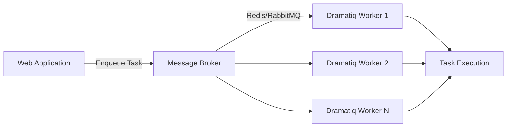

# How to Build Task Queues with Dramatiq in Python

Author: [nawazdhandala](https://www.github.com/nawazdhandala)

Tags: Python, Dramatiq, Task Queue, Background Jobs, Redis, RabbitMQ, Async Processing, Celery Alternative

Description: Learn how to build reliable task queues in Python using Dramatiq. This guide covers setting up workers, handling retries, scheduling tasks, prioritization, and best practices for production deployments.

---

> Background task processing is essential for building scalable web applications. Instead of making users wait for slow operations, you can offload work to background workers and respond immediately. Dramatiq is a modern Python task queue that makes this simple and reliable.

Dramatiq stands out from alternatives like Celery with its simpler API, better defaults, and built-in support for retries with exponential backoff. It uses Redis or RabbitMQ as a message broker and provides a clean, Pythonic interface.

---

## Why Dramatiq Over Celery?

While Celery is the most popular Python task queue, Dramatiq offers several advantages:

- Simpler configuration with sensible defaults
- Built-in retry logic with exponential backoff
- Cleaner actor-based API
- Better memory usage and performance
- First-class support for both Redis and RabbitMQ



---

## Setting Up Dramatiq

Install Dramatiq with Redis support:

```bash
pip install dramatiq[redis] redis
```

Or with RabbitMQ:

```bash
pip install dramatiq[rabbitmq] pika
```

---

## Basic Task Definition

Let's start with a simple example that demonstrates the core concepts:

```python
# tasks.py
# Basic Dramatiq task definitions

import dramatiq
from dramatiq.brokers.redis import RedisBroker

# Configure the Redis broker
# Dramatiq will use this to store and retrieve messages
redis_broker = RedisBroker(host="localhost", port=6379)
dramatiq.set_broker(redis_broker)


@dramatiq.actor
def send_welcome_email(user_id: int, email: str):
    """
    Send a welcome email to a new user.
    The @dramatiq.actor decorator makes this function a background task.
    """
    print(f"Sending welcome email to {email} (user_id: {user_id})")

    # Simulate sending email
    # In production, use your email service here
    import time
    time.sleep(2)  # Simulates network call

    print(f"Welcome email sent to {email}")


@dramatiq.actor
def process_payment(order_id: str, amount: float):
    """
    Process a payment for an order.
    This runs in the background so the user doesn't wait.
    """
    print(f"Processing payment of ${amount} for order {order_id}")

    # Payment processing logic here
    # Connect to Stripe, PayPal, etc.

    print(f"Payment processed for order {order_id}")


# Calling .send() enqueues the task for background processing
if __name__ == "__main__":
    # These calls return immediately
    send_welcome_email.send(user_id=123, email="user@example.com")
    process_payment.send(order_id="ORD-456", amount=99.99)
    print("Tasks enqueued!")
```

Run the worker to process tasks:

```bash
dramatiq tasks
```

---

## Configuring Retries and Timeouts

Dramatiq provides built-in retry support with exponential backoff:

```python
# tasks_with_retries.py
# Task configuration with retries, timeouts, and backoff

import dramatiq
from dramatiq.brokers.redis import RedisBroker
from dramatiq.middleware import Retries, TimeLimit

# Set up broker with middleware
redis_broker = RedisBroker(host="localhost")
dramatiq.set_broker(redis_broker)


@dramatiq.actor(
    max_retries=5,           # Retry up to 5 times on failure
    min_backoff=1000,        # Start with 1 second delay
    max_backoff=300000,      # Max 5 minute delay between retries
    time_limit=60000         # 60 second timeout per attempt
)
def call_external_api(endpoint: str, payload: dict):
    """
    Call an external API with automatic retries.
    If the API fails, Dramatiq will retry with exponential backoff.
    """
    import requests

    response = requests.post(endpoint, json=payload, timeout=30)
    response.raise_for_status()  # Raises exception on HTTP errors

    return response.json()


@dramatiq.actor(
    max_retries=3,
    retry_when=lambda retries, exc: isinstance(exc, ConnectionError)
)
def selective_retry_task(data: dict):
    """
    Only retry on specific exceptions.
    Other exceptions will fail immediately without retry.
    """
    # Only retries on ConnectionError
    # Other exceptions fail fast
    process_data(data)


class NonRetryableError(Exception):
    """Errors that should not trigger retries."""
    pass


@dramatiq.actor(max_retries=5)
def smart_retry_task(item_id: str):
    """
    Demonstrates smart retry logic.
    Some errors should retry, others should fail immediately.
    """
    try:
        result = process_item(item_id)
        return result
    except ValueError as e:
        # Validation errors should not retry
        raise NonRetryableError(str(e)) from e
    except ConnectionError:
        # Network errors should retry
        raise
```

---

## Task Prioritization with Queues

Use different queues for different priority levels:

```python
# priority_tasks.py
# Task prioritization using multiple queues

import dramatiq
from dramatiq.brokers.redis import RedisBroker

redis_broker = RedisBroker(host="localhost")
dramatiq.set_broker(redis_broker)


@dramatiq.actor(queue_name="high-priority")
def urgent_notification(user_id: int, message: str):
    """
    High-priority notifications that need immediate delivery.
    These are processed before normal-priority tasks.
    """
    send_push_notification(user_id, message)


@dramatiq.actor(queue_name="default")
def standard_email(user_id: int, template: str):
    """
    Standard priority email sending.
    Processed after high-priority tasks.
    """
    send_email_from_template(user_id, template)


@dramatiq.actor(queue_name="low-priority")
def generate_report(report_type: str, date_range: dict):
    """
    Low-priority report generation.
    Can wait until other work is done.
    """
    create_and_store_report(report_type, date_range)


@dramatiq.actor(queue_name="bulk")
def bulk_import(file_path: str):
    """
    Bulk operations that can be processed during low-traffic periods.
    """
    process_import_file(file_path)
```

Run workers with queue priorities:

```bash
# Process high-priority queue with more threads
dramatiq tasks --queues high-priority --threads 8

# Process default and low-priority with fewer threads
dramatiq tasks --queues default low-priority --threads 4

# Process bulk queue with single thread
dramatiq tasks --queues bulk --threads 1
```

---

## Scheduling Delayed Tasks

Dramatiq supports scheduling tasks to run after a delay:

```python
# scheduled_tasks.py
# Scheduling tasks for delayed execution

import dramatiq
from dramatiq.brokers.redis import RedisBroker
from datetime import datetime, timedelta

redis_broker = RedisBroker(host="localhost")
dramatiq.set_broker(redis_broker)


@dramatiq.actor
def send_reminder(user_id: int, message: str):
    """Send a reminder notification to a user."""
    print(f"Reminder for user {user_id}: {message}")


@dramatiq.actor
def expire_session(session_id: str):
    """Clean up an expired session."""
    print(f"Expiring session: {session_id}")


def schedule_reminder(user_id: int, message: str, delay_minutes: int):
    """
    Schedule a reminder for the future.
    The task will be processed after the specified delay.
    """
    delay_ms = delay_minutes * 60 * 1000
    send_reminder.send_with_options(
        args=(user_id, message),
        delay=delay_ms  # Delay in milliseconds
    )


def create_session_with_expiry(session_id: str, ttl_hours: int):
    """
    Create a session and schedule its cleanup.
    The expire task runs automatically after TTL.
    """
    # Save session to database
    save_session(session_id)

    # Schedule cleanup
    ttl_ms = ttl_hours * 60 * 60 * 1000
    expire_session.send_with_options(
        args=(session_id,),
        delay=ttl_ms
    )


# Example usage
if __name__ == "__main__":
    # Send reminder in 30 minutes
    schedule_reminder(
        user_id=123,
        message="Your appointment is in 1 hour",
        delay_minutes=30
    )

    # Create session that expires in 24 hours
    create_session_with_expiry("sess_abc123", ttl_hours=24)
```

---

## Building a Task Pipeline

Chain tasks together for complex workflows:

```python
# pipeline.py
# Building task pipelines and workflows with Dramatiq

import dramatiq
from dramatiq.brokers.redis import RedisBroker
from dramatiq import group, pipeline

redis_broker = RedisBroker(host="localhost")
dramatiq.set_broker(redis_broker)


@dramatiq.actor(store_results=True)
def download_file(url: str) -> str:
    """Download a file and return the local path."""
    import urllib.request
    local_path = f"/tmp/{url.split('/')[-1]}"
    urllib.request.urlretrieve(url, local_path)
    return local_path


@dramatiq.actor(store_results=True)
def process_file(file_path: str) -> dict:
    """Process a downloaded file and extract data."""
    # Read and parse the file
    data = parse_file(file_path)
    return {"records": len(data), "path": file_path}


@dramatiq.actor
def send_completion_notification(result: dict, user_email: str):
    """Notify user when processing is complete."""
    message = f"Processed {result['records']} records from {result['path']}"
    send_email(user_email, "Processing Complete", message)


@dramatiq.actor
def cleanup_file(file_path: str):
    """Remove temporary files after processing."""
    import os
    if os.path.exists(file_path):
        os.remove(file_path)


def process_url_pipeline(url: str, user_email: str):
    """
    Create a pipeline that downloads, processes, notifies, and cleans up.
    Each step passes its result to the next.
    """
    pipe = pipeline([
        download_file.message(url),
        process_file.message(),
        send_completion_notification.message(user_email=user_email),
    ])
    pipe.run()


@dramatiq.actor
def process_batch_item(item: dict) -> dict:
    """Process a single item from a batch."""
    result = transform_item(item)
    return result


@dramatiq.actor
def aggregate_results(results: list) -> dict:
    """Combine results from parallel processing."""
    total = sum(r.get("value", 0) for r in results)
    return {"total": total, "count": len(results)}


def process_batch_in_parallel(items: list):
    """
    Process multiple items in parallel, then aggregate.
    Uses Dramatiq groups for fan-out/fan-in pattern.
    """
    # Create a group of parallel tasks
    g = group([
        process_batch_item.message(item)
        for item in items
    ])

    # Run all tasks and wait for results
    results = g.run().get_results(block=True, timeout=60000)

    # Aggregate the results
    aggregate_results.send(results)
```

---

## Error Handling and Dead Letter Queues

Handle failed tasks gracefully:

```python
# error_handling.py
# Error handling, dead letter queues, and failure callbacks

import dramatiq
from dramatiq.brokers.redis import RedisBroker
from dramatiq.middleware import Callbacks
import logging

logger = logging.getLogger(__name__)

redis_broker = RedisBroker(host="localhost")
dramatiq.set_broker(redis_broker)


def on_task_failure(message, exception):
    """
    Callback when a task fails permanently.
    Called after all retries are exhausted.
    """
    logger.error(
        f"Task {message.actor_name} failed permanently",
        extra={
            "message_id": message.message_id,
            "args": message.args,
            "kwargs": message.kwargs,
            "exception": str(exception)
        }
    )

    # Store in dead letter queue for manual review
    store_failed_message(message, exception)

    # Alert on-call team
    send_alert(
        f"Task {message.actor_name} failed: {exception}"
    )


def on_task_success(message, result):
    """Callback when a task completes successfully."""
    logger.info(
        f"Task {message.actor_name} completed",
        extra={"message_id": message.message_id}
    )


@dramatiq.actor(
    max_retries=3,
    on_failure=on_task_failure,
    on_success=on_task_success
)
def critical_task(data: dict):
    """
    A critical task with failure callbacks.
    If it fails after all retries, we get notified.
    """
    process_critical_data(data)


class TaskError(Exception):
    """Base class for task errors."""
    pass


class RetryableError(TaskError):
    """Errors that should trigger a retry."""
    pass


class PermanentError(TaskError):
    """Errors that should not retry."""
    pass


@dramatiq.actor(max_retries=5)
def robust_task(item_id: str):
    """
    Task with sophisticated error handling.
    Distinguishes between retryable and permanent failures.
    """
    try:
        # Attempt the operation
        result = process_item(item_id)
        return result

    except ConnectionError as e:
        # Network issues should retry
        logger.warning(f"Connection error for {item_id}, will retry")
        raise RetryableError(str(e)) from e

    except ValueError as e:
        # Validation errors should not retry
        logger.error(f"Invalid data for {item_id}, failing permanently")
        raise PermanentError(str(e)) from e

    except Exception as e:
        # Unknown errors - log and retry
        logger.exception(f"Unexpected error for {item_id}")
        raise
```

---

## Monitoring and Observability

Add observability to your task queue:

```python
# monitoring.py
# Task queue monitoring with metrics and logging

import dramatiq
from dramatiq.brokers.redis import RedisBroker
from dramatiq.middleware import Middleware
import time
import logging

logger = logging.getLogger(__name__)


class MetricsMiddleware(Middleware):
    """
    Custom middleware to track task metrics.
    Records execution time, success/failure rates, queue depth.
    """

    def __init__(self, metrics_client):
        self.metrics = metrics_client

    def before_process_message(self, broker, message):
        """Called before each task starts processing."""
        # Record when processing started
        message.options["start_time"] = time.time()

        # Increment in-flight counter
        self.metrics.increment(
            "dramatiq.tasks.in_flight",
            tags={"actor": message.actor_name}
        )

    def after_process_message(self, broker, message, *, result=None, exception=None):
        """Called after each task finishes (success or failure)."""
        # Calculate duration
        start_time = message.options.get("start_time", time.time())
        duration = time.time() - start_time

        # Record duration histogram
        self.metrics.histogram(
            "dramatiq.tasks.duration_seconds",
            duration,
            tags={"actor": message.actor_name}
        )

        # Decrement in-flight counter
        self.metrics.decrement(
            "dramatiq.tasks.in_flight",
            tags={"actor": message.actor_name}
        )

        # Record success or failure
        if exception is None:
            self.metrics.increment(
                "dramatiq.tasks.success",
                tags={"actor": message.actor_name}
            )
        else:
            self.metrics.increment(
                "dramatiq.tasks.failure",
                tags={
                    "actor": message.actor_name,
                    "exception": type(exception).__name__
                }
            )

    def after_skip_message(self, broker, message):
        """Called when a message is skipped (e.g., already processed)."""
        self.metrics.increment(
            "dramatiq.tasks.skipped",
            tags={"actor": message.actor_name}
        )


class LoggingMiddleware(Middleware):
    """Middleware for structured logging of task execution."""

    def before_process_message(self, broker, message):
        logger.info(
            "Task started",
            extra={
                "task": message.actor_name,
                "message_id": message.message_id,
                "queue": message.queue_name,
                "retries": message.options.get("retries", 0)
            }
        )

    def after_process_message(self, broker, message, *, result=None, exception=None):
        if exception:
            logger.error(
                "Task failed",
                extra={
                    "task": message.actor_name,
                    "message_id": message.message_id,
                    "exception": str(exception)
                },
                exc_info=True
            )
        else:
            logger.info(
                "Task completed",
                extra={
                    "task": message.actor_name,
                    "message_id": message.message_id
                }
            )


# Configure broker with middleware
redis_broker = RedisBroker(host="localhost")
redis_broker.add_middleware(LoggingMiddleware())
# redis_broker.add_middleware(MetricsMiddleware(your_metrics_client))
dramatiq.set_broker(redis_broker)
```

---

## Production Deployment

Here is a complete example for production deployment:

```python
# config.py
# Production configuration for Dramatiq

import os
import dramatiq
from dramatiq.brokers.redis import RedisBroker
from dramatiq.middleware import (
    AgeLimit,
    Callbacks,
    Pipelines,
    Retries,
    TimeLimit,
)

def configure_dramatiq():
    """
    Configure Dramatiq for production use.
    Sets up broker, middleware, and global settings.
    """
    # Get Redis URL from environment
    redis_url = os.getenv("REDIS_URL", "redis://localhost:6379/0")

    # Create broker with production settings
    broker = RedisBroker(
        url=redis_url,
        # Connection pool settings
        middleware=[
            AgeLimit(max_age=3600000),    # Discard messages older than 1 hour
            TimeLimit(time_limit=300000),  # 5 minute timeout per task
            Callbacks(),                   # Enable success/failure callbacks
            Pipelines(),                   # Enable task pipelines
            Retries(                       # Configure retry behavior
                max_retries=5,
                min_backoff=1000,
                max_backoff=60000
            ),
        ]
    )

    dramatiq.set_broker(broker)
    return broker


# tasks/__init__.py
# Import all task modules to register them

from config import configure_dramatiq

# Initialize Dramatiq
configure_dramatiq()

# Import task modules
from . import emails
from . import payments
from . import reports
from . import notifications
```

Systemd service file for running workers:

```ini
# /etc/systemd/system/dramatiq-worker.service
[Unit]
Description=Dramatiq Task Worker
After=network.target redis.service

[Service]
Type=simple
User=www-data
Group=www-data
WorkingDirectory=/app
Environment=REDIS_URL=redis://localhost:6379/0
ExecStart=/app/venv/bin/dramatiq tasks --processes 4 --threads 8
Restart=always
RestartSec=5

[Install]
WantedBy=multi-user.target
```

---

## Best Practices

1. **Keep tasks idempotent**: Tasks may run multiple times due to retries. Design them to be safely re-executable.

2. **Use meaningful task names**: Clear names help with debugging and monitoring.

3. **Set appropriate timeouts**: Prevent runaway tasks from consuming resources indefinitely.

4. **Monitor queue depths**: Growing queues indicate processing cannot keep up with incoming work.

5. **Use dead letter queues**: Failed tasks should be stored for manual review and replay.

6. **Separate queues by priority**: Critical tasks should not wait behind bulk operations.

7. **Pass small arguments**: Store large data elsewhere and pass references. Message size affects broker performance.

---

*Building reliable background processing? [OneUptime](https://oneuptime.com) helps you monitor task queues, track failure rates, and alert on processing delays.*

**Related Reading:**
- [How to Implement Distributed Locks with Redlock in Python](https://oneuptime.com/blog/post/2026-01-25-python-distributed-locks-redlock/view)
- [How to Implement Circuit Breakers in Python](https://oneuptime.com/blog/post/2026-01-23-python-circuit-breakers/view)
