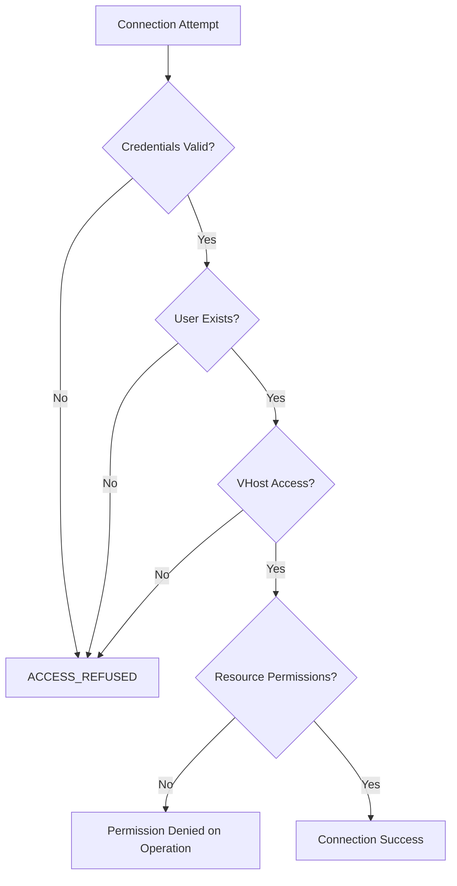
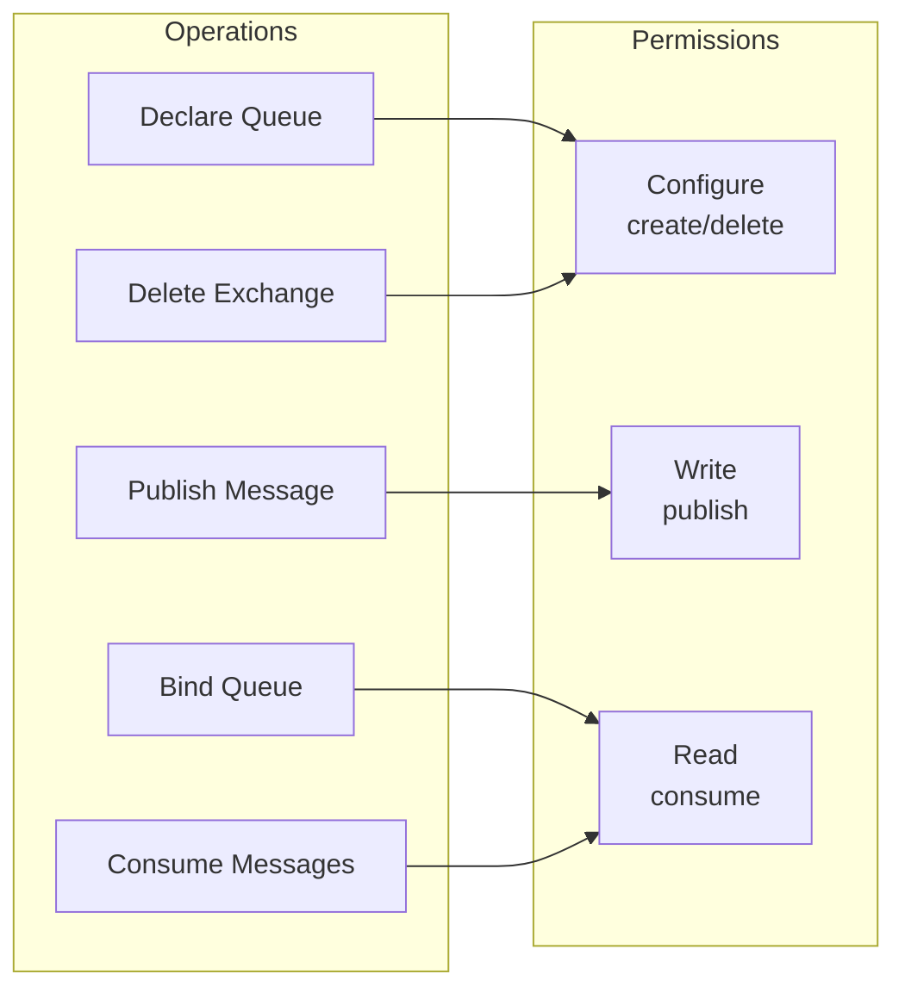
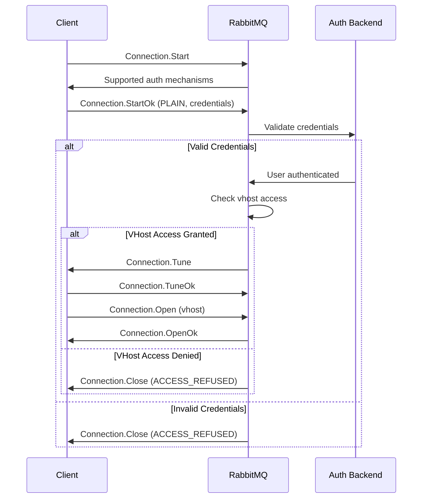

# How to Fix 'Access Refused' Authentication Errors

Author: [nawazdhandala](https://www.github.com/nawazdhandala)

Tags: RabbitMQ, Authentication, Security, Troubleshooting, Debugging, DevOps, Message Queue

Description: Learn how to diagnose and fix common RabbitMQ authentication errors including access refused, permission denied, and credential issues.

---

The "Access Refused" error in RabbitMQ is one of the most frustrating issues to debug because it can stem from multiple causes: wrong credentials, missing permissions, vhost access restrictions, or network policies. This guide walks through systematic troubleshooting steps to identify and fix the root cause.

## Understanding the Error

When you see an error like this:

```
pika.exceptions.ProbableAccessDeniedError: ConnectionClosedByBroker: (403) 'ACCESS_REFUSED - Login was refused using authentication mechanism PLAIN. For details see the broker logfile.'
```

It means RabbitMQ rejected your connection attempt. The error does not tell you exactly why, so you need to investigate.



## Common Causes and Solutions

### 1. Wrong Username or Password

The most common cause is simply incorrect credentials.

**Check current users:**

```bash
# List all users in RabbitMQ
sudo rabbitmqctl list_users

# Example output:
# Listing users ...
# user    tags
# guest   [administrator]
# app_user        []
```

**Create or update user credentials:**

```bash
# Create a new user with password
sudo rabbitmqctl add_user myapp mypassword

# Change password for existing user
sudo rabbitmqctl change_password myapp newpassword

# Delete and recreate if needed
sudo rabbitmqctl delete_user myapp
sudo rabbitmqctl add_user myapp correctpassword
```

**Verify connection with correct credentials:**

```python
import pika

# Use the exact credentials you created
credentials = pika.PlainCredentials('myapp', 'correctpassword')
parameters = pika.ConnectionParameters(
    host='localhost',
    port=5672,
    credentials=credentials
)

try:
    connection = pika.BlockingConnection(parameters)
    print("Connection successful!")
    connection.close()
except pika.exceptions.ProbableAccessDeniedError as e:
    print(f"Authentication failed: {e}")
```

### 2. Guest User Remote Access Blocked

By default, the `guest` user can only connect from localhost.

**Error when connecting remotely with guest:**

```python
# This will fail from a remote machine
connection = pika.BlockingConnection(
    pika.ConnectionParameters(
        host='rabbitmq.example.com',
        credentials=pika.PlainCredentials('guest', 'guest')
    )
)
# ACCESS_REFUSED - Login was refused
```

**Solutions:**

Option 1: Create a dedicated user (recommended):

```bash
# Create a new user for remote access
sudo rabbitmqctl add_user remote_app secure_password

# Grant administrator privileges if needed
sudo rabbitmqctl set_user_tags remote_app administrator

# Grant permissions on the default vhost
sudo rabbitmqctl set_permissions -p / remote_app ".*" ".*" ".*"
```

Option 2: Enable guest remote access (not recommended for production):

```ini
# /etc/rabbitmq/rabbitmq.conf
# Allow guest to connect from any host (security risk!)
loopback_users = none
```

### 3. Virtual Host Access Denied

Users must be granted explicit access to virtual hosts.

**Check vhost permissions:**

```bash
# List all virtual hosts
sudo rabbitmqctl list_vhosts

# List user permissions across all vhosts
sudo rabbitmqctl list_user_permissions myapp

# Example output:
# Listing permissions for user "myapp" ...
# vhost   configure       write   read
# /       .*              .*      .*
```

**Grant vhost access:**

```bash
# Create a new virtual host
sudo rabbitmqctl add_vhost production

# Grant full permissions on the vhost
# Pattern: set_permissions -p <vhost> <user> <configure> <write> <read>
sudo rabbitmqctl set_permissions -p production myapp ".*" ".*" ".*"

# Verify permissions were set
sudo rabbitmqctl list_permissions -p production
```

**Connect to the correct vhost:**

```python
import pika

# Make sure to specify the correct vhost
parameters = pika.ConnectionParameters(
    host='localhost',
    port=5672,
    virtual_host='production',  # Must match granted vhost
    credentials=pika.PlainCredentials('myapp', 'mypassword')
)

connection = pika.BlockingConnection(parameters)
print("Connected to production vhost")
connection.close()
```

### 4. Insufficient Resource Permissions

Even with vhost access, users need specific permissions for operations.



**Permission patterns explained:**

```bash
# Full access - user can do everything
sudo rabbitmqctl set_permissions -p / myapp ".*" ".*" ".*"

# Read-only - can only consume messages
sudo rabbitmqctl set_permissions -p / reader "" "" ".*"

# Write-only - can only publish messages
sudo rabbitmqctl set_permissions -p / writer "" ".*" ""

# Specific queues only - can only work with queues starting with "myapp."
sudo rabbitmqctl set_permissions -p / myapp "^myapp\..*" "^myapp\..*" "^myapp\..*"
```

**Example: Permission denied when declaring queue:**

```python
import pika

# User with limited permissions
connection = pika.BlockingConnection(
    pika.ConnectionParameters(
        host='localhost',
        credentials=pika.PlainCredentials('limited_user', 'password')
    )
)
channel = connection.channel()

try:
    # This fails if user lacks configure permission
    channel.queue_declare(queue='my_queue', durable=True)
except pika.exceptions.ChannelClosedByBroker as e:
    print(f"Permission denied: {e}")
    # ACCESS_REFUSED - access to queue 'my_queue' in vhost '/' refused for user 'limited_user'
```

### 5. Authentication Mechanism Mismatch

RabbitMQ supports multiple authentication mechanisms. Ensure client and server match.

**Check enabled auth mechanisms:**

```bash
# List authentication backends
sudo rabbitmqctl list_auth_mechanism_schemes

# Example output:
# PLAIN
# AMQPLAIN
# EXTERNAL
```

**Configure authentication in RabbitMQ:**

```ini
# /etc/rabbitmq/rabbitmq.conf

# Enable specific auth mechanisms
auth_mechanisms.1 = PLAIN
auth_mechanisms.2 = AMQPLAIN

# Use internal database for authentication
auth_backends.1 = internal

# Or use LDAP (requires plugin)
# auth_backends.1 = ldap
# auth_backends.2 = internal
```

**Specify auth mechanism in client:**

```python
import pika

# Explicitly specify PLAIN authentication
credentials = pika.PlainCredentials('myapp', 'mypassword')
parameters = pika.ConnectionParameters(
    host='localhost',
    credentials=credentials,
    # Force PLAIN mechanism
    authentication_mechanism_class=pika.spec.PLAIN
)

connection = pika.BlockingConnection(parameters)
```

### 6. TLS/SSL Certificate Issues

When using TLS, certificate problems can appear as authentication errors.

**Configure TLS connection:**

```python
import pika
import ssl

# Create SSL context
ssl_context = ssl.create_default_context(
    cafile='/path/to/ca_certificate.pem'
)

# For client certificates (mutual TLS)
ssl_context.load_cert_chain(
    certfile='/path/to/client_certificate.pem',
    keyfile='/path/to/client_key.pem'
)

parameters = pika.ConnectionParameters(
    host='rabbitmq.example.com',
    port=5671,  # TLS port
    credentials=pika.PlainCredentials('myapp', 'mypassword'),
    ssl_options=pika.SSLOptions(ssl_context)
)

connection = pika.BlockingConnection(parameters)
```

**RabbitMQ TLS configuration:**

```ini
# /etc/rabbitmq/rabbitmq.conf

# TLS listeners
listeners.ssl.default = 5671

# Certificate paths
ssl_options.cacertfile = /etc/rabbitmq/certs/ca_certificate.pem
ssl_options.certfile = /etc/rabbitmq/certs/server_certificate.pem
ssl_options.keyfile = /etc/rabbitmq/certs/server_key.pem

# Require client certificates
ssl_options.verify = verify_peer
ssl_options.fail_if_no_peer_cert = true
```

## Debugging Authentication Issues

### Check RabbitMQ Logs

The broker logs contain detailed information about why authentication failed.

```bash
# View recent authentication failures
sudo tail -f /var/log/rabbitmq/rabbit@hostname.log | grep -i "auth\|access\|refused"

# Or use journalctl for systemd systems
sudo journalctl -u rabbitmq-server -f | grep -i auth
```

**Common log messages and their meanings:**

```
# Wrong password
rabbit_auth_backend_internal: user 'myapp' - invalid credentials

# User does not exist
rabbit_auth_backend_internal: user 'unknown' not found

# VHost access denied
rabbit_access_control: user 'myapp' denied access to vhost 'production'

# Resource permission denied
rabbit_access_control: user 'myapp' lacks permission 'configure' on 'queue'
```

### Use rabbitmqctl for Diagnostics

```bash
# Test authentication from command line
sudo rabbitmqctl authenticate_user myapp mypassword

# If successful:
# Authenticating user "myapp" ...
# Success

# If failed:
# Authenticating user "myapp" ...
# Error: failed to authenticate user "myapp"

# Check specific user permissions
sudo rabbitmqctl list_user_permissions myapp

# List all permissions in a vhost
sudo rabbitmqctl list_permissions -p /
```

### Test Connection Step by Step

```python
import pika

def test_connection(host, port, vhost, user, password):
    """
    Test RabbitMQ connection with detailed error reporting.
    """
    print(f"Testing connection to {host}:{port}")
    print(f"  VHost: {vhost}")
    print(f"  User: {user}")

    try:
        credentials = pika.PlainCredentials(user, password)
        parameters = pika.ConnectionParameters(
            host=host,
            port=port,
            virtual_host=vhost,
            credentials=credentials,
            socket_timeout=5,
            connection_attempts=1
        )

        connection = pika.BlockingConnection(parameters)
        print("  Connection: SUCCESS")

        channel = connection.channel()
        print("  Channel: SUCCESS")

        # Test declare permission
        try:
            channel.queue_declare(queue='test_queue', passive=True)
            print("  Queue declare: SUCCESS")
        except pika.exceptions.ChannelClosedByBroker:
            print("  Queue declare: FAILED (queue may not exist)")
            channel = connection.channel()

        connection.close()
        return True

    except pika.exceptions.ProbableAccessDeniedError as e:
        print(f"  Authentication FAILED: {e}")
        return False
    except pika.exceptions.AMQPConnectionError as e:
        print(f"  Connection FAILED: {e}")
        return False

# Run the test
test_connection(
    host='localhost',
    port=5672,
    vhost='/',
    user='myapp',
    password='mypassword'
)
```

## Complete Permission Setup Example

Here is a complete example of setting up a user with appropriate permissions:

```bash
#!/bin/bash
# setup_rabbitmq_user.sh

# Configuration
USERNAME="app_service"
PASSWORD="secure_random_password_here"
VHOST="production"

echo "Setting up RabbitMQ user: $USERNAME"

# Create virtual host if it doesn't exist
sudo rabbitmqctl add_vhost $VHOST 2>/dev/null || echo "VHost already exists"

# Create user
sudo rabbitmqctl add_user $USERNAME $PASSWORD 2>/dev/null || \
    sudo rabbitmqctl change_password $USERNAME $PASSWORD

# Set user tags (optional - for management UI access)
sudo rabbitmqctl set_user_tags $USERNAME monitoring

# Grant permissions on the vhost
# Configure: can declare/delete queues and exchanges
# Write: can publish messages
# Read: can consume messages and bind queues
sudo rabbitmqctl set_permissions -p $VHOST $USERNAME ".*" ".*" ".*"

# Verify setup
echo ""
echo "User permissions:"
sudo rabbitmqctl list_user_permissions $USERNAME

echo ""
echo "VHost permissions:"
sudo rabbitmqctl list_permissions -p $VHOST

echo ""
echo "Setup complete. Test with:"
echo "  rabbitmqctl authenticate_user $USERNAME '$PASSWORD'"
```

## Authentication Flow Diagram



---

Authentication errors in RabbitMQ are systematic problems with clear solutions. Start by verifying the basics: correct username, password, and vhost. Then check user permissions using `rabbitmqctl`. Review the broker logs for specific error messages. With methodical debugging, you can quickly identify whether the issue is credentials, vhost access, or resource permissions, and apply the appropriate fix.
