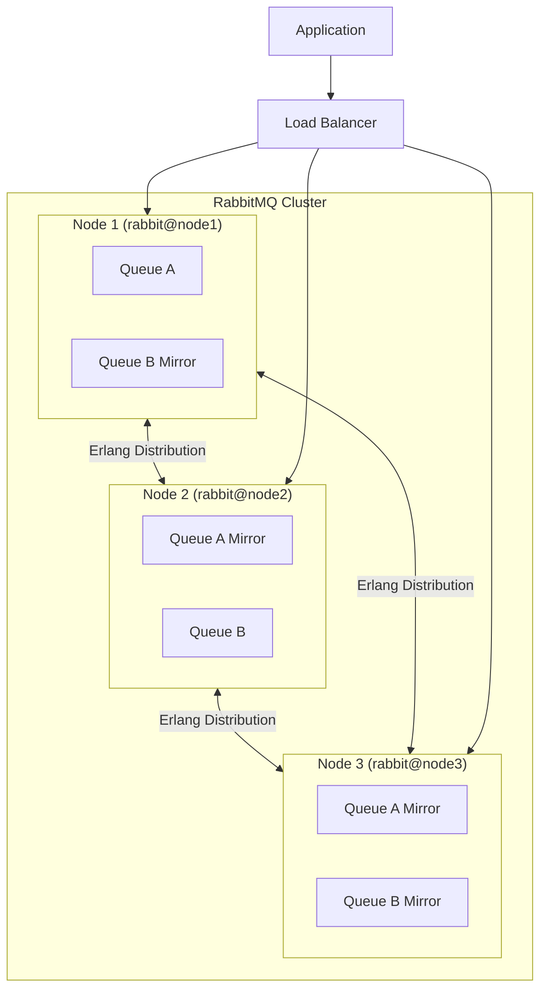
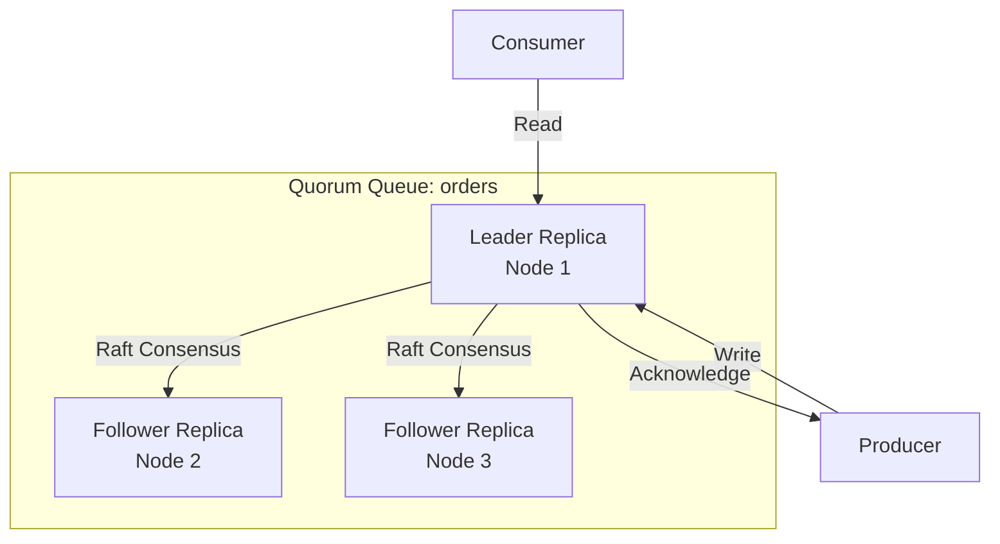

# How to Configure RabbitMQ Clustering

Author: [nawazdhandala](https://www.github.com/nawazdhandala)

Tags: RabbitMQ, Clustering, High Availability, Message Queue, DevOps, Infrastructure, Scalability

Description: Learn how to set up and configure a RabbitMQ cluster for high availability and improved throughput in production environments.

---

RabbitMQ clustering allows you to connect multiple RabbitMQ nodes together to form a single logical broker. This provides high availability, improved throughput, and fault tolerance for your messaging infrastructure.

## Understanding RabbitMQ Clustering

In a RabbitMQ cluster, all nodes share the same virtual hosts, exchanges, users, and permissions. Queues can either be mirrored across nodes or exist on a single node.



## Prerequisites

Before setting up clustering, ensure you have:

- Multiple servers or VMs with RabbitMQ installed
- Network connectivity between all nodes
- Consistent Erlang cookies across all nodes
- Synchronized system clocks (use NTP)

## Step 1: Configure Hostnames

Each node must be able to resolve the hostnames of all other nodes in the cluster.

Edit `/etc/hosts` on each node:

```bash
# /etc/hosts on all nodes
# Add entries for all cluster nodes

192.168.1.10    rabbit1
192.168.1.11    rabbit2
192.168.1.12    rabbit3
```

Verify hostname resolution:

```bash
# Test connectivity from each node to all others
ping -c 3 rabbit1
ping -c 3 rabbit2
ping -c 3 rabbit3
```

## Step 2: Synchronize Erlang Cookies

The Erlang cookie is a shared secret that allows nodes to communicate. All nodes in a cluster must have identical cookies.

```bash
# On the first node, get the cookie value
sudo cat /var/lib/rabbitmq/.erlang.cookie
# Example output: ABCDEFGHIJKLMNOPQRST

# Copy this cookie to all other nodes
# On rabbit2 and rabbit3:
sudo systemctl stop rabbitmq-server
sudo sh -c 'echo "ABCDEFGHIJKLMNOPQRST" > /var/lib/rabbitmq/.erlang.cookie'
sudo chown rabbitmq:rabbitmq /var/lib/rabbitmq/.erlang.cookie
sudo chmod 400 /var/lib/rabbitmq/.erlang.cookie
sudo systemctl start rabbitmq-server
```

## Step 3: Configure RabbitMQ for Clustering

Create or edit the RabbitMQ configuration file on each node.

**rabbitmq.conf** (on each node):

```ini
# /etc/rabbitmq/rabbitmq.conf

# Cluster formation settings
cluster_formation.peer_discovery_backend = rabbit_peer_discovery_classic_config
cluster_formation.classic_config.nodes.1 = rabbit@rabbit1
cluster_formation.classic_config.nodes.2 = rabbit@rabbit2
cluster_formation.classic_config.nodes.3 = rabbit@rabbit3

# Network settings for cluster
listeners.tcp.default = 5672
management.tcp.port = 15672

# Cluster partition handling strategy
# Options: pause_minority, autoheal, ignore
cluster_partition_handling = pause_minority

# Inter-node communication
distribution.listener.port_range.min = 25672
distribution.listener.port_range.max = 25672
```

## Step 4: Join Nodes to the Cluster

Start RabbitMQ on the first node (rabbit1), then join other nodes to it.

**On rabbit1 (first node):**

```bash
# Start RabbitMQ (it will be the seed node)
sudo systemctl start rabbitmq-server

# Enable management plugin
sudo rabbitmq-plugins enable rabbitmq_management

# Verify the node is running
sudo rabbitmqctl status
```

**On rabbit2 and rabbit3 (joining nodes):**

```bash
# Stop the RabbitMQ application (but keep Erlang running)
sudo rabbitmqctl stop_app

# Reset the node to clear any existing state
sudo rabbitmqctl reset

# Join the cluster using rabbit1 as the seed
# The node name format is rabbit@hostname
sudo rabbitmqctl join_cluster rabbit@rabbit1

# Start the RabbitMQ application
sudo rabbitmqctl start_app

# Verify cluster status
sudo rabbitmqctl cluster_status
```

Expected output after successful clustering:

```
Cluster status of node rabbit@rabbit2 ...
Basics

Cluster name: rabbit@rabbit1

Disk Nodes

rabbit@rabbit1
rabbit@rabbit2
rabbit@rabbit3

Running Nodes

rabbit@rabbit1
rabbit@rabbit2
rabbit@rabbit3
```

## Step 5: Configure Queue Mirroring (Classic Mirroring)

For high availability, configure queues to be mirrored across multiple nodes.

```bash
# Create a policy that mirrors all queues to all nodes
sudo rabbitmqctl set_policy ha-all ".*" \
    '{"ha-mode":"all","ha-sync-mode":"automatic"}' \
    --priority 0 \
    --apply-to queues
```

Different mirroring policies:

```bash
# Mirror to exactly 2 nodes (good for 3-node clusters)
sudo rabbitmqctl set_policy ha-two "^ha\." \
    '{"ha-mode":"exactly","ha-params":2,"ha-sync-mode":"automatic"}' \
    --apply-to queues

# Mirror only queues matching a pattern
sudo rabbitmqctl set_policy ha-critical "^critical\." \
    '{"ha-mode":"all","ha-sync-mode":"automatic"}' \
    --apply-to queues
```

## Step 6: Configure Quorum Queues (Recommended)

Quorum queues are the modern replacement for classic mirrored queues, offering better data safety and predictable performance.

```python
import pika

connection = pika.BlockingConnection(
    pika.ConnectionParameters(host='rabbit1')
)
channel = connection.channel()

# Declare a quorum queue for high availability
# Quorum queues replicate data using Raft consensus
channel.queue_declare(
    queue='orders',
    durable=True,
    arguments={
        'x-queue-type': 'quorum',  # This makes it a quorum queue
        'x-quorum-initial-group-size': 3  # Replicate to 3 nodes
    }
)

print("Quorum queue created successfully")
connection.close()
```



## Step 7: Configure Load Balancer

Set up a load balancer to distribute connections across cluster nodes.

**HAProxy Configuration:**

```haproxy
# /etc/haproxy/haproxy.cfg

global
    log /dev/log local0
    maxconn 4096
    user haproxy
    group haproxy
    daemon

defaults
    log     global
    mode    tcp
    option  tcplog
    option  dontlognull
    timeout connect 5s
    timeout client  1h
    timeout server  1h

# RabbitMQ AMQP frontend
frontend rabbitmq_amqp
    bind *:5672
    default_backend rabbitmq_cluster

# RabbitMQ cluster backend
backend rabbitmq_cluster
    balance roundrobin
    option tcp-check

    # Health check using AMQP protocol
    tcp-check connect port 5672

    server rabbit1 192.168.1.10:5672 check inter 5s rise 2 fall 3
    server rabbit2 192.168.1.11:5672 check inter 5s rise 2 fall 3
    server rabbit3 192.168.1.12:5672 check inter 5s rise 2 fall 3

# Management UI frontend
frontend rabbitmq_management
    bind *:15672
    default_backend rabbitmq_management_backend

backend rabbitmq_management_backend
    balance roundrobin
    option httpchk GET /api/health/checks/alarms
    http-check expect status 200

    server rabbit1 192.168.1.10:15672 check inter 10s
    server rabbit2 192.168.1.11:15672 check inter 10s
    server rabbit3 192.168.1.12:15672 check inter 10s

# Stats page for monitoring HAProxy
listen stats
    bind *:8404
    stats enable
    stats uri /stats
    stats refresh 10s
```

## Step 8: Configure Client Connections

Update your application to connect through the load balancer or use multiple hosts.

**Python with Failover:**

```python
import pika

def get_connection():
    """
    Create a connection with automatic failover to cluster nodes.
    If one node fails, try the next one.
    """
    # List of all cluster nodes
    hosts = ['rabbit1', 'rabbit2', 'rabbit3']

    for host in hosts:
        try:
            params = pika.ConnectionParameters(
                host=host,
                port=5672,
                credentials=pika.PlainCredentials('user', 'password'),
                # Connection timeout
                socket_timeout=5,
                # Heartbeat to detect dead connections
                heartbeat=60,
                # Automatic reconnection
                connection_attempts=3,
                retry_delay=2
            )
            connection = pika.BlockingConnection(params)
            print(f"Connected to {host}")
            return connection
        except pika.exceptions.AMQPConnectionError:
            print(f"Failed to connect to {host}, trying next...")
            continue

    raise Exception("Could not connect to any RabbitMQ node")

# Usage
connection = get_connection()
channel = connection.channel()
```

**Node.js with amqplib:**

```javascript
const amqp = require('amqplib');

async function connectToCluster() {
    /**
     * Connect to RabbitMQ cluster with failover support.
     * Tries each node in sequence until successful.
     */
    const hosts = ['rabbit1', 'rabbit2', 'rabbit3'];

    for (const host of hosts) {
        try {
            const connection = await amqp.connect({
                hostname: host,
                port: 5672,
                username: 'user',
                password: 'password',
                heartbeat: 60
            });

            console.log(`Connected to ${host}`);

            // Handle connection errors
            connection.on('error', (err) => {
                console.error('Connection error:', err);
            });

            connection.on('close', () => {
                console.log('Connection closed, reconnecting...');
                setTimeout(connectToCluster, 5000);
            });

            return connection;
        } catch (err) {
            console.log(`Failed to connect to ${host}:`, err.message);
        }
    }

    throw new Error('Could not connect to any RabbitMQ node');
}

// Usage
connectToCluster()
    .then(conn => conn.createChannel())
    .then(channel => {
        // Use the channel
        console.log('Channel created');
    })
    .catch(console.error);
```

## Monitoring the Cluster

### Using rabbitmqctl

```bash
# Check overall cluster status
sudo rabbitmqctl cluster_status

# List all nodes and their types
sudo rabbitmqctl list_nodes

# Check queue distribution across nodes
sudo rabbitmqctl list_queues name node messages

# Check for network partitions
sudo rabbitmqctl eval 'rabbit_mnesia:cluster_status_from_mnesia().'
```

### Using the Management API

```bash
# Get cluster overview
curl -u guest:guest http://localhost:15672/api/overview | jq '.cluster_name'

# Get node health
curl -u guest:guest http://localhost:15672/api/nodes | jq '.[].name'

# Check for alarms
curl -u guest:guest http://localhost:15672/api/health/checks/alarms
```

## Cluster Architecture Diagram

```mermaid
flowchart TB
    subgraph Internet
        Client1[App Server 1]
        Client2[App Server 2]
    end

    subgraph LoadBalancer["Load Balancer Layer"]
        HAProxy[HAProxy / NGINX]
    end

    subgraph RabbitMQ_Cluster["RabbitMQ Cluster"]
        subgraph DC1["Data Center 1"]
            R1[rabbit@node1<br/>Disk Node]
        end

        subgraph DC2["Data Center 2"]
            R2[rabbit@node2<br/>Disk Node]
        end

        subgraph DC3["Data Center 3"]
            R3[rabbit@node3<br/>Disk Node]
        end

        R1 <--> R2
        R2 <--> R3
        R1 <--> R3
    end

    Client1 --> HAProxy
    Client2 --> HAProxy
    HAProxy --> R1
    HAProxy --> R2
    HAProxy --> R3
```

## Handling Network Partitions

Network partitions occur when cluster nodes lose connectivity with each other. Configure how RabbitMQ handles this:

```ini
# rabbitmq.conf

# pause_minority: Nodes in the minority partition pause
# This is the safest option for most deployments
cluster_partition_handling = pause_minority

# autoheal: Automatically pick a winning partition and restart losers
# Use when availability is more important than consistency
# cluster_partition_handling = autoheal

# ignore: Do nothing (not recommended for production)
# cluster_partition_handling = ignore
```

## Best Practices

1. **Use an odd number of nodes** - Typically 3 or 5 nodes for proper quorum
2. **Place nodes in different availability zones** - Protect against zone failures
3. **Use quorum queues** - They are more reliable than classic mirrored queues
4. **Configure proper monitoring** - Alert on cluster health and partitions
5. **Test failover regularly** - Verify your cluster handles node failures correctly
6. **Keep Erlang and RabbitMQ versions synchronized** - All nodes must run the same version

```bash
# Verify all nodes run the same version
sudo rabbitmqctl status | grep "RabbitMQ version"

# On each node, should show the same version
# RabbitMQ version: 3.12.x
```

---

RabbitMQ clustering provides the foundation for a highly available messaging system. Start with three nodes, use quorum queues for important data, configure proper failover in your applications, and monitor cluster health continuously. With this setup, your messaging infrastructure can survive node failures without losing messages or impacting application performance.
