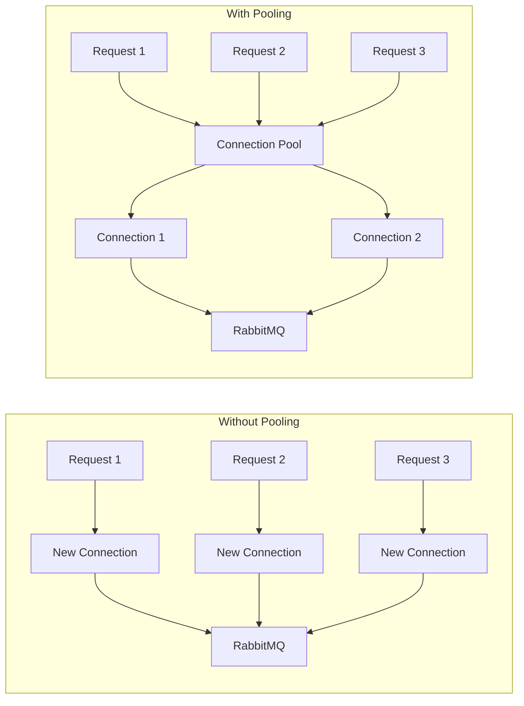
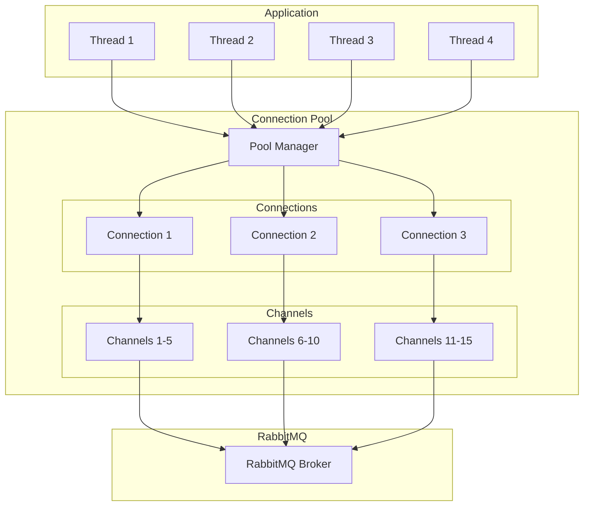

# How to Handle RabbitMQ Connection Pooling

Author: [nawazdhandala](https://www.github.com/nawazdhandala)

Tags: RabbitMQ, Connection Pooling, Performance, Message Queue, Backend, Python, Node.js, Scalability

Description: Learn how to implement efficient connection pooling for RabbitMQ to improve performance and resource management in high-throughput applications.

---

Creating a new RabbitMQ connection for every message is expensive and slow. Connection pooling allows you to reuse connections across multiple operations, dramatically improving throughput and reducing latency in high-volume applications.

## Why Connection Pooling Matters

Each RabbitMQ connection involves:
- TCP handshake
- TLS negotiation (if enabled)
- AMQP protocol handshake
- Authentication
- Channel creation

This overhead can take 50-100ms per connection. With pooling, you pay this cost once and reuse connections thousands of times.



## Python Connection Pool Implementation

### Basic Connection Pool with Pika

```python
import pika
import threading
from queue import Queue, Empty
from contextlib import contextmanager

class RabbitMQConnectionPool:
    """
    A thread-safe connection pool for RabbitMQ.
    Manages a fixed number of connections that can be reused.
    """

    def __init__(self, host='localhost', port=5672,
                 username='guest', password='guest',
                 virtual_host='/', pool_size=10):
        """
        Initialize the connection pool.

        Args:
            host: RabbitMQ server hostname
            port: RabbitMQ server port
            username: Authentication username
            password: Authentication password
            virtual_host: RabbitMQ virtual host
            pool_size: Number of connections to maintain
        """
        self.parameters = pika.ConnectionParameters(
            host=host,
            port=port,
            virtual_host=virtual_host,
            credentials=pika.PlainCredentials(username, password),
            heartbeat=600,  # Keep connections alive
            blocked_connection_timeout=300
        )
        self.pool_size = pool_size
        self._pool = Queue(maxsize=pool_size)
        self._lock = threading.Lock()
        self._created = 0

        # Pre-populate the pool
        self._initialize_pool()

    def _initialize_pool(self):
        """Create initial connections to fill the pool."""
        for _ in range(self.pool_size):
            self._add_connection()

    def _create_connection(self):
        """Create a new RabbitMQ connection."""
        return pika.BlockingConnection(self.parameters)

    def _add_connection(self):
        """Add a new connection to the pool."""
        with self._lock:
            if self._created < self.pool_size:
                conn = self._create_connection()
                self._pool.put(conn)
                self._created += 1

    def get_connection(self, timeout=30):
        """
        Get a connection from the pool.

        Args:
            timeout: Maximum seconds to wait for a connection

        Returns:
            A RabbitMQ connection object

        Raises:
            Empty: If no connection available within timeout
        """
        try:
            conn = self._pool.get(timeout=timeout)

            # Verify connection is still valid
            if conn.is_closed:
                conn = self._create_connection()

            return conn
        except Empty:
            raise Exception("Connection pool exhausted")

    def return_connection(self, connection):
        """
        Return a connection to the pool.

        Args:
            connection: The connection to return
        """
        if connection.is_closed:
            # Replace dead connection with a new one
            connection = self._create_connection()

        try:
            self._pool.put_nowait(connection)
        except:
            # Pool is full, close the connection
            connection.close()

    @contextmanager
    def acquire(self):
        """
        Context manager for safely acquiring and releasing connections.

        Usage:
            with pool.acquire() as connection:
                channel = connection.channel()
                channel.basic_publish(...)
        """
        connection = self.get_connection()
        try:
            yield connection
        finally:
            self.return_connection(connection)

    def close_all(self):
        """Close all connections in the pool."""
        while not self._pool.empty():
            try:
                conn = self._pool.get_nowait()
                if not conn.is_closed:
                    conn.close()
            except Empty:
                break


# Usage example
pool = RabbitMQConnectionPool(
    host='localhost',
    pool_size=5
)

# Using the context manager (recommended)
with pool.acquire() as connection:
    channel = connection.channel()
    channel.queue_declare(queue='tasks', durable=True)
    channel.basic_publish(
        exchange='',
        routing_key='tasks',
        body='Hello World!',
        properties=pika.BasicProperties(delivery_mode=2)
    )
    print("Message sent")

# Clean up when done
pool.close_all()
```

### Channel Pool (More Efficient)

For even better performance, pool channels instead of connections. A single connection can support multiple channels.

```python
import pika
import threading
from queue import Queue, Empty
from contextlib import contextmanager

class RabbitMQChannelPool:
    """
    A channel pool that uses a single connection with multiple channels.
    More efficient than connection pooling for most use cases.
    """

    def __init__(self, host='localhost', port=5672,
                 username='guest', password='guest',
                 virtual_host='/', channel_count=20):
        """
        Initialize the channel pool.

        Args:
            channel_count: Number of channels to create
        """
        self.parameters = pika.ConnectionParameters(
            host=host,
            port=port,
            virtual_host=virtual_host,
            credentials=pika.PlainCredentials(username, password),
            heartbeat=600
        )
        self.channel_count = channel_count
        self._connection = None
        self._pool = Queue(maxsize=channel_count)
        self._lock = threading.Lock()

        self._initialize()

    def _initialize(self):
        """Create connection and channels."""
        self._connection = pika.BlockingConnection(self.parameters)

        for _ in range(self.channel_count):
            channel = self._connection.channel()
            self._pool.put(channel)

    def _create_channel(self):
        """Create a new channel on the existing connection."""
        if self._connection.is_closed:
            self._connection = pika.BlockingConnection(self.parameters)
        return self._connection.channel()

    def get_channel(self, timeout=30):
        """Get a channel from the pool."""
        try:
            channel = self._pool.get(timeout=timeout)

            # Verify channel is still open
            if channel.is_closed:
                channel = self._create_channel()

            return channel
        except Empty:
            raise Exception("Channel pool exhausted")

    def return_channel(self, channel):
        """Return a channel to the pool."""
        if channel.is_closed:
            channel = self._create_channel()

        try:
            self._pool.put_nowait(channel)
        except:
            channel.close()

    @contextmanager
    def acquire(self):
        """Context manager for channel acquisition."""
        channel = self.get_channel()
        try:
            yield channel
        finally:
            self.return_channel(channel)

    def close(self):
        """Close all channels and the connection."""
        while not self._pool.empty():
            try:
                channel = self._pool.get_nowait()
                if channel.is_open:
                    channel.close()
            except Empty:
                break

        if self._connection and not self._connection.is_closed:
            self._connection.close()


# Usage
channel_pool = RabbitMQChannelPool(
    host='localhost',
    channel_count=10
)

# Publish multiple messages efficiently
for i in range(100):
    with channel_pool.acquire() as channel:
        channel.basic_publish(
            exchange='',
            routing_key='tasks',
            body=f'Message {i}'
        )

channel_pool.close()
```

## Node.js Connection Pool Implementation

### Using amqplib with Generic Pool

```javascript
const amqp = require('amqplib');
const genericPool = require('generic-pool');

/**
 * Create a connection pool for RabbitMQ.
 * Uses generic-pool for connection lifecycle management.
 */
function createConnectionPool(config) {
    const factory = {
        // Called when pool needs a new connection
        create: async () => {
            const connection = await amqp.connect({
                hostname: config.host || 'localhost',
                port: config.port || 5672,
                username: config.username || 'guest',
                password: config.password || 'guest',
                vhost: config.vhost || '/',
                heartbeat: 60
            });

            // Handle connection errors
            connection.on('error', (err) => {
                console.error('Connection error:', err.message);
            });

            connection.on('close', () => {
                console.log('Connection closed');
            });

            return connection;
        },

        // Called when connection is returned to pool
        destroy: async (connection) => {
            try {
                await connection.close();
            } catch (err) {
                // Connection may already be closed
            }
        },

        // Validate connection before lending
        validate: async (connection) => {
            return connection && !connection.closed;
        }
    };

    const opts = {
        max: config.poolSize || 10,    // Maximum connections
        min: config.minSize || 2,      // Minimum connections
        acquireTimeoutMillis: 30000,   // Timeout for getting connection
        idleTimeoutMillis: 30000,      // Close idle connections after this
        evictionRunIntervalMillis: 10000,  // Check for idle connections
        testOnBorrow: true             // Validate before lending
    };

    return genericPool.createPool(factory, opts);
}

/**
 * Create a channel pool on top of connection pool.
 * Channels are lighter weight than connections.
 */
class RabbitMQChannelPool {
    constructor(config) {
        this.connectionPool = createConnectionPool(config);
        this.channelPool = new Map();  // Track channels per connection
    }

    async getChannel() {
        const connection = await this.connectionPool.acquire();
        const channel = await connection.createChannel();

        // Store reference for cleanup
        this.channelPool.set(channel, connection);

        return channel;
    }

    async releaseChannel(channel) {
        const connection = this.channelPool.get(channel);

        if (connection) {
            try {
                await channel.close();
            } catch (err) {
                // Channel may already be closed
            }

            this.channelPool.delete(channel);
            await this.connectionPool.release(connection);
        }
    }

    async withChannel(callback) {
        const channel = await this.getChannel();
        try {
            return await callback(channel);
        } finally {
            await this.releaseChannel(channel);
        }
    }

    async close() {
        await this.connectionPool.drain();
        await this.connectionPool.clear();
    }
}

// Usage example
async function main() {
    const pool = new RabbitMQChannelPool({
        host: 'localhost',
        poolSize: 5
    });

    // Using withChannel for automatic cleanup
    await pool.withChannel(async (channel) => {
        await channel.assertQueue('tasks', { durable: true });

        for (let i = 0; i < 100; i++) {
            channel.sendToQueue('tasks', Buffer.from(`Message ${i}`), {
                persistent: true
            });
        }

        console.log('Messages sent');
    });

    await pool.close();
}

main().catch(console.error);
```

### Connection Pool with Confirm Channels

```javascript
const amqp = require('amqplib');

/**
 * Pool that uses confirm channels for guaranteed delivery.
 */
class ConfirmChannelPool {
    constructor(config) {
        this.config = {
            host: config.host || 'localhost',
            port: config.port || 5672,
            username: config.username || 'guest',
            password: config.password || 'guest',
            vhost: config.vhost || '/',
            channelCount: config.channelCount || 10
        };

        this.connection = null;
        this.channels = [];
        this.currentIndex = 0;
        this.initialized = false;
    }

    async initialize() {
        // Create single connection
        this.connection = await amqp.connect({
            hostname: this.config.host,
            port: this.config.port,
            username: this.config.username,
            password: this.config.password,
            vhost: this.config.vhost
        });

        // Create confirm channels
        // Confirm channels wait for broker acknowledgment
        for (let i = 0; i < this.config.channelCount; i++) {
            const channel = await this.connection.createConfirmChannel();
            this.channels.push(channel);
        }

        this.initialized = true;
        console.log(`Initialized ${this.config.channelCount} confirm channels`);
    }

    getChannel() {
        if (!this.initialized) {
            throw new Error('Pool not initialized');
        }

        // Round-robin channel selection
        const channel = this.channels[this.currentIndex];
        this.currentIndex = (this.currentIndex + 1) % this.channels.length;
        return channel;
    }

    async publish(exchange, routingKey, content, options = {}) {
        const channel = this.getChannel();

        return new Promise((resolve, reject) => {
            channel.publish(
                exchange,
                routingKey,
                Buffer.from(content),
                { persistent: true, ...options },
                (err) => {
                    if (err) {
                        reject(err);
                    } else {
                        resolve();
                    }
                }
            );
        });
    }

    async close() {
        for (const channel of this.channels) {
            await channel.close();
        }
        await this.connection.close();
    }
}

// Usage
async function publishMessages() {
    const pool = new ConfirmChannelPool({
        host: 'localhost',
        channelCount: 5
    });

    await pool.initialize();

    // Declare exchange
    const channel = pool.getChannel();
    await channel.assertExchange('events', 'topic', { durable: true });

    // Publish with guaranteed delivery
    const promises = [];
    for (let i = 0; i < 1000; i++) {
        promises.push(
            pool.publish('events', 'order.created', JSON.stringify({
                orderId: i,
                timestamp: Date.now()
            }))
        );
    }

    await Promise.all(promises);
    console.log('All messages confirmed by broker');

    await pool.close();
}

publishMessages().catch(console.error);
```

## Pool Architecture



## Best Practices

### 1. Size Your Pool Appropriately

```python
# Formula for pool size:
# connections = (application_threads / channels_per_connection) + buffer

# Example: 50 threads, 10 channels per connection, 20% buffer
pool_size = int((50 / 10) * 1.2)  # = 6 connections

pool = RabbitMQConnectionPool(
    host='localhost',
    pool_size=pool_size
)
```

### 2. Handle Connection Failures Gracefully

```python
import pika
from tenacity import retry, stop_after_attempt, wait_exponential

class ResilientConnectionPool(RabbitMQConnectionPool):
    """
    Connection pool with automatic retry on failures.
    """

    @retry(
        stop=stop_after_attempt(3),
        wait=wait_exponential(multiplier=1, min=1, max=10)
    )
    def _create_connection(self):
        """Create connection with retry logic."""
        try:
            return pika.BlockingConnection(self.parameters)
        except pika.exceptions.AMQPConnectionError as e:
            print(f"Connection failed, retrying: {e}")
            raise

    def get_connection(self, timeout=30):
        """Get connection with automatic recovery."""
        try:
            conn = self._pool.get(timeout=timeout)

            if conn.is_closed:
                # Connection died, create new one
                conn = self._create_connection()

            return conn
        except Exception as e:
            print(f"Pool error: {e}")
            # Create new connection as fallback
            return self._create_connection()
```

### 3. Monitor Pool Health

```python
class MonitoredConnectionPool(RabbitMQConnectionPool):
    """
    Connection pool with health metrics.
    """

    def __init__(self, *args, **kwargs):
        super().__init__(*args, **kwargs)
        self.metrics = {
            'connections_created': 0,
            'connections_acquired': 0,
            'connections_released': 0,
            'acquire_timeouts': 0,
            'dead_connections': 0
        }

    def get_connection(self, timeout=30):
        try:
            conn = super().get_connection(timeout)
            self.metrics['connections_acquired'] += 1

            if conn.is_closed:
                self.metrics['dead_connections'] += 1

            return conn
        except Exception:
            self.metrics['acquire_timeouts'] += 1
            raise

    def return_connection(self, connection):
        super().return_connection(connection)
        self.metrics['connections_released'] += 1

    def get_stats(self):
        """Return current pool statistics."""
        return {
            **self.metrics,
            'pool_size': self.pool_size,
            'available': self._pool.qsize(),
            'in_use': self._created - self._pool.qsize()
        }


# Usage with monitoring
pool = MonitoredConnectionPool(host='localhost', pool_size=10)

# Periodically log stats
import time
while True:
    stats = pool.get_stats()
    print(f"Pool stats: {stats}")
    time.sleep(60)
```

### 4. Use Connection Per Thread in Multi-threaded Apps

```python
import threading

class ThreadLocalConnectionPool:
    """
    Provides thread-local connections for multi-threaded applications.
    Each thread gets its own connection from the pool.
    """

    def __init__(self, pool):
        self.pool = pool
        self._local = threading.local()

    def get_connection(self):
        """Get or create thread-local connection."""
        if not hasattr(self._local, 'connection') or \
           self._local.connection is None or \
           self._local.connection.is_closed:
            self._local.connection = self.pool.get_connection()
        return self._local.connection

    def release(self):
        """Release thread's connection back to pool."""
        if hasattr(self._local, 'connection') and self._local.connection:
            self.pool.return_connection(self._local.connection)
            self._local.connection = None


# Usage
pool = RabbitMQConnectionPool(host='localhost', pool_size=20)
thread_pool = ThreadLocalConnectionPool(pool)

def worker():
    """Worker function that uses thread-local connection."""
    conn = thread_pool.get_connection()
    channel = conn.channel()

    for i in range(100):
        channel.basic_publish(
            exchange='',
            routing_key='tasks',
            body=f'Task from {threading.current_thread().name}'
        )

    thread_pool.release()

# Spawn multiple threads
threads = [threading.Thread(target=worker) for _ in range(10)]
for t in threads:
    t.start()
for t in threads:
    t.join()
```

---

Connection pooling is essential for any RabbitMQ application that handles more than a few messages per second. Start with a channel pool if you have a single-threaded application, or use a full connection pool for multi-threaded scenarios. Monitor your pool metrics to right-size the pool for your workload, and always implement retry logic to handle transient failures gracefully.
