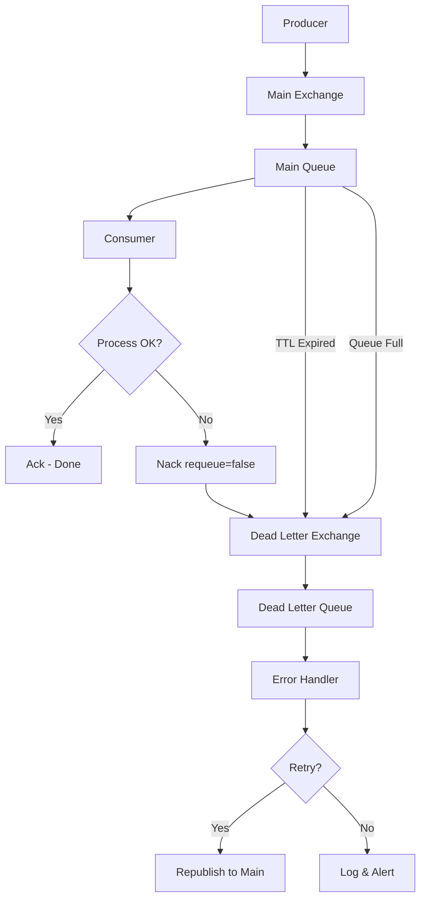
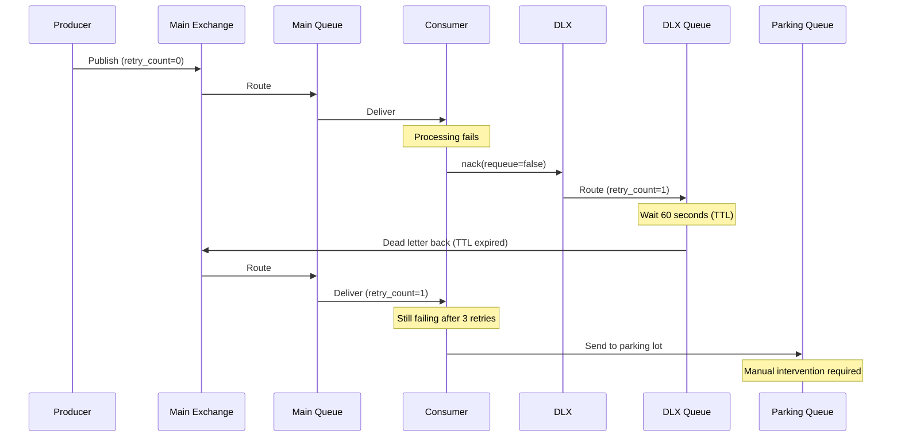
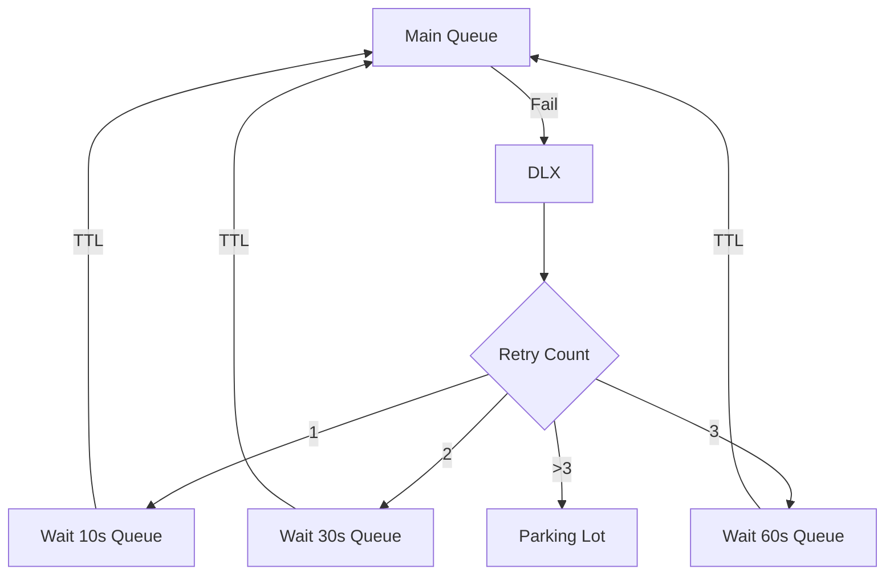

# How to Configure RabbitMQ Dead Letter Exchanges

Author: [nawazdhandala](https://www.github.com/nawazdhandala)

Tags: RabbitMQ, Messaging, Error Handling, Reliability, Backend

Description: Learn how to configure dead letter exchanges in RabbitMQ to handle failed messages, implement retry patterns, and prevent message loss.

---

Dead Letter Exchanges (DLX) are a powerful RabbitMQ feature that routes messages that cannot be processed to a separate exchange. This allows you to handle failures gracefully, implement retry patterns, and ensure no message is ever lost.

## What Are Dead Letter Exchanges?

A message becomes "dead lettered" when:

1. The message is rejected (basic.reject or basic.nack) with requeue=false
2. The message TTL expires
3. The queue length limit is exceeded



## Basic DLX Configuration

### Step 1: Create the Dead Letter Exchange and Queue

```python
import pika

connection = pika.BlockingConnection(pika.ConnectionParameters('localhost'))
channel = connection.channel()

# Step 1: Declare the Dead Letter Exchange (DLX)
# This exchange receives all dead-lettered messages
channel.exchange_declare(
    exchange='dlx.exchange',
    exchange_type='direct',  # direct routing based on routing key
    durable=True
)

# Step 2: Declare the Dead Letter Queue
# This queue stores messages that couldn't be processed
channel.queue_declare(
    queue='dlx.queue',
    durable=True
)

# Step 3: Bind DLX queue to DLX exchange
# The routing key should match what the main queue was using
channel.queue_bind(
    exchange='dlx.exchange',
    queue='dlx.queue',
    routing_key='orders'  # Same routing key as original messages
)

print("Dead Letter Exchange and Queue created")
```

### Step 2: Configure the Main Queue with DLX

```python
# Declare the main queue with DLX configuration
# Messages that are rejected, expire, or overflow go to the DLX
channel.queue_declare(
    queue='orders.queue',
    durable=True,
    arguments={
        # Specify the dead letter exchange
        'x-dead-letter-exchange': 'dlx.exchange',
        # Optional: Override routing key for dead lettered messages
        'x-dead-letter-routing-key': 'orders',
        # Optional: Message TTL in milliseconds (5 minutes)
        'x-message-ttl': 300000,
        # Optional: Maximum queue length
        'x-max-length': 10000
    }
)

print("Main queue configured with DLX")
```

## Complete Working Example

```python
import pika
import json
import time

class DeadLetterSetup:
    """
    Complete setup for a queue with dead letter handling.
    Includes main queue, DLX, and retry mechanism.
    """

    def __init__(self, host='localhost'):
        self.connection = pika.BlockingConnection(
            pika.ConnectionParameters(host)
        )
        self.channel = self.connection.channel()

    def setup_exchanges_and_queues(self):
        """Set up all required exchanges and queues."""

        # Main exchange for normal message flow
        self.channel.exchange_declare(
            exchange='main.exchange',
            exchange_type='direct',
            durable=True
        )

        # Dead letter exchange for failed messages
        self.channel.exchange_declare(
            exchange='dlx.exchange',
            exchange_type='direct',
            durable=True
        )

        # Parking lot exchange for permanently failed messages
        self.channel.exchange_declare(
            exchange='parking.exchange',
            exchange_type='fanout',
            durable=True
        )

        # Dead letter queue - holds failed messages temporarily
        self.channel.queue_declare(
            queue='dlx.queue',
            durable=True,
            arguments={
                # After 60 seconds, messages go back to main exchange for retry
                'x-message-ttl': 60000,
                'x-dead-letter-exchange': 'main.exchange'
            }
        )

        # Main processing queue
        self.channel.queue_declare(
            queue='orders.queue',
            durable=True,
            arguments={
                'x-dead-letter-exchange': 'dlx.exchange',
                'x-dead-letter-routing-key': 'orders.failed'
            }
        )

        # Parking lot queue - for messages that fail too many times
        self.channel.queue_declare(
            queue='parking.queue',
            durable=True
        )

        # Bind queues to exchanges
        self.channel.queue_bind(
            exchange='main.exchange',
            queue='orders.queue',
            routing_key='orders'
        )

        self.channel.queue_bind(
            exchange='dlx.exchange',
            queue='dlx.queue',
            routing_key='orders.failed'
        )

        self.channel.queue_bind(
            exchange='parking.exchange',
            queue='parking.queue'
        )

        print("All exchanges and queues configured")

    def close(self):
        self.connection.close()

# Run setup
setup = DeadLetterSetup()
setup.setup_exchanges_and_queues()
setup.close()
```

## Message Flow with Retry Pattern



## Consumer with Retry Logic

```python
import pika
import json

MAX_RETRIES = 3

def get_retry_count(properties):
    """
    Extract retry count from message headers.
    RabbitMQ adds x-death header when dead-lettering.
    """
    if properties.headers and 'x-death' in properties.headers:
        # x-death is a list of death records
        # Each time a message is dead-lettered, a record is added
        deaths = properties.headers['x-death']
        # Count total times the message was dead-lettered
        return sum(d.get('count', 0) for d in deaths)
    return 0

def process_order(body):
    """
    Process an order. Raises exception on failure.
    """
    order = json.loads(body)
    print(f"Processing order: {order['id']}")

    # Simulate random failures
    if order.get('fail', False):
        raise ValueError(f"Order {order['id']} processing failed")

    return True

def callback(ch, method, properties, body):
    """
    Message handler with retry logic.
    """
    retry_count = get_retry_count(properties)
    print(f"Received message (retry #{retry_count})")

    try:
        process_order(body)
        # Success - acknowledge the message
        ch.basic_ack(delivery_tag=method.delivery_tag)
        print("Order processed successfully")

    except Exception as e:
        print(f"Processing failed: {e}")

        if retry_count >= MAX_RETRIES:
            # Too many retries - send to parking lot
            print(f"Max retries exceeded, sending to parking lot")
            ch.basic_publish(
                exchange='parking.exchange',
                routing_key='',
                body=body,
                properties=pika.BasicProperties(
                    delivery_mode=2,
                    headers={
                        'original-routing-key': method.routing_key,
                        'failure-reason': str(e),
                        'retry-count': retry_count
                    }
                )
            )
            # Acknowledge original message (we've handled it)
            ch.basic_ack(delivery_tag=method.delivery_tag)
        else:
            # Reject without requeue - goes to DLX for retry
            # requeue=False is crucial - it triggers dead-lettering
            ch.basic_nack(delivery_tag=method.delivery_tag, requeue=False)
            print(f"Message sent to DLX for retry")

# Set up consumer
connection = pika.BlockingConnection(pika.ConnectionParameters('localhost'))
channel = connection.channel()

# Prefetch 1 message at a time
channel.basic_qos(prefetch_count=1)

channel.basic_consume(
    queue='orders.queue',
    on_message_callback=callback,
    auto_ack=False
)

print('Waiting for messages...')
channel.start_consuming()
```

## Node.js Implementation

```javascript
const amqp = require('amqplib');

const MAX_RETRIES = 3;

async function setupDeadLetterQueues() {
    const connection = await amqp.connect('amqp://localhost');
    const channel = await connection.createChannel();

    // Dead Letter Exchange
    await channel.assertExchange('dlx.exchange', 'direct', { durable: true });

    // Main Exchange
    await channel.assertExchange('main.exchange', 'direct', { durable: true });

    // DLX Queue with TTL for automatic retry
    await channel.assertQueue('dlx.queue', {
        durable: true,
        arguments: {
            'x-message-ttl': 60000,  // Retry after 60 seconds
            'x-dead-letter-exchange': 'main.exchange'
        }
    });

    // Main Queue with DLX
    await channel.assertQueue('orders.queue', {
        durable: true,
        arguments: {
            'x-dead-letter-exchange': 'dlx.exchange',
            'x-dead-letter-routing-key': 'orders.failed'
        }
    });

    // Parking lot for permanent failures
    await channel.assertQueue('parking.queue', { durable: true });

    // Bindings
    await channel.bindQueue('orders.queue', 'main.exchange', 'orders');
    await channel.bindQueue('dlx.queue', 'dlx.exchange', 'orders.failed');

    console.log('Dead letter setup complete');
    return { connection, channel };
}

function getRetryCount(msg) {
    // Extract retry count from x-death header
    const deaths = msg.properties.headers?.['x-death'] || [];
    return deaths.reduce((sum, d) => sum + (d.count || 0), 0);
}

async function startConsumer() {
    const { connection, channel } = await setupDeadLetterQueues();

    await channel.prefetch(1);

    channel.consume('orders.queue', async (msg) => {
        if (!msg) return;

        const retryCount = getRetryCount(msg);
        const content = JSON.parse(msg.content.toString());

        console.log(`Processing order ${content.id} (retry #${retryCount})`);

        try {
            // Simulate processing
            if (content.fail) {
                throw new Error('Simulated failure');
            }

            // Success
            channel.ack(msg);
            console.log('Order processed successfully');

        } catch (error) {
            console.error(`Processing failed: ${error.message}`);

            if (retryCount >= MAX_RETRIES) {
                // Send to parking lot
                channel.sendToQueue('parking.queue', msg.content, {
                    persistent: true,
                    headers: {
                        'original-routing-key': msg.fields.routingKey,
                        'failure-reason': error.message,
                        'retry-count': retryCount
                    }
                });
                channel.ack(msg);
                console.log('Sent to parking lot');
            } else {
                // Reject to trigger dead-lettering
                channel.nack(msg, false, false);
                console.log('Sent to DLX for retry');
            }
        }
    }, { noAck: false });

    console.log('Consumer started');
}

startConsumer().catch(console.error);
```

## Advanced: Delayed Retry with Exponential Backoff



```python
import pika

def setup_exponential_backoff():
    """
    Set up queues for exponential backoff retry pattern.
    Each retry level has a different delay.
    """
    connection = pika.BlockingConnection(pika.ConnectionParameters('localhost'))
    channel = connection.channel()

    # Main exchange
    channel.exchange_declare(exchange='main', exchange_type='direct', durable=True)

    # Retry exchange
    channel.exchange_declare(exchange='retry', exchange_type='direct', durable=True)

    # Retry delays in milliseconds
    retry_delays = {
        1: 10000,   # 10 seconds
        2: 30000,   # 30 seconds
        3: 60000,   # 1 minute
        4: 300000,  # 5 minutes
        5: 900000   # 15 minutes
    }

    # Create retry queues with different TTLs
    for level, delay in retry_delays.items():
        queue_name = f'retry.level.{level}'

        channel.queue_declare(
            queue=queue_name,
            durable=True,
            arguments={
                'x-message-ttl': delay,
                'x-dead-letter-exchange': 'main',
                'x-dead-letter-routing-key': 'orders'
            }
        )

        channel.queue_bind(
            exchange='retry',
            queue=queue_name,
            routing_key=f'retry.{level}'
        )

    # Main processing queue
    channel.queue_declare(
        queue='orders',
        durable=True,
        arguments={
            'x-dead-letter-exchange': 'retry',
            'x-dead-letter-routing-key': 'retry.1'
        }
    )

    channel.queue_bind(exchange='main', queue='orders', routing_key='orders')

    # Parking lot for permanent failures
    channel.queue_declare(queue='parking', durable=True)

    print("Exponential backoff queues configured")
    connection.close()

setup_exponential_backoff()
```

## Monitoring Dead Letter Queues

```bash
#!/bin/bash
# Monitor DLX queues for accumulating messages

# Check dead letter queue depth
dlx_count=$(rabbitmqctl list_queues name messages | grep dlx.queue | awk '{print $2}')

if [ "$dlx_count" -gt 100 ]; then
    echo "ALERT: DLX queue has $dlx_count messages"
    # Send alert
fi

# Check parking lot
parking_count=$(rabbitmqctl list_queues name messages | grep parking.queue | awk '{print $2}')

if [ "$parking_count" -gt 0 ]; then
    echo "WARNING: Parking lot has $parking_count messages requiring attention"
fi
```

## DLX Configuration Summary

| Argument | Purpose | Example |
|----------|---------|---------|
| x-dead-letter-exchange | Target exchange for dead letters | 'dlx.exchange' |
| x-dead-letter-routing-key | Override routing key | 'failed.orders' |
| x-message-ttl | Message expiration (ms) | 300000 (5 min) |
| x-max-length | Queue length limit | 10000 |
| x-max-length-bytes | Queue size limit | 104857600 (100MB) |
| x-overflow | Behavior when full | 'reject-publish' or 'drop-head' |

---

Dead Letter Exchanges are essential for building resilient message-driven applications. They ensure that failed messages are not lost and provide a mechanism for implementing retry patterns. Combine DLX with monitoring and alerting to catch issues before they become problems, and always have a parking lot queue for messages that fail permanently.
