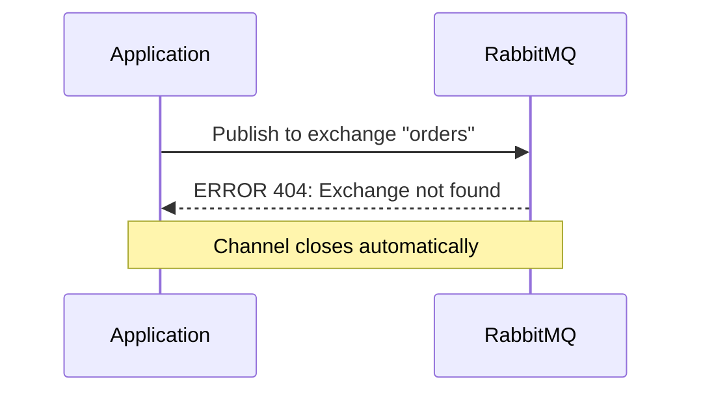
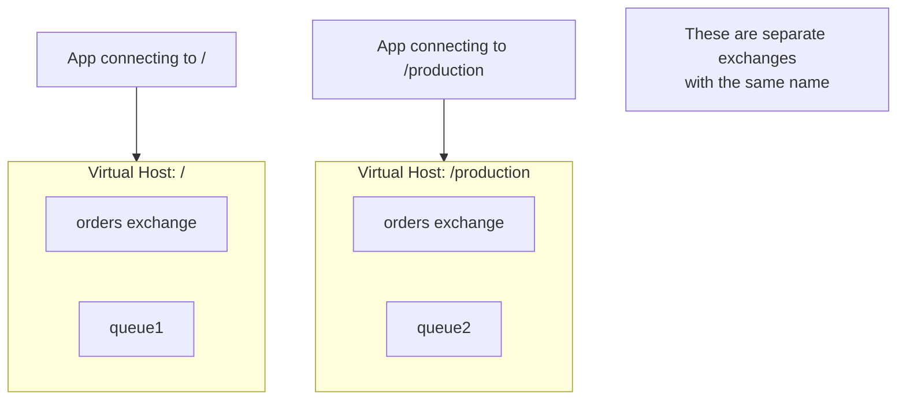
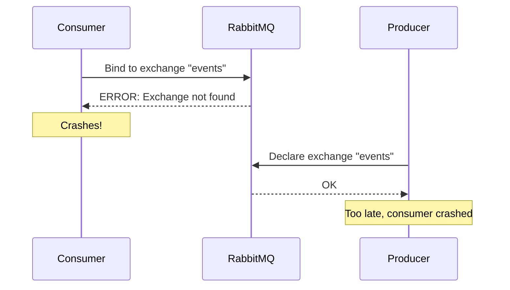
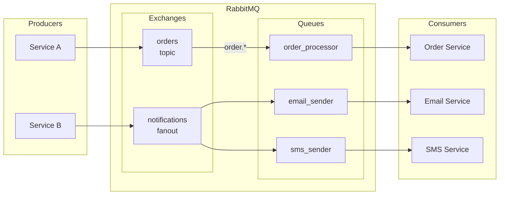

# How to Fix "Exchange Not Found" Errors in RabbitMQ

Author: [nawazdhandala](https://www.github.com/nawazdhandala)

Tags: RabbitMQ, Message Queue, Troubleshooting, Debugging, Backend, DevOps, Messaging

Description: Learn how to diagnose and fix the common "NOT_FOUND - no exchange" error in RabbitMQ with practical examples and prevention strategies.

---

The "Exchange Not Found" error in RabbitMQ occurs when a producer or consumer tries to use an exchange that does not exist. This is one of the most common errors when working with RabbitMQ and usually indicates a configuration mismatch or startup order issue.

## Understanding the Error

When you see an error like this:

```
Channel.close(404, "NOT_FOUND - no exchange 'orders' in vhost '/'")
```

It means your application tried to publish to or bind to an exchange named `orders` that has not been declared on the RabbitMQ server.



## Common Causes and Solutions

### 1. Exchange Was Never Declared

The most common cause is simply forgetting to declare the exchange before using it.

**Problem:**

```python
import pika

connection = pika.BlockingConnection(
    pika.ConnectionParameters(host='localhost')
)
channel = connection.channel()

# This will fail if 'orders' exchange does not exist
channel.basic_publish(
    exchange='orders',
    routing_key='new.order',
    body='{"order_id": 123}'
)
```

**Solution:**

Always declare the exchange before publishing:

```python
import pika

connection = pika.BlockingConnection(
    pika.ConnectionParameters(host='localhost')
)
channel = connection.channel()

# Declare the exchange first
# exchange_type can be: direct, fanout, topic, or headers
channel.exchange_declare(
    exchange='orders',
    exchange_type='topic',  # Choose appropriate type
    durable=True  # Survive broker restarts
)

# Now publish safely
channel.basic_publish(
    exchange='orders',
    routing_key='new.order',
    body='{"order_id": 123}'
)

print("Message published successfully")
connection.close()
```

### 2. Exchange Name Typo

A simple typo can cause hours of debugging.

**Problem:**

```python
# Producer declares this
channel.exchange_declare(exchange='order_events', exchange_type='topic')

# Consumer tries to bind to this (typo!)
channel.queue_bind(queue='processor', exchange='orders_events', routing_key='#')
```

**Solution:**

Use constants or configuration to ensure consistency:

```python
# config.py - Single source of truth for exchange names
class Exchanges:
    ORDERS = 'order_events'
    PAYMENTS = 'payment_events'
    NOTIFICATIONS = 'notification_events'

# producer.py
from config import Exchanges

channel.exchange_declare(
    exchange=Exchanges.ORDERS,
    exchange_type='topic',
    durable=True
)

# consumer.py
from config import Exchanges

channel.queue_bind(
    queue='processor',
    exchange=Exchanges.ORDERS,  # Same constant, no typos
    routing_key='#'
)
```

### 3. Wrong Virtual Host

RabbitMQ exchanges are scoped to virtual hosts. An exchange in one vhost is not visible in another.

**Problem:**

```python
# Producer connects to default vhost
producer_conn = pika.BlockingConnection(
    pika.ConnectionParameters(host='localhost')  # vhost='/' (default)
)

# Consumer connects to different vhost
consumer_conn = pika.BlockingConnection(
    pika.ConnectionParameters(
        host='localhost',
        virtual_host='production'  # Different vhost!
    )
)
```

**Solution:**

Ensure all applications use the same virtual host:

```python
# Use explicit vhost configuration
RABBITMQ_CONFIG = {
    'host': 'localhost',
    'port': 5672,
    'virtual_host': 'production',  # Explicit vhost
    'credentials': pika.PlainCredentials('user', 'password')
}

# All services use the same config
connection = pika.BlockingConnection(
    pika.ConnectionParameters(**RABBITMQ_CONFIG)
)
```



### 4. Service Startup Order

If your consumer starts before the producer that declares the exchange, you will get this error.

**Problem:**



**Solution:**

Have consumers declare the exchange themselves (idempotent operation):

```python
# consumer.py
import pika

connection = pika.BlockingConnection(
    pika.ConnectionParameters(host='localhost')
)
channel = connection.channel()

# Declare exchange even in consumer
# This is safe - if exchange exists, this is a no-op
channel.exchange_declare(
    exchange='events',
    exchange_type='topic',
    durable=True
)

# Declare the queue
channel.queue_declare(queue='event_processor', durable=True)

# Now bind safely
channel.queue_bind(
    queue='event_processor',
    exchange='events',
    routing_key='order.*'
)

def callback(ch, method, properties, body):
    print(f"Received: {body}")
    ch.basic_ack(delivery_tag=method.delivery_tag)

channel.basic_consume(
    queue='event_processor',
    on_message_callback=callback
)

channel.start_consuming()
```

### 5. Exchange Was Deleted

Exchanges can be deleted manually or by configuration.

**Check if exchange exists:**

```bash
# List all exchanges in a vhost
rabbitmqctl list_exchanges -p /

# Or use the management API
curl -u guest:guest http://localhost:15672/api/exchanges/%2F
```

**Recreate the exchange:**

```bash
# Using rabbitmqadmin CLI tool
rabbitmqadmin declare exchange name=orders type=topic durable=true
```

### 6. Passive Declaration Failure

Using `passive=True` checks if an exchange exists without creating it, which fails if the exchange is missing.

**Problem:**

```python
# Passive declaration - only checks existence, does not create
channel.exchange_declare(
    exchange='orders',
    passive=True  # Will fail if exchange does not exist
)
```

**Solution:**

Only use passive declarations when you explicitly want to verify existence:

```python
def exchange_exists(channel, exchange_name):
    """
    Check if an exchange exists without creating it.
    Returns True if exists, False otherwise.
    """
    try:
        channel.exchange_declare(
            exchange=exchange_name,
            passive=True
        )
        return True
    except pika.exceptions.ChannelClosedByBroker:
        return False

# Usage
if not exchange_exists(channel, 'orders'):
    print("Exchange does not exist, creating it...")
    # Need a new channel after the error
    channel = connection.channel()
    channel.exchange_declare(
        exchange='orders',
        exchange_type='topic',
        durable=True
    )
```

## Prevention Strategies

### Use Infrastructure as Code

Define your RabbitMQ topology in configuration files:

```json
{
  "exchanges": [
    {
      "name": "orders",
      "type": "topic",
      "durable": true
    },
    {
      "name": "notifications",
      "type": "fanout",
      "durable": true
    }
  ],
  "queues": [
    {
      "name": "order_processor",
      "durable": true,
      "bindings": [
        {"exchange": "orders", "routing_key": "order.*"}
      ]
    }
  ]
}
```

```python
# topology_setup.py
import pika
import json

def setup_topology(config_file):
    """
    Create all exchanges and queues from configuration file.
    Run this at application startup or as a setup script.
    """
    with open(config_file) as f:
        config = json.load(f)

    connection = pika.BlockingConnection(
        pika.ConnectionParameters(host='localhost')
    )
    channel = connection.channel()

    # Create all exchanges
    for exchange in config['exchanges']:
        channel.exchange_declare(
            exchange=exchange['name'],
            exchange_type=exchange['type'],
            durable=exchange.get('durable', True)
        )
        print(f"Declared exchange: {exchange['name']}")

    # Create all queues and bindings
    for queue in config['queues']:
        channel.queue_declare(
            queue=queue['name'],
            durable=queue.get('durable', True)
        )
        print(f"Declared queue: {queue['name']}")

        for binding in queue.get('bindings', []):
            channel.queue_bind(
                queue=queue['name'],
                exchange=binding['exchange'],
                routing_key=binding['routing_key']
            )
            print(f"Bound {queue['name']} to {binding['exchange']}")

    connection.close()
    print("Topology setup complete")

if __name__ == '__main__':
    setup_topology('rabbitmq_topology.json')
```

### Implement Retry Logic

Handle transient failures gracefully:

```python
import pika
import time

def publish_with_retry(channel, exchange, routing_key, body, max_retries=3):
    """
    Publish a message with automatic retry on exchange not found.
    Will attempt to declare the exchange if it does not exist.
    """
    for attempt in range(max_retries):
        try:
            channel.basic_publish(
                exchange=exchange,
                routing_key=routing_key,
                body=body,
                properties=pika.BasicProperties(
                    delivery_mode=2  # Persistent
                )
            )
            return True
        except pika.exceptions.ChannelClosedByBroker as e:
            if '404' in str(e):
                print(f"Exchange not found, attempting to create (attempt {attempt + 1})")
                # Get a new channel (old one is closed)
                channel = channel.connection.channel()
                channel.exchange_declare(
                    exchange=exchange,
                    exchange_type='topic',
                    durable=True
                )
                time.sleep(0.5)  # Brief pause before retry
            else:
                raise
    return False
```

## Architecture Overview

Here is how exchanges fit into the RabbitMQ messaging architecture:



## Debugging Checklist

When you encounter "Exchange Not Found" errors, work through this checklist:

1. **Verify exchange name** - Check for typos in the exchange name
2. **Check virtual host** - Ensure producer and consumer use the same vhost
3. **List existing exchanges** - Run `rabbitmqctl list_exchanges`
4. **Check startup order** - Ensure exchange is declared before use
5. **Review recent changes** - Was the exchange deleted or renamed?
6. **Check permissions** - Does the user have configure permissions on the vhost?

```bash
# Comprehensive debugging commands

# List all exchanges with details
rabbitmqctl list_exchanges name type durable auto_delete

# Check bindings for a specific queue
rabbitmqctl list_bindings source_name destination_name routing_key

# Check user permissions
rabbitmqctl list_user_permissions guest

# Check exchange in specific vhost
rabbitmqctl list_exchanges -p my_vhost
```

---

The "Exchange Not Found" error is usually straightforward to fix once you understand the cause. Always declare exchanges before using them, use constants for exchange names, verify your virtual host configuration, and consider using infrastructure as code to manage your RabbitMQ topology. With these practices in place, you will rarely encounter this error in production.
